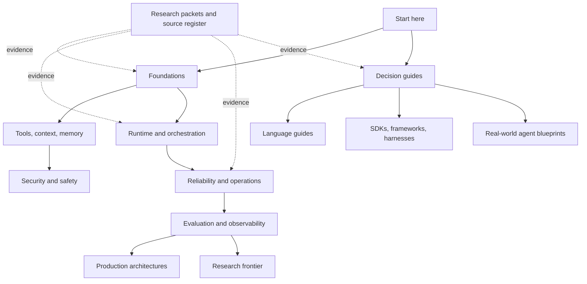

# Agent Master Guide & Playbook

> A research-driven, documentation-only knowledge base for designing, building, operating, debugging, evaluating, and improving production AI agents.

**Repository status:** production foundation available; deep SDK/framework/language expansion active
**Research baseline:** 2026-08-31  
**Content rule:** Markdown only; conceptual pseudocode is used sparingly and no runnable product code belongs here.

This repository compresses authoritative documentation, implementation evidence, engineering reports, papers, benchmarks, and carefully selected field experience into practical agent-engineering guidance. It is not a framework catalog, an example application, or a collection of copied vendor tutorials.

## Start here

| If you need to… | Begin with |
|---|---|
| Learn the field in a deliberate order | [Learning paths](START-HERE.md) |
| Decide whether a problem needs an agent | [Agentic systems: choose the minimum autonomy](docs/foundations/agentic-systems.md) |
| Understand the production control loop | [The production agent loop](docs/foundations/agent-loop.md) |
| Design a recoverable runtime | [Durable execution](docs/runtime/durable-execution.md) |
| Design run state, events, replay, and streaming | [Agent state and event contracts](docs/runtime/agent-state-and-event-contracts.md) |
| Choose a durable workflow runtime | [Temporal vs Restate vs DBOS vs Prefect vs Dapr](docs/comparisons/durable-agent-workflow-runtimes.md) |
| Prevent duplicate external actions | [Idempotency and side effects](docs/reliability/idempotency-and-side-effects.md) |
| Threat-model and contain an agent | [Agent threat model](docs/security/agent-threat-model.md) |
| Build a release-grade eval program | [Evaluation-driven development](docs/evaluation/evaluation-driven-development.md) |
| Design context, compaction, or memory | [Context and memory](docs/context-memory/README.md) |
| Design or operate a large tool catalog | [Tools and external capabilities](docs/tools/README.md) |
| Choose a runtime language | [Choosing an agent runtime language](docs/languages/choosing-an-agent-runtime-language.md) |
| Build or assess a Rust agent runtime | [Rust agent engineering](docs/languages/rust/README.md) |
| Choose Go, Python, or TypeScript/Node.js | [Go vs Python vs TypeScript/Node.js](docs/comparisons/go-vs-python-vs-typescript-node-agent-runtimes.md) |
| Build or assess a Go agent runtime deeply | [Go agent engineering](docs/languages/go/README.md) |
| Build or assess a Python agent runtime deeply | [Python agent engineering](docs/languages/python/README.md) |
| Build or assess TypeScript agent contracts deeply | [TypeScript agent engineering](docs/languages/typescript/README.md) |
| Build or assess a Node.js agent runtime deeply | [Node.js agent runtime engineering](docs/languages/nodejs/README.md) |
| Build or assess a Java/Kotlin agent runtime deeply | [JVM agent engineering](docs/languages/jvm/README.md) |
| Build or assess a C#/.NET agent runtime deeply | [C# and .NET agent engineering](docs/languages/csharp-dotnet/README.md) |
| Design a complete real-world agent system | [Real-world agent engineering blueprints](docs/agents/README.md) |
| Choose between Python and TypeScript/Node.js | [Python vs TypeScript/Node.js](docs/comparisons/python-vs-typescript-node-agent-runtimes.md) |
| Choose a provider-native agent framework | [Selecting a provider-native agent framework](docs/comparisons/provider-native-agent-frameworks.md) |
| Build or assess OpenAI Agents SDK deeply | [OpenAI Agents SDK production deep dive](docs/frameworks/openai-agents-sdk/README.md) |
| Build or assess Claude Agent SDK/Managed Agents deeply | [Claude and Anthropic agent ecosystem](docs/frameworks/claude-agent-sdk/README.md) |
| Build or assess Google ADK deeply | [Google ADK production playbook](docs/frameworks/google-adk/README.md) |
| Build or assess Microsoft Agent Framework deeply | [Microsoft Agent Framework production playbook](docs/frameworks/microsoft-agent-framework/README.md) |
| Choose an independent agent framework | [Selecting an independent agent framework](docs/comparisons/independent-agent-frameworks.md) |
| Build or assess Vercel AI SDK deeply | [Vercel AI SDK engineering guide](docs/frameworks/vercel-ai-sdk/README.md) |
| Build or assess Strands Agents deeply | [Strands Agents production engineering guide](docs/frameworks/strands-agents/README.md) |
| Build or assess Pydantic AI deeply | [Pydantic AI production playbook](docs/frameworks/pydantic-ai/README.md) |
| Build or assess LangGraph deeply | [LangGraph production playbook](docs/frameworks/langgraph/README.md) |
| Navigate framework migrations and fast-moving ecosystems | [Selecting across evolving agent frameworks](docs/comparisons/evolving-agent-framework-ecosystems.md) |
| Operate or retire a retained AutoGen estate | [AutoGen retained-production engineering guide](docs/frameworks/autogen/README.md) |
| Operate or migrate a Semantic Kernel estate | [Semantic Kernel retained-ecosystem guide](docs/frameworks/semantic-kernel/README.md) |
| Plan or coordinate multiple agents | [Orchestration and multi-agent systems](docs/orchestration/README.md) |
| Choose MCP, A2A, or AG-UI | [Selecting agent protocols](docs/protocols/protocol-selection.md) |
| Design queues, routing, capacity, or SLOs | [Production operations](docs/operations/README.md) |
| Design the platform control plane | [Production agent control plane](docs/architectures/production-agent-control-plane.md) |
| Separate interactive and long-running work | [Interactive and long-running architectures](docs/architectures/interactive-and-long-running-reference-architectures.md) |
| Choose an orchestration layer | [Custom loop vs framework vs workflow engine](docs/comparisons/custom-loop-vs-framework-vs-workflow-engine.md) |
| Browse every index | [Master indexes](docs/indexes/README.md) |
| Find a subject | [Topic index](docs/indexes/topic-index.md) |
| Find a technology | [Technology index](docs/indexes/technology-index.md) |
| Resolve an architectural choice | [Decision-guide index](docs/indexes/decision-index.md) |
| Inspect research depth or freshness | [Research hub](docs/research/README.md) |

## How the knowledge base is organized

| Area | Purpose | Current state |
|---|---|---|
| [Foundations](docs/foundations/README.md) | Stable concepts and architectural vocabulary | First deep guides available |
| [Tools](docs/tools/README.md) | Tool contracts, discovery, execution, and results | Research-backed contract and fleet core available |
| [Context and memory](docs/context-memory/README.md) | Context assembly, compaction, retrieval, and memory | Research-backed core available |
| [Runtime](docs/runtime/README.md) | Run control, state, durability, scheduling, and recovery | First deep guides available |
| [Orchestration](docs/orchestration/README.md) | Planning, delegation, concurrency, and multi-agent coordination | Research-backed core available |
| [Reliability](docs/reliability/README.md) | Failure analysis and recovery engineering | First deep guides available |
| [Security](docs/security/README.md) | Permissions, containment, untrusted data, and incident response | Research-backed core available |
| [Evaluation](docs/evaluation/README.md) | Evals, traces, metrics, replay, and feedback loops | Research-backed core available |
| [Operations](docs/operations/README.md) | Deployment, scaling, quotas, cost, and on-call practice | Research-backed core available |
| [Architectures](docs/architectures/README.md) | Complete production reference architectures | Research-backed platform core available |
| [Agent blueprints](docs/agents/README.md) | Workload-specific complete system designs | Fifty distinct zero-to-production categories in rolling construction and iterative review |
| [Frameworks and harnesses](docs/frameworks/README.md) | Technology-specific deep dives | Provider-native, independent, lifecycle, and durable-runtime clusters available |
| [Languages](docs/languages/README.md) | Runtime-specific production guidance | Selection guide plus deep Rust, Go, Python, TypeScript, Node.js, JVM, and C#/.NET playbooks |
| [Protocols](docs/protocols/README.md) | MCP, A2A, AG-UI, and adjacent boundaries | Research-backed core available |
| [Comparisons](docs/comparisons/README.md) | Explicit engineering choices and trade-offs | Runtime-layer, framework, lifecycle, and durable-engine decisions available |
| [Research frontier](docs/frontier/README.md) | Promising ideas with maturity labels | Research queue mapped |

“Queued” is intentional. This repository does not promote a shallow survey to a finished guide. The [coverage map](docs/research/coverage-map.md) distinguishes discovery, active research, research-backed drafts, and reviewed guidance.

## Editorial promises

- **Evidence before prose.** Major guides require a research packet covering official sources, implementation evidence, failure evidence, alternatives, and maturity.
- **Production semantics over feature lists.** A feature such as “persistence” is not treated as durability until its replay and side-effect guarantees are understood.
- **Disagreement stays visible.** Conflicting framework recommendations become explicit trade-offs, not an artificial consensus.
- **Freshness is inspectable.** Time-sensitive guides record research dates and sources; the source register records refresh triggers.
- **Simple is a valid conclusion.** Deterministic code, a single model call, or a short workflow often beats a more autonomous agent.
- **Claims are synthesized, not copied.** Vendor claims are attributed and cross-checked; benchmark and community evidence is assessed for leakage, incentives, and reproducibility.

See [Research and documentation method](docs/research/research-method.md) for the full quality gate. Before adding or promoting a guide, follow the [contribution and review checklist](CONTRIBUTING.md).

## Current research-backed guides

The [core agent runtime packet](docs/research/packets/core-agent-runtime.md) supports:

1. [Agentic systems: choose the minimum autonomy](docs/foundations/agentic-systems.md)
2. [The production agent loop](docs/foundations/agent-loop.md)
3. [Execution boundaries: brain, policy, hands, and session](docs/runtime/execution-boundaries.md)
4. [Run controls: budgets, stopping, timeouts, and cancellation](docs/runtime/run-controls.md)
5. [Durable execution for agents](docs/runtime/durable-execution.md)
6. [Tool contracts for nondeterministic callers](docs/tools/tool-contracts.md)
7. [Idempotency and side-effect safety](docs/reliability/idempotency-and-side-effects.md)
8. [Agent runtime failure taxonomy](docs/reliability/failure-taxonomy.md)
9. [Custom loop vs agent framework vs workflow engine](docs/comparisons/custom-loop-vs-framework-vs-workflow-engine.md)

The [security, evaluation, context, and memory packet](docs/research/packets/security-evaluation-context-memory.md) supports:

10. [Agent threat model](docs/security/agent-threat-model.md)
11. [Prompt injection and untrusted data](docs/security/prompt-injection-and-untrusted-data.md)
12. [Permissions, sandboxing, and secrets](docs/security/permissions-sandboxing-and-secrets.md)
13. [Evaluation-driven development](docs/evaluation/evaluation-driven-development.md)
14. [Trajectory and reliability evaluation](docs/evaluation/trajectory-and-reliability-evaluation.md)
15. [Observability and tracing](docs/evaluation/observability-and-tracing.md)
16. [Context engineering](docs/context-memory/context-engineering.md)
17. [Compaction and continuity](docs/context-memory/compaction-and-continuity.md)
18. [Memory architecture](docs/context-memory/memory-architecture.md)

The [orchestration and protocols packet](docs/research/packets/orchestration-and-protocols.md) supports:

19. [Planning and replanning](docs/orchestration/planning-and-replanning.md)
20. [Multi-agent topologies](docs/orchestration/multi-agent-topologies.md)
21. [Delegation, handoffs, and shared state](docs/orchestration/delegation-handoffs-and-shared-state.md)
22. [Selecting agent protocols](docs/protocols/protocol-selection.md)
23. [Model Context Protocol](docs/protocols/model-context-protocol.md)
24. [Agent2Agent protocol](docs/protocols/agent-to-agent-protocol.md)
25. [Agent-user interaction with AG-UI](docs/protocols/agent-user-interaction-protocol.md)

The [production operations and architectures packet](docs/research/packets/production-operations-and-architectures.md) supports:

26. [Queues, scheduling, and backpressure](docs/operations/queues-scheduling-and-backpressure.md)
27. [Model routing, cost, and latency](docs/operations/model-routing-cost-and-latency.md)
28. [Scaling, capacity, and SLOs](docs/operations/scaling-capacity-and-slos.md)
29. [Deployment, release, and incident response](docs/operations/deployment-release-and-incident-response.md)
30. [Production agent control plane](docs/architectures/production-agent-control-plane.md)
31. [Interactive and long-running reference architectures](docs/architectures/interactive-and-long-running-reference-architectures.md)

The [tool fleet engineering packet](docs/research/packets/tool-fleet-engineering.md) supports:

32. [Tool discovery and selection](docs/tools/tool-discovery-and-selection.md)
33. [Tool registries, versioning, and lifecycle](docs/tools/tool-registries-versioning-and-lifecycle.md)
34. [Tool results, artifacts, and provenance](docs/tools/tool-results-artifacts-and-provenance.md)
35. [Tool fleet operations](docs/tools/tool-fleet-operations.md)

The [runtime language selection packet](docs/research/packets/runtime-language-selection.md) supports:

36. [Choosing an agent runtime language](docs/languages/choosing-an-agent-runtime-language.md)

The [provider-native agent frameworks packet](docs/research/packets/provider-native-agent-frameworks.md) supports:

37. [Selecting a provider-native agent framework](docs/comparisons/provider-native-agent-frameworks.md)
38. [OpenAI Agents SDK in production](docs/frameworks/openai-agents-sdk.md)
39. [Claude Agent SDK and Managed Agents in production](docs/frameworks/claude-agent-sdk-and-managed-agents.md)
40. [Google Agent Development Kit in production](docs/frameworks/google-adk.md)
41. [Microsoft Agent Framework in production](docs/frameworks/microsoft-agent-framework.md)

The [independent agent frameworks packet](docs/research/packets/independent-agent-frameworks.md) supports:

42. [Selecting an independent agent framework](docs/comparisons/independent-agent-frameworks.md)
43. [LangChain, LangGraph, and Deep Agents in production](docs/frameworks/langchain-langgraph-and-deep-agents.md)
44. [Pydantic AI in production](docs/frameworks/pydantic-ai.md)
45. [Vercel AI SDK in production](docs/frameworks/vercel-ai-sdk.md)
46. [Strands Agents in production](docs/frameworks/strands-agents.md)

The [framework lifecycle and second-wave ecosystem packet](docs/research/packets/framework-lifecycle-and-second-wave.md) supports:

47. [Selecting across evolving agent framework ecosystems](docs/comparisons/evolving-agent-framework-ecosystems.md)
48. [Migrating AutoGen and Semantic Kernel agent systems](docs/frameworks/autogen-and-semantic-kernel-migration.md)
49. [CrewAI in production](docs/frameworks/crewai.md)
50. [LlamaIndex and LlamaAgents in production](docs/frameworks/llamaindex-and-llamaagents.md)
51. [Mastra in production](docs/frameworks/mastra.md)
52. [DeepSeek Harness architecture and safety boundary](docs/frameworks/deepseek-harness.md)

The [durable agent workflow runtimes packet](docs/research/packets/durable-agent-workflow-runtimes.md) supports:

53. [Selecting a durable runtime for agent workflows](docs/comparisons/durable-agent-workflow-runtimes.md)
54. [Temporal for agent workflows](docs/frameworks/temporal-for-agent-workflows.md)
55. [Restate for agent workflows](docs/frameworks/restate-for-agent-workflows.md)
56. [DBOS for agent workflows](docs/frameworks/dbos-for-agent-workflows.md)
57. [Prefect for agent workflows](docs/frameworks/prefect-for-agent-workflows.md)
58. [Dapr Workflow for agent workflows](docs/frameworks/dapr-workflow-for-agent-workflows.md)

The [Python and TypeScript/Node.js agent runtimes packet](docs/research/packets/python-and-typescript-agent-runtimes.md) supports:

59. [Python agent runtimes in production](docs/languages/python-agent-runtimes.md)
60. [TypeScript and Node.js agent runtimes in production](docs/languages/typescript-node-agent-runtimes.md)
61. [Python vs TypeScript/Node.js for agent runtimes](docs/comparisons/python-vs-typescript-node-agent-runtimes.md)

The [Go agent runtimes packet](docs/research/packets/go-agent-runtimes.md) supports:

62. [Go agent runtimes in production](docs/languages/go-agent-runtimes.md)
63. [Go vs Python vs TypeScript/Node.js for agent runtimes](docs/comparisons/go-vs-python-vs-typescript-node-agent-runtimes.md)

The [agent state and event contracts packet](docs/research/packets/agent-state-and-event-contracts.md) supports:

64. [Agent state and event contracts](docs/runtime/agent-state-and-event-contracts.md)

The first completed multi-guide expansion areas are:

65. [LangGraph production playbook](docs/frameworks/langgraph/README.md)
66. [Rust agent engineering](docs/languages/rust/README.md)
67. [OpenAI Agents SDK production deep dive](docs/frameworks/openai-agents-sdk/README.md)
68. [Vercel AI SDK engineering guide](docs/frameworks/vercel-ai-sdk/README.md)
69. [Strands Agents production engineering guide](docs/frameworks/strands-agents/README.md)
70. [Pydantic AI production playbook](docs/frameworks/pydantic-ai/README.md)
71. [Claude Agent SDK and Anthropic agent ecosystem](docs/frameworks/claude-agent-sdk/README.md)
72. [Google ADK production playbook](docs/frameworks/google-adk/README.md)
73. [AutoGen retained-production engineering guide](docs/frameworks/autogen/README.md)
74. [Go agent engineering](docs/languages/go/README.md)
75. [CrewAI production engineering playbook](docs/frameworks/crewai/README.md)
76. [Mastra production engineering guide](docs/frameworks/mastra/README.md)
77. [LlamaIndex and LlamaAgents engineering guide](docs/frameworks/llamaindex-llamaagents/README.md)
78. [DeepSeek Harness production-minded preview guide](docs/frameworks/deepseek-harness/README.md)
79. [Microsoft Agent Framework production playbook](docs/frameworks/microsoft-agent-framework/README.md)
80. [Semantic Kernel retained-ecosystem guide](docs/frameworks/semantic-kernel/README.md)
81. [Python agent engineering](docs/languages/python/README.md)
82. [TypeScript agent engineering](docs/languages/typescript/README.md)
83. [Node.js agent runtime engineering](docs/languages/nodejs/README.md)
84. [JVM agent engineering](docs/languages/jvm/README.md)
85. [C# and .NET agent engineering](docs/languages/csharp-dotnet/README.md)
86. [Production coding-agent blueprint](docs/agents/coding-agent/README.md)
87. [DevOps and deployment-agent blueprint](docs/agents/devops-deployment-agent/README.md)
88. [Infrastructure-operations agent blueprint](docs/agents/infrastructure-operations-agent/README.md)
89. [Enterprise-knowledge agent blueprint](docs/agents/enterprise-knowledge-agent/README.md)
90. [SRE incident-response agent blueprint](docs/agents/sre-incident-response-agent/README.md)
91. [Sales and revenue-operations agent blueprint](docs/agents/sales-revenue-operations-agent/README.md)
92. [Deep-research agent blueprint](docs/agents/deep-research-agent/README.md)
93. [Back-office workflow-agent blueprint](docs/agents/back-office-workflow-agent/README.md)
94. [Browser-automation agent blueprint](docs/agents/browser-automation-agent/README.md)
95. [Computer-use agent blueprint](docs/agents/computer-use-agent/README.md)
96. [Database-operations agent blueprint](docs/agents/database-operations-agent/README.md)
97. [Analytics-agent blueprint](docs/agents/analytics-agent/README.md)
98. [Security-investigation agent blueprint](docs/agents/security-investigation-agent/README.md)
99. [Executive-operations agent blueprint](docs/agents/executive-operations-agent/README.md)
100. [FinOps and cloud-cost optimization agent blueprint](docs/agents/finops-cloud-cost-agent/README.md)
101. [Document-intelligence agent blueprint](docs/agents/document-intelligence-agent/README.md)
102. [Vulnerability-remediation agent blueprint](docs/agents/vulnerability-remediation-agent/README.md)
103. [Test and quality-engineering agent blueprint](docs/agents/test-quality-engineering-agent/README.md)
104. [Network-operations agent blueprint](docs/agents/network-operations-agent/README.md)
105. [Data-pipeline and DataOps agent blueprint](docs/agents/data-pipeline-operations-agent/README.md)
106. [MLOps and model-operations agent blueprint](docs/agents/mlops-model-operations-agent/README.md)
107. [Patent and intellectual-property research agent blueprint](docs/agents/patent-ip-research-agent/README.md)
108. [IT service-desk and endpoint-support agent blueprint](docs/agents/it-service-desk-agent/README.md)
109. [Identity and access-governance agent blueprint](docs/agents/identity-access-governance-agent/README.md)
110. [Compliance-audit and control-evidence agent blueprint](docs/agents/compliance-audit-agent/README.md)
111. [Competitive and market-intelligence agent blueprint](docs/agents/competitive-market-intelligence-agent/README.md)
112. [Customer-support and service-resolution agent blueprint](docs/agents/customer-support-agent/README.md)
113. [Business-intelligence monitoring and decision-operations agent blueprint](docs/agents/business-intelligence-monitoring-agent/README.md)
114. [Procurement and strategic-sourcing agent blueprint](docs/agents/procurement-sourcing-agent/README.md)
115. [Scientific-research and laboratory-operations agent blueprint](docs/agents/scientific-research-agent/README.md)
116. [HR and talent-operations agent blueprint](docs/agents/hr-talent-operations-agent/README.md)
117. [Regulatory-intelligence agent blueprint](docs/agents/regulatory-intelligence-agent/README.md)
118. [Investigative-journalism and source-verification agent blueprint](docs/agents/investigative-journalism-agent/README.md)
119. [Clinical-trial operations agent blueprint](docs/agents/clinical-trial-operations-agent/README.md)
120. [Knowledge-graph and data-catalog stewardship agent blueprint](docs/agents/knowledge-graph-stewardship-agent/README.md)
121. [Fraud and AML investigation agent blueprint](docs/agents/fraud-aml-investigation-agent/README.md)
122. [Marketing campaign-operations agent blueprint](docs/agents/marketing-operations-agent/README.md)
123. [E-commerce merchandising and operations agent blueprint](docs/agents/ecommerce-operations-agent/README.md)
124. [Supply-chain and logistics operations agent blueprint](docs/agents/supply-chain-logistics-agent/README.md)
125. [Real-estate and property operations agent blueprint](docs/agents/real-estate-property-operations-agent/README.md)
126. [Legal matter and contract-operations agent blueprint](docs/agents/legal-contract-operations-agent/README.md)
127. [Finance and accounting operations agent blueprint](docs/agents/finance-accounting-agent/README.md)
128. [Insurance claims operations agent blueprint](docs/agents/insurance-claims-agent/README.md)
129. [Healthcare care-coordination agent blueprint](docs/agents/healthcare-care-coordination-agent/README.md)
130. [Travel planning and booking-operations agent blueprint](docs/agents/travel-booking-agent/README.md)
131. [Manufacturing maintenance and quality agent blueprint](docs/agents/manufacturing-maintenance-quality-agent/README.md)
132. [Energy and utilities operations agent blueprint](docs/agents/energy-utilities-operations-agent/README.md)
133. [Education and tutoring agent blueprint](docs/agents/education-tutoring-agent/README.md)
134. [Content production and editorial-operations agent blueprint](docs/agents/content-editorial-agent/README.md)
135. [Localization and transcreation agent blueprint](docs/agents/localization-transcreation-agent/README.md)
