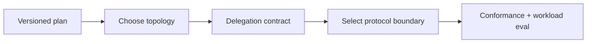
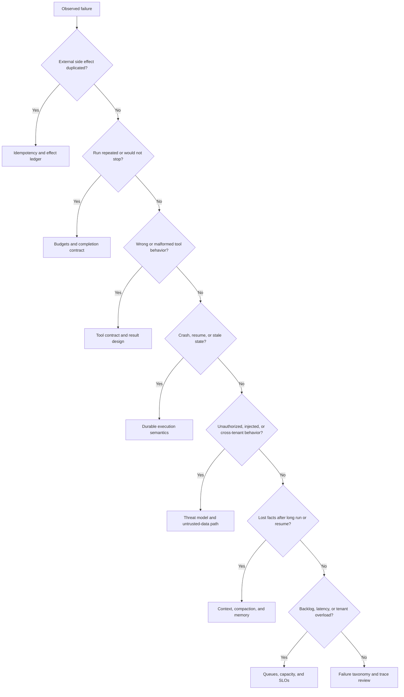
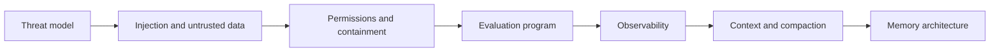
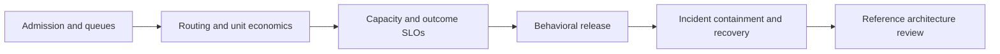

# Start Here

**Last updated:** 2026-08-31

Use a path that matches the decision you are trying to make. The repository is designed for nonlinear lookup, but the sequences below prevent advanced machinery from obscuring basic boundaries.

## Path 1 — New to production agents

```mermaid
flowchart LR
    A["Agent or ordinary software?"] --> B["Production agent loop"]
    B --> C["Tool contracts"]
    C --> D["Execution boundaries"]
    D --> E["Run controls"]
    E --> F["Reliability failures"]
    F --> G["Threat model and containment"]
    G --> H["Evaluation-driven development"]
    H --> I["Context, compaction, and memory"]
    I --> J["Planning and orchestration"]
    J --> K["Protocol boundaries"]
    K --> L["Operations and architectures"]
```

1. [Agentic systems: choose the minimum autonomy](docs/foundations/agentic-systems.md)
2. [The production agent loop](docs/foundations/agent-loop.md)
3. [Tool contracts for nondeterministic callers](docs/tools/tool-contracts.md)
4. [Execution boundaries](docs/runtime/execution-boundaries.md)
5. [Run controls](docs/runtime/run-controls.md)
6. [Agent runtime failure taxonomy](docs/reliability/failure-taxonomy.md)
7. [Agent threat model](docs/security/agent-threat-model.md)
8. [Evaluation-driven development](docs/evaluation/evaluation-driven-development.md)
9. [Context engineering](docs/context-memory/context-engineering.md)
10. [Memory architecture](docs/context-memory/memory-architecture.md)
11. [Planning and replanning](docs/orchestration/planning-and-replanning.md)
12. [Multi-agent topologies](docs/orchestration/multi-agent-topologies.md)
13. [Selecting agent protocols](docs/protocols/protocol-selection.md)
14. [Queues, scheduling, and backpressure](docs/operations/queues-scheduling-and-backpressure.md)
15. [Production agent control plane](docs/architectures/production-agent-control-plane.md)
16. [Tool discovery and selection](docs/tools/tool-discovery-and-selection.md)

## Path 2 — Taking a prototype to production

1. Identify the current execution model in [Custom loop vs framework vs workflow engine](docs/comparisons/custom-loop-vs-framework-vs-workflow-engine.md).
2. Add explicit limits using [Run controls](docs/runtime/run-controls.md).
3. Classify every external write with [Idempotency and side effects](docs/reliability/idempotency-and-side-effects.md).
4. Decide whether the task needs [Durable execution](docs/runtime/durable-execution.md).
5. Define authoritative run identity, state transitions, terminal events, and replay using [Agent state and event contracts](docs/runtime/agent-state-and-event-contracts.md).
6. Use the [failure taxonomy](docs/reliability/failure-taxonomy.md) as a pre-production review.
7. Bound authority and blast radius with the [agent threat model](docs/security/agent-threat-model.md) and [permissions, sandboxing, and secrets](docs/security/permissions-sandboxing-and-secrets.md).
8. Create release gates with [evaluation-driven development](docs/evaluation/evaluation-driven-development.md) and instrument the system using [observability and tracing](docs/evaluation/observability-and-tracing.md).
9. Design the working information layer with [context engineering](docs/context-memory/context-engineering.md), [compaction and continuity](docs/context-memory/compaction-and-continuity.md), and [memory architecture](docs/context-memory/memory-architecture.md).
10. Express task graphs and delegation with [planning and replanning](docs/orchestration/planning-and-replanning.md), [multi-agent topologies](docs/orchestration/multi-agent-topologies.md), and [delegation, handoffs, and shared state](docs/orchestration/delegation-handoffs-and-shared-state.md).
11. If the system crosses standardized boundaries, use [protocol selection](docs/protocols/protocol-selection.md) before the [MCP](docs/protocols/model-context-protocol.md), [A2A](docs/protocols/agent-to-agent-protocol.md), or [AG-UI](docs/protocols/agent-user-interaction-protocol.md) deep dive.
12. Design admission and overload with [queues, scheduling, and backpressure](docs/operations/queues-scheduling-and-backpressure.md), then route and budget work using [model routing, cost, and latency](docs/operations/model-routing-cost-and-latency.md).
13. Set outcome promises and capacity policy with [scaling, capacity, and SLOs](docs/operations/scaling-capacity-and-slos.md).
14. Build the behavioral release and incident path with [deployment, release, and incident response](docs/operations/deployment-release-and-incident-response.md).
15. Review the assembled [production control plane](docs/architectures/production-agent-control-plane.md) and select the [interactive or durable execution shape](docs/architectures/interactive-and-long-running-reference-architectures.md).
16. If the catalog extends beyond a small fixed set, add [tool discovery](docs/tools/tool-discovery-and-selection.md), [versioned registry lifecycle](docs/tools/tool-registries-versioning-and-lifecycle.md), [evidence-bearing results](docs/tools/tool-results-artifacts-and-provenance.md), and [fleet operations](docs/tools/tool-fleet-operations.md).

## Path 3 — Choosing a stack

1. Start with the actual abstraction choice: [custom loop vs framework vs workflow engine](docs/comparisons/custom-loop-vs-framework-vs-workflow-engine.md).
2. Select the serving/runtime boundary using [Choosing an agent runtime language](docs/languages/choosing-an-agent-runtime-language.md).
3. If Rust is a serious candidate, use the [Rust agent-engineering playbook](docs/languages/rust/README.md) to verify Tokio ownership, cancellation, protocol/SDK maturity, isolation, durability, and operations.
4. If Java or Kotlin is a serious candidate, use the [JVM agent-engineering playbook](docs/languages/jvm/README.md) to choose virtual threads versus coroutines, preserve cancellation and effect contracts, and verify provider/framework maturity.
5. If C#/.NET is a serious candidate, use the [C# and .NET agent-engineering playbook](docs/languages/csharp-dotnet/README.md) to verify task ownership, cancellation, channels, effects, hosting, Azure/MCP/Agent Framework maturity, and operations.
6. If Go, Python, or TypeScript/Node.js is a serious candidate, use their [three-runtime comparison](docs/comparisons/go-vs-python-vs-typescript-node-agent-runtimes.md), then read the deep [Go](docs/languages/go/README.md), [Python](docs/languages/python/README.md), or [TypeScript](docs/languages/typescript/README.md) playbook. Pair TypeScript with the deep [Node.js runtime playbook](docs/languages/nodejs/README.md); use the [concise overview](docs/languages/typescript-node-agent-runtimes.md) for selection context.
7. If the choice is only Python versus TypeScript/Node.js, use their more focused [direct comparison](docs/comparisons/python-vs-typescript-node-agent-runtimes.md).
8. If a provider-native runtime fits, use [Selecting a provider-native agent framework](docs/comparisons/provider-native-agent-frameworks.md), then read the selected technology deep dive, including the [Microsoft Agent Framework production playbook](docs/frameworks/microsoft-agent-framework/README.md) for MAF estates.
9. If the runtime should remain provider-independent, use [Selecting an independent agent framework](docs/comparisons/independent-agent-frameworks.md), then read the selected technology deep dive.
10. For CrewAI, Mastra, LlamaIndex/LlamaAgents, DeepSeek Harness, or retained AutoGen/Semantic Kernel estates, start with the [evolving ecosystem decision guide](docs/comparisons/evolving-agent-framework-ecosystems.md), then use the [CrewAI](docs/frameworks/crewai/README.md), [Mastra](docs/frameworks/mastra/README.md), [LlamaIndex/LlamaAgents](docs/frameworks/llamaindex-llamaagents/README.md), [DeepSeek Harness](docs/frameworks/deepseek-harness/README.md), [AutoGen](docs/frameworks/autogen/README.md), or [Semantic Kernel](docs/frameworks/semantic-kernel/README.md) deep area. The DeepSeek area is an adoption/safety guide, not a production endorsement.
11. If execution must survive long waits, process loss, or redeployments, use the [durable runtime decision guide](docs/comparisons/durable-agent-workflow-runtimes.md) before selecting Temporal, Restate, DBOS, Prefect, or Dapr Workflow.
12. Inspect [framework categories and current ecosystem](docs/frameworks/README.md); do not compare a protocol to an SDK or a harness to a workflow engine as if they were substitutes.
13. Use the [technology index](docs/indexes/technology-index.md) to locate researched status and primary sources.
14. Treat entries marked **discovery** as a research lead, not a selection recommendation.

## Path 4 — Planning, multi-agent systems, and protocols

1. [Planning and replanning](docs/orchestration/planning-and-replanning.md)
2. [Multi-agent topologies](docs/orchestration/multi-agent-topologies.md)
3. [Delegation, handoffs, and shared state](docs/orchestration/delegation-handoffs-and-shared-state.md)
4. [Selecting agent protocols](docs/protocols/protocol-selection.md)
5. Choose the relevant deep dive: [MCP](docs/protocols/model-context-protocol.md), [A2A](docs/protocols/agent-to-agent-protocol.md), or [AG-UI](docs/protocols/agent-user-interaction-protocol.md).

## Path 5 — Diagnosing a failing agent

- [Idempotency and side-effect safety](docs/reliability/idempotency-and-side-effects.md)
- [Run controls](docs/runtime/run-controls.md)
- [Tool contracts](docs/tools/tool-contracts.md)
- [Durable execution](docs/runtime/durable-execution.md)
- [Failure taxonomy](docs/reliability/failure-taxonomy.md)
- [Agent threat model](docs/security/agent-threat-model.md)
- [Observability and tracing](docs/evaluation/observability-and-tracing.md)
- [Context and memory](docs/context-memory/README.md)
- [Queues, scheduling, and backpressure](docs/operations/queues-scheduling-and-backpressure.md)
- [Scaling, capacity, and SLOs](docs/operations/scaling-capacity-and-slos.md)

## Path 6 — Security, evaluation, and long-running state

1. [Agent threat model](docs/security/agent-threat-model.md)
2. [Prompt injection and untrusted data](docs/security/prompt-injection-and-untrusted-data.md)
3. [Permissions, sandboxing, and secrets](docs/security/permissions-sandboxing-and-secrets.md)
4. [Evaluation-driven development](docs/evaluation/evaluation-driven-development.md)
5. [Trajectory and reliability evaluation](docs/evaluation/trajectory-and-reliability-evaluation.md)
6. [Observability and tracing](docs/evaluation/observability-and-tracing.md)
7. [Context engineering](docs/context-memory/context-engineering.md)
8. [Compaction and continuity](docs/context-memory/compaction-and-continuity.md)
9. [Memory architecture](docs/context-memory/memory-architecture.md)

## Path 7 — Operating and releasing a production agent

1. [Queues, scheduling, and backpressure](docs/operations/queues-scheduling-and-backpressure.md)
2. [Model routing, cost, and latency](docs/operations/model-routing-cost-and-latency.md)
3. [Scaling, capacity, and SLOs](docs/operations/scaling-capacity-and-slos.md)
4. [Deployment, release, and incident response](docs/operations/deployment-release-and-incident-response.md)
5. [Production agent control plane](docs/architectures/production-agent-control-plane.md)
6. [Interactive and long-running reference architectures](docs/architectures/interactive-and-long-running-reference-architectures.md)

## Path 8 — Building a specific real-world agent

1. Start at the [real-world agent engineering blueprint hub](docs/agents/README.md).
2. Confirm that model-directed autonomy is justified; keep deterministic work deterministic.
3. Choose the workload category by environment, authority, state/recovery, evaluation, and deployment—not by a marketing label.
4. Read the complete blueprint once it is marked reviewed, then follow its custom, framework, or hybrid architecture decision.
5. Use the linked canonical runtime, tools, context/memory, security, reliability, evaluation, and operations guides for reusable invariants.
6. Treat active-research folders as review material until their usefulness, production/security, and contradiction passes are complete.

## Reading status labels

| Label | Meaning | Safe use |
|---|---|---|
| **Reviewed** | Research packet complete and guide checked for evidence, links, and contradictions | Architectural decisions, with normal local validation |
| **Research-backed draft** | Broad packet complete; guide may still gain examples or framework-specific nuance | Design input, not a substitute for workload evals |
| **Active research** | Sources are being synthesized; conclusions are not stable | Follow the packet, do not cite as repository guidance |
| **Discovery** | Scope and primary sources identified only | Research navigation only |
| **Refresh due** | Material may have changed after the recorded source versions | Re-research before use |

No status label means the document is an index or navigation page, not a completed technical guide.
