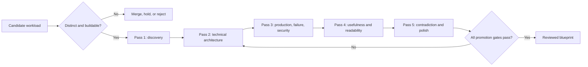

# Real-World Agent Engineering Blueprints

**Program baseline:** 2026-08-31  
**Status:** 50-category baseline complete; review maturity is tracked per category

This area answers a workload question rather than a technology question:

> If a team must build this kind of production agent, what complete system should it design, secure, evaluate, deploy, and operate?

A framework guide explains how a runtime behaves. A language guide explains how a language changes implementation and operations. A blueprint combines those choices with workload-specific tools, authority, state, recovery, evaluation, cost, and deployment guidance.

The full promotion and review standard is the [real-world agent blueprint expansion program](../research/agent-blueprint-expansion-program.md). The [50-category registry](../research/agent-blueprint-category-registry.md) records every workload, its closest overlap, its distinct production boundary, and its review state. All fifty folders are integrated; labels such as “Pass 2 active” describe the depth of a future review, not a background worker or an implied autonomous update.

The [public agent-engineering landscape benchmark](../research/packets/public-agent-engineering-landscape.md) records what existing documentation classes do well and where complete workload playbooks remain missing. The [cross-cutting blueprint controls packet](../research/packets/agent-blueprint-cross-cutting-controls.md) supplies shared D0–D4 effect danger tiers and acceptance/failure tests that every workload must specialize.

## What belongs here

A blueprint qualifies only when the system:

- makes consequential runtime decisions about planning, evidence, tools, or recovery;
- interacts with a repository, host, browser, desktop, database, incident system, or business environment;
- owns a multi-step lifecycle with cancellation, partial progress, and completion evidence;
- has a workload-specific authority, failure, recovery, and evaluation model.

An FAQ bot, one-turn assistant, or fixed retrieval-and-response flow does not qualify merely because it uses a language model. The blueprint must also explain when ordinary software or a deterministic workflow is the better design.

## Current coverage and review state

The initial 15 categories and subsequent additions formed the construction wave. The full 50-category baseline is now present; the [master registry](../research/agent-blueprint-category-registry.md) preserves the review state for deliberate future work without changing the established taxonomy.

| Blueprint | Distinct production boundary | Current state |
|---|---|---|
| [Coding / software engineering](coding-agent/README.md) | Repository edits, tests, terminal execution, patch provenance, sandbox and supply chain | Pass 2 complete; production/security review pending |
| [Test and quality engineering](test-quality-engineering-agent/README.md) | Independent test design, fixtures/environments, defect reproduction, flaky-test evidence, nonfunctional validation and release-quality recommendations | Pass 2 complete; production/security review pending |
| [Infrastructure operations](infrastructure-operations-agent/README.md) | Privileged host/cloud actions, desired state, narrow blast radius, rollback and break-glass | Pass 2 complete; production/security review pending |
| [SRE incident response](sre-incident-response-agent/README.md) | Evidence under time pressure, hypothesis management, incident command and remediation authority | Pass 2 complete; production/security review pending |
| [Network operations](network-operations-agent/README.md) | Topology, routing, DNS, certificates, traffic policy, packet/flow evidence, staged configuration and connectivity rollback | Pass 2 complete; production/security review pending |
| [Deep research](deep-research-agent/README.md) | Search strategy, evidence ledger, claim verification, contradiction and citation integrity | Pass 2 complete; production/security review pending |
| [Browser automation](browser-automation-agent/README.md) | Untrusted page content, authenticated browser state, transactional actions and reconnect | Pass 2 complete; production/security review pending |
| [Computer use / desktop](computer-use-agent/README.md) | Visual uncertainty, OS/application permissions, focus, stale-screen detection and isolation | Pass 2 active |
| [Database operations](database-operations-agent/README.md) | Query/schema authority, transactions, locks, migrations, repair and audit | Pass 2 complete; production/security review pending |
| [Data pipeline and DataOps](data-pipeline-operations-agent/README.md) | Ingestion/transform DAGs, schema evolution, backfills, lineage, data-quality quarantine and pipeline recovery | Pass 2 complete; production/security review pending |
| [MLOps / model operations](mlops-model-operations-agent/README.md) | Model registry, behavioral evaluation artifacts, serving rollout, drift, rollback and model/data lineage | Pass 2 active |
| [FinOps / cloud-cost optimization](finops-cloud-cost-agent/README.md) | Cost allocation, anomaly evidence, forecasting, safe optimization proposals and realized-savings verification | Pass 2 active |
| [IT service desk / endpoint support](it-service-desk-agent/README.md) | Authenticated tickets, endpoint diagnosis, remote-action consent, account-recovery handoff and escalation | Pass 2 active |
| [Analytics](analytics-agent/README.md) | Governed data discovery, metric semantics, executable analysis, statistical validity and lineage | Pass 2 complete; production/security review pending |
| [DevOps / deployment](devops-deployment-agent/README.md) | Build provenance, policy gates, environment promotion, rollout and rollback | Pass 2 complete; production/security review pending |
| [Security investigation / SOC triage](security-investigation-agent/README.md) | Adversarial evidence, containment authority, chain of custody and false-positive cost | Pass 2 complete; production/security review pending |
| [Vulnerability remediation / security engineering](vulnerability-remediation-agent/README.md) | Finding validation, exploitability evidence, safe patching, compensating controls and remediation proof | Pass 2 active |
| [Identity and access governance](identity-access-governance-agent/README.md) | Entitlement graph, joiner/mover/leaver state, access reviews, separation of duties, time-bound grants and revocation proof | Pass 2 active |
| [Compliance audit / control evidence](compliance-audit-agent/README.md) | Control mapping, evidence sampling, exception state, reviewer independence, attestation support and audit lineage | Pass 2 complete; production/security review pending |
| [Enterprise knowledge](enterprise-knowledge-agent/README.md) | Access-aware retrieval, corpus freshness, evidence, tenant and data-governance boundaries | Pass 2 complete; production/security review pending |
| [Business-intelligence monitoring / decision ops](business-intelligence-monitoring-agent/README.md) | Persistent metric state, semantic contracts, anomaly detection, threshold workflows, routing and realized outcomes | Pass 2 complete; production/security review pending |
| [Competitive / market intelligence](competitive-market-intelligence-agent/README.md) | Watchlists, lawful source monitoring, market-change evidence, scenarios, freshness and executive briefing | Pass 2 complete; production/security review pending |
| [Scientific research / laboratory operations](scientific-research-agent/README.md) | Hypothesis and experiment state, protocols, instrument/simulation tools, reproducibility, uncertainty and research artifacts | Pass 2 complete; production/security review pending |
| [Patent / intellectual-property research](patent-ip-research-agent/README.md) | Claim elements, classifications, family and legal-status evidence, prior-art search, date/jurisdiction boundaries and attorney review | Pass 2 active |
| [Regulatory intelligence](regulatory-intelligence-agent/README.md) | Jurisdiction/product applicability, official rule changes, effective dates, obligation candidates, interpretation uncertainty and policy handoff | Pass 2 complete; production/security review pending |
| [Investigative journalism / source verification](investigative-journalism-agent/README.md) | Confidential-source protection, authenticity, entity/timeline reconciliation, public-interest and publication-review evidence | Pass 2 complete; production/security review pending |
| [Knowledge graph / data-catalog stewardship](knowledge-graph-stewardship-agent/README.md) | Entity resolution, ontology and schema governance, lineage, merge/split provenance, curator approval and quality repair | Pass 2 active |
| [Customer support / service resolution](customer-support-agent/README.md) | Authenticated customer and case state, policy-grounded troubleshooting, refund/credit authority, channel continuity, escalation and outcome reconciliation | Pass 2 complete; production/security review pending |
| [Executive / personal operations](executive-operations-agent/README.md) | Cross-application authority, privacy, delegation and confirmation | Pass 2 active |
| [HR / talent operations](hr-talent-operations-agent/README.md) | Candidate and employee lifecycle, sensitive records, fairness and accessibility, policy consistency, human decision ownership, HRIS/ATS integrations and reconciliation | Pass 2 complete; production/security review pending |
| [Sales / revenue operations](sales-revenue-operations-agent/README.md) | CRM state, outreach authority, compliance, attribution and reconciliation | Pass 2 complete; production/security review pending |
| [Marketing / campaign operations](marketing-operations-agent/README.md) | Audience and consent state, brand/content review, channel publication, experiment and spend controls, attribution and lead handoff | Pass 2 complete; production/security review pending |
| [Document intelligence](document-intelligence-agent/README.md) | Multimodal extraction, lineage, schema validation and exception queues | Pass 2 complete; production/security review pending |
| [Back-office workflow operations](back-office-workflow-agent/README.md) | Long-running cases, approvals, business rules, multi-system effects and reconciliation | Pass 2 active |
| [Procurement / strategic sourcing](procurement-sourcing-agent/README.md) | Requisitions, supplier discovery and due diligence, bid comparison, conflict controls, approvals, award and contract handoff | Pass 2 complete; production/security review pending |
| [Supply-chain / logistics operations](supply-chain-logistics-agent/README.md) | Order, shipment and inventory state, constraints, carrier/warehouse coordination, ETA uncertainty, exception recovery and reconciliation | Pass 2 active |
| [Legal matter / contract operations](legal-contract-operations-agent/README.md) | Matter and counterparty identity, privilege, clause/redline and obligation lifecycle, jurisdiction, attorney approval, signature handoff, deadlines and legal hold | Pass 2 active |
| [Finance / accounting operations](finance-accounting-agent/README.md) | Ledger and subledger truth, period close, journal proposals, matching and reconciliation, materiality, segregation of duties, approvals and audit evidence | Pass 2 active |
| [Insurance claims operations](insurance-claims-agent/README.md) | Policy and claim identity, first notice of loss, coverage evidence, reserves and adjudication support, regulated communications, fraud referral, effects and catastrophe-scale recovery | Pass 2 complete; production/security review pending |
| [Fraud / AML investigation](fraud-aml-investigation-agent/README.md) | Customer/account/transaction networks, typologies, alert and case state, KYC/CDD evidence, filing/escalation gates, privacy, investigator decisions and reconciliation | Pass 2 complete; production/security review pending |
| [Healthcare care coordination](healthcare-care-coordination-agent/README.md) | Patient identity and consent, scheduling/referrals/prior authorization, care-plan tasks, protected health data, clinician ownership, safety escalation and reconciliation | Pass 2 active |
| [Pharmaceutical / clinical-trial operations](clinical-trial-operations-agent/README.md) | Protocol, site and participant state, consent/eligibility workflow, regulated records, deviations, monitoring, safety-report preparation, data integrity and inspection readiness | Pass 2 complete; production/security review pending |
| [E-commerce merchandising / operations](ecommerce-operations-agent/README.md) | Catalog, offers, channel projections, inventory signals, pricing and promotion guardrails, content quality, returns signals and marketplace reconciliation | Pass 2 active |
| [Travel planning / booking operations](travel-booking-agent/README.md) | Itinerary and traveler truth, quote freshness, fare/rate rules, bookings, ticketing, changes, cancellations, refunds, supplier failures and reconciliation | Pass 2 active |
| [Real-estate / property operations](real-estate-property-operations-agent/README.md) | Property, unit, occupancy, lease and work-order truth, tenant communications, vendor dispatch, physical-access boundaries, safety escalation and reconciliation | Pass 2 active |
| [Manufacturing maintenance / quality](manufacturing-maintenance-quality-agent/README.md) | Equipment, line, production-order, work-order and quality truth, sensor/inspection evidence, maintenance, nonconformance/CAPA, safety interlocks and human LOTO ownership | Pass 2 active |
| [Energy / utilities operations](energy-utilities-operations-agent/README.md) | Grid/network/asset and outage truth, telemetry/forecast quality, restoration planning, field coordination, critical-load constraints and qualified operator control | Pass 2 active |
| [Education / tutoring](education-tutoring-agent/README.md) | Learner and curriculum truth, adaptive formative practice, hints and feedback, assessment/academic-integrity boundaries, age/privacy/accessibility controls and teacher escalation | Pass 2 active |
| [Content production / editorial](content-editorial-agent/README.md) | Brief, source-rights, claim, draft/version, review, publishing and correction truth with brand, accessibility, legal and accountable-editor boundaries | Pass 2 active |
| [Localization / transcreation](localization-transcreation-agent/README.md) | Source release, segment, locale, translation-memory, terminology, protected-token, linguistic-QA and multilingual release-parity truth with accountable language review | Pass 1 integrated; usefulness/production review pending |

Links will be promoted into this hub after the corresponding folder has passed its first coordinator integration gate. A directory appearing in the working tree does not by itself mean the blueprint is reviewed.

## What every promoted blueprint must let you decide

After reading a complete blueprint, a capable engineer should be able to answer:

1. Should this be an agent at all, and what must remain deterministic or human-owned?
2. Which custom, SDK/framework, workflow-engine, harness, or hybrid architecture fits?
3. Which language, model profile, provider boundary, and deployment shape fit the workload?
4. Which tools exist, who may use them, and how are effects approved, identified, recorded, and reconciled?
5. What is authoritative state, what is only context or memory, and how does work resume after failure?
6. How are prompt injection, hostile inputs, credentials, tenants, files, networks, and destructive actions controlled?
7. Which traces, environment outcomes, realistic tasks, and safety violations determine release readiness?
8. How does the design grow from the smallest useful MVP to reliable production without premature distribution?
9. Which prompt context, compaction, short-term working memory, durable task state, long-term memory, and domain knowledge are justified, and how are they evaluated, retained, protected, and deleted?
10. How do third-party connectors, queues, workers, tenancy, scaling, disaster recovery, model/tool upgrades, failure mining, and continuous improvement change the design after launch?

## Shared production spine

Blueprints apply these canonical guides to their workloads instead of duplicating them:

| Decision | Canonical guide |
|---|---|
| Choose minimum autonomy and architecture layer | [Agentic systems](../foundations/agentic-systems.md) and [custom loop vs framework vs workflow engine](../comparisons/custom-loop-vs-framework-vs-workflow-engine.md) |
| Define run identity, states, events, replay, and terminal outcomes | [Agent state and event contracts](../runtime/agent-state-and-event-contracts.md) |
| Survive process loss and long waits | [Durable execution](../runtime/durable-execution.md) |
| Prevent duplicate or ambiguous writes | [Idempotency and side effects](../reliability/idempotency-and-side-effects.md) |
| Design tools and evidence-bearing results | [Tool contracts](../tools/tool-contracts.md) and [tool results, artifacts, and provenance](../tools/tool-results-artifacts-and-provenance.md) |
| Control context, compaction, and memory | [Context engineering](../context-memory/context-engineering.md), [compaction](../context-memory/compaction-and-continuity.md), and [memory architecture](../context-memory/memory-architecture.md) |
| Bound authority and hostile inputs | [Agent threat model](../security/agent-threat-model.md), [prompt injection](../security/prompt-injection-and-untrusted-data.md), and [permissions, sandboxing, and secrets](../security/permissions-sandboxing-and-secrets.md) |
| Evaluate trajectories and operate releases | [Trajectory and reliability evaluation](../evaluation/trajectory-and-reliability-evaluation.md), [observability](../evaluation/observability-and-tracing.md), and [deployment/release/incident response](../operations/deployment-release-and-incident-response.md) |

## Promotion loop

Useful depth—not word count, source count, diagrams, or folder count—is the success measure.
