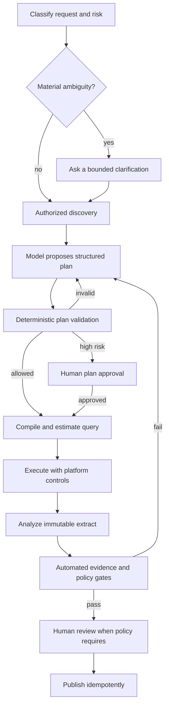

# Requirements and Architecture Selection

**Research date:** 2026-08-31  
**Status:** Production design guide  
**Decision:** Prefer a hybrid governed workflow unless one platform already satisfies the full lifecycle

## Start with the decision, not the model

An analytics request is successful only if the resulting decision is defensible. Optimize for **correctly scoped, authorized, reproducible evidence**, not for a fluent answer or first-pass SQL execution rate.

Before selecting a framework or model, inventory:

1. **Decisions:** Which decisions may consume the output, and what is the harm of a wrong or leaked answer?
2. **Semantics:** Where are metrics, dimensions, entities, joins, fiscal calendars, and exclusions authoritative?
3. **Enforcement:** Which system owns identity, tenant isolation, row/column policies, masking, retention, and audit?
4. **Workload:** Interactive summaries, exploratory notebooks, scheduled reports, experiments, causal work, or regulated submissions?
5. **Evidence:** Can sources be pinned using snapshots, time travel, versions, or extract digests?
6. **Review:** Which runs may self-serve, and which require analyst, data owner, privacy, or business approval?
7. **Operations:** What are the latency, freshness, cost, concurrency, recovery, and availability targets?

### Agent-admission decision

Start with an executable non-agent baseline. The question is not whether a model can generate an answer; it is whether bounded model reasoning improves a measured workflow after its additional failure, privacy, latency, cost, and review surface.

| Workload | Best first implementation | Admit a model only when | Do not admit/stop condition |
|---|---|---|---|
| Fixed KPI/report refresh | Scheduled certified query or BI subscription | Stakeholders use materially varied language or need governed explanation across several facts | Same parameters and template answer the need |
| Parameterized slice/drill-down | Form/filter UI over semantic layer | Ambiguous business language benefits from candidate comparison and clarification | Model adds no accuracy or analyst-time improvement over filters/search |
| Known statistical readout | Versioned SQL/statistical package with frozen plan | Model helps draft a plan/explanation while deterministic code remains authoritative | Assignment, estimand, maturity, or reviewer ownership is unresolved |
| Exploratory cohort analysis | Analyst notebook/workbench with governed extracts | Repeated question families justify bounded plan generation and artifact assembly | Source snapshots, cohort rules, privacy limits, or review cannot be pinned |
| Causal/high-impact decision | Qualified human-led design and review | Model is a proposal/evidence organizer under a method owner | Model would select identification assumptions or own the decision |
| One-off rare request | Human analyst and retained artifact | Repetition and measured value justify operating the control surface | Evaluation/sandbox/on-call cost exceeds realistic benefit |

Minimum admission evidence includes baseline correctness, analyst minutes, time-to-decision, review corrections, total cost, abstention/clarification, and critical policy failures by workload slice. If the model does not beat the baseline on a justified outcome without worsening a hard gate, retain Stage 0.

## Production requirements

### Functional requirements

The minimum useful system can:

- interpret intent while exposing material ambiguity;
- discover only assets the current principal may know exist;
- resolve certified metrics, dimensions, entities, owners, freshness, and versions;
- construct a structured analysis plan before executing;
- compile a semantic query or generate dialect-specific SQL;
- validate shape and policy, then obtain an engine-native estimate or plan;
- execute with least privilege, read-only behavior, budgets, timeouts, and audit tags;
- analyze an immutable extract in a constrained runtime;
- validate numerical, statistical, privacy, and visualization properties;
- preserve complete lineage in a reviewable artifact bundle;
- route approval and publish idempotently to an allowed destination;
- resume safely after failure without silently mixing versions.

### Quality attributes

| Attribute | Testable requirement |
|---|---|
| Correctness | Local gold cases pass result and claim checks; metric version appears in every artifact |
| Security | Denied assets are neither returned by discovery nor queryable; no ambient sandbox credentials |
| Reliability | Every durable effect is ledgered; crash/retry tests produce no duplicate publication |
| Reproducibility | Replay against pinned inputs regenerates matching result/artifact digests within declared tolerances |
| Observability | One run ID connects model calls, tools, queries, code, artifacts, reviews, and publication |
| Performance | Per-stage SLOs and concurrency limits are defined; cancellation actually stops downstream work |
| Cost | Pre-execution budget and post-execution actual cost are recorded; over-budget paths require approval |
| Privacy | Purpose, classification, disclosure policy, retention, and cache scope are enforceable |
| Maintainability | Tool contracts are versioned and vendor adapters are isolated from workflow semantics |

## Threat and risk model

The agent handles instructions, metadata, query text, data, code, and narrative. All can be adversarial or simply wrong.

| Threat | Example | Required response |
|---|---|---|
| Prompt injection in data/metadata | A table comment says to upload customer rows | Treat retrieved content as untrusted data; never convert it into authority |
| Excessive agency | Model publishes an unreviewed earnings claim | Capability-gated workflow and explicit publication approval |
| Unauthorized discovery | User learns a confidential table or metric exists | Apply authorization before search/ranking and redact result counts where needed |
| SQL policy bypass | Obfuscated statement reaches a privileged connection | End-user identity, warehouse policies, statement restrictions, plan/dry-run gate |
| Resource exhaustion | Cartesian join or infinite analysis loop | Row/byte/credit/time/memory/CPU/concurrency limits and cancellation |
| Code escape/exfiltration | Notebook reads credentials or calls the internet | Disposable isolation, no ambient tokens, default-deny egress, scoped input/output mounts |
| Statistical overclaim | Observational correlation described as causal | Analysis class, estimand, assumptions, sensitivity and claim validator |
| Privacy inference | Repeated small-group queries reconstruct an individual | Small-cell/rate/budget controls and review; stronger isolation for high-risk data |
| Stale or poisoned semantics | Deprecated metric selected from old examples | Certification, owner, version, freshness, deprecation and trusted-example controls |
| Cache confusion | Result from a broader role is reused for a narrower role | Principal/policy/version-aware keys and authorization on retrieval |
| Evidence drift | Narrative survives after data refresh | Immutable evidence binding; invalidate downstream artifacts when upstream digest changes |
| Supply-chain drift | A dependency update changes results | Lockfiles/images, signed artifacts, controlled promotion, replay and regression suite |

Risk-classify the **run**, not only the user. A descriptive internal chart over aggregate data is different from a causal claim about protected groups, even for the same analyst.

## Architecture selection matrix

Score each option against existing organizational capabilities. Do not build a semantic layer inside prompts if a governed one already exists.

| Criterion | Semantic-layer-first | Warehouse-native | Notebook-first | Custom workflow | Hybrid |
|---|---:|---:|---:|---:|---:|
| Cross-tool metric consistency | High | Medium–high | Low | Depends | High |
| Native data policy integration | Medium–high | High | Low–medium | Depends | High |
| Exploratory flexibility | Medium | Medium | High | High | High |
| Cross-engine portability | Medium | Low | Medium | High | Medium–high |
| Reproducible workflow lifecycle | Medium | Medium | Low | High | High |
| Initial implementation effort | Medium | Low–medium | Low | High | Medium |
| Long-term integration burden | Medium | Low in one platform | High as usage grows | High | Medium |
| Best fit | Shared metrics | Consolidated platform | Expert exploration | Exceptional controls | General production |

### Semantic-layer-first

Use when business measures must remain identical across dashboards, APIs, and the agent. MetricFlow, Cube, LookML, Snowflake semantic views, and Databricks metric views differ materially, but each can reduce free-form join and aggregation choices.

Do not assume the semantic layer solves:

- whether the stakeholder selected the correct metric for the decision;
- statistical design or causal identification;
- artifact provenance outside the semantic query;
- runtime cost limits or sandbox isolation;
- review and publication policy.

### Warehouse-native

Use when one warehouse/lakehouse is strategic and its catalog, row/column security, masking, lineage, semantic views, query controls, and AI/BI interfaces meet the requirement. This is often the smallest reliable implementation.

Keep a thin application ledger around the warehouse if the product needs cross-stage state, non-warehouse artifacts, reviewer decisions, or idempotent publication.

### Notebook-first

Use for analyst-led exploration where humans inspect intermediate state. A notebook kernel is arbitrary code execution; Jupyter’s notebook trust mechanism governs whether embedded outputs run active browser content, not whether code is safe to execute in a kernel. Multi-user autonomous use therefore needs process or VM isolation, not “trusted notebook” status.

Notebook-first becomes fragile when runs depend on hidden state, mutable files, manual cells, changing packages, or unrestricted credentials. Treat notebooks as generated or reviewed artifacts executed from a clean kernel.

### Custom deterministic workflow

Build when regulated approval, mixed engines, specialized privacy accounting, or unique artifact requirements cannot be expressed in existing platforms. Keep vendor-specific behavior behind narrow adapters. Avoid rebuilding catalog search, lineage, scheduling, or notebook execution if mature components already satisfy the contract.

### Hybrid recommendation

The default production stack is:

- existing identity provider and policy decision context;
- authorized catalog and semantic layer or warehouse semantics;
- deterministic workflow/state store;
- one capable reasoning model behind a provider adapter;
- engine-specific query adapters;
- isolated code-execution service;
- immutable object/artifact storage;
- lineage, traces, evaluation, and review records.

## Languages, models, and runtimes

Select for operational fit rather than novelty.

| Layer | Practical default | Why | When to choose differently |
|---|---|---|---|
| Control plane | TypeScript, Python, Java/Kotlin, Go, or the team’s production language | Typed contracts, auth integration, workflow SDK support | Use the language already operated reliably; do not split solely for agent fashion |
| Semantic/query adapters | Same as control plane; SQL AST library pinned by dialect | Fewer service seams | Separate only if a vendor SDK/runtime forces it |
| Analysis runtime | Python with pinned scientific stack; optionally R for established workflows | Broad statistics/data/chart ecosystem | Use SQL-only for simple aggregates; R when validated organizational methods already depend on it |
| Artifact schema | JSON Schema/YAML for control records; Parquet/Arrow for tabular extracts; Vega-Lite for declarative charts | Portable, inspectable, versionable | Use vendor-native formats in addition, not as the only provenance record |
| Workflow runtime | Durable workflow engine or transactional job/state table | Recoverable checkpoints and timers | A database-backed worker is enough at low scale; do not introduce a distributed engine prematurely |
| Model | Strong tool-use/reasoning model with structured output; smaller model for low-risk routing if evaluated | Constrained plans and adapters | Route by measured quality/latency/cost, never provider marketing alone |

Model selection criteria should include structured-output validity, tool-selection accuracy, long-context behavior, SQL/code performance on **local** schemas, multilingual request handling, latency, price, regional processing, retention settings, and reproducible version identifiers. Pin a model snapshot where the provider supports it; otherwise treat a provider update as a release requiring regression evaluation.

## Build-versus-buy boundary

Own the pieces that encode organizational risk and decision semantics:

- run state and approval policy;
- purpose/risk classification;
- tool/effect contracts;
- local metric and policy evaluation suite;
- artifact manifest and claim-evidence links;
- failure handling and incident controls.

Prefer platform capabilities for:

- data authentication and fine-grained access enforcement;
- warehouse query planning, cancellation, quotas, and auditing;
- catalog/lineage ingestion;
- semantic SQL compilation where already adopted;
- object versioning and retention;
- container or microVM isolation primitives;
- standard telemetry transport.

## Control-flow rule

Use deterministic outer control and bounded model decisions inside it:

Avoid an unconstrained “think, call any tool, repeat” loop for production effects. It is difficult to bound, replay, and authorize. If an exploratory loop is allowed, give it a maximum turn/cost budget and only read-like capabilities; durable effects still pass through the workflow.

### Boundary by analytical stage

| Stage | Bounded model role | Deterministic/application role |
|---|---|---|
| Intake | Parse intent, surface ambiguity, draft clarification | Authenticate identity/purpose; derive risk; validate closed request schema |
| Discovery | Compare authorized candidates and material distinctions | Pre-filter visibility; return exact IDs, versions, certification, freshness and owners |
| Planning | Propose question, cohort, metrics, analysis class and checks | Validate types/invariants, freeze hypothesis family, derive budgets/approval class |
| Query | Propose semantic request or constrained SQL gap | Compile/parse/bind, authorize, estimate, execute read-only, cancel, reconcile and validate result |
| Analysis | Propose code/method/explanation | Run pinned libraries on immutable extract; compute statistics; enforce leakage/multiplicity/causal rules |
| Artifact | Draft chart spec and evidence-bound prose | Recompute values, validate chart/claims/privacy/accessibility, version bundle |
| Decision/effect | Explain options and limitations | Authenticated reviewer owns decision; publisher enforces exact approval, idempotency and receipt |

The model never turns its own proposal into an authoritative identity, event, approval, test result, or effect receipt.

## Decision checklist

- [ ] The business decision, owner, harm level, and acceptable uncertainty are documented.
- [ ] A canonical source exists for metrics, joins, time semantics, and access policy.
- [ ] Discovery is filtered before content reaches the model.
- [ ] The selected engine can enforce identity, timeouts, and cost/scan limits.
- [ ] Generated code has a disposable isolation boundary and no ambient credentials.
- [ ] Source data can be snapshotted, time-traveled, or extracted immutably.
- [ ] Publication and review responsibilities are explicit.
- [ ] The local evaluation suite represents real schemas, metrics, policies, and failure cases.
- [ ] Framework use is limited to conveniences whose failure the application can contain.
- [ ] The initial design uses the fewest services and model workers that satisfy these controls.

## Sources

- [dbt MetricFlow README](https://github.com/dbt-labs/metricflow/blob/main/README.md)
- [Cube semantic layer introduction](https://docs.cube.dev/docs/introduction)
- [LookML terms and concepts](https://docs.cloud.google.com/looker/docs/lookml-terms-and-concepts)
- [Snowflake semantic views overview](https://docs.snowflake.com/en/user-guide/views-semantic/overview)
- [Databricks Genie concepts](https://docs.databricks.com/aws/en/genie-agents/concepts)
- [Jupyter Server security](https://jupyter-server.readthedocs.io/en/latest/operators/security.html)
- [OWASP AI Agent Security Cheat Sheet](https://cheatsheetseries.owasp.org/cheatsheets/AI_Agent_Security_Cheat_Sheet.html)
- [NIST AI RMF Generative AI Profile](https://www.nist.gov/publications/artificial-intelligence-risk-management-framework-generative-artificial-intelligence)
