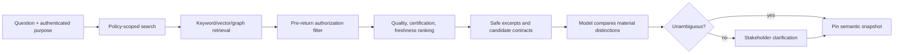

# Metric Semantics and Governed Discovery

**Research date:** 2026-08-31  
**Status:** Production design guide  
**Core rule:** The agent selects and explains versioned business semantics; it does not invent them in a prompt

## Why semantics is the first correctness boundary

Syntactically valid SQL can return a numerically precise answer to the wrong question. Common failures include using bookings instead of recognized revenue, active accounts instead of eligible accounts, a calendar month instead of a fiscal period, a many-to-many join that inflates facts, or a ratio aggregated from already aggregated ratios.

Governed semantics should make the following explicit and machine-readable:

- metric expression and aggregation behavior;
- base population and required filters;
- numerator and denominator for ratios;
- entities, keys, join cardinality, and allowed traversal paths;
- event time, metric time, time zone, fiscal calendar, and validity intervals;
- dimensions and grains that may safely group the metric;
- additive, semi-additive, or non-additive behavior;
- currency, units, formatting, and null policy;
- ownership, certification, version, deprecation, freshness, and quality status;
- sensitivity classification and policy references;
- worked examples and verified queries with provenance.

## A vendor-neutral metric contract

The contract below is conceptual. Map it to the organization’s semantic platform instead of creating a parallel definition store.

```yaml
metric:
  id: paid_conversion_24h
  version: 3
  label: Paid conversion within 24 hours
  owner: growth-analytics
  status: certified
  description: >-
    Share of eligible assigned web sessions producing a non-refunded paid order
    within 24 hours of experiment assignment.
  measure:
    type: ratio
    numerator: count_distinct(converted_assigned_session_id)
    denominator: count_distinct(eligible_assigned_session_id)
  population:
    semantic_model: experiment_sessions
    required_filters:
      - is_internal = false
      - is_fraud = false
  entity:
    primary: assigned_session
    joins:
      - to: paid_order
        relationship: one_to_many
        temporal_rule: order_created_at >= assigned_at
  time:
    metric_time: assigned_at
    default_grain: day
    time_zone: UTC
    conversion_window: PT24H
  allowed_dimensions:
    - experiment_variant
    - country
    - device_type
  aggregation:
    additive_across: [experiment_variant]
    non_additive_across: [time_bucket]
    rollup_rule: recompute_ratio_from_components
  units: proportion
  privacy:
    classification: internal-sensitive
    minimum_group_size: 25
  quality:
    freshness_slo: PT6H
    assertions: [denominator_nonzero, numerator_lte_denominator]
  lineage:
    source_model: analytics.experiment_sessions_v5
    semantic_commit: 8f42e0c
  examples:
    - question: Conversion by experiment arm for the checkout experiment
      trusted_asset_id: verified-query-1f9d
  effective_from: 2026-07-01
```

Do not let a display label stand in for this definition. Every resolved metric in a run must include an immutable version or semantic snapshot identifier.

## Dataset, snapshot, and cohort semantics

A catalog object name identifies a logical asset, not the rows observed by an analysis. Pin both the object incarnation and the data version.

```yaml
dataset_ref:
  logical_id: "urn:catalog:prod:analytics:experiment_sessions"
  physical_object_id: "bigquery://project/dataset/table"
  object_incarnation: "created:2026-04-19T07:12:33Z/schema:sha256:..."
  snapshot:
    mechanism: table_snapshot
    native_id: "project.dataset.experiment_sessions__20260831"
    observed_at: "2026-08-31T10:30:00Z"
    schema_digest: "sha256:..."
    partition_manifest_digest: "sha256:..."
  quality_version: "dq-run:01J..."
  classification: internal-sensitive
```

Prefer an engine-native immutable snapshot/version ID. A timestamp alone is acceptable only when the platform guarantees what it selects and the retention window covers replay. Examples differ:

- BigQuery time travel selects a table version at a timestamp and is normally limited to a configurable two-to-seven-day window; a named table snapshot can retain a state longer.
- Snowflake `AT`/`BEFORE` can use timestamp, offset, or statement ID within retention, but `BEFORE(STATEMENT => ...)` is relative to statement completion and concurrent commits may be visible.
- Delta/Iceberg versions or snapshot IDs are stronger identifiers than a wall-clock timestamp, but vacuum/snapshot expiration can remove referenced data files. Retention must be an explicit contract, not an assumption.
- Import-mode BI models and extracts are separate copied datasets. Record semantic model/datasource ID, refresh or revision ID, imported-partition/extract version where exposed, and upstream source versions; “dashboard updated at” is not a source snapshot.

A cohort is a versioned derived dataset, not merely a filter phrase:

```yaml
cohort:
  cohort_id: checkout_experiment_eligible_sessions
  version: 4
  entity: assigned_session
  entry_event: experiment_assignment
  entry_window: {start: 2026-08-01T00:00:00Z, end: 2026-08-15T00:00:00Z}
  index_time: assigned_at
  eligibility: "country=US AND channel=web"
  exclusions: [internal_user, known_fraud]
  deduplication: "first eligible assignment per experiment and session"
  maturity: {outcome_window: PT24H, data_cutoff: 2026-08-16T00:00:00Z}
  source_refs: ["dataset://...@snapshot-...", "dataset://...@snapshot-..."]
  membership_rule_digest: "sha256:..."
  materialized_membership_digest: "sha256:..."
  owner: growth-analytics
```

Membership, entry/index event, window boundaries, deduplication, exclusions, attribution, censoring/maturity, identity resolution, and source correction are all material. A cohort refresh against new data creates a new cohort version even when its rule text is unchanged.

## Semantic resolution contract

`resolve_metric` should return candidates, not silently choose among materially different definitions.

```json
{
  "request": {
    "term": "conversion",
    "principal_context_ref": "authctx_7e4c",
    "purpose": "experiment-readout",
    "as_of": "2026-08-31T10:30:00Z",
    "required_dimensions": ["experiment_variant"],
    "time_grain": "day"
  },
  "response": {
    "candidates": [
      {
        "metric_ref": "paid_conversion_24h@v3",
        "semantic_snapshot": "prod-semantic@8f42e0c",
        "certification": "certified",
        "owner": "growth-analytics",
        "authorized": true,
        "compatibility": {"dimensions": true, "time_grain": true},
        "material_distinctions": ["24-hour window", "assigned-session denominator"]
      }
    ],
    "requires_confirmation": true
  }
}
```

The response should omit unauthorized candidates entirely. Returning a result labeled `authorized: false` can itself disclose a confidential project, customer, metric, or table.

## Authorized discovery pipeline



Authorization must apply to:

- object existence, names, descriptions, owners, tags, lineage, and sample values;
- semantic models, metrics, dimensions, trusted examples, query history, and popularity signals;
- search snippets and embeddings created from restricted metadata;
- relationships that can reveal a protected project even if the endpoint is hidden.

Prefer filtering at retrieval time. Post-filtering a globally retrieved top-k set can leak through snippets, counts, ranking, timing, embeddings, or logs and can also yield poor authorized results.

## Ranking and trust

Relevance is not authority. Rank candidates using at least:

1. authorization and purpose compatibility;
2. certification and ownership;
3. exact semantic compatibility with requested dimensions, time grain, entities, and filters;
4. freshness and quality assertions;
5. deprecation status;
6. lexical/semantic relevance;
7. usage signals from authorized, successful analyses.

Trusted examples must be reviewed assets with scope, semantic version, author, and expiry. Raw query history can encode obsolete definitions, policy workarounds, or accidental data exposure. Never convert “frequently run” into “correct.”

## Entity graphs, joins, and time

MetricFlow models entity relationships and generates joins through semantic models. Other semantic systems expose similar ideas with different constraints. Regardless of product, the agent needs to know:

- primary, unique, and foreign entity roles;
- one-to-one, many-to-one, one-to-many, and many-to-many cardinality;
- whether a traversal is allowed for this metric;
- fanout behavior and deduplication rules;
- temporal/as-of join semantics;
- slowly changing dimensions and validity ranges;
- the metric’s time spine and supported grains.

Reject or require analyst review for joins whose cardinality is unknown. A precomputed row count comparison is not a general proof against fanout.

### Additivity must be explicit

| Measure behavior | Safe operation | Unsafe shortcut |
|---|---|---|
| Additive | Sum across declared dimensions and time | Sum after a duplicating join |
| Semi-additive | Sum only across declared dimensions | Sum account balances across daily snapshots |
| Non-additive | Recompute from base components at requested grain | Average averages or sum distinct counts |
| Ratio | Aggregate numerator and denominator, then divide | Average subgroup ratios without weighting |
| Period-to-date | Use declared window and partition | Sum overlapping windows |

Snowflake semantic views explicitly model non-additive dimensions, while Databricks metric views document rollup restrictions for non-additive measures and certain one-to-many relationships. The exact syntax varies; the invariant is that a planner must not assume all metrics roll up.

## Platform patterns and trade-offs

| Platform/pattern | Semantic strengths | Governing strengths | Watch points |
|---|---|---|---|
| dbt MetricFlow | Metrics compiled from semantic models, entity-based joins, metric time, multi-hop queries | Versioned code and dbt ecosystem | The compiler is not the query runner or authorization boundary; confirm current Core/Fusion behavior |
| Cube | Modeling, APIs, access policies, and pre-aggregations in one layer | Member/row/masking policies and cache controls | Deployment and identity propagation must be configured correctly; rollup-only changes behavior |
| LookML | Mature views/explores, reusable measures, access grants | Governed explores and platform permissions | SQL interface and external clients still require carefully scoped credentials and supported semantics |
| Power BI/Fabric semantic models | Tabular/DAX measures, relationships, roles, import/DirectQuery/composite modes; TMDL/TOM model definitions | Entra/workspace/model permissions, RLS/OLS and capacity controls | REST still uses `dataset` terminology; an item ID is not a model-definition or refresh version; service-principal/RLS and XMLA capacity/tenant settings differ |
| Tableau published data sources/workbooks | Published calculations, relationships, extracts, certifications and revision history | Site/project/content permissions and optional Catalog metadata | Metadata IDs and REST LUIDs differ; permission mode may obfuscate rather than omit; custom SQL/backfill/node limits can make lineage incomplete |
| Snowflake semantic views | Logical tables, facts, dimensions, metrics, relationships, semantic SQL | Native roles, row access, masking, query history | Semantic views are recommended for new implementations; legacy YAML remains relevant for backward compatibility |
| Databricks metric views | YAML metric models over Unity Catalog with measures/dimensions/joins/materialization | Unity Catalog access control, lineage, filters/masks | Syntax and feature support depend on YAML spec/runtime; some rollups and relationship patterns are restricted |
| Open interchange | Potential portability across tools | Shared vocabulary | Apache Ossie/OSI remains incubating and evolving; translation cannot be presumed lossless |

### Current contradictions to preserve

- **Snowflake semantic views versus legacy semantic-model YAML:** current documentation recommends semantic views for new implementations, while the legacy format remains supported. Choose explicitly and regression-test any migration.
- **Databricks metric-view YAML forms:** current docs prefer the newer `fields` form for authoring, while UI-generated definitions may use `dimensions` and `measures`; feature support also depends on runtime/spec version.
- **dbt version guidance:** current dbt agent guidance distinguishes Core 1.12+/Fusion from legacy 1.6–1.11 patterns. Verify deployment version before copying examples.
- **Cross-vendor semantic interchange:** Apache Ossie is an important convergence effort but was still an incubating, fast-moving project in 2026. “Same model” does not yet imply identical SQL, policy, or aggregation behavior across engines.
- **Power BI names and identities:** product documentation says “semantic model,” while REST endpoints retain `datasets`. Persist workspace plus dataset ID, source-controlled TMDL/model digest and refresh/storage-mode evidence; do not treat a display name or item ID as a definition version.
- **Tableau metadata visibility:** default metadata permission behavior can obfuscate inaccessible external assets; filter mode omits them. Lineage can be partial during backfill, custom-SQL limitations, node limits, or incomplete inheritance. The adapter must propagate these warnings instead of presenting a complete graph.

## Discovery quality tests

Build an evaluation set from real stakeholder language, including aliases, old names, abbreviations, multilingual terms, and confusing near-neighbors.

For each case test:

- authorized top-k recall and precision;
- whether unauthorized object names, counts, snippets, or relationships leak;
- correct certification/deprecation/freshness ranking;
- dimension, grain, and entity compatibility;
- whether material ambiguity triggers clarification;
- correct semantic snapshot pinning;
- stability after metadata and embedding-index updates;
- poisoning resistance for comments, examples, and descriptions containing instructions.

## Operational ownership

Every metric needs:

- a business owner who approves meaning;
- a technical owner who maintains model and tests;
- a freshness and quality policy;
- a change/deprecation process;
- downstream impact discovery;
- a review interval for examples and aliases;
- a migration path when versions change.

When a metric changes materially, create a new version or effective interval. Do not silently reinterpret an old report. A refreshed analysis should declare whether it uses historical semantics, current semantics, or both.

## Checklist

- [ ] Metrics include population, units, time, aggregation, entities, version, owner, and certification.
- [ ] Ratios preserve base components; non-additive behavior is machine-readable.
- [ ] Discovery authorization occurs before metadata is returned to the model.
- [ ] Trusted examples are reviewed, scoped, versioned, and expirable.
- [ ] Unknown cardinality and unsupported rollups fail closed.
- [ ] A run pins semantic and catalog snapshots before compilation.
- [ ] Dataset object incarnation, source snapshot and cohort membership semantics are independently pinned.
- [ ] Semantic migration is covered by result regression tests.
- [ ] Platform syntax/version differences are isolated in adapters.

## Sources

- [dbt MetricFlow metric semantics](https://github.com/dbt-labs/dbt-core/blob/main/crates/dbt-metricflow/docs/metric-semantics.md)
- [dbt MetricFlow README](https://github.com/dbt-labs/metricflow/blob/main/README.md)
- [dbt semantic-layer agent skill](https://github.com/dbt-labs/dbt-agent-skills/blob/main/skills/dbt/skills/building-dbt-semantic-layer/SKILL.md)
- [Cube data modeling and access control](https://docs.cube.dev/docs/data-modeling/access-control/index)
- [Cube pre-aggregations](https://docs.cube.dev/docs/pre-aggregations/using-pre-aggregations)
- [LookML terms and concepts](https://docs.cloud.google.com/looker/docs/lookml-terms-and-concepts)
- [Snowflake semantic-view YAML specification](https://docs.snowflake.com/en/user-guide/views-semantic/semantic-view-yaml-spec)
- [Snowflake semantic query clause](https://docs.snowflake.com/en/sql-reference/constructs/semantic_view)
- [Databricks metric-view YAML reference](https://docs.databricks.com/aws/en/uc-semantics/metric-views/yaml-reference)
- [Databricks metric-view modeling](https://docs.databricks.com/aws/en/uc-semantics/metric-views/basic-modeling)
- [Apache Ossie](https://ossie.apache.org/)
- [Power BI semantic model permissions](https://learn.microsoft.com/en-us/power-bi/connect-data/service-datasets-permissions)
- [Tabular Model Definition Language](https://learn.microsoft.com/en-us/analysis-services/tmdl/tmdl-overview)
- [Tableau Metadata API introduction](https://help.tableau.com/current/api/metadata_api/en-us/)
- [Tableau Metadata API permissions](https://help.tableau.com/current/api/metadata_api/en-us/docs/meta_api_permissions.html)
