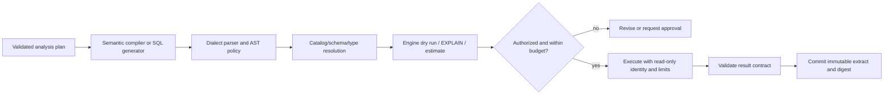

# Query Planning, Validation, and Execution

**Research date:** 2026-08-31  
**Status:** Production design guide  
**Core rule:** Generated SQL is untrusted input; defense requires layered application and engine controls

## Plan before SQL

The first query should not be the first durable representation of the analysis. Compile from a validated plan containing:

- question, decision, purpose, and risk class;
- population, entity, grain, time window, time zone, and exclusions;
- metric versions and requested dimensions;
- descriptive, inferential, predictive, or causal analysis class;
- expected output schema and acceptable row cardinality;
- source and semantic snapshots;
- cost, scan, row, runtime, concurrency, and retry budgets;
- privacy/disclosure rules and required approvals.

Prefer a semantic query when the request can be represented by governed metrics. Permit direct SQL only for gaps the semantic system cannot express, and increase review requirements accordingly.

## Query control pipeline



No single stage is sufficient:

- string filtering is easily bypassed;
- an AST parser proves structure, not permission or cost;
- schema resolution proves names/types, not business meaning;
- an estimate may differ from runtime and may itself expose metadata;
- “read-only” can still scan large data, call unsafe functions, leak rows, or exploit engine-specific behavior;
- row/column policies can still allow inference through repeated queries or side channels.

## Typed tool contract

Keep generated text separate from authenticated context. The model must never provide its own principal, role, tenant, purpose, budget override, connection, or approval.

```json
{
  "tool": "execute_query",
  "contract_version": "2.1",
  "model_arguments": {
    "validated_query_ref": "qry_01J7...",
    "parameters": {"start_date": "2026-08-01", "end_date": "2026-08-14"},
    "expected_schema_ref": "schema_93ab..."
  },
  "injected_by_controller": {
    "run_id": "run_01J7...",
    "principal_context_ref": "authctx_7e4c...",
    "connection_capability_ref": "cap_read_18f...",
    "semantic_snapshot": "prod-semantic@8f42e0c",
    "source_snapshot": "warehouse@2026-08-31T10:30:00Z",
    "limits": {
      "timeout_ms": 60000,
      "max_rows": 100000,
      "max_bytes_billed": 50000000000
    },
    "query_tag": "analytics-agent/run_01J7.../attempt_1"
  }
}
```

The executor verifies that the query digest and policy decision match the reviewed/validated query. A query reference must not be a mutable database row the model can replace between approval and execution.

## SQL validation layers

### 1. Dialect-specific parse and AST policy

Pin the dialect and parser version. SQLGlot is useful for parsing, traversal, normalization, and transpilation, but its own documentation describes lenient parsing and fallback command representations. A successful parse is not a security decision.

Example conceptual policy:

```python
def validate_ast(sql, dialect, policy):
    statements = parse_with_pinned_sqlglot(sql, dialect=dialect)
    require(len(statements) == 1, "one statement required")
    tree = statements[0]
    require(tree.kind in policy.allowed_statement_kinds, "statement not allowed")
    reject_nodes(tree, policy.denied_node_types)
    reject_functions(tree, policy.denied_functions)
    require_all_relations_allowlisted(tree, policy.allowed_relation_ids)
    require_all_identifiers_resolved(tree, policy.catalog_snapshot)
    return canonical_digest(tree, dialect, parser_version=policy.parser_version)
```

Treat this as an input filter, not a sandbox. Test engine-specific constructs, comments, quoted identifiers, UDFs, external functions, procedures, dynamic SQL, metadata tables, table functions, time travel, unload/export syntax, and multi-statement behavior.

### 2. Parameterize values and allow-list identifiers

Use prepared parameters for literal values. Parameters normally cannot safely substitute identifiers, sort directions, operators, or arbitrary clauses; map those from enumerated IDs to known SQL fragments. This follows established SQL injection guidance and also makes query digests and cache keys stable.

### 3. Resolve against an authorized catalog snapshot

Resolve physical object IDs, columns, types, functions, and semantic references against the same policy-scoped catalog used for discovery. Do not rely only on names the model wrote. Bind allowed logical IDs to physical relations in the executor.

### 4. Obtain an engine-native plan or dry run

Examples:

- BigQuery job configuration supports dry runs, `maximumBytesBilled`, labels, and job timeout configuration.
- PostgreSQL `EXPLAIN` supports machine-readable formats such as JSON; `SET TRANSACTION READ ONLY` and `statement_timeout` add separate controls.
- Snowflake supplies statement timeout, query tags, and abort behavior through parameters.

Check estimated scan/cost, referenced objects, partitions, join shape, result schema, and dangerous full scans. Estimates are inputs to policy, not guarantees; maintain a post-run actual-cost circuit breaker.

### 5. Execute under least privilege

Prefer end-user or delegated credentials so the warehouse remains the final policy enforcement point. If a service identity is unavoidable, apply a narrowly scoped capability created from the authenticated principal and re-authorize every object at execution time.

The execution session should have:

- read-only or equivalent transaction/session settings;
- a single permitted catalog/database/schema scope;
- statement timeout and cancellation propagation;
- scan/byte/credit/slot/workgroup budget where supported;
- row limit at the fetch/materialization layer;
- external function, procedure, UDF, file/export, network, and metadata access denied unless required;
- a query tag containing a non-sensitive run/attempt identifier;
- isolated temporary objects and deterministic cleanup if temporary writes are required.

Read-only does not mean harmless. PostgreSQL documents that read-only transactions still permit some operations and do not imply zero underlying disk writes. The relevant guarantee is that the principal cannot make prohibited durable changes or reach prohibited data/effects.

## Result contract

Validate before analysis:

```yaml
result_contract:
  columns:
    - {name: experiment_variant, logical_type: categorical, nullable: false}
    - {name: eligible_sessions, logical_type: count, nullable: false, min: 0}
    - {name: paid_sessions, logical_type: count, nullable: false, min: 0}
  invariants:
    - paid_sessions <= eligible_sessions
    - unique(experiment_variant)
  maximum_rows: 20
  ordering: [experiment_variant]
  privacy:
    minimum_group_size_column: eligible_sessions
    threshold: 25
  tolerances:
    floating_point_relative: 1.0e-9
```

Record returned schema, row count, null summary, min/max or privacy-safe profile, engine job ID, actual scan/cost, source snapshot, and content digest. If the engine cannot pin an input snapshot, label the result as a live observation and do not promise exact replay.

## Cost-safe query patterns

- Select explicit columns; never expose `SELECT *` as the default.
- Require partition/time predicates for large fact tables.
- Push filters and aggregation into the engine rather than moving raw rows to the sandbox.
- Use semantic rollups/materializations only when their freshness and compatibility are proven.
- Cap result rows independently of scanned bytes; `LIMIT` may not reduce scan cost. BigQuery explicitly notes this distinction.
- Prefer small previews from authorized sampling facilities; avoid naive `ORDER BY RANDOM()` over large tables.
- Separate interactive and batch pools/workgroups/warehouses.
- Cancel the underlying engine job when the client disconnects or the workflow expires.
- Track estimates versus actuals by template to detect optimizer/data drift.

## Cache correctness and privacy

Warehouse result caches can substantially reduce latency and cost, but reuse is a policy decision.

A safe application cache key normally includes:

```text
(tenant, principal-or-authorized-cohort, role/policy fingerprint,
 purpose, semantic version, normalized query digest, bound parameters,
 source snapshot/freshness epoch, timezone, currency, privacy policy,
 engine and compiler versions)
```

On retrieval, re-authorize the result and its source lineage. Purge or make entries unreachable after revocation, policy changes, semantic changes, source reclassification, or privacy-policy changes. Encrypt and classify cached data like the underlying result.

Important platform behavior:

- BigQuery cached results are typically best-effort for about 24 hours and depend on exact query conditions. Its documentation warns that cached results can remain accessible after some access changes; row-level-security queries are not cached, and column-level security affects eligibility.
- Snowflake persisted query results are normally retained for 24 hours, with reuse subject to query and data conditions; the reuse window can reset on access up to documented limits.
- Semantic pre-aggregations/materializations have independent freshness, access, and rollup-compatibility concerns.

For high-risk data, prefer no shared application result cache. If shared cohort caching is needed, prove identical authorization and disclosure context rather than inferring it from role names.

## Error handling without leakage

Return structured error categories to the model:

- `AMBIGUOUS_SEMANTICS`
- `UNAUTHORIZED_OR_NOT_FOUND`
- `UNSUPPORTED_QUERY_SHAPE`
- `ESTIMATE_OVER_BUDGET`
- `SCHEMA_CHANGED`
- `ENGINE_TIMEOUT`
- `RESULT_CONTRACT_FAILED`
- `PRIVACY_THRESHOLD_FAILED`
- `SNAPSHOT_UNAVAILABLE`

Do not pass raw database errors, query plans, connection strings, internal object names, or sensitive literals into the model context by default. Store privileged diagnostics in access-controlled telemetry and provide a sanitized explanation plus stable error ID.

## Retry and idempotency

Query execution is read-like but may be expensive and may observe changing data.

- Retry only classified transient failures.
- Preserve the same validated query digest, parameters, identity, semantic snapshot, and source snapshot.
- Use engine request/job tokens where supported to avoid duplicate submissions.
- Do not retry after an unknown completion state until the engine job ID is reconciled.
- If a live source cannot be pinned, treat a retry as a new observation and mark downstream artifacts accordingly.
- Commit the result extract once by content digest/operation ID; downstream stages consume only the committed extract.

## Adversarial tests

Test at least:

- stacked statements, comments, Unicode confusables, nested queries, quoted names, dialect extensions;
- UDFs, procedures, external functions, file/export commands, system metadata, and remote tables;
- allowed view that exposes a denied base column through a function or error;
- high-cardinality group-by, Cartesian join, recursive query, expensive regex, and giant generated series;
- schema change between validation and execution;
- credential/policy revocation between cache write and read;
- timeout where the client stops but the warehouse job continues;
- engine success followed by result-extract commit failure;
- row/column policy inference using timing, error, billing, and repeated small groups.

## Checklist

- [ ] A structured plan exists before query generation.
- [ ] Semantic compilation is preferred over free-form SQL when possible.
- [ ] Parser dialect/version and AST policy are pinned and regression-tested.
- [ ] Values are parameterized; identifiers and clauses are allow-listed mappings.
- [ ] Catalog resolution and authorization occur again at execution.
- [ ] Engine-native estimate, runtime limits, and actual-cost accounting are enabled.
- [ ] The query runs with least privilege and an auditable tag.
- [ ] Result contracts and privacy gates run before sandbox analysis.
- [ ] Cache keys bind principal/policy and all semantic/data versions.
- [ ] Unknown query completion is reconciled before retry.

## Sources

- [BigQuery jobs API](https://docs.cloud.google.com/bigquery/docs/reference/rest/v2/Job)
- [BigQuery query execution and dry runs](https://docs.cloud.google.com/bigquery/docs/running-queries)
- [BigQuery pricing](https://cloud.google.com/bigquery/pricing)
- [BigQuery cached results](https://docs.cloud.google.com/bigquery/docs/cached-results)
- [Snowflake parameters](https://docs.snowflake.com/en/sql-reference/parameters)
- [Snowflake persisted query results](https://docs.snowflake.com/en/user-guide/querying-persisted-results)
- [PostgreSQL 18 transaction modes](https://www.postgresql.org/docs/18/sql-set-transaction.html)
- [PostgreSQL EXPLAIN](https://www.postgresql.org/docs/current/sql-explain.html)
- [SQLGlot README](https://github.com/tobymao/sqlglot/blob/main/README.md)
- [SQLGlot parser onboarding notes](https://github.com/tobymao/sqlglot/blob/main/posts/onboarding.md)
- [OWASP SQL Injection Prevention Cheat Sheet](https://cheatsheetseries.owasp.org/cheatsheets/SQL_Injection_Prevention_Cheat_Sheet.html)

