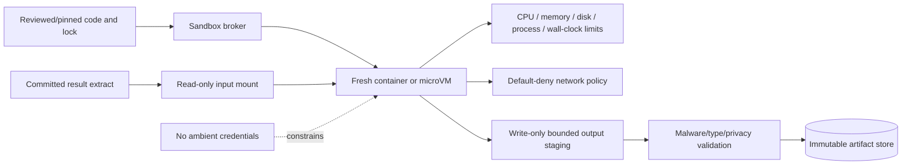

# Notebook Sandbox and Reproducibility

**Research date:** 2026-08-31  
**Status:** Production design guide  
**Core rule:** Generated analysis code is hostile until proven otherwise, and reproducibility includes data—not only code

## Use notebooks as artifacts, not authority

Notebook interfaces are valuable for exploration and stakeholder inspection, but a notebook kernel is an arbitrary code-execution environment. Jupyter Server’s security documentation states that access to the server effectively permits arbitrary code execution as the server user. Notebook “trust” is a separate protection for active output content and does not make kernel code safe.

For an agent, execute code from a declared cell/script plan in a fresh runtime, capture outputs deterministically, and optionally render a notebook for review. Do not resume an unknown interactive kernel with hidden variables and manually reordered cells.

## Sandbox boundary



The broker, not the model, chooses the image, runtime class, mounts, secrets, network policy, and resource limits.

### Minimum isolation controls

- Fresh runtime per attempt; no reuse across users, tenants, or trust levels.
- Unprivileged user, read-only root filesystem, dropped Linux capabilities, no host PID/IPC namespace.
- No Docker/Kubernetes socket, cloud metadata endpoint, service-account token, SSH agent, home directory, or operator credentials.
- Input extract and code mounted read-only; output limited to a dedicated staging directory.
- Default-deny egress and DNS. Allow only explicit, proxied dependencies for an approved purpose.
- CPU, memory, wall-clock, process/thread, open-file, ephemeral-storage, output-size, and log-size limits.
- Seccomp/AppArmor/SELinux or equivalent host controls, patched kernel/runtime, and image signature/digest verification.
- Termination that kills the whole process tree and releases temporary volumes.
- Sensitive stdout/stderr and artifacts scanned/redacted before entering model context or general telemetry.

### Isolation choices

| Runtime | Strength | Trade-off | Appropriate use |
|---|---|---|---|
| Shared Python process | Lowest startup cost | No meaningful hostile-code isolation | Only trusted, static, application-owned functions; never arbitrary model code |
| Standard container | Familiar and efficient | Shares host kernel; configuration errors are consequential | Lower-risk internal workloads with strong host and policy controls |
| gVisor-style userspace kernel | Reduces direct host-kernel surface | Compatibility/performance overhead; cgroups/network controls still required | Multi-tenant generated code where supported libraries work |
| Firecracker microVM | Stronger VM boundary with small footprint | More platform engineering, image lifecycle, KVM requirements | Higher-risk multi-tenant or regulated analysis |
| Dedicated VM/account | Strong blast-radius separation | Highest cost and latency | Highly sensitive workloads or exceptional dependencies |

gVisor documentation explicitly separates system-call isolation from resource and network controls: use cgroups and container network policy as well. Firecracker production guidance calls for the Jailer, restrictive seccomp, host/guest/microcode patching, and operational resource controls. Neither product is a turnkey security guarantee.

## Dependency policy

Do not permit runtime package installation from the public internet by default. Build curated, versioned images containing approved analytical libraries. For exceptional packages:

1. resolve from an internal mirror;
2. pin exact versions and hashes;
3. scan license and known vulnerabilities;
4. build/promote the image outside the execution sandbox;
5. regression-test the analytical environment;
6. record the image digest and lockfile digest.

Avoid importing arbitrary serialized Python objects. Formats such as pickle can execute code during loading. Use Parquet/Arrow/CSV/JSON with explicit schemas, or trusted application-owned formats, and validate before mounting.

### Qualify the analytical engine, not just the language

Use the smallest deterministic engine that fits the committed extract. The model may select only from policy-qualified runtime profiles.

| Surface | Good fit | Pin and preserve | Production caveat/test |
|---|---|---|---|
| Warehouse SQL | Large joins/aggregations and governed metrics | engine/version, query/plan, snapshot, session settings, job/cost receipt | Keep computation near governed data; optimizer/runtime can differ from estimate |
| DuckDB | Local SQL over bounded Arrow/Parquet extracts | DuckDB version, extensions, connection config, SQL, input digests, settings | Use an explicit connection rather than the shared global Python connection; set memory/threads/temp directory; some allocations bypass the buffer-manager memory limit; ordering still requires explicit keys |
| Polars | Typed columnar transformations and larger-than-memory candidates | Polars version, logical/physical plan, schema, streaming/in-memory engine, input order contract | Lazy plans are promises and can recompute; some operations fall back from streaming; group/order behavior must be explicit and the physical plan inspected |
| pandas | Small/medium expert-compatible analysis and broad library interop | pandas/NumPy/Arrow versions, dtypes, indexes, sort/null/groupby options, timezone and locale | pandas 3.0 changed string dtype, copy-on-write and datetime resolution behavior; migration replay is required across major versions |
| Spark SQL/DataFrame | Distributed extracts already governed in a Spark estate | Spark/runtime/JVM, config, catalog/table snapshot, logical/physical/adaptive plans, partitioning and seed | AQE can change plans at runtime; skew, shuffle, inaccurate statistics and retries affect cost and ordering; a cluster is not a code-security boundary |
| SciPy/statsmodels | Declared statistical methods on validated arrays/tables | exact library versions, function/method and every non-default option, missing policy, weights/clusters, resampling seed | Defaults are substantive: for example SciPy independent t-tests default to equal variance and propagate NaNs; statsmodels 0.14.6 is the researched stable line |
| scikit-learn | Predictive workflows with explicit held-out evaluation | estimator/pipeline, split IDs, feature schema, random state, fitted artifact and version | Split before fitting preprocessing; use a pipeline to prevent leakage; never evaluate on data used for selection/fitting |

Do not silently switch engines to make a job fit. DuckDB, Polars, pandas, Spark and warehouse SQL can differ in null handling, integer/decimal behavior, categorical grouping, ordering, timestamp resolution, approximate algorithms and optimizer choices. Maintain cross-engine golden fixtures for every allowed migration.

## Deterministic execution contract

```yaml
analysis_runtime:
  language: python
  version: "3.13.5"
  image_digest: "sha256:4ac8..."
  lock_digest: "sha256:9b10..."
  entrypoint: "/runner/execute_cells"
  locale: "C.UTF-8"
  timezone: "UTC"
  random_seed: 73129
  numeric_threads: 1
  network: deny
  limits:
    cpu: "2"
    memory: "4Gi"
    ephemeral_storage: "2Gi"
    wall_clock: "120s"
    processes: 64
    output_bytes: 50000000
  inputs:
    - artifact: "extract://sha256/08fa..."
      mount: "/input/result.parquet"
      read_only: true
  allowed_outputs:
    - {path: "/output/summary.json", media_type: "application/json"}
    - {path: "/output/chart.vl.json", media_type: "application/vnd.vegalite.v6+json"}
```

Determinism is bounded. Floating-point libraries, parallel reductions, platform architecture, approximate algorithms, and external services may vary. Declare tolerances and preserve enough environment detail to explain expected differences.

## Reproducibility manifest

Each run should commit a manifest before publication:

```json
{
  "manifest_version": "1.0",
  "run_id": "run_01J7...",
  "question_digest": "sha256:...",
  "analysis_plan_digest": "sha256:...",
  "semantic_snapshot": "prod-semantic@8f42e0c",
  "query": {
    "dialect": "bigquery",
    "compiler_version": "adapter-2.4.1",
    "normalized_sql_digest": "sha256:...",
    "parameter_digest": "sha256:...",
    "engine_job_id": "job_..."
  },
  "data": {
    "source_snapshot": "warehouse@2026-08-31T10:30:00Z",
    "extract_uri": "artifact://sha256/08fa...",
    "extract_digest": "sha256:08fa...",
    "schema_digest": "sha256:...",
    "row_count": 2
  },
  "runtime": {
    "image_digest": "sha256:4ac8...",
    "lock_digest": "sha256:9b10...",
    "code_digest": "sha256:...",
    "seed": 73129,
    "timezone": "UTC",
    "library_versions": {
      "pandas": "3.0.5",
      "statsmodels": "0.14.6",
      "scipy": "1.18.0"
    }
  },
  "outputs": [
    {"role": "statistical_summary", "uri": "artifact://sha256/...", "digest": "sha256:..."},
    {"role": "chart_spec", "uri": "artifact://sha256/...", "digest": "sha256:..."}
  ],
  "policy_decision_ref": "policy_01J7...",
  "review_receipt_ref": "review_01J7..."
}
```

Store sensitive SQL, parameters, extracts, and profiles in access-controlled storage. The manifest can reference them by digest and opaque URI without putting values into broad telemetry.

## Artifact bundle

A reviewable analysis package normally contains:

- request and structured plan;
- semantic/query source plus compiler/adapter version;
- engine plan/estimate and execution receipt;
- input extract or durable snapshot reference;
- executable code or notebook with deterministic cell order;
- environment lock and image digest;
- machine-readable numerical/statistical summary;
- declarative chart spec and rendered accessible image;
- narrative with claim-to-evidence links;
- validation results, limitations, and exceptions;
- policy and reviewer receipts.

Use content-addressed or object-versioned storage and immutable manifests. Arrow/Parquet are useful for typed tabular exchange; the Arrow format specification is versioned independently of a particular language library. Preserve the exact schema and writer/library version.

## Notebook execution rules

If notebooks are required:

- parameterize through a declared input cell; do not rewrite arbitrary cells by string substitution;
- restart and execute all cells top-to-bottom in a fresh kernel;
- fail on cell error, timeout, unexpected input prompt, or unauthorized output;
- strip or separately secure connection strings, raw HTML/JavaScript, widgets, and rich outputs;
- limit displayed rows and output size;
- record source notebook digest and executed notebook digest separately;
- do not accept a notebook as reproducible unless a clean replay passes.

Tools such as nbclient and Papermill can help execute or parameterize notebooks. They orchestrate execution; they do not supply tenant isolation, safe code, data authorization, or artifact governance.

## State and file hygiene

Inside the sandbox:

- input artifacts are immutable and named by digest;
- temporary paths are unique per attempt and unavailable to other runs;
- only declared files can be promoted;
- symlinks, device files, archives, nested archives, and path traversal are rejected at the promotion boundary;
- promoted outputs are type-sniffed, schema-checked, size-limited, and privacy-scanned;
- cleanup failure is observable and retried by infrastructure, not delegated to model code.

The sandbox cannot directly publish, query the warehouse, access the artifact store, or request new credentials. It returns bounded outputs to the broker.

## Replay modes

| Mode | Input | Purpose | Claim |
|---|---|---|---|
| Exact artifact replay | Original immutable extract + pinned runtime | Verify analysis/code and rendering | Same outputs within declared tolerance |
| Source replay | Warehouse snapshot/time travel + original plan | Verify query and entire pipeline | Same source-derived result if platform guarantees snapshot |
| Current refresh | Current data + pinned or upgraded semantics | Update the analysis | New observation; never called exact replay |
| Migration replay | Original fixtures under new compiler/runtime/model | Detect behavior drift | Regression comparison, not historical reproduction |

If a source snapshot expires, retain the approved extract when policy permits or document that exact source replay is no longer possible. Retention and reproducibility requirements can conflict; choose deliberately and preserve a privacy-safe aggregate fixture when raw retention is forbidden.

## Failure injection

Test:

- infinite loop, fork/process bomb, memory exhaustion, disk fill, giant stdout, and oversized chart;
- attempted metadata endpoint, DNS, internet, cluster API, socket, device, and neighboring-run access;
- malicious Parquet/CSV/HTML/archive filenames and payloads;
- runtime killed after output write but before manifest commit;
- duplicated execution attempt with the same operation ID;
- dependency/image removed from registry;
- architecture or numerical-library change causing tolerance drift;
- notebook hidden state, non-deterministic cell order, and interactive prompt;
- cleanup failure and orphaned volume/process.

## Checklist

- [ ] Generated code never runs in the control-plane process.
- [ ] Each attempt receives a fresh isolation boundary and unique storage.
- [ ] No ambient credentials or network access exist.
- [ ] Resources, outputs, logs, processes, and wall time are bounded.
- [ ] Images and dependencies are pinned, scanned, and promoted.
- [ ] Inputs are immutable; outputs pass a promotion gate.
- [ ] Clean top-to-bottom replay is mandatory for notebooks.
- [ ] Manifest binds data, semantics, query, code, runtime, outputs, policy, and review.
- [ ] Exact replay, refresh, and migration replay are labeled differently.

## Sources

- [Jupyter Server security](https://jupyter-server.readthedocs.io/en/latest/operators/security.html)
- [gVisor architecture introduction](https://gvisor.dev/docs/architecture_guide/intro/)
- [gVisor security model](https://gvisor.dev/docs/architecture_guide/security/)
- [gVisor production guidance](https://gvisor.dev/docs/user_guide/production/)
- [Firecracker production host setup](https://github.com/firecracker-microvm/firecracker/blob/main/docs/prod-host-setup.md)
- [Firecracker seccomp filters](https://github.com/firecracker-microvm/firecracker/blob/main/docs/seccomp.md)
- [Kubernetes security checklist](https://kubernetes.io/docs/concepts/security/security-checklist/)
- [Kubernetes multi-tenancy](https://kubernetes.io/docs/concepts/security/multi-tenancy/)
- [nbclient documentation](https://nbclient.readthedocs.io/en/stable/)
- [Papermill documentation](https://papermill.readthedocs.io/)
- [Apache Arrow format](https://arrow.apache.org/docs/format/index.html)
- [MLflow data concepts](https://mlflow.org/docs/latest/dataset/)
- [DuckDB Python API](https://duckdb.org/docs/stable/clients/python/overview)
- [DuckDB out-of-memory guidance](https://duckdb.org/docs/current/guides/performance/oom)
- [Polars lazy API](https://docs.pola.rs/user-guide/concepts/lazy-api/)
- [Polars streaming engine](https://docs.pola.rs/user-guide/concepts/streaming/)
- [pandas 3.0 release notes](https://pandas.pydata.org/docs/whatsnew/v3.0.0.html)
- [Spark SQL performance tuning](https://spark.apache.org/docs/latest/sql-performance-tuning.html)
- [SciPy independent t-test](https://docs.scipy.org/doc/scipy/reference/generated/scipy.stats.ttest_ind.html)
- [statsmodels 0.14.6 release](https://www.statsmodels.org/stable/release/version0.14.6.html)
- [scikit-learn data-leakage guidance](https://scikit-learn.org/stable/common_pitfalls.html#data-leakage)
