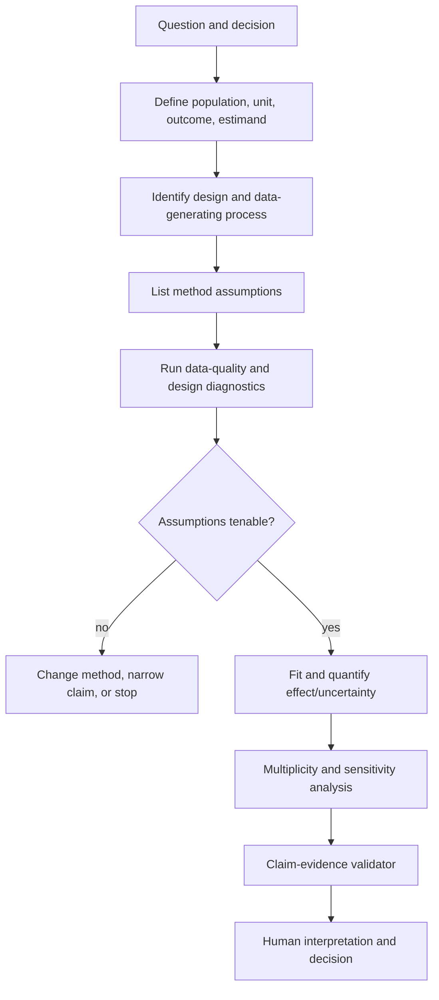

# Statistical Validity and Analytical Reasoning

**Research date:** 2026-08-31  
**Status:** Production design guide  
**Core rule:** The agent must separate description, inference, prediction, and causation before selecting a method or wording a claim

## Analysis class is a required field

| Class | Valid question | Minimum evidence | Prohibited shortcut |
|---|---|---|---|
| Descriptive | What happened in this observed dataset? | Defined population, denominator, time, data quality | Generalizing beyond observed data without uncertainty/design |
| Inferential | What does the sample imply about a target population? | Sampling/assignment assumptions, estimand, uncertainty | Treating a convenience sample as representative |
| Predictive | How well will an outcome be predicted on future cases? | Leakage-safe split, representative evaluation, calibration/drift | Reporting training fit as production performance |
| Causal | What would change under an intervention? | Credible identification design and assumptions | Translating association into causation |

If the request says “impact,” “driver,” “caused,” or “lift,” do not infer the class from vocabulary alone. Clarify whether the stakeholder wants a descriptive decomposition, prediction, randomized experiment analysis, or causal estimate.

## Statistical plan contract

For inferential or causal work, require:

```yaml
statistical_plan:
  analysis_class: inferential
  target_population: "eligible US web sessions during launch window"
  unit_of_analysis: assigned_session
  treatment_or_exposure: experiment_assignment
  outcome: paid_conversion_24h@v3
  estimand: "intention-to-treat absolute risk difference"
  design: randomized_controlled_experiment
  assignment_unit: assigned_session
  clustering_unit: user_id
  primary_hypothesis: "treatment effect equals zero"
  alpha: 0.05
  interval_level: 0.95
  multiplicity:
    family: primary_experiment_outcomes
    method: holm
  missingness:
    report_by_arm: true
    primary_handling: complete_outcome_after_24h_maturity
    sensitivity: ["best_worst_bounds"]
  effect_sizes: ["absolute_risk_difference", "relative_risk"]
  diagnostics: ["sample_ratio_mismatch", "covariate_balance", "cluster_size"]
  decision_rule: "business owner interprets effect and interval; p-value is not the decision"
  plan_frozen_at: "2026-08-15T00:00:00Z"
```

Exploratory analyses can be useful, but label them exploratory and record that hypotheses/methods were selected after seeing data. Do not convert an exploratory finding into a confirmatory claim by changing the prose.

## Hypothesis, test, and reviewer identity

Keep the business hypothesis, statistical hypothesis, executed test and human disposition separate.

```yaml
test_execution:
  test_id: exp_checkout_primary_paid_conversion
  test_version: 2
  hypothesis_id: hyp_checkout_paid_conversion_itt
  family_id: checkout_exp_primary_outcomes_v1
  family_plan_digest: sha256:...
  frozen_before_unblinding: true
  estimand: intention_to_treat_absolute_risk_difference
  inputs:
    cohort_ref: cohort://checkout_eligible@v4
    extract_digest: sha256:...
    arm_column: experiment_variant
    outcome_column: converted_24h
  method:
    name: cluster_robust_binomial_difference
    library: statsmodels
    library_version: 0.14.6
    missing_policy: reject_unexpected
    cluster: user_id
    alternative: two_sided
    interval_level: 0.95
    multiplicity_method: holm
  output_digest: sha256:...
```

The executed test version changes when inputs, sample/cohort, transformation, weights, clustering, missingness handling, alternative, interval, correction family/method, library, resampling count/seed, or code changes. Rerunning unchanged code on a corrected dataset is a new test execution linked by `supersedes` or `corrects`; it must not overwrite the original.

| Responsibility | Minimum owner | Model boundary |
|---|---|---|
| Metric/population/cohort meaning | Business metric owner and data owner | May surface conflicts; cannot certify meaning |
| Confirmatory hypothesis family and freeze | Experiment/method owner | May draft; cannot freeze after seeing outcomes |
| Method, estimand and causal identification | Qualified analyst/statistician/domain method owner | May enumerate assumptions; cannot approve identification |
| Data quality, maturity and leakage | Data owner plus analyst | May flag anomalies; deterministic checks and owners decide usability |
| Statistical output correctness | Versioned implementation plus independent validation | May explain only from validated output |
| Decision threshold and action | Authenticated decision owner | Cannot convert statistical significance into a business decision |
| External/high-impact claim | Named policy-required reviewers | Cannot approve or publish |

## Validation sequence



## Preconditions the agent must surface

### Population, unit, and denominator

Many business errors are denominator errors. Record eligibility before events occur, observation maturity, repeated units, exclusions, and whether missing records mean “no event” or “unknown.” A session-level outcome analyzed as independent when users contribute many sessions can understate uncertainty.

### Time

Pin time zone, calendar, attribution window, cohort entry, censoring, late-arriving data, and seasonality. Confirm that outcomes have matured equally across comparison groups. Avoid comparing partial current periods with complete historical periods unless explicitly adjusted and labeled.

### Missing data

First measure missingness by important group and time. statsmodels documents that missing values can silently produce all-`NaN` parameter estimates unless missing handling is specified. A production wrapper should reject unexpected missingness rather than inherit library defaults.

The agent should state:

- which fields are missing and how often;
- whether missingness follows data pipeline, eligibility, exposure, outcome, or covariate mechanisms;
- which assumption supports complete-case, imputation, weighting, bounds, or other handling;
- sensitivity of the conclusion to plausible alternatives.

### Dependence and clustering

Repeated users, stores, regions, time periods, households, or experiments violate independent-observation assumptions. Align standard errors/resampling with assignment and sampling units. Time-series data requires checks for trend, seasonality, autocorrelation, and structural breaks before ordinary independent-sample procedures.

### Model assumptions and diagnostics

Name assumptions instead of saying a method is “statistically valid.” Relevant checks may include residual structure, functional form, variance, distributional shape, overlap/positivity, proportional hazards, stationarity, randomization integrity, or measurement reliability. NIST’s engineering statistics handbook emphasizes checking assumptions and warns that violations of randomness can invalidate standard conclusions.

Diagnostics inform judgment; passing a normality test does not prove a model correct, and large samples can make trivial deviations “significant.”

## P-values, intervals, and practical importance

The American Statistical Association’s statement is clear that a p-value does not measure effect size or scientific/business importance and should not alone determine a conclusion.

Reports should include:

- effect estimate in decision-relevant units;
- interval estimate with method and level;
- sample size and effective sample size where clustering/weights apply;
- exact population, period, and estimand;
- p-value only when relevant and accompanied by its tested hypothesis;
- business threshold or minimum practically important effect when defined;
- assumption and sensitivity summary.

Avoid “no effect” when an interval includes both meaningful benefit and harm. Say the estimate is imprecise and show the compatible range.

## Multiplicity and researcher degrees of freedom

Testing many outcomes, segments, windows, models, or stopping times raises false-positive risk. The plan must define the hypothesis family and correction before confirmatory analysis. statsmodels exposes methods such as Bonferroni, Holm, and false-discovery-rate procedures; method selection depends on the decision and dependency structure, not convenience.

Production controls:

- freeze primary outcomes, segmentation, window, covariates, and method before unblinding when feasible;
- log all attempted analyses, not only the selected result;
- distinguish family-wise error control from false-discovery-rate control;
- label unplanned subgroup findings exploratory;
- require stronger evidence and independent validation for generated hypotheses;
- prevent the model from iterating until a threshold is crossed without recording the search.

## Experiments

Before effect estimation, check:

- assignment mechanism and intended unit;
- sample-ratio mismatch;
- eligibility and exposure logging;
- pre-treatment covariate balance as a diagnostic, not a rerandomization excuse;
- novelty, interference, spillover, attrition, noncompliance, and outcome maturity;
- pre-experiment power or minimum detectable effect;
- planned sequential monitoring or stopping rule;
- cluster design and variance estimation;
- metric definition changes during the experiment.

Prefer intention-to-treat as the default effect of assignment. Per-protocol or treatment-on-the-treated estimates require additional assumptions and should not be substituted because they look larger.

## Observational and causal analysis

For observational data, a regression coefficient is not automatically a causal effect. Require an identification narrative:

- treatment/exposure and hypothetical intervention;
- target population and estimand;
- confounders selected using domain knowledge and temporal order;
- mediators and colliders not adjusted for casually;
- overlap/positivity;
- measurement error and missingness;
- identification assumptions;
- falsification, negative-control, or sensitivity analyses where appropriate.

If these are unavailable, narrow wording to association or descriptive decomposition. A model can help enumerate assumptions, but a qualified reviewer owns the causal claim.

## Leakage and adaptive analysis

Leakage is not limited to predictive train/test splits. Reject or relabel analyses when outcome/future information influences:

- cohort eligibility, feature construction, imputation or filtering;
- experiment exposure assignment or outcome maturity;
- segment, time window, stopping point, hypothesis family or method selection;
- trusted examples or model context drawn from held-out evaluation answers;
- normalization, encoding, feature selection or tuning fitted before the split.

For predictive work, split by the deployment unit and time boundary before fitting preprocessing; keep every learned transformation inside the fitted pipeline. For confirmatory inference, freeze the plan before unblinding where feasible and log every post-unblinding deviation. For exploratory work, preserve the full search path and make independent confirmation the next step.

## Outliers and data-quality anomalies

NIST cautions that outliers may be bad data or genuine tail behavior and should not be discarded automatically. The workflow should:

1. preserve the raw extract;
2. trace provenance and units;
3. distinguish impossible, duplicate, pipeline, and plausible extreme values;
4. apply a predeclared handling rule;
5. report results with and without influential observations when material;
6. record every exclusion in the artifact.

## Machine-checkable claim contract

Separate calculations from narrative:

```json
{
  "claim_id": "claim_7",
  "type": "inferential_comparison",
  "text": "Treatment increased 24-hour paid conversion by 0.8 percentage points.",
  "evidence": ["stat://effect/primary/risk_difference"],
  "estimate": 0.008,
  "interval": {"lower": 0.001, "upper": 0.015, "level": 0.95},
  "population_ref": "population://sha256/...",
  "metric_ref": "paid_conversion_24h@v3",
  "method_ref": "method://sha256/...",
  "qualifiers": ["intention-to-treat", "US web sessions", "24-hour matured outcomes"],
  "prohibited_terms": ["proved", "guaranteed"]
}
```

A deterministic validator can verify that values, signs, units, intervals, population, metric, and qualifiers match the statistical output. It cannot determine whether the design assumptions are substantively credible; that remains an explicit review responsibility.

## When to stop

The correct result may be “this analysis cannot support the requested conclusion.” Stop or narrow the claim when:

- the metric/population/denominator is unresolved;
- outcome data is immature or selectively missing;
- an essential join cannot be validated;
- sample size or effective sample size cannot answer the decision-relevant question;
- overlap or identifying assumptions fail;
- metric/instrumentation changed incompatibly;
- multiplicity/search history is unavailable for a confirmatory claim;
- privacy-safe disclosure destroys needed detail;
- results cannot be tied to a reproducible source snapshot or extract.

## Evaluation cases

The local suite should contain analyses with known traps:

- Simpson’s paradox and aggregation reversal;
- ratio of sums versus mean of ratios;
- duplicated facts from joins;
- immortal-time and survivorship bias;
- incomplete cohort maturity;
- repeated users treated as independent;
- multiple testing and post-hoc segments;
- missing-not-at-random sensitivity;
- non-additive time measures;
- association framed as causal;
- small p-value with trivial effect and large effect with wide interval;
- outlier exclusion that reverses the conclusion;
- timezone and daylight-saving boundary errors.

Score the final claim and limitations, not only whether code executed.

## Checklist

- [ ] Analysis class, population, unit, denominator, outcome, period, and estimand are explicit.
- [ ] Confirmatory plans are frozen; exploratory searches remain labeled.
- [ ] Missingness, dependence, assumptions, and data quality are reported.
- [ ] Effects and intervals lead; p-values do not stand alone.
- [ ] Multiplicity family and method are declared.
- [ ] Causal wording requires a credible identification design.
- [ ] Sensitivity analyses address material assumptions.
- [ ] Every numerical claim resolves to a machine-readable result.
- [ ] The workflow can stop rather than fabricate certainty.

## Sources

- [ASA statement on p-values](https://www.amstat.org/asa/files/pdfs/p-valuestatement.pdf)
- [NIST process-model assumptions](https://www.itl.nist.gov/div898/handbook/pmd/section2/pmd2.htm)
- [NIST consequences of non-randomness](https://www.itl.nist.gov/div898/handbook/eda/section2/eda251.htm)
- [NIST guidance on outliers](https://www.itl.nist.gov/div898/handbook/prc/section1/prc16.htm)
- [CONSORT 2025 explanation and elaboration](https://www.bmj.com/content/bmj/389/bmj-2024-081124.full.pdf)
- [statsmodels missing-data handling](https://www.statsmodels.org/stable/missing.html)
- [statsmodels multiple-testing corrections](https://www.statsmodels.org/stable/generated/statsmodels.stats.multitest.multipletests.html)
- [statsmodels statistics and inference](https://www.statsmodels.org/stable/stats.html)
- [scikit-learn data-leakage guidance](https://scikit-learn.org/stable/common_pitfalls.html#data-leakage)
- [SciPy independent t-test](https://docs.scipy.org/doc/scipy/reference/generated/scipy.stats.ttest_ind.html)
