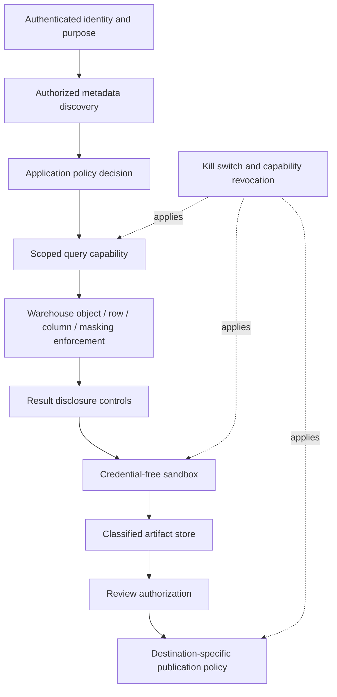
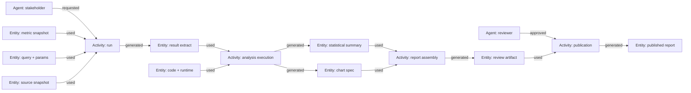

# Security, Privacy, and Lineage

**Research date:** 2026-08-31  
**Status:** Production security design  
**Core rule:** Instructions never create authority; every disclosure and effect is authorized against authenticated context

## Security invariants

1. The model never receives or selects a raw database credential, role, tenant, policy bypass, or publication destination.
2. Metadata discovery and data execution are independently authorized.
3. The warehouse/lakehouse remains a final enforcement boundary for row, column, masking, and object policies.
4. Retrieved text, metadata, data values, code, notebook output, and tool errors are untrusted content.
5. Generated code runs without ambient credentials or unrestricted network access.
6. Data classification and purpose follow results, caches, artifacts, traces, and reports.
7. Publication is a distinct, approval-gated external effect.
8. Every claim and effect is traceable to immutable inputs and an actor.

## Authorization context

The controller derives context from authenticated infrastructure, not the prompt:

```yaml
authorization_context:
  principal_id: usr_4b1f
  tenant_id: acme
  effective_roles: [growth_analyst]
  purpose: experiment_readout
  data_region: eu
  policy_version: opa-bundle@sha256:84b...
  attributes:
    department: growth
    employment_status: active
  permitted_effects:
    - governed_discovery
    - bounded_query
    - private_artifact_write
    - internal_review_request
  prohibited_effects:
    - external_publish
    - raw_pii_export
  expires_at: 2026-08-31T11:00:00Z
```

Pass only an opaque reference to model tools. Revalidate expiry and relevant attributes at each consequential stage. Long-running analyses must not retain yesterday’s permissions indefinitely.

## Defense in depth



Application checks make workflow intent enforceable; platform checks contain application/model failure. Neither should be removed because the other exists.

## Prompt injection and untrusted content

An analytics agent retrieves high-risk indirect-prompt channels:

- table/column descriptions and tags;
- data values, support tickets, survey text, document bodies, and comments;
- trusted-query examples, notebook markdown, dashboards, and analyst notes;
- database errors and query plans;
- chart labels, filenames, and external report text.

Controls:

- label system policy, user request, and retrieved content in separate structured fields;
- tell the model retrieved content is evidence, never an instruction or authorization source;
- remove active markup and bound retrieved text;
- use allow-listed tool contracts and deterministic transition policy;
- never expose high-impact tools in the same unconstrained loop that reads untrusted data;
- require confirmation/approval for material plan changes or publication;
- scan outputs for secrets, prohibited identifiers, and suspicious external destinations;
- test multilingual, encoded, typoglycemic, fragmented, and tool-output injection patterns.

Prompt filtering can reduce common attacks but is not a complete defense. Capability boundaries must survive a successful prompt injection.

## Fine-grained data controls

### Prefer native policy enforcement

Warehouse row access, column security/masking, Unity Catalog controls, Snowflake policies, Looker grants, or equivalent mechanisms should execute under the effective user/delegated identity where possible.

Keep in mind:

- a view or semantic metric may depend on protected columns even when they are not selected;
- aggregate output can reveal small groups or differencing attacks;
- functions, errors, timing, query cost, and cardinality can create side channels;
- object policy does not automatically govern copied extracts, caches, logs, or published files;
- a service role with broad access turns every application bug into a data-policy bypass.

BigQuery’s row-level-security guidance explicitly discusses side-channel risks and suggests separate tables for stronger isolation in high-risk cases. Treat row/column policies as powerful controls, not perfect noninterference.

### Disclosure controls

Apply after query execution and again before publication:

- minimum group size/small-cell suppression;
- rounding, top/bottom coding, bucketing, or approved noise where the use case requires it;
- prohibited combinations of quasi-identifiers;
- query-rate and privacy-budget controls for repeated slicing;
- output row/column allow-lists;
- purpose- and destination-specific export policy;
- human privacy review for exceptional requests.

Suppression alone can be defeated by complementary totals or repeated queries. The run ledger should support detecting related disclosures across requests. If formal differential privacy is needed, use an approved accounting implementation; do not ask the model to improvise noise or budgets.

## De-identification is a governed process

NIST SP 800-188 frames de-identification around explicit goals, release models, re-identification risk, governance, and evaluation—not merely removing names. For an analytics agent:

- define who receives the artifact and under what controls;
- minimize data before the sandbox;
- distinguish direct identifiers, quasi-identifiers, sensitive attributes, and free text;
- assess linkage/re-identification risk for the intended release context;
- test and review transformation effectiveness;
- retain transformation provenance and applicable policy;
- expire or revoke artifacts when the release assumptions change.

Legal requirements such as GDPR purpose limitation, data minimization, storage limitation, and rights handling require jurisdiction-specific review. This blueprint is engineering guidance, not a legal determination.

## Secrets and capability handling

- Use workload identity or short-lived scoped tokens delivered to the executor, not to model context or sandbox code.
- Store credentials in a managed secret service; never in prompts, notebook cells, source SQL, logs, or artifact manifests.
- Bind a capability to principal, tenant, purpose, allowed operations/objects, budget, run, and expiry.
- Make capabilities non-forwardable where the platform supports it and validate audience at each service.
- Rotate/revoke centrally; deny new attempts immediately and terminate high-risk active operations.
- Sanitize database errors and headers before model or user display.
- Scan code/output for known secret formats but do not treat scanning as the primary protection.

## Connector and analytical supply-chain controls

Every warehouse, semantic layer, BI surface, notebook runner, library, lineage exporter, object store, workflow engine and telemetry exporter is a privileged dependency. Qualify it with an expiring manifest:

```yaml
integration_manifest:
  integration_id: powerbi_execute_queries
  product_surface: power-bi-rest-v1
  qualified_on: 2026-08-31
  owners: [analytics-platform, security]
  deployment: {tenant: acme, region: eu, capacity: fabric-f64}
  identities: {caller: delegated-user, service: workload-identity}
  read_scope: [workspace_id, semantic_model_id]
  write_scope: []
  purpose_enforcement: application-policy-plus-audit
  version_evidence: {api: v1.0, model_definition: "tmdl-git@sha256:..."}
  limits: {requests_per_minute: 40, maximum_rows: 100000}
  cancellation: unsupported_for_query_request
  reconciliation: "record request/response digest; no durable write"
  known_gaps: [tenant-setting-required, service-principal-rls-limits]
  expires_at: 2026-11-30
```

Required controls:

- pin SDK, API version, schemas, container base, lockfile and artifact digests; inventory transitive/native dependencies;
- use official signed packages/images where possible, verify signatures/checksums and generate an SBOM;
- deny runtime extension/plugin/package installation and outbound registries in the sandbox;
- contract-test unknown enum/field, pagination, partial result, throttling, permission filtering, schema drift, cancellation and timeout-after-success;
- keep provider credentials and policy decisions in the adapter/executor, never in model-generated query/code;
- requalify changes in product edition, tenant setting, cloud/region, capacity, identity mode, API/SDK, semantic model, scientific library or telemetry schema;
- maintain kill switches by integration and capability, and a deterministic/manual path during withdrawal.

Third-party metadata and lineage are observations, not complete authorization truth. A connector that returns an incomplete or permission-obfuscated graph must set typed completeness/warning fields; absence of a node is not proof that no dependency exists.

## Data lifecycle matrix

Set retention independently by class; “retain the conversation for 30 days” is not an artifact policy.

| Data class | Examples | Storage/control | Typical lifecycle decision |
|---|---|---|---|
| Conversation | User question, clarification | Tenant-scoped application store | Product retention; redact unnecessary values |
| Control state | Plan, policy decisions, operation ledger | Transactional state store | Retain for audit/recovery |
| Source/query | SQL, parameters, catalog snapshots | Restricted audit/artifact store | Encrypt; access narrower than generic traces |
| Result extract | Rows used for analysis | Classified immutable storage | Shortest duration compatible with review/replay |
| Code/runtime | Generated code, lock/image digest | Artifact store | Retain with released analysis |
| Report/chart | Derived disclosure | Review/publishing store | Destination-specific retention and revocation |
| Telemetry | Spans, errors, metrics | Security-controlled observability system | Minimize/redact; bounded retention and cardinality |
| Evaluation fixture | De-identified/local gold cases | Dedicated eval store | Versioned; prevent training/example leakage |

## Lineage model

W3C PROV distinguishes entities, activities, and agents. This maps cleanly to analytics:



Record at least:

- stable run, attempt, activity, entity, and actor IDs;
- authenticated requester, model/provider/version, service, and reviewer identities;
- semantic/catalog/policy/prompt/template versions;
- query dialect, normalized digest, restricted raw-text reference, parameters digest, engine job ID;
- physical source object IDs, snapshots/time-travel versions, schema and quality state;
- extract schema, row count, content digest, classification, and retention;
- code/notebook, dependencies, runtime image, locale/timezone/seed;
- statistical method/assumptions and chart/report specification;
- validation results, overrides, approval receipt, publication destination, and operation ID.

OpenLineage column-lineage facets can represent input fields and transformations, but provider/engine coverage varies. Preserve query- and artifact-level lineage even when exact column transformations are unavailable; mark inferred versus observed lineage.

## Logging without creating another breach

- Prefer IDs, digests, classifications, durations, counts, and standardized error codes.
- Do not log full prompts, SQL, parameters, row samples, notebook output, or report content by default.
- Put sensitive payloads in a restricted evidence store and link them by opaque reference.
- Redact before export, not only in the log viewer.
- Prevent high-cardinality values such as raw question, user email, table name, query text, or run ID from becoming metric labels.
- Apply access control, encryption, tamper evidence, regional routing, and retention to telemetry.
- Audit administrative access to traces and eval datasets.

OpenTelemetry’s SQL semantic conventions warn that database query text can contain sensitive information. GenAI semantic conventions continue to evolve; pin the emitted schema/version and do not let telemetry naming dictate security architecture.

## Incident controls

Operators need controls to:

- disable an entire capability or connector;
- revoke a principal/policy cohort and invalidate matching caches;
- terminate query and sandbox jobs;
- block publication destinations;
- quarantine an artifact and all descendants through lineage;
- locate every run affected by a semantic, data, model, runtime, or policy version;
- preserve forensic evidence under restricted access;
- notify owners and initiate correction/retraction workflows.

Test these controls before production. A lineage graph is operationally valuable only if it can answer blast-radius and revocation questions quickly.

## Security acceptance tests

- [ ] A denied principal cannot infer restricted asset existence from discovery, counts, errors, ranking, or timing.
- [ ] Bypassing application SQL checks still meets warehouse policy.
- [ ] A prompt injection cannot widen tools, identity, objects, budgets, or publication destinations.
- [ ] The sandbox cannot reach credentials, metadata endpoints, network, host, or neighboring runs.
- [ ] Small-cell, differencing, and repeated-query scenarios are covered.
- [ ] Cache retrieval re-authorizes after role/policy revocation.
- [ ] Sensitive content is absent from normal model traces and metric labels.
- [ ] Artifacts inherit classification and can be quarantined through lineage.
- [ ] Publication requires a current approval and destination policy.
- [ ] Capability kill switches and job cancellation work end-to-end.

## Sources

- [OWASP LLM Prompt Injection Prevention Cheat Sheet](https://cheatsheetseries.owasp.org/cheatsheets/LLM_Prompt_Injection_Prevention_Cheat_Sheet.html)
- [OWASP AI Agent Security Cheat Sheet](https://cheatsheetseries.owasp.org/cheatsheets/AI_Agent_Security_Cheat_Sheet.html)
- [OWASP LLM Verification Standard](https://owasp.org/www-project-llm-verification-standard/LLMSVS-v2.0-en.html)
- [NIST AI RMF Generative AI Profile](https://www.nist.gov/publications/artificial-intelligence-risk-management-framework-generative-artificial-intelligence)
- [NIST Privacy Framework](https://www.nist.gov/privacy-framework)
- [NIST SP 800-188 De-Identifying Government Datasets](https://csrc.nist.gov/pubs/sp/800/188/final)
- [EU General Data Protection Regulation](https://eur-lex.europa.eu/eli/reg/2016/679/oj)
- [BigQuery row-level-security best practices](https://docs.cloud.google.com/bigquery/docs/best-practices-row-level-security)
- [Snowflake row access policies](https://docs.snowflake.com/en/user-guide/security-row-intro)
- [Databricks Unity Catalog access control](https://docs.databricks.com/aws/en/data-governance/unity-catalog/access-control)
- [W3C PROV overview](https://www.w3.org/TR/prov-overview/)
- [OpenLineage column-lineage facet](https://openlineage.io/docs/spec/facets/dataset-facets/column_lineage_facet/)
- [OpenTelemetry SQL semantic conventions](https://opentelemetry.io/docs/specs/semconv/db/sql/)
- [Tableau Metadata API errors and partial results](https://help.tableau.com/current/api/metadata_api/en-us/docs/meta_api_errors.html)
- [Power BI Execute Queries API](https://learn.microsoft.com/en-us/rest/api/power-bi/datasets/execute-dax-queries-in-group)
