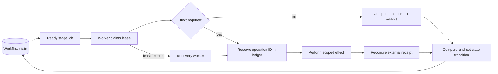

# State, Workflows, Reliability, and Recovery

**Research date:** 2026-08-31  
**Status:** Production reliability design  
**Core rule:** Context is a projection for reasoning; durable state and effect history live outside the model

## Separate state by responsibility

Do not serialize the whole system into a chat transcript.

| State class | Contents | Store | Mutability/retention |
|---|---|---|---|
| Conversation | Requests, clarifications, explanations | Product conversation store | Editable/redactable under product policy |
| Run control | Current state, version, risk, deadlines, budgets, approval gates | Transactional workflow/state store | Optimistic concurrency; auditable transitions |
| Semantic context | Selected metrics/entities, catalog and semantic snapshots | Versioned run record | Immutable after plan approval unless run version changes |
| Evidence | Query, extract, code, statistics, charts, report | Immutable artifact/object store | Content-addressed/versioned |
| Effect ledger | Operation IDs, requests, outcomes, external receipts | Transactional idempotency ledger | Append/transition with uniqueness constraints |
| Authorization | Principal/purpose/policy references and decisions | Policy/audit store | Short-lived context plus retained decision record |
| Telemetry/evaluation | Spans, metrics, eval results, feedback | Observability/eval stores | Redacted and retention-bounded |

The model receives a bounded context projection containing the current plan version, allowed next decisions, safe evidence summaries, and relevant errors. It does not infer state by rereading every prior message.

### Typed contract family

Do not overload “plan,” “tool call,” “event,” and “effect.” They cross different trust and retry boundaries.

| Contract | Authoritative contents | Forbidden shortcut |
|---|---|---|
| `AnalyticsRequest` | Authenticated requester/purpose, canonical question version, decision owner, deadline and risk inputs | Treating user prose as resolved identity, metric, cohort, authority or approval |
| `AnalyticsState` | Run/state version, plan and semantic versions, event/source high-watermarks, budgets, approvals, leases, evidence, pending effects and owner | Reconstructing truth from a chat transcript or model summary |
| `AnalyticsEvent` | Event ID, run ID, monotonic sequence, type/schema version, source, occurred/recorded time, actor, causation/correlation, prior/new state version and payload digest | Mutating state without a valid append-only transition or silently accepting gaps/unknown schema |
| `AnalysisPlan` | Versioned question, hypothesis/cohort/metric/dataset refs, analysis class, typed steps, budgets, assumptions, validators, stop conditions and approval class | Executable prose, mutable “latest” references or model-selected credentials |
| `AnalyticsTool` | Capability/version, closed input/output schemas, observation/effect class, auth injection, timeout/cancel, limits and adapter support | Generic `run_sql`/`run_python`/`publish` surface or model-supplied principal/budget |
| `AnalyticsEffect` | Canonical operation, run/artifact version, semantic operation key, approval/policy binding, executor identity, attempt and reconciliation method | Equating dispatch, HTTP success or model narration with completed outcome |
| `AnalyticsReceipt` | Native job/object/revision ID, normalized status, request/result digests, observed version, cost, verification, residual unknowns and timestamps | Boolean `success` without native or independent evidence |

Reducers accept one state version plus one valid event and emit the next version. Reject event sequence gaps, duplicate IDs with different digests, out-of-order transitions, unknown schemas, stale fencing tokens, plan/artifact mismatches and terminal-state mutation. Model output may propose an `AnalysisPlan`; it cannot mint authoritative events, approvals, effect status or receipts.

```yaml
event:
  schema: analytics-event/1.0
  event_id: evt_01J...
  run_id: run_01J...
  sequence: 184
  type: extract_committed
  source: query-executor
  occurred_at: 2026-08-31T10:43:12.501Z
  recorded_at: 2026-08-31T10:43:12.719Z
  actor_ref: svc://query-executor/prod
  causation_id: op_materialize_run01_v4
  correlation_id: run_01J...
  expected_state_version: 36
  new_state_version: 37
  payload_ref: artifact://sha256/08fa...
  payload_digest: sha256:...
```

## Context, compaction, and memory decisions

These are exactly seven memory lifetimes. A cache, transcript, vector index, provider thread, warehouse history or artifact store must map to one of them; do not create an ungoverned eighth memory.

| Named lifetime | Use | Reject | Retention/deletion | Poisoning and continuity tests |
|---|---|---|---|---|
| **Turn/scratch memory** | One bounded model step: current question/plan step, allowed actions, safe evidence excerpts, budgets and structured errors | Credentials, raw unrestricted results, stale observations, approval/effect truth existing only in prompt | Discard after the call except separately governed minimal trace metadata; honor provider retention controls | Secret/PII canaries, indirect injection, token truncation, stale-evidence refusal, prove omitted scratch cannot change authority |
| **Working/run memory** | Typed hypotheses, clarifications, open checks, rejected metrics/queries/methods, evidence IDs, caveats and next planned step | Raw result copies, model prose as fact, unversioned mutable summaries, effect status without ledger/receipt | Run lifetime plus short review window; delete derived sensitive content independently and rebuild from durable records | Crash/restart, concurrent update, repeated compaction, hypothesis-versus-observation separation, source-correction invalidation |
| **Session memory** | UX continuity: links to active runs and explicit temporary display/accessibility choices | Metric/cohort selection, tenant/purpose, approval, risk, credentials, effect or safe-resume state | Short idle/absolute TTL; user-visible deletion; never required to resume safely | New-session reconstruction, cross-user/tenant isolation, deletion propagation, malicious/stale prior-turn injection |
| **Durable workflow/task memory** | Authoritative request/plan/state/events, source high-watermarks, approvals, leases, queries, artifacts, effects, receipts, corrections, owner and terminal record | Chat transcript as state, raw secrets, mutable overwrites without version/event, ambiguous effect collapsed to failure | Audit/operations/legal policy; sensitive payloads referenced separately; deletion/legal hold are explicit and propagated | Full replay, duplicate/out-of-order event, crash at each effect boundary, schema migration, tamper evidence, backup/restore and DR reconciliation |
| **Domain knowledge memory** | Governed metrics, entity/join/time/cohort rules, policies, schemas, methods, trusted examples, capability profiles, owners and SLOs | Uncited model conclusions, raw query popularity as truth, provider behavior generalized across deployments, stale snapshots as live | Source-system lifecycle with version, provenance, owner, effective interval, refresh, supersession and deletion | Revocation/freshness/contradiction, unauthorized discovery, poisoned descriptions/examples, adapter/version matrix and deletion re-indexing |
| **Long-term/preference memory** | Opt-in low-risk presentation, locale and accessibility preferences | Population/metric defaults that change meaning, risk tolerance, approvals, privileged aliases, inferred sensitive profile | Purpose/consent/expiry; user view/edit/export/delete; never indefinite by convenience | Consent/expiry, no-privilege influence, cross-user isolation, correction/deletion and re-personalization tests |
| **Episodic/outcome memory** | Human-reviewed corrections, wrong analyses, incidents and outcomes converted into minimized eval fixtures or proposed governed examples/runbooks | Raw model traces/conclusions, production rows, unresolved reviewer disagreement, automatic self-promotion or online learning | Curated corpus with provenance, scope, redaction, owner, review/refresh/expiry and deletion propagation | Holdout leakage, sensitive-data scan, label agreement, selection-bias slice, stale-policy replay, provenance and poisoning withdrawal |

### Restart-safe compaction receipt

Compaction changes only the model’s `Working/run` projection. It never replaces `Durable workflow/task` records, source artifacts or the effect ledger.

```yaml
receipt_schema: analytics-compaction-receipt/1.0
receipt_version: 1
run_id: run_01J...
state_version: 37
source_event_high_watermark:
  event: 184
  semantic_catalog: "snapshot:prod-semantic@8f42e0c/hash:sha256:..."
  warehouse_sources:
    - "bigquery://project/dataset/table@snapshot-20260831/schema:sha256:..."
  policy_bundle: "opa-bundle@sha256:84b..."
versions:
  question: 3
  cohort: checkout_experiment_eligible_sessions@v4
  analysis_plan: plan_01J...@v4
  model: provider/model-snapshot
  prompt: analytics-agent/8
  controller: 3.4.1
  policy: analytics-prod/19
  semantic_compiler: metricflow/0.211.0
  query_adapter: bigquery/2.4.1
  schemas: [analytics-state/2, analytics-event/1, analysis-plan/3, analytics-effect/2]
principal_and_purpose: {principal_ref: authctx_7e4c, purpose: experiment-readout, expires_at: 2026-08-31T11:00:00Z}
retained_plan: {plan_id: plan_01J..., digest: "sha256:...", next_step: reconcile-query}
retained_evidence:
  - {id: qry_01J..., digest: "sha256:...", status: submitted, native_job_id: job_...}
  - {id: artifact_01J..., digest: "sha256:...", status: immutable}
unresolved: [query-completion-unknown, outcome-maturity-check]
approvals:
  - {approval_id: apr_01J..., bound_digest: "sha256:...", status: granted, expires_at: 2026-08-31T11:15:00Z}
active_clocks:
  - {clock_id: approval-expiry, due_at: 2026-08-31T11:15:00Z, owner: analysis-controller}
pending_effects:
  - {effect_id: eff_query_01J..., status: UNKNOWN, native_id: job_..., reconciliation: required}
pending_effect_ids: [eff_query_01J...]
unknown_effect_ids: [eff_query_01J...]
budgets_and_stop_conditions: {remaining_bytes: 50000000000, run_deadline: 2026-08-31T11:10:00Z, stop_on_policy_change: true}
omitted_items: [raw-result-rows, raw-sql, secrets, rejected-candidate-descriptions]
next_safe_action: "reconcile eff_query_01J by native job ID before any resubmission"
invariant_hash: "sha256:..."
compactor: {version: analytics-context/4.2, input_digest: "sha256:...", output_digest: "sha256:..."}
```

The `invariant_hash` covers tenant/principal/purpose, question/population/cohort/metric/time semantics, dataset snapshots, analysis class/hypothesis family, plan/artifact digests, budgets/stop rules, privacy/causal boundaries, approvals, pending/`UNKNOWN` effects and correction obligations. Resume reloads durable state, verifies state/event/source high-watermarks and hashes, refreshes expiring authorization/freshness, reconciles unknown effects, then obeys `next_safe_action`. A gap, unknown schema/version, stale approval, source/semantic change or hash mismatch blocks normal planning. Repeated-compaction tests must preserve the same next safe action and prove that no identity, caveat, approval, pending effect, uncertainty, deletion/correction duty or stop condition disappears.

## State machine and invariants

The lifecycle in [the blueprint overview](README.md#end-to-end-lifecycle) should be encoded as a versioned state machine. Example invariants:

- `Executing` requires an unexpired authorization decision, validated query digest, source/semantic snapshots, and reserved budget.
- `Analyzing` requires a committed, validated extract; it cannot consume a streaming partial query response.
- `Drafted` requires successful numerical, statistical, privacy, and artifact checks or explicit authorized exceptions.
- `Published` requires an immutable reviewed artifact digest, current approval receipt, destination policy, and successful publication operation.
- Any upstream digest change invalidates dependent validations, approvals, and publication readiness.



## Tool/effect classifications

The same word “tool” hides different retry semantics.

| Class | Examples | Retry rule |
|---|---|---|
| Pure computation | Parse query, validate schema, compute digest | Retry freely with same versioned inputs |
| Governed read | Catalog lookup, metric resolution | Retry while auth/snapshot remains valid; preserve observed version |
| Costly read | Query execution | Reconcile job first; retry transient failures within cost budget and pinned snapshot |
| Untrusted computation | Sandbox analysis | Retry from committed extract in fresh sandbox; preserve attempt and runtime versions |
| Internal durable write | Commit artifact, create review task | Stable operation ID and unique constraint/content digest |
| External effect | Publish report, send notification | Idempotency key plus destination reconciliation; never blind-retry unknown completion |

Even a read can be consequential: it can reveal data, consume credits, lock resources, populate caches, or alter audit state.

## Idempotency ledger

For every durable or external effect, persist intent before execution:

```yaml
operation:
  operation_id: op_publish_run01_v4_internal-report
  run_id: run_01
  run_version: 4
  kind: publish_artifact
  request_digest: sha256:aa91...
  artifact_digest: sha256:82c0...
  destination_id: internal_reports_growth
  authorization_decision_ref: policy_01J7...
  approval_receipt_ref: review_01J7...
  state: reserved
  attempt: 1
  external_id: null
  created_at: 2026-08-31T10:55:00Z
```

State progression should distinguish `reserved`, `started`, `succeeded`, `failed_retryable`, `failed_terminal`, and `unknown`. Put a uniqueness constraint on the semantic operation key. Return the stored success for duplicate requests with the same digest; reject reuse with different content.

“Exactly once” is normally an application outcome assembled from at-least-once delivery, idempotent destination behavior, and reconciliation. Do not claim it merely because the workflow engine retries tasks.

## Concurrency control

Typical races:

- two workers compile or execute different plan versions;
- the user edits a question while plan approval is pending;
- policy expires after estimate but before query execution;
- a reviewer approves an artifact while a refreshed result is committed;
- cache invalidation races with a role revocation;
- cancel and publish arrive concurrently.

Controls:

- monotonically increasing `run_version` and compare-and-set transitions;
- immutable artifact digests and approvals bound to exact digests;
- leases for stage ownership, with fencing tokens for downstream writes;
- authorization recheck at execution/publication, not only planning;
- per-run and per-operation uniqueness constraints;
- cancellation state checked before and after external calls;
- destination-side conditional writes/version checks where available.

Never use a distributed lock as the only guarantee that an old worker cannot write. A fencing/version token must make stale writes fail.

## Retry policy

Classify by error code rather than catching all exceptions.

| Error | Default action |
|---|---|
| Model timeout/rate limit | Bounded exponential backoff; preserve prompt/tool schema versions |
| Invalid structured output | One or two constrained repair attempts, then fail/route for review |
| Unauthorized/policy denied | Terminal unless authenticated context changes; never prompt-repair around it |
| Schema/semantic version changed | Replan as a new run version; invalidate approval |
| Query estimate over budget | Revise plan or request budget approval; do not auto-increase |
| Engine transient unavailable | Reconcile job, then retry within deadline/budget |
| Query timeout/resource exceeded | Revise query or escalate; repeated blind retries amplify load |
| Sandbox infrastructure failure | Retry in fresh sandbox with same inputs; distinguish code failure |
| Deterministic code/stat validation failure | Do not retry unchanged code; return structured failure to planning |
| Artifact-store timeout | Read by operation/content key before repeating write |
| Publication unknown | Reconcile destination by idempotency key/external receipt |

Use exponential backoff with jitter and maximum elapsed time. Retry budgets should be part of the run budget and circuit breakers should open during provider, warehouse, or destination degradation.

## Checkpoints and resume

Safe checkpoints are immutable boundaries:

1. clarified request and risk classification;
2. approved analysis plan and semantic snapshot;
3. validated/estimated query digest;
4. committed result extract;
5. committed analysis outputs;
6. validated review artifact;
7. approval receipt;
8. publication receipt.

Resume from the latest compatible checkpoint. Compatibility means all required versions and authorizations remain valid. A cached model conversation is not a checkpoint if its referenced semantic model or extract changed.

## Partial-failure matrix

| Failure point | Evidence available | Recovery |
|---|---|---|
| Query succeeded, client timed out | Engine job ID, possibly no extract | Poll/reconcile job; materialize exactly once if result still authorized |
| Extract written, manifest commit failed | Content object/digest | Discover by operation ID/digest, validate, then commit reference or quarantine |
| Sandbox killed after files produced | Untrusted staging outputs only | Discard staging; rerun fresh unless promotion record proves validation completed |
| Report built, review request failed | Immutable report digest | Create/reconcile review operation with stable key |
| Approval recorded, artifact superseded | Approval bound to old digest | Keep historical approval; require review for new digest |
| Destination accepted publish, response lost | Operation ID and destination key | Query destination/reconcile; never publish a second copy blindly |
| Policy revoked mid-run | Prior decision plus revocation event | Cancel pending stages, terminate effects where required, invalidate cache/review readiness |

## Timeouts and cancellation

Define timeouts at each layer:

- user/request deadline;
- workflow stage deadline;
- model call timeout;
- warehouse job timeout;
- sandbox wall clock;
- artifact and destination call timeout;
- total run expiry/review expiry.

Cancellation must propagate to provider calls, warehouse jobs, sandbox process trees, queued tasks, and publication operations where supported. A UI “cancelled” label without stopping the query does not meet the control.

Use heartbeats for workers and long engine jobs, but distinguish a lost heartbeat from a known failed operation. Reconcile before replacement.

## Graceful degradation

During dependency failure:

- semantic layer unavailable: do not silently fall back to free-form production SQL; offer saved/certified analyses or pause;
- reasoning model unavailable: allow deterministic refresh of an already approved, version-compatible plan if policy permits;
- sandbox unavailable: return validated query result/table without invented statistical narrative;
- lineage/artifact store unavailable: do not publish an untraceable result;
- review system unavailable: keep artifact pending; never downgrade approval;
- telemetry degraded: decide which low-risk work may continue, but security/audit ledger failure should fail closed.

## Recovery and disaster planning

- Back up transactional state and idempotency ledger consistently.
- Replicate or version immutable artifacts according to region and retention policy.
- Test restore with references and digests intact.
- Preserve adapters/images/locks needed to replay supported retention periods.
- Rebuild derived search indexes/caches from canonical stores rather than backing them up as authority.
- Document behavior when historical provider models, warehouse snapshots, or container images are no longer available.
- Run periodic orphan reconciliation for queries, sandboxes, staging objects, review tasks, and destination artifacts.

## Reliability tests

- [ ] Kill each worker before call, during call, after external success, and before state commit.
- [ ] Deliver each job twice and out of order.
- [ ] Expire worker leases and prove fenced workers cannot commit.
- [ ] Change plan, semantic, policy, and artifact versions during every approval boundary.
- [ ] Revoke authorization between discovery, estimate, execute, cache read, review, and publication.
- [ ] Lose provider responses and reconcile by job/operation ID.
- [ ] Enforce total cost/deadline across retries, not per attempt.
- [ ] Restore state/artifacts from backup and resume or safely terminate.
- [ ] Detect and clean orphaned jobs, sandboxes, temporary objects, and publications.

## Framework boundary

An agent or workflow framework may supply task queues, checkpoints, retries, timers, durable execution, or human-interaction primitives. The application must still define:

- what each state means;
- which versions invalidate a checkpoint;
- which error categories are retryable;
- the idempotency key and reconciliation method for every effect;
- who may approve which artifact/destination;
- how cancellation and revocation propagate;
- what is retained for audit and recovery.

Test framework upgrades with crash/replay fixtures. Serialization compatibility or retry defaults are operational behavior, not implementation trivia.

## Sources and related guides

This guide synthesizes database/job semantics from the engine sources in [query planning](03-query-planning-validation-and-execution.md) with the repository’s broader reliability material:

- [Durable execution](../../runtime/durable-execution.md)
- [Failure taxonomy](../../reliability/failure-taxonomy.md)
- [Idempotency and side effects](../../reliability/idempotency-and-side-effects.md)
- [Orchestration patterns](../../orchestration/README.md)
- [BigQuery jobs API](https://docs.cloud.google.com/bigquery/docs/reference/rest/v2/Job)
- [Snowflake query history](https://docs.snowflake.com/en/sql-reference/account-usage/query_history)
- [Jupyter Server security](https://jupyter-server.readthedocs.io/en/latest/operators/security.html)
