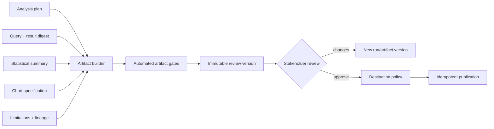

# Artifacts, Charts, and Stakeholder Review

**Research date:** 2026-08-31  
**Status:** Production design guide  
**Core rule:** A report is a versioned evidence product, not a transcript of the model’s final message

## Artifact-first output

The agent should assemble a review artifact from machine-readable evidence. Chat may summarize or link to it, but chat history is not the canonical report.



## Artifact structure

Every published analysis should have:

1. **Decision context:** question, intended decision, requester, audience, purpose, risk class.
2. **Definitions:** population, denominator, unit, period/time zone, metric versions, filters and exclusions.
3. **Answer:** concise conclusion calibrated to evidence.
4. **Evidence:** tables, effects/intervals, charts, source freshness, and quality notes.
5. **Methods:** query/semantic path, analysis class, statistical design and assumptions.
6. **Limitations:** missingness, uncertainty, design limits, privacy transformations, non-reproducible inputs.
7. **Provenance:** immutable manifest, source/query/code/runtime/artifact digests.
8. **Review:** validator results, exceptions, reviewer identity/role, decision, timestamp, version.

Keep raw sensitive extracts and query text in restricted attachments; expose a safe summary and opaque evidence link to general readers.

## Claim-to-evidence binding

Narrative claims should reference typed evidence nodes, not merely a chart title.

| Claim type | Required evidence | Automated validation |
|---|---|---|
| Exact descriptive value | Result cell or aggregate ID | Value, unit, format, population, period |
| Comparison | Two compatible evidence nodes | Direction, difference/ratio calculation, denominators |
| Trend | Ordered time series | Time zone/grain, gaps, interval completeness, slope/wording |
| Inferential effect | Statistical result object | Estimate, interval, method, multiplicity, qualifiers |
| Causal claim | Effect plus approved design record | Identification class and reviewer gate |
| Forecast | Versioned model/eval/output | Horizon, uncertainty, evaluation window, drift status |

If evidence changes, all dependent claims, charts, review receipts, and published-ready state are invalidated.

## Declarative chart contract

Prefer a validated declarative specification such as Vega-Lite for standard charts. Preserve the spec and the rendered output.

```json
{
  "$schema": "https://vega.github.io/schema/vega-lite/v6.json",
  "description": "Paid conversion by experiment arm with 95% confidence intervals.",
  "data": {"name": "approved_result_sha256_08fa"},
  "mark": {"type": "point", "filled": true, "size": 100},
  "encoding": {
    "x": {
      "field": "experiment_variant",
      "type": "nominal",
      "title": "Experiment arm",
      "sort": ["control", "treatment"]
    },
    "y": {
      "field": "conversion",
      "type": "quantitative",
      "title": "Paid conversion within 24 hours",
      "scale": {"zero": true},
      "axis": {"format": ".1%"}
    },
    "yError": {"field": "ci_half_width"},
    "color": {
      "field": "experiment_variant",
      "type": "nominal",
      "legend": null
    },
    "tooltip": [
      {"field": "experiment_variant", "type": "nominal", "title": "Arm"},
      {"field": "conversion", "type": "quantitative", "format": ".2%"},
      {"field": "eligible_sessions", "type": "quantitative", "title": "Eligible sessions"}
    ]
  }
}
```

Bind the named data source to an approved result digest. Do not let the renderer fetch arbitrary remote URLs.

## Truthful chart checks

Automate checks where possible:

- selected fields exist and types match;
- aggregation in the chart does not double-aggregate a governed result;
- units, currency, time zone, and denominator are visible;
- time axes are ordered and gaps are not silently connected;
- categorical axes are not presented as continuous;
- zero baselines are used for bars unless a justified alternative is prominently disclosed;
- truncated axes and dual axes trigger review;
- color scales match ordered/diverging/nominal meaning;
- uncertainty is shown for inferential estimates;
- small samples and suppressed cells are represented honestly;
- labels and rounding do not reverse or exaggerate differences;
- chart title states what is shown, not an unsupported cause;
- legend, sorting, facets, and filters match the plan.

Charts should not recompute business logic that belongs in the query/statistical stage. Store tidy, validated chart data and a simple spec.

## Accessibility

W3C guidance for complex images calls for a short description plus an equivalent long description or data representation. For each chart provide:

- meaningful title/caption and concise alt text;
- a text summary of the principal pattern without overstating it;
- accessible data table or long description for complex content;
- sufficient contrast and non-color encodings (shape, labels, patterns) where needed;
- readable text and keyboard/screen-reader-compatible delivery surface;
- explicit units, scale, and source/freshness information.

Accessibility is evaluated in the final delivery context, not only in a standalone PNG. WCAG conformance depends on the surrounding page/application and interaction behavior.

## Narrative generation

Generate prose only from an evidence view containing approved fields and computed comparisons. A robust template order is:

1. answer in one or two calibrated sentences;
2. magnitude and uncertainty;
3. population and period;
4. important segments or diagnostics;
5. limitations and what cannot be concluded;
6. suggested next decision or analysis, clearly separated from fact.

Ban or escalate phrases based on analysis class. For descriptive work, “was associated with” may still be too strong if it implies a model; “was higher among observed…” is safer. Terms such as “caused,” “proved,” or “will” require corresponding causal/predictive evidence and policy.

## Review design

Use risk-based review, not a single approval checkbox.

| Run class | Minimum review | Examples |
|---|---|---|
| Low-risk governed descriptive | Automated gates; optional analyst spot check | Internal certified KPI refresh with large groups |
| New metric or direct SQL | Data/analytics owner | New join logic, uncataloged dimension |
| Inferential | Qualified analyst/statistician | Experiment effect, survey estimate |
| Causal/high-impact | Method expert plus decision owner | Policy, pricing, employment, health-related intervention |
| Sensitive/privacy | Data owner/privacy reviewer | Protected attributes, small groups, de-identified release |
| External/public | Business owner plus communications/legal as policy requires | Investor, customer, regulatory, public report |

The reviewer receives a stable artifact digest and can:

- approve for an explicit destination and expiry;
- request changes with structured reasons;
- reject;
- approve an exception to a named gate if their role permits it;
- narrow the audience or retention;
- revoke a prior approval/publication through a correction process.

Approval must be invalidated by changes to data, metric, query, method, chart, claim, audience, destination, or applicable policy. Cosmetic changes can follow a narrower policy only if the system can prove they do not alter meaning.

## Review receipt

```yaml
review_receipt:
  artifact_digest: sha256:82c0...
  run_version: 4
  reviewer_id: usr_91af
  reviewer_role: experiment_analysis_approver
  decision: approved
  destinations: [internal_growth_report]
  conditions:
    expires_at: 2026-09-30T23:59:59Z
    audience: growth_leadership
    prohibit_forwarding: true
  gate_exceptions: []
  policy_version: review-policy@sha256:7c3...
  decided_at: 2026-08-31T11:05:00Z
```

Reviewer comments are themselves untrusted content for future model turns and should not grant new tools or data access.

## Publication

Publication is an external effect with:

- destination allow-list and destination-specific identity;
- final authorization and approval recheck;
- immutable source artifact digest;
- stable idempotency key;
- classification/watermark/expiry metadata;
- destination receipt or reconciliable external ID;
- correction, revocation, and takedown path;
- notification policy that does not leak content to unauthorized channels.

Never publish from sandbox code. The publisher receives only an approved artifact reference and constrained destination parameters.

## Artifact validation and failure injection

- Replace result data after chart review; approval must become invalid.
- Modify only narrative direction/sign; the claim validator must fail.
- Use wrong unit, time zone, denominator, or metric version in chart labels.
- Truncate a bar axis, hide a missing interval, reorder time lexically, or average subgroup ratios.
- Create a chart distinguishable only by color and a report with missing text equivalent.
- Insert active HTML/script, remote image URL, path traversal, oversized data URI, or malformed spec.
- Approve one digest and attempt to publish another.
- Lose the destination response after successful publication; reconcile without duplication.
- Revoke a reviewer role or artifact approval before publication.
- Request a public destination for an internal-sensitive artifact.

## Acceptance checklist

- [ ] Reports expose definitions, time, population, evidence, uncertainty, limitations, and lineage.
- [ ] Every numerical claim maps to typed, immutable evidence.
- [ ] Chart specs are schema-validated and bound to approved data digests.
- [ ] Truthfulness and accessibility checks run on the final rendering context.
- [ ] Review requirements depend on risk, analysis class, sensitivity, and destination.
- [ ] Approvals bind exact artifact, policy, audience, destination, and expiry.
- [ ] Publication is capability-scoped, idempotent, auditable, and revocable.
- [ ] Chat is not the canonical artifact or approval record.

## Sources

- [Vega-Lite specification](https://vega.github.io/vega-lite/docs/spec.html)
- [W3C guidance for complex images](https://www.w3.org/WAI/tutorials/images/complex/)
- [W3C accessibility principles](https://www.w3.org/WAI/fundamentals/accessibility-principles/)
- [Web Content Accessibility Guidelines overview](https://www.w3.org/WAI/standards-guidelines/wcag/)
- [W3C PROV primer](https://www.w3.org/TR/prov-primer/)

