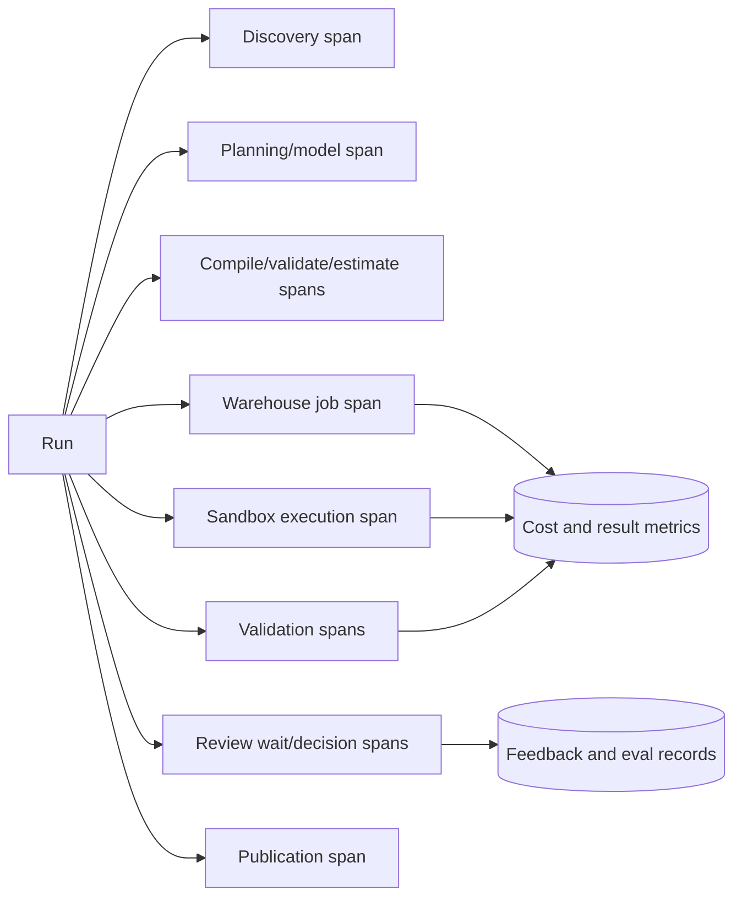

# Observability, Evaluation, and Testing

**Research date:** 2026-08-31  
**Status:** Production quality design  
**Core rule:** Evaluate the complete decision-and-evidence workflow on local policies and metrics, not merely SQL text or model eloquence

## What to observe

One trace should connect the run’s stages without putting sensitive content into ordinary telemetry.

Trace attributes should be bounded identifiers and classifications:

- run/stage/attempt, tenant-safe correlation ID, environment and release;
- model provider/model snapshot, prompt/tool-schema version, token and latency counts;
- semantic/catalog/policy/compiler/parser/runtime versions;
- query digest, engine/job/workload-pool ID, estimated/actual bytes or credits, rows, cache status;
- sandbox image digest, CPU/memory/wall time, exit and violation codes;
- artifact digests, validator results, review state and duration;
- error class, retry reason, cancellation and recovery outcome.

Do not use raw user text, SQL, parameters, table names, result samples, user email, or full run ID as metric labels. Store sensitive payloads in a restricted evidence system and link by opaque ID.

OpenTelemetry provides stable SQL database semantic conventions, while GenAI conventions and registries have continued to evolve. Pin the emitted convention/schema version and isolate it behind instrumentation adapters.

### Keep telemetry, evidence, audit, and objectives separate

| Record | Purpose | Typical contents | Must not become |
|---|---|---|---|
| Metric | Bounded aggregate for alerting/capacity/trend | counts, rates, histograms and gauges by low-cardinality workload/risk/release class | Per-run evidence, raw IDs/text, or an authorization record |
| Trace | Causal diagnostic path for one sampled/correlated run | stage spans, opaque refs, versions, timing, attempts, error/status and cost measurements | Complete durable state, an immutable artifact, or a legal/audit ledger |
| Log | Discrete operational/security event for debugging | structured event code, service, severity, sanitized context and restricted diagnostic reference | Raw prompt/SQL/result dump, metric-label substitute, or sole effect receipt |
| Audit record | Tamper-evident accountability and policy evidence | actor, authenticated context, purpose, policy/approval, exact action/object/digest, disposition and time | Sampled/optional telemetry or mutable debug text |
| Evidence/artifact | Reproducible analytical truth | versioned request/plan/query/result/code/test/chart/claim manifests and restricted payload refs | General telemetry or an editable conversation |
| SLI/SLO/error budget | User/risk objective and allowed failure | precise population, good/bad event, window, target, exclusions and owner | A raw dashboard metric without semantics or a claim of analytical correctness |

An audit path must remain complete when trace sampling is enabled. A trace may link to an audit/evidence ID, but exporting it to a third party does not export the underlying sensitive payload. OpenTelemetry Baggage is propagated to downstream services and has no built-in integrity guarantee; do not put principal, sensitive object names, permissions or policy decisions in baggage.

## Operational metrics and SLOs

Track distributions by risk/workload class, not only global averages.

| Area | Metrics |
|---|---|
| Availability | accepted runs, successful terminal state, dependency/circuit-breaker failures |
| Latency | time to clarification, plan, first result, draft, approval, publication; queue time per stage |
| Correctness | automated gate pass rates, regression score, reviewer correction/override, post-publication correction |
| Security/privacy | denied discovery/execution, policy failures, sandbox violations, small-cell blocks, cache revocations |
| Reliability | retry count, unknown outcomes, orphaned jobs, stale-worker writes blocked, recovery duration |
| Cost | model tokens/cost, estimated and actual scan/credits, sandbox CPU/memory, artifact storage, cost per approved run |
| Semantics/data | metric candidate ambiguity, deprecated selection attempts, freshness failures, schema/quality drift |
| Human workflow | review wait, rejection/change reasons, exception frequency, approval expiry |

Example service objectives should be derived from user need:

- 99.9% of low-risk accepted runs either produce a draft or a clear actionable failure within the workload deadline;
- 100% of publication operations have a valid approval and reconciled receipt;
- 100% of production queries carry run correlation tags and enforced timeout/budget;
- no released artifact lacks metric/source/query/code/runtime provenance;
- zero unauthorized assets in denied-principal discovery tests.

A target of “95% answers returned” can reward unsafe guessing. Measure safe abstention and clarification separately.

## Evaluation layers

| Layer | Unit | Examples |
|---|---|---|
| Contract | Tool/state/artifact schema | invalid enum, missing snapshot, digest mismatch, stale approval |
| Component | Resolver, compiler, validator, sandbox, chart checker | authorized recall, AST rule, resource violation, spec validation |
| Analytical | Query result and statistical output | result equivalence, tolerance, null/time behavior, method validity |
| Workflow | End-to-end scenario | ambiguity → plan → query → artifact → review, including failures |
| Security | Adversarial scenario | injection, policy bypass, exfiltration, inference, cache confusion |
| Human | Stakeholder/analyst judgment | usefulness, correction, trust calibration, decision suitability |
| Online | Shadow/canary production | drift, cost, latency, escalation, incident indicators |

## Canonical local evaluation suite

Build a versioned suite from real organization patterns, with synthetic/de-identified data where possible. Each case includes:

- user request and authenticated/purpose context;
- authorized and prohibited discovery universe;
- semantic/catalog/policy/source snapshots;
- expected ambiguity/clarification and accepted plan elements;
- permitted query shape and result fixture or invariant;
- expected numerical/statistical outputs with tolerance;
- allowed and prohibited claims;
- chart/artifact requirements;
- expected approvals/effects/cost ceiling;
- injected failure or adversarial payload where applicable.

Keep held-out evaluation cases separate from runtime trusted examples and training/fine-tuning data. Snowflake’s Cortex Analyst evaluation guidance explicitly removes selected verified queries from runtime context during evaluation to avoid leakage; apply the same principle across platforms.

### Deterministic baselines and incremental model value

Every model-enabled case runs against a permanent non-agent reference.

| Scenario | Deterministic/manual baseline | Model may add | Hard comparison |
|---|---|---|---|
| Metric discrepancy | Catalog diff, compiled fixed queries and analyst reconciliation template | Interpret stakeholder wording, compare material semantic differences, draft clarification | Same root metric/version cause, zero unauthorized discovery, less reviewer time without extra incorrect scans |
| Cohort analysis | Parameter form plus reviewed cohort SQL and fixed descriptive tables | Translate varied inclusion/anchor/maturity language into a typed cohort proposal | Exact membership/result invariants, bias/maturity caveats, cost and correction rate by cohort complexity |
| Experiment readout | Frozen plan plus versioned deterministic statistics/report template | Explain diagnostics/uncertainty and assemble evidence-linked narrative | Identical inputs/effects/intervals/correction, no causal/multiplicity upgrade, reviewer usefulness and time |
| Source correction | Lineage impact query, invalidation rules and correction runbook | Summarize affected claims and draft transparent amendment | Complete blast radius, no stale approval/publication, same next safe action and no historical overwrite |

If the model does not improve a predeclared outcome on a slice, route that slice to the baseline. Never average a policy, privacy, causal, result-integrity or duplicate-effect failure into an overall benefit score.

### Required evaluation slices

Report at least by:

- platform/adapter, dialect and semantic surface;
- certified semantic query versus direct-SQL gap path;
- question ambiguity, metric near-neighbor count and cohort complexity;
- descriptive, inferential, predictive and causal class;
- dataset size/skew/freshness/snapshot mechanism and source correction state;
- result cardinality, privacy/sensitivity class and purpose;
- language/locale/time zone, accessibility need and user expertise;
- model/prompt/tool bundle, library/runtime and cold/warm cache;
- reviewer role, disagreement/override, abstention and publication class;
- normal, dependency-degraded, retry, cancellation, recovery and DR/catch-up modes.

Predeclare slice denominators and minimum support. A global score can hide a critical failure in protected/small cohorts, one dialect, one model update or recovered traffic.

## Scorecard

Use a safety-gated scorecard instead of one blended number.

| Dimension | Measurement | Release rule example |
|---|---|---|
| Intent/ambiguity | Required clarification and plan-field accuracy | No unsafe execution on materially ambiguous cases |
| Governed discovery | Authorized recall/precision; forbidden leakage | Zero forbidden disclosure; thresholded recall |
| Semantic resolution | Metric/entity/grain/version correctness | 100% on critical certified metrics |
| Query | Parse/schema/policy validity; result equivalence | Zero prohibited effects; high result accuracy |
| Numerical | Values, order, nulls, units, timezone, tolerance | 100% critical invariants |
| Statistical | Class/estimand/method/assumption/claim rubric | No causal upgrade or invalid threshold claim |
| Privacy/security | Policy, prompt injection, sandbox, disclosure, cache | Zero critical violations |
| Lineage/replay | Required entities/digests; replay outcome | 100% released artifacts complete |
| Chart/report | Data binding, truth, accessibility, claim citations | No severe misleading chart; accessibility threshold |
| Reliability | Duplicate/unknown/crash recovery tests | No duplicate publication; fenced stale workers |
| Cost/performance | Budgets, latency and regression | Within class-specific SLO/budget |
| Human value | Blind reviewer correctness/usefulness/calibration | Agreed acceptance and no trust inflation |

Critical security, privacy, effect, and claim-validity failures are hard gates. A high average cannot compensate for one unauthorized disclosure.

## Query evaluation

Exact SQL string match is too brittle: multiple queries can be equivalent. Simple execution-result match can also reward accidental equivalence on one database instance. Use multiple signals:

- semantic metric/query match when a governed layer is available;
- AST/normalized structure for expected objects, filters, grouping, joins, and limits;
- execution on representative fixtures;
- result comparison with declared ordering, null, numeric, decimal, time zone, and duplicate semantics;
- mutation/distilled test databases to distinguish subtly wrong queries;
- property/invariant checks for broader input ranges;
- engine plan and cost-policy checks.

For destructive/prohibited constructs, test rejection rather than execution. For policies, run under real low-privilege test identities.

## Analytical and narrative evaluation

Deterministically compute expected values and claim features where possible. Human or model grading is appropriate for bounded qualities such as clarity and limitation coverage, but calibrate graders against expert labels and monitor drift.

Do not use an uncalibrated LLM judge as the sole evaluator for:

- numerical correctness;
- authorization or privacy;
- SQL safety;
- causal validity;
- approval compliance;
- duplicate effects.

For narrative claims, parse the produced claim contract and verify value, direction, units, population, period, uncertainty, qualifiers, and evidence reference. Then use expert review for whether the caveats and decision framing are adequate.

## Public benchmarks: use and limits

| Benchmark | Useful signal | Why it is insufficient |
|---|---|---|
| Spider 2.0 variants | Enterprise-style text-to-SQL/workflow difficulty | Dataset/tasks have evolved; not local semantics or policy |
| BIRD | Large databases, values/knowledge, execution-oriented SQL | Does not reproduce organization-specific governance and workflows |
| DS-1000 | Data-science code generation across libraries | Code correctness is only one sandboxed stage |
| InfiAgent-DABench | Multi-step data-analysis tasks and tool interaction | Limited representation of local privacy, review, and metric contracts |
| UniDataBench / DataAgentBench / DAComp | Emerging end-to-end data-agent capabilities | New/evolving; results and task coverage require scrutiny |

Record exact dataset/task/commit and evaluation harness version. Spider 2.0’s site documents material changes, including removal/reorganization of original tasks; leaderboard names alone are not a stable regression baseline.

## Failure-injection catalog

### Semantics and data

- renamed/deprecated metric, changed fiscal calendar, stale certification;
- unknown or incorrect join cardinality, late data, schema/type drift;
- semantic compiler upgrade changes SQL or aggregation;
- null spike, duplicates, timezone transition, empty/one-row/small-cell result.

### Models and tools

- malformed structured output, extra tool arguments, invented IDs;
- prompt injection in metadata/data/error/reviewer text;
- provider timeout, rate limit, response loss, model snapshot drift;
- model requests budget, permission, or destination escalation.

### Execution and effects

- estimate passes but runtime exceeds budget;
- query completes after client timeout;
- sandbox CPU/memory/disk/process/network violations;
- artifact write succeeds but acknowledgment is lost;
- approval races artifact refresh;
- destination accepts publish but response is lost.

### Privacy/security

- discovery existence leak, unauthorized lineage edge, broad cache hit;
- repeated complementary queries reconstruct suppressed cells;
- row/column policy timing/error/billing side channel;
- sensitive SQL/row in trace, exception, notebook output, or chart tooltip.

Run these tests continuously in lower environments and selected non-destructive tests as production probes.

## Release and regression process

A change to any of these is a candidate release:

- model/provider/snapshot or generation settings;
- system prompt, tool description, schema, retrieval/ranking;
- semantic model, trusted examples, compiler, SQL parser/policy;
- warehouse engine/adapter or access policy;
- analysis libraries, sandbox image/runtime;
- statistical/checking logic, chart/report template;
- workflow framework, retry/idempotency behavior;
- observability redaction or evaluation harness.

Process:

1. run contract and component tests;
2. run the complete held-out suite and compare slices, not only aggregate;
3. replay prior production incidents and difficult approved runs;
4. security/privacy review for boundary changes;
5. shadow on current traffic without effects;
6. canary low-risk cohorts with hard rollback thresholds;
7. promote, monitor, and retain release/eval evidence.

## Debugging workflow

When a result is wrong, localize the earliest divergence:

1. Was identity/purpose/risk correct?
2. Did authorized discovery return the right candidates?
3. Did the plan encode the stakeholder’s population, metric, grain, and analysis class?
4. Did semantic compilation/query generation preserve the plan?
5. Did the engine read expected versions and return the validated result?
6. Did analysis code use correct columns/methods/units?
7. Did validators catch or miss the defect?
8. Did chart/narrative alter meaning?
9. Did review receive complete evidence?
10. Which release/version introduced the change, and which artifacts are affected?

This stage-based comparison is more actionable than inspecting the final prompt transcript.

## Acceptance checklist

- [ ] Sensitive payloads live outside ordinary traces and metric labels.
- [ ] SLOs cover correctness, security, effects, cost, and review—not only latency.
- [ ] A held-out local suite represents critical metrics, identities, policies, and failure cases.
- [ ] Exact SQL match is not the sole correctness measure.
- [ ] Critical violations are hard gates rather than averaged scores.
- [ ] Model judges are calibrated and never own deterministic/security decisions.
- [ ] Public benchmarks are supplemental and version-pinned.
- [ ] Every material component/version change runs regression, shadow, and canary gates.
- [ ] Incidents become permanent replay/evaluation cases.

## Sources

- [OpenTelemetry SQL semantic conventions](https://opentelemetry.io/docs/specs/semconv/db/sql/)
- [OpenTelemetry GenAI attribute registry](https://opentelemetry.io/docs/specs/semconv/registry/attributes/gen-ai/)
- [Snowflake Cortex Analyst evaluations](https://docs.snowflake.com/en/user-guide/snowflake-cortex/cortex-analyst-evaluations)
- [Databricks Genie monitoring and benchmarks](https://docs.databricks.com/aws/en/genie-agents/monitor)
- [Spider 2.0](https://spider2-sql.github.io/)
- [BIRD benchmark](https://bird-bench.github.io/)
- [DS-1000](https://ds1000-code-gen.github.io/)
- [InfiAgent-DABench paper](https://proceedings.mlr.press/v235/hu24s.html)
- [UniDataBench paper](https://aclanthology.org/2026.acl-long.1556/)
- [DataAgentBench repository](https://github.com/ucbepic/DataAgentBench)
- [DAComp](https://da-comp.github.io/)
- [OpenTelemetry signals](https://opentelemetry.io/docs/concepts/signals/)
- [OpenTelemetry Baggage security considerations](https://opentelemetry.io/docs/concepts/signals/baggage/)
- [OpenTelemetry database semantic conventions](https://opentelemetry.io/docs/specs/semconv/db/)
