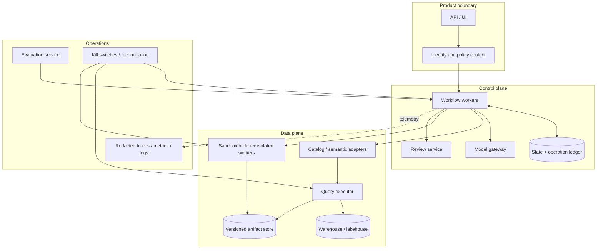

# Cost, Performance, Deployment, and Roadmap

**Research date:** 2026-08-31  
**Status:** Production operations guide  
**Core rule:** Scale deterministic work and cached governed results first; spend model and warehouse capacity only where it improves a measured decision

## Cost model

Track total cost per accepted, reviewed, and published run—not only token cost.

```text
run_cost = model_inference
         + catalog/semantic services
         + warehouse scan/compute
         + sandbox compute
         + artifact/storage/egress
         + evaluation/observability
         + human review and remediation
```

An inexpensive model that creates expensive warehouse retries or reviewer rework is not cheaper. Attribute estimated and actual cost to run, tenant, workload class, stage, and release without exposing sensitive object names in broad metrics.

## Budget hierarchy

Define nested budgets:

- organization and environment per period;
- tenant/team/principal and purpose;
- workload class and queue;
- run total and deadline;
- stage and attempt;
- model tokens/calls;
- warehouse bytes/credits/slots/time;
- sandbox CPU/memory/time/output;
- artifact size/retention/egress;
- human review class.

Reservations prevent concurrency from admitting more work than the budget can support. Reconcile estimates to actuals and release unused reservations. The model cannot raise a limit; an authenticated policy or reviewer can authorize a bounded exception.

## Cost and latency levers

Apply in this order:

1. **Clarify early.** One question is cheaper than multiple wrong scans.
2. **Use governed semantics.** Reduce join/search iterations and reuse compiled templates.
3. **Push down.** Filter and aggregate in the warehouse; move only the analysis grain.
4. **Estimate.** Use dry runs/plans and require partition predicates or approved rollups.
5. **Reuse safely.** Semantic compiler, metadata, plan, result, extract, and artifact caches have different keys and risks.
6. **Route models by measured difficulty.** Deterministic routing/simple generation can use a smaller model only after local evaluation.
7. **Parallelize independent reads carefully.** Discovery candidates or validations may run concurrently, but cap fanout and preserve deterministic result ordering.
8. **Separate interactive and batch resources.** Protect user-facing SLOs from scheduled refreshes/evals.
9. **Stop early.** Cancel downstream stages on policy, quality, budget, or evidence failure.
10. **Measure reviewer rework.** Improve semantics/contracts before adding more reasoning loops.

## Cache layers

| Cache | Key ingredients | Invalidation | Main risk |
|---|---|---|---|
| Metadata/search | tenant/principal-policy cohort, catalog/version, query | catalog/policy/embedding/ranking release | unauthorized existence or stale definitions |
| Metric resolution | request features, purpose, semantic snapshot, auth context | semantic/policy change | silently selecting obsolete metric |
| Compilation/AST | semantic query/SQL, dialect/compiler/parser/policy versions | component/policy change | reuse under different dialect/rules |
| Engine result | identity/policy, normalized query, params, source snapshot/freshness | data/policy/role change, TTL | cross-principal disclosure or stale result |
| Extract | result digest, schema, classification | retention/revocation | durable sensitive copy |
| Analysis | extract/code/runtime/seed/config digests | any input/version change | plausible but irreproducible reuse |
| Artifact | all upstream digests and template/chart versions | any upstream change | approval attached to different evidence |

Never use raw natural-language question alone as a result-cache key. On a cache hit, re-authorize access to the cached artifact and its source lineage. For sensitive or fast-revocation workloads, disable shared result caching or use short, revocation-aware TTLs.

## Capacity and scaling

### Workload queues

Separate at least:

- interactive low-risk governed queries;
- approved heavy/batch analyses;
- sandbox execution;
- evaluation/shadow traffic;
- report rendering/publication;
- recovery/reconciliation.

Use per-tenant/principal fairness and global dependency limits. A single user’s model-generated fanout must not consume every warehouse slot or sandbox worker.

### Backpressure

Admission checks current queue delay, deadline, concurrency, and reserved budget. Reject or defer before calling the model if no downstream capacity can satisfy the request. Propagate retry-after/queue status rather than letting clients create duplicates.

### Autoscaling

Scale stateless control workers and sandbox pools on ready queue plus service time, with hard maximums. Warm a small pool of signed sandbox images if startup dominates interactive latency, but never reuse a dirty execution environment. Warehouse autoscaling and serverless capacity still require spend ceilings.

### Data locality

Keep query execution, extracts, sandboxes, artifact storage, and telemetry in approved regions. Avoid copying raw data to a central “agent service.” Move the reasoning/control plane to metadata and privacy-safe summaries where possible.

### Capacity envelope and recovery load

Size each pool from measured arrival rate and service time, then validate with load—not a token-based concurrency guess.

```text
steady_concurrency(stage) ~= admitted_arrival_rate * p95_service_time
required_capacity = steady_work + retry_amplification + recovery_catch_up
usable_capacity = provisioned_capacity - reserved_cancel_reconcile_incident_capacity
```

Record separate limits for model calls, semantic/catalog requests, warehouse queued/running jobs, bytes/credits/slots, sandbox CPU/memory/start rate, artifact bandwidth, renderers and reviewer queue. Enforce both per-tenant fairness and global dependency ceilings.

Recovery traffic is not free spare capacity. Preserve a tested reserve for cancellation, reconciliation, artifact quarantine/correction, backlog drain and DR replay. A restore that recovers state but floods the warehouse with replayed queries or starves unknown-effect reconciliation has failed operationally.

Load exercises should cover:

- interactive plus scheduled peak, evaluation shadow traffic and one noisy tenant;
- provider throttling that increases retries and queue residence;
- warehouse slowdown with estimates still passing;
- sandbox cold start, image pull and large-result promotion;
- outage backlog release with duplicate/out-of-order events;
- region failover while queries/publications remain `UNKNOWN`;
- mass semantic/source correction invalidating caches, artifacts and reviews.

Pass only when admission/backpressure protects deadlines and budgets, cancellation/reconciliation retain capacity, recovery catch-up stays within dependency quotas, and no tenant/purpose/region boundary is crossed.

## Deployment topology



At small scale, the API, workflow worker, adapters, and review API can be one deployable backed by a transactional database and object store. Keep query execution and untrusted code behind separate identities/isolation boundaries. Split services only when security boundary, scaling, failure isolation, or team ownership justifies it.

## Environment and release strategy

Use separate development, evaluation, staging, and production environments with separate credentials and data. Production-like policy tests need purpose-built fixtures or controlled low-privilege test identities; do not copy unrestricted production data casually.

Promote together as a release manifest:

- application/workflow version;
- model provider/snapshot/settings;
- prompts, tool schemas, and retrieval index version;
- semantic/catalog/verified-example versions;
- SQL compiler/parser/policy adapters;
- sandbox image and analysis lock;
- chart/report schemas/templates;
- evaluation suite/harness and acceptance results;
- infrastructure/policy configuration.

Use shadow evaluation before canary. Canary only low-risk workloads first and define automatic rollback thresholds for security gates, result correctness, failure rate, latency, warehouse cost, and reviewer correction.

## Operational SLOs and alerts

Alert on user-impact or risk, not raw infrastructure noise:

- accepted run deadline burn and queue saturation;
- query estimates/actuals exceeding budget or large estimate-to-actual drift;
- cancellation not terminating warehouse/sandbox jobs;
- authorization/policy service failure or abnormal denied/allowed changes;
- sandbox violations, unexpected egress, orphaned runtimes;
- artifact/lineage commit failures and publication without reconciled receipt;
- result-cache hit after policy/role change;
- semantic freshness/quality failure and version mismatch;
- evaluation/security regression or reviewer correction spike;
- cost per approved run and retry amplification.

Dashboard distributions by workload/risk/release and keep high-cardinality drill-down in traces/evidence storage.

## Runbooks

Maintain executable runbooks for:

### Wrong or misleading analysis

1. quarantine the artifact/publication;
2. identify evidence and all descendants via lineage;
3. stop affected release/metric/runtime;
4. reproduce from pinned inputs;
5. localize earliest divergent stage;
6. correct/review/republish with visible amendment;
7. add a permanent regression case.

### Metric discrepancy or corrected source

1. freeze publication/refresh for affected metric, cohort or dataset versions;
2. preserve both old and corrected source snapshots and the correction event;
3. use lineage to enumerate dependent queries, tests, findings, decisions, caches and publications;
4. invalidate readiness/approvals without deleting historical artifacts;
5. rerun deterministic baselines first, then the qualified model workflow on the new versions;
6. require owners to decide whether to correct, retract, supersede or leave an explicit historical note;
7. publish a correction linked in both directions and verify destinations/caches are reconciled;
8. add the discrepancy and correction path to held-out and DR/recovery-load suites.

### Unauthorized disclosure

1. revoke capability, cache, artifact, and destination access;
2. terminate active jobs and disable implicated connector/path;
3. preserve restricted forensic records;
4. determine affected principals/data/artifacts through lineage;
5. follow security/privacy/legal notification procedure;
6. remediate boundary and add adversarial tests before re-enable.

### Cost runaway

1. trip query/model/sandbox circuit breaker;
2. cancel underlying jobs;
3. preserve query template/release evidence;
4. identify missing estimate/partition/concurrency controls;
5. reduce admission limits and validate repair with replay.

### Dependency outage

Use the graceful-degradation policy in [workflow reliability](07-state-workflows-reliability-and-recovery.md#graceful-degradation); do not silently switch to a less governed path.

## Roadmap

Stages are evidence gates, not calendar milestones. A team can stop at any stage, and each new metric/cohort/platform/effect enters at the lowest stage whose evidence it has earned. Keep the deterministic baseline, manual review path and rollback mode throughout.

### Stage 0 — foundations and deterministic baseline

Deliver:

- decision/risk taxonomy and ownership;
- canonical metric/catalog and identity/policy integration;
- typed plan, tool, state, artifact, and lineage contracts;
- representative held-out suite including denied identities and statistical traps;
- cost baseline and sandbox threat model.

Exit gate: critical cases have expected semantics, results, policies, claims, and effects before an agent touches production.

### Stage 1 — read-only governed answers

Deliver:

- one orchestrator, one platform/warehouse, certified metrics only;
- authorized discovery and semantic compilation;
- estimates, read-only execution, result contracts, immutable extracts;
- table and evidence-linked narrative; no generated code or external publication;
- trace/evaluation/replay and explicit analyst review.

Exit gate: held-out correctness and zero-critical-violation gates pass; cost and latency are understood.

### Stage 2 — isolated analysis and charts

Deliver:

- disposable pinned sandbox with no network/credentials;
- statistical plan/checks and machine-readable result contract;
- declarative chart specs, accessibility and claim validators;
- immutable artifact bundles and risk-based review.

Exit gate: sandbox adversarial suite, statistical traps, clean replay, and chart/report gates pass.

### Stage 3 — controlled self-service and refresh

Deliver:

- low-risk auto-drafting; deterministic approved-plan refresh;
- cache/materialization strategy with revocation tests;
- review workflow, internal idempotent publication, correction/takedown;
- SLOs, budgets, kill switches, recovery and disaster tests.

Exit gate: crash/retry/revocation/publication tests pass and on-call owns runbooks.

### Stage 4 — broader platforms and advanced methods

Only after evidence supports the need:

- additional warehouse/semantic adapters;
- controlled direct-SQL gap path;
- predictive/causal workflows with specialized reviewers;
- privacy accounting or de-identification release process;
- model routing and limited specialist workers;
- approved external destinations.

Each addition must provide local evaluation improvement that outweighs increased policy, cost, and operational surface.

### Stage 5 — resilient multi-tenant scale

- split admission, query execution, sandbox analysis, artifact building, review, and publication into independently bounded pools only when measurements require it;
- enforce tenant/purpose isolation in semantic caches, extracts, artifact stores, traces, queues, credentials, and regional cells;
- reserve capacity for cancellation, reconciliation, corrections/takedowns, manual review, and high-value deadlines;
- qualify warehouse/provider outages, restore, regional failover, semantic-service degradation, and model unavailability without falling back to ungoverned SQL or publication.

**Exit:** load, noisy-neighbor, revocation, restore, dependency-outage, and regional-failover tests preserve data/metric/privacy/effect invariants, manual takeover, and declared SLOs.

### Stage 6 — continuous evolution with reproducible analytics

- turn reviewed wrong answers, semantic misunderstandings, invalid methods, misleading charts, corrections, incidents, and cost outliers into candidate held-out cases;
- replay current and proposed model, prompt, context/compaction, semantic layer, query adapter, sandbox image, validator, policy, and renderer bundles;
- shadow and canary by tenant, analysis class, platform, sensitivity, and publication authority, with explicit active-run migration and full-bundle rollback;
- require owner review before production traces become certified examples, metrics, methods, policies, or long-term memory.

**Exit:** every behavioral release and published artifact is reproducible from pinned inputs and versions, improves held-out quality/safety evidence without widening access or authority, preserves correction/deletion and lineage, and can roll back while reconciliation and governed analysis continue.

### Stage evidence ledger

| Stage | Live authority | Required exit evidence | Rollback/fallback |
|---|---|---|---|
| 0 | No model authority; deterministic/manual only | Baseline quality/time/cost, canonical identities, denied-user tests, source/version inventory, four worked fixtures and owners | Remain deterministic/manual |
| 1 | Model proposes read-only plan/explanation for certified metrics | Beats baseline on approved slices; exact result invariants; no forbidden discovery; bounded cost/latency; analyst review | Disable model; execute saved deterministic path |
| 2 | Generated code only inside isolated sandbox; no publication | Sandbox adversarial suite, exact replay, statistical/leakage/multiplicity gates, truthful accessible artifacts | Return Stage 1 table/result only |
| 3 | Low-risk internal refresh/draft and approval-gated publication | Retry/cancel/reconcile/crash tests, correction/takedown, SLO/error-budget ownership and runbook drills | Disable publisher/auto-draft; keep manual review |
| 4 | Qualified extra adapters or advanced method per use case | Deployment-specific adapter matrix, reviewer ownership, local method/snapshot/identity regression and contract tests | Disable one adapter/method without changing canonical state |
| 5 | Multi-tenant/region production scope | Peak/noisy-neighbor, reserved recovery capacity, backup/restore, RPO/RTO, failover/return and unknown-effect reconciliation | Fence failed cell, shrink scope and drain manually |
| 6 | Governed behavior-bundle evolution, never self-approval | Signed release/eval evidence, held-out protection, shadow/canary, active-run migration, rollback and deletion/correction propagation | Pin prior bundle and withdraw poisoned sources/examples |

Each exit record includes scope, versions, evaluation slices, failure injections, observed SLO/cost window, open limitations, accountable owner, approval and expiry. “Implemented” without retained evidence does not pass.

## Framework, platform, or custom implementation

| Choice | Use it for | Do not delegate |
|---|---|---|
| Agent framework | Structured model calls, tool adapters, optional tracing/checkpoint conveniences | Authorization, budgets, semantics, safety validation, idempotency, approval |
| Durable workflow framework | Timers, queues, retries, state persistence | Meaning of states, error taxonomy, effect keys, reconciliation, policy |
| Warehouse-native AI/BI | Semantic querying, native governance, verified examples, platform monitoring | Cross-platform artifacts, statistical validity, organization-specific review guarantees |
| Notebook platform | Expert inspection and managed kernels | Treating arbitrary agent code as trusted or reproducible by default |
| Fully custom | Unique regulated/multi-engine lifecycle | Rebuilding mature identity, query engine, storage, or isolation primitives |
| Hybrid | Glue existing authoritative systems with explicit contracts | Blurring ownership at seams |

Choose components by a contract test. If a platform cannot expose stable source/version IDs, scoped identity, cancellation, cost receipts, or artifact lineage, document the gap and add the smallest adapter/control that closes it.

## Final production acceptance

### Semantics and correctness

- [ ] Critical metrics, dimensions, joins, time rules, and versions are governed.
- [ ] Ambiguous requests stop for clarification.
- [ ] Query/result/statistical/claim/chart contracts pass local held-out tests.

### Security and privacy

- [ ] Denied-principal discovery/execution and prompt-injection tests pass.
- [ ] Warehouse policy and sandbox isolation survive application/model failure.
- [ ] Result/cache/artifact/telemetry disclosure and retention are enforced.

### Reliability and evidence

- [ ] Durable state, operation ledger, checkpoints, fencing, reconciliation, and cancellation are tested.
- [ ] Every released artifact has complete provenance and a supported replay story.
- [ ] No approval or publication can float across an artifact/version change.

### Operations

- [ ] Cost, latency, correctness, review, and security SLOs have owners.
- [ ] Capacity, admission, budgets, circuit breakers, and runbooks are exercised.
- [ ] Release manifests, regression, shadow, canary, rollback, and incident replay are routine.

## Sources

- [BigQuery pricing](https://cloud.google.com/bigquery/pricing)
- [BigQuery cached results](https://docs.cloud.google.com/bigquery/docs/cached-results)
- [Snowflake persisted query results](https://docs.snowflake.com/en/user-guide/querying-persisted-results)
- [Cube pre-aggregations](https://docs.cube.dev/docs/pre-aggregations/using-pre-aggregations)
- [Databricks metric-view materialization](https://docs.databricks.com/aws/en/uc-semantics/metric-views/materialization)
- [Databricks materialization selection](https://docs.databricks.com/gcp/en/uc-semantics/metric-views/choose-materialization-type)
- [Kubernetes security](https://kubernetes.io/docs/concepts/security/)
- [gVisor production guidance](https://gvisor.dev/docs/user_guide/production/)
- [Firecracker production host setup](https://github.com/firecracker-microvm/firecracker/blob/main/docs/prod-host-setup.md)
- [BigQuery time travel and retention](https://docs.cloud.google.com/bigquery/docs/time-travel)
- [Snowflake Time Travel](https://docs.snowflake.com/en/user-guide/data-time-travel)
- [Databricks table history and time travel](https://docs.databricks.com/aws/en/delta/history)
- [OpenTelemetry metrics cardinality](https://opentelemetry.io/docs/concepts/signals/metrics/)
