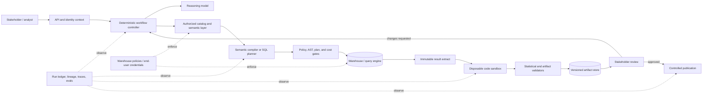
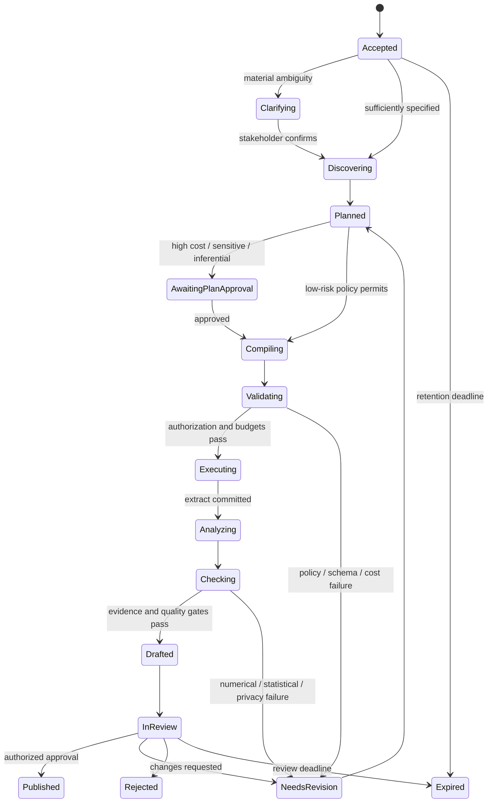

# Production Analytics Agent Blueprint

**Research date:** 2026-08-31  
**Status:** Production architecture blueprint; vendor-neutral reference design  
**Scope:** Governed metric discovery, analytical planning, query execution, code-assisted analysis, statistical review, reproducible artifacts, and stakeholder-controlled publication

An analytics agent should not be a chatbot with unrestricted SQL and a Python tool. The production system is a **governed analytical workflow**: a model may interpret the request and propose decisions, but identity, authorization, metric semantics, query budgets, execution, artifact lineage, and publication remain enforceable application or data-platform responsibilities.

This blueprint recommends a **hybrid architecture** for most organizations. Reuse a semantic layer or warehouse-native governance where it is authoritative; add a small deterministic control plane for the cross-system lifecycle; run generated code only in an isolated, disposable sandbox; and require evidence-backed validation before an artifact can be reviewed or published.

## What this system is for

The agent turns a stakeholder question into a reviewable analysis package while preserving the decisions and evidence needed to reproduce it.

Typical requests include:

- “Why did weekly activation fall in Europe?”
- “Compare retained revenue by plan, controlling for account age.”
- “Build the board chart from the certified ARR definition.”
- “Test whether the experiment changed conversion and quantify uncertainty.”
- “Refresh last month’s analysis against the new data snapshot.”

A successful run produces more than prose. It produces an immutable bundle containing the interpreted question, metric and population definitions, data and semantic versions, executed query, parameters, result digest, analysis code, statistical decisions, chart specification, narrative, policy context, and reviewer disposition.

## Non-goals

This design does not make the model:

- an authorization system or a substitute for warehouse row/column policies;
- the canonical owner of metric definitions;
- a trusted SQL validator, statistical oracle, or causal-inference engine;
- a general-purpose production notebook service;
- an autonomous publisher of externally consequential claims;
- a replacement for analysts when the business question is ambiguous or the evidence is weak;
- a reason to introduce multiple collaborating agents before a single controlled workflow is measured.

## When not to use an agent

Use the least adaptive system that meets the decision need. Stop at a deterministic query, dashboard, scheduled report, statistical script, or analyst workflow when:

- the question, metric, cohort, dimensions, and output are already fixed;
- a certified BI surface or parameterized query answers the request within its SLO;
- the required judgment is primarily legal, causal, policy, or domain review rather than information synthesis;
- no stable source snapshot, metric owner, reviewer, or correction path exists;
- privacy-safe output removes the detail needed to answer the question;
- the workload is too rare to justify an operated evaluation, sandbox, and recovery surface;
- model ambiguity, added latency, cost, or review time does not beat the deterministic/manual baseline on a predeclared slice.

Stage 0 is a legitimate final architecture. A model should be admitted only for measured semantic work such as interpreting materially varied questions, comparing governed candidates, proposing bounded plans, or explaining evidence. It should not replace a parameter form merely to make the interface conversational.

## Recommended boundary

The crucial boundary is between **proposal** and **enforcement**.

| The model may propose | Deterministic systems must enforce |
|---|---|
| Intent, assumptions, clarifying questions | Authenticated principal, tenant, role, purpose, and policy scope |
| Metric/entity candidates | Authorized catalog visibility and certified semantic definitions |
| An analysis plan | State transitions, approval gates, budgets, and effect policy |
| Semantic query or SQL | Dialect parsing, allow-lists, read-only session, dry run/plan, timeout, byte/credit cap |
| Python/R/notebook code | Disposable sandbox, filesystem/network/resource limits, dependency allow-list |
| Statistical method | Preconditions, multiplicity policy, minimum sample and sensitivity checks |
| Chart and narrative | Evidence binding, privacy checks, accessibility validation, review and publication |

Frameworks can make tool calling, message routing, tracing, or checkpointing convenient. They do **not** by themselves guarantee authorization, exactly-once effects, correct metrics, SQL safety, statistical validity, reproducibility, or privacy. Those guarantees belong to the application and its data platforms.

## Reference architecture



The workflow should start as one orchestrator with typed tools and deterministic stages. Add specialist model workers only when a measured failure class justifies them—for example, an independently prompted statistical reviewer for high-risk inference. More agents add latency, cost, correlated failure modes, and a larger permission surface.

## Architecture choices

| Variant | Best fit | Principal strength | Principal weakness | Production position |
|---|---|---|---|---|
| Semantic-layer-first | Stable, shared business metrics across tools | Consistent definitions, join paths, time grains, and access rules | Semantic model quality becomes a critical dependency | Preferred when a mature semantic layer exists |
| Warehouse-native | One primary platform with strong catalog, policies, lineage, and AI/BI features | Least integration; enforcement stays close to data | Lock-in and weaker cross-engine portability | Strong default for a single-platform estate |
| Notebook-first | Expert-led, exploratory, bespoke analysis | Flexible code and rich diagnostics | Arbitrary code, mutable state, weak multi-user lifecycle | Use as a sandboxed stage, not the control plane |
| Custom deterministic workflow | Regulated, mixed-engine, or unusual approval requirements | Precise control and portable contracts | Highest engineering and maintenance burden | Build only the missing control plane |
| Hybrid | Most production teams | Reuses governance while preserving cross-system guarantees | Requires clear ownership at integration seams | Recommended default |

See [requirements and architecture selection](01-requirements-and-architecture-selection.md) for the decision process.

## End-to-end lifecycle



Every transition is persisted with a run version and actor. A model response is an input to a transition, never the source of truth for the current state.

## The minimum analysis contract

Before a data effect is allowed, the run should have an explicit plan:

```yaml
analysis_plan:
  question: "Did the checkout experiment improve paid conversion?"
  decision_owner: "growth-analytics"
  purpose: "experiment-readout"
  population: "eligible US web sessions assigned from 2026-08-01 through 2026-08-14"
  unit_of_analysis: "assigned_session"
  exposure: "experiment_assignment"
  outcome_metric: "paid_conversion_24h@v3"
  comparison: ["control", "treatment"]
  estimand: "intention-to-treat absolute risk difference"
  time_zone: "UTC"
  exclusions: ["internal_users", "fraudulent_sessions"]
  methods: ["difference_in_proportions", "confidence_interval"]
  multiplicity_family: "experiment_primary_outcomes"
  missing_data_policy: "report and perform documented sensitivity analysis"
  semantic_snapshot: "prod-semantic@8f42e0c"
  source_snapshot_policy: "warehouse_time_travel"
  max_bytes_billed: 50000000000
  approval_class: "inferential-sensitive"
```

Free-form chat is insufficient for population, denominator, time grain, exclusions, estimand, or metric version. If a field is unknown and can materially change the answer, the workflow must clarify or label the run exploratory.

## Canonical analytical identity and version chain

Names and timestamps are not enough to reproduce an analysis. Every logical object has a stable identity, and every material change creates a new immutable version or effective interval.

| Object | Stable identity | Version/effective identity | Material change that creates a new version |
|---|---|---|---|
| Question | `question_id` scoped to tenant and decision | canonical text digest plus request version | population, outcome, comparison, period, purpose, or intended decision changes |
| Hypothesis | `hypothesis_id` within a declared family | frozen statement, direction, estimand, alpha and family-plan digest | hypothesis, one/two-sided direction, outcome, segment, window, or multiplicity family changes |
| Metric/semantic definition | platform object ID plus governed logical ID | semantic commit/manifest/model revision and effective interval | expression, population, filters, join path, time rule, unit, additivity, owner, or certification changes |
| Dataset | catalog namespace plus immutable physical/logical object ID | engine-native snapshot/version ID; otherwise extract digest and observation time | source incarnation, schema, partition set, correction, or snapshot changes |
| Cohort | `cohort_id` bound to entry entity and purpose | membership-rule digest, anchor window, maturity cutoff, exclusions, source snapshots and materialized membership digest | eligibility, index event, washout, attribution/maturity, exclusion, deduplication, or source correction changes |
| Query | `query_id` and attempt/job ID | semantic-query digest; normalized SQL, dialect, compiler/parser/adapter versions, parameter digest, auth-policy fingerprint and source snapshots | any compiled semantics, parameter, identity/purpose, policy, or input version changes |
| Notebook/code run | `analysis_execution_id` | source/executed notebook or code digest, ordered cells, input digests, image/lock/library versions, seed and locale/time zone | code, cell order, input, runtime, dependency, seed, or configuration changes |
| Analysis | `analysis_id` | plan version plus input/execution/method digest | analysis class, population, method, assumption, transformation, or included evidence changes |
| Statistical test | `test_id` within hypothesis family | method/library version, exact inputs, missingness/cluster/weight handling, resampling seed and correction-plan digest | test family, assumptions, sample, preprocessing, correction, or alternative changes |
| Chart | `chart_id` | chart-spec digest, bound data digest, renderer/font/theme versions and accessibility representation | data, encoding, scale, aggregation, annotation, renderer, or material label changes |
| Finding/claim | `finding_id` | typed claim digest bound to exact evidence and qualifiers | value, direction, unit, population, uncertainty, limitation, or evidence changes |
| Decision | `decision_id` owned by an authenticated human/system role | disposition version bound to findings, artifact, policy and decision time | owner, action, rationale, accepted risk, evidence, or disposition changes |
| Artifact/publication | `artifact_id`; destination object ID for a publication | immutable manifest/content digest, object generation/version and `supersedes`/`corrects` link | any evidence, claim, chart, audience, destination, classification, review, or correction changes |

An updated source row does not mutate historical truth. It produces a new source snapshot, invalidates dependent findings and approvals, and creates a correction-linked artifact. Human decisions remain separate from analytical findings so the system can show what the evidence said, what an owner decided, and what later changed.

## Tool and effect surface

Keep the tool set small, typed, and capability-scoped.

| Tool | Classification | Required control |
|---|---|---|
| `discover_assets` | Data-revealing read | Filter results before return; do not reveal unauthorized names or metadata |
| `resolve_metric` | Governed read | Pin definition/version, dimensions, entity graph, owner, freshness, certification |
| `compile_semantic_query` | Pure/derived | Preserve semantic query and compiler version |
| `validate_query` | Pure/derived | Dialect-aware AST and policy checks; never treat parsing as proof of safety |
| `estimate_query` | Cost-revealing read | Engine plan/dry run under the same identity and parameters |
| `execute_query` | Costly/data-revealing read | End-user identity, read-only boundary, timeout, quota, audit tag |
| `materialize_extract` | Durable write | Content digest, classification, retention, stable operation ID |
| `run_analysis_code` | Untrusted execution | Fresh sandbox, no ambient credentials, resource/network limits |
| `render_chart` | Derived artifact | Schema validation, evidence binding, accessibility checks |
| `assemble_report` | Derived artifact | Every claim maps to evidence and policy-approved disclosure |
| `request_review` | Workflow effect | Named reviewer role, immutable review target, deadline |
| `publish_artifact` | External effect | Approval receipt, destination allow-list, idempotency key |

The detailed contracts are in [query planning and execution](03-query-planning-validation-and-execution.md), [notebook sandboxing and reproducibility](04-notebook-sandbox-and-reproducibility.md), and [workflow reliability](07-state-workflows-reliability-and-recovery.md).

## Documentation map

1. [Requirements and architecture selection](01-requirements-and-architecture-selection.md) — success criteria, risk model, architecture comparison, build-versus-buy boundary, languages/models/runtimes.
2. [Metric semantics and governed discovery](02-metric-semantics-and-governed-discovery.md) — metric contracts, entity graphs, catalog authorization, semantic-layer and warehouse-native choices.
3. [Query planning, validation, and execution](03-query-planning-validation-and-execution.md) — plan contracts, SQL validation, warehouse controls, cache safety, tool schemas.
4. [Notebook sandbox and reproducibility](04-notebook-sandbox-and-reproducibility.md) — code isolation, notebook execution, manifests, immutable artifact bundles.
5. [Statistical validity and analytical reasoning](05-statistical-validity-and-analytical-reasoning.md) — assumptions, uncertainty, causal boundaries, missingness, multiplicity, sensitivity.
6. [Security, privacy, and lineage](06-security-privacy-and-lineage.md) — threats, authorization, prompt injection, exfiltration, de-identification, provenance.
7. [State, workflows, reliability, and recovery](07-state-workflows-reliability-and-recovery.md) — state separation, approval gates, retries, idempotency, partial failure, recovery.
8. [Artifacts, charts, and stakeholder review](08-artifacts-charts-and-stakeholder-review.md) — truthful visualizations, evidence-linked reports, accessibility, review and publication.
9. [Observability, evaluation, and testing](09-observability-evaluation-and-testing.md) — traces, safe telemetry, offline/online evaluation, failure injection, acceptance gates.
10. [Cost, performance, deployment, and roadmap](10-cost-performance-deployment-and-roadmap.md) — caching, scaling, SLOs, operations, staged adoption, acceptance checklist.
11. [Integration qualification and worked flows](11-integration-qualification-and-worked-flows.md) — real provider/tool envelopes, adapter acceptance, metric discrepancy, cohort, experiment, correction, and production exercises.

The source-by-source synthesis, contradictions, dates, and refresh criteria live in the [research packet](../../research/packets/analytics-agent-blueprint.md).

## Release gates

Do not expose the agent to production data until all of these are true:

- discovery and execution are tested with a denied principal, not only an admin account;
- warehouse enforcement remains effective when the model, parser, or controller is bypassed;
- all queries have scope, time, row/byte/credit, and concurrency limits;
- sandbox escape, credential, network-egress, and resource-exhaustion tests pass;
- a held-out local evaluation suite covers the organization’s important metrics and policy boundaries;
- statistical and chart claims remain bound to immutable results;
- the full question → metric/cohort → dataset snapshot → query → analysis/test → finding → decision → artifact identity chain is replayable;
- publication requires an authorized, recorded review for the applicable risk class;
- result caches are principal- and policy-aware, with tested revocation behavior;
- replay either reproduces the artifact or explains which unavailable snapshot prevents it;
- incident owners can terminate runs, revoke capabilities, quarantine artifacts, and trace every effect.

## Version baseline, limitations, and refresh triggers

This guide reflects sources accessed on **2026-08-31**. Notable baselines include PostgreSQL 18 documentation, Apache Arrow format 25.0.1, Vega-Lite 6, statsmodels 0.14.6 stable documentation, pandas 3.0 behavior, DuckDB 1.5 stable documentation, OpenLineage 1.52 documentation, current dbt MetricFlow semantics, Snowflake semantic views/Cortex Analyst, Databricks metric views/Genie Agents, Power BI/Fabric, Looker API 4.0, and Tableau 2026.2 REST API 3.29 documentation. Exact service editions, cloud/region, capacity, tenant settings, preview status, and deployed library versions still require qualification.

Important limitations:

- No parser or model can prove arbitrary SQL safe or semantically correct.
- Semantic definitions can be internally consistent and still encode the wrong business meaning.
- Reproducibility requires source snapshots or time travel; versioned code alone is not enough.
- Statistical checks can detect known invalid patterns but cannot manufacture identification from weak data.
- Row/column policies reduce exposure but may not eliminate inference or side-channel risk.
- Open semantic interchange is evolving; cross-vendor portability should be tested rather than assumed.
- Public text-to-SQL and data-analysis benchmarks do not represent local policy, metrics, data drift, or stakeholder expectations.

Refresh this blueprint when a selected warehouse changes semantic-query, policy, caching, lineage, or AI/BI behavior; when model or sandbox runtime changes; when privacy rules or organizational risk classifications change; when a critical source is more than 12 months old; or when incidents/evaluations expose a new failure class.

## Primary references

- [dbt MetricFlow metric semantics](https://github.com/dbt-labs/dbt-core/blob/main/crates/dbt-metricflow/docs/metric-semantics.md)
- [Snowflake semantic views](https://docs.snowflake.com/en/user-guide/views-semantic/overview)
- [Databricks metric views](https://docs.databricks.com/aws/en/business-semantics/metric-views)
- [Cube semantic layer introduction](https://docs.cube.dev/docs/introduction)
- [BigQuery jobs API](https://docs.cloud.google.com/bigquery/docs/reference/rest/v2/Job)
- [Jupyter Server security](https://jupyter-server.readthedocs.io/en/latest/operators/security.html)
- [NIST AI RMF Generative AI Profile](https://www.nist.gov/publications/artificial-intelligence-risk-management-framework-generative-artificial-intelligence)
- [W3C PROV overview](https://www.w3.org/TR/prov-overview/)
