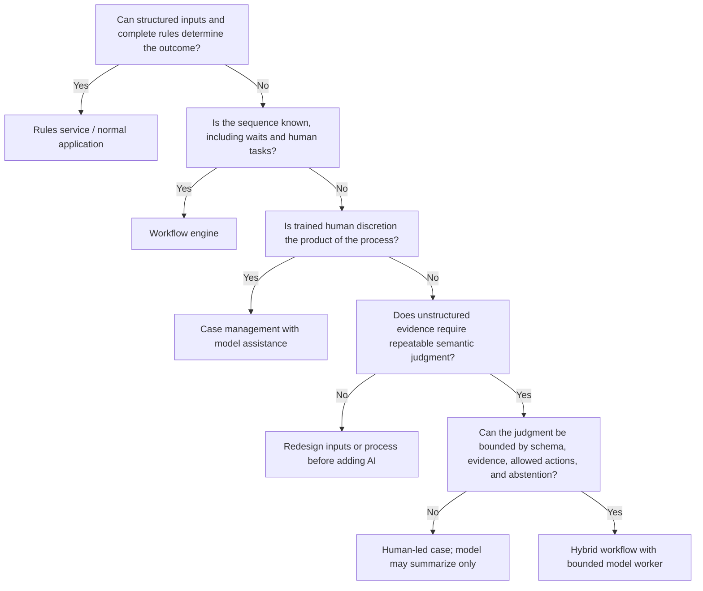

# Workload Fit, Requirements, and Autonomy

> **Purpose:** Decide whether the workload needs an agent, define the operating contract, and set a safe autonomy ceiling before choosing a framework.

## Start with the business case

Describe one case type in operational terms:

```yaml
case_type: supplier_bank_detail_change
business_owner: accounts_payable
entry_events:
  - authenticated_supplier_portal_submission
  - verified_internal_request
terminal_outcomes:
  - change_applied_and_reconciled
  - rejected_with_reason_and_appeal_path
  - cancelled
maximum_age: P5D
systems_of_record:
  supplier_identity: vendor_master
  bank_instruction: payments_master
  approval: control_workflow
consequence_classes:
  - financial_redirection
  - personal_data_processing
prohibited_automation:
  - infer_bank_account_from_email_body
  - requester_approves_own_change
  - commit_without_out_of_band_verification
```

The contract must name the outcome and the source of truth. “Process this request” is not testable; “apply one approved bank-detail version to the vendor master, verify it through an independent read, and retain the control evidence” is.

## Workload decomposition

Separate activities before deciding which need a model.

| Activity | Typical examples | Best owner |
| --- | --- | --- |
| Intake | Authenticate source, validate envelope, detect duplicate | Deterministic adapter |
| Extraction | Read names, dates, references, clauses from variable documents | Parser/OCR first; model when layout/language varies |
| Entity resolution | Match supplier, employee, claim, account | Master-data service with ambiguity result |
| Calculation | Tax, fee, tolerance, aging, entitlement amount | Tested deterministic function |
| Rule decision | Threshold, eligibility, required documents, approval route | Versioned rules/DMN service |
| Semantic judgment | Classify free-text exception, compare evidence, summarize conflict | Bounded model worker with abstention |
| Workflow coordination | Timers, retries, signals, assignments, escalation | Durable workflow/case service |
| Authorization | Actor may perform action on resource now | Policy service/downstream system |
| Effect | Create/update/send/post/transfer | Narrow effect adapter |
| Verification | Read after write, compare ledgers, confirm postcondition | Deterministic reconciler |
| Explanation | Operator/customer narrative | Template plus bounded model draft and review |

If every row can use deterministic ownership, stop: an agent adds risk and cost without new capability.

## Fit decision tree



## When not to use an agent

Reject the agent design when any boundary below applies. “The model can probably do it” is not counter-evidence.

| Boundary | Evidence that triggers rejection | Preferred alternative | Reconsider only when |
| --- | --- | --- | --- |
| Complete structured decision | Typed inputs plus rules determine every supported outcome | Normal application, calculation library, or versioned DMN/rules service | A measured population still requires semantic interpretation |
| Stable prescribed sequence | All branches, timers, callbacks, and human tasks are known | BPM/workflow engine with deterministic workers | A bounded judgment step materially improves the baseline |
| Human discretion is legally or operationally central | Qualified staff must weigh contested evidence or exercise accountable discretion | Case management and decision-support UI | The model remains advisory and preserves meaningful human authority |
| Unsafe ambiguity | No reliable way to cite sources, detect novelty, abstain, or correct the output | Human-led intake; improve forms, source data, or policy first | The task can be closed to typed outputs and verifiable evidence |
| No authoritative integration | Only brittle UI automation exists and success cannot be read back | Supervised RPA or manual operation with dual control | A semantic operation, durable receipt, and reconciliation path exist |
| Irreversible/high-consequence first release | The proposed pilot starts with transfer, filing, account closure, entitlement denial, or binding communication | Read-only triage or staged draft | Lower authority stages have passed fault, control, outcome, and recovery gates |
| Unresolved policy or ownership | Rules conflict, no one owns exceptions, or legal/control duties are unsettled | Process and policy redesign | Owners approve deterministic rules, exception routes, and evidence duties |
| Insufficient operating capacity | No staffed fallback, reconciliation owner, incident responder, or queue capacity | Keep or improve the current controlled process | Capacity and recovery exercises meet the target SLOs |
| Model adds no net value | Total correct-case cost, cycle time, harm, or operator load does not improve | Parser, search, templates, workflow, or human process | A new bounded use case beats the measured baseline |

RPA is a bridge, not an authority model. If a legacy UI is unavoidable, isolate the robot by screen/action, use a business operation ID outside the robot, capture before/after evidence, serialize conflicting work, and route uncertain completion to reconciliation. Do not let selector success stand in for a committed business outcome.

## Requirements catalog

### Functional requirements

- Accept only authenticated, schema-valid entry events and preserve source identity.
- Deduplicate at both event and business-case levels without destructive merging.
- Preserve every source item, its provenance, and its observed/occurred timestamps.
- Version facts, decisions, rules, policies, assignments, approvals, and effect intents.
- Pause durably for evidence, review, approval, external callbacks, and deadlines.
- Persist every SLA, expiry, reminder, escalation, and retry clock as a named clock with due time, time zone/business-calendar version, pause policy, and firing event identity.
- Make missing, conflicting, stale, and low-confidence evidence explicit.
- Reassign work without allowing the previous owner to commit afterward.
- Treat automated, system, and human handoffs as versioned ownership transfers with sender, receiver, payload/evidence manifest, accepted/rejected state, deadline, and stale-sender fence.
- Reconcile every consequential write against an authoritative downstream view.
- Produce a minimal, access-controlled evidence bundle for each terminal outcome.
- Support correction, appeal, reopening, cancellation, and retention/legal-hold rules where required.

### Quality attributes

| Attribute | Requirement question | Example acceptance measure |
| --- | --- | --- |
| Correctness | Did the final business state satisfy all invariants? | Zero illegal terminal outcomes in golden and fault suites |
| Reliability | Can work survive process, queue, provider, and adapter failure? | Recovery objective and no lost cases in crash tests |
| Timeliness | Are deadlines met, not just model calls fast? | Percent completed or escalated before case deadline |
| Control integrity | Were authorization, SoD, and approvals valid at commit? | Zero control bypasses; all commits have valid decision evidence |
| Reconciliation | Are expected and actual cross-system states aligned? | Unresolved high-risk effects under age threshold |
| Privacy | Was only necessary data used and retained? | Field/purpose access tests and deletion/hold evidence pass |
| Human usability | Can operators correct and decide efficiently? | Review time, correction rate, escalation clarity |
| Auditability | Can an independent reviewer reconstruct the outcome? | Evidence-bundle completeness and reproducibility rate |
| Cost | Does benefit exceed model, review, integration, and exception cost? | Cost per correctly completed case versus baseline |

## Risk and consequence matrix

Assess a **decision/effect class**, not the average case.

| Dimension | Low | Medium | High |
| --- | --- | --- | --- |
| Impact on a person | Internal routing only | Delay or reversible service change | Legal, financial, employment, health, or access consequence |
| Reversibility | Delete a draft | Correctable with notification | Irreversible, time-sensitive, or legally binding |
| Monetary exposure | No money | Capped adjustment | Transfer, payout, write-off, or material liability |
| Data sensitivity | Operational metadata | Personal/confidential data | Special-category, regulated, secret, or cross-border data |
| Rule clarity | Complete deterministic rules | Bounded exceptions | Ambiguous policy or contested judgment |
| Integration certainty | Transactional local state | Idempotent API with status | UI automation or API without receipt lookup |
| Detection | Immediate invariant check | Daily reconciliation | Harm can remain hidden for weeks |

Any high dimension lowers the autonomy ceiling until domain owners approve a documented safety case.

## Autonomy admission contract

For every proposed authority cell, record:

```yaml
authority_cell:
  workflow: invoice_exception
  decision: classify_variance_reason
  effect: add_internal_case_tag
  tenant_scope: legal_entity_uk01
  value_band: "<= 500 GBP"
  level: B4
  allowed_actions: [set_exception_category]
  denied_actions: [approve_invoice, change_amount, release_payment, contact_supplier]
  preconditions:
    - invoice.status == "on_hold"
    - evidence.source_count >= 2
    - proposal.confidence >= 0.92
    - no_conflicting_master_data
  budgets:
    max_cases_per_hour: 200
    max_auto_correction_rate_7d: 0.005
  expires_at: 2026-11-30T00:00:00Z
  kill_switch: backoffice/invoice-exception/auto-tag
```

The authority record is configuration for enforcement and release review, not prose hidden in a prompt.

## Bound model judgment

A judgment task is admissible only when all of these are true:

- the question is narrow and its output has a versioned schema;
- allowed labels/actions are closed and unambiguous;
- relevant evidence can be presented inside a purpose-limited projection;
- the model can return `insufficient_evidence`, `conflict`, or `out_of_scope`;
- source spans or record references support every material field;
- downstream deterministic rules can validate the output;
- harmful false-positive and false-negative costs are separately measured;
- a qualified human can correct the result without reconstructing the entire run;
- the workflow has a safe path when the model or provider is unavailable.

Do not use a single numeric confidence as authorization. It can route review only after calibration on representative data, per class and consequence band.

## Human-work requirements

Human review is a designed control, not an error sink. Specify:

| Property | Required definition |
| --- | --- |
| Eligibility | Roles, training, tenant/business-unit scope, absence of conflicts |
| Assignment | Queue, skill, workload, ownership lease, reassignment policy |
| Decision | Approve, reject, request evidence, correct facts, escalate, or cancel |
| Evidence | Minimum fields, original source access, freshness, conflicts, and impact |
| Time | Due time, reminders, escalation, expiry, and holiday/time-zone calendar |
| Independence | Which prior actions make the reviewer ineligible |
| Accountability | Authenticated actor, reason code, comments, and exact object version |
| Appeal | Who can reopen or contest, deadline, and independent reviewer |

## Non-goals

- Replacing process owners, compliance, legal, finance control, or data-protection roles.
- Encoding legislation or policy from model memory.
- Treating natural-language explanation as proof that a rule ran.
- Achieving “straight-through processing” by hiding exceptions.
- Creating a universal enterprise agent with ambient application access.
- Reproducing private chain-of-thought for auditors. Persist observable evidence and decisions instead.

## Acceptance criteria before architecture selection

- [ ] One case type, owner, population, entry event, terminal outcome, and maximum age are named.
- [ ] Systems of record and record-level authorities are mapped.
- [ ] Every activity is assigned to deterministic software, model worker, or human role.
- [ ] The baseline workflow without a model is measured.
- [ ] Consequence classes and autonomy cells are explicit.
- [ ] Domain rules, legal constraints, and appeal duties have accountable owners.
- [ ] Model abstention and manual fallback are part of normal flow.
- [ ] Success measures include final state, harm, correction, control, timeliness, and cost.
- [ ] The team can explain why a rules/workflow-only system is insufficient.

## Sources and related guides

- [OMG BPMN 2.0.2](https://www.omg.org/spec/BPMN/2.0.2/)
- [OMG CMMN 1.1](https://www.omg.org/spec/CMMN/1.1/)
- [OMG DMN 1.5](https://www.omg.org/spec/DMN/1.5/)
- [NIST AI RMF Core](https://airc.nist.gov/airmf-resources/airmf/5-sec-core/)
- [GDPR Article 22 and safeguards](https://eur-lex.europa.eu/eli/reg/2016/679/2016-05-04)
- [Requirements, authority, and threat model for SRE agents](../sre-incident-response-agent/requirements-authority-and-threat-model.md)
- [Custom loop vs framework vs workflow engine](../../comparisons/custom-loop-vs-framework-vs-workflow-engine.md)
