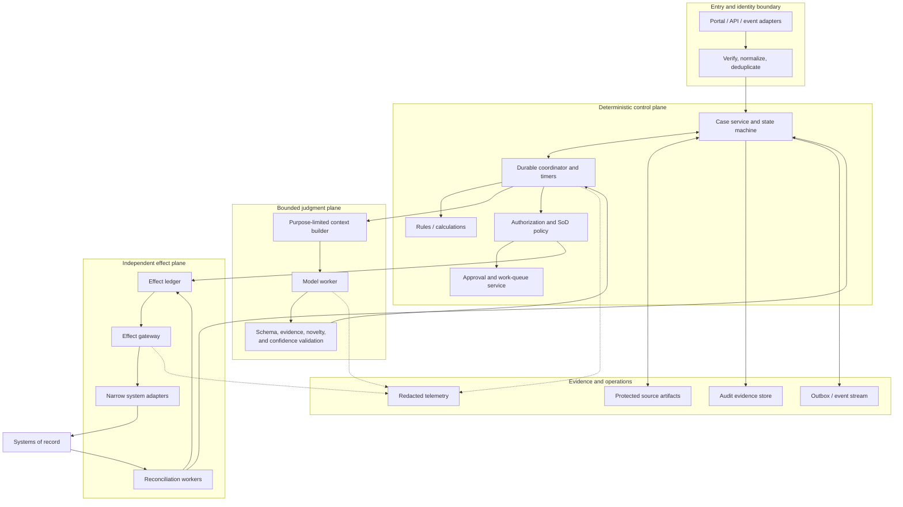
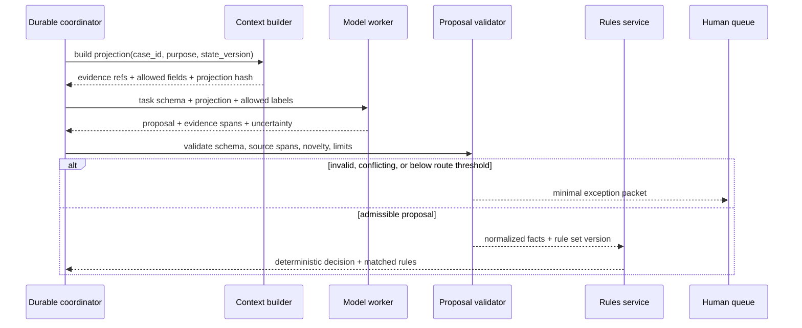
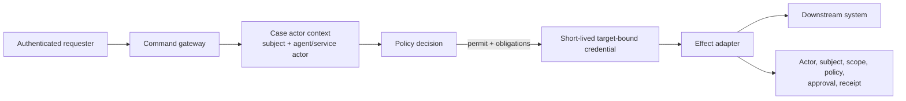

# Reference Architecture and Runtime Selection

> **Purpose:** Choose the smallest runtime and system boundary that can safely own long-running cases, human waits, model calls, and multi-system effects.

## Recommended system shape

Use a **single durable coordinator with typed workers**. Do not model departments as autonomous agents. People and systems can remain separate participants without adding model-to-model delegation.



### Trust boundaries

1. **Entry boundary:** Authenticate the sender, validate schemas and signatures, normalize identifiers, and prevent duplicate intake.
2. **Context boundary:** Release only fields necessary for the model task; treat source content as untrusted data.
3. **Judgment boundary:** Convert nondeterministic output into a versioned proposal, never an implicit state mutation.
4. **Policy boundary:** Evaluate actor, resource, tenant, purpose, state, risk, and SoD with current authoritative facts.
5. **Effect boundary:** Bind a canonical authorized command to a stable operation ID and execute through a narrow adapter.
6. **Evidence boundary:** Preserve required control records independently from sampled diagnostics.

## Component responsibilities

| Component | Owns | Must not own |
| --- | --- | --- |
| Intake adapter | Source verification, event identity, normalization | Case outcome |
| Case service | Case ID, state/version, facts, ownership, decisions, deadlines | Raw model transcript as truth |
| Durable coordinator | Sequencing, waits, retries, callbacks, resume | Business authorization or external commit truth |
| Rules service | Versioned deterministic decisions/calculations | Semantic guesswork from unstructured evidence |
| Context builder | Purpose/field projection, redaction, evidence references | Ambient enterprise search |
| Model worker | Typed extraction/classification/summary/proposal | Authorization, approvals, or direct credentials |
| Policy service | Permit/deny/require-approval and obligations | Performing the effect |
| Approval service | Authenticated decision, eligibility, expiry, intent binding | Deciding downstream commit success |
| Effect gateway | Idempotency, preconditions, credential minting, adapter invocation | Replanning business intent |
| Reconciler | Authoritative read-back and discrepancy classification | Hiding unresolved differences |
| Evidence service | Immutable references, versions, control receipts, access/retention | General-purpose analytics telemetry |

## Runtime choice

| Runtime shape | Choose when | Benefits | Limits |
| --- | --- | --- | --- |
| Database state machine plus queue | Few case types, simple waits, strong application team | Smallest surface; explicit state and SQL constraints | You build timers, retries, operations UI, and version migration |
| BPMN/workflow platform | Business-visible flow, user tasks, timers, rule calls, operations tooling | Mature workflow semantics and operator UX | Vendor extensions differ; visual model does not supply effect safety |
| Durable-code runtime | Complex programmatic flow, long waits, frequent integration changes | Code reuse, replay, durable timers/signals | Determinism/versioning constraints; business visibility may need custom UI |
| Case-management platform | Ad hoc human work and evolving case information dominate | Native work queues and discretionary tasks | Model/effect controls still need explicit integration |
| Agent graph/framework | Short model-centric branch/loop inside a case | Convenient model/tool state and interrupts | Not automatically a case ledger, scheduler, policy engine, or reconciler |
| RPA orchestrator | Necessary legacy UI actions without APIs | Bridges supported automation gap | Brittle selectors, ambiguous effects, session/focus and audit problems |

### Selection rule

Use the workflow/case runtime for **time and lifecycle**, a rules engine for **business determinism**, and an agent framework only inside the **bounded judgment step**. A framework checkpoint is not automatically an authoritative case record or audit ledger.

## Durable-runtime qualification

Qualify one executable slice under the exact product, deployment mode, SDK/client, storage backend, and upgrade path. Passing a feature checklist or modeling a BPMN symbol is insufficient.

| Gate | Required experiment | Pass evidence |
| --- | --- | --- |
| Identity | Start the same business case twice concurrently and after retention expiry | Documented case-to-runtime ID mapping, duplicate policy, tenant scope, and no second active case |
| Persistence/restart | Kill coordinator and all workers at every wait and activity boundary | Case, work item, timer, signal subscription, attempt, and pending effect resume without a repeated model call or new operation ID |
| Event delivery | Duplicate, delay, and reorder callbacks/signals | Correlation key, event ID, TTL/retention, late-event policy, and version-gap behavior are proven |
| Long waits/clocks | Advance wall clock across DST, holidays, reassignment, pause, and expiry | Named clock records agree with the approved calendar and emit one semantic firing event |
| Cancellation | Cancel before dispatch, during activity, after remote commit, and during a human wait | New scheduling stops; in-flight/unknown effects reconcile; history remains complete |
| Compensation | Fail original, compensating, and compensation-verification steps | Domain correction is a new idempotent effect; failed compensation stays owned and visible |
| Human queues | Reassign, delegate, expire, deny completion, and overload the queue | Eligibility, fencing, due/escalation, audit, and manual takeover work under restart |
| Versioning | Run old cases while ramping new code; migrate one supported and one unsupported state | Pin/patch/migrate decision, compatibility window, worker reachability, rollback, and repair evidence |
| Backup/DR | Restore behind the external world, then resume | Declared RPO/RTO, referential integrity, downstream reconciliation, and effects held until safe |
| Operations | Create a stuck incident, poison message, quota limit, and storage/telemetry outage | Operator can inspect, pause, repair, replay safely, and export required evidence |

### Qualified product examples, not endorsements

| Candidate and researched baseline | Useful documented mechanisms | Qualification limits that remain application-owned |
| --- | --- | --- |
| **Temporal**, current documentation accessed 2026-08-31 | Durable workflow history, timers/messages, activities, cancellation, Workflow ID policies, and Worker Deployment Version routing | `Namespace + Workflow ID + Run ID` is runtime identity, not the business case ledger; a Run ID can change across retries/continue-as-new/reset. Activity effects must be idempotent. Pinned versus auto-upgrade behavior, patching, history growth, cancellation cleanup, visibility retention, codecs, and DR must be tested for the selected SDK/server/cloud versions. |
| **Camunda 8.9**, documentation accessed 2026-08-31 | BPMN/DMN execution, jobs, messages, timers, compensation, incidents, Camunda user tasks, process migration, Operate/Tasklist, and self-managed backup/restore procedures | Process definition/key/version, process instance key/business ID, job key, and user-task key do not replace application IDs. Message correlation/TTL, worker idempotency, listener retry, migration limitations, task-assignee behavior, multi-tenancy, secondary-store lag, and coordinated component restore require explicit tests. The public-API stability contract covers only its stated surface. |

Temporal documentation currently recommends Worker Versioning for production workflow-code changes where versioned deployments are feasible. A pinned workflow remains on one Worker Deployment Version; auto-upgrade workflows still require replay-safe patching. Camunda 8.9 documents immutable business IDs per active root instance scope, but migration can bypass uniqueness checks and has element-specific limitations. These are examples of why product identifiers and upgrade features cannot be generalized.

### Runtime operation manifests

Do not qualify a workflow engine wholesale. Maintain the same operation-level manifest discipline used for business adapters:

| Runtime operation | Application semantic key | Qualification evidence |
| --- | --- | --- |
| Start/admit case | `(tenant_id, case_id, admission_event_id)` | Concurrent duplicate start, closed-ID reuse/retention behavior, definition/build selection, tenant scope, returned instance mapping, accepted-but-response-lost lookup |
| Deliver signal/message | `(case_id, semantic_event_id)` plus expected case version | Correlation key/name, duplicate suppression, TTL/retention, late/no-subscription outcome, ordering scope, response-loss lookup, payload/version limit |
| Dispatch/complete work | `(work_item_id, assignment_epoch, attempt_id)` | Activation lease/timeout, retry/redelivery, fencing, variable/data projection, completion idempotency, crash-after-external-effect path |
| Create/complete human task | `(work_item_id, revision, assignment_epoch)` | Assignment eligibility, claim/reassign, due/follow-up/escalation, form/version binding, stale completion, denial/correction listeners, audit export |
| Timer fire | `(clock_id, due_revision)` | Durable schedule, calendar/time-zone owner, DST behavior, duplicate fire, reschedule/cancel race, restore overdue policy |
| Cancel/terminate | `(case_id, cancellation_request_id)` | Cooperative versus forced semantics, child/activity propagation, in-flight effect handling, cleanup/compensation, late completion fence, terminal evidence |
| Migrate/upgrade | `(case_id, migration_plan_id)` | Source/target version and active-element mapping, preflight/dry run, unsupported states, human task/timer/message/compensation preservation, audit, rollback/repair |
| Backup/restore/export | `(recovery_point_id, component_set)` | Component/storage consistency, encryption/access, version compatibility, RPO/RTO, completeness, secondary-index catch-up, external-world reconciliation before writes |

Each manifest names the exact Temporal SDK/server/cloud or Camunda client/cluster/API surface, timeout/retry defaults, documented limits, tenant configuration, fixtures, owner, qualification date, and expiry/retest triggers.

## BPMN, CMMN, and DMN roles

The OMG standards are complementary models, not mandatory products:

| Standard | Useful representation | Caution |
| --- | --- | --- |
| BPMN 2.0.2 | Predefined process flow, events, human/service tasks, compensation | Operational deployment, data, security, and vendor extensions are outside or vary |
| CMMN 1.1 | Case file and activities whose order responds to evolving information | Human discretion needs explicit authority and evidence design |
| DMN 1.5 | Decisions, input dependencies, FEEL expressions, decision tables | Rule completeness, versioning, authoring controls, and implementation conformance still require testing |

Do not force an ad hoc investigation into a rigid flow merely to use BPMN, or use CMMN to avoid defining stable transitions that really exist.

## Control flow for a model step



The model worker receives no effect credentials. Even a valid proposal goes through rules and policy.

## State storage strategy

Separate these stores logically even if a small deployment uses one database:

| Record | Required properties |
| --- | --- |
| Case aggregate | Current state/version, owner lease, deadlines, fact references, terminal outcome |
| Append-only case events | Stable event ID, prior/result version, actor, type, occurred/observed times, payload schema version |
| Source artifacts | Immutable bytes or protected source reference, digest, provenance, classification, retention |
| Decisions | Inputs/digests, rule/model/prompt versions, output, confidence/abstention, evidence links |
| Approvals | Exact intent hash, object version, approver eligibility, decision, time, expiry, reason |
| Effects | Operation ID, canonical intent, precondition, attempts, status, downstream receipt |
| Audit bundle | Manifest of authoritative records required for a control/audit purpose |
| Telemetry | Redacted spans/logs/metrics; sampled according to operations need |

Use a transaction plus outbox when a case transition must publish an event. Consumers still deduplicate. Event-sourcing the entire product is optional; append-only decision/effect history is not.

## Identity and credential flow



Preserve delegation semantics: the service/agent actor and the human or business principal on whose behalf it acts are distinct. Avoid generic credentials that make automated activity indistinguishable from a person. RFC 8693 defines useful delegation versus impersonation concepts, but each target system's support and audit behavior must be verified.

## Deployment topologies

### Small installation

- one stateless API/intake service;
- one relational database for case, decision, approval, effect, and outbox tables with logical access separation;
- one queue and worker pool;
- one workflow timer/scheduler mechanism;
- one model adapter with a strict task registry;
- one effect gateway process with separate credentials;
- one protected artifact store;
- an operator UI and reconciliation dashboard.

This is enough for many teams. Do not add Kafka, microservices, a vector database, or multi-agent orchestration without an evidenced need.

### Scale-out triggers

Split components when one of these becomes material:

- different data residency or retention boundaries;
- separate security administration or credential domains;
- effect traffic must be isolated from model traffic;
- tenant-specific encryption or model-provider policy;
- queues require independent capacity or priority controls;
- rules and case definitions have independent release ownership;
- artifact volume or reconciliation scans exceed the primary database's operating envelope.

Partition by stable business ownership—often tenant/legal entity and case type—before arbitrary technical sharding. Preserve global SoD and duplicate-detection requirements where they cross partitions.

## Build versus buy questions

Evaluate products against contracts, not feature names:

- Can every case and human task be resumed after process loss?
- Are late and duplicate external signals detectable and deduplicated?
- Can running workflows stay on an old definition while new cases use a new one?
- Can a release migrate active cases with explicit compatibility and rollback?
- Can policy/approval state be independently queried and exported?
- Can the platform represent indeterminate external effect outcomes?
- Can it bind an approval to a canonical payload and current version?
- Can credentials be scoped per adapter, tenant, effect class, and operation?
- Are event history and audit exports complete, access-controlled, and retention-configurable?
- Can model content be excluded from telemetry and provider retention/training?
- Can operators pause queues, revoke authority, reconcile, repair, and explain corrections?

## Framework adapter contract

If an agent SDK or graph runtime is used, an adapter must map:

```text
case_id              <- application-owned business case
judgment_run_id      <- one bounded model task
attempt_id           <- one provider/worker attempt
proposal_id          <- immutable typed output
evidence_ref[]       <- protected application artifacts
model_version        <- exact deployed model identifier
prompt_version       <- reviewed task definition
tool_contract_version<- exact read-only tool schema set
terminal_status      <- accepted | abstained | invalid | failed | cancelled
```

Internal framework retry, thread, checkpoint, or trace IDs never replace these identities. Capture adapter fixtures so upgrades cannot silently change event ordering, tool behavior, retries, or terminal meanings.

## Architecture review checklist

- [ ] One component owns authoritative case transitions.
- [ ] Durable waits, deadlines, escalation, cancellation, and reassignment are explicit.
- [ ] Rules, authorization, approval, effect commit, and verification are outside the model.
- [ ] Model context is purpose-limited and source content is untrusted.
- [ ] Effect workers use separate target-bound credentials.
- [ ] Case, event, approval, effect, audit, and trace identities are distinct.
- [ ] Unknown and partial external outcomes have recovery states.
- [ ] Running case/version compatibility has a release strategy.
- [ ] Manual operation remains possible during model/provider outage.
- [ ] The topology is no more distributed than the workload requires.

## Sources and related guides

- [OMG BPMN 2.0.2](https://www.omg.org/spec/BPMN/2.0.2/)
- [OMG CMMN 1.1](https://www.omg.org/spec/CMMN/1.1/)
- [OMG DMN 1.5](https://www.omg.org/spec/DMN/1.5/)
- [Temporal Workflow ID and Run ID](https://docs.temporal.io/workflow-execution/workflowid-runid)
- [Temporal Worker Versioning](https://docs.temporal.io/production-deployment/worker-deployments/worker-versioning)
- [Temporal cancellation](https://docs.temporal.io/develop/go/workflows/cancellation)
- [Camunda 8.9 process instance creation and business IDs](https://docs.camunda.io/docs/components/concepts/process-instance-creation/)
- [Camunda 8.9 process instance migration](https://docs.camunda.io/docs/components/concepts/process-instance-migration/)
- [Camunda 8.9 user tasks](https://docs.camunda.io/docs/components/modeler/bpmn/user-tasks/)
- [Camunda 8 backup and restore](https://docs.camunda.io/docs/self-managed/operational-guides/backup-restore/backup-and-restore/)
- [AWS Step Functions callback pattern](https://docs.aws.amazon.com/step-functions/latest/dg/connect-to-resource.html)
- [Azure Durable Task external events](https://learn.microsoft.com/en-us/azure/durable-task/common/durable-task-external-events)
- [OAuth 2.0 Token Exchange, RFC 8693](https://www.rfc-editor.org/rfc/rfc8693.html)
- [Production agent control plane](../../architectures/production-agent-control-plane.md)
- [Durable execution](../../runtime/durable-execution.md)
