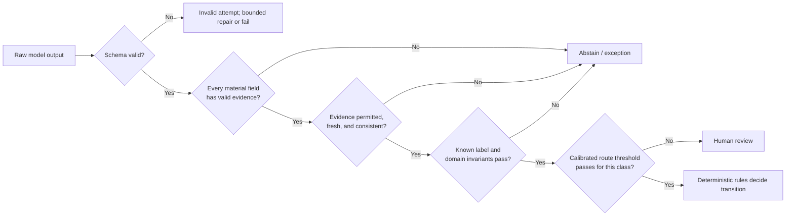

# Case State, Events, Rules, and Model Judgment

> **Purpose:** Define authoritative state and the contract by which uncertain model output can influence—but never silently mutate—a business case.

## Four records with different authority

| Record | Meaning | Authority |
| --- | --- | --- |
| Source fact | Observed value linked to an original system/document | Evidence; may be stale, disputed, or superseded |
| Derived proposal | Model or deterministic transformation of facts | Candidate; never authoritative by itself |
| Decision | Rule or authorized human disposition over a defined input version | Authoritative reason for a transition |
| Effect receipt | Downstream proof of an attempted/committed business operation | Authoritative only within the downstream system's contract |

Do not overwrite a fact when a model changes its interpretation. Add a new proposal and, if accepted, a new decision referencing both the prior and current evidence.

## Canonical identity and version ledger

Never join records because names, timestamps, conversation IDs, or provider run IDs look similar. Define scope, immutability, reuse, and concurrency for every identity before implementing resume or reconciliation.

| Object | Stable semantic identity | Version and mutation semantics | Never substitute |
| --- | --- | --- | --- |
| Case | `(tenant_id, case_id)`; immutable and non-PII | `state_version` increments by compare-and-set for each authoritative transition; reopen/split/merge creates explicit lineage events, never identity reuse | Workflow run, chat thread, ticket number from another system |
| Work item | `(tenant_id, work_item_id)` for one obligation | Immutable `work_type` and case link; `revision` increments for evidence/decision-surface change; `assignment_epoch` and fencing token change on claim/reassign; completion binds case and item revisions | Queue message, UI row, assignee name |
| Rule | `(rule_namespace, rule_set_id, rule_set_version)` plus artifact digest | Published versions are immutable with effective interval, owner, input/output schemas, engine/runtime version, and retirement status; every decision pins the exact version and input digest | Prompt text, latest alias, human-readable policy title |
| Document | `(tenant_id, document_id, content_version)` plus byte digest | Original bytes are immutable; replacement, OCR, redaction, translation, and normalized rendition are new versions or derived artifacts with lineage and parser/model versions | Filename, URL, email subject, OCR text alone |
| Approval | `(tenant_id, approval_id, approval_revision)` | A decision record is immutable and binds work item/case revisions, canonical intent hash, evidence digest, approver/delegation snapshot, policy, expiry, and revocation state; material change creates a new request/revision | Chat assent, ticket status, session identity |
| Principal/delegate | Stable `principal_id` for the represented person/business role, `actor_id` for the authenticating human/service, and `delegation_id` for one bounded grant | Delegation records pin issuer, delegate, represented principal, scopes, target/tenant, purpose, start/expiry, revocation, authentication context, and policy version; actor and principal never collapse | Display name, email, shared service account, model identity |
| External record | `(system_instance, tenant_or_legal_entity, resource_type, resource_id)` | Capture provider record version/ETag/change token and observed time with every read; use provider external/business keys only after uniqueness and reuse are qualified | Display value, search rank, unscoped `sys_id`/object ID |
| Effect | `(tenant_id, operation_id)` for one canonical business intent | `intent_hash`, target, and effect type are immutable; attempts get distinct `attempt_id`; status transitions monotonically from ledger evidence; compensation gets a new linked operation | Queue delivery ID, HTTP request ID, workflow activity/run ID |
| Handoff | `(tenant_id, handoff_id)` for one transfer of responsibility | `handoff_revision` binds sender, intended receiver/eligibility, work/case revisions, evidence manifest, allowed decisions, due clocks, reason, and fence; accepted/rejected/expired/cancelled are immutable events | Notification delivery, assignment field update, free-form message |

A provider identifier can be recorded as a mapped execution or receipt reference. The application identity remains stable across provider retries, migrations, archive/restore, and vendor replacement.

## Case aggregate

One practical application-owned contract is:

```ts
type CaseStatus =
  | "received"
  | "triaging"
  | "waiting_for_evidence"
  | "ready_for_decision"
  | "exception"
  | "awaiting_approval"
  | "ready_to_commit"
  | "committing"
  | "effect_unknown"
  | "verifying"
  | "compensating"
  | "completed"
  | "rejected"
  | "cancelled";

interface CaseRecord {
  caseId: string;
  tenantId: string;
  caseType: string;
  definitionVersion: string;
  stateVersion: number;
  status: CaseStatus;
  subjectRefs: Array<{ system: string; entityType: string; entityId: string }>;
  factSetVersion: number;
  owner?: { actorId: string; leaseToken: string; expiresAt: string };
  deadlines: Array<{ kind: string; dueAt: string; calendarVersion: string }>;
  activeDecisionId?: string;
  activeApprovalId?: string;
  unresolvedEffectIds: string[];
  createdAt: string;
  updatedAt: string;
  terminalOutcome?: string;
}
```

The database enforces legal terminal states, monotonic `stateVersion`, uniqueness in tenant scope, and compare-and-set transitions. The model never supplies `tenantId`, lease tokens, versions, or terminal status.

## Event contract

CloudEvents provides useful portable context fields, but application semantics still require case/version and actor/evidence fields.

```json
{
  "specversion": "1.0",
  "id": "evt_01J...",
  "source": "https://ops.example/case-service",
  "type": "com.example.backoffice.case.decision-recorded.v1",
  "subject": "case/case_7H2",
  "time": "2026-08-31T09:12:45Z",
  "datacontenttype": "application/json",
  "tenantid": "tenant_uk01",
  "caseid": "case_7H2",
  "causationid": "evt_01K...",
  "correlationid": "corr_4C9",
  "actorid": "svc_rules_prod",
  "subjectactorid": "user_123",
  "baseversion": 18,
  "resultversion": 19,
  "schemaversion": "1.0",
  "data": {
    "decision_id": "dec_H81",
    "decision_type": "invoice_variance_route",
    "outcome": "manual_review",
    "rule_set": "invoice-policy@2026.08.4",
    "input_digest": "sha256:..."
  }
}
```

Required invariants:

- `source + id` identifies one event; duplicates do not create another transition.
- `baseversion` must equal the current case version; stale writers fail visibly.
- `resultversion` is exactly `baseversion + 1` for a single aggregate transition.
- event occurrence time and application observation time are both retained when they differ.
- event delivery may be duplicated or delayed; ordering is guaranteed only in a documented scope.
- exactly one terminal case outcome wins; correction/reopen is a new transition, never history editing.

## Fact contract

```yaml
fact:
  fact_id: fact_24A
  case_id: case_7H2
  name: invoice.total_amount
  value: { currency: GBP, minor_units: 125040 }
  source:
    artifact_id: art_91C
    locator: "page=2&bbox=110,340,620,390"
    system_record_version: null
    digest: "sha256:..."
  observed_at: 2026-08-31T08:57:20Z
  occurred_at: 2026-08-28T00:00:00Z
  method: model_extraction
  derivation:
    judgment_run_id: jr_8N3
    model: provider/model-version
    prompt_version: invoice-extract@12
  confidence: 0.97
  review_status: accepted
  supersedes: null
```

`confidence` describes the extractor under a specified calibration regime; it is not a probability that the business action is safe. Sensitive artifacts should use protected references rather than duplicating source content into every record.

## Rule ownership

Business rules need:

- a named owner and reviewer;
- typed inputs and outputs;
- explicit missing/null/error behavior;
- effective-from and retirement dates;
- immutable version or digest;
- tests for boundaries, combinations, and negative cases;
- a deployment/migration rule for active cases;
- a reason code and matched-rule evidence;
- a rollback or forward-fix procedure;
- conflict detection when two rule sources disagree.

### Decision-table example

```yaml
decision: invoice_variance_route
version: 2026.08.4
hit_policy: UNIQUE
inputs:
  amount_minor: integer
  variance_bps: integer
  supplier_risk: [low, medium, high]
  evidence_complete: boolean
rules:
  - when: { evidence_complete: false }
    then: { route: request_evidence, approval_class: none }
  - when: { evidence_complete: true, supplier_risk: high }
    then: { route: manual_review, approval_class: controller }
  - when: { evidence_complete: true, supplier_risk: [low, medium], variance_bps: "<= 50", amount_minor: "<= 50000" }
    then: { route: auto_clear, approval_class: none }
  - when: { evidence_complete: true, supplier_risk: [low, medium], variance_bps: "> 50" }
    then: { route: manual_review, approval_class: ap_lead }
no_match: error
```

In production, compile or execute through a tested rules engine or deterministic code. Do not let a model interpret this YAML. The example uses one-hit semantics deliberately; ordering-dependent “first match” rules are harder to review and should be justified.

## Model task contract

Each task is a versioned product surface:

```ts
interface JudgmentTask<I, O> {
  taskName: string;
  promptVersion: string;
  inputSchema: I;
  outputSchema: O;
  allowedEvidenceClasses: string[];
  forbiddenFields: string[];
  maxArtifacts: number;
  maxTokens: number;
  timeoutMs: number;
  modelRoutingProfile: string;
  validationPolicyVersion: string;
}

interface ClassificationProposal {
  proposalId: string;
  label:
    | "pricing_mismatch"
    | "quantity_mismatch"
    | "tax_mismatch"
    | "duplicate_suspected"
    | "other"
    | "insufficient_evidence"
    | "conflict"
    | "out_of_scope";
  evidence: Array<{ artifactId: string; locator: string; supports: string }>;
  conflicts: Array<{ left: string; right: string; evidenceRefs: string[] }>;
  uncertaintyReasons: string[];
}
```

The proposal contains no `nextState`, `approved`, `pay`, `eligible`, or arbitrary tool call.

## Context, compaction, and memory decisions

This is the canonical seven-lifetime policy. A memory write is denied unless its lifetime, schema, authority, purpose, owner, and deletion path match one row.

| Lifetime | Use and reject policy | Retention and deletion | Poisoning controls | Evaluation controls |
| --- | --- | --- | --- | --- |
| Turn/scratch memory | Use for one inference's bounded intermediate formatting or checklist; reject as a fact, decision, instruction source, or effect precondition | Discard after the attempt; retain only protected diagnostic content under an explicit short-lived purpose | Delimit untrusted content, no write tools, closed output schema, no automatic promotion | Red-team injected documents; assert no scratch value changes authority or survives resume |
| Working/run memory | Use typed open questions, evidence references, rejected proposals, budgets, and progress for one judgment run; reject free-form hidden state as case truth | Delete at run close after material records are promoted through validation; legal hold applies only to governed records | Provenance on every item, trust labels, writer authorization, conflict/novelty checks | Restart/replay at each step; mutation tests prove poisoned items are rejected and non-material state can disappear safely |
| Session memory | Use only for reviewer UI continuity within one authenticated session; reject for business continuity, entitlement, approval, or cross-device authority | Short idle/absolute expiry; user logout, revocation, tenant switch, and deletion clear it | Bind tenant, actor, purpose, session, and CSRF/channel integrity; never ingest document instructions as session policy | Session fixation/tenant-switch tests; resume with an empty session must preserve case correctness |
| Durable workflow/task memory | Use versioned case, work item, event, fact, decision, approval, clock, effect, exception, and receipt records as authoritative state; reject provider transcript/checkpoint as sole truth | Domain record schedule, legal hold, correction, archival, cryptographic erasure, backup/provider deletion evidence | Schema/CAS/fencing, append-only lineage, field authorization, integrity monitoring, independent reconciliation | State-machine, restore, duplicate/reorder, migration, cancellation, SoD, and audit-reconstruction suites |
| Domain knowledge memory | Use approved rules, policies, schemas, process definitions, master-data projections, and controlled retrieval corpora; reject unsigned drafts or retrieved prose as executable policy | Source-controlled/effective-dated versions; retire without deleting versions needed by active cases or audit | Signed provenance, owners/reviewers, ingestion isolation, source allowlists, change approval, retrieval access control | Rule boundary/no-match tests, poisoned-corpus tests, source freshness, retrieval recall, and active-case compatibility |
| Long-term/preference memory | Default off; permit explicit inspectable preferences only for presentation/routing convenience; reject anything that changes eligibility, SoD, risk, financial, legal, or retention outcomes | Purpose-specific expiry, user view/edit/delete, tenant/account deletion propagation, no silent re-creation | User confirmation, allowed-key schema, origin and last-editor, no inference from sensitive behavior | Preference deletion and re-creation tests; fairness/outcome comparison with memory disabled |
| Episodic/outcome memory | Use only adjudicated corrections, appeals, incidents, reconciliations, and outcomes as governed candidate evaluation/mining records; reject raw model output and single-reviewer feedback from self-promotion | Dataset-specific purpose, sampling, retention, deletion/hold, de-identification, and lineage to source case | Quarantine, multi-party adjudication for material labels, selection-bias controls, train/test separation, owner-approved promotion | Held-out regression, label audit, poisoning/canary tests, slice drift, and rollback when mined cases degrade outcomes |

### Loss-aware compaction receipt

Compaction changes only a model projection. It cannot truncate the authoritative event stream or synthesize a new approval, fact, clock, or effect status. Persist a receipt such as:

```yaml
compaction_receipt:
  receipt_version: "1.0"
  receipt_id: cmp_7K4
  case_id: case_7H2
  case_state_version: 38
  source_event_high_watermark:
    stream: case/case_7H2
    sequence: 144
    event_id: evt_144
    prefix_digest: "sha256:..."
  version_pins:
    behavior_bundle: backoffice-invoice@2026.08.31.3
    workflow_definition: invoice-exception@9
    case_schema: 4
    event_schema: 3
    rules: invoice-policy@2026.08.4
    policy: authorization@2026.08.7
    prompt: invoice-classify@18
    model_routing: bounded-classification@6
    tool_contracts: invoice-read-tools@5
    context_builder: invoice-context@7
    compactor: loss-aware-compact@2
  approvals:
    - approval_id: apr_82M
      approval_revision: 1
      intent_hash: "sha256:..."
      status: approved
      expires_at: 2026-08-31T12:04:00Z
  active_clocks:
    - clock_id: sla_case_resolution
      due_at: 2026-09-02T17:00:00+01:00
      calendar_version: uk-business@2026
      pause_state: running
  pending_effects:
    - operation_id: op_crm_9P1
      status: accepted_pending
  unknown_effects:
    - operation_id: op_erp_73A
      status: unknown
      reconciliation_due_at: 2026-08-31T11:15:00Z
  unresolved_conflict_refs: [conf_11]
  invariant_hash:
    canonicalizer_version: case-invariants@3
    algorithm: sha256
    value: "sha256:..."
  omitted_item_references:
    - ref: event-range/1-103
      reason: superseded_nonmaterial_history
      retrieval_policy: authoritative_event_store
    - ref: artifact/doc_91C/content/1
      reason: source_bytes_not_in_model_context
      retrieval_policy: protected_artifact_store
  next_safe_action:
    command: reconcile_effect
    operation_id: op_erp_73A
    preconditions: [case_version_is_38, effect_status_is_unknown]
    forbidden_until_resolved: [retry_with_new_operation_id, complete_case]
  projection_digest: "sha256:..."
```

The receipt is a continuity proof and retrieval map, not a snapshot with authority. It deliberately records omissions so information loss is observable.

### Resume verification and rehydration

1. Acquire a new case/work fence and read current case, events, documents, approvals, clocks, effects, and handoffs from their authoritative stores.
2. Verify the receipt schema/signature, case identity, high-watermark prefix digest, version support, and invariant hash. A mismatch enters a typed continuity exception; it never falls back to the compacted prose.
3. Replay authoritative events after the watermark and rehydrate every omitted or retained reference needed for the current purpose under fresh authorization.
4. Revalidate approval eligibility/expiry/revocation, recompute business-calendar clocks, and reconcile every pending or unknown effect before permitting a write.
5. Compile a fresh purpose-limited projection from current state, record a new projection digest, and compare the proposed command with `next_safe_action` plus current policy. Current state wins if the receipt is stale.
6. Fence stale workers and resume only from an allowed state transition. Repeated compaction and restore tests must prove that identity, amounts, deadlines, SoD, appeal rights, unknown effects, cancellations, and stop conditions cannot disappear.

## Validation pipeline



Validation checks observable output. It does not prove the model's hidden reasoning was correct.

## Missing, conflict, and novelty semantics

Use distinct outcomes:

| Outcome | Meaning | Workflow action |
| --- | --- | --- |
| `not_applicable` | Field has no meaning for this case | Continue if rule permits |
| `not_present` | Source does not contain the field | Request evidence or apply explicit default rule |
| `unreadable` | Evidence exists but extraction failed | Alternate parser or human transcription |
| `conflict` | Sources disagree materially | Freeze dependent decision; resolve conflict |
| `stale` | Value is older than allowed freshness | Refresh from authority |
| `ambiguous_entity` | Several canonical targets remain | Human/master-data resolution |
| `novel` | Outside labeled task distribution or known policy | Escalate and capture for future evaluation |
| `out_of_scope` | Case does not belong to this workflow | Re-route without forcing a label |

Collapsing these into `null` produces dangerous defaults and weak metrics.

## Concurrency and ownership

Two actors may work the same case after retry, reassignment, or duplicate intake. Enforce:

1. owner lease or work token issued for a specific case version;
2. compare-and-set transition using `stateVersion`;
3. revalidation of reviewer eligibility and source freshness;
4. rejection of stale lease/fencing token at the state and effect boundaries;
5. explicit merge/link when two cases refer to the same business subject;
6. no last-write-wins updates for decisions, approvals, or effects.

Case merge must preserve both histories and source IDs. Case split creates new related cases with an explicit derivation event.

## Rule and model upgrades with active cases

Pick and document one policy per change class:

| Policy | Use | Risk |
| --- | --- | --- |
| Pin case to original definition/rules | Legally or operationally reproducible long cases | Old defects persist until migrated |
| Use current rules at each decision | Rules are explicitly effective-dated | Same case may be governed by several versions; record each |
| Migrate active cases | Material fix or mandatory policy change | Needs compatibility, dry run, approval, and repair path |
| Re-evaluate prior model proposals | New model fixes a measured defect | Can create inconsistent history; add a new proposal/decision instead of overwrite |

Never replay a historical workflow against new nondeterministic model output unless the purpose is an explicit simulation. Durable replay should reuse recorded model/tool results or isolate the new judgment as a new event.

## Failure tests

- Duplicate an entry event concurrently with a case transition.
- Deliver a late evidence event after case cancellation.
- Reassign a task while the former owner submits a decision.
- Change the rule version between proposal and commit.
- Remove an evidence artifact after a derived fact exists.
- Return valid JSON with an invented source locator.
- Return a known label for an out-of-distribution case.
- Produce conflicting high-confidence extractions from two sources.
- Upgrade the model or prompt while cases wait for evidence.
- Replay the coordinator and prove no new model call or effect occurs unintentionally.

## Checklist

- [ ] Case, fact, proposal, decision, approval, effect, event, and trace identities are distinct.
- [ ] State transitions are enumerated and database-enforced.
- [ ] Missing, conflict, stale, ambiguous, novel, and out-of-scope are distinct.
- [ ] Rule inputs/outputs, no-match behavior, owner, version, and tests are explicit.
- [ ] Model tasks have closed schemas, evidence requirements, abstention, and budgets.
- [ ] Confidence only routes review under a documented calibration policy.
- [ ] Active-case behavior is defined for rule, prompt, model, adapter, and workflow upgrades.
- [ ] Stale owners and stale state versions cannot commit.
- [ ] Audit reconstruction does not require hidden chain-of-thought.

## Sources and related guides

- [CloudEvents 1.0.2 specification](https://github.com/cloudevents/spec/blob/ce%40v1.0.2/cloudevents/spec.md)
- [OMG DMN 1.5](https://www.omg.org/spec/DMN/1.5/)
- [W3C PROV overview](https://www.w3.org/TR/prov-overview/)
- [Agent state and event contracts](../../runtime/agent-state-and-event-contracts.md)
- [Compaction and continuity](../../context-memory/compaction-and-continuity.md)
- [Tool results, artifacts, and provenance](../../tools/tool-results-artifacts-and-provenance.md)
