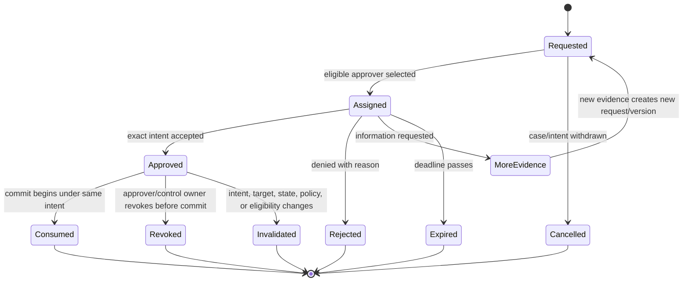
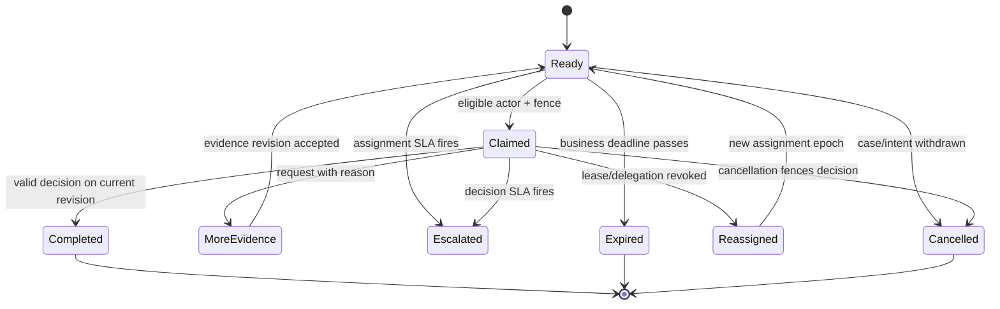

# Approvals, Segregation of Duties, and Exceptions

> **Purpose:** Turn review into an enforceable business control, preserve independence across systems, and make exceptions safe and operable.

## Approval is a stateful authorization input

An approval is valid only for one canonical intent under stated conditions. It is not a chat message, button click, ticket status, or permanent grant.

```yaml
approval:
  approval_id: apr_82M
  case_id: case_7H2
  case_version: 21
  proposal_id: prop_D91
  effect_operation_id: op_4F8
  intent_hash: "sha256:..."
  effect_type: supplier_bank_detail_change
  target:
    system: vendor_master
    entity_id: supplier_1042
    expected_version: "v88"
  risk:
    tier: D3
    amount_minor: 0
    currency: null
  required_roles: [ap_controller]
  required_distinct_approvers: 1
  excluded_actors: [requester_31, preparer_17]
  policy_version: bank-change-policy@2026.08.2
  evidence_manifest_digest: "sha256:..."
  decision: approved
  approver:
    actor_id: user_741
    role_snapshot: [ap_controller]
    authentication_context: phishing-resistant-mfa
  decided_at: 2026-08-31T10:04:00Z
  expires_at: 2026-08-31T12:04:00Z
  reason_code: verified_out_of_band
```

At commit, recheck the intent hash, case and target versions, policy, approval expiry/revocation, actor authorization, SoD eligibility, risk/value band, and current effect status.

## Segregation-of-duties model

GAO internal-control guidance and NIST AC-5 both treat division of key duties as protection against error and abuse. Map the complete business transaction, not just one application screen.


Not every low-risk workflow needs six people. The invariant is that no person, service account, model, or team controls every consequential stage where the risk analysis requires independence.

### Duty facts to evaluate

- authenticated human actor and organization/tenant;
- service/agent actor that prepared or executed;
- requester, beneficiary, target owner, and related-party relationships;
- roles and entitlements at decision time, not only current roles during audit;
- prior actions on the same case/effect;
- temporary delegation, substitute approver, and break-glass state;
- amount, risk tier, destination change, and data sensitivity;
- collusion controls for high-risk two-person review where required.

Do not treat two accounts owned by one person as two approvers. Do not count the model and its operator as independent reviewers of the same model output.

## Principal, actor, and delegation semantics

“On behalf of” must survive the full transaction. The represented principal, authenticating actor, executing service, and model-assisted preparer are separate facts even when a target API records only one of them.

```yaml
delegation:
  delegation_id: del_6R2
  principal_id: business_unit_ap_uk01
  delegate_actor_id: user_741
  issued_by_actor_id: user_300
  tenant_id: tenant_uk01
  purpose_id: supplier_bank_change_review
  allowed_actions: [review, approve, reject, request_evidence]
  denied_actions: [prepare_same_case, execute_effect, change_delegation]
  resource_scope: supplier_master/uk01
  value_limit_minor: 0
  starts_at: 2026-08-31T08:00:00Z
  expires_at: 2026-08-31T17:00:00Z
  revocation_version: 0
  policy_version: delegation-policy@4
```

Enforcement rules:

- the identity provider authenticates `actor_id`; a trusted policy service resolves the represented `principal_id` and delegation—never model arguments;
- a service actor executing an effect records the human/business principal and approval chain but does not impersonate that person where the target supports delegation;
- delegate eligibility, conflicts, scope, value, time, tenant, purpose, and revocation are checked on assignment, decision, and commit;
- a substitute approver cannot inherit broader scope, bypass a two-person rule, or approve work prepared under the same beneficial identity;
- downstream audit gaps are recorded as adapter limitations and compensated by application evidence; a generic shared account is a failed qualification for consequential work.

RFC 8693 distinguishes delegation from impersonation at the token-exchange protocol level, but it does not make every target system preserve that distinction. Verify the target's token, audit, and record-owner behavior with its exact configuration.

## Policy decision contract

```json
{
  "decision_id": "pdp_01J...",
  "result": "require_approval",
  "policy_version": "bank-change-policy@2026.08.2",
  "input_digest": "sha256:...",
  "required_approvals": {
    "roles": ["ap_controller"],
    "count": 1,
    "distinct_from": ["requester", "preparer", "beneficiary"]
  },
  "obligations": [
    "verify_supplier_via_registered_channel",
    "approval_expires_in_2h",
    "reconcile_before_case_completion"
  ],
  "reason_codes": ["financial_destination_change"]
}
```

`permit` without obligations is insufficient for consequential effects. Persist input and policy digests plus the decision result; redact sensitive raw policy input from diagnostic logs.

### Illustrative policy-as-code

```rego
package backoffice.bank_change

default allow_commit := false

allow_commit if {
  input.effect.type == "supplier_bank_detail_change"
  input.case.status == "ready_to_commit"
  input.case.version == input.approval.case_version
  input.effect.intent_hash == input.approval.intent_hash
  time.now_ns() < time.parse_rfc3339_ns(input.approval.expires_at)
  input.approval.decision == "approved"
  input.approval.approver_id != input.case.requester_id
  input.approval.approver_id != input.proposal.preparer_id
  input.approval.approver_roles[_] == "ap_controller"
  input.target.current_version == input.effect.expected_target_version
  not input.kill_switch_active
}
```

This is a shape, not a complete policy. Production input must be schema-validated; policies require unit/negative tests, reviewed bundles, fail-closed behavior for high-risk effects, and an emergency procedure.

## Approval lifecycle



Changing evidence, target, amount, destination, or material payload after approval invalidates it. A cosmetic explanation change may not, but the canonicalization contract must decide this deterministically.

## Meaningful review surface

Show the reviewer:

1. **Decision requested:** exact approve/reject/request-evidence choice and effect consequence.
2. **Canonical target:** name plus immutable system ID, tenant/legal entity, environment, and current version.
3. **Before/after:** normalized business values, amount/currency, destination, and irreversible boundary.
4. **Evidence:** primary source links, locators, freshness, source authority, and conflicting values.
5. **Control reason:** rule/policy result, required role, SoD exclusions, expiry, and next verification.
6. **Model contribution:** clearly marked extracted or recommended fields, uncertainty, and known limitations.
7. **Alternatives:** reject, request evidence, correct facts, or escalate; never only “approve.”

The human must have time, competence, evidence access, and authority to disagree. Merely clicking through a model recommendation is not meaningful oversight.

## Approval fatigue controls

| Failure | Control |
| --- | --- |
| High-volume trivial approvals | Move truly low-risk actions to a tested pre-authorized policy cell |
| Mixed-risk batch hides one dangerous item | Separate or highlight risk deltas; do not approve heterogeneous batches blindly |
| Reviewer cannot verify source | Block approval and route to evidence collection |
| Repeated model wording biases reviewer | Show facts and conflicts before recommendation; randomize evaluation samples |
| Same approver receives all work | Load balance, measure queue age, and preserve skill/risk routing |
| Emergency becomes routine | Time-bound break glass, independent post-review, and automatic expiry |
| Rubber stamping | Monitor decision time, evidence opens, override/correction patterns, and sampled quality review |

Fast approval is not automatically bad, and slow approval is not automatically careful. Use targeted review sampling instead of interpreting click time alone.

## Exception taxonomy

An exception queue should be typed and owned:

| Exception class | Example | Default owner | Resolution |
| --- | --- | --- | --- |
| Evidence | Missing page, unreadable scan, stale registry data | Intake/operations | Collect or validate source |
| Entity | Multiple supplier matches | Master-data steward | Bind canonical ID or reject |
| Business rule | No rule match, conflicting rule sources | Policy owner | Versioned rule disposition |
| Model | Low confidence, novel label, unsupported evidence | Domain reviewer | Correct/abstain and label outcome |
| Control | SoD conflict, expired approval, unauthorized actor | Control owner | Reassign, reapprove, or deny |
| Technical | Adapter unavailable, schema incompatibility | Engineering/on-call | Restore, retry safely, or migrate |
| Effect ambiguity | Timeout after dispatch, lost receipt | Reconciliation operator | Query by operation ID; no blind retry |
| Partial effect | One of several systems committed | Business + reconciliation owner | Forward-fix, compensate, or accept with evidence |
| Compliance/privacy | Purpose conflict, deletion/hold conflict, possible disclosure | Privacy/compliance/security | Contain and follow incident process |

“Manual review” is not a sufficient category. It hides staffing, control, and product defects.

## Exception packet

```yaml
exception:
  exception_id: exc_18B
  case_id: case_7H2
  class: effect_ambiguity
  severity: high
  blocking: true
  created_from_event: evt_01J...
  summary: "Vendor master timed out after accepting operation ID"
  facts:
    operation_id: op_4F8
    target_id: supplier_1042
    adapter_attempt: 2
    last_known_downstream_status: pending
  evidence_refs: [receipt_request_71, transport_log_29]
  allowed_resolutions:
    - reconcile_committed
    - reconcile_not_committed
    - continue_investigation
    - escalate_provider
  owner_role: reconciliation_lead
  due_at: 2026-08-31T11:00:00Z
```

Do not include free-form “retry” for an ambiguous effect. Resolution commands are narrow, authorized, and separately audited.

## Human queues, handoffs, and SLA clocks

A queue is durable work state, not an email notification. Each work item records eligibility expression/version, case and evidence revisions, assignment epoch/fence, permitted outcomes, priority reason, creation/ready/due/expiry times, business-calendar version, paused-clock reason, escalation policy, and terminal disposition.



Non-interrupting reminders do not reset the business deadline. Pause only when policy names a qualifying state, and record who/what paused it. Escalation transfers or adds responsibility through a handoff record; it does not silently overwrite the assignee. Late decisions from a stale assignment epoch fail. Capacity planning uses arrivals by skill/priority, handling-time distributions, shrinkage, concurrency limits, abandonment/rework, deadline demand, and fallback staffing—not queue count alone.

## Break-glass

Break-glass changes the approval path, not the need for authentication, effect identity, receipts, or evidence.

Required controls:

- named incident/business emergency and accountable commander;
- phishing-resistant authentication and an eligible emergency role;
- target/effect/value/time envelope narrower than normal admin access where possible;
- explicit reason and alternatives considered;
- automatic expiry and credential revocation;
- real-time notification to an independent control owner;
- mandatory after-action review and reconciliation;
- metrics that expose frequency and repeated policy gaps.

The agent cannot declare its own emergency or activate break-glass.

## Failure and abuse tests

- Requester is also the only eligible approver.
- Approver's role is revoked after approval but before commit.
- Intent changes one digit after approval.
- Batch contains one target outside the approver's tenant.
- Two required approvals come from aliases of one identity.
- Approval arrives after expiry or case cancellation.
- Duplicate approval callback is delivered concurrently.
- Evidence is replaced while keeping the same filename.
- Model hides a source conflict in its summary.
- Reviewer follows an injected instruction in a document.
- Break-glass identity is used outside the declared window.
- Old workflow worker tries to consume an approval after reassignment.

## Checklist

- [ ] Approval binds exact canonical intent, target, case/target versions, policy, and evidence digest.
- [ ] Approver identity, role snapshot, authentication context, time, reason, and expiry are recorded.
- [ ] SoD spans requester, preparer, verifier, approver, executor, and reconciler as required.
- [ ] Delegation and substitute-approver rules are explicit.
- [ ] Commit-time revalidation can invalidate stale approval.
- [ ] Review UI presents source evidence, conflicts, consequences, and alternatives.
- [ ] Exception classes have owners, deadlines, allowed resolutions, and capacity plans.
- [ ] Break-glass is external to model control and receives independent review.
- [ ] Approval and exception queues have quality—not only throughput—metrics.

## Sources and related guides

- [GAO 2025 Green Book](https://www.gao.gov/greenbook)
- [NIST SP 800-53 Rev. 5, Release 5.2.0, AC-5 separation of duties](https://csrc.nist.gov/pubs/sp/800/53/r5/upd1/final)
- [NIST AI RMF Core human oversight outcomes](https://airc.nist.gov/airmf-resources/airmf/5-sec-core/)
- [EU AI Act Article 14 human oversight](https://eur-lex.europa.eu/eli/reg/2024/1689/oj)
- [OPA decision logs and masking](https://www.openpolicyagent.org/docs/management-decision-logs)
- [OAuth 2.0 Token Exchange, RFC 8693](https://www.rfc-editor.org/rfc/rfc8693.html)
- [Plans, policy, approvals, and change control](../devops-deployment-agent/plans-policy-approvals-and-change-control.md)
- [Permissions, sandboxing, and secrets](../../security/permissions-sandboxing-and-secrets.md)
