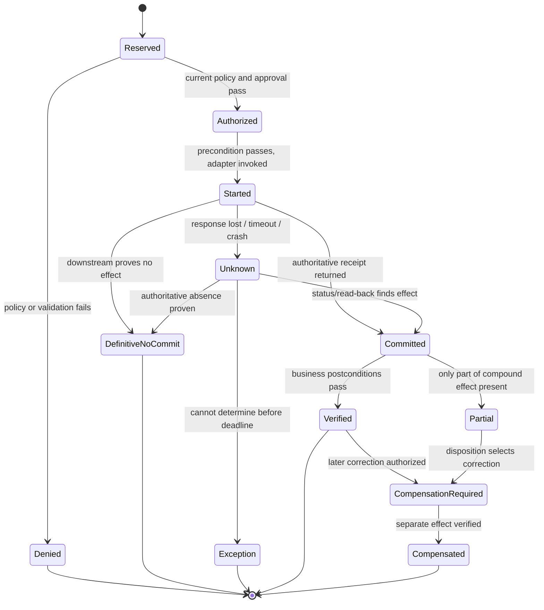
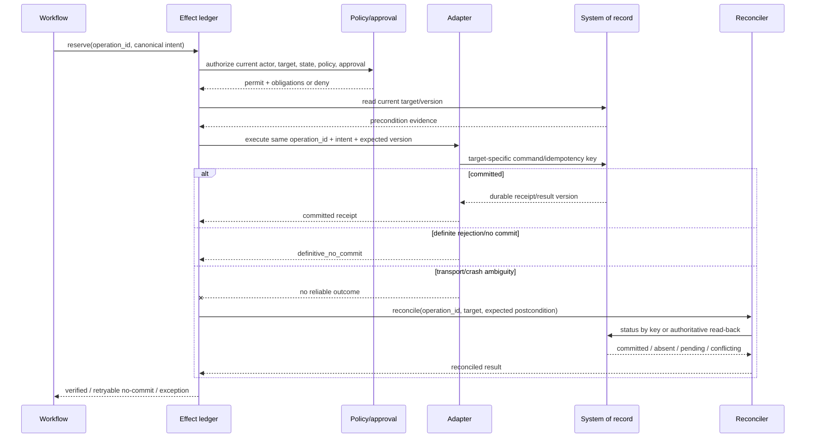
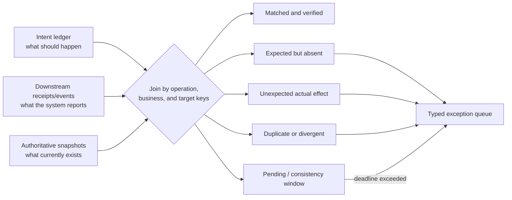

# Tools, Effects, Idempotency, and Reconciliation

> **Purpose:** Ensure one approved business intent produces one bounded, verifiable outcome even under duplicate delivery, concurrency, crashes, and partial multi-system failure.

## Split reads, proposals, and commits

The model can call read-only, purpose-limited tools. It should not receive generic write tools.

| Interface | Caller | Example | Authority |
| --- | --- | --- | --- |
| Evidence read | Context builder/model worker | `get_invoice_snapshot` | Read a scoped, redacted projection |
| Proposal | Model worker | `propose_exception_category` | Create a candidate record only |
| Decision | Workflow/rules service | `decide_invoice_route` | Deterministic transition input |
| Effect reservation | Workflow/effect gateway | `reserve_effect` | Stable operation identity and policy gate |
| Commit | Effect gateway adapter | `set_invoice_hold` | Narrow external mutation |
| Reconcile | Reconciliation worker | `get_operation_status` / read-back | Establish downstream outcome |
| Compensation | Authorized workflow/effect gateway | `reverse_hold_release` | New linked corrective effect |

Avoid `update_record(system, table, id, fields)` and browser macros that can reach arbitrary screens. Prefer semantic commands with typed target, allowed fields, preconditions, and postconditions.

## Effect command contract

```ts
interface EffectCommand<P> {
  operationId: string;              // stable across retries/replay
  tenantId: string;
  caseId: string;
  caseVersion: number;
  effectType: string;
  adapterVersion: string;
  canonicalPayload: P;
  intentHash: string;
  target: {
    system: string;
    resourceType: string;
    resourceId: string;
    expectedVersion?: string;
  };
  authorization: {
    actorId: string;
    subjectActorId?: string;
    policyDecisionId: string;
    approvalId?: string;
    expiresAt: string;
  };
  postconditions: Array<{ path: string; operator: string; expected: unknown }>;
}

type EffectStatus =
  | "reserved"
  | "authorized"
  | "started"
  | "committed"
  | "verified"
  | "definitive_no_commit"
  | "unknown"
  | "partial"
  | "compensation_required"
  | "compensated";
```

Canonicalization must be versioned. Reject reuse of an `operationId` when `intentHash`, tenant, target, or effect type differs.

## Effect state machine



An HTTP success is evidence, not always proof. Some APIs accept asynchronous work; some return before replication; some UI automations lose the final screen. Define the authoritative receipt and read-back per adapter.

## Safe commit sequence



The workflow does not create a new operation ID because a worker, queue message, or provider call retried.

## Ledger and transactional outbox

Illustrative relational core:

```sql
CREATE TABLE effect_ledger (
  tenant_id            text        NOT NULL,
  operation_id         text        NOT NULL,
  case_id              text        NOT NULL,
  effect_type          text        NOT NULL,
  intent_hash          text        NOT NULL,
  canonical_intent     jsonb       NOT NULL,
  target_system        text        NOT NULL,
  target_resource_id   text        NOT NULL,
  expected_version     text,
  status               text        NOT NULL,
  approval_id          text,
  policy_decision_id   text        NOT NULL,
  external_receipt     jsonb,
  result_version       text,
  attempt_count        integer     NOT NULL DEFAULT 0,
  created_at           timestamptz NOT NULL,
  updated_at           timestamptz NOT NULL,
  PRIMARY KEY (tenant_id, operation_id),
  CHECK (status IN (
    'reserved','authorized','started','committed','verified',
    'definitive_no_commit','unknown','partial',
    'compensation_required','compensated','denied'
  ))
);

CREATE TABLE outbox_event (
  event_id       uuid        PRIMARY KEY,
  aggregate_type text       NOT NULL,
  aggregate_id   text       NOT NULL,
  event_type     text       NOT NULL,
  payload        jsonb      NOT NULL,
  created_at     timestamptz NOT NULL
);
```

In one local transaction, update authoritative case/effect state and insert the outbox event. Publication can retry; consumers deduplicate by event ID. This prevents a committed local state change with a lost notification, but it does not make a remote API call atomic with the database.

## Adapter contract inventory

Document every effect adapter:

| Field | Required answer |
| --- | --- |
| Semantic action | Exact business meaning, not HTTP method |
| Target identity | Canonical IDs and tenant/legal-entity scope |
| Preconditions | Expected version, status, balance, destination, or deadline |
| Provider idempotency | Key placement, scope, parameter comparison, retention, concurrent behavior |
| Receipt | ID, status, resulting version, and how long queryable |
| Ambiguity query | Status-by-operation ID, search-by-business key, or deterministic read-back |
| Retry classes | Which errors prove no commit; which remain unknown |
| Compensation | Available correction, authority, lossiness, deadline, and evidence |
| Consistency | Read-after-write behavior and replication lag |
| Rate/concurrency | Limits, serialization key, quota, and backpressure |
| Credentials | Audience, scopes, tenant, lifetime, and revocation |
| Data boundary | Fields sent, region, retention, and logging |

Provider documentation is part of the contract. Stripe, for example, compares parameters for a reused idempotency key and documents retention; do not generalize those semantics to another API.

## Operation-level capability manifest

Qualify each semantic operation, not a connector, tenant, or vendor logo. `read_case` and `close_case` on the same platform have different authority, concurrency, receipt, and recovery contracts.

```yaml
capability:
  manifest_version: "1.0"
  capability_id: servicenow.case.set_internal_hold
  capability_version: 3
  mode: commit                 # read | propose | stage | commit | reconcile | compensate
  semantic_effect: set one internal hold reason on one case
  denied_effects: [close_case, change_requester, add_attachment, send_notification]
  provider:
    product: ServiceNow
    instance_release: zurich
    api: scripted-rest/case-control/v2
  identity:
    target_key: [instance_id, domain_id, table, sys_id]
    business_key: [tenant_id, case_id]
    operation_key_field: u_operation_id
  request:
    schema_digest: "sha256:..."
    canonicalizer_version: hold-intent@2
    max_items: 1
    allowed_fields: [u_hold_reason, u_hold_until]
  concurrency:
    precondition: current_record_version
    behavior_on_stale: definitive_no_commit
  idempotency:
    scope: instance/domain/operation
    same_key_same_intent: return_existing_receipt
    same_key_changed_intent: reject
    retention: P7Y
    enforced_by: application_unique_constraint
  outcomes:
    committed_proof: [sys_id, sys_updated_on, operation_ledger_receipt]
    no_commit_proof: [validated_4xx_before_mutation, stale_precondition]
    ambiguous: [transport_loss_after_dispatch, malformed_success]
    status_query: get_hold_by_operation_id
    postcondition_read: get_case_hold_snapshot
  retries:
    max_attempts: 4
    retry_only: [transient_no_commit, rate_limited_before_dispatch]
  cancellation:
    before_dispatch: revoke_reservation
    after_dispatch: reconcile_then_disposition
  compensation:
    capability_id: servicenow.case.release_internal_hold
    lossiness: may_not_restore_elapsed_sla_time
  authorization:
    principal_mode: delegated
    scopes: [case.hold.write]
    target_bound: true
    credential_ttl: PT5M
    sod_policy: case-hold-sod@4
  data:
    purpose_id: case_control
    fields_sent: [case_id, hold_reason, hold_until]
    region: approved-instance-region
    telemetry_content: references_only
  limits:
    timeout: PT10S
    rate_per_tenant: 20/s
    serialization_key: instance/domain/sys_id
  evidence:
    qualified_at: 2026-08-31
    sandbox_report: qual_servicenow_hold_2026_08
    owner: enterprise-integrations
    expires_at: 2026-11-30
```

The manifest is enforced configuration. Qualification fails when a consequential commit lacks stable target identity, a freshness/precondition mechanism, distinguishable no-commit versus unknown outcomes, authoritative read-back, scoped credentials, bounded data, a safe concurrency model, and an owned reconciliation path. “The SDK retried” is not evidence.

## Provider qualification examples

The products below illustrate evidence to collect; they are not endorsements or portable guarantees. Documentation was accessed 2026-08-31. Pin the tenant's actual release/API/plan and rerun the gate because entitlements and configuration change behavior.

| Surface and researched version | Documented mechanism | What the operation manifest must still prove |
| --- | --- | --- |
| **ServiceNow REST/Table API, Zurich; Scripted REST API versioning** | Versioned URIs, `sys_id` record access, calling-user roles and ACL enforcement; custom resources can be explicitly versioned | Prefer a narrow Scripted REST resource over ambient table CRUD for commits. Prove domain/tenant ACLs, allowed fields, operation-ID uniqueness, record freshness, business-rule side effects, audit actor, no-commit errors, ambiguous timeout read-back, rate limits, and upgrade fixtures. The public Table API description does not establish a universal idempotency-key contract. |
| **Salesforce REST API v67.0** | sObject identity, rows by external ID/upsert, versioned resource paths, object/field security; Composite supports up to 25 subrequests and configurable rollback within the request | Prove uniqueness/reuse of the external ID, exact API user and field permissions, stale-write control or explicit reread, trigger/Flow side effects, API-limit behavior, result read-back, and duplicate defense. `allOrNone` applies to that Salesforce composite transaction, not another SaaS/ERP system. |
| **SAP S/4HANA Cloud Public Edition 2608 Sales Order OData V4 example** | That documented API uses entity keys and requires `If-Match`/ETags for updates, returning stale/missing-precondition failures | Qualify the exact S/4 API and communication arrangement; do not generalize this ETag behavior across SAP or ERP operations. Prove business key, ETag scope, synchronous/asynchronous commit semantics, messages, side effects, receipt/read-back, authorizations, and correction rules. |
| **Amazon Textract asynchronous APIs** | `ClientRequestToken` deduplicates identical starts for seven days and rejects changed parameters; `JobId`, SNS/SQS completion, paged result retrieval, documented default seven-day result storage | Bind token to document digest/model/options, validate notification source, deduplicate notifications, retrieve all pages, handle quota/throttle and partial pages, persist governed results before provider expiry, and treat confidence as extraction evidence rather than business authority. |
| **Azure AI Document Intelligence v4.0 (`2024-11-30` GA)** | Versioned asynchronous analyze operations use an operation location/result ID; model IDs and field/word confidence are returned where supported | Pin API/model ID, source digest, region, encryption/access, result retention, status/pagination, retry identity, throttling, supported confidence fields, and human validation thresholds. A `202` or confidence score is not a completed business fact. |
| **DocuSign eSignature REST API v2.1 and Connect** | Envelope IDs/status queries and envelope/account webhooks; official guidance notes that rapid transitions may skip intermediate notifications | Bind exact document digests, recipients, routing, account, and purpose before envelope creation. Prove duplicate-create protection, webhook authentication, event dedup/order tolerance, correction/void/delegation behavior, authoritative envelope/status/document retrieval, certificate retention, and plan entitlements. Never infer completion from one callback or email. |
| **Amazon SQS Standard/FIFO** | Standard delivery is at least once; visibility timeout and DLQ control retries. FIFO producer deduplication is time-bounded (documented five-minute interval) and orders within a message group | Message ID is transport identity, not case/effect identity. Prove consumer idempotency, visibility extension/heartbeat, poison handling, DLQ redrive, retention, encryption, tenant policy, per-key ordering, backlog quotas, and recovery after the dedupe window. Do not claim exactly-once business effects. |
| **Twilio Programmable Messaging** | Message SID and lifecycle statuses; status callbacks are asynchronous, parameters can evolve, and callbacks may arrive out of order | Treat `accepted`/`queued`/`sent` separately from delivery. Prove exact recipient/channel/content approval, duplicate-send prevention, callback signature and deduplication, status read-back, validity period, opt-out/compliance behavior, PII retention, channel-specific receipts, and unknown-send reconciliation. Send irreversible communications after the business pivot where possible. |

### Qualification evidence packet

For every manifest retain provider-document version/access date, API/SDK schema, tenant configuration export, sandbox and negative fixtures, authentication/authorization test, rate/quota results, duplicate/concurrent calls, crash-before/after-dispatch traces, response-loss result, callback signature/reorder tests, reconciliation query, compensation/forward-fix drill, data-flow review, owner, expiry, and requalification triggers. Sandbox success alone does not qualify production: plan, region, extensions, workflows/triggers, master data, and permissions can differ.

## Error taxonomy

| Adapter result | Meaning | Runtime action |
| --- | --- | --- |
| `committed` | Durable receipt proves requested effect | Persist receipt; verify postconditions |
| `already_committed` | Same operation and intent already completed | Reuse receipt; verify |
| `invalid` | No execution began; request violates schema/business validation | Correct proposal; no retry unchanged |
| `stale_precondition` | Target changed before commit | Refresh, invalidate approval if material, and re-decide |
| `denied` | Current authorization/policy rejects | Stop; expose safe reason/escalation |
| `transient_no_commit` | Provider proves nothing committed | Retry same operation ID within budget |
| `accepted_pending` | Remote job accepted, not complete | Poll/callback with durable deadline |
| `unknown` | Commit may have happened | Reconcile; never blind retry |
| `partial` | Some intended sub-effects committed | Freeze, record each receipt, obtain disposition |
| `malformed_response` | Response cannot establish semantics | Treat as unknown if request crossed commit boundary |

Do not let the model decide whether a transport error is retryable.

## Multi-system business operation

No general transaction spans unrelated SaaS/legacy systems. Choose the simplest valid consistency strategy:

| Strategy | Use when | Trade-off |
| --- | --- | --- |
| Single authoritative write; other systems consume events | One system can own truth | Best default; projections converge later |
| Local transaction | State/effect is in one database boundary | Strongest and simplest when available |
| Orchestrated saga | Several local commits and compensations form one business process | Explicit partial states and application-specific compensation |
| Forward recovery | Committed steps should remain; finish missing steps | Often better for fulfillment/accounting processes |
| Compensating transaction | Prior effects can be semantically reversed | Not rollback; may cost money, notify people, or fail |
| Manual reconciliation | Ambiguous/high-risk/legacy effects lack safe automation | Slower but honest; needs evidence and staffing |
| Distributed transaction | All participants support a suitable transaction protocol and latency/availability fit | Rare across third-party systems; operational coupling |

Order steps so validations and reversible reservations occur before irreversible communication, posting, transfer, or filing. Identify the pivot/no-return point. Compensation must respect concurrent changes; restoring an old snapshot can overwrite legitimate work.

### Compound-effect example

For an approved refund:

1. create refund intent in the case ledger;
2. reserve the accounting correction;
3. initiate payment-provider refund with `operationId`;
4. reconcile provider receipt and settlement state;
5. post the accounting entry with its own linked operation ID;
6. verify refund and ledger relationship;
7. send customer notice last, using a separate communication operation ID.

If step 5 fails after step 4 commits, the correct response may be forward recovery, not refund cancellation. Domain owners define this disposition before launch.

## Reconciliation design

Reconciliation compares three planes:



### Reconciliation invariants

- every committed intent has exactly the expected downstream business effect within its time window;
- no downstream effect exists without a recognized authorized intent;
- amount, currency, target, version, and status match—not only record count;
- duplicate provider records and reused business keys are surfaced;
- expected propagation lag is distinct from unresolved discrepancy;
- reconciliation cursors and source snapshots have provenance and completeness checks;
- corrections create linked effects and never delete the original mismatch evidence.

### Frequency

Use immediate read-after-write verification where supported, event-based confirmation for asynchronous jobs, periodic full or incremental reconciliation, and an independently scheduled control total for high-risk domains. The same bug should not generate both the write and the only reconciliation evidence unchecked.

## Cancellation and late effects

Cancellation stops new scheduling but cannot make a committed external effect disappear.

1. mark cancellation requested and revoke the case/effect fence;
2. stop undispatched steps and signal active workers;
3. reconcile any in-flight operation IDs;
4. if committed, preserve receipt and decide whether compensation is appropriate;
5. if unknown, remain blocked until resolved or explicitly accepted by an authorized operator;
6. close only when all required business postconditions are known.

## Failure-injection suite

- Crash after downstream commit but before receipt persistence.
- Drop the success response while the downstream effect succeeds.
- Deliver the same work item and approval callback concurrently.
- Reuse an operation ID with changed amount, target, or tenant.
- Expire downstream idempotency retention before a late replay.
- Change target version between approval and commit.
- Return `2xx` with a malformed or wrong receipt.
- Delay read-after-write visibility beyond the normal window.
- Commit one branch of a multi-system operation and fail another.
- Fail compensation after the original effect committed.
- Cancel immediately before, during, and after commit.
- Reassign the case while an old worker still holds credentials.
- Lose outbox publication and then recover it twice.
- Inject an unexpected downstream record without an intent.

Assert authoritative business state, number of semantic effects, ledger status, evidence, and operator route—not just HTTP responses.

## Checklist

- [ ] Tools are narrow semantic reads/proposals/commands, not generic application access.
- [ ] Stable operation IDs originate before attempts and survive retry/replay.
- [ ] Operation ID reuse with changed intent is rejected.
- [ ] Commit-time policy, approval, target version, and fence are revalidated.
- [ ] Adapter idempotency, receipt, ambiguity, retention, and consistency semantics are documented.
- [ ] `unknown` and `partial` are first-class states with owned reconciliation.
- [ ] Case/effect transition plus outbox event commit atomically where local.
- [ ] Compensation is domain-specific, idempotent, authorized, and linked.
- [ ] Reconciliation finds missing, unexpected, duplicate, divergent, and pending effects.
- [ ] Cancellation and stale-worker races are tested at the downstream boundary.

## Sources and related guides

- [AWS Builders' Library: Making retries safe with idempotent APIs](https://aws.amazon.com/builders-library/making-retries-safe-with-idempotent-APIs/)
- [Stripe idempotent requests](https://docs.stripe.com/api/idempotent_requests)
- [Debezium outbox event router](https://debezium.io/documentation/reference/stable/transformations/outbox-event-router.html)
- [Azure saga pattern](https://learn.microsoft.com/en-us/azure/architecture/patterns/saga)
- [Azure compensating transaction pattern](https://learn.microsoft.com/en-us/azure/architecture/patterns/compensating-transaction)
- [Amazon SQS at-least-once delivery](https://docs.aws.amazon.com/AWSSimpleQueueService/latest/SQSDeveloperGuide/standard-queues-at-least-once-delivery.html)
- [ServiceNow Zurich Table API](https://www.servicenow.com/docs/r/zurich/api-reference/rest-apis/c_TableAPI.html)
- [ServiceNow REST API versioning and security](https://www.servicenow.com/docs/r/api-reference/rest-api-explorer/c_RESTAPI.html)
- [Salesforce REST Composite resource](https://developer.salesforce.com/docs/atlas.en-us.api_rest.meta/api_rest/resources_composite_composite_post.htm)
- [Salesforce integration patterns](https://developer.salesforce.com/docs/atlas.en-us.integration_patterns_and_practices.meta/integ_pat_tempate.htm)
- [SAP S/4HANA Cloud Sales Order OData V4 operations](https://help.sap.com/docs/SAP_S4HANA_CLOUD/03c04db2a7434731b7fe21dca77440da/b7db7f7b302643d0a4e56fdfbfa6e5db.html)
- [Amazon Textract asynchronous operations](https://docs.aws.amazon.com/textract/latest/dg/api-async.html)
- [Azure AI Document Intelligence version support](https://learn.microsoft.com/en-us/azure/ai-services/document-intelligence/overview?view=doc-intel-4.0.0)
- [DocuSign Connect webhook guidance](https://www.docusign.com/blog/developers/dsdev-adding-webhooks-application)
- [Amazon SQS visibility timeout](https://docs.aws.amazon.com/AWSSimpleQueueService/latest/SQSDeveloperGuide/sqs-visibility-timeout.html)
- [Twilio outbound message status callbacks](https://www.twilio.com/docs/messaging/guides/outbound-message-status-in-status-callbacks)
- [Idempotency and side-effect safety](../../reliability/idempotency-and-side-effects.md)
- [Runtime failure taxonomy](../../reliability/failure-taxonomy.md)
