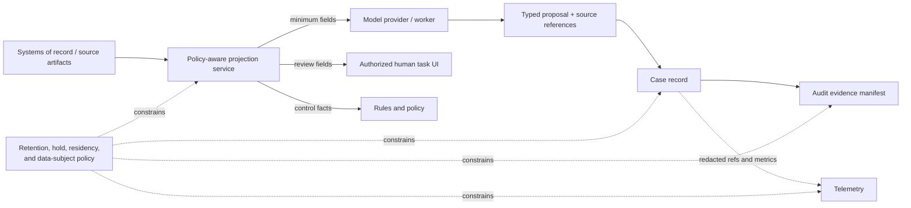

# Data, Privacy, Compliance, and Audit Evidence

> **Purpose:** Limit data use by purpose and authority, keep untrusted content from controlling the system, and produce evidence that can reconstruct a decision without creating an uncontrolled data lake.

## Begin with a domain control matrix

This blueprint is not legal advice. Before implementation, accountable privacy, legal, compliance, records, security, and business owners map each case type and jurisdiction:

| Question | Required owner/output |
| --- | --- |
| What is the lawful/authorized purpose? | Purpose ID and accountable business/privacy owner |
| Which people and data categories are affected? | Data inventory and classification |
| Which automated decisions may have material effects? | Decision inventory, autonomy ceiling, review/appeal obligations |
| What information may each component/provider receive? | Field-level purpose and egress policy |
| Where may data be processed/stored? | Residency and transfer policy |
| How long must each record be retained or deleted? | Retention schedule, legal-hold and deletion rules |
| Which controls and evidence are mandatory? | Control objective, owner, frequency, test, evidence manifest |
| Who can contest or correct an outcome? | Notice, review, appeal, rectification, and response workflow |
| Which third parties participate? | Processor/service inventory, contract, incident, and exit obligations |

Do not encode unsettled legal interpretation in a prompt. Put approved rules and obligations in versioned policy/configuration with named owners.

## Purpose-limited data flow



The model sees a task-specific projection, not the full case or enterprise search index.

## Authorization context

Every data read and effect carries:

```yaml
authorization_context:
  tenant_id: tenant_uk01
  subject_actor_id: user_123
  service_actor_id: backoffice-judgment-worker
  purpose_id: invoice_exception_resolution
  case_id: case_7H2
  task_id: extract_invoice_fields
  allowed_data_classes: [invoice_operational, supplier_business_contact]
  denied_data_classes: [employee_health, payment_card_full, unrelated_case_notes]
  allowed_sources: [invoice_artifacts, vendor_master_projection]
  policy_version: data-access@2026.08.5
  expires_at: 2026-08-31T09:20:00Z
```

The tool gateway derives scope from trusted case/identity state. It does not accept tenant, purpose, or record permissions from model-generated arguments.

## Data lifecycle matrix

| Data class | Example | Model access | Audit copy | Diagnostic telemetry | Retention principle |
| --- | --- | --- | --- | --- | --- |
| Source artifact | Invoice, claim form, email attachment | Task/purpose-specific excerpt or protected fetch | Immutable reference/digest; copy only if required | Off by default | Business/records schedule and legal hold |
| Authoritative fact | Canonical supplier ID, approved amount | Only needed fields | Yes, with source/version | IDs only where safe | Match case/control obligation |
| Derived proposal | Extracted label, summary, confidence | Produced by model | Yes when material | Redacted sample under controlled access | Enough for correction/evaluation; not indefinite by default |
| Rule/policy evidence | Matched rule, policy decision | Usually no raw policy data | Version/digest/result/obligations | Decision ID and latency | Control and audit schedule |
| Approval/effect receipt | Actor, intent, result, target | No need for model | Yes, protected and unsampled | References and outcome code | Transaction/control schedule |
| Prompt/model artifact | Task instructions, provider response | Runtime | Version plus minimal material output | Content opt-in only | Short, risk-based unless required for dispute |
| Evaluation label | Human correction or adjudication | Offline authorized use | Linked methodology/version | Aggregate metrics | Dataset governance and reuse purpose |

Retention is not “keep everything for audit.” Data minimization, storage limitation, accuracy, records duties, legal hold, model-quality needs, and security risk can conflict. Resolve them per data class and jurisdiction.

## Untrusted content boundary

Invoices, PDFs, emails, tickets, spreadsheet cells, OCR text, comments, and web pages may contain adversarial or accidental instructions. Controls:

- keep system/task instructions separate from source content;
- mark source provenance and trust class in the model input;
- expose only read tools needed for the judgment task;
- never turn a URL, script, macro, attachment, or command from a document into execution;
- validate all output against a closed schema and allowed labels;
- require independent entity resolution and business rules;
- scan and isolate files before rendering/parsing;
- disable active content and external resource fetches by default;
- treat retrieved policy text as evidence, not executable policy;
- prevent content from selecting a tenant, credential, destination, or approval path;
- red-team direct and indirect prompt injection through every supported artifact type.

Input filtering helps, but the durable protection is limiting what compromised model reasoning can read, propose, and reach.

## Tenant, secret, and software-supply-chain boundaries

| Boundary | Enforced design | Required negative evidence |
| --- | --- | --- |
| Tenant isolation | Derive tenant/legal entity from authenticated actor and case; include it in every primary/unique key, authorization decision, queue route, artifact path, cache key, encryption context, effect ledger key, and reconciliation query. Never trust a model/tool argument to select it. | Cross-tenant IDs, search timing/existence leakage, cache confusion, batch with one foreign target, queue replay under wrong tenant, restore/export mix, and operator bulk access all deny or isolate correctly |
| Secrets | The model and context builder receive no API keys, refresh tokens, certificates, signing keys, or vault paths. The gateway exchanges/mints a short-lived, audience/target/tenant/effect-bound credential only after policy; workers cannot export it and telemetry redacts it. | Prompt/tool/result exfiltration, crash dump, retry after expiry, revoked delegate, wrong audience, compromised worker, and rotation during an in-flight effect cannot broaden or preserve access |
| Build/runtime supply chain | Pin and verify application image, workflow/rule/policy/prompt/tool schemas, model routing, parser/OCR, adapter, base image, and dependencies in the behavior bundle. Require protected review, artifact provenance/signature, SBOM/vulnerability/license policy, secret scanning, isolated build, and reproducible/attested promotion where feasible. | Tampered prompt or tool schema, dependency substitution, unsigned connector, malicious document parser, stale vulnerable image, compromised registry, and rollback to an unapproved bundle are blocked or detected |
| Provider/connector administration | Separate connection administrators, policy owners, release approvers, credential custodians, audit administrators, and business approvers as required. Inventory subprocessors, OAuth apps, webhook endpoints, marketplace packages, and outbound destinations. | One role cannot silently install a connector, widen scopes, suppress evidence, and approve its own effect; orphaned apps/tokens and changed webhook destinations are detected |

NIST SP 800-218 supplies a secure-development baseline, and SP 800-53 includes software acquisition and supply-chain control families. They do not certify a particular model, connector, or package. Apply the organization's selected controls and keep third-party packages outside production authority until their code/artifacts, permissions, update channel, data behavior, and rollback have been qualified.

## Provider and model boundary

Before sending production data to any model service, verify and contractually record:

- exact service/product and deployment region;
- data retention and deletion behavior;
- whether prompts/outputs can be used for training or service improvement;
- subprocessors and cross-border transfers;
- encryption and tenant isolation;
- administrative/support access;
- abuse monitoring and content logging;
- incident notification and evidence availability;
- availability, rate limits, and exit/export process;
- model/version pinning or change-notification behavior.

Do not infer these from consumer-product terms. Recheck when provider, endpoint, account tier, region, or model changes.

## Automated decisions and human rights

Some jurisdictions and domains impose restrictions or safeguards for solely automated decisions with legal or similarly significant effects. GDPR Article 22, for example, contains a right not to be subject to certain solely automated decisions and identifies human-intervention, expression-of-view, and contest safeguards in specified cases. The EU AI Act imposes human-oversight and logging requirements for systems within its high-risk scope. Applicability is a legal determination.

Engineering implications even where those provisions do not apply:

- inventory decisions separately from workflow tasks;
- identify whether human participation can actually influence the outcome;
- give reviewers evidence, competence, time, authority, and alternatives;
- give affected people a correction/appeal route where appropriate;
- preserve the decision basis and versions without exposing sensitive internal data;
- measure override, appeal, reversal, subgroup, and harm outcomes;
- prevent disadvantage merely because someone requests human review where law/policy requires it.

A human who routinely accepts a recommendation without considering evidence may not provide meaningful oversight.

## Audit evidence architecture

Keep the business ledger, evidence plane, and diagnostic plane distinct:

| Plane | Purpose | Reliability/access | Forbidden dependency |
| --- | --- | --- | --- |
| Business record/audit ledger | Own current case, work, decision, approval, effect, accounting/record state, and corrections | Transactional/versioned, domain-authorized, recoverable, reconciled to systems of record | Execution must not be reconstructed from sampled traces or narrative summaries |
| Control evidence plane | Reconstruct which source versions, rules, policies, actors, controls, approvals, effects, and reconciliations produced a business transition | Unsampled for required evidence, integrity-protected, strict access/retention, independently exportable and gap-monitored | Evidence manifests cannot mutate business state or invent missing business receipts |
| Diagnostic telemetry | Debug latency, retries, model/tool behavior, cost, capacity, and quality | May be sampled/dropped; redacted; shorter independent retention; content opt-in | Trace/log availability cannot authorize, deduplicate, resume, or prove business completion |

An auditor may inspect evidence about the business ledger, but “the logs show it” is not a replacement for the authoritative record or downstream receipt. Conversely, deleting sampled telemetry must not delete required business/control evidence.

### Evidence manifest

```json
{
  "bundle_id": "aud_4P2",
  "case_id": "case_7H2",
  "case_type": "supplier_bank_detail_change",
  "terminal_outcome": "change_applied_and_reconciled",
  "manifest_version": "1.0",
  "created_at": "2026-08-31T10:21:04Z",
  "records": [
    { "type": "entry_event", "id": "evt_...", "digest": "sha256:..." },
    { "type": "source_artifact", "id": "art_...", "digest": "sha256:..." },
    { "type": "derived_proposal", "id": "prop_...", "digest": "sha256:..." },
    { "type": "rule_decision", "id": "dec_...", "version": "bank-rules@2026.08.2" },
    { "type": "policy_decision", "id": "pdp_...", "version": "bank-change-policy@2026.08.2" },
    { "type": "approval", "id": "apr_...", "intent_hash": "sha256:..." },
    { "type": "effect_receipt", "id": "op_...", "external_id": "vendor-master/receipt/991" },
    { "type": "reconciliation", "id": "rec_...", "result": "matched" }
  ],
  "access_policy": "audit-bank-change@3",
  "retention_class": "financial-master-change",
  "legal_hold_ids": []
}
```

The manifest links records rather than copying all content. W3C PROV's entity/activity/agent concepts are useful for portable provenance, but a provenance graph is not automatically complete, authentic, confidential, or admissible; those are application and governance requirements.

### Audit content

Following the shape of NIST AU-3, evidence should establish what occurred, when and where, source, outcome, and associated actors/entities. For model-assisted decisions also preserve:

- task, prompt, model/provider, tool-schema, validator, and routing versions;
- purpose-limited input manifest and digests;
- typed material output, evidence locators, conflicts, and abstention;
- deterministic rule and policy results;
- human decision and review context;
- effect intent, precondition, receipt, verification, and corrections.

Do not claim a hash alone makes a log immutable. Protect audit information from unauthorized access/modification, control administrators, synchronize time, back up/replicate, monitor gaps, and test restore. External timestamping such as RFC 3161 can strengthen proof that a digest existed by a time; it does not prove the underlying record was true or complete.

## Evidence access and redaction

- separate case-worker, engineering, security, compliance, auditor, and data-subject views;
- authorize by purpose and record class, not a broad “auditor” role alone;
- record audit-evidence reads and exports;
- use redacted/export views without changing the underlying protected record;
- prevent identifiers or sensitive values in `traceparent`/`tracestate`;
- require step-up authorization for bulk export;
- watermark or sign controlled exports where appropriate;
- apply legal hold without silently disabling other deletion obligations;
- prove deletion across primary, replicas, caches, evaluation sets, artifacts, and provider copies within the actual contract boundary.

## Model improvement boundary

Operator corrections are valuable labels, but reuse is a new purpose decision. Before adding production cases to an evaluation or training set:

- confirm purpose and authorization;
- minimize/de-identify where possible and assess re-identification risk;
- preserve sampling method and avoid only learning from escalated cases;
- separate adjudicated truth from a single reviewer opinion;
- version the dataset and prevent train/test leakage;
- restrict access and retention;
- record opt-out, deletion, and legal-hold behavior;
- prohibit model output from becoming a self-confirming label without independent review.

## Privacy and compliance failure tests

- Cross-tenant case ID is supplied to every read and approval endpoint.
- A model requests a field outside the task's purpose policy.
- An invoice contains instructions to send data to an external address.
- Prompt/tool/result content capture is enabled accidentally in telemetry.
- A deleted source remains in a cache, evaluation set, or provider log.
- Legal hold conflicts with normal deletion and both paths are audited.
- An affected person corrects a source fact after a decision.
- A reviewer lacks source access and approves from summary alone.
- A bulk audit export crosses its region or contains unrelated cases.
- Provider changes retention/subprocessor/model terms.
- Protected attributes are absent from the model input but inferable through proxies; measure outcome disparity.
- Audit-store administrator attempts to modify or suppress a record.

## Checklist

- [ ] Each case type has purpose, population, jurisdiction, data, decision, retention, and appeal owners.
- [ ] Field-level projection policy controls model, reviewer, rules, telemetry, and provider access.
- [ ] Source content cannot choose instructions, credentials, tools, tenant, or destination.
- [ ] Provider data-use, retention, region, subprocessors, and model-change behavior are verified.
- [ ] Material automated decisions have an approved human-oversight and contest design.
- [ ] Authoritative audit evidence is distinct from diagnostic telemetry.
- [ ] Evidence manifests link source, proposal, rule, policy, approval, effect, and reconciliation.
- [ ] Audit integrity, access, time, backup, restore, export, and gap detection are tested.
- [ ] Retention and deletion cover caches, replicas, artifacts, telemetry, evaluation data, and providers.
- [ ] Production corrections are not reused for model development without separate governance.

## Primary sources and related guides

- [GDPR principles and Article 22](https://eur-lex.europa.eu/eli/reg/2016/679/2016-05-04)
- [EU AI Act](https://eur-lex.europa.eu/eli/reg/2024/1689/oj)
- [NIST Privacy Framework](https://www.nist.gov/privacy-framework)
- [NIST SP 800-53 Rev. 5, Release 5.2.0](https://csrc.nist.gov/pubs/sp/800/53/r5/upd1/final)
- [NIST SP 800-218 Secure Software Development Framework](https://csrc.nist.gov/pubs/sp/800/218/final)
- [NIST SP 800-92 log management](https://csrc.nist.gov/pubs/sp/800/92/final)
- [W3C PROV overview](https://www.w3.org/TR/prov-overview/)
- [W3C Trace Context privacy considerations](https://www.w3.org/TR/trace-context/#privacy)
- [RFC 3161 time-stamp protocol](https://www.rfc-editor.org/rfc/rfc3161.html)
- [OWASP Top 10 for Agentic Applications 2026](https://genai.owasp.org/resource/owasp-top-10-for-agentic-applications-for-2026/)
- [Prompt injection and untrusted data](../../security/prompt-injection-and-untrusted-data.md)
