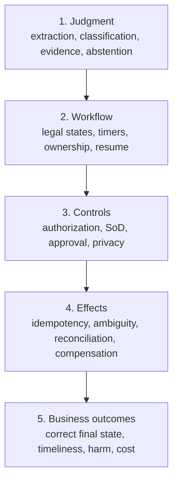

# Observability, Evaluation, and Failure Injection

> **Purpose:** Measure business outcomes, model judgment, workflow reliability, control integrity, and recovery separately so an average accuracy score cannot hide unsafe operation.

## Five evaluation planes



All five must pass. A model can be accurate while the workflow duplicates payments; the workflow can be reliable while it enforces a wrong rule; throughput can improve while exceptions and appeals become worse.

## Evaluation families and hard gates

| Family | Unit and measures | Gate design |
| --- | --- | --- |
| **Judgment evaluation** | One proposal: field/class accuracy, evidence support, conflict/novelty detection, calibration, abstention/selective risk, robustness, supported slices | Per task × label/field × consequence band; unsupported consequential fact or prohibited data access is a hard failure |
| **Trajectory evaluation** | One case execution: legal state/command sequence, permitted reads, bounded retries, waits, handoffs, approval before commit, stop/cancel behavior, and final evidence | Compare semantic events and partial-order constraints, not hidden reasoning or one exact benign path; flag unnecessary tool calls, loops, stale-state action, and unsafe recovery |
| **Invariant evaluation** | Every reachable state: tenant isolation, one terminal outcome, no stale-owner commit, exact approval binding, SoD, operation-ID integrity, no completion with unresolved required effects | Property/state-machine tests plus fault injection; zero bypass tolerance and counterexample retained with bundle versions |
| **Effect/recovery evaluation** | One operation/compound transaction: semantic duplicate count, unknown/partial resolution, reconciliation completeness/latency, compensation/forward-recovery correctness | Provider sandbox plus deterministic fault proxy and authoritative snapshot; no blind retry and no lost receipt |
| **Outcome evaluation** | End-to-end case: correct terminal business state, timeliness, financial/customer harm, appeal/reversal, downstream correction, recurrence, and total correct-case cost | Compare to deterministic/manual baseline by population and consequence; delayed outcomes join by stable decision/effect IDs |
| **Human-factor evaluation** | Reviewer/operator: decision quality with/without aid, evidence opened, correction and escalation quality, automation bias, handling time distribution, cognitive/workload score, trust calibration, accessibility, and recovery toil | Randomized or counterbalanced study where practical; sample auto-completed work; block when speed gains reduce independent review or overload queues |

Do not average these into one score. A candidate with better judgment accuracy but a new tenant leak, approval bypass, or unresolved-effect regression is rejected. Human-factor studies must avoid making the candidate identity obvious where blinding is practical and must report learning/order effects and reviewer expertise.

## Operational observability

### Correlation vocabulary

Include stable references—not sensitive payloads—in logs/traces where permitted:

```text
tenant_id (controlled low-cardinality projection where safe)
case_type, case_id_ref, case_version
workflow_definition_version, rule_set_version, policy_version
judgment_run_id, proposal_id, model_routing_profile, prompt_version
approval_id_ref, operation_id_ref, adapter_version
event_id, causation_id, correlation_id, trace_id
queue_name, attempt_id, worker_build
```

Trace IDs are diagnostic correlation only. They do not authorize, deduplicate, order, or recover work. W3C Trace Context prohibits PII or sensitive data in `traceparent` and `tracestate`.

### Metrics by layer

| Layer | Useful measures |
| --- | --- |
| Intake | accepted/rejected/duplicate rate, source lag, schema failure, authentication denial |
| Case lifecycle | cases by state/age, deadline-at-risk, reopen/cancel rate, ownership conflicts, stale transition rejects |
| Judgment | per-task latency/cost, schema-valid rate, abstention, evidence-support rate, class distribution, correction rate |
| Rules/policy | decision counts/reasons, no-match/error, policy deny/approval rate, version distribution |
| Human work | queue depth/age, time to decision, evidence request, reassignment, override, sampled review quality |
| Effects | reserved/started/unknown/partial/verified, duplicate suppression, precondition conflict, commit/verify latency |
| Reconciliation | unmatched counts/value, discrepancy age, unexpected actual effects, repair/compensation backlog |
| Business | correct terminal outcome, end-to-end time, SLA/SLO breach, complaint/appeal/reversal, financial exposure |
| Capacity/cost | cases and model tokens per class, worker saturation, queue wait, provider throttling, cost per correct case |

Never use `confidence` as a high-cardinality metric label. Store it in controlled evaluation records or histogram buckets.

## Service-level objectives

Define objectives from case-owner and affected-user outcomes, then derive technical indicators.

| SLI | Example definition | Why it matters |
| --- | --- | --- |
| Case durability | Accepted entry events with a recoverable case record within 60 seconds | No work disappears |
| Deadline handling | Cases completed or explicitly escalated before due time | Waiting is a product behavior |
| Decision correctness | Adjudicated cases with correct route and material fields | Model/rules quality |
| Control integrity | Consequential commits with valid current authorization, SoD, approval, and preconditions | Safety invariant; target may be zero bypasses |
| Effect verification | Started effects reaching verified or owned exception before risk-specific deadline | Exposes unknown outcomes |
| Reconciliation health | High-risk discrepancies below maximum count/value/age | Detects silent cross-system divergence |
| Human queue | Priority cases assigned to eligible reviewer within threshold | Prevents automation from exporting overload |
| Manual fallback | Cases processable while model provider is unavailable | Business continuity |

Do not set every target to 100%. Some invariants, such as cross-tenant access or unauthorized effects, have zero tolerance; availability and latency need negotiated error budgets. Alert on risk-weighted backlog and SLO burn, not every isolated model error.

### Example measurable SLO sheet

These numbers illustrate specification form, not universal targets:

| Objective/window | Indicator and target | Error-budget action |
| --- | --- | --- |
| Intake durability / 30 days | `>= 99.99%` of authenticated accepted entries have a queryable case/event within 60 seconds; no acknowledged entry is unrecoverable | Stop authority promotion; page if loss/gap is suspected |
| Priority deadline / 28 days | `>= 99.5%` complete or enter an owned escalation before the business-calendar due time | Reserve human capacity and shed/defer low-priority model work |
| Consequential control / continuous | `100%` of sampled and ledger-joined commits have current authorization, SoD, exact approval, fence, and precondition | One confirmed bypass activates the authority-cell kill switch and incident process |
| High-risk unknown effect / rolling 7 days | `99%` resolved or assigned to an accountable exception within 15 minutes; maximum age 60 minutes | Stop same-target/effect dispatch as the age/value budget approaches limit |
| Reconciliation / daily | `100%` of high-risk committed intents and unexpected downstream records included in a completeness-checked run; discrepancies under approved count/value/age | Hold case completion and increase reconciliation/manual capacity |
| Human assignment / weekly | `95%` of urgent tasks claimed by an eligible reviewer within 10 minutes; no task silently expires | Escalate staffing and demote assisted/autonomous intake before unsafe backlog |
| Model fallback / quarterly drill | Priority cases remain processable for a four-hour provider outage within deadline policy | Do not promote authority until the exercise passes with measured operator load |

Every SLI specifies numerator, denominator, exclusions, late-data correction, source system, completeness check, owner, and response. Zero-volume windows and manually accepted exceptions remain visible rather than improving the percentage silently.

## Evaluation corpus

Build a versioned corpus from:

- representative historical cases sampled across time, source, language, tenant, amount, and outcome;
- rare high-consequence and known production failures;
- missing, conflicting, stale, corrupted, duplicated, and adversarial evidence;
- rule boundaries and all approval/SoD combinations;
- new suppliers/entities, templates, and policy variants that test novelty;
- simulated downstream failures and consistency delays;
- human-authored counterexamples designed to expose shortcuts;
- synthetic data only where realism and privacy properties are validated.

Split by business entity/time/template to reduce leakage. Preserve a locked release set and a continuously refreshed monitoring set. Record label provenance, adjudication method, disagreements, and unresolved ambiguity.

## Judgment scorecard

Avoid one aggregate score.

| Dimension | Measures | Release rule |
| --- | --- | --- |
| Field extraction | Exact/normalized match, tolerances, missing-field accuracy | Per field and consequence class |
| Classification | Precision, recall, confusion matrix, class coverage | Separate false-positive/negative limits |
| Evidence | Material claims with valid source locator; unsupported claim rate | Unsupported consequential facts block acceptance |
| Conflict detection | Recall on contradictory sources | High-risk conflicts route to people |
| Abstention | Selective accuracy, coverage, risk at coverage | Threshold set from harm and queue capacity |
| Calibration | Reliability by class/source/population | Used for routing only after stable validation |
| Robustness | Paraphrase/layout/language/OCR/template drift | No material collapse in supported slices |
| Security | Prompt-injection/tool-misuse success rate | No control or data-boundary bypass |
| Human utility | Correction time, evidence-open rate, reviewer agreement | Must improve total work, not only model latency |

### Evaluation case format

```yaml
case_id: eval_invoice_conflict_017
workflow_version: invoice-exception@9
input_artifacts:
  - fixture: invoice_a.pdf
  - fixture: purchase_order_b.json
expected:
  judgment:
    label: conflict
    required_conflicts:
      - left: invoice.currency
        right: purchase_order.currency
    forbidden_facts: [approved_amount]
  workflow_terminal: exception
  forbidden_effects: [release_payment, update_invoice_amount]
  audit_records:
    - proposal
    - evidence_manifest
    - exception_created
assertions:
  - no_cross_tenant_reads
  - source_locators_resolve
  - no_raw_document_content_in_telemetry
```

Grade authoritative state/events/effects and evidence, not prose similarity or an exact hidden trajectory.

## Workflow and control evaluation

Model-free tests should cover:

- every legal and illegal state transition;
- duplicate/out-of-order events and concurrent ownership;
- durable timers, time zones, business calendars, escalation, expiry, and cancellation;
- active-case behavior across workflow/rule/policy upgrades;
- SoD across identity aliases, delegation, reassignment, and break glass;
- exact approval binding and commit-time invalidation;
- tenant/purpose/record field authorization;
- correction, appeal, reopen, and terminal outcome semantics;
- audit manifest completeness and independent reconstruction.

Use deterministic fakes for model and external systems so these tests do not depend on provider variability.

## Effect and reconciliation evaluation

For each adapter/effect class, assert:

- one semantic effect after any number of retries;
- changed intent cannot reuse an operation ID;
- stale precondition prevents commit;
- timeout after commit reaches `unknown`, then reconciles without duplicate;
- asynchronous accepted state does not become premature success;
- partial effects preserve each receipt and block completion;
- compensation is separately authorized, idempotent, and observable;
- unexpected downstream records and missing expected records are detected;
- reconciliation completeness survives cursor loss, duplicates, and delayed data.

## Failure-injection matrix

| Fault | Expected safe behavior |
| --- | --- |
| Duplicate entry/event/approval message | One transition/approval semantic result |
| Event delivered out of order | Version gap rejected or recovered; no silent reordering |
| Worker crash before state commit | Work retries; no effect was authorized |
| Crash after external commit | `unknown`; reconcile same operation ID |
| Provider/model outage | Queue or manual/deterministic fallback; no case loss |
| Rule/policy service unavailable | High-risk transitions fail closed; defined low-risk fallback only |
| Queue backlog surge | Priority/admission/backpressure policy; deadlines escalate |
| Old worker resumes after reassignment | Lease/fence rejects transition and effect |
| Approval expires during adapter wait | Commit blocked or already-started operation reconciled |
| Source record changes after proposal | Revalidation detects version drift and invalidates dependent decision |
| Read-after-write lag | Remain pending within window; no duplicate write |
| Reconciler cursor lost | Resume from checkpoint/full scan; duplicates deduplicated |
| Telemetry collector fails | Workflow correctness and evidence persist unchanged |
| Prompt injection in PDF/email | No instruction/tool/permission change; safe proposal or abstention |
| Cross-tenant identifier supplied | Deny without existence leakage |
| Model returns valid schema with false citation | Evidence resolver rejects proposal |
| New label/template appears | Novel/out-of-scope route; no forced mapping |

Run failures at boundaries in realistic combinations, not only unit tests. A queue duplicate plus target version change plus model timeout may expose a different bug than each alone.

## Release comparison

Evaluate a candidate workflow, rule set, prompt, model, or adapter against the current production baseline:

1. unit/contract suites;
2. locked corpus;
3. fault/adversarial suite;
4. historical replay without external effects;
5. shadow mode on live traffic with purpose/privacy approval;
6. sampled human adjudication blinded to candidate identity where practical;
7. canary by one case type/tenant/risk cell;
8. monitor outcome/control/reconciliation guardrails;
9. promote, hold, or roll back.

Do not let a lower average cost offset a new control bypass or high-consequence regression. Keep hard gates separate from optimization metrics.

## Online quality monitoring

Labels arrive slowly and selectively. Combine:

- operator corrections and reason codes;
- independent sampled review of accepted and escalated cases;
- appeal, reversal, complaint, and downstream correction outcomes;
- distribution drift in source/template/language/class—not raw sensitive text;
- evidence-support and abstention changes;
- rule no-match and exception mix shifts;
- reconciliation discrepancies and unexpected effects;
- provider/model/prompt/version changes;
- delayed ground truth joined by stable case/decision identity.

Correct for selection bias: reviewing only escalated cases cannot estimate quality on auto-completed cases.

## Debugging without over-logging

1. locate case/event/decision/effect by stable IDs;
2. reconstruct authoritative state versions and control decisions;
3. resolve protected evidence references under an approved support purpose;
4. inspect redacted trace timing and adapter attempts;
5. reproduce with an isolated fixture or controlled artifact copy;
6. determine whether the defect is source, schema, model, validator, rule, policy, workflow, adapter, or reconciliation;
7. add the minimal regression case and corrective control;
8. correct affected production cases through an audited workflow.

Do not give engineers unrestricted access to all production prompts/documents for convenience.

## Acceptance checklist

- [ ] Model, workflow, control, effect, and business outcome evaluations are separate.
- [ ] Test data represents supported populations, sources, time, rare risks, and adversarial cases.
- [ ] Labels have provenance, adjudication, and disagreement records.
- [ ] Hard safety/control gates cannot be averaged away.
- [ ] SLOs measure case timeliness, unknown effects, reconciliation, and fallback—not only API latency.
- [ ] Every authority promotion has duplicate/crash/partial/cancel/reassign failure evidence.
- [ ] Online sampling includes auto-completed cases and corrects selection bias.
- [ ] Telemetry content is minimized and cannot become execution state or audit evidence.
- [ ] Candidate changes pass replay, shadow, canary, rollback, and version-lineage checks.

## Sources and related guides

- [NIST AI RMF Core](https://airc.nist.gov/airmf-resources/airmf/5-sec-core/)
- [NIST AI 600-1 Generative AI Profile](https://doi.org/10.6028/NIST.AI.600-1)
- [NIST: Challenges to monitoring deployed AI systems](https://www.nist.gov/news-events/news/2026/03/new-report-challenges-monitoring-deployed-ai-systems)
- [Google SRE: Service level objectives](https://sre.google/sre-book/service-level-objectives/)
- [Google SRE Workbook: Alerting on SLOs](https://sre.google/workbook/alerting-on-slos/)
- [OpenTelemetry GenAI agent spans](https://github.com/open-telemetry/semantic-conventions-genai/blob/main/docs/gen-ai/gen-ai-agent-spans.md)
- [W3C Trace Context](https://www.w3.org/TR/trace-context/)
- [Evaluation-driven development](../../evaluation/evaluation-driven-development.md)
- [Trajectory and reliability evaluation](../../evaluation/trajectory-and-reliability-evaluation.md)
