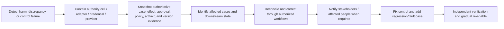

# Deployment, Operations, Incidents, and Roadmap

> **Purpose:** Release and operate the service without stranding active cases, exporting overload to reviewers, or letting model/provider failure stop the underlying business process.

## Behavior bundle as the release unit

A production decision depends on more than application code. Record an immutable behavior-bundle manifest:

```yaml
behavior_bundle: backoffice-invoice-exception@2026.08.31.3
manifest_schema: behavior-bundle@2
components:
  application_image: registry.example/bo-case@sha256:...
  workflow_definition: invoice-exception@9
  case_schema: 4
  event_schema: 3
  rule_set: invoice-policy@2026.08.4
  policy_bundle: authorization@2026.08.7
  task_registry: judgment-tasks@12
  context_projection: invoice-context@7
  compaction_policy: loss-aware-compact@2
  memory_policy: backoffice-memory@3
  prompt: invoice-classify@18
  model_routing_profile: bounded-classification@6
  adapter_contracts:
    erp_invoice: 5
    document_store: 3
  reconciliation_rules: invoice-recon@7
  audit_manifest_schema: 2
  qualified_capabilities:
    servicenow.case.set_internal_hold: 3
    erp.invoice.post_hold: 5
evaluation:
  corpus: invoice-eval@2026.08
  report_digest: "sha256:..."
authority_cells:
  - invoice_exception.classify_only.B1
provenance:
  sbom_digest: "sha256:..."
  build_attestation: "oci://evidence/attestation@sha256:..."
  manifest_signature: "sigstore:..."
```

Changing a rule, prompt, model route, tool schema, policy, memory/compaction rule, capability manifest, reconciliation tolerance, or context projection can change outcomes. Treat it as a controlled behavior release even when no application binary changes. The bundle is immutable; an environment pointer selects it. Rollback changes that pointer for eligible new work and restores compatible workers, but never erases business events or blindly rewinds active external effects.

## Active-case compatibility

Long-running cases outlive deployments. For each release define:

| Change | Default policy | Required proof |
| --- | --- | --- |
| Backward-compatible worker fix | Route pinned workflow versions to compatible worker | Replay/contract tests |
| Workflow state shape | Version definition; explicit migration if required | Snapshot, dry run, rollback/repair |
| Rule/policy update | Effective-date or pinned-decision semantics | Boundary tests and owner approval |
| Prompt/model update | New judgment runs only; do not rewrite accepted history | Locked corpus, shadow, slice metrics |
| Adapter schema/API update | Parallel adapter version or compatibility layer | Provider sandbox/contract and ambiguity tests |
| Event schema update | Additive compatibility or new event type/version | Consumer/provider fixtures and gap tests |
| Retention/privacy change | Apply governed migration/deletion/hold logic | Data owner, legal/privacy, and evidence tests |

Do not deploy nondeterministic workflow code that changes prior replay results. Keep compatible workers available for the maximum case horizon or migrate cases through an explicit, audited procedure.

## Environment strategy

- **Local/unit:** deterministic fakes; no production data or credentials.
- **Integration:** provider sandboxes, schema fixtures, duplicate/error injection.
- **Staging:** production-like identity/policy/queues with synthetic or approved minimized data.
- **Shadow:** live inputs under approved purpose; no external effects; compare against current process.
- **Canary:** one tenant/case type/risk cell, small traffic and one authority level.
- **Production:** progressive promotion with hard safety and reconciliation guardrails.

Test data must not become an excuse to copy unrestricted production case stores into lower environments.

## Queue and capacity design

Back-office load is bursty: month-end, payroll, renewal, incident, filing, and campaign deadlines create correlated demand. Queue by business priority and resource constraints, not one undifferentiated FIFO.

| Queue | Capacity concern | Protection |
| --- | --- | --- |
| Intake | Duplicate storms and large artifacts | Size/rate limits, authenticated sources, quarantine |
| Model judgment | Provider quotas, token/cost spikes | Admission, task budgets, batching where safe, fallback |
| Human review | Skill availability and cognitive load | Priority, age, role routing, workload caps, escalation |
| Effects | Downstream quotas and serial target updates | Per-adapter/tenant limits, resource key serialization |
| Reconciliation | Large scans and lagged data | Checkpoints, bounded partitions, completeness controls |
| Compensation/repair | High risk and operator attention | Separate priority and authority; never starve behind new work |

Use bounded queues and explicit overload behavior. Protect terminal reconciliation and control queues before low-priority new model work.

### Admission and degradation order

When capacity or dependencies fail:

1. stop B4 pre-authorized effects if safety evidence becomes stale;
2. preserve intake durability and deadline tracking;
3. continue reconciliation, cancellation, and high-risk exceptions;
4. route judgment tasks to approved deterministic or human fallback;
5. defer low-priority summaries/drafts;
6. shed unauthenticated, duplicate, oversized, or out-of-scope work;
7. communicate business backlog and recovery estimate.

Do not silently switch to a weaker model, broader data region, or less strict rule set.

### Capacity, cost, and backpressure model

Forecast each stage independently using arrival distribution—not only average rate—and the deadlines coupling them:

```text
required_concurrency ~= peak_arrival_rate × p95_service_time ÷ target_utilization
human_hours/day       = arrivals × review_rate × mean_handle_minutes ÷ 60 ÷ productive_fraction
correct_case_cost     = (compute + model + document + connector + review + reconciliation + incident allocation)
                        ÷ adjudicated_correct_terminal_cases
```

Validate burst and sustained rates at month/quarter/year-end, provider quota, document page/token distribution, per-target serialization, reconciliation scans, appeals/rework, staff shrinkage, and recovery catch-up. Keep utilization below the point where latency becomes unstable; the selected target comes from load tests and queueing evidence, not a universal percentage.

Backpressure is end-to-end. Admission writes a durable accept/defer/reject reason and expected deadline effect; workers respect bounded prefetch/concurrency; adapters honor per-tenant/system quotas; human queues cap assignment and surface unowned work; retry budgets include original and recovery load. Cost guardrails cap per-case pages/tokens/attempts and route overflow to an explicit alternative—they never truncate material evidence or skip a required control.

## Operational dashboards

### Business control view

- cases by type/state/age/value/priority;
- deadlines at risk and breached;
- exceptions by class/owner/age;
- approvals pending/expired/revoked and SoD conflicts;
- effects unknown/partial/unverified;
- reconciliation discrepancies by count/value/age;
- corrections, appeals, reversals, and unexpected downstream effects.

### Engineering view

- intake/queue/worker/adaptor throughput and latency;
- duplicate and stale-transition rejection;
- model/provider errors, token/cost, schema and evidence validation;
- rules/policy no-match/error/deny;
- effect retries, unknown transitions, and reconciliation lag;
- version distribution across active cases/workers;
- evidence-store, outbox, backup, and telemetry health.

Keep identifiers protected; aggregates should not leak sensitive small cohorts.

## Alert routing

| Signal | Page now | Ticket/business escalation | Dashboard only |
| --- | --- | --- | --- |
| Cross-tenant access or unauthorized commit | Yes | Incident and control review | No |
| Unexpected high-risk downstream effect | Yes | Reconciliation/control owner | No |
| Unknown high-risk effect near deadline | Risk-specific | Yes | No |
| Reconciliation value/age limit breached | Often | Yes | No |
| Model quality drift without current harm | Rarely | Evaluation owner | Yes |
| Model provider outage with working fallback | No | Capacity/business owner if prolonged | Yes |
| Human queue approaching deadline | Only for critical process | Queue owner/escalation | Yes |
| Cost budget trend | Only runaway threat | Product/FinOps | Yes |

Pages require an immediate operator action. Do not page on every model error or exception.

## Kill switches and recovery controls

Use independently operable controls for:

- all new external effects;
- one effect type/adapter;
- one tenant/legal entity;
- one workflow/rule/model/prompt version;
- B4 pre-authorized operation only;
- provider/context egress;
- one compromised credential;
- one entry source.

Activating a kill switch must persist an authoritative event, revoke or block credentials, stop new reservations, and leave in-flight operations in a state that reconciliation can resolve. A feature flag checked only by the model worker is inadequate.

## Incident taxonomy

| Incident | Immediate containment | Recovery evidence |
| --- | --- | --- |
| Wrong business decision | Stop affected authority cell/version; preserve cases | Impacted population query, corrected decisions, appeal/notice disposition |
| Unauthorized effect | Stop effect plane, revoke credentials, secure evidence | Full operation/actor scope, downstream containment, reconciliation |
| Duplicate/partial effects | Disable retries/adapter as needed | Intent-to-actual comparison, compensation/forward-fix receipts |
| Cross-tenant/privacy disclosure | Isolate path and access, stop provider egress | Affected records/recipients, deletion/containment and notification decision |
| Prompt injection/tool misuse | Disable task/source/tool route | Malicious artifact lineage, no further effects/data egress, regression test |
| Rule/policy defect | Pin/rollback bundle or block transition | Re-evaluation scope and corrected version |
| Model/provider regression | Pin/route off candidate, reduce autonomy | Slice comparison, affected cases, reviewed corrections |
| Case loss/stall | Preserve intake, stop unsafe promotion | Restored state/outbox, deadline disposition, completeness reconciliation |
| Audit-evidence gap | Stop affected consequential path if evidence mandatory | Gap scope, recovered records, integrity/retention repair |

## Incident response flow



Preserve evidence before destructive cleanup, while still containing exposed access. NIST SP 800-61 Rev. 3 frames incident response across preparation, detection, response, and recovery activities within wider risk management; adapt the organization's existing incident process rather than inventing an AI-only silo.

## Runbooks

### Ambiguous effect backlog

1. stop new same-target/effect operations if duplication risk is material;
2. group by adapter, version, time, tenant, and error signature;
3. query downstream by operation/business key and authoritative snapshot;
4. classify committed, no-commit, pending, partial, or unresolved;
5. update through an authorized reconciliation command;
6. forward-fix/compensate only with domain approval;
7. confirm the reconciliation SLO and unexpected-effect scan recover.

### Wrong model judgment

1. reduce the affected task/label/source authority to human review;
2. identify cases by task, prompt, model, source type, time, and proposal version;
3. independently adjudicate affected accepted and rejected cases;
4. correct through normal versioned case events;
5. update corpus, validator/context/task as root cause requires;
6. rerun all hard gates and canary before promotion.

### Model/provider outage

1. keep intake and case deadlines durable;
2. invoke the approved manual/deterministic fallback for priority work;
3. do not change region/provider/data-use terms without authorization;
4. apply queue admission and communicate backlog;
5. recover with pinned versions and verify no duplicate judgments/effects.

## Incident and recovery load

Recovery competes with normal work and often consumes the scarcest reviewers, integration experts, and control owners. Every game day measures:

| Load dimension | Measure | Capacity decision |
| --- | --- | --- |
| Impact discovery | Time and analyst-hours to identify affected cases/effects with complete version predicates | Precompute safe impact indexes and tested queries; protect access without forcing raw-log archaeology |
| Reconciliation | Operations/value per hour, downstream quota, ambiguous fraction, oldest unresolved age | Reserve reconciliation throughput and same-target serialization; pause new conflicting work |
| Human correction | Qualified reviewer hours, mean/p95 handle time, disagreement/rework, maximum safe concurrent cases | Maintain named surge roster and workload caps; do not assume overtime is a control |
| Communication/appeal | Notices, recipients, language/accessibility, approvals, delivery uncertainty, response volume | Stage reviewed templates and a separate communication operation ledger/capacity plan |
| Restore/catch-up | Restore time, backlog growth during outage, replay/catch-up rate, external-state gap | Size recovery capacity to meet RTO plus deadline policy; reconcile before enabling effects |
| Cognitive/toil burden | Handoffs, tools/screens per correction, runbook deviations, operator error/near miss, hours to stabilize | Simplify runbooks/UI, automate safe evidence assembly, and lower authority until recovery is operable |

An incident is not recovered when services are green while corrections, appeals, reconciliation, or staff overload remain. Re-enable criteria include known affected population, safe current external state, owned residuals, recovered deadlines/capacity, corrected control, regression fixture, and independent business/control approval.

## Backup and disaster recovery

Define and test RPO/RTO separately for:

- case state and append-only events;
- approval/effect ledger and outbox;
- source artifacts and evidence manifests;
- rules, policy, workflow, prompt/task, adapter, and release artifacts;
- reconciliation checkpoints and downstream snapshot access;
- identity/policy dependencies and credential recovery.

Restore testing must prove referential integrity among case, evidence, approval, operation, receipt, and version manifests. After a restore, reconcile downstream systems before restarting effects; the external world may be ahead of the restored database.

## Stage 0–6 delivery and exercise gates

Stages bound authority and operating evidence, not calendar time. Enter only with the prior stage's signed evidence packet; exit only after the measurable exercise passes on the supported population. Remaining permanently at Stage 1–3 is often the correct production choice.

| Stage | Entry evidence | Measurable exercise | Exit evidence | Block/demote when |
| --- | --- | --- | --- | --- |
| **Stage 0 — process and control foundation** | Named case/process owner; current process map; systems/record authority; baseline volume, cycle time, defects, exceptions, staff load, and cost; domain privacy/legal/control matrix | Replay at least one representative period through a deterministic case/state/event skeleton; inject duplicate/late intake, clock boundary, cancellation, and reassignment; independently reconstruct sampled outcomes | Enumerated states/invariants/rules, exact identity ledger, exception taxonomy, SoD/retention/appeal design, baseline report, no lost/illegal state in the exercise, approved “when not to use” decision | Policy/ownership unresolved, no authoritative records, no manual fallback, or an agent has no measured incremental use |
| **Stage 1 — read-only bounded judgment** | Stage 0 packet; versioned task/schema; labeled corpus and slice coverage; purpose projection; provider review; no write credentials | Shadow one bounded extraction/classification over a predeclared sample and outage window; test indirect injection, unreadable/conflicting/novel documents, restart/compaction, and blinded human adjudication | Per-field/class/evidence/abstention results, supported/unsupported slice statement, zero unauthorized reads, provider-outage fallback, human utility/capacity evidence, locked regression set | Unsupported fact/control bypass, correction workload exceeds plan, material slice failure, or transcript/provider state is needed to resume |
| **Stage 2 — reversible staged work** | Stage 1 stable for the declared observation window; qualified stage-only capability; exact target and content policy | Create drafts/pending records in an isolated non-authoritative workspace; duplicate/reorder requests; change target/evidence; let drafts expire/cancel; have operators accept/correct/reject | No authoritative effects, stale-target/evidence rejection, draft cleanup/deletion evidence, correction and review-time distribution, complete audit manifest | Staged data leaks, target ambiguity, reviewers approve without evidence, or draft side effects are not truly reversible |
| **Stage 3 — one exact approved effect** | Stage 2 packet; operation manifest; independent approval/SoD; effect ledger; reconciliation owner; kill switch; adapter qualification | Run one low-value single-item effect; crash before/after dispatch, drop response, duplicate callbacks, expire/revoke approval, cancel at all boundaries, create partial/unknown state, and fail correction | One semantic effect per intent, zero invalid approvals, all unknown/partial states resolved or owned within SLO, verified postcondition, successful restore/reconcile and rollback/demotion drill | Blind retry, unbounded unknown state, missing receipt/read-back, stale actor commits, compensation undefined, or reconciliation incomplete |
| **Stage 4 — bounded pre-authorized cell** | Stage 3 stable over minimum volume/time and rare-risk coverage; low-risk/reversible action; calibrated routing; error/cost/volume budgets; independent sampling | Canary a single tenant × case type × action × risk/value band; deliberately burn a guardrail budget and prove automatic stop/demotion; audit auto-completed and rejected samples | Authority-cell manifest/expiry, harm/correction/appeal and selective-risk results, zero invariant bypass, capacity headroom, functioning auto-demotion/kill switch, accountable owner sign-off | Any control bypass, harmful-error/reconciliation/queue budget burn, drift outside support, or sampled review becomes ineffective |
| **Stage 5 — resilient scale and recovery** | Cell economics and SLOs stable; partition/tenant model; dependency/region inventory; RPO/RTO; surge/manual roster | Peak/burst/noisy-neighbor load, provider/connector/identity outage, queue poison, regional loss, backup restore behind external systems, catch-up, and four-hour manual takeover | Deadline/error-budget results by cell, tenant isolation, bounded backpressure/cost, qualified failover without policy/region downgrade, RPO/RTO met, external reconciliation before effects, measured recovery toil within staffing plan | Restore cannot prove completeness, recovery overload is unsafe, failover changes data/control terms, or one tenant/dependency can exhaust protected queues |
| **Stage 6 — controlled failure mining and evolution** | Stable Stage 5 operations; governed outcome joins; label/adjudication policy; bundle provenance; active-case compatibility | Mine a predeclared window of reviewed exceptions, appeals, incidents, corrections, unknown effects, and near misses into quarantined candidates; deduplicate, adjudicate, check privacy/selection bias/leakage, replay current/candidate bundles, canary, and roll back one deliberately bad candidate | Dataset/label lineage and deletion policy, accepted/rejected candidate reasons, held-out outcome/trajectory/invariant/human-factor comparison, signed behavior bundle, active-case pin/migrate plan, successful full-bundle rollback with processing/reconciliation continuing | Raw traces self-promote, one model/reviewer supplies its own truth, test contamination or privacy purpose fails, candidate weakens a hard gate, or rollback strands active cases |

### Controlled failure-mining rules

- Mine only authorized, minimized references and adjudicated observable outcomes; do not ingest hidden reasoning, secrets, or bulk production prompts by default.
- Preserve the sampling frame, including successful auto-completed work, so escalations do not become a biased picture of production.
- Quarantine new examples; separate proposal, adjudication, evaluation, training, and release roles where consequence warrants SoD.
- Deduplicate by case/effect/root-cause lineage and keep time/entity/template-separated holdouts to limit leakage.
- A mined failure can propose a rule, test, prompt, parser, workflow, memory, or capability change. It cannot modify production behavior directly.
- Record discarded examples and reasons; deletion, legal hold, appeal correction, and label withdrawal propagate to derived datasets and future bundles.

### Stage evidence checklist

- [ ] Scope, supported population, consequence band, owner, duration, sample size, exclusions, and predeclared thresholds are recorded.
- [ ] Exact behavior bundle and qualified capability versions are attached to every report.
- [ ] Hard invariant/control/privacy gates are separate from accuracy, latency, cost, and throughput objectives.
- [ ] Failure injection asserts case/effect/evidence state and operator route, not merely response codes.
- [ ] Manual and model/provider-outage paths meet deadline and measured human-capacity limits.
- [ ] Entry/exit evidence has an independent reviewer and expiry/retest trigger.
- [ ] Rollback/demotion preserves active-case compatibility and reconciles in-flight external effects.

## Final production checklist

### Release and compatibility

- [ ] Signed behavior bundle pins workflow, schema, rule, policy, task/prompt/model route, context/memory/compaction, capability manifests, reconciliation, and authority cells.
- [ ] Active cases have pin/migrate/effective-date behavior and compatible workers.
- [ ] Replay, shadow, canary, rollback, and repair paths are tested.

### Operations

- [ ] Queues have priorities, limits, ownership, age/value metrics, and overload behavior.
- [ ] Model outage preserves intake, deadlines, reconciliation, and manual processing.
- [ ] Kill switches and credential revocation operate outside the model plane.
- [ ] Dashboards expose unknown/partial effects and reconciliation—not only throughput.

### Incidents and recovery

- [ ] Incident types map to containment, impact query, correction, notification, and re-enable evidence.
- [ ] Runbooks cover wrong judgment, unauthorized/ambiguous effects, disclosure, rule defects, and provider outage.
- [ ] Backup restore is followed by downstream reconciliation before effects resume.
- [ ] Authority is automatically or manually demoted when safety evidence is stale.

## Sources and related guides

- [NIST SP 800-61 Rev. 3](https://csrc.nist.gov/pubs/sp/800/61/r3/final)
- [NIST AI RMF Core](https://airc.nist.gov/airmf-resources/airmf/5-sec-core/)
- [NIST SP 800-160 Vol. 2 Rev. 1](https://csrc.nist.gov/pubs/sp/800/160/v2/r1/final)
- [Google SRE error budget policy](https://sre.google/workbook/error-budget-policy/)
- [OpenTelemetry Collector security guidance](https://opentelemetry.io/docs/security/config-best-practices/)
- [Queues, scheduling, and backpressure](../../operations/queues-scheduling-and-backpressure.md)
- [Scaling, capacity, and SLOs](../../operations/scaling-capacity-and-slos.md)
- [Deployment, release, and incident response](../../operations/deployment-release-and-incident-response.md)
