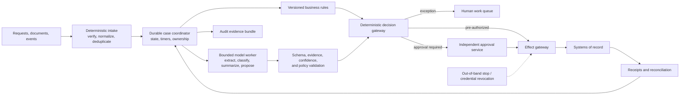
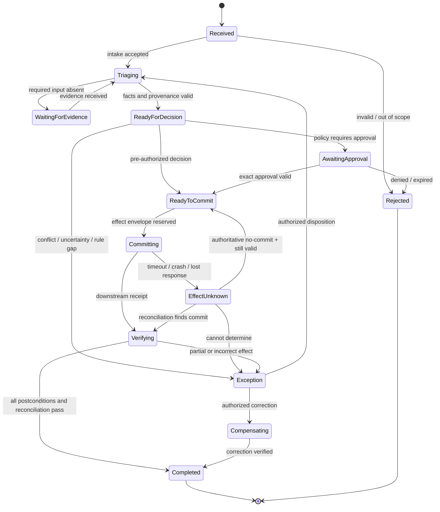

# Production Back-Office Workflow Agent Blueprint

> **Research date:** 2026-08-31  
> **Status:** Pass 2 production design reference; validate every business rule, control, integration, and legal obligation in the target organization  
> **Scope:** Long-running operational cases, document interpretation, business rules, approvals, multi-system writes, reconciliation, exceptions, compliance evidence, and human handoffs

## Bottom line

The safest useful back-office agent is a **durable case workflow with a bounded model worker**, not a chatbot that owns a process.

The case service owns identity, state, deadlines, rule versions, assignments, approvals, and terminal outcomes. Deterministic services own calculations, eligibility rules, authorization, segregation of duties, and effect commits. The model may extract uncertain facts, classify unstructured inputs, summarize evidence, draft communications, or recommend one of a closed set of next actions. Its output is typed, source-backed, confidence-aware, and rejectable.

Start without write authority. Add one effect class at a time only after replay, exception, reconciliation, privacy, and control tests pass. If the workflow is fully specified from structured inputs, use normal rules and workflow software without a model.

## What this blueprint covers

Examples include supplier onboarding, invoice exceptions, claims intake, account maintenance, entitlement fulfillment, refund preparation, compliance case assembly, contract obligation tracking, employee lifecycle operations, and other case-oriented work where inputs arrive over time and the result spans several systems.

It does **not** make one generic agent safe for every back-office domain. Payments, lending, insurance, employment, healthcare, tax, public benefits, and regulated reporting can impose different legal duties, appeal rights, retention rules, control objectives, and autonomy ceilings. Build a domain control matrix before production.

## Decide whether an agent belongs at all

| Workload shape | Best default | Why |
| --- | --- | --- |
| Structured inputs and complete, stable rules | Rules service or DMN decision table | Deterministic, testable, explainable, cheaper |
| Known sequence with timers, service tasks, and human tasks | BPM/workflow engine | Native lifecycle, retry, assignment, and escalation semantics |
| Unpredictable case order led by trained staff | Case-management system | Human judgment and evolving case information are primary |
| Legacy UI with no supported API | Narrow RPA under supervision | UI automation may bridge a gap, but it is brittle and hard to reconcile |
| Unstructured evidence must be interpreted before rules run | Workflow plus bounded model worker | Model handles semantic ambiguity; workflow keeps control |
| Open-ended cross-system planning with changing evidence | Agent inside a durable workflow | Useful only when closed playbooks cannot cover the judgment required |

Do not add a model merely to translate a flowchart into natural language. A model is justified when measured handling quality or operator effort improves on realistic cases after accounting for review, failures, latency, and cost.

## Non-negotiable invariants

1. **The transcript is not the case record.** Authoritative case state is structured, versioned, and independently queryable.
2. **The model never owns a business invariant.** Eligibility, amounts, limits, required approvals, forbidden combinations, and terminal-state rules execute deterministically.
3. **Facts and judgments are different records.** Source facts preserve provenance; model-derived fields identify the model/prompt version, evidence, uncertainty, and reviewer status.
4. **Unknown is not false.** Missing, conflicting, stale, unreadable, and indeterminate inputs route differently from a negative business finding.
5. **Every consequential transition identifies its rule and policy versions.** A later audit can reconstruct which logic applied.
6. **Approval is not authorization.** Commit-time policy revalidates actor, tenant, target, amount, state version, deadline, and approval scope.
7. **A proposer cannot approve its own consequential effect.** Segregation-of-duties rules apply across people, service accounts, delegated identities, and model-assisted steps.
8. **Every external write has a semantic operation ID.** Retry, replay, and resume reuse it; changed intent requires a new ID.
9. **Ambiguous outcomes are first class.** Timeout or worker loss after dispatch becomes `effect_unknown` until reconciled against an authoritative downstream source.
10. **Compensation does not erase history.** It is a new authorized effect linked to the original receipt.
11. **A human receives a decision surface, not a transcript dump.** Show evidence, conflicts, proposed action, control reason, and exact consequence.
12. **Audit records and diagnostic telemetry are separate.** Sampling, trace loss, or telemetry deletion cannot change execution or destroy required evidence.
13. **Untrusted content remains data.** Email, PDFs, tickets, notes, OCR, and external records cannot change instructions, permissions, or tool scope.
14. **The workflow still operates when the model is unavailable.** Queue, defer, route to people, or use a validated deterministic fallback.
15. **One out-of-band control can stop new effects.** It must not depend on the model loop.

## Deterministic ownership versus bounded judgment

| Concern | Deterministic owner | Permitted model contribution |
| --- | --- | --- |
| Case identity and deduplication | Intake/case service | Suggest possible duplicate for review |
| Required fields and data types | Schema validator | Extract candidate values with citations |
| Entity identity | Master-data/entity-resolution service | Rank candidates; never silently choose an ambiguous target |
| Calculations, thresholds, eligibility | Rules/calculation service | Explain the result in plain language |
| Workflow state and timers | Durable coordinator | Recommend a permitted next action |
| Authorization and SoD | Identity and policy services | None; may explain a denial |
| Approval validity | Approval service | Draft an approval summary |
| External effects | Effect gateway/adapters | Propose a typed effect intent |
| Commit success | Downstream receipt plus reconciliation | Summarize verified outcome |
| Exception disposition | Authorized operator or deterministic rule | Triage, summarize, and recommend |
| Audit evidence | Application-owned evidence service | Generate a narrative linked to authoritative records |

The model must not be asked to “follow policy” when the application can evaluate the policy. A prompt is not a control.

## Authority levels

Grant authority per **workflow × effect class × tenant × value/risk band**, not per agent deployment.

| Level | Capability | Production posture |
| --- | --- | --- |
| **B0 — Observe** | Read a purpose-limited case projection; summarize and identify missing evidence | Safe starting point after privacy and access tests |
| **B1 — Propose** | Produce typed extraction, classification, draft, or next-action proposal | Default useful launch |
| **B2 — Stage** | Create a reversible draft or pending record in a non-authoritative workspace | After exact-target and data-egress tests |
| **B3 — Approved commit** | Commit one exact effect after independent approval and revalidation | Mature, bounded, well-reconciled action classes |
| **B4 — Pre-authorized commit** | Commit low-risk, reversible actions inside explicit budgets | Only after repeated failure-injection and outcome evidence |
| **B5 — Broad autonomous operations** | Open-ended multi-system authority | Outside the default target; usually unjustified |

A deployment may be B4 for adding an internal routing tag, B2 for drafting a customer notice, and B0 for payment records. “Human in the loop” is not a level: name who reviews what, with which authority, before which commit, and within what deadline.

## Authoritative lifecycle

`WaitingForEvidence` and `AwaitingApproval` are durable states with deadlines, reminders, escalation, cancellation, and reassignment. `EffectUnknown` is neither success nor failure. `Completed` means business postconditions and required reconciliations passed, not merely that an API returned `2xx`.

## Guide map

| Guide | Decision it supports |
| --- | --- |
| [Workload fit, requirements, and autonomy](01-workload-fit-requirements-and-autonomy.md) | Whether to use rules, workflow, case management, RPA, a model worker, or an agent |
| [Reference architecture and runtime selection](02-reference-architecture-and-runtime-selection.md) | How to split control, judgment, effect, evidence, and integration planes |
| [Case state, events, rules, and model judgment](03-case-state-events-rules-and-model-judgment.md) | What is authoritative and how nondeterministic output enters a deterministic lifecycle |
| [Approvals, segregation of duties, and exceptions](04-approvals-segregation-of-duties-and-exceptions.md) | How humans exercise real control without becoming a rubber stamp |
| [Tools, effects, idempotency, and reconciliation](05-tools-effects-idempotency-and-reconciliation.md) | How one approved intent becomes one verified multi-system outcome |
| [Data, privacy, compliance, and audit evidence](06-data-privacy-compliance-and-audit-evidence.md) | How to constrain data use and produce defensible evidence without over-logging |
| [Observability, evaluation, and failure injection](07-observability-evaluation-and-failure-injection.md) | How to prove capability, controls, recovery, and business outcomes before promotion |
| [Deployment, operations, incidents, and roadmap](08-deployment-operations-incidents-and-roadmap.md) | How to release, scale, degrade, respond, and expand authority safely |

The [research packet](../../research/packets/back-office-workflow-agent-blueprint.md) records the dated standards baseline, sources, resolved design tensions, and refresh triggers.

## Worked reference flows

These flows share one case ledger and deliberately cross the boundaries that fail in production. Identifiers shown are application identities; provider job, record, and trace IDs are mapped to them, never substituted for them.

### Flow A — read-only triage and document-driven handling

1. An authenticated portal submission creates `case_7H2`; the intake idempotency key maps duplicate submissions to the same case without merging unrelated evidence.
2. The artifact service stores the original invoice as `doc_91C@sha256:...`, strips or isolates active content, records media type and provenance, and exposes a page-limited projection. Instructions inside the file remain untrusted evidence.
3. OCR runs as `wi_ocr_44@1`; its provider job ID is only an external execution reference. A bounded model run receives the OCR spans and purchase-order snapshot, then proposes typed fields with locators. It has no effect tool.
4. The validator rejects invented locators and distinguishes unreadable, absent, stale, and conflicting values. Deterministic duplicate and variance rules route the case.
5. Low-risk, evidence-complete triage creates an assigned human work item or a read-only queue tag. The case remains resumable from authoritative records if the model, worker, or provider disappears.

**Acceptance evidence:** duplicate-intake test, malware/active-content handling, extraction score by field/template, citation resolution, zero unauthorized reads, restart at every step, and manual processing during provider outage.

### Flow B — human approval and an exact multi-system commit

1. A supplier bank-change proposal binds the supplier master ID, expected record version, new normalized destination, evidence manifest, policy version, and case version into `intent_hash`.
2. The approval service creates a work item for an eligible controller. The review UI shows registered-channel evidence, before/after values, conflicts, consequence, and reject/request-evidence options. Delegation and SoD are evaluated from authoritative actor history.
3. Approval produces `apr_82M@1`, scoped to the exact hash and expiry. A changed target, amount, evidence, actor entitlement, case version, or policy obligation invalidates it.
4. The effect gateway reserves one operation per system: `op_vendor_4F8` and `op_crm_9P1`. It revalidates policy and fences, commits the authoritative vendor-master change first, and retains its receipt.
5. If the CRM projection fails, the case becomes `partial`; it does not rewrite the vendor master or claim completion. The disposition policy chooses forward recovery, compensation, or owned manual repair. Each choice is a new authorized command.
6. Reconciliation joins intent, receipts/events, and current snapshots. Only verified postconditions permit `completed`.

**Acceptance evidence:** stale-approval rejection, aliased-identity SoD test, one semantic effect after duplicate delivery, partial-write evidence, target read-back, reconciliation completeness, and operator repair drill.

### Flow C — unknown effect, cancellation, and compensation

1. The ERP adapter sends `op_hold_73A`; the connection drops after the request crosses the commit boundary. The ledger records `unknown`, blocks a fresh operation ID, and schedules status-by-key/read-back reconciliation.
2. A cancellation arrives while reconciliation is pending. The coordinator records `cancellation_requested`, revokes new-work fences, stops undispatched tasks, and keeps the case open because cancellation cannot erase a possible external write.
3. Reconciliation finds the hold committed. The original receipt is preserved and the cancellation policy requests `op_release_15B`, a separately approved compensating command with its own precondition and receipt.
4. If release fails, the case remains an owned compensation exception with an SLA clock. It closes only after the downstream state is verified or an accountable owner accepts a documented residual state.

**Acceptance evidence:** dropped-response test, no blind retry, cancellation at pre-dispatch/in-flight/post-commit boundaries, failed-compensation drill, downstream unexpected-effect scan, and audit reconstruction without diagnostic traces.

## Minimal production slice

Choose one high-volume but low-consequence workflow with known owners and labeled history. Ship only:

- verified intake and deduplication;
- one authoritative case state machine;
- purpose-limited read adapters;
- model-assisted extraction or classification with evidence spans and abstention;
- deterministic rule evaluation;
- an exception queue with assignment and deadlines;
- no direct external write, or one reversible staged draft;
- complete case, decision, rule, prompt/model, and reviewer lineage;
- offline replay, shadow comparison, privacy tests, and operator feedback.

Do not begin with payments, account closure, employment decisions, benefit denial, regulated filings, or irreversible customer communications. Those are promotion targets only after the supporting control system is already proven.

## Promotion gates

| Gate | Required evidence |
| --- | --- |
| **Fit** | Model materially improves measured handling quality or effort over deterministic alternatives |
| **Case correctness** | No illegal transition, lost deadline, duplicate case, or stale-owner commit in replay and fault tests |
| **Judgment quality** | Per-class precision/recall, calibration/abstention, evidence support, and subgroup analysis meet domain thresholds |
| **Control integrity** | Authorization, SoD, exact approval, expiry, revocation, and commit-time revalidation tests pass |
| **Effect safety** | Duplicate delivery, crash-after-commit, timeout, partial success, cancellation, and compensation tests reconcile |
| **Privacy/compliance** | Purpose, field access, retention, redaction, model-provider use, appeal, and audit requirements are approved |
| **Operations** | SLOs, queues, capacity, manual fallback, incident runbooks, kill switch, rollback, and recovery drills pass |

Authority promotion is blocked when harmful error rate, unresolved reconciliation age, control bypass, privacy breach, or operator correction rate exceeds its threshold—even if average task accuracy improves.

## Anti-patterns

| Anti-pattern | Why it fails | Replacement |
| --- | --- | --- |
| Chat transcript as workflow state | Cannot enforce legal transitions, deadlines, or concurrency | Structured case record plus append-only events |
| Model decides eligibility or amount from prose | Hidden rule drift and inconsistent calculation | Versioned rule/calculation service |
| One “update_record” tool for every system | Excessive scope, weak validation, poor idempotency | Narrow domain commands through an effect gateway |
| Generic service account across tenants | Cross-tenant blast radius and lost actor lineage | Tenant/resource-scoped delegated credentials |
| Approval of a summary rather than the effect | Payload can change after review | Canonical intent hash and state-version binding |
| Reviewer sees only the model recommendation | Automation bias and unverifiable reasoning | Evidence-first review surface with conflicts and alternatives |
| Retry every timeout | Duplicate payments, notices, or records | Unknown outcome plus receipt/status reconciliation |
| “Rollback” by deleting the original record | Destroys history and may violate accounting semantics | Linked compensating/correcting effect |
| Full prompts and documents in traces | Creates a second sensitive data store | References, redacted summaries, controlled artifacts |
| One undifferentiated “agent memory” store | Mixes transient guesses, authoritative state, preferences, and outcomes with incompatible retention and poisoning risk | Seven-lifetime policy with typed authority, promotion, deletion, and evaluation controls |
| Compacted summary as resume state | Omissions silently drop approvals, clocks, identity, or unknown effects | Loss-aware receipt plus fresh authoritative rehydration and invariant verification |
| Product/connector certified as one capability | Read, create, approve, reconcile, and compensate operations have different identity and failure semantics | Versioned operation-level manifests and expiring qualification evidence |
| Model-only canary or rollback | Rules, context, tools, policies, adapters, and active cases can still change behavior or strand effects | Signed behavior bundle, cell canary, active-case plan, and reconciliation-aware rollback |
| Multi-agent swarm for department roles | More nondeterminism and handoff failure without control value | One coordinator with typed workers and human roles |
| Agent on the only processing path | Provider outage stops the business | Queue, deterministic/manual fallback, and bypass runbook |

## Canonical repository dependencies

- [Agent state and event contracts](../../runtime/agent-state-and-event-contracts.md)
- [Durable execution](../../runtime/durable-execution.md)
- [Idempotency and side-effect safety](../../reliability/idempotency-and-side-effects.md)
- [Tool contracts](../../tools/tool-contracts.md)
- [Tool results, artifacts, and provenance](../../tools/tool-results-artifacts-and-provenance.md)
- [Agent threat model](../../security/agent-threat-model.md)
- [Prompt injection and untrusted data](../../security/prompt-injection-and-untrusted-data.md)
- [Permissions, sandboxing, and secrets](../../security/permissions-sandboxing-and-secrets.md)
- [Trajectory and reliability evaluation](../../evaluation/trajectory-and-reliability-evaluation.md)
- [Queues, scheduling, and backpressure](../../operations/queues-scheduling-and-backpressure.md)
- [Deployment, release, and incident response](../../operations/deployment-release-and-incident-response.md)

## Selected primary sources

- [OMG BPMN 2.0.2](https://www.omg.org/spec/BPMN/2.0.2/)
- [OMG CMMN 1.1](https://www.omg.org/spec/CMMN/1.1/)
- [OMG DMN 1.5](https://www.omg.org/spec/DMN/1.5/)
- [GAO 2025 Green Book](https://www.gao.gov/greenbook)
- [NIST SP 800-53 Rev. 5, Release 5.2.0](https://csrc.nist.gov/pubs/sp/800/53/r5/upd1/final)
- [NIST AI RMF Core](https://airc.nist.gov/airmf-resources/airmf/5-sec-core/)
- [NIST AI 600-1 Generative AI Profile](https://doi.org/10.6028/NIST.AI.600-1)
- [OWASP Top 10 for Agentic Applications 2026](https://genai.owasp.org/resource/owasp-top-10-for-agentic-applications-for-2026/)
- [CloudEvents 1.0.2](https://github.com/cloudevents/spec/tree/ce%40v1.0.2)
- [W3C PROV overview](https://www.w3.org/TR/prov-overview/)
