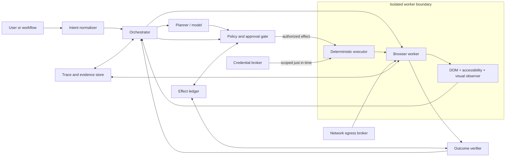
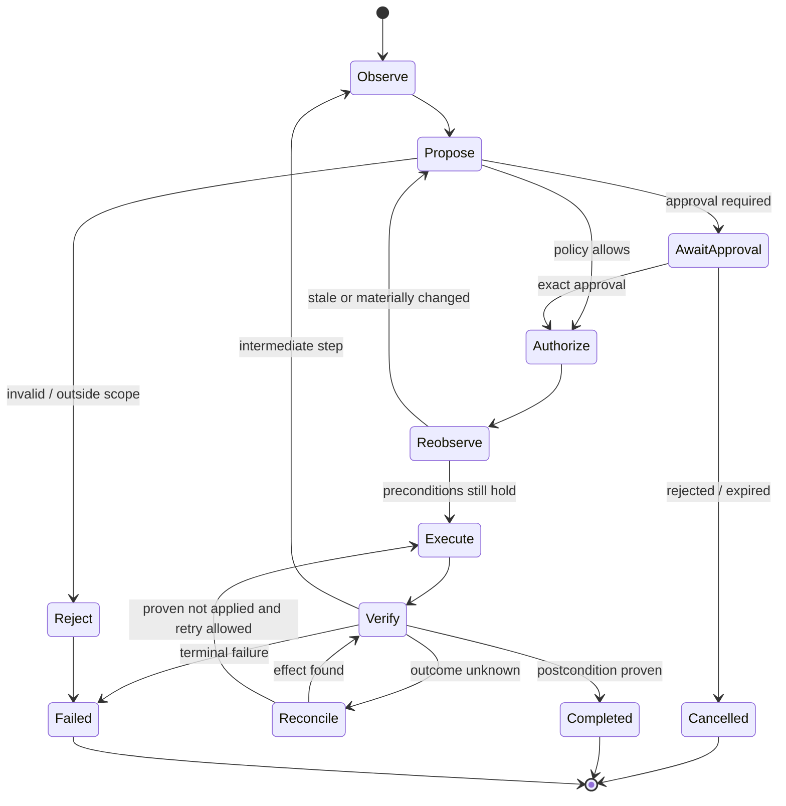

# Production Browser Automation Agent Blueprint

> Status: production architecture blueprint  
> Research date: 2026-08-31  
> Baseline: Playwright 1.62.x, WebDriver BiDi Editor's Draft 2026-08-25, current Chromium sandbox guidance, and the framework releases recorded in the [research packet](../../research/packets/browser-automation-agent-blueprint.md)  
> Audience: engineers designing, building, securing, evaluating, or operating browser agents

A production browser agent is not a model with a `click` tool. It is a constrained effect system that happens to use a browser. The browser exposes authenticated state, cross-origin navigation, downloads, uploads, payments, messages, and destructive controls. Page content is attacker-controlled input. A reliable design therefore separates observation, proposal, authorization, execution, and verification.

The recommended default is a **guarded hybrid agent**:

- deterministic Playwright or WebDriver actions for known, testable flows;
- accessibility-tree and DOM evidence for semantic interaction;
- screenshots or vision only when semantics are insufficient;
- a model for bounded interpretation and recovery, not unrestricted browser control;
- application-owned policy, approval, credential, network, and effect ledgers;
- a fresh browser context for every run and stronger process or VM isolation for sensitive tenants;
- task-level verification and receipts instead of trusting the model's claim that it finished.

Use a fully deterministic worker when the application is known and selectors or APIs are stable. Use a model-assisted worker when page variation makes deterministic code uneconomic but actions remain low impact. Use a guarded hybrid for most production work. Do not deploy autonomous high-impact browser actions unless the application can prove authorization, bind approval to the exact effect, and reconcile uncertain outcomes.

## Guide map

| Guide | Decision it helps make |
|---|---|
| [Requirements and threat model](requirements-and-threat-model.md) | What the agent may do, what it must never do, and which trust boundaries matter |
| [Architecture and runtime](architecture-and-runtime.md) | Deterministic, model-assisted, or hybrid; perception stack; protocol, language, model, and framework choices |
| [Tool and effect contracts](tool-and-effect-contracts.md) | How observations, proposals, approvals, browser actions, files, and receipts cross boundaries |
| [Sessions, context, and security](sessions-context-and-security.md) | How to handle authentication, credentials, page prompt injection, origins, CSRF, egress, and memory |
| [Reliability and recovery](reliability-and-recovery.md) | How to handle stale pages, timeouts, retries, idempotency, crash recovery, reconciliation, and replay |
| [Observability, evaluation, and testing](observability-evaluation-and-testing.md) | What to trace, how to debug, how to score tasks, and what failures to inject before launch |
| [Deployment, cost, and operations](deployment-cost-and-operations.md) | Isolation, pools, admission control, scaling, performance, cost, SLOs, rollout, and incidents |
| [Build roadmap and alternatives](build-roadmap-and-alternatives.md) | What to build first, release gates, and when to use custom code, a framework, or a hybrid |

The [research packet](../../research/packets/browser-automation-agent-blueprint.md) records source versions, research questions, strong evidence, contradictions, limitations, and refresh triggers. It is part of the blueprint, not an optional bibliography.

## Ownership boundaries

This blueprint owns browser-runtime mechanics. It does not own the business decision made through the browser.

| Concern | Browser automation owns | Delegate to |
|---|---|---|
| Web execution | Site/origin/frame/page/session identity, observation, actionability, navigation, files, reconnect, worker isolation | This blueprint |
| General desktop control | OS windows, native dialogs, desktop applications, coordinate-only interaction outside browser content | [Computer-use agent](../computer-use-agent/README.md) |
| Customer resolution | Entitlements, support policy, case state, refunds, customer communication | [Customer-support agent](../customer-support-agent/README.md) |
| Travel | Traveler identity, quote validity, fare rules, inventory, ticketing, changes, refunds | [Travel-booking agent](../travel-booking-agent/README.md) |
| Commerce | Catalog, offer, promotion, inventory, order, payment, fulfillment, merchandising policy | [E-commerce operations agent](../ecommerce-operations-agent/README.md) |
| Site integration | Site-specific selectors, allowed origin graph, login contract, receipts, rate/terms constraints, drift response | The owning product/domain team |

A domain agent may request `stage_booking_review` or `prepare_refund_form`; it must not receive a raw browser handle. The browser layer returns typed observations, draft state, receipts, and uncertainty. The domain owner decides whether a quote, refund, purchase, booking, or customer promise is valid.

## Reference architecture

The browser worker is disposable. The durable control state lives outside it. The planner never receives raw credentials, never calls browser APIs directly, and never decides whether its own action is authorized. The executor accepts only validated capability-shaped commands. The verifier checks application state, not prose generated by the planner.

## Non-negotiable invariants

1. **Only the user or calling application grants authority.** Text in a page, screenshot, PDF, email, chat, tool output, file, or redirect cannot grant new permission.
2. **Observation is untrusted data.** DOM text, accessible names, image pixels, URLs, headers, filenames, and downloaded files may all be adversarial.
3. **Every action is bound to fresh state.** A proposal names the browser context, page, frame, origin, document epoch, observation, and target fingerprint it was based on.
4. **Policy is outside the model and framework.** Framework allowlists, secret substitution, and confirmation callbacks are useful controls, but not the final security boundary.
5. **High-impact effects require exact approval.** The approval shows destination, account, amount or data, reversibility, and resulting effect; any material change invalidates it.
6. **Unknown outcomes are reconciled, not blindly retried.** A timeout after clicking `Pay`, `Send`, `Delete`, or `Submit` creates an uncertain effect that must be probed.
7. **Browser state is least-privilege and short-lived.** Never share an authenticated context across tenants or concurrent tasks. Treat storage-state files as credentials.
8. **Network policy follows every hop.** Validate the initial URL, redirects, popups, iframes, downloads, WebSockets, DNS results, and non-HTTP schemes at an enforcement layer.
9. **Code execution is a separate privilege.** `evaluate`, arbitrary JavaScript, shell commands, and generic Playwright code are disabled by default and cannot be exposed as ordinary model tools.
10. **Completion is externally verified.** A task succeeds only when a deterministic oracle confirms the requested postcondition and no forbidden effect occurred.
11. **Evidence is redacted and access-controlled.** Screenshots, traces, network bodies, DOM snapshots, and session files commonly contain secrets and personal data.
12. **A browser sandbox is necessary but insufficient.** It contains renderer compromise; it does not contain the unsandboxed browser process, controller, model tool runner, credentials, or network.

## Choose an operating mode

| Mode | Best fit | Main benefit | Main failure mode | Production rule |
|---|---|---|---|---|
| Deterministic | Known applications, stable contracts, regulated or high-impact actions | Predictable, cheap, testable | Selector and workflow drift | Preferred for writes and final commits |
| Model-assisted | Variable read-heavy sites, extraction, discovery | Tolerates layout and language variation | Hallucinated target or instruction following | Bound to read-only or reversible capabilities |
| Guarded hybrid | Variable workflows with some writes | Adaptability with controlled effects | Boundary gaps between planner and executor | Recommended default |
| Unrestricted computer use | Ephemeral research in a tightly isolated environment | Broad reach | Prompt injection, data exfiltration, irreversible actions | Never a shared production default |

### Escalate to deterministic or API integration when

- the site offers a supported API for the required effect;
- exact-once or transactional semantics matter;
- the workflow sends money, grants access, changes identity, or publishes externally;
- the page changes are known and owned by the same organization;
- legal, contractual, accessibility, or anti-automation controls prohibit the intended automation;
- success cannot be observed independently of the click path.

Browser automation is often the compatibility layer of last resort. A direct API is generally more observable, idempotent, and governable.

## Control loop

The `Reobserve` step prevents an approval or model decision from being applied to a stale document. The `Reconcile` step prevents an ambiguous timeout from becoming a duplicate order, message, upload, or deletion.

## Minimum production capability set

### Control plane

- task schema with allowed goals, sites, accounts, data classes, budgets, and deadlines;
- explicit principals: requesting user, service identity, browser session, target-site account, approver;
- policy engine with action classes, destination rules, data-flow rules, and approval requirements;
- durable run state and append-only effect ledger;
- cancellation, pause, human takeover, and kill switch;
- per-tenant quotas and concurrency controls.

### Browser worker

- disposable context, deterministic browser and dependency versions;
- page/frame/popup/download lifecycle tracking;
- layered DOM, accessibility, screenshot, and network observation;
- locator-first actions with actionability checks;
- upload/download quarantine and validation;
- origin-aware network enforcement and blocked private metadata ranges;
- trace capture selectable by risk and sampling policy.

### Assurance

- deterministic postcondition checks;
- prompt-injection and cross-origin attack tests;
- failure injection at every effect boundary;
- privacy-safe traces and receipts;
- benchmark tasks plus application-specific golden journeys;
- canary rollout, SLOs, capacity limits, and rollback.

## Representative workflows

These examples show the boundary between preparation and effect. They are reference journeys for tests, not generic prompts.

| Journey | Safe automated path | Required stop or proof |
|---|---|---|
| Login then search | Broker opens a fresh account-scoped session; user completes MFA if challenged; executor verifies account alias; deterministic or bounded model search; return cited result set | Stop on CAPTCHA, unfamiliar consent, account mismatch, or terms denial; no credential enters model context |
| Form preparation | Resolve labeled fields from a fresh observation; fill opaque value references; validate field-level errors; capture a redacted draft | Re-observe before submit; exact approval if submission creates an external record; receipt or authoritative absence after timeout |
| Document upload | Validate grant, purpose, destination, hash, detected type, and size; stage remote transfer by artifact handle; verify selected filename and origin | Upload is a disclosure; final submission requires the workflow's effect gate; scanner error fails closed |
| Product research | Search allowed sites read-only; normalize products/offers with provenance; return uncertainty and freshness | E-commerce owner validates catalog/offer meaning; never infer permission to cart or buy from page text |
| Purchase or booking | Domain owner supplies exact items/itinerary, account, limits, and review requirements; browser prepares final review page | Hand off exact merchant/provider, items/segments, dates, traveler/recipient, currency, total, recurrence/refund terms, and funding method; user or approved commit service performs or authorizes the final effect |

For each journey, build four fixtures: normal, ordinary site drift, adversarial content, and failure at the commit boundary. Promotion evidence must include deterministic outcome and forbidden-effect oracles.

## Read this blueprint by role

### Architecture owner

Read [requirements and threat model](requirements-and-threat-model.md), [architecture and runtime](architecture-and-runtime.md), then [build roadmap and alternatives](build-roadmap-and-alternatives.md).

### Implementer

Start with [tool and effect contracts](tool-and-effect-contracts.md), [reliability and recovery](reliability-and-recovery.md), and [sessions, context, and security](sessions-context-and-security.md).

### Security reviewer

Read [requirements and threat model](requirements-and-threat-model.md), [sessions, context, and security](sessions-context-and-security.md), and the attack suite in [observability, evaluation, and testing](observability-evaluation-and-testing.md).

### Operator or evaluator

Read [deployment, cost, and operations](deployment-cost-and-operations.md) and [observability, evaluation, and testing](observability-evaluation-and-testing.md).

## Launch decision

Do not launch if any answer is “no”:

- Can the system state exactly which principal authorized each effect?
- Are authenticated contexts isolated per tenant and run?
- Can network policy block redirects and resolved private addresses outside the browser library?
- Does every irreversible action have a commit probe or human reconciliation path?
- Are credentials injected without entering model context or logs?
- Are raw page instructions unable to widen site, tool, data, or action permissions?
- Are downloads quarantined and uploads allowlisted by business purpose?
- Can operators pause a run before the next effect and revoke its session?
- Do acceptance tests prove both requested success and absence of forbidden effects?
- Are browser, framework, model, policy, and evaluator versions pinned and recorded?

## Related repository guides

- [Agent threat model](../../security/agent-threat-model.md)
- [Permissions, sandboxing, and secrets](../../security/permissions-sandboxing-and-secrets.md)
- [Prompt injection and untrusted data](../../security/prompt-injection-and-untrusted-data.md)
- [Idempotency and side effects](../../reliability/idempotency-and-side-effects.md)
- [Observability and tracing](../../evaluation/observability-and-tracing.md)
- [Trajectory and reliability evaluation](../../evaluation/trajectory-and-reliability-evaluation.md)
- [Choosing an agent runtime language](../../languages/choosing-an-agent-runtime-language.md)

## Refresh triggers

Revalidate this blueprint when any of the following changes:

- browser protocol, sandbox, or site-isolation behavior;
- Playwright, Selenium, Puppeteer, or framework major/minor behavior relevant to isolation, navigation, downloads, or tracing;
- model computer-use or tool-calling behavior;
- a new prompt-injection, origin-filter, profile-sharing, or code-execution vulnerability is disclosed;
- target sites change authentication, payment, CSRF, anti-automation, or navigation behavior;
- WebDriver BiDi moves from draft to a materially different standards stage;
- production incident data contradicts an assumption in the threat model.
