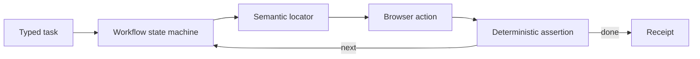
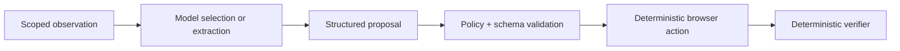
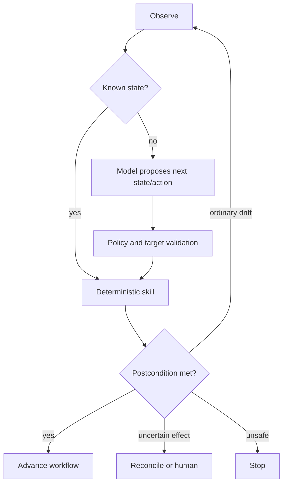

# Architecture, Perception, and Runtime Selection

> Decision: choose the least adaptive architecture that can meet the workflow's variability, then add model assistance behind typed boundaries.  
> Research date: 2026-08-31

The best browser-agent architecture is usually not “most autonomous.” It is the smallest system that tolerates the target site's real variability while keeping important effects deterministic and reviewable.

## Start with the workflow, not the framework

Collect a representative task corpus and answer:

- Are the applications owned, partnered, or arbitrary public sites?
- Are stable APIs, test IDs, roles, or accessible names available?
- Is the task read-only, draft-only, reversible, or high impact?
- Can success be checked by an API or deterministic page assertion?
- How often do layout, language, experiment, or content variants change?
- Are canvas, remote desktop, PDFs, or image-only controls common?
- Does the agent need authenticated sessions, MFA, downloads, uploads, or multiple tabs?
- What failure and per-task cost are acceptable?

If a direct API meets the need, prefer it. If a deterministic browser flow reaches at least the required success rate with acceptable maintenance, stop there. Add a model only for the unresolved variance.

## Architecture variants

### Deterministic automation

Use when:

- the site is known and its contracts are sufficiently stable;
- exact behavior, auditability, speed, and low cost matter;
- the organization can add test IDs or expose an API;
- the flow performs payments, submissions, permission changes, or destructive actions.

Strengths:

- reproducible, cheap, easy to unit and integration test;
- selectors and expected states can be code-reviewed;
- failures are usually localizable;
- no page text is interpreted as instruction.

Limits:

- brittle against unowned UI changes and experiment variants;
- workflow branches grow expensive if modeled by hand;
- cannot infer novel visual layouts or ambiguous human language reliably.

### Model-assisted automation

The model may choose among observed controls or extract structured data, but a deterministic executor still performs validated actions.

Use when:

- the task is mostly read-only or reversible;
- pages vary in labels or layout but retain recognizable semantics;
- a small candidate set can be generated deterministically;
- the model can return a typed choice instead of arbitrary code.

Do not let the model invent selectors, URLs, local paths, or JavaScript and immediately execute them. Resolve proposals against fresh, application-generated candidates.

### Guarded hybrid

Use deterministic “skills” for known states and a model only for routing, interpretation, or bounded recovery.

This is the production default because:

- known paths remain fast and testable;
- model calls concentrate on genuine ambiguity;
- sensitive commits stay in deterministic, approval-bound skills;
- recovery can be constrained to a safe action subset;
- task-specific data creates a path to replace model steps with learned deterministic flows later.

### Visual computer use

A screenshot-driven model can handle canvas, image-only controls, remote desktops, and poorly structured pages. It should be a fallback, not the first representation, because it is more expensive, loses semantic and origin information, and is vulnerable to coordinate drift and visual prompt injection.

For high-impact visual actions:

- capture full-page and target-region evidence;
- map coordinates back to a fresh element or hit-test result where possible;
- confirm visible label, accessible name, origin, and surrounding context;
- forbid action if viewport, scale, window, page epoch, or target bounding box changed;
- re-observe immediately before the effect.

## Perception stack

No single representation is complete. Compose them in a cost-ordered stack.

| Layer | Good at | Misses or distorts | Production use |
|---|---|---|---|
| Workflow/application API | Stable state and receipts | Unexposed UI-only state | Verification and high-impact effects where available |
| Semantic locators | Roles, labels, test IDs, visible text | Canvas, malformed semantics, ambiguous duplicates | First choice for known actions |
| Accessibility tree | Compact interactive structure, roles, names, states | Decorative/hidden visual state, canvas, layout; names may differ from visible content | Candidate discovery and model context |
| DOM + layout snapshot | Attributes, hierarchy, frames, shadow DOM, geometry | Rendered pixels, pseudo-content, complex canvas | Target resolution and provenance |
| Network/events | Navigation IDs, requests, downloads, response status | Visual or client-only state; response success may not mean business success | Lifecycle tracking and corroboration |
| Screenshot/vision | Visual layout, icons, canvas, overlays | Stable identity, exact semantics, origin, off-screen state | Fallback and cross-check |
| OCR | Text in images | Structure and action semantics; recognition errors | Narrow fallback only |

WAI-ARIA explicitly defines the accessibility tree as parallel to the DOM, with elements excluded or flattened under rules. An accessible snapshot is therefore a useful semantic projection, not a complete page representation. Treat accessible names as page-controlled data, not trusted labels.

### Observation envelope

Every observation should include:

- run, context, page, frame, navigation, document epoch, and observation IDs;
- canonical URL, scheme, origin, top-level site, opener, and redirect ancestry;
- viewport, device scale, scroll position, locale, and timestamp;
- semantic candidates with stable within-document references;
- DOM attributes and bounding boxes only for the scoped region;
- screenshot hash and optional artifact reference;
- network/download/dialog changes since the previous observation;
- source trust label and redaction summary;
- truncation and omission flags.

Do not send an unbounded full DOM to a model. Scope to the current task and visible or relevant regions, preserve provenance, and provide expansion tools with budgets.

### Target identity

An element reference is valid only inside its document epoch. Build a target fingerprint from:

- frame and origin;
- semantic role and normalized accessible name;
- application test ID when available;
- stable attributes chosen by policy;
- DOM ancestry hints;
- bounding box and visible text hash;
- candidate-set and observation IDs.

Before action, re-resolve the locator and verify that material fields still match. Never persist raw node handles across navigation. Playwright locators re-resolve against the current DOM; that behavior helps, but the application must still detect when the meaning of the resolved target changed.

## Browser control protocol

Observed 2026-08-31 baseline: Playwright 1.62.1, Puppeteer 25.9.0, Selenium 4.48.0, and the WebDriver BiDi Editor's Draft dated 2026-08-25. These are research pins, not floating dependency ranges.

| Choice | Use when | Proven convenience | Boundary or version-specific limitation |
|---|---|---|---|
| Playwright native protocol | Default application automation across its bundled Chromium, Firefox, and WebKit builds | Auto-wait/actionability, contexts, locators, downloads, tracing | Remote `browserType.connect()` requires matching major/minor Playwright versions; library controls are not egress or authorization |
| Playwright over CDP | A managed Chromium exposes CDP rather than Playwright protocol | Reuse most Playwright page APIs against an existing Chromium session | Chromium only; Playwright explicitly calls this significantly lower fidelity; separately qualify contexts, downloads, traces, events, and reconnect |
| Puppeteer over CDP | Chromium/Chrome-specific automation and DevTools integration | Deep protocol integration, locators, interception, direct CDP sessions | Chrome defaults to CDP; interception handlers can race unless every handler follows cooperative semantics; browser/package pairing is tight |
| Puppeteer over WebDriver BiDi | Chrome/Firefox portability with a Puppeteer API | BiDi is default for Firefox and opt-in for Chrome | Puppeteer 25.9 still lists gaps including accessibility, tracing, coverage, several emulations, response bodies, and CDP sessions; unsupported calls throw |
| Selenium WebDriver Classic plus BiDi | Existing Grid, broad binding estate, standards migration | Classic compatibility plus evented browsing-context, network, log, and script APIs | Binding and browser parity change independently; some BiDi APIs remain beta or low-level; test the exact driver/browser/binding tuple |
| Raw WebDriver BiDi | A standards-defined event or command is unavailable in the library wrapper | Cross-browser protocol direction with navigation/user-context/storage/network identities | The specification is an Editor's Draft; command presence does not prove identical browser implementation |
| Raw CDP | A Chromium-only capability is unavailable above | Full Chromium detail such as DOM snapshots and low-level events | Tip-of-tree can break without notice and has no backward-compatibility guarantee; stable 1.3 is old and smaller; raw Runtime/Network/Fetch can bypass application controls |

Prefer the highest-level API that exposes the required state. Keep raw protocol access behind a narrow adapter and compatibility tests. Record browser binary and protocol versions in every run.

### Protocol qualification suite

Do not approve an adapter because `goto` and `click` work. For every exact library/protocol/browser/provider tuple, prove:

- context creation and destruction; no cookie, cache, event, page, or service-worker bleed across two hostile tenants;
- top-level and subframe navigation IDs, same-document navigation, detachment, popup/opener, focus activation, dialog, and page-close ordering;
- request observation/interception for navigation, subresources, service workers, redirects, WebSockets, DNS/egress denials, and proxy authentication;
- accessibility snapshot, scoped DOM/shadow DOM, screenshot geometry, device scale, and candidate-to-hit-test agreement;
- download begin/completion/failure and byte retrieval; upload staging, remote-path behavior, and chooser identity;
- cancellation during wait, navigation, download, and a staged effect; timeout propagation and listener cleanup;
- disconnect, reconnect, browser crash, renderer crash, context loss, and provider timeout behavior;
- trace/recording/redaction coverage and the absence of cookies, authorization headers, secrets, and raw file bytes from ordinary telemetry.

Emit a machine-readable qualification result keyed by adapter manifest digest. A feature that passes locally but is untested over the production remote connection is unsupported.

### Playwright default, not Playwright policy

Playwright is the practical default for greenfield browser workers because locators, actionability, contexts, pages, downloads, and traces reduce implementation burden. Its own MCP project explicitly states that it is not a security boundary, and that origin filters do not cover every path such as redirects. The same distinction applies to any automation library: it executes browser mechanics; the application owns authorization, egress, isolation, and effects.

## Language selection

Playwright exposes the same core automation implementation through TypeScript/JavaScript, Python, Java, and .NET, while test-runner integration differs.

| Runtime | Prefer when | Watch for |
|---|---|---|
| TypeScript/Node.js | Greenfield Playwright service, shared web types, Playwright Test-based fixtures, rich browser tooling | Event-loop blocking, unbounded listeners/pages, runtime schema validation, dependency churn |
| Python | Existing ML/evaluation stack, BrowserGym or Browser Use integration, data-heavy extraction | Sync/async mixing, process isolation, packaging/browser binary reproducibility |
| Java/JVM | Existing enterprise service and Selenium/Grid estate | Binding/protocol parity, container resource cost, integration complexity |
| .NET | Existing Microsoft platform, typed service controls, Selenium/Playwright estate | Binding parity and deployment/browser packaging |
| Split control/worker | Organization needs a durable service runtime separate from browser ecosystem | Versioned RPC schemas, cancellation, backpressure, distributed tracing, more operational surface |

Do not split languages merely to appear modular. A single TypeScript service is usually the simplest greenfield Playwright implementation. A Python service is equally reasonable when the evaluation and model ecosystem dominates. Split only when team ownership, isolation, or scaling requirements justify the boundary.

See [Choosing an agent runtime language](../../languages/choosing-an-agent-runtime-language.md) for general runtime trade-offs.

## Model selection

Select models with application-specific evaluations, not public browser benchmark rank alone.

### Separate model roles where useful

- **Extractor:** converts a scoped observation into a schema.
- **Selector:** chooses one application-generated candidate.
- **Planner:** proposes a bounded next step or workflow branch.
- **Visual fallback:** interprets screenshots for states unavailable semantically.
- **Verifier:** only if no deterministic oracle exists; its output remains probabilistic.

One model can fill multiple roles at low volume. Split when cost, latency, data residency, or risk differs. Never use model separation as a substitute for policy.

### Evaluation dimensions

- success and forbidden-effect rate on exact production workflows;
- prompt-injection resistance with adaptive and indirect attacks;
- target selection accuracy across page, locale, viewport, experiment, and accessibility variants;
- structured-output validity and calibration when no action is safe;
- latency and token/image cost at realistic observation sizes;
- behavior under stale, contradictory, truncated, or malicious observations;
- recovery quality without retrying uncertain effects;
- version stability and provider data-handling controls.

Pin model identifier, provider configuration, system instruction hash, tool schema version, and decoding settings. Treat any model update as a behavior change requiring canary evaluation.

## Runtime boundaries

Use three separately governable planes even if they initially run in one deployable service:

### Durable control plane

Owns task state, budgets, policy, approval, effect ledger, credentials, evaluation metadata, and cancellation. It must survive browser crashes.

### Model plane

Receives minimized, provenance-rich observations and returns schema-valid proposals. It has no direct network, filesystem, credential, or browser handle.

### Disposable browser plane

Owns one temporary context or stronger isolation unit, browser events, artifact quarantine, and deterministic execution. It has no authority to widen the task.

Keep the interfaces typed from day one. They can remain in-process until independent scaling or isolation is needed.

## Framework and harness options

| Option | What it accelerates | Useful fit | Application still owns |
|---|---|---|---|
| Custom Playwright/Selenium | Precise workflows, typed tools, test integration | High-control production systems | Everything above browser mechanics |
| Playwright MCP/CLI | Fast tool exposure and accessibility-snapshot interaction | Local coding agents, prototypes, controlled harnesses | Security boundary, redirect/egress policy, tenant isolation, approvals, effect ledger |
| Stagehand | AI `act`/`observe`/`extract`, caching, deterministic replay of discovered actions | Hybrid workflows and prototyping | Authorization, cache freshness, idempotency, isolation, commit verification |
| Browser Use | Agent loop, browser/session abstractions, actions, history | Python prototypes and bounded internal workflows | Cross-tenant boundary, destination enforcement, credential/effect policy, production SLOs |
| Skyvern | Visual/LLM browser flows and hybrid selector/AI patterns | Variable workflow exploration or self-hosted evaluation | Claims validation, security boundary, deterministic commits, operations |
| BrowserGym/AgentLab | Standardized observations/actions and benchmark experiments | Research and evaluation | Production safety, credentials, tenancy, effects, service operations |
| Hosted browser service | Browser fleet, session connectivity, artifact infrastructure | Teams avoiding browser fleet operations | User intent, policy, data governance, credentials, approvals, vendor risk |

## Managed browser/session provider qualification

Use a managed provider when fleet patching, regional browser supply, session live view, and remote artifacts are materially cheaper than operating hardened workers. Do not use one merely to acquire stealth or CAPTCHA bypass. The provider becomes a privileged processor of authenticated pixels, storage, files, and network traffic.

The table records capabilities observed in primary documentation on 2026-08-31. Plan limits and security terms can change; contract and proof-of-fit results override this summary.

| Provider baseline | Useful capabilities | Documented limitations that affect design | Required application control |
|---|---|---|---|
| Browserbase API/Node SDK 2.19.0 | Playwright/Puppeteer/Selenium connections, contexts, live view, keep-alive reconnect, regions, proxies, cloud downloads/uploads, recordings | Playwright commonly connects over lower-fidelity CDP; sessions max at 6 hours; keep-alive is plan-gated and must be explicitly released; contexts persist broad Chromium user-data state and live indefinitely until deletion; changes sync only after close; recording is enabled by default and session replay records at most 10 tabs; concurrency/session-creation limits return 429 | One context per site/login and tenant; serialize use; set retention/recording explicitly; retrieve downloads through quarantine; external egress policy; reconcile before reconnect or effect retry |
| Browserless 2.56.0 | CDP/Playwright/Puppeteer connections, regional/shared or private fleets, persisted sessions, authenticated profiles, live URL, remote file transfer, proxies | Standard live reconnection and `processKeepAlive` require Puppeteer `disconnect()`; Playwright must use persisted-state reconstruction instead; only one client may attach to a persisted session; auth profiles omit `sessionStorage`, have a 2 MB state limit, are deleted after 30 unused days, and create per-session copies; the documented remote upload path is capped at 50 MB; plan time/concurrency limits vary; recording is opt-in but credentials/artifacts still require policy | Treat connection/live URLs as bearer secrets; single controller lease; bind profiles to tenant/account/site and TTL; verify remote file hashes; self-enforce egress/terms; never treat stealth/CAPTCHA features as authorization |

Qualify any other provider with the same questions: exact protocol fidelity, browser/image pinning, tenant boundary, profile semantics, egress and proxy enforcement, data region/retention, recordings and operator access, upload/download custody, live takeover, cancellation, reconnect, concurrency/429 behavior, incident evidence, deletion, export, price unit, and exit plan. BrowserStack/Sauce-style test grids may be excellent for cross-browser QA but are not assumed to provide production agent session persistence, profile custody, effect recovery, or human takeover; prove those separately.

### Provider decision gate

Reject or restrict a provider if any answer is unknown:

- Can we disable or govern video, DOM replay, network logs, and operator live access per session?
- Can we pin or at least canary the browser build, protocol behavior, region, extensions, certificates, and proxy route?
- Can a session, profile, download, upload, or live URL be accessed across projects or tenants under a stolen broad API key?
- Does cancellation release compute and revoke every reconnect/live endpoint within the SLO?
- Can we export receipts and normalized events without making provider replay the durable run state?
- What happens to an in-flight effect when the control socket drops, a regional pool fails, or the provider returns 429/5xx?
- Are CAPTCHA solving, residential proxying, fingerprint modification, and target automation contractually and legally allowed for this exact workflow?

Frameworks are components, not architectures. Before adopting one, trace how to:

- intercept every navigation, redirect, popup, download, upload, code-evaluation, and secret access;
- attach task, tenant, origin, and effect IDs to every action;
- disable generic escape hatches;
- isolate profiles and controller clients;
- pause for exact approval and resume without losing state;
- persist and reconcile uncertain effects;
- redact and export telemetry;
- pin and upgrade dependencies;
- run the application's attack and reliability suite.

If any critical path is opaque or unhookable, keep the framework in the proposal/perception layer and use an application-owned executor.

## Decision matrix

Score with real workflow data. A simple default follows:

| Condition | Recommended architecture |
|---|---|
| Owned application with stable test IDs and writes | Deterministic Playwright plus API verification |
| Public sites, read-only extraction | Model-assisted semantic observer; visual fallback |
| Variable form workflow with final submission | Hybrid: model fills/stages, deterministic reviewed commit |
| Money, identity, access, legal, medical, or external publishing | API/deterministic flow plus exact human approval; model only assists preparation |
| Canvas or remote desktop | Visual model in isolated worker with coordinate freshness and strict effects |
| Existing Selenium/Grid enterprise platform | Selenium/BiDi adapter with the same application policy contracts |
| Research benchmark | BrowserGym/AgentLab or benchmark-native harness, isolated from production |
| Everyday signed-in user browser | Avoid; if explicitly required, interactive local mode with visible takeover and no unattended high-impact actions |

## Architecture anti-patterns

- one generic `browser(action: string)` tool;
- the same LLM prompt deciding goal, target, permission, and success;
- a shared persistent profile for cost savings;
- accessibility snapshot as the only truth;
- arbitrary `evaluate` or `run_code` exposed to the planner;
- coordinates stored and replayed across navigations;
- framework action cache treated as authorization or idempotency;
- model-reported completion without an external oracle;
- browser context treated as a hostile-code sandbox;
- adding multiple agent roles before a single guarded loop is proven.

## Selection checklist

- [ ] A direct API and deterministic automation were evaluated first.
- [ ] The chosen perception layers cover actual page technologies and preserve origin/frame provenance.
- [ ] Model calls are bounded to specific roles with schema-valid output.
- [ ] Sensitive effects end in deterministic, approval-bound skills.
- [ ] The protocol and browser version are pinned and compatibility-tested.
- [ ] The runtime language matches the team's ecosystem and operational competence.
- [ ] Framework escape hatches can be disabled or isolated.
- [ ] Policy, credentials, effects, and verification remain application-owned.
- [ ] Model and framework changes are evaluated like code changes.

## Primary references

- [Playwright supported languages](https://playwright.dev/docs/languages)
- [Playwright 1.62.1 release](https://github.com/microsoft/playwright/releases/tag/v1.62.1)
- [Playwright `connectOverCDP` fidelity warning](https://playwright.dev/docs/api/class-browsertype#browser-type-connect-over-cdp)
- [Playwright locators](https://playwright.dev/docs/locators)
- [Playwright actionability](https://playwright.dev/docs/actionability)
- [Playwright ARIA snapshots](https://playwright.dev/docs/aria-snapshots)
- [Chrome DevTools Protocol DOMSnapshot](https://chromedevtools.github.io/devtools-protocol/tot/DOMSnapshot/)
- [WebDriver BiDi specification](https://w3c.github.io/webdriver-bidi/)
- [Selenium 4.48.0 release](https://github.com/SeleniumHQ/selenium/releases/tag/selenium-4.48.0)
- [Puppeteer 25.9.0 release](https://github.com/puppeteer/puppeteer/releases/tag/puppeteer-v25.9.0)
- [Puppeteer WebDriver BiDi support matrix](https://pptr.dev/webdriver-bidi)
- [WAI-ARIA accessibility tree](https://www.w3.org/TR/wai-aria/#accessibility_tree)
- [Stagehand npm package](https://www.npmjs.com/package/@browserbasehq/stagehand)
- [Browserbase contexts](https://docs.browserbase.com/platform/browser/core-features/contexts)
- [Browserbase keep alive](https://docs.browserbase.com/platform/browser/long-sessions/keep-alive)
- [Browserbase downloads](https://docs.browserbase.com/platform/browser/files/downloads)
- [Browserless 2.56.0 release](https://github.com/browserless/browserless/releases/tag/v2.56.0)
- [Browserless persisted sessions](https://docs.browserless.io/baas/session-management/persisting-state)
- [Browserless file transfers](https://docs.browserless.io/baas/features/file-transfers)
- [Browser Use releases](https://github.com/browser-use/browser-use/releases)
- [Skyvern hybrid browser automations](https://github.com/Skyvern-AI/skyvern/blob/main/docs/developers/browser-automations/overview.mdx)
- [BrowserGym repository](https://github.com/ServiceNow/BrowserGym)
- [Research packet](../../research/packets/browser-automation-agent-blueprint.md)
