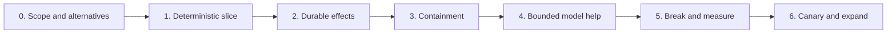

# Build Roadmap, Framework Boundaries, and Alternatives

> Decision: ship one narrow deterministic workflow, then add guarded model assistance only after the control and evidence boundaries work.  
> Research date: 2026-08-31

The fastest safe path is not a general autonomous agent. Build the effect system, session isolation, and oracle around one useful workflow. Broaden perception and planning after those guarantees are measurable.

## Target architecture by maturity



This is the complete Stage 0–6 path. Each stage has a measurable promotion gate. Do not compensate for a missing gate by adding a stronger model or more retries.

## Stage 0: choose one workflow and an alternative

### Deliverables

- representative tasks and page variants;
- exact requesting principal and target-site account mapping;
- allowed origins, data classes, action risk, budgets, and non-goals;
- deterministic completion oracle and forbidden-effect oracle;
- threat model covering page injection, origin transitions, sessions, files, and uncertain effects;
- target site legal/contractual/anti-automation review;
- direct API versus browser decision record.

### Stage 0 exit gate

- one product owner, security reviewer, and operator agree on what success and unacceptable harm mean;
- R4/R5 operations and required approval are explicit;
- the workflow can be reset safely in a test environment;
- target credentials and data are available through non-production fixtures.

## Stage 1: deterministic vertical slice

Build without a planner model:

- typed task envelope;
- disposable browser worker and fresh context;
- page/frame/navigation event normalization;
- semantic locators and actionability;
- named deterministic workflow states;
- deterministic completion oracle;
- minimal redacted telemetry;
- cancellation and cleanup.

### Suggested repository/module boundaries

```text
control/
  task-state
  policy
  approvals
  effects
worker/
  browser-lifecycle
  observation
  executor
  artifacts
adapters/
  target-workflow
  credentials
  model-gateway
evaluation/
  environment-reset
  tasks
  oracles
  attacks
```

This is a conceptual layout, not a requirement to create separate services or packages. Begin in one deployable service if that is simpler; preserve typed seams.

### Stage 1 exit gate

- normal golden journeys pass without retries masking failures;
- page/frame/popup/download lifecycles are observable;
- no shared authenticated context or arbitrary browser code exists;
- cleanup works after success, cancellation, timeout, and crash;
- browser/framework versions are pinned.

## Stage 2: durable effects and recovery

Add:

- durable run state with compare-and-set revision;
- action risk classification;
- stable effect IDs, write-ahead attempts, receipts, and commit probes;
- exact effect approval for R4;
- unknown-outcome reconciliation queue;
- reconstruction from verified business checkpoints;
- duplicate message and event handling;
- failure injection around every effect boundary.

### Stage 2 exit gate

- worker kill at every commit window creates no duplicate effect;
- unknown outcomes never use the ordinary retry path;
- the system distinguishes committed, proven absent, and unknown;
- approval changes or expiry fail closed;
- target-account concurrent mutation is fenced or serialized.

## Stage 3: containment and session security

Add:

- task/account-bound credential broker;
- encrypted, short-lived storage state or interactive login;
- non-root browser sandbox, seccomp, private temp storage, and resource limits;
- external DNS/egress enforcement across redirects and special schemes;
- artifact quarantine, type/size/scan policy, and opaque file handles;
- secret/personal-data redaction and artifact access controls;
- tenant/workflow/origin kill switches.

### Stage 3 exit gate

- cross-origin, DNS rebinding, private network, metadata, `data:`, `blob:`, popup, frame, and WebSocket tests pass;
- credentials are absent from model inputs and ordinary telemetry;
- cross-tenant profile/page/event/artifact/trace tests pass;
- sandbox and network enforcement are verified at worker startup;
- a compromised worker cannot reach the credential store or control plane broadly.

## Stage 4: bounded model assistance

Start with one narrow role:

1. deterministic observer generates a candidate set;
2. model selects a candidate or extracts a schema;
3. application validates proposal against fresh state;
4. deterministic executor acts;
5. deterministic oracle verifies.

Only then consider model-based recovery or visual fallback.

### Model rollout order

- read-only extraction;
- candidate classification or routing;
- selection among application-generated targets;
- reversible form staging;
- recovery to a known deterministic state;
- never an unreviewed generic high-impact commit.

### Stage 4 exit gate

- model output is schema-closed and cannot create URLs, selectors, secrets, artifacts, or approvals;
- task constraints are immutable across context compaction;
- stale candidate and origin changes invalidate proposals;
- model benefit over deterministic baseline is material and measured;
- cost/latency and failure behavior meet workflow targets.

## Stage 5: adversarial and reliability evaluation

Add the full suites from [Observability, evaluation, and testing](observability-evaluation-and-testing.md):

- page/AX/image/PDF/file/tool-error prompt injections;
- adaptive and multilingual variants;
- cross-origin and data-exfiltration attempts;
- stale targets and misleading success UI;
- crashes, dropped responses, duplicate queue deliveries, and eventual consistency;
- load, resource exhaustion, cancellation, and cleanup.

### Stage 5 exit gate

- zero unauthorized high-impact effects or secret exfiltration in the approved launch suite;
- duplicate-effect rate is zero under injected commit-window failures;
- unresolved-effect rate and human process meet the target;
- paired scorecard is no worse than the approved baseline on any safety invariant;
- raw artifacts and evaluator fixtures are access-controlled.

## Stage 6: production canary and selective expansion

Sequence:

1. shadow/decision replay;
2. synthetic or dedicated low-risk accounts;
3. production read-only tasks;
4. reversible drafts with human review;
5. a narrow deterministic R3/R4 effect with exact approval;
6. gradual tenant/workflow expansion.

Keep elevated evidence and low concurrency during the canary. Review every unknown effect and policy bypass attempt.

### Stage 6 exit gate

- SLOs, cost, capacity, kill switches, session revocation, and rollback work in production;
- operators can trace an effect from user intent to receipt;
- target-site drift alerts distinguish ordinary workflow failure from safety risk;
- incident and compensation procedures have been exercised.

### Selective expansion after the first canary

Add sites or actions only when they reuse the same guarantees. Each new integration needs:

- site/account authorization and origin graph;
- login/session and MFA strategy;
- perception coverage and deterministic skills;
- action risk and approval mapping;
- effect idempotency/receipt/reconciliation strategy;
- download/upload policy;
- resettable tasks, oracles, attacks, and load profile;
- cost and isolation class.

A new site is not “just prompt engineering.” It is a new external system and threat surface.

Treat expansion as continuous behavioral release engineering: convert reviewed drift, stale-target errors, unknown effects, policy denials, security incidents, user corrections, and compensation failures into candidate evaluations; replay current and proposed browser/model/tool/context/policy bundles; shadow and canary by site and effect class; and keep a pinned rollback path. Raw page content or model conclusions never self-promote into site skills, policy, or long-term memory.

## No-agent, API, RPA, or browser agent

Choose the simplest option that meets the real variability and effect semantics.

| Option | Choose when | Strongest property | Stop condition |
|---|---|---|---|
| No automation | Volume/value is low, rules are ambiguous, or human judgment/consent dominates | Lowest new technical and authority risk | Manual queue misses SLA or causes measurable quality/cost harm |
| Direct API/webhook/bulk import | Supported contract exposes the read or effect | Stable identity, idempotency, receipts, quotas, and observability | Required state exists only in UI or provider does not expose the workflow |
| Deterministic browser script | Known site and finite variants; selectors/test IDs can be maintained | Reproducible and cheap without model uncertainty | Measured drift/branching cost exceeds the supported value |
| Traditional RPA | Enterprise-owned desktop/browser process, attended flow, mature RPA governance | Existing recorder/orchestrator/attended-control estate | Untrusted public-web variation or typed security/effect boundary cannot be enforced |
| Guarded browser agent | Material page variation remains after API/deterministic work; bounded model assistance improves results | Adaptation behind application-owned effects | Model adds no measured benefit or required high-impact commit cannot be verified |
| General computer use | Workflow crosses browser and native applications with no narrower interface | Broad compatibility | Move to the [computer-use blueprint](../computer-use-agent/README.md); this browser blueprint no longer covers the full runtime |

### Alternative proof exercise

Implement or estimate the same representative workflow with no automation, direct API, deterministic browser code, and the proposed guarded agent. Use production-shaped tasks and include maintenance, human review, target/provider fees, failure recovery, and incident exposure. Approve the agent only if it delivers a material outcome advantage and every critical invariant is at least as strong as the simpler feasible option.

## Stage evidence ledger

Do not promote on a demo. Record the following evidence at each gate:

| Stage | Exercise | Minimum measurable evidence |
|---:|---|---|
| 0 | Run alternative proof and threat workshop on one resettable workflow | Signed scope/terms decision, risk map, exact oracles, representative corpus, chosen alternative |
| 1 | Execute deterministic golden and cleanup matrix | Version-pinned runs; lifecycle/event coverage; success, latency, resource baseline; zero cross-session leakage |
| 2 | Kill at every effect window and duplicate every control message | Zero duplicates; every outcome classified; reconciliation/receipt evidence and cancellation race results |
| 3 | Run origin/SSRF/injection/file/credential/tenant attacks | Zero capability widening, secret leak, prohibited egress, or artifact release; verified worker containment |
| 4 | Paired deterministic-versus-model evaluation | Material stratified success gain within cost/latency target; no safety regression; calibrated abstention |
| 5 | Run full perturbation/adversarial/failure/load corpus | Approved confidence intervals, recovery and redaction results, provider/protocol manifest qualification |
| 6 | Shadow then site/effect canary and rollback drill | Production SLO/cost/capacity evidence, zero catastrophic invariant failures, tested bundle rollback and runbooks |

## Custom, framework, or hybrid

### Custom application-owned harness

Choose when:

- the workflow includes high-impact effects or strict tenant/data boundaries;
- deterministic skills cover much of the task;
- exact telemetry, approval, retries, and recovery are differentiators;
- framework escape hatches or lifecycle are too broad;
- the team can operate browser infrastructure or use a narrow hosted browser adapter.

Benefits: precise controls, small tool surface, easier effect reasoning.  
Costs: more browser lifecycle, perception, and maintenance work.

### Framework-led agent

Choose when:

- prototyping or internal low-risk tasks dominate;
- the framework's action/observation model matches the workflow;
- credentials and effects are limited;
- the team accepts the dependency's lifecycle and can pin/test it;
- required policy interception points are available.

Benefits: faster initial capability, reusable agent loop and perception.  
Costs: broader behavior surface, churn, hidden assumptions, harder proof of application guarantees.

### Hybrid application shell

Recommended for many production systems:

- application owns task envelope, policy, credentials, approvals, effects, isolation, and evaluation;
- framework may own perception, candidate generation, or planning;
- application executor resolves and runs typed commands;
- framework history/cache is advisory and non-durable;
- sensitive commits use deterministic skills.

This retains useful framework work without making it the authority boundary.

## Framework convenience versus application guarantee

| Concern | Framework may provide | Application must prove |
|---|---|---|
| Browser control | Click/fill/navigation, waits, contexts | Exact action is authorized and fresh |
| Accessibility snapshot | Token-efficient semantic page view | Source is untrusted and incomplete; origin/frame provenance is preserved |
| Domain/origin filter | Basic URL guardrails | Every redirect/scheme/DNS/egress channel is enforced |
| Secret placeholders | Reduced model exposure in common paths | Secret is destination-bound and absent from all observations/logs/exfiltration paths |
| Agent loop/history | Planning and recovery convenience | Durable state, budgets, cancellation, and effect truth |
| Action cache/replay | Lower latency/model cost | Target preconditions, cache freshness, authorization, and idempotency |
| Profile/session reuse | Easier authentication | Tenant/account isolation, revocation, encryption, and no concurrent bleed |
| Docker image | Reproducible dependencies | Non-root sandbox, seccomp, egress, resource limits, patching |
| Trace/screenshot | Debug evidence | Redaction, retention, access, and correlation to effects |
| Confirmation callback | Pause point | Informed exact approval, identity, expiry, binding, and single use |
| Benchmark score | Comparative capability signal | Production task safety, correctness, cost, and failure recovery |

## Option notes

### Playwright directly

Strong default for custom/hybrid implementations. Its semantic locators, actionability, contexts, downloads, pages, and tracing reduce mechanical code. Use its library API behind typed skills. Do not expose arbitrary `page` access to the planner.

### Selenium/WebDriver BiDi

Good when the organization already uses Selenium/Grid or needs its language/infrastructure ecosystem. BiDi is the standards-oriented path for bidirectional events, but it remains a living draft; build feature/compatibility tests for the exact browser versions.

### Puppeteer/CDP

Good for Chromium-specific control or DevTools integration. Raw CDP access is powerful and can be experimental; constrain it to reviewed adapters.

### Playwright MCP or CLI

Useful for local coding agents, prototypes, and controlled harnesses. The MCP project explicitly says it is not a security boundary; its origin controls do not cover redirects. Generic evaluate/run-code capabilities are too broad for an ordinary production planner. Put it behind a disposable, credential-minimized environment or restrict it to development.

### Stagehand

The observed stable JavaScript package is 4.0.2 (published 2026-08-20), a recent major transition after the 3.7 line. The current public caching guide still uses a `/v3/` route, so documentation route and installed component version are separate qualification inputs. Its AI `act`/`observe`/`extract` and browser integration can support hybrid discovery. Pin the exact SDK/extension/protocol components, prove browser-handle ownership and shutdown, and qualify local versus Browserbase paths independently. Validate cached/discovered actions against current page fingerprints and never let them bypass policy, approval, or effect reconciliation.

### Browser Use

Offers a Python agent loop, browser/session abstractions, history, actions, and domain/secret mechanisms. It can accelerate prototypes. Keep target/domain enforcement and credential/effect guarantees outside it; version-scoped issues and rapid release cadence make pinning and attack tests essential.

### Skyvern

Its documented hybrid pattern—selectors for known DOM, AI for uncertain regions—is directionally aligned with this blueprint. Validate all vendor capability/resilience claims against the target workflow and keep commits application-owned.

### BrowserGym and AgentLab

Excellent for research, benchmark adapters, and common observation/action experiments. BrowserGym's repository warns that it is a research framework, not a consumer product. Do not turn benchmark infrastructure into the production control plane without adding all missing security and operations layers.

### Hosted browser platforms

Useful for fleet management, remote sessions, recording, and geographic capacity. Assess:

- tenant/process/profile isolation;
- encryption, region, retention, and operator access;
- session connectivity and controller authentication;
- egress and private-network policy;
- browser/extension/image patch control;
- incident evidence and deletion;
- contractual handling of credentials and page data;
- ability to export normalized events and pin versions.

They reduce fleet work, not application responsibility.

## Framework proof-of-fit exercise

Before adoption, implement the same small workflow in custom deterministic code and the candidate framework. Measure:

- lines and maintenance surface for the normal path;
- ability to intercept every page/frame/popup/redirect/download/upload;
- ability to remove arbitrary evaluate/code/path tools;
- tenant/profile isolation and controller multiplexing;
- policy and approval placement before the exact effect;
- durable cancellation/recovery after worker crash;
- effect IDs, receipts, and reconciliation hooks;
- trace redaction and schema export;
- dependency/browser pinning and upgrade behavior;
- golden, injection, origin, and commit-window failure results;
- p95 latency and cost per verified success.

Choose based on the hardest invariant, not the prettiest demo.

## Architecture decision record template

```markdown
ADR title: Browser automation architecture for <workflow>

- Date and owners:
- Task corpus and reset environment:
- Risk class and target accounts:
- Direct API option and why accepted/rejected:
- Deterministic baseline success/maintenance:
- Required model roles:
- Browser protocol/library and pinned version:
- Framework choice and version:
- Framework-owned conveniences:
- Application-owned guarantees:
- Session/isolation/egress class:
- Effect idempotency, receipt, and reconciliation:
- Approval design:
- Evaluation and release gates:
- Known limitations and prohibited workflows:
- Refresh triggers:
```

## Stop conditions

Stop expansion and redesign when:

- the target provides no way to verify a high-impact commit;
- the only working route requires disabling browser/web security or evading controls;
- credentials must enter untrusted model/page context;
- cross-tenant browser/profile isolation cannot be demonstrated;
- arbitrary model code is required for ordinary steps;
- a framework cannot expose or intercept a required effect boundary;
- unknown effects cannot be reconciled operationally;
- attack tests repeatedly show authority widening;
- cost per verified success or operator burden exceeds the supported value.

## Final production gate

- [ ] One architecture decision record exists per workflow family.
- [ ] Direct API and deterministic options were measured first.
- [ ] Framework convenience is explicitly separated from application guarantees.
- [ ] Task, policy, credential, effect, and evaluator schemas are versioned.
- [ ] R4 effects are deterministic, exact-approved, write-ahead recorded, and reconciled.
- [ ] Worker/profile/network isolation matches the risk class.
- [ ] Prompt-injection, origin, file, stale-state, and crash-window suites pass.
- [ ] Cost, capacity, SLOs, kill switches, incidents, and rollback are operational.
- [ ] Limitations and prohibited workflows are published to users and operators.

## Primary references

- [Playwright documentation](https://playwright.dev/)
- [Playwright MCP security notes](https://github.com/microsoft/playwright-mcp#security)
- [Selenium WebDriver BiDi](https://www.selenium.dev/documentation/webdriver/bidi/)
- [Puppeteer releases](https://github.com/puppeteer/puppeteer/releases)
- [Stagehand npm package](https://www.npmjs.com/package/@browserbasehq/stagehand)
- [Stagehand caching guidance (current public `/v3/` documentation route, checked 2026-08-31)](https://docs.stagehand.dev/v3/best-practices/caching)
- [Browser Use releases](https://github.com/browser-use/browser-use/releases)
- [Skyvern hybrid browser automations](https://github.com/Skyvern-AI/skyvern/blob/main/docs/developers/browser-automations/overview.mdx)
- [BrowserGym repository](https://github.com/ServiceNow/BrowserGym)
- [Research packet](../../research/packets/browser-automation-agent-blueprint.md)
