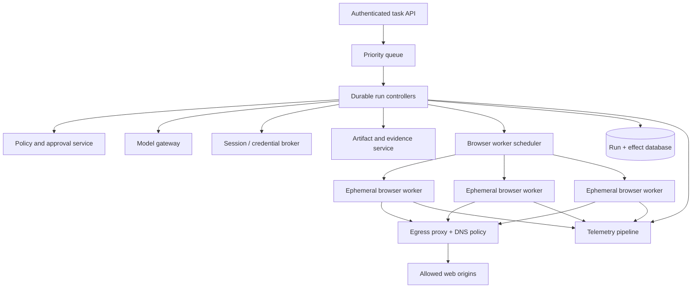

# Deployment, Performance, Cost, Scaling, and Operations

> Decision: scale isolated browser capacity with admission control; do not trade tenant or effect isolation for browser reuse.  
> Research date: 2026-08-31

Browser agents are stateful at the task level and resource-heavy at the worker level. A browser can spawn many renderer and utility processes, pages retain memory, screenshots and traces consume I/O, and models add variable latency and cost. The safe unit of scale is a disposable run worker backed by a durable controller.

## Reference deployment



### Control-plane responsibilities

- authenticate and authorize task intake;
- persist task/run/effect state and compare-and-set transitions;
- manage queue priority, cancellation, budgets, and deadlines;
- issue signed worker capabilities;
- broker credentials and approvals;
- route redacted model calls;
- reconcile uncertain effects;
- retain artifact metadata and telemetry;
- operate kill switches and rollout policy.

### Worker responsibilities

- start the pinned browser and one scoped context;
- enforce local capability checks;
- observe pages and normalize browser events;
- execute deterministic actions;
- quarantine files;
- stream redacted evidence;
- respond to cancellation quickly;
- close context and terminate after the run.

The worker must not become the durable source of truth.

## Isolation topology

### Default

- one browser context per run;
- one dedicated browser process/container for an untrusted public-web run, sensitive account, or tenant boundary;
- no concurrent tasks in one authenticated context;
- no persistent profile unless an exception explicitly serializes one account;
- microVM/VM isolation for high-value credentials, high-impact effects, or stricter tenant boundaries.

### Sharing trade-off

Multiple contexts in one browser process reduce startup and memory, but share:

- the unsandboxed browser process;
- process crashes and resource exhaustion;
- some browser-wide configuration and events;
- the controller endpoint and protocol implementation;
- potential library/framework bugs.

Context isolation is appropriate for trusted test workloads. It is not a default hostile-tenant boundary. If a pool reuses browser processes, segregate by tenant/trust class, never reuse contexts, cap lifetime/tasks, and destroy on anomaly.

## Hardened worker baseline

### Process and container

- run as a dedicated non-root UID;
- keep Chromium sandbox enabled;
- apply a reviewed seccomp profile and drop Linux capabilities;
- read-only root filesystem and signed/pinned image digest;
- private `tmpfs` or size-limited ephemeral volume per run;
- no host home, source tree, cloud credentials, SSH agent, or container socket mounts;
- PID, CPU, memory, disk, file descriptor, and wall-clock limits;
- no inbound network except the authenticated controller channel;
- outbound traffic only through the egress enforcement point;
- destroy rather than sanitize a worker after each sensitive run.

### Illustrative container policy

```yaml
worker_security:
  run_as_non_root: true
  read_only_root_filesystem: true
  allow_privilege_escalation: false
  capabilities_drop: ["ALL"]
  chromium_sandbox: true
  seccomp_profile: "browser-worker-v3"
  mounts:
    - name: run-tmp
      type: tmpfs
      size_limit: 512Mi
  network:
    default: deny
    egress_proxy: required
  resources:
    cpu_limit: "2"
    memory_limit: 3Gi
    pids_limit: 256
    open_files_limit: 4096
  lifetime:
    max_seconds: 900
    max_tasks: 1
```

This is a requirements example, not copy-paste configuration for a particular orchestrator. Browser sandbox support depends on host kernel and container settings; verify it by an automated startup check.

## Browser and dependency supply chain

- Pin automation library, browser binaries, base image digest, fonts, certificates, and OS packages.
- Generate an SBOM and scan images/dependencies.
- Verify downloaded browser artifacts and use trusted registries/mirrors.
- Remove compilers, package managers, shells, and debugging tools from the runtime image where not needed.
- Keep the controller and browser worker images separate.
- Subscribe to browser, automation framework, container runtime, kernel, and model-provider security advisories.
- Rebuild regularly even without application code changes.
- Canary browser updates against golden, attack, and failure suites before broad rollout.

Record the full runtime bill of materials on every run so an incident can identify affected sessions.

## Capacity model

Measure rather than assume. At minimum collect per workflow:

- worker startup and browser launch time;
- active contexts, pages, frames, renderer/utility processes;
- RSS/working set, CPU, file descriptors, disk/temp bytes, and network bytes;
- observation DOM/AX bytes and screenshots;
- trace bytes;
- model calls/tokens/images and latency;
- download/upload bytes and scan time;
- task/retry/reconciliation/human-wait duration.

### Simple capacity estimate

```text
required_concurrency ~= arrival_rate_per_second * p95_machine_service_time_seconds

worker_memory_budget >=
  browser_base
  + peak_pages * measured_page_peak
  + screenshot_and_trace_buffers
  + download_quarantine
  + safety_margin
```

Little's Law is a planning approximation, not an admission policy. Browser memory has heavy tails and adversarial pages can allocate aggressively. Load test the actual task mix and enforce hard per-worker limits.

## Admission control

Reject or queue work before resources are exhausted.

Inputs should include:

- tenant and target-account concurrency;
- workflow risk and priority;
- browser/isolation class;
- expected pages, duration, file bytes, and model cost;
- current CPU, memory, PID, temp disk, egress, scanner, and model quotas;
- target-origin rate policy;
- remaining SLO budget and queue age.

### Scheduler rules

- serialize mutations to the same target account/object unless concurrency is proven safe;
- reserve capacity for reconciliation and cancellation cleanup;
- keep R4 workflows on a stricter, smaller pool;
- prevent one tenant or origin from consuming the fleet;
- shed low-priority read work before high-impact reconciliation;
- do not launch a task that cannot finish before its deadline plus cleanup reserve;
- quarantine crash-looping domains/workflows/images.

### Queue, fairness, and backpressure contract

Use bounded queues per worker/isolation class. A queue item carries tenant, site, target account, workflow/effect class, deadline, estimated machine-seconds/memory/file bytes/model cost, and whether it is ordinary, reconciliation, cancellation, or cleanup work.

Recommended policy:

- weighted fair queuing across tenants, then fair sharing across sites/workflows; cap both tenant and origin concurrency;
- oldest-deadline-first only within a class where estimates and risk are comparable;
- dedicated minimum capacity for reconciliation, cancellation, and cleanup so read floods cannot strand uncertain effects;
- per-tenant token buckets for browser-minutes, model spend, file bytes, proxy bandwidth, and session creation;
- reject at intake with a typed retry time when queue wait would exceed the task deadline; do not accept unlimited work into durable limbo;
- propagate provider `429`, scanner saturation, proxy exhaustion, model limits, and artifact-store pressure to admission rather than retrying inside every worker;
- stop creating new sessions before host memory/PID/disk hard limits; drain or shed low-priority reads first;
- age legitimate low-priority work to prevent starvation, but never promote it above reconciliation or a safety operation.

Track `admitted`, `queued`, `rate_limited`, `shed`, `expired_before_start`, and `started_without_completion_reserve` separately. Backpressure is working when overload produces bounded queue age and explicit rejection—not browser OOMs, target bans, or lost cleanup.

### Capacity and fairness exercise

Replay a production-shaped mix with one noisy tenant, one slow origin, file-heavy tasks, R4 approval waits, a 10% browser crash burst, and a downstream scanner/model slowdown. Prove:

- no tenant exceeds its configured share while others have runnable work;
- reconciliation p95 start time stays within its SLO;
- queue memory and durable record growth remain bounded;
- session creation respects provider and origin rate limits;
- cancellations release queue and worker capacity within the target;
- the system rejects before resource exhaustion and recovers without an autoscaling storm.

## Pooling and warmup

Safe optimizations, in preferred order:

1. pre-pull pinned worker images;
2. keep hosts or microVM templates warm;
3. preload browser binaries and fonts in the image;
4. keep unauthenticated, tenant-segregated browser processes warm only after threat review;
5. never prewarm shared authenticated contexts or copy broad profiles.

Bound warm-process age, task count, memory, and failure count. Destroy on protocol anomaly, renderer crash burst, unexpected page/event, security denial, or profile contamination signal.

## Performance optimization

Optimize after establishing correctness and isolation.

### Reduce model work

- deterministic skills for common states;
- scope accessibility/DOM context to relevant candidates;
- use smaller extraction/selection models where evaluations pass;
- call visual models only for semantic gaps;
- cache model-neutral observations and deterministic selectors with strict page fingerprints;
- summarize history as typed workflow state;
- batch read-only extraction where it does not enlarge data exposure.

### Reduce browser work

- close unused pages and contexts promptly;
- block unnecessary resource types only if it does not change workflow semantics;
- avoid full-page screenshots/traces on every step;
- use event-driven waits and explicit readiness predicates;
- stream large downloads rather than buffer in memory;
- cap page count, redirects, response body capture, and DOM scope;
- recycle processes before long-lived fragmentation or leaks accumulate.

### Protect reliability while optimizing

- do not skip actionability or re-observation for latency;
- do not share profiles or cross-tenant browser processes to save startup cost;
- do not suppress security headers, site isolation, sandbox, or TLS checks;
- do not use action caches to bypass approval or current-state validation;
- do not drop receipt/effect evidence to reduce storage.

## Cost model

Track cost per attempted and successful task:

```text
total cost =
  model input/output/image cost
  + browser compute duration
  + worker/VM startup
  + network egress
  + artifact/trace storage and scanning
  + durable orchestration and telemetry
  + human approval/review time
  + retry and reconciliation cost
```

Report:

- cost per verified success;
- cost per workflow/risk/tenant;
- wasted cost from retries, loops, stale actions, and invalid tasks;
- incremental safety/evidence cost;
- marginal benefit of model or framework changes.

A cheaper model that causes more browser steps or human review can cost more end to end. A full visual screenshot on every step can dominate model cost and latency. Measure the whole loop.

## Autoscaling

Scale on a composite signal:

- queued machine-seconds by worker class;
- runnable tasks, excluding human-wait and blocked account tasks;
- active worker resource saturation;
- model/scanner/egress downstream capacity;
- reconciliation backlog and oldest uncertain effect;
- cold-start time and minimum safe headroom.

Do not scale solely on queue length: one long, file-heavy, high-isolation task is not equivalent to a short read. Give reconciliation its own priority and capacity floor.

## Multi-region and data residency

- Keep tenant credentials, page artifacts, and traces in approved regions.
- Route the browser and model gateway consistently with data policy.
- Avoid active-active execution for the same effect or target account unless the ledger provides strong fencing.
- Use globally unique effect IDs and a single authoritative owner/lease for an active run.
- Fail over by loading durable state, reconciling open effects, and starting a fresh worker; never copy a live browser process.
- Document target-site geo/risk behavior because region changes can trigger MFA, fraud, or content variants.

### Regional cell design

Prefer mostly independent cells: regional admission/scheduler, workers, egress/proxy, credential projection, artifact store, telemetry buffer, and a fenced shard of run/effect ownership. Keep a globally discoverable but strongly fenced run owner; do not let two cells actively drive the same session, account mutation, or effect.

Classify data before replication:

| Data | Cross-region rule |
|---|---|
| Run/effect metadata and bundle manifests | Replicate only to approved recovery region with monotonic fencing |
| Cookies, profiles, reconnect/live URLs | Do not replicate by default; reacquire/re-authenticate in-region |
| Screenshots, DOM/network evidence, downloads/uploads | Stay in policy region; replicate only under explicit retention/data-residency rule |
| Evaluation aggregates | Export only after minimization and tenant-safe aggregation |
| Receipts and approval audit | Replicate per legal/audit policy; keep integrity chain |

Region is part of site qualification. A failover that changes IP geography, browser build, proxy class, locale, timezone, or payment risk signal is a new behavioral variant and may require human reauthentication or a fresh quote/review.

## SLOs and alerts

### Service indicators

- verified task success rate;
- unauthorized and duplicate effect count;
- unknown-effect count and reconciliation age;
- p50/p95/p99 machine latency and queue wait;
- browser crash/OOM/sandbox-start failure rate;
- policy denial and injection-suspected rate;
- cross-origin block and egress-denial rate;
- target auth failure/lockout rate;
- cleanup/session-revocation failure rate;
- per-success cost and resource saturation.

### Example workflow SLO contract

Set values from business risk and measured baselines. The following illustrates a production contract; it is not universal:

| Indicator | Example objective | Budget/action |
|---|---:|---|
| Unauthorized R4/R5 or cross-tenant effect | `0` | Immediate page, freeze affected bundle/site/effect class |
| Duplicate external effect | `0` for R4; `< 1 ppm` for approved R3 corpus/traffic | Immediate R4 page; reconcile and stop retry path |
| Accepted read-task verified success | `>= 99.0%` over 28 days | Freeze expansion below budget; stratify site drift from platform failure |
| Effect outcomes classified | `100%` | Missing ledger/receipt path blocks further commits |
| Unknown effect begins reconciliation | p99 `<= 60 s` | Reserve queue/pool capacity and page oldest backlog |
| R4 unknown effect resolved or handed to human | p95 `<= 15 min`, workflow-specific maximum | Stop the effect class if backlog/age budget is exceeded |
| Cancellation before `attempting` fenced | p99 `<= 2 s` | Page on breach; revoke capabilities/session |
| Worker/session cleanup after terminal run | `>= 99.99%` within 2 min | Quarantine provider/image pool; credential revocation retry |
| Queue wait for admitted standard task | p95 `<= 30 s` | Backpressure or scale; do not hide in execution latency |
| Reconciliation start during single-cell loss | p95 `<= 5 min` | Invoke DR load plan; shed ordinary reads |

Report numerator, denominator, exclusions, observation window, and error-budget burn. Human wait and target-site scheduled outage may be shown separately but must not disappear from user end-to-end latency.

### Page immediately on

- any unauthorized R4/R5 effect or secret exfiltration signal;
- duplicate high-impact effect;
- cross-tenant session/artifact/event leak;
- worker access to prohibited internal/metadata network;
- sandbox disabled unexpectedly in production;
- effect ledger inconsistency or lost `attempting` record;
- kill switch/session revocation failure.

Operational noise such as ordinary selector drift should create workflow alerts, not bury safety incidents.

## Rollout strategy

1. Offline evaluation against pinned environments.
2. CI browser integration and attack tests.
3. Shadow/decision replay with production-shaped redacted observations.
4. Read-only canary on dedicated accounts.
5. Reversible drafts with operator review.
6. A small set of deterministic commits with exact approval.
7. Tenant/workflow expansion under error and safety budgets.

Pin the previous known-good browser image, framework, model, prompt/tool schema, and policy for rollback. Roll back on safety invariant failure even if aggregate success improved.

## Kill switches

Support independently:

- global task intake pause;
- workflow, origin, tenant, target account, model, browser image, and framework version pause;
- deny all R3/R4 effects while allowing observation or reconciliation;
- revoke approval class or credential type;
- cancel active runs before next effect;
- terminate workers and revoke sessions;
- block an egress destination immediately.

Test kill propagation latency and behavior during approval, navigation, download, effect attempt, and reconciliation.

## Incident response

### Unauthorized or suspicious effect

1. pause relevant high-impact effects and isolate affected origin/workflow/version;
2. revoke sessions, credentials, capabilities, and approvals;
3. preserve access-controlled task/effect/receipt evidence;
4. reconcile whether the effect committed and apply an authorized compensation if possible;
5. identify affected tenants/accounts and meet notification obligations;
6. reproduce with evidence/decision replay, not production effect replay;
7. add an attack/regression test and update policy or architecture;
8. restore via staged canary.

### Worker compromise or isolation breach

1. stop scheduling on the image/host pool;
2. terminate workers and rotate reachable credentials;
3. block indicators at egress and inspect control-plane access;
4. preserve host, image, network, and worker evidence;
5. rebuild from trusted sources; do not return sanitized workers to service;
6. assess browser/kernel/container vulnerabilities and tenant impact.

### Duplicate or uncertain effect backlog

1. stop ordinary retries for the operation;
2. prioritize reconciliation capacity;
3. query target receipts by stable effect/client identifiers;
4. escalate unresolved cases with complete human-readable effect previews;
5. fix commit probes before re-enabling automation.

## Disaster recovery

Back up and test restore of:

- task/run/effect ledger and schema versions;
- policy versions and signed configuration;
- approval/receipt metadata;
- artifact metadata and retention state;
- evaluation baselines and deployment manifests.

Do not rely on restoring ephemeral browsers. After control-plane recovery, fence old workers, reconcile `attempting`/unknown effects, then reconstruct new sessions.

### Recovery-load plan

Normal peak sizing is insufficient: a cell loss creates reconnect attempts, credential refreshes, reconciliation probes, artifact finalization, and queued new work at once. Reserve or pre-negotiate recovery capacity for the control database, target read probes, credential broker, managed-browser session creation, egress/proxy, scanner, and human operations.

During recovery:

1. stop new write-capable intake and fence the failed cell's leases;
2. restore the durable ledger and verify its integrity/revision watermark;
3. prioritize `attempting`, `cancel_requested`, and `outcome_unknown` effects by impact and age;
4. rate-limit target probes to avoid turning recovery into account lockout or site outage;
5. reconstruct sessions only after effect status and regional policy are known;
6. admit reads and new writes gradually under a recovery budget;
7. compare recovered receipts, unresolved backlog, and old-worker termination evidence before declaring recovery complete.

Test quarterly with a full-cell blackhole plus delayed provider APIs and eventually consistent target receipts. Measure RPO for durable intent/effect/audit state, RTO for safe read work, time to fence old controllers, p95 time to begin reconciliation, backlog clearance time, duplicate/unauthorized effects, and peak recovery cost. A DR test that restores the database but does not exercise effect reconciliation is incomplete.

## Operations checklist

- [ ] Worker image, browser, framework, model, policy, and evaluator are pinned and recorded.
- [ ] Untrusted-web workers run non-root with sandbox, seccomp, egress, and resource limits.
- [ ] Context/process/VM isolation matches tenant and risk class.
- [ ] Admission control reserves reconciliation and cleanup capacity.
- [ ] Account/origin concurrency and rate limits are enforced.
- [ ] Cost is measured per verified success, including retries and humans.
- [ ] Autoscaling uses workload and downstream capacity, not queue length alone.
- [ ] Rollback and scoped kill switches are exercised.
- [ ] Safety invariants page separately from workflow drift.
- [ ] Incident and disaster recovery begin with effect reconciliation.

## Primary references

- [Playwright Docker guidance](https://playwright.dev/docs/docker)
- [Playwright browser contexts](https://playwright.dev/docs/api/class-browsercontext)
- [Playwright parallelism](https://playwright.dev/docs/test-parallel)
- [Browserbase concurrency management](https://docs.browserbase.com/optimizations/concurrency/overview)
- [Browserbase session timeouts](https://docs.browserbase.com/platform/browser/long-sessions/timeouts)
- [Browserbase browser regions](https://docs.browserbase.com/optimizations/latency/multi-region)
- [Browserless best practices and limits](https://docs.browserless.io/baas/best-practices)
- [Browserless connection regions](https://docs.browserless.io/overview/connection-urls)
- [Chromium sandbox design](https://chromium.googlesource.com/chromium/src/+/refs/heads/main/docs/design/sandbox.md)
- [Chromium process model and site isolation](https://chromium.googlesource.com/chromium/src/+/main/docs/process_model_and_site_isolation.md)
- [Chromium security architecture for agents](https://chromium.googlesource.com/chromium/src/+/main/docs/security/security-for-agents.md)
- [OWASP Secrets Management Cheat Sheet](https://cheatsheetseries.owasp.org/cheatsheets/Secrets_Management_Cheat_Sheet.html)
- [Research packet](../../research/packets/browser-automation-agent-blueprint.md)
