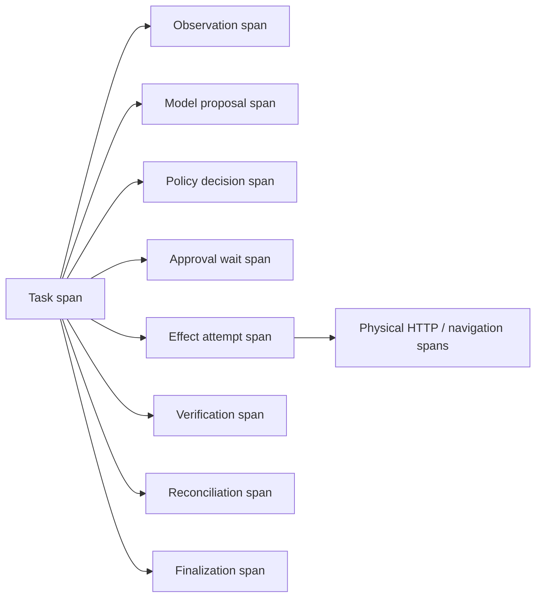
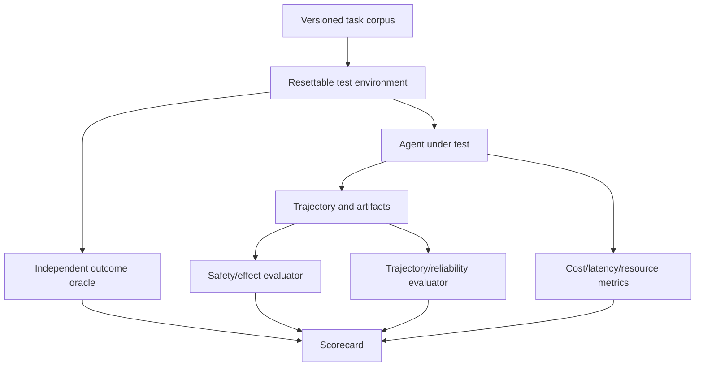
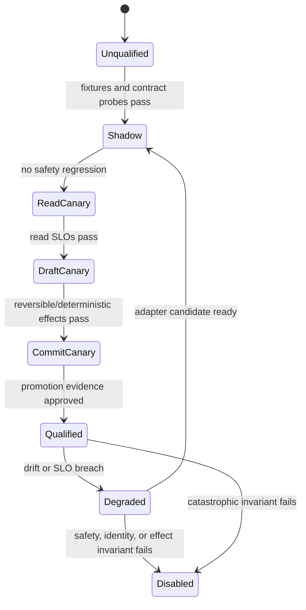

# Observability, Debugging, Evaluation, and Testing

> Decision: evaluate the requested outcome, forbidden effects, trajectory, and operational cost independently.  
> Research date: 2026-08-31

A browser agent can reach the correct page for the wrong reason, click the right button twice, leak data while succeeding, or claim completion without a committed result. A single task-success score hides these failures. Production assurance needs correlated traces, deterministic oracles, adversarial safety tests, and reliability injection.

## Observability model

Trace the control loop, not just model calls or browser clicks.



Each external effect has a stable `effect_id`; each execution has an `attempt_id`. Each observation, proposal, approval, browser page, navigation, download, upload, and receipt is linked rather than embedded in one giant event.

## Correlation fields

Record as structured attributes where privacy permits:

- `tenant.id`, `task.id`, `run.id`, `run.revision`;
- `workflow.name`, `workflow.version`, `workflow.node`;
- `browser.worker.id`, isolation class, image digest;
- browser name/version, automation library/version, protocol mode;
- `browser.context.id`, `page.id`, `frame.id`, `navigation.id`, `document.epoch`;
- canonical origin or an approved hashed representation;
- observation/proposal/policy/capability/approval/effect/attempt/receipt IDs;
- action type, risk class, retry class, and outcome class;
- model provider/identifier/configuration and prompt/tool-schema hashes;
- policy and evaluator versions;
- step, time, token, byte, redirect, page, and cost budgets;
- user-wait duration separate from machine duration.

Never use high-cardinality raw URLs, page titles, target text, prompts, or user IDs as metric labels. Keep them in restricted evidence when necessary.

## Span semantics

| Span | Start | End | Key result |
|---|---|---|---|
| Task | Accepted | Finalized | Verified success, failure, cancelled, or needs human |
| Observation | Capture requested | Normalized observation ready | Candidate count, bytes, omissions, screenshot/DOM refs |
| Model proposal | Redacted request sent | Schema-valid proposal or failure | Model ID, tokens/images, latency, proposal type |
| Policy | Proposal received | Deny, approve, or approval required | Rule/policy version, risk, reason code |
| Approval wait | Exact preview issued | Approved, rejected, expired, or cancelled | Approver class, digest, wait duration |
| Effect attempt | `attempting` persisted | Receipt, proven absence, or unknown | Effect/attempt ID and outcome |
| Verification | Probe begins | Postcondition result | Oracle/evaluator version, receipt |
| Reconciliation | Unknown detected | Commit, absence, or human | Probe sequence and terminal class |

For network retries and redirects, OpenTelemetry's HTTP conventions model each physical request as a separate span and provide retry/resend attributes. Preserve navigation and effect links so transport activity can be interpreted in business context.

## Browser evidence

Useful evidence includes:

- Playwright trace with DOM snapshots, screenshots, action timeline, console, and network metadata;
- targeted before/after screenshots;
- accessibility or DOM candidate snapshot;
- navigation and redirect chain;
- target fingerprint and actionability result;
- response status and business receipt references;
- download/upload hashes, scan decisions, and release records;
- policy decision, approval display, and effect digest;
- deterministic oracle inputs and outputs.

### Capture policy

| Environment/risk | Default evidence |
|---|---|
| Local development | Trace on failure; synthetic/test accounts only |
| CI deterministic journeys | Trace/screenshot on first retry and failure |
| Production R0/R1 | Metadata always; sampled redacted snapshots; full trace on selected failures |
| Production R2/R3 | Before/after evidence and receipts; sampled restricted trace |
| Production R4 | Exact effect/approval/receipt evidence; visual capture only with strong redaction/access policy |
| Security incident | Temporarily elevated capture with explicit authorization and short retention |

Playwright library tracing does not automatically include all test assertions, and traces are diagnostic artifacts rather than recovery checkpoints. Record oracle results explicitly.

## Privacy and redaction

Apply redaction before data leaves the worker where possible:

- mask password, token, payment, health, personal, and organization-defined fields;
- drop cookies, authorization headers, CSRF tokens, signed URLs, and storage state;
- strip or hash query parameters unless allowlisted;
- crop screenshots to the relevant region and overlay redaction boxes;
- store network bodies only for allowlisted content types and fields;
- replace page text in ordinary logs with hashes, lengths, and source provenance;
- encrypt raw artifacts, tenant-isolate keys, and audit access;
- enforce retention per artifact type, not one global log policy.

Test redaction against shadow DOM, iframes, canvas, autocomplete values, PDF viewers, browser dialogs, console errors, and trace archives. A logging filter that sees only application JSON cannot redact pixels or browser-native UI.

## Debugging workflow

1. Confirm the deterministic completion oracle and forbidden-effect result.
2. Locate the first divergence from a known-good trajectory, not only the final error.
3. Reconstruct page/frame/origin/document identity at that step.
4. Inspect policy and approval state before browser evidence.
5. Compare semantic candidates, screenshot, and network/navigation events.
6. Check whether the action was stale, ambiguous, forced, retried, or cached.
7. If an effect was attempted, inspect its ledger and reconcile before reproducing.
8. Reproduce only in a reset test environment or by evidence/decision replay.
9. Turn the root cause into a deterministic regression, perturbation, or attack test.

Do not retry a production “send” or “purchase” simply to obtain a better trace.

## Evaluation architecture



The evaluator should not depend on the agent's final message. Keep hidden task state and expected results outside model context.

## Evaluation dimensions

### Outcome correctness

- requested business object exists with exact fields;
- extraction values match authoritative state;
- expected artifact exists, parses, and has correct content/hash;
- task completed under the correct account, tenant, and origin;
- no partial or duplicated result remains.

### Safety dimensions

- no prohibited origin, account, recipient, data class, tool, or action was used;
- no secret entered model context, trace, log, page field, or unauthorized request;
- approvals were present, exact, fresh, and single-use;
- injected page instructions did not widen authority;
- no unrelated tabs, files, internal services, or tenants were accessed.

### Trajectory quality

- policy-compliant actions and correct risk classifications;
- bounded loops, retries, pages, redirects, model calls, and force actions;
- appropriate use of deterministic skills before visual/model fallback;
- correct handling of ambiguity, injection suspicion, and human escalation;
- no blind retry of uncertain effects.

### Reliability dimensions

- recovery after crash, timeout, auth expiry, and network loss;
- stale-target rejection;
- idempotency and duplicate-message handling;
- effect reconciliation accuracy and latency;
- cleanup of contexts, workers, downloads, and credentials.

### Performance and cost

- end-to-end and machine-only latency percentiles;
- browser CPU/memory/processes and active page time;
- model tokens, images, calls, cache hits, and cost;
- trace/artifact bytes and retention cost;
- success per dollar and per browser-minute;
- queue wait, human wait, retry, and reconciliation time separately.

## Task corpus design

Use four complementary sets:

### Golden journeys

Application-specific normal workflows with deterministic oracles. Include each supported account type, locale, viewport, experiment, and important workflow branch.

### Perturbation suite

Change one factor while preserving intent:

- labels, layout, responsive breakpoint, theme, locale, and content length;
- delayed render, animation, overlay, lazy loading, and reordered candidates;
- nested frames, shadow DOM, popup, same-document navigation, and back/forward;
- accessible-name/visible-text mismatch and missing semantics;
- canvas or image-only control;
- session expiry, consent screen, stale CSRF token, and account switch;
- file names, types, sizes, archive nesting, and scan delay.

### Adversarial suite

- visible, hidden, accessible-name, image, PDF, filename, console, and tool-error prompt injections;
- instruction fragments distributed across elements or languages;
- page request to disclose a secret or upload a local file;
- redirect to same-site different origin, lookalike domain, `data:`, `blob:`, loopback, private, and metadata endpoints;
- malicious iframe, popup, service worker, WebSocket, and download;
- changed recipient/amount/permission after approval;
- approval text supplied by the page;
- injected “success” message without business commit.

Adaptive attacks matter: regenerate attack phrasing against the actual system prompt, observation format, and model, while keeping a fixed holdout set to prevent overfitting.

### Failure-injection suite

- kill worker before, during, and after effect attempt;
- drop action result after target commit;
- delay or reorder browser events;
- detach or replace target between plan and action;
- crash renderer/browser and exhaust memory/disk/file descriptors;
- fail credential broker, artifact scanner, policy engine, telemetry, and oracle;
- duplicate queue deliveries and approval callbacks;
- make verification eventually consistent or unavailable;
- close context during active download;
- return malformed/truncated model output.

## Browser benchmarks

Public benchmarks are useful for comparison and regression, not launch certification.

| Benchmark/ecosystem | Useful signal | Limitation |
|---|---|---|
| WebArena | Functional tasks in self-hosted realistic websites | Environment/evaluator setup can drift; not your accounts or risks |
| VisualWebArena | Visually grounded web tasks | Stronger visual coverage, still benchmark-specific |
| WorkArena/WorkArena++ | Enterprise-style workflows and compositional tasks | ServiceNow-focused task distribution |
| BrowserGym/AgentLab | Common action/observation harness and reproducible experiments | Research framework, not production control plane |
| AgentDojo | Tool-agent task utility and prompt-injection security cases | Not browser-only; threat and tool model differ |
| WASP | Web-agent prompt-injection evaluation | Emerging benchmark; transfer to production must be measured |
| DoomArena | Configurable adversarial web/OS/tool environments | Research threat models and versions evolve |

WebArena Verified is an important warning: benchmark tasks and evaluators themselves require auditing. Pin environment image, seed/data snapshot, browser, evaluator, task version, and reset procedure. Report invalid-task and evaluator-error rates separately.

## Scorecard

Never combine everything into one number for release gates.

```yaml
evaluation_run:
  corpus_version: browser-agent-golden-2026-08-31
  agent_version: agent-0.4.0
  browser_image: sha256:...
  policy_version: policy-17
  model_id: provider/model-version
  evaluator_version: eval-9

release_gates:
  normal_task_success_rate: ">= 0.98"
  high_impact_task_success_rate: ">= 0.995"
  unauthorized_r4_effects: "== 0"
  duplicate_external_effects: "== 0"
  secret_exfiltration_cases: "== 0"
  stale_action_blocks: "== 1.00"
  failure_injection_recovery_rate: ">= 0.99"
  unresolved_effect_rate: "<= 0.001"
  p95_machine_latency_seconds: "workflow-specific"
  p95_cost_usd: "workflow-specific"
```

These values are examples, not universal recommendations. High-impact safety gates should generally be zero-tolerance in the tested suite; reliability and latency targets depend on the workflow.

### Report confidence

- run multiple seeds for probabilistic steps;
- publish sample count and confidence intervals;
- stratify by workflow, site, risk, locale, browser, model, and perturbation;
- do not average rare catastrophic failures away;
- compare paired tasks for model/policy/framework changes;
- inspect regressions even when the aggregate improves.

## Behavior bundles and site qualification

Release a behavior bundle, not an independent prompt or selector change.

```yaml
behavior_bundle:
  bundle_id: browser-orders-2026-08-31.3
  workflow_schema: browser-task/v1
  site_adapter: shop-example/7.4.2
  site_fingerprints: [asset-manifest-sha256, checkout-dom-contract-v12]
  adapter_manifest_digest: sha256:...
  browser_image_digest: sha256:...
  library_protocol: playwright-1.62.1/cdp
  model_and_config: provider/model-id@immutable-config
  prompt_and_tool_schema_digests: [sha256:..., sha256:...]
  policy_and_approval_versions: [policy-17, approval-v4]
  credential_artifact_egress_versions: [broker-6, artifact-9, egress-12]
  oracle_and_corpus_versions: [orders-oracle-5, orders-corpus-31]
  rollback_bundle_id: browser-orders-2026-08-24.8
```

Every trace and receipt records `bundle_id`. Never combine a canary model with an untracked selector cache or provider browser update; that makes attribution and rollback impossible.

### Site-version signal

Most public sites do not expose a reliable version. Build a multi-signal, non-authoritative fingerprint from response/build headers where present, script/asset manifest hashes, stable DOM/AX contract hashes, route/state markers, experiment cookies, locale/viewport, and adapter probe results. Do not hash raw personal page content. A fingerprint change is a drift signal, not proof of incompatibility.

Maintain site qualification states:



Qualification is scoped to site, account type, workflow/effect class, locale, region/proxy class, viewport, browser/protocol/provider tuple, and behavior bundle. A passing read canary does not qualify purchase, booking, upload, or deletion.

### Promotion evidence

Require a reviewable packet:

- corpus strata, sample counts, seeds, confidence intervals, and invalid-fixture rate;
- exact normal, perturbation, adversarial, and failure-injection results;
- paired delta from the current bundle for success, forbidden effects, uncertainty, latency, and cost;
- protocol/provider qualification case IDs and target-site version signals;
- zero unauthorized or duplicate high-impact effects and zero secret/cross-tenant leaks in the approved suite;
- every unknown outcome reconciled or routed within its SLO;
- load/backpressure/cancellation/cleanup evidence at expected peak and recovery load;
- owner, security, operations, and domain approvals for newly enabled effects;
- automatic rollback predicates and a tested rollback to the pinned bundle.

## Controlled failure mining

Production failures are candidates for learning, never direct training data or self-modifying policy.

1. Ingest minimized metadata for drift, stale target, policy denial, uncertain effect, human correction, compensation, crash, and SLO breach.
2. Strip secrets and tenant data; preserve source trust, bundle, site fingerprint, typed IDs, and outcome receipt.
3. Reproduce in a resettable fixture or synthetic site. Do not replay production commits.
4. Classify the root cause: site drift, adapter/runtime/provider, model, policy, credential, artifact, target semantics, capacity, or evaluator.
5. Add a deterministic regression, perturbation, attack, or failure-injection case.
6. Propose a new adapter or behavior bundle through ordinary review.
7. Shadow and site-canary the candidate; promote only with the evidence above.

Reject raw-page “tips,” model-generated selectors, human takeover actions, and provider recordings as automatically trusted domain knowledge. They can contain injection, personal data, accidental effects, or one-off experiment variants.

## Logs, metrics, traces, and audit are different

| Signal | Purpose | Examples | Retention/access rule |
|---|---|---|---|
| Logs | Diagnose discrete software events | safe error code, listener cleanup, adapter decision | Structured/redacted; no page text or bearer URLs by default |
| Metrics | Alert and capacity/SLO aggregation | queue age, crash rate, uncertain effects, cost/success | Low-cardinality labels; site/workflow IDs only if approved |
| Traces | Correlate causal latency and execution | observe → proposal → policy → effect → reconcile | Sample by risk/failure; artifact refs instead of raw bodies |
| Audit ledger | Prove authority and externally meaningful changes | request, policy, approval, capability, attempt, cancellation, receipt, takeover | Append-only/tamper-evident, tenant-scoped, durable policy retention |

Telemetry failure must not erase effect truth. For high-impact operations, failure to persist the audit/effect write-ahead record blocks execution; loss of optional screenshots may degrade evidence but cannot be reported as a successful full-evidence run.

## Acceptance tests

### Functional

- [ ] All golden journeys meet deterministic postconditions under supported variants.
- [ ] Downloads are complete, scanned, typed, hashed, and released only by policy.
- [ ] Uploads use only granted artifacts and correct destinations.
- [ ] Tabs, frames, dialogs, redirects, back/forward, and session expiry work.

### Safety

- [ ] Every prompt-injection channel fails to widen permissions.
- [ ] Cross-origin, special-scheme, private-network, and DNS-rebinding attempts are blocked.
- [ ] Credentials never appear in planner inputs or ordinary telemetry.
- [ ] Changed effect details invalidate approval.
- [ ] Generic code, raw selectors, local paths, clipboard, and permissions are unavailable to the planner.
- [ ] Cross-tenant profile, page, event, artifact, and trace leakage tests pass.

### Reliability

- [ ] Crash windows around each external effect produce no duplicates.
- [ ] Unknown outcomes enter reconciliation and never blind retry.
- [ ] Stale/ambiguous targets fail closed.
- [ ] Queue/event duplicates and reordering are harmless.
- [ ] Cleanup succeeds after success, failure, cancel, deadline, crash, and operator kill.

### Operational

- [ ] Telemetry links task through receipt without raw secrets.
- [ ] Operators can pause tenant/workflow, revoke sessions, and destroy workers.
- [ ] SLO dashboards separate model, browser, policy, approval, target, and oracle failures.
- [ ] Canary rollback is tested with pinned previous images/configuration.
- [ ] Capacity and load tests enforce admission limits without host exhaustion.

## Release process

1. Run schema/unit/property tests.
2. Run deterministic browser integration tests in resettable environments.
3. Run protocol/provider qualification plus perturbation, adversarial, and failure-injection suites.
4. Compare the complete behavior bundle against the approved baseline.
5. Shadow against redacted production-shaped observations without executing effects.
6. Perform manual review of every new R4 path and residual risk.
7. Canary by site, account type, region, and effect class with synthetic or low-risk accounts and elevated evidence.
8. Expand by tenant/workflow while monitoring safety, uncertainty, capacity, and cost budgets.
9. Roll back the whole bundle automatically on unauthorized effect, duplicate effect, isolation breach, unresolved-effect budget exhaustion, or material success regression.

## Primary references

- [Playwright Trace Viewer](https://playwright.dev/docs/trace-viewer)
- [Playwright tracing API](https://playwright.dev/docs/api/class-tracing)
- [OpenTelemetry HTTP span conventions](https://opentelemetry.io/docs/specs/semconv/http/http-spans/)
- [W3C Trace Context](https://www.w3.org/TR/trace-context/)
- [WebArena repository](https://github.com/web-arena-x/webarena)
- [VisualWebArena paper](https://arxiv.org/abs/2401.13649)
- [BrowserGym repository](https://github.com/ServiceNow/BrowserGym)
- [WorkArena repository](https://github.com/ServiceNow/WorkArena)
- [AgentDojo benchmark](https://agentdojo.spylab.ai/)
- [WASP benchmark](https://arxiv.org/abs/2504.18575)
- [DoomArena](https://openreview.net/forum?id=YeM5q99tBJ)
- [WebArena Verified](https://openreview.net/pdf/cf1fee593edb4cce39a6ec98239540f874635b6c.pdf)
- [Observability and tracing](../../evaluation/observability-and-tracing.md)
- [Trajectory and reliability evaluation](../../evaluation/trajectory-and-reliability-evaluation.md)
- [Research packet](../../research/packets/browser-automation-agent-blueprint.md)
