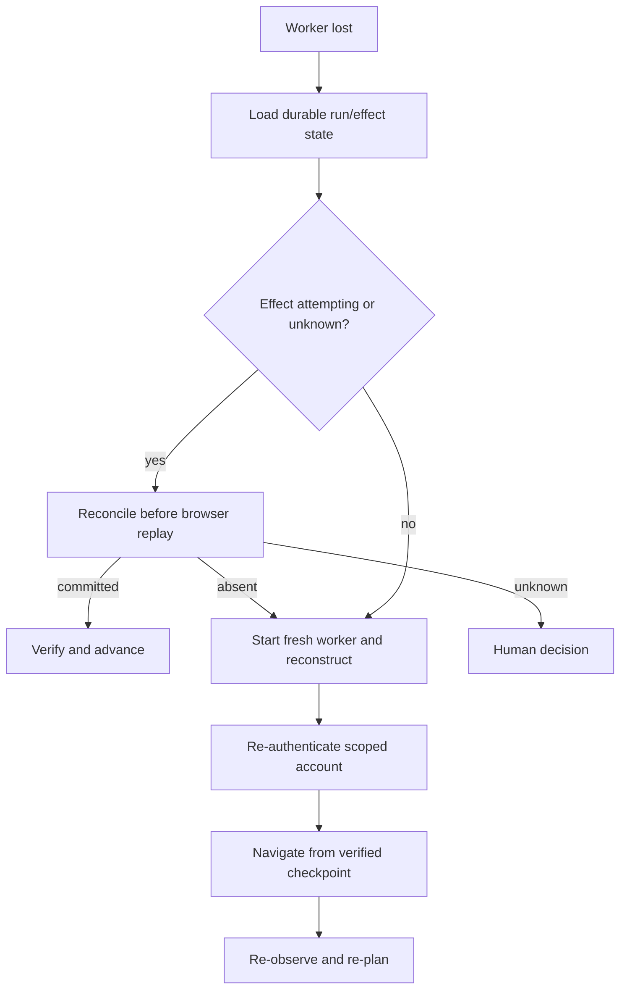

# Reliability, Recovery, Idempotency, and Replay

> Decision: retry observations and proven-safe mechanics; reconcile any action that may have created an external effect.  
> Research date: 2026-08-31

Browser automation fails between layers. A click may time out after the server committed. A page may navigate while the model reasons. A locator may resolve to a different control. A download may start but disappear when the context closes. Reliability comes from explicit state and outcome semantics, not a large retry count.

## Failure taxonomy

| Layer | Examples | Correct response |
|---|---|---|
| Intake | Invalid task, unauthorized account, contradictory limits | Reject before browser launch |
| Provisioning | Browser image unavailable, credential issue, capacity exhausted | Bounded infrastructure retry or queue; no effect yet |
| Observation | Slow render, truncated snapshot, inaccessible canvas | Wait for explicit condition, change perception layer, or human |
| Targeting | Duplicate locator, detached node, stale candidate, overlay | Re-observe and re-plan; do not force by default |
| Navigation | Redirect loop, popup, interstitial, auth expiry | Classify origin/state; refresh auth or stop |
| Reversible interaction | Fill did not stick, menu closed, validation changed | Re-observe, retry within step budget |
| External effect | Submit/send/pay/delete timed out or browser crashed | Mark unknown and reconcile; never blind retry |
| Verification | Toast absent, API lag, eventual consistency | Poll bounded authoritative oracle |
| Artifact | Download interrupted, scan failed, upload mismatch | Quarantine/retry only before external commit; otherwise reconcile |
| Policy/security | Unexpected origin, injection, forbidden data flow | Stop or human review; no automatic bypass |
| Resource | OOM, disk full, process crash, deadline | Destroy worker; resume only from durable state |

Separate **retryable mechanics** from **retryable business effects**. Most browser-library exceptions describe mechanics, not whether an effect was committed.

## Time model

Use a task deadline and smaller phase budgets:

```text
task deadline
  provisioning budget
  authentication budget
  per-observation budget
  per-action budget
  navigation budget
  effect-commit budget
  verification/reconciliation budget
  finalization budget
```

Every blocking operation receives the remaining deadline, not a fresh independent timeout. Reserve time for finalization and reconciliation. A task that exhausts its deadline immediately after a submit must still record `outcome_unknown` and preserve evidence.

### Avoid `networkidle` as a universal readiness condition

Modern pages can keep polling, stream, or open WebSockets forever. Define readiness per state:

- a specific role/locator is visible and enabled;
- a known API response or page state is present;
- a stable application marker changed;
- the candidate set remains unchanged for a small bounded interval;
- a download or popup event occurred;
- a deterministic postcondition holds.

Use Playwright's actionability and auto-waiting, but do not mistake them for business readiness.

## Retry policy

| Operation | Automatic retry? | Preconditions |
|---|---|---|
| Read observation/screenshot | Yes | Same allowed context; bounded count/cost |
| Resolve locator | Yes via re-observation | Same document meaning and origin |
| Scroll/expand local UI | Usually | No external effect; state checked |
| Fill unsaved input | Usually | Field identity/value policy unchanged; not auto-saving externally |
| Navigate to allowed GET | Sometimes | Destination and redirect policy; no state-changing GET assumption |
| Login submission | No blind retry | Check authenticated state, rate limits, and lockout risk |
| Upload staging | Sometimes | No final submit, artifact grant valid, no duplicate server object |
| Send/submit/publish/order/pay/delete/grant | Never blind | Commit probe proves absence or target idempotency key guarantees safe retry |
| Download transfer | Yes before release | Source identity/range semantics or restart policy known |
| Verification probe | Yes | Read-only, bounded backoff, deadline and consistency window |

HTTP defines some methods as idempotent, but UI behavior can violate assumptions. A `GET` can trigger broken state-changing endpoints, and a single button can issue several requests. Classify the business operation, not just the HTTP verb observed.

### Backoff

- retry only known transient classes;
- use exponential backoff with jitter for infrastructure and read probes;
- cap attempts and total elapsed time;
- respect server rate-limit signals;
- serialize workflows that mutate the same target account or object;
- do not let model-generated plans reset retry counters;
- expose retry cause and count to evaluation and cost metrics.

## Stale-state control

Between observation and action, JavaScript can change the page.

### Required pre-action checks

1. run, session generation, context, page, and frame still exist and belong to the same tenant/account;
2. the executor holds the current single-controller lease and cancellation fence is clear;
3. expected page and frame are active; `focusEpoch` matches and no human takeover or popup changed focus;
4. top-level and frame origins remain allowed and their resolved-address policy is current;
5. navigation ID and document epoch match, or the proposal explicitly permits the observed transition;
6. candidate resolves uniquely in the expected frame and is not covered by a different hit-test target;
7. role/name/test ID/value state and target fingerprint remain materially equal;
8. locator passes visibility, stability, receives-events, editable, and enabled checks where relevant;
9. effect preview still matches current recipient, account, items, amount, data, and destination;
10. approval and capability remain active and unused; adapter manifest remains qualified.

If any material check changes, invalidate the proposal. Do not “helpfully” click the nearest matching button.

### Force actions

Playwright can force some actions by skipping nonessential actionability checks. Treat `force` as a privileged exception because overlays and event interception often signal a real state mismatch. A named deterministic skill may use it only with a documented invariant and test; the model cannot request it.

## Durable run state

Persist logical state outside the browser:

```json
{
  "run_id": "run_123",
  "revision": 42,
  "workflow_node": "review_order",
  "status": "running",
  "context_generation": 2,
  "last_verified_state": "cart_reviewed",
  "open_effects": ["effect_order_789"],
  "used_approvals": [],
  "budgets_remaining": {
    "steps": 11,
    "model_calls": 3,
    "seconds": 180
  },
  "browser_checkpoint": {
    "recoverability": "fresh_login_and_navigate",
    "route": "orders/cart",
    "non_secret_form_refs": ["draft_456"]
  }
}
```

Do not serialize live node handles, raw cookies, or assume the browser process is a durable checkpoint. Record a **reconstruction plan** from verified application state.

### Write-ahead rule

Before an external effect:

1. create or load stable `effect_id`;
2. store canonical intent and approval digest;
3. persist status `attempting` with a unique attempt ID;
4. flush the record;
5. perform the action;
6. capture receipt or mark the outcome unknown;
7. verify business state;
8. persist final status.

This is a write-ahead effect ledger. It does not make an uncontrolled website transactional, but it prevents the orchestrator from forgetting that an effect may have happened.

## Idempotency

### Layers

| Layer | Mechanism | Guarantee |
|---|---|---|
| Queue/controller | Deduplicate task/run messages and compare-and-set revisions | Does not duplicate orchestration transitions |
| Application effect | Stable effect ID and canonical intent digest | Recognizes retries of the same intended effect |
| Target API | Provider-supported idempotency key with same payload | Strongest practical duplicate protection if documented |
| Target UI | Receipt lookup, unique client reference, pre/postcondition | Usually detection rather than prevention |
| Human process | Present uncertain outcome and evidence | Safest fallback when no authoritative probe exists |

Never invent a generic `Idempotency-Key` header for a website unless its API documents that behavior. The IETF HTTP header draft expired in 2026 and is not a universal browser/UI guarantee. Use target-specific semantics.

### Canonical effect intent

Hash stable machine fields:

```ts
const canonicalIntent = {
  tenantId,
  siteAccountRef,
  operation: "send_message",
  destination: normalizeEmail(recipient),
  contentSha256: sha256(finalBody),
  attachmentSha256: attachments.map(a => a.sha256).sort(),
};

const effectId = stableId(taskId, canonicalJson(canonicalIntent));
```

Do not include timestamps, step IDs, or browser-generated node IDs in the stable intent. Do include every field whose change should create a different effect.

## Outcome classification

After an effect attempt, choose exactly one:

- **Committed:** an authoritative receipt or business object exists.
- **Proven not committed:** an authoritative, correctly scoped probe shows absence after the target's consistency window.
- **Outcome unknown:** evidence cannot distinguish committed from not committed.

“Click returned,” “page navigated,” “toast displayed,” “model says done,” and “request timed out” are not universal commit proofs.

### Commit probes

Prefer in order:

1. target-supported API lookup by idempotency key/client reference;
2. returned immutable receipt or resource ID, verified by read;
3. account history filtered by canonical intent and time window;
4. page state with a stable target-owned identifier;
5. human review.

Avoid weak probes such as row counts, toast text, or approximate names when duplicates are possible.

## Reconciliation algorithm

```ts
async function reconcile(effect: EffectRecordV1): Promise<ReconcileResult> {
  for (const probe of orderedCommitProbes(effect.operation)) {
    const result = await probe.read(effect, remainingDeadline());

    if (result.exactReceipt) {
      return { status: "committed", receiptRef: result.exactReceipt };
    }
    if (result.authoritativeAbsence && result.consistencyWindowElapsed) {
      return { status: "proven_not_committed" };
    }
  }
  return { status: "needs_human" };
}
```

A proof of absence must be authoritative for the exact account, destination, and intent, and must account for eventual consistency. If not, keep the effect unknown.

### Retry after proven absence

Re-authorize against fresh state. Reuse the stable effect ID and provider idempotency key, create a new attempt ID, and verify the original approval still binds. Never reuse a consumed one-use browser capability.

## Crash recovery



Never restore a crashed browser by blindly replaying recorded clicks. The target's state may have advanced, the DOM may differ, and a prior effect may have committed.

### Disconnect and reconnect decision

Connection loss is not browser loss. Distinguish four cases before choosing recovery:

| Evidence | Meaning | Safe action |
|---|---|---|
| Control socket lost; provider proves same live session/generation and lease can be reacquired | Possible live reconnect | Freeze new commands, reconcile any open effect, reconnect once, enumerate pages/frames, increment `focusEpoch`, re-observe, then resume |
| Provider restored cookies/storage but started a new browser process or blank page | Session reconstruction, not reconnect | Increment session generation; rebuild from durable business checkpoint; never retain old page/frame/navigation/candidate IDs |
| Browser/context definitely closed | Fresh worker required | Reconcile open effects, obtain new scoped state, reconstruct, re-observe |
| Provider/control plane cannot prove whether old controller remains attached | Split-brain risk | Fence/revoke old session at provider and egress, wait for termination evidence, reconcile, then start fresh or escalate |

A reconnect URL is a bearer capability. Keep it outside model context and ordinary logs, bind it to tenant/run/worker where the provider permits, expire it quickly, and revoke it on takeover end, cancellation, or lease loss. Never allow two automation controllers—or a human and automation—to issue concurrent input.

### Recovery runbook

1. Persist `connection_lost`, stop dispatch, and revoke unused action capabilities.
2. Load the effect ledger. Reconcile every `attempting`, `cancel_requested`, or `outcome_unknown` effect before browser recovery.
3. Ask the adapter for session status using an application session ID, not a planner-provided endpoint.
4. Compare provider session ID, generation, browser identity, context/profile, account alias, region, and controller lease.
5. If live reconnect is qualified, attach once and inventory page IDs, origins, opener graph, active page/frame, document epochs, downloads, and dialogs.
6. Invalidate every pre-loss observation/action. Increment focus epoch even if the page looks unchanged.
7. Verify the last business checkpoint and authenticated account. Resume only from a fresh observation.
8. On ambiguity, terminate/fence the old session and reconstruct; on unresolvable effect ambiguity, route to a human.

### Recoverable checkpoints

A checkpoint is useful when it records:

- last deterministic business postcondition;
- workflow node and reconstruction route;
- stable target object IDs;
- server-side draft or cart identifiers;
- pending effect IDs and receipts;
- remaining budgets;
- required account and origin policy;
- whether reauthentication or human interaction is required.

A screenshot, Playwright trace, action cache, or storage-state file alone is not a recovery checkpoint.

## Replay

Use three different meanings explicitly:

### Evidence replay

Open recorded observations, actions, network metadata, and screenshots without connecting to the target. Use for debugging and review. Safest default.

### Decision replay

Feed recorded, redacted observations to a model/policy version and compare proposals without executing. Use for regression evaluation.

### Execution replay

Run actions against a reset test environment. Never run production execution replay by default. It can repeat effects and cannot assume the page is equivalent.

Framework “action caching” often reuses a learned selector or action. Treat it as a performance optimization:

- bind cache entries to origin, workflow, page fingerprint, action schema, browser/framework version, and relevant locale/viewport;
- validate target uniqueness and preconditions before use;
- evict on navigation or material mismatch;
- never let cache hits bypass policy or approval;
- never equate cached action replay with effect idempotency.

## Navigation and page recovery

### Popups and tabs

- register popup/page listeners before the triggering action;
- map opener and expected origin;
- pause interaction until policy classifies the new page;
- close unexpected pages and invalidate proposals referencing them;
- maintain an explicit active page, never “most recent page” globally.

### Frames

- scope candidate IDs to frame and origin;
- invalidate them when a frame detaches or navigates;
- do not treat a trusted top-level page as granting trust to third-party frames;
- verify final effects at both frame and top-level business context.

### Authentication expiry

- detect known login/consent interstitials deterministically;
- stop repeated credential submissions to avoid lockout;
- refresh through the broker or request user action;
- after reauthentication, verify the exact site account and restart from a business checkpoint.

### Browser crash and OOM

- classify as infrastructure failure, destroy the worker, and retain only approved artifacts;
- lower concurrency or page/screenshot/trace pressure before retry;
- reconcile open effects first;
- cap crash retries to prevent fleets from amplifying a bad page or image regression.

## Compensating actions

A compensation is a new effect, not an undo button in the ledger.

- define whether cancellation, deletion, refund, permission revocation, or message correction is supported;
- require its own authorization and possibly approval;
- retain links between original and compensation receipts;
- do not mark the original as “never happened”;
- verify the resulting business state and residual consequences.

## Reliability SLOs and metrics

Measure by workflow and risk class:

- task success rate with deterministic oracle;
- forbidden-effect and duplicate-effect rates;
- uncertain-effect rate and time to reconciliation;
- recovery success after worker loss;
- stale-target and ambiguous-target rates;
- attempts and model calls per successful workflow;
- login refresh and account lockout rates;
- p50/p95/p99 duration excluding and including human wait;
- browser crash, OOM, download, upload, and policy-denial rates;
- action-cache hit, invalidation, and false-replay rates.

Do not hide uncertain outcomes inside a generic failure count. They demand operational attention.

## Failure-injection matrix

| Injection point | Expected invariant |
|---|---|
| Kill before `attempting` is persisted | No browser effect is attempted |
| Kill after `attempting`, before click returns | Recovery reconciles before any retry |
| Commit succeeds, response is dropped | One effect; reconciliation finds receipt |
| Target does not commit, response is dropped | Retry only after authoritative absence |
| DOM changes after approval | Capability rejected as stale; new approval if effect changed |
| Popup origin changes | Interaction blocked until reclassified |
| Browser crashes during download | No artifact released; bounded restart possible |
| Context closes before download save | Temporary file loss is handled; no false success |
| Auth expires during final submit | Outcome reconciled before reauthentication/retry |
| Queue delivers duplicate step | Compare-and-set/effect ledger prevents duplicate execution |
| Cache resolves to different button | Fingerprint/precondition fails and cache is evicted |
| Verification API is eventually consistent | Bounded polling; absence not declared too early |
| Control socket drops while browser stays live | Single lease; reconnect inventory; all old observations invalidated |
| Provider restores storage into a blank process | New session generation; business-checkpoint reconstruction |
| Old and new controllers both try to attach | Provider or application fence allows one; second receives no command authority |
| Human takeover changes tab or form | `focusEpoch` changes; automation re-observes and reauthorizes |
| Cancellation races final click | Cancel before attempt fences; after attempt becomes unknown and reconciles |

## Production readiness checklist

- [ ] Every operation has a retry class and commit probe definition.
- [ ] Task and phase deadlines reserve reconciliation/finalization time.
- [ ] Stale page, frame, candidate, capability, and approval checks fail closed.
- [ ] High-impact actions are write-ahead recorded before execution.
- [ ] Unknown outcomes cannot enter the ordinary retry queue.
- [ ] Recovery reconstructs from verified business state, not click replay.
- [ ] Effect IDs are stable and target idempotency semantics are documented.
- [ ] Compensations are modeled as new authorized effects.
- [ ] Failure injection covers every crash window around external effects.
- [ ] Uncertain and duplicate effects are first-class SLO metrics.

## Primary references

- [Playwright actionability](https://playwright.dev/docs/actionability)
- [Playwright locators](https://playwright.dev/docs/locators)
- [Playwright pages and popups](https://playwright.dev/docs/pages)
- [Playwright downloads](https://playwright.dev/docs/downloads)
- [Browserbase keep alive](https://docs.browserbase.com/platform/browser/long-sessions/keep-alive)
- [Browserless standard reconnect sessions](https://docs.browserless.io/baas/session-management/standard-sessions)
- [Browserless persisted state](https://docs.browserless.io/baas/session-management/persisting-state)
- [RFC 9110: idempotent methods](https://www.rfc-editor.org/rfc/rfc9110.html#name-idempotent-methods)
- [Stripe idempotent requests](https://docs.stripe.com/api/idempotent_requests)
- [Idempotency and side effects](../../reliability/idempotency-and-side-effects.md)
- [Failure taxonomy](../../reliability/failure-taxonomy.md)
- [Research packet](../../research/packets/browser-automation-agent-blueprint.md)
