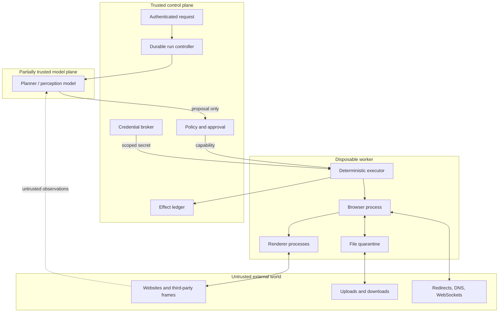

# Requirements and Threat Model

> Decision: define authority and unacceptable outcomes before choosing a model or framework.  
> Research date: 2026-08-31

The root security problem is **confused authority**. A browser agent reads attacker-controlled content while holding the user's authenticated session and a controller capable of crossing origins. A page can ask the model to reveal data, navigate elsewhere, upload a file, or approve a transaction. The web's same-origin policy constrains page scripts, but it does not constrain the external automation controller in the same way. The agent must restore those boundaries at the application layer and network layer.

This guide turns that problem into testable requirements.

## Purpose

Build a service that can complete explicitly authorized browser tasks while:

- preserving the requesting user's intent and account boundaries;
- minimizing model, browser, credential, filesystem, and network authority;
- adapting to ordinary page variation without granting open-ended autonomy;
- preventing page content from becoming policy or permission;
- producing evidence for every attempted and committed external effect;
- recovering safely from navigation races, crashes, and ambiguous outcomes;
- exposing enough telemetry to debug and evaluate without leaking session data.

## Non-goals

The blueprint does not authorize:

- bypassing CAPTCHA, paywalls, rate limits, bot protections, or terms of service;
- defeating MFA, WebAuthn user-presence checks, fraud controls, or approval workflows;
- silently reusing a person's everyday browser profile;
- giving arbitrary sites access to local files, secrets, internal networks, or cloud metadata;
- making unreviewed purchases, transfers, legal commitments, permission grants, identity changes, or public communications;
- treating a framework's domain filter, model safety claim, or browser sandbox as a complete security boundary;
- guaranteeing exactly-once behavior when the target site exposes neither an idempotency mechanism nor an observable commit receipt;
- using public benchmark success as proof that a particular production workflow is safe or reliable.

## System actors and principals

Do not collapse these identities into one `user_id`:

| Principal | Authority | Required evidence |
|---|---|---|
| Requesting user | Defines the intended task and initial constraints | Authenticated request, task digest, timestamp |
| Calling service | May add organization policy and budgets | Service identity, tenant, policy version |
| Browser worker | Holds temporary browser and network capabilities | Worker identity, image/browser version, isolation class |
| Target-site account | Determines what the session can do at the site | Account alias and scope, never raw secret in logs |
| Planner/model | Proposes actions inside delegated scope | Model/version, input observation IDs, proposal |
| Policy engine | Decides whether a proposal is allowed | Policy version, rule result, required approval class |
| Approver | Grants a specific high-impact effect | Principal, exact effect digest, display fields, expiry |
| Operator | Pauses, kills, or investigates runs | Operator identity and audited intervention |

An authenticated site account may be more privileged than the requesting user. The credential broker must not make that escalation invisible.

## Assets

Protect at least:

- cookies, local storage, IndexedDB, client certificates, bearer tokens, recovery codes, and WebAuthn material;
- typed form data, clipboard content, downloaded and uploadable files;
- personal, financial, medical, legal, employee, and customer data visible in pages;
- organization intranet services and cloud metadata reachable from the worker network;
- external effects: messages, orders, transfers, permissions, posts, submissions, bookings, deletions, and account changes;
- model prompts, page snapshots, screenshots, traces, console logs, network bodies, and approval records;
- evaluation fixtures and hidden expected answers;
- browser images, extensions, certificates, dependencies, policies, and model configuration.

## Trust boundaries

The model plane is partially trusted: it may be useful and well-behaved, but its output is never sufficient authorization. The worker is disposable and potentially compromised. Only the control plane owns durable intent, policy, approval, and effect truth.

## Threat agents

- a malicious page author or compromised target site;
- third-party content loaded in ads, iframes, widgets, images, PDFs, or downloads;
- an attacker controlling a redirect, DNS record, popup, service worker, or WebSocket endpoint;
- a malicious or mistaken user attempting cross-tenant access;
- a compromised dependency, browser image, extension, MCP server, or automation framework;
- an operator with excessive production access;
- a model that follows injected instructions, invents facts, chooses the wrong target, or loses task constraints;
- ordinary failure: slow pages, partial renders, crashes, detached nodes, stale observations, and duplicated execution.

## Core threat scenarios

| Scenario | Unsafe outcome | Required controls |
|---|---|---|
| Page prompt injection | Model treats page text as a new instruction | Provenance labels, immutable task envelope, no authority from observations, policy gate, adversarial evals |
| Cross-origin redirect | Allowed starting URL reaches attacker or internal service | Validate every navigation and resolved address, network broker, redirect budget, scheme policy |
| Credential exfiltration | Secret appears in model context, page field, trace, or request | Credential broker, exact destination binding, redaction, no raw secret tools, short-lived credentials |
| Session confused deputy | User asks benign task; high-privilege site account performs more | Bind request principal to account capability; tenant and account authorization |
| Stale-target action | Model-approved button changes before click | Observation/document epoch, re-resolve, precondition, fresh authorization for material changes |
| Hidden or overlaid target | Coordinate click hits a different element | Locator/actionability checks, screenshot corroboration, target fingerprint, post-action verification |
| Duplicate high-impact action | Timeout causes repeated purchase, post, send, or delete | Effect ID, commit probe, reconciliation, no blind retry |
| Download attack | Malware, path traversal, archive bomb, or data leak | Quarantine, generated names, size/type limits, scanning, no execution, content policy |
| Upload disclosure | Agent uploads wrong local file or page-selected secret | Artifact handles, source classification, destination/action approval, no arbitrary paths |
| Shared-profile bleed | Cookies, history, pages, or events cross users/tasks | Fresh context, separate process for trust boundary, no shared persistent profile |
| Browser escape or controller compromise | Attacker reaches host, secrets, or internal network | Non-root sandbox, seccomp, OS/container/VM isolation, egress deny, ephemeral worker |
| Trace leak | DOM, screenshots, headers, or storage state expose secrets | Risk-based capture, field/body redaction, encryption, short retention, audited access |
| Framework escape hatch | Generic code/evaluate tool bypasses typed policy | Do not expose by default; separate capability, isolated worker, code allowlist/review |
| Malicious service worker | Requests continue or mutate after expected navigation | New contexts, clear state, network enforcement, page lifecycle and outstanding-request tracking |
| Human/automation split brain | Human takeover and executor both type or click; focus moves silently | Exclusive controller lease, focus epoch, capability revocation, post-takeover inventory and re-observation |
| Provider reconnect theft | Leaked WebSocket/live URL resumes an authenticated session | Treat endpoints as bearer secrets, short TTL, tenant/run binding, exclusive lease, explicit revoke |
| Anti-bot/terms evasion | Proxies, stealth, or CAPTCHA solving bypass site owner/user controls | Site permission record, honest identity, rate/region policy, feature disabled by default, human/target-approved path |
| Supply-chain substitution | Browser, driver, extension, adapter, model package, or image changes behavior | Exact versions/digests, signatures/SBOM, isolated build, qualification corpus, staged canary, rollback |

## Origin, site, and navigation model

An origin is scheme, host, and port. A site is broader and can include different subdomains. Treating “same site” as “same authority” is often wrong: `app.example.com` and `attacker-controlled-user-content.example.com` may be same-site but different origins and trust levels.

Track every browsing context with:

- context ID and tenant;
- page/tab ID and opener;
- frame ID, parent frame, and current origin;
- navigation ID and redirect chain;
- document epoch, URL, origin, and security state;
- popup, download, file chooser, dialog, and permission events;
- outstanding requests and WebSocket endpoints.

Enforce rules on the canonical URL and again after DNS resolution. Reject non-HTTP schemes by default, including `file:`, `data:`, `blob:`, custom protocols, and browser-internal pages. If a business case needs one, grant a narrow, separately tested capability. A browser-library origin option that does not cover redirects or special schemes is a convenience control, not the enforcement point.

### Anti-CSRF implications

The target site remains responsible for CSRF defenses, but the agent must not weaken them:

- never manufacture or bypass CSRF tokens;
- do not suppress `Origin`, `Referer`, SameSite, Fetch Metadata, or browser security behavior to make automation pass;
- treat cross-origin form submission and navigation as effects even if the browser permits them;
- do not interpret a valid CSRF token as user authorization; it only shows that the session could submit;
- require renewed approval after a redirect changes origin, account, recipient, amount, or data disclosure;
- prefer site APIs that accept an idempotency key and explicit authorization over UI submission.

Client-side CSRF is relevant because attacker-controlled URL fragments or page data can make trusted page JavaScript send authenticated requests. The agent's verifier must confirm the intended effect rather than assuming a click path was safe.

## Action risk classes

| Class | Examples | Default approval | Retry rule | Evidence |
|---|---|---|---|---|
| R0: observe | Read text, inspect accessibility tree, screenshot a permitted page | Task-level permission | Safe within budgets | Observation hash and provenance |
| R1: navigate or local UI | Open allowed URL, change tab, expand menu, scroll | Task-level permission; recheck on origin change | Retry only if current state proves harmless | Navigation chain and page epoch |
| R2: reversible draft | Fill an unsaved form, stage upload, add to cart | Task permission if data/destination allowed | Re-observe before retry | Before/after state |
| R3: external reversible effect | Save draft remotely, create cancellable booking, modify preference | Policy or user approval by workflow | Commit probe, then retry if absence proven | Effect receipt and rollback path |
| R4: high impact | Send message, publish, submit application, grant access, delete, transfer, purchase | Just-in-time exact approval | Never blind retry | Approval digest, receipt, verification |
| R5: prohibited | Evade MFA/CAPTCHA, expose credentials, access unrelated accounts, bypass controls | Never | Never | Denial record and security alert |

Risk depends on context. Typing text is R2 in a local draft, R4 if a site auto-saves it to a medical record, and R5 if it inserts a secret into an attacker-controlled field.

## Approval requirements

An approval is valid only when it binds:

- requesting and approving principals;
- target tenant and site account;
- operation type;
- canonical destination origin and human-readable recipient;
- exact amount, items, permissions, data fields, or file artifact IDs;
- known side effects and reversibility;
- a task and proposal digest;
- an observation/document epoch or a bounded freshness rule;
- expiry, maximum uses, and revocation state.

Do not ask “Continue?” after showing only a button label. Show the effect:

> Send the final message text to `customer@example.com` from support account `acme-eu`, creating an external communication that cannot be recalled. No attachment. One use. Expires in 5 minutes.

A changed recipient, amount, attachment, permission, account, or origin invalidates approval. Page text cannot auto-answer an approval prompt. The browser must pause before the effect, not after it.

## Functional requirements

### Task intake

- Parse the request into a versioned task envelope.
- Resolve the requesting principal, tenant, approved site account, sites, data classes, action classes, budget, and deadline.
- Reject contradictory or underspecified high-impact tasks before launching a browser.
- Preserve original user instructions separately from model-generated plans.

### Browser lifecycle

- Start from a pinned, known browser image.
- Require a signed adapter capability manifest for the exact library/protocol/browser/provider tuple.
- Create a fresh context per run; never attach to an everyday profile by default.
- Track all pages, frames, popups, dialogs, downloads, and file choosers.
- Revoke credentials, close the context, flush allowed artifacts, and destroy the worker on completion or kill.

### Perception and action

- Prefer semantic locators and actionability checks.
- Correlate DOM/accessibility observations with screenshot evidence for ambiguous or high-impact targets.
- Tag all observed strings with source URL, origin, frame, observation, and trust level.
- Reject actions based on stale or unresolvable targets.

### Effects

- Classify every tool call before execution.
- Use typed capabilities rather than raw browser code.
- Persist proposal, authorization, attempt, result, and verification separately.
- Support pause, approval, cancellation, reconciliation, and compensating actions.

### Files

- Represent files as application-owned artifact handles, not host paths.
- Quarantine downloads, generate storage names, enforce type and size, and scan before release.
- Allow uploads only from explicitly granted artifacts and to approved form purposes and destinations.

## Non-functional requirements

Set numeric targets per workflow rather than adopting one global number:

| Area | Required target |
|---|---|
| Safety | Zero unauthorized R4/R5 effects in the launch attack suite |
| Correctness | Task success and forbidden-effect rates measured independently |
| Reliability | Success, recovery, uncertain-effect, and duplicate-effect rates by workflow |
| Latency | p50/p95/p99 end-to-end and per-step budgets; approval wait reported separately |
| Cost | Browser-seconds, model tokens, screenshots, storage, and retries per successful task |
| Isolation | No cross-context, cross-worker, cross-tenant, filesystem, or network leakage in tests |
| Auditability | Every effect links to intent, observation, policy, approval, attempt, and receipt |
| Privacy | Retention and redaction by artifact class; audited access and deletion |
| Operability | Kill switch, tenant pause, session revocation, canary, rollback, and incident evidence |
| Compatibility | Pinned browser/framework/model/evaluator matrix with explicit upgrade tests |
| Site qualification | Version/fingerprint-scoped shadow, canary, drift, and rollback evidence by effect class |

## Abuse and privacy requirements

- Enforce per-account and per-origin concurrency and rate limits.
- Detect repeated login failures, mass scraping, bulk messaging, credential cycling, and unusual destination expansion.
- Honor site policies and legal constraints; block unsupported targets rather than stealthily evading controls.
- Minimize collection: crop screenshots and DOM to the needed region where possible.
- Keep evaluation fixtures separate from production credentials and data.
- Require break-glass access for raw traces and storage state; record every access.
- Never use production page content to train or fine-tune without an explicit data governance decision.

## Threat-model assumptions to validate

Do not silently assume:

- the target page is honest because it uses HTTPS;
- an accessible name matches visible text or is free of hidden content;
- a redirect stays inside an allowed domain;
- a new browser context isolates the whole browser process or host;
- a click timeout means no effect occurred;
- a success toast proves the requested business state;
- a downloaded filename or MIME type is trustworthy;
- an upload form is entitled to any file the agent can see;
- a framework's secret placeholder prevents every disclosure path;
- the browser's user data directory is safe to share across controller clients;
- model refusal training eliminates prompt injection;
- benchmarks, traces, or cached actions remain valid after environment drift.

## Threat-model review checklist

- [ ] Every principal and credential is mapped to a tenant and permitted account.
- [ ] The task envelope lists sites, data, effects, budgets, and prohibited actions.
- [ ] Redirects, frames, popups, service workers, downloads, and special schemes are in scope.
- [ ] The model receives provenance but not raw secrets.
- [ ] High-impact approval binds the exact effect and expires.
- [ ] Unknown commits enter reconciliation and cannot be blind-retried.
- [ ] Browser, controller, and network boundaries are independently enforced.
- [ ] The file pipeline handles malicious, huge, nested, and misleading files.
- [ ] Telemetry privacy and operator access are part of the threat model.
- [ ] Attack tests cover page injection, cross-origin escape, stale targets, and shared-state leakage.
- [ ] Residual risks and prohibited workflows have product-owner sign-off.

## Primary references

- [MDN: Same-origin policy](https://developer.mozilla.org/en-US/docs/Web/Security/Defenses/Same-origin_policy)
- [W3C Fetch Metadata](https://www.w3.org/TR/fetch-metadata/)
- [OWASP Cross-Site Request Forgery Prevention Cheat Sheet](https://cheatsheetseries.owasp.org/cheatsheets/Cross-Site_Request_Forgery_Prevention_Cheat_Sheet.html)
- [OWASP Server-Side Request Forgery Prevention Cheat Sheet](https://cheatsheetseries.owasp.org/cheatsheets/Server_Side_Request_Forgery_Prevention_Cheat_Sheet.html)
- [OWASP File Upload Cheat Sheet](https://cheatsheetseries.owasp.org/cheatsheets/File_Upload_Cheat_Sheet.html)
- [Cloudflare verified bots](https://developers.cloudflare.com/bots/concepts/bot/verified-bots/)
- [Cloudflare robots guidance](https://developers.cloudflare.com/browser-run/reference/robots-txt/)
- [Chromium security architecture for agents](https://chromium.googlesource.com/chromium/src/+/main/docs/security/security-for-agents.md)
- [OpenAI computer-use safety guidance](https://developers.openai.com/api/docs/guides/tools-computer-use)
- [Research packet](../../research/packets/browser-automation-agent-blueprint.md)
