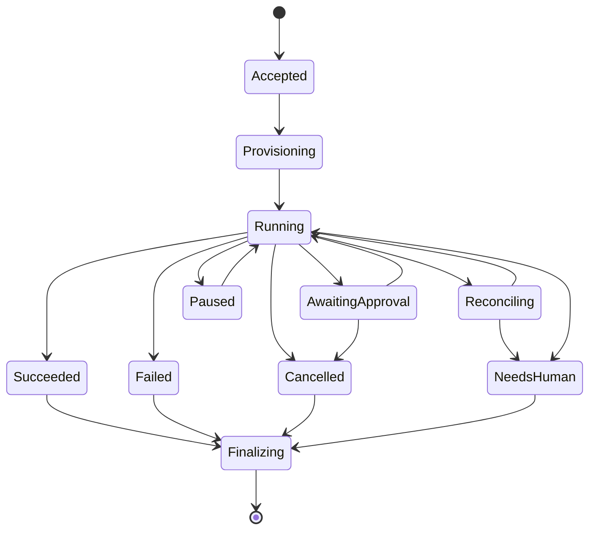
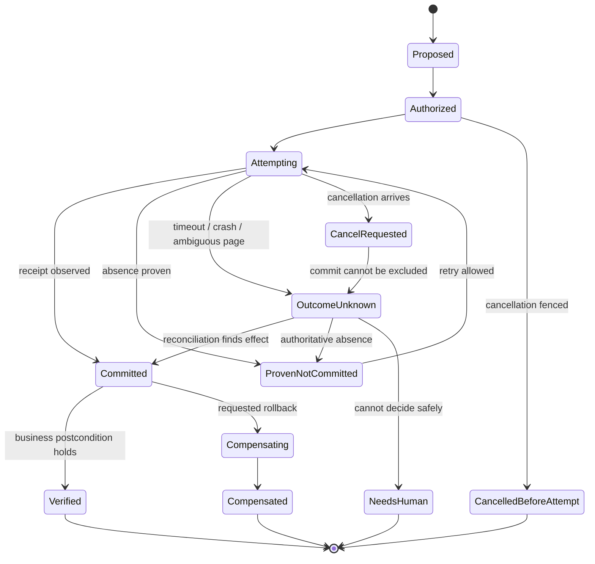

# Tool, State, and Effect Contracts

> Decision: expose capability-shaped commands and durable effect records, never a generic browser or code-execution tool.  
> Research date: 2026-08-31

Typed contracts make the model replaceable and the executor governable. They also create the seams needed for approval, replay, redaction, testing, and crash recovery.

The required flow is:

```text
observe -> propose -> validate -> authorize -> reobserve -> execute -> verify -> record
```

No step may be collapsed for a high-impact effect. In particular, the planner cannot authorize its own proposal, and a successful browser API call cannot verify its own business outcome.

## Contract principles

1. Use closed enums and discriminated unions, not free-form action strings.
2. Carry tenant, task, context, page, frame, origin, navigation, document, and observation identity.
3. Distinguish requested intent, proposed action, authorized capability, attempted effect, and observed outcome.
4. Bind every command to preconditions and a freshness window.
5. Return structured failure classes, not only exception text.
6. Keep secrets and file paths out of planner-visible schemas.
7. Make budgets explicit: time, steps, model calls, bytes, downloads, pages, redirects, and cost.
8. Treat generic script evaluation as a separate privileged subsystem.
9. Version all externally persisted envelopes.
10. Preserve raw vendor responses only in access-controlled evidence; normalize operational state.

## Task envelope

The controller constructs this from authenticated user intent and organization policy. The model may read a minimized view but cannot edit authority fields.

```ts
type RiskClass = "R0" | "R1" | "R2" | "R3" | "R4" | "R5";

interface BrowserTaskV1 {
  schemaVersion: "browser-task/v1";
  taskId: string;
  tenantId: string;
  requesterId: string;
  requestedAt: string;
  objective: string;
  siteAccountRef?: string;          // opaque broker reference
  allowedOrigins: string[];         // exact canonical origins or policy IDs
  allowedDataClasses: string[];
  maximumRisk: RiskClass;
  prohibitedEffects: string[];
  budgets: {
    deadlineAt: string;
    maxSteps: number;
    maxModelCalls: number;
    maxPages: number;
    maxRedirects: number;
    maxDownloadBytes: number;
    maxEstimatedCostUsd: number;
  };
  completionOracle: {
    type: "page_assertion" | "api_probe" | "artifact_validation" | "human";
    oracleRef: string;
  };
  policyVersion: string;
}
```

Do not encode authorization only in prose such as `objective`. The closed fields are enforcement inputs.

## Browser state model

```ts
type Brand<T, Name extends string> = T & { readonly __brand: Name };

type SiteId = Brand<string, "SiteId">;
type OriginId = Brand<string, "OriginId">;
type SessionId = Brand<string, "SessionId">;
type ContextId = Brand<string, "ContextId">;
type PageId = Brand<string, "PageId">;
type FrameId = Brand<string, "FrameId">;
type NavigationId = Brand<string, "NavigationId">;
type ObservationId = Brand<string, "ObservationId">;
type ActionId = Brand<string, "ActionId">;
type EffectId = Brand<string, "EffectId">;

interface SiteRefV1 {
  siteId: SiteId;                    // product-owned logical integration
  adapterId: string;
  adapterVersion: string;
  siteVersionEvidence: string[];     // build/header/asset/DOM fingerprints
}

interface OriginRefV1 {
  originId: OriginId;
  scheme: "https" | "http";
  asciiHost: string;
  port: number;
  registrableDomain: string;
  resolvedAddressSetHash: string;
}

interface SessionRefV1 {
  sessionId: SessionId;              // application identity, never a bearer URL
  generation: number;                // increments after reconstruction/reconnect loss
  providerSessionRef?: string;       // opaque and access-controlled
  controllerLeaseId: string;
  accountRef?: string;
}

interface BrowserStateRef {
  runId: string;
  site: SiteRefV1;
  origin: OriginRefV1;
  session: SessionRefV1;
  contextId: ContextId;
  pageId: PageId;
  frameId: FrameId;
  navigationId: NavigationId;
  documentEpoch: number;
  focusEpoch: number;
  observationId: ObservationId;
  observedAt: string;
  canonicalUrl: string;
}
```

Brands prevent accidental interchange in typed code; runtime schema validation is still required. `SiteId` is the owned integration, not the registrable domain. `OriginId` is derived from a canonical tuple, never caller text. `SessionId` is an application reference, not the provider's secret connection URL. A page survives top-level navigation; a frame survives only until detachment; an observation is immutable; an action ID identifies one executor command; an effect ID survives safe retries of the same canonical business intent.

Increment `documentEpoch` when the frame commits a new document. Increment `focusEpoch` whenever active page/frame or human/model control changes. Use a separate state revision for same-document mutations if workflows need it. A page ID persists across top-level navigations; a document epoch does not.

## Adapter capability manifest

Every local or managed runtime ships an exact, signed manifest. Avoid booleans that hide partial support.

```ts
type CapabilityLevel =
  | "native"
  | "emulated"
  | "provider_extension"
  | "degraded"
  | "unsupported";

interface BrowserAdapterManifestV1 {
  schemaVersion: "browser-adapter-manifest/v1";
  adapterId: string;
  adapterVersion: string;
  library: { name: string; version: string };
  protocol: { name: "playwright" | "cdp" | "webdriver" | "webdriver-bidi"; version: string };
  browser: { product: string; version: string; binaryDigest: string };
  provider?: { name: string; apiVersion: string; region: string };
  isolation: { unit: "context" | "process" | "container" | "vm"; sharedBrowserProcess: boolean };
  capabilities: Record<
    | "contexts" | "frames" | "popups" | "focus"
    | "accessibility" | "dom_snapshot" | "screenshot"
    | "request_observation" | "request_interception" | "service_workers" | "websockets"
    | "downloads" | "uploads" | "trace" | "recording"
    | "disconnect" | "live_reconnect" | "persistent_state" | "human_takeover" | "cancellation",
    { level: CapabilityLevel; constraints: string[]; qualificationCaseIds: string[] }
  >;
  genericCodeDisabled: boolean;
  evaluatedAt: string;
  expiresAt: string;
  manifestDigest: string;
  signature: string;
}
```

The scheduler admits a workflow only if its required capabilities are `native`, or an explicitly approved `emulated`/`provider_extension` path passed the same suite. `degraded` is not silently accepted. Record the manifest digest on observations, actions, effects, traces, and receipts.

### Run state machine



Persist transitions with compare-and-set on a monotonically increasing run revision. Duplicate queue deliveries must be harmless.

## Observation contract

```ts
interface CandidateTargetV1 {
  candidateId: string;              // valid only for this observation/document
  frameId: FrameId;
  origin: string;
  role?: string;
  accessibleName?: string;
  visibleText?: string;
  testId?: string;
  inputType?: string;
  valueState?: "empty" | "set" | "redacted";
  disabled: boolean;
  checked?: boolean;
  boundingBox?: { x: number; y: number; width: number; height: number };
  selectorHandle: string;           // opaque; never model-authored
  targetFingerprint: string;
  sourceTrust: "application" | "page-untrusted" | "third-party-untrusted";
}

interface ObservationV1 {
  schemaVersion: "browser-observation/v1";
  state: BrowserStateRef;
  title: string;
  topLevelOrigin: string;
  candidates: CandidateTargetV1[];
  scopedText: Array<{
    text: string;
    origin: string;
    frameId: FrameId;
    sourceTrust: "page-untrusted" | "third-party-untrusted";
  }>;
  eventsSincePrevious: BrowserEventV1[];
  screenshotRef?: string;
  screenshotSha256?: string;
  omitted: string[];
  redactions: string[];
}
```

`selectorHandle` is created by the observer and resolved by the executor. It may wrap a role locator, test ID, or vetted selector. The planner chooses a `candidateId`; it does not write CSS or XPath.

## Browser event contract

Normalize library events into a durable, ordered stream:

```ts
type BrowserEventV1 =
  | { type: "navigation_started"; pageId: PageId; navigationId: NavigationId; url: string }
  | { type: "navigation_committed"; pageId: PageId; navigationId: NavigationId; url: string; originId: OriginId }
  | { type: "redirect"; navigationId: NavigationId; from: string; to: string; status?: number }
  | { type: "frame_attached"; pageId: PageId; frameId: FrameId; parentFrameId?: FrameId }
  | { type: "popup_opened"; openerPageId: PageId; pageId: PageId; url: string }
  | { type: "dialog_opened"; pageId: PageId; dialogType: string; messageRef: string }
  | { type: "file_chooser_opened"; pageId: PageId; frameId: FrameId; targetFingerprint: string }
  | { type: "download_started"; pageId: PageId; downloadId: string; url: string }
  | { type: "download_finished"; downloadId: string; artifactRef?: string; failure?: string }
  | { type: "websocket_opened"; pageId: PageId; url: string }
  | { type: "page_closed"; pageId: PageId }
  | { type: "context_closed"; contextId: ContextId; reason: string };
```

The event stream is evidence and orchestration input. Do not assume the browser library emits every business-relevant state transition; verification still needs page or API probes.

## Planner proposal

```ts
type BrowserProposalV1 =
  | {
      type: "click";
      proposalId: string;
      actionId: ActionId;
      state: BrowserStateRef;
      candidateId: string;
      targetFingerprint: string;
      expectedTransition: string;
      riskClaim: RiskClass;
    }
  | {
      type: "fill";
      proposalId: string;
      actionId: ActionId;
      state: BrowserStateRef;
      candidateId: string;
      targetFingerprint: string;
      valueRef: string;              // opaque data-vault reference
      dataClass: string;
      expectedTransition: string;
      riskClaim: RiskClass;
    }
  | {
      type: "navigate";
      proposalId: string;
      actionId: ActionId;
      state: BrowserStateRef;
      destinationRef: string;        // resolved by policy, not an arbitrary URL
      expectedOrigin: string;
      riskClaim: "R1";
    }
  | {
      type: "upload";
      proposalId: string;
      actionId: ActionId;
      state: BrowserStateRef;
      candidateId: string;
      artifactRefs: string[];
      purpose: string;
      expectedTransition: string;
      riskClaim: "R2" | "R3" | "R4";
    }
  | {
      type: "request_human";
      proposalId: string;
      actionId: ActionId;
      state: BrowserStateRef;
      reasonCode: string;
      question: string;
    }
  | {
      type: "declare_blocked";
      proposalId: string;
      actionId: ActionId;
      state: BrowserStateRef;
      reasonCode: string;
      evidenceRefs: string[];
    };
```

The executor recalculates risk. `riskClaim` is telemetry, never authoritative.

## Authorized capability

The policy engine turns a valid proposal into a short-lived capability.

```ts
interface AuthorizedCapabilityV1 {
  schemaVersion: "browser-capability/v1";
  capabilityId: string;
  taskId: string;
  runId: string;
  tenantId: string;
  proposalDigest: string;
  operation: "click" | "fill" | "navigate" | "upload" | "download_release";
  exactOrigin: string;
  targetFingerprint?: string;
  valueRef?: string;
  artifactRefs?: string[];
  riskClass: RiskClass;
  preconditions: Array<{ type: string; expected: string }>;
  approvalRef?: string;
  effectId?: EffectId;
  notBefore: string;
  expiresAt: string;
  maxUses: 1;
  policyVersion: string;
  signature: string;
}
```

The worker verifies the signature, time, one-use nonce, exact origin, task/run binding, target fingerprint, and preconditions. A policy decision in the controller is not enough if a compromised worker can invent commands; constrain the worker's egress and credentials as a second line of defense.

## Approval contract

```ts
interface EffectApprovalV1 {
  schemaVersion: "effect-approval/v1";
  approvalId: string;
  taskId: string;
  approverId: string;
  effectDigest: string;
  display: {
    action: string;
    account: string;
    destination: string;
    dataOrItems: string[];
    amount?: string;
    reversibility: string;
  };
  issuedAt: string;
  expiresAt: string;
  maxUses: 1;
  status: "active" | "used" | "revoked" | "expired";
}
```

Compute `effectDigest` from canonical machine fields, not the display prose. The display is for informed consent; the digest is for binding.

## Effect ledger

Use append-only events plus a materialized effect record.

```ts
type EffectStatus =
  | "proposed"
  | "authorized"
  | "attempting"
  | "committed"
  | "verified"
  | "proven_not_committed"
  | "outcome_unknown"
  | "cancel_requested"
  | "cancelled_before_attempt"
  | "compensating"
  | "compensated"
  | "needs_human";

interface EffectRecordV1 {
  schemaVersion: "browser-effect/v1";
  effectId: EffectId;               // stable across safe retries
  taskId: string;
  runId: string;
  operation: string;
  canonicalIntentDigest: string;
  targetAccountRef: string;
  targetOrigin: string;
  riskClass: RiskClass;
  status: EffectStatus;
  attemptCount: number;
  latestAttemptId?: string;
  approvalRef?: string;
  providerIdempotencyKey?: string;
  receiptRefs: string[];
  lastVerifiedAt?: string;
  version: number;
}

interface EffectReceiptV1 {
  schemaVersion: "browser-effect-receipt/v1";
  receiptId: string;
  effectId: EffectId;
  attemptId: string;
  outcome: "committed" | "proven_not_committed" | "outcome_unknown" | "cancelled_before_attempt";
  targetObjectRef?: string;
  providerReceiptRef?: string;
  canonicalIntentDigest: string;
  observedBy: { oracleType: string; oracleVersion: string };
  observedAt: string;
  evidenceRefs: string[];
  manifestDigest: string;
}
```

Write `attempting` durably before the browser action. After any crash or timeout in that state, the recovery worker probes for the receipt. It does not assume failure.

### Effect lifecycle



Cancellation is transactional fencing, not undo. Before `attempting`, compare-and-set the effect to `cancelled_before_attempt` and revoke the capability. At or after `attempting`, record `cancel_requested`, stop future mechanics where safe, and reconcile. Never report “cancelled” if the target may already have committed. A later refund, deletion, or booking cancellation is a new compensating effect with its own authority and receipt.

## Executor command set

Keep the ordinary tool set small:

### Observe

- `observe_page(scope)`
- `expand_region(candidate_or_region)`
- `capture_screenshot(scope, redaction_policy)`
- `list_pages()`
- `inspect_download(download_id)`

### Reversible interaction

- `click_candidate(candidate_id)`
- `fill_candidate(candidate_id, value_ref)`
- `select_candidate(candidate_id, option_id)`
- `set_checked(candidate_id, expected)`
- `scroll_region(region_id, direction, amount)`
- `switch_page(page_id)`
- `dismiss_dialog(dialog_id, approved_response)`

### Governed effects

- `navigate(destination_ref)`
- `stage_upload(candidate_id, artifact_refs)`
- `commit_effect(effect_id, capability_id)`
- `release_download(download_id, release_capability_id)`

### Control

- `request_approval(effect_preview)`
- `request_human_takeover(reason)`
- `pause_run(reason)`
- `stop_run(reason)`

Do not expose by default:

- arbitrary URL navigation;
- raw CSS/XPath selectors;
- JavaScript evaluation;
- arbitrary Playwright/Puppeteer/Selenium code;
- shell or filesystem paths;
- clipboard read;
- browser-extension installation;
- permission grants;
- storage-state export;
- raw cookie/header access;
- proxy or certificate changes.

If a workflow truly needs one, give it a separate capability, worker class, audit stream, and risk review.

## Policy evaluation example

```ts
function authorize(
  task: BrowserTaskV1,
  proposal: BrowserProposalV1,
  observation: ObservationV1,
  policy: PolicySnapshot,
): AuthorizationResult {
  assertSameRun(task, proposal.state, observation.state);
  assertFresh(observation.state.observedAt, policy.maxObservationAgeMs);
  assertOriginAllowed(task.allowedOrigins, observation.state.origin);

  const target = resolveCandidate(proposal, observation);
  const risk = classifyRisk(task, proposal, target, observation);
  const dataFlows = inferDataFlows(proposal, target);

  assertRiskWithinDelegation(risk, task.maximumRisk);
  assertDataAllowed(dataFlows, task.allowedDataClasses, observation.state.origin);
  assertNotProhibited(task.prohibitedEffects, proposal, target);

  const approval = risk === "R4"
    ? requireExactApproval(canonicalEffect(proposal, target))
    : undefined;

  return issueSingleUseCapability({ task, proposal, target, risk, approval });
}
```

This is an architectural example, not a complete policy engine. Production code also needs canonical URL parsing, tenant/account authorization, signature validation, concurrency control, effect-ledger compare-and-set, and fail-closed error behavior.

## Navigation contracts

A navigation command needs:

- a destination selected from an application-owned allowlist or workflow route;
- exact expected scheme and origin;
- maximum redirect hops and whether cross-origin redirects are allowed;
- popup behavior;
- download behavior;
- data-transfer classification for URL query/body/referrer;
- expected landing-page predicate.

At each redirect or popup:

1. pause before sending sensitive data where interception permits;
2. canonicalize and resolve the destination;
3. reject loopback, link-local, private, metadata, and prohibited addresses;
4. enforce scheme, origin, port, and tenant policy;
5. update the navigation chain and document epoch;
6. invalidate stale proposals and approvals if material fields change.

Network policy must be enforced outside the page and preferably outside the browser process. Application checks alone remain vulnerable to parser differences, DNS rebinding, and unobserved channels.

## Downloads

Playwright's download event begins before completion; temporary downloads are deleted when their browser context closes, and a suggested filename is page-provided. The contract must therefore separate browser download state from released artifact state.

```ts
interface QuarantinedDownloadV1 {
  downloadId: string;
  sourceUrl: string;
  sourceOrigin: string;
  browserSuggestedName?: string;    // display only
  storageObjectRef?: string;        // generated name
  observedMime?: string;
  detectedType?: string;
  bytes?: number;
  sha256?: string;
  scanStatus: "pending" | "clean" | "blocked" | "error";
  policyStatus: "pending" | "allowed" | "blocked";
}
```

Rules:

- stream to a size-limited quarantine outside the worker's executable paths;
- generate storage names; never trust the suggested path or extension;
- validate magic/type and business allowlist; do not trust `Content-Type` alone;
- bound archive nesting and expanded size;
- scan or content-disarm where the business requires it;
- never parse active content in the privileged control plane;
- release only by artifact handle after scan and policy pass;
- retain hashes and provenance even if content retention is short.

For remote browsers, do not assume a local `download.path()` is available. Stream or copy through an explicit artifact channel.

## Uploads

An upload is a data disclosure and may also trigger parsing on the target service.

```ts
interface UploadGrantV1 {
  grantId: string;
  taskId: string;
  artifactRefs: string[];
  destinationOrigin: string;
  formPurpose: string;
  allowedDetectedTypes: string[];
  maximumTotalBytes: number;
  expiresAt: string;
  maxUses: 1;
}
```

Rules:

- the planner sees metadata and opaque artifact IDs, never arbitrary filesystem paths;
- require business-purpose, destination, type, size, and data-class policy;
- show filenames/data classes in R4 approvals where disclosure is sensitive;
- stage the file, then verify the selected names and destination before final submission;
- do not upload a freshly downloaded file without a new policy decision;
- reject file chooser events that were not expected by an authorized step.

## Dialogs, permissions, and authentication prompts

- Dismiss unexpected alerts, confirms, before-unload prompts, permission prompts, and protocol handlers by default and record them.
- A page dialog is not a trusted approval interface.
- Camera, microphone, geolocation, notifications, clipboard, and client certificates require explicit workflow capabilities.
- MFA, WebAuthn user presence, password change, and recovery flows require user interaction or a purpose-built test environment. Do not emulate them to bypass production consent.

## Error contract

```ts
type BrowserFailureCode =
  | "POLICY_DENIED"
  | "APPROVAL_REQUIRED"
  | "APPROVAL_STALE"
  | "ORIGIN_CHANGED"
  | "TARGET_STALE"
  | "TARGET_AMBIGUOUS"
  | "ACTIONABILITY_FAILED"
  | "NAVIGATION_TIMEOUT"
  | "EFFECT_OUTCOME_UNKNOWN"
  | "DOWNLOAD_BLOCKED"
  | "UPLOAD_NOT_AUTHORIZED"
  | "AUTH_EXPIRED"
  | "PROMPT_INJECTION_SUSPECTED"
  | "BUDGET_EXHAUSTED"
  | "BROWSER_CRASHED"
  | "CANCELLED";

interface BrowserFailureV1 {
  code: BrowserFailureCode;
  retryClass: "never" | "reobserve" | "reconcile" | "fresh_session" | "human";
  safeMessage: string;
  evidenceRefs: string[];
  state?: BrowserStateRef;
  effectId?: string;
}
```

Raw exception strings may contain page text, URLs, or secrets. Store them only in a redacted restricted artifact.

## Contract testing

For every schema and tool:

- reject unknown fields where feasible and unknown enum values always;
- generate malformed, missing, oversized, stale, cross-run, cross-tenant, and replayed inputs;
- test canonicalization of Unicode hosts, default ports, percent encoding, IPv4/IPv6 variants, and non-HTTP schemes;
- verify capabilities are single-use and expire;
- verify model output cannot inject a selector handle, value reference, artifact reference, or approval;
- verify duplicate messages and event reordering do not duplicate effects;
- snapshot the JSON Schema/OpenAPI representation and run backward/forward compatibility tests;
- record schema version in traces and evaluation results.

## Primary references

- [Playwright locators](https://playwright.dev/docs/locators)
- [Playwright actionability](https://playwright.dev/docs/actionability)
- [Playwright pages and popups](https://playwright.dev/docs/pages)
- [Playwright downloads](https://playwright.dev/docs/downloads)
- [Playwright input and uploads](https://playwright.dev/docs/input)
- [Chrome DevTools Protocol Browser domain](https://chromedevtools.github.io/devtools-protocol/tot/Browser/)
- [WebDriver BiDi browsing contexts and downloads](https://w3c.github.io/webdriver-bidi/)
- [OWASP File Upload Cheat Sheet](https://cheatsheetseries.owasp.org/cheatsheets/File_Upload_Cheat_Sheet.html)
- [RFC 9110: idempotent methods](https://www.rfc-editor.org/rfc/rfc9110.html#name-idempotent-methods)
- [Research packet](../../research/packets/browser-automation-agent-blueprint.md)
