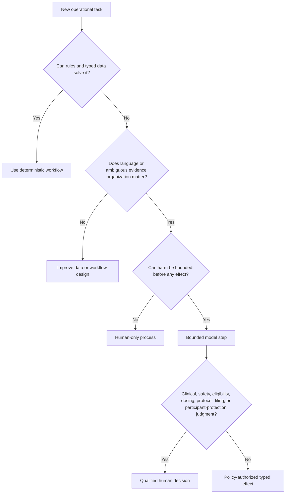

# Mission, Boundaries, Authority, and Workload Fit

## Mission

A clinical-trial operations agent reduces coordination and evidence-handling burden without displacing the humans or validated systems responsible for participant protection and reliable trial results. Its valuable work is often unglamorous: maintaining exact identities and versions, gathering traceable evidence, detecting mismatches, drafting structured records, tracking clocks, and making exceptions visible early.

The safest useful product is an **evidence and workflow assistant**. It is not an autonomous investigator, medical monitor, safety physician, data manager, statistician, pharmacist, ethics committee, regulator, or responsible party.

## Adjacent-category boundary

| Request | Owning category | What this agent may consume or contribute |
|---|---|---|
| Design a new assay or reason about a preclinical experiment | Scientific Research | Consume an approved protocol outcome, not own experimental reasoning |
| Coordinate an ordinary patient referral or clinical appointment | Healthcare Care Coordination | Coordinate only study-specific visits under an approved protocol |
| Extract tables or clauses from a protocol PDF | Document Intelligence | Consume extracted candidates with page/region provenance; validate against the approved protocol artifact |
| Monitor a regulator for changed guidance | Regulatory Intelligence | Consume a reviewed rule change packaged as a versioned jurisdiction policy release |
| Operate consent, eligibility, visits, safety, monitoring, and regulated records for a human trial | **Clinical-Trial Operations** | Own bounded orchestration and evidence assembly |

Extraction is not interpretation, researched policy is not deployed policy, and a clinical record is not automatically a trial source record. The handoff contract must preserve origin, version, reviewer, uncertainty, and intended use.

## Workload qualification

Start with a deterministic workflow. Add a model only where variability in language or evidence organization creates material value.

| Work item | Deterministic baseline | Bounded model value | Default decision |
|---|---|---|---|
| Safety deadline calculation | Rule table plus tested calendar/time-zone engine | None | Deterministic only |
| Visit-window calculation | Protocol-derived rule engine | Explain conflicts in a draft note | Deterministic effect; optional drafting |
| Protocol/site/version identity | Exact keys and release manifests | None | Deterministic only |
| Consent-form selection | Approved version/effective-date lookup | Explain why a mismatch was flagged | Deterministic only for selection |
| Eligibility evidence mapping | Criteria checklist and source references | Normalize narrative evidence into candidate mappings | Model drafts; qualified human decides |
| EDC query drafting | Templates and edit checks | Write concise, non-leading query text | Model useful within typed fields |
| Monitoring follow-up | Fixed issue/task workflow | Summarize patterns and draft follow-up | Model useful; human classifies/escalates |
| Deviation/CAPA packet | Workflow and required-field schema | Draft chronology/root-cause questions | Model useful; quality owner approves classification and CAPA |
| ICSR narrative | Structured safety case and source chronology | Draft narrative with citations | Model useful; medical/PV review required |
| Enrollment, randomization, dosing, unblinding | Validated human workflow | No appropriate decision role | Reject autonomous model action |
| Data lock, final query close, submission release | Validated approval workflow | Prepare readiness evidence | Reject autonomous commit |

### When not to use an agent

Do not add a model when deterministic forms, rules, database joins, reports, templates or workflow tasks already solve the problem adequately. Do not deploy an agent when the intended value depends on any of the following:

- replacing an investigator, clinician, medical monitor, pharmacovigilance reviewer, ethics body, sponsor responsible party, statistician, pharmacist or validated-signature authority;
- inferring consent, capacity, eligibility, diagnosis, causality, reportability, treatment, dose, unblinding necessity, protocol acceptability, data truth or submission completeness;
- operating a portal through generic browser automation when no qualified draft/effect/reconciliation contract exists;
- using inaccessible, incomplete, unversioned or contradictory source evidence as if it were current truth;
- hiding protocol/site/participant/blinding ambiguity behind model confidence or fuzzy matching;
- sending participant-facing medical or urgent safety communication without an independent qualified human path;
- writing a final record where the destination has no true draft/review state; or
- continuing when manual fallback, urgent safety routing, audit export, data recovery or qualified review is unavailable.

Stopping at a validated deterministic workflow, read-only evidence assistant or draft-only capability is a successful product decision when it bounds risk and validation burden better.

### Decision tree



## Authority model

Authentication answers who is present. It does not prove the person may perform a study action. Every consequential request needs an effect-specific authorization tuple:

```text
principal + delegated_role + sponsor + study + site_scope + participant_scope
+ protocol_version + jurisdiction + blinding_stratum + purpose + time + effect_type
```

The runtime must resolve that tuple from canonical study-role assignments, not from prompts, free text, email signatures, or model inference. Sponsor, CRO, investigator, sub-investigator, coordinator, monitor, data manager, safety reviewer, pharmacist, vendor, and auditor are different capabilities, not cosmetic labels.

### Role responsibilities are allocable, not erasable

Sponsors and investigators can transfer or delegate activities, including to CROs and service providers, but retain the oversight and responsibilities assigned by applicable GCP and regulation. The system therefore records both:

- the **performing party** for an activity; and
- the **accountable role** that reviewed, accepted, or retains oversight.

No orchestration graph should turn vendor completion into sponsor oversight evidence automatically.

## Danger tiers and control profile

| Tier | Example | Required control |
|---|---|---|
| D0 — computation | Compare two protocol manifests | Schema validation and provenance |
| D1 — bounded read | Read a site task or blinded EDC field | Purpose, least privilege, field filtering, access log |
| D2 — reversible/staged | Create a draft query or monitoring task | Policy gate, semantic effect ID, visible draft state, undo/close workflow |
| D3 — consequential commit | Release a submission, approve eligibility, randomize, close a critical query | Qualified human approval in validated system; model cannot hold authority |
| D4 — authority/safeguard change | Grant unblinded role, alter safety-clock policy, disable audit trail | Independent privileged change control, dual control, validation, high-severity audit |

Model output never lowers the tier. “Draft” must be an actual non-final state in the destination, not just a word in generated text.

## Bounded loop contract

A model step receives a task-specific projection and may call only allowlisted, typed tools. The loop ends when it has produced one accepted structured proposal or reached a stop condition.

```yaml
loop_budget:
  max_model_steps: 6
  max_tool_calls: 12
  max_wall_time_seconds: 180
  max_external_writes: 1
  max_cost_usd: "deployment-configured"
stop_on:
  - ambiguous_study_site_or_participant
  - missing_effective_protocol_manifest
  - consent_or_eligibility_conflict
  - safety_clock_at_risk
  - possible_unblinding
  - unknown_external_effect
  - source_integrity_conflict
  - authorization_or_policy_change
```

Exhausting a budget produces a durable `needs_human_review` state with evidence; it never silently retries or converts missing information into a conclusion.

## Failure modes

| Failure | Why it is dangerous | Prevention or containment |
|---|---|---|
| “Latest protocol” used globally | Sites and participants may be on different governed versions | Explicit release manifest and participant applicability |
| Site name used as identity | Mergers, aliases, and duplicate names cause cross-site actions | Immutable sponsor-scoped site ID and verified external mappings |
| Consent treated as a checkbox | Form version, process, capacity, signature, withdrawal, and privacy bases differ | Separate consent-process and permission records |
| High-confidence eligibility recommendation | Confidence is not clinical authority or complete evidence | Evidence matrix plus investigator decision |
| Model-computed safety clock | Jurisdiction triggers and calendars drift | Versioned deterministic clock service |
| Tool description relied on for safety | Metadata can be incomplete or wrong | Server-side policy and postconditions at effect boundary |
| Multi-agent handoffs for routine work | Increase identity, context, audit, and partial-failure complexity | One durable workflow by default; specialized services only for isolation |

## Workload-fit checklist

- [ ] The deterministic baseline and its limitations are documented.
- [ ] The model adds value to language or evidence organization, not to an authoritative clock or calculation.
- [ ] The worst plausible output is bounded before an external effect.
- [ ] A qualified human owns every retained-authority decision.
- [ ] Missing or contradictory evidence leads to escalation, not inference.
- [ ] The workflow has a non-agent fallback for safety and urgent participant protection.
- [ ] Identity, protocol version, jurisdiction, and blinding scope are explicit inputs.
- [ ] The intended use is narrow enough to validate and monitor.

## Related guides

- [Clinical-Trial Operations Agent](README.md)
- [Reference architecture, runtime, tools, and integrations](02-reference-architecture-runtime-tools-and-integrations.md)
- [Consent, eligibility, visits, and role governance](04-consent-eligibility-visits-and-role-governance.md)
- [Zero-to-production stages, schemas, and checklists](10-zero-to-production-stages-schemas-and-checklists.md)
- [Execution boundaries](../../runtime/execution-boundaries.md)
