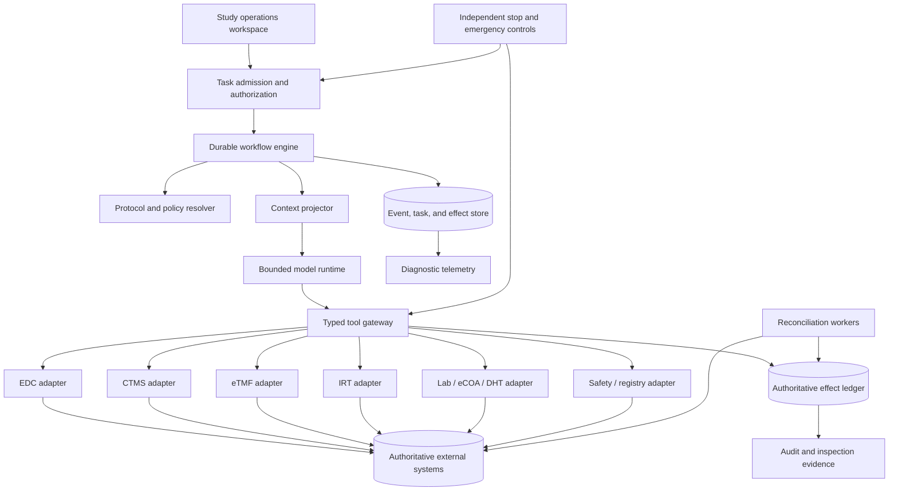
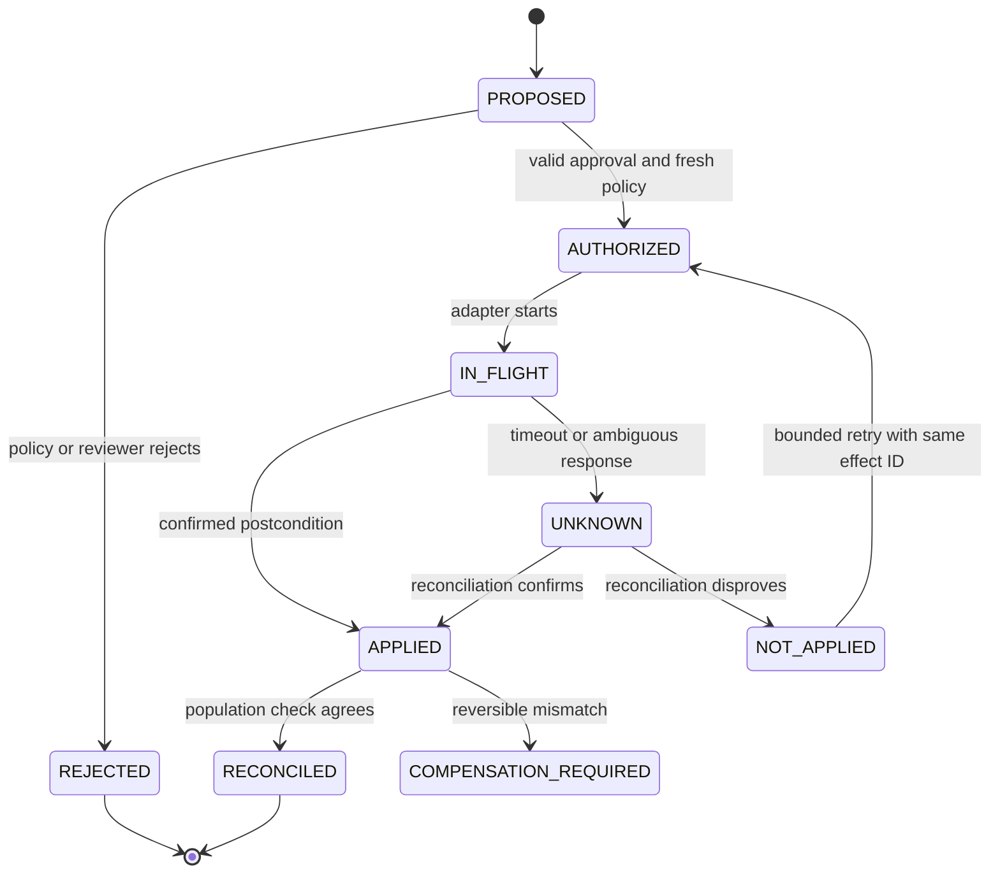

# Reference Architecture, Runtime, Tools, and Integrations

## Architecture thesis

Clinical-trial operations should be a **hybrid durable workflow**:

- deterministic services own identity, protocol effectivity, clocks, validation rules, authorization, workflow transitions, and reconciliation;
- the model handles bounded normalization, comparison, summarization, and drafting;
- source systems remain authoritative for their records; and
- humans exercise retained authority through validated approval paths.

A chat transcript is neither task state nor a regulated record.

## Logical architecture



Keep authoritative control evidence separate from sampled, redacted diagnostic telemetry. Logs help debug the system; they do not replace audit trails, approvals, source metadata, or destination acknowledgements.

## System-of-record matrix

Exact ownership is deployment-specific, but it must be explicit. This matrix is an integration inventory, not proof
that a vendor, tenant, configured application, or individual API operation is qualified for the intended use.

| Object | Typical authority | Agent projection rule |
|---|---|---|
| Approved protocol and amendment | Sponsor document/quality system and regulator/ethics approvals | Pin artifact hash, version, jurisdiction/site effectivity, and approval evidence |
| Site and study role | CTMS plus identity governance | Read current assignment; never infer from conversation |
| Participant identity | Site-controlled identity vault or EHR linkage | Use pseudonymous study ID outside site boundary |
| Source data | Qualified source system or certified copy | Keep source locator, originator, timestamp, and transformation chain |
| CRF and queries | EDC | Use field-level identifiers and EDC audit trail |
| Randomization and drug supply | IRT | Never replicate unblinded allocation into shared state |
| Essential records | Sponsor/investigator eTMF/ISF | Link or file through approved classification and review workflow |
| Visits and operational tasks | CTMS or approved workflow service | Reconcile dates/status with EDC and source systems |
| Safety case | Validated safety database | Draft into staged workspace; acknowledgement proves accepted exchange |
| Central/local lab result | Qualified lab/LIMS and applicable source | Preserve specimen, unit, reference range, corrections, and transfer version |
| Trial registration | Registry responsible-party workspace | Public APIs are read projections, not filing authority |

## Tool contract

Every tool is server-side typed, versioned, authorized, bounded, observable, and explicit about effect semantics.

```yaml
tool: edc.create_query_draft
contract_version: 3
input:
  study_id: string
  site_id: string
  participant_study_id: string
  form_oid: string
  item_oid: string
  source_value_version: string
  text: string
  rationale_source_refs: [string]
  semantic_effect_id: string
preconditions:
  - protocol_release_is_current
  - principal_has_query_draft_capability
  - participant_is_in_site_scope
  - requested_field_is_blinded_for_principal
effect_class: D2_STAGED
postconditions:
  - draft_exists_with_same_semantic_effect_id
  - destination_record_id_captured
result_states: [APPLIED, ALREADY_APPLIED, REJECTED, UNKNOWN]
audit:
  control_record: required
  diagnostic_content: redacted
```

Tool descriptions guide the model but do not enforce safety. The adapter repeats authorization and precondition checks immediately before the effect.

## Tool inclusion and rejection

### Include

- exact study/protocol/site/participant projection reads;
- approved-artifact and source-record retrieval by immutable reference;
- deterministic visit-window and safety-clock calculations;
- draft query, monitoring issue, deviation packet, CAPA follow-up, safety narrative, and TMF filing task creation;
- reconciliation, acknowledgement, audit export, and record-integrity checks;
- narrowly scoped task assignment and escalation; and
- read-only terminology and validated ruleset lookup pinned to a release.

### Reject or isolate behind human-only D3/D4 controls

- autonomous enrollment, randomization, dosing, treatment change, or eligibility confirmation;
- routine or emergency unblinding;
- direct source-data alteration or audit-trail modification;
- automatic serious/unexpected/related classification or final safety causality;
- autonomous data lock, final query closure, eTMF approval, electronic signature, or regulatory filing;
- bulk participant export, identity-vault search, cross-study person matching, or unrestricted SQL;
- generic browser automation against CTIS, safety gateways, IRT, or registry filing portals;
- tools that accept free-form endpoint URLs, credentials, study IDs, or site scopes from model text; and
- deletion or rewriting of regulated records.

If a destination offers no real draft state, do not simulate one by writing final content labeled “draft.” Stage it in an approved internal workspace and require a separate authorized commit.

## Integration qualification contract

Each adapter has a versioned dossier:

| Field | Required question |
|---|---|
| Intended use | Which study processes and risk-bearing decisions depend on it? |
| Authority | Which objects and fields are authoritative here? |
| Identity mapping | How are sponsor, study, site, subject, visit, form, specimen, and case IDs mapped and verified? |
| Interface | API/file/message version, schema, pagination, ordering, watermark, and replay behavior |
| Operation scope | Exact tenant/configuration, region, role, object, verb, fields, population and blinding projection allowed |
| Security | Authentication, delegated identity, network controls, encryption, secrets, and tenant isolation |
| Semantics | Create/update/delete behavior, audit metadata, timestamps, time zones, terminology, and null meaning |
| Idempotency | Native key, duplicate behavior, postcondition lookup, and semantic effect ID storage |
| Receipt meaning | What an HTTP response, webhook, e-signature status, delivery receipt or gateway acknowledgement proves—and does not prove |
| Failure | Timeout, partial success, throttling, stale read, out-of-order event, acknowledgement failure, and `UNKNOWN` handling |
| Reconciliation | Snapshot or report used to prove convergence and detect omissions/duplicates |
| Validation | Supplier assessment, configuration/UAT, interface tests, change control, periodic review |
| Limits and expiry | Plan/feature limits, rate/batch constraints, Beta/deprecation status, capability expiry and refresh trigger |
| Retention | Complete export, metadata/audit preservation, decommissioning, legal hold, and restore test |
| Operations | SLO, support owner, maintenance window, status page, version sunset, and incident contacts |

Webhooks are hints, not proof. Consumers store the event ID, fetch the authoritative record, tolerate duplicates/out-of-order delivery, and periodically reconcile complete bounded populations.

Exercise happy, negative, authorization-revocation, cross-scope, timeout-after-commit, stale-read, pagination, restore,
and version-change behavior for each admitted operation. See
[Qualified adapters and worked clinical-operations flows](11-qualified-adapters-and-worked-clinical-operations-flows.md)
for the operation-level capability manifest, provider-specific limitations, qualification gates, and end-to-end cases.

## Integration-specific guidance

### EDC

Use stable study/form/item/event identifiers, not display labels. Preserve original values and audit metadata. Draft queries should cite the exact item version and evidence; source correction remains with the authorized source owner. Data-review and lock transitions require validated human workflow.

### eTMF and investigator site file

File only to approved zones/artifacts with classification, trial/site scope, document date, version, owner, quality checks, and approval state. Preserve sponsor/investigator segregation, including records that must not be shared because of participant identity or blinding. A link, generated summary, or chat attachment is not automatically an essential record.

### CTMS

Treat visit/task status as an operational view, not proof that consent, source entry, monitoring, or filing occurred. Reconcile CTMS milestones against authoritative system evidence.

### IRT

Partition blinded and unblinded roles. Validate study configuration, strata, dosage calculations, UAT evidence, emergency-unblinding availability, backup procedures, and transfers to EDC. The agent may check reconciliation and supply workflow evidence; it must not interpret or expose allocation.

### Laboratories, eCOA, and DHT

Preserve device/specimen identity, collection context, units, reference ranges, time zones, missingness, corrections, and algorithm/device versions. Verify fitness for purpose, transfer completeness, cybersecurity, and participant usability. Never normalize units or infer clinical significance without a validated transformation and retained qualified review.

### Safety systems and gateways

Use a validated safety database, current pinned terminology, E2B-compatible exchange where applicable, and deterministic jurisdiction routing. Separate case preparation, medical review, submission authorization, transmission, acknowledgement, follow-up, and reconciliation.

### Trial registries

Use the responsible-party workflow. Public registry APIs are useful for reads and reconciliation but are not a substitute for an authorized filing mechanism. Portal automation is too fragile and authority-obscuring for generic autonomous commits.

## Effect lifecycle



External systems rarely provide end-to-end exactly-once effects. The application uses a semantic effect ID, destination idempotency where available, postcondition verification, an explicit `UNKNOWN` state, and reconciliation before retry.

## Runtime choice

| Option | Use when | Limitation |
|---|---|---|
| Deterministic application/workflow only | Rules, forms, clocks, and exact data are sufficient | Less flexible for narrative normalization |
| Custom bounded loop plus durable workflow | Default for one narrow operational assistant | Requires disciplined contracts and validation |
| Workflow engine with human tasks | Long-running visits, amendments, safety follow-up, and approvals | Engine history is not itself the regulated record |
| General agent framework | It materially accelerates typed tools/tracing without owning authority | Convenience abstractions can hide retries and state |
| Multi-agent orchestration | Only when strong data/role isolation justifies separate workers | More handoffs, cost, attack surface, and reconciliation |

## Related guides

- [Clinical-Trial Operations Agent](README.md)
- [Mission, boundaries, authority, and workload fit](01-mission-boundaries-authority-and-workload-fit.md)
- [State, events, context, memory, planning, and recovery](07-state-events-context-memory-planning-and-recovery.md)
- [Qualified adapters and worked clinical-operations flows](11-qualified-adapters-and-worked-clinical-operations-flows.md)
- [Tool contracts](../../tools/tool-contracts.md)
- [Idempotency and side effects](../../reliability/idempotency-and-side-effects.md)
- [Durable execution](../../runtime/durable-execution.md)
