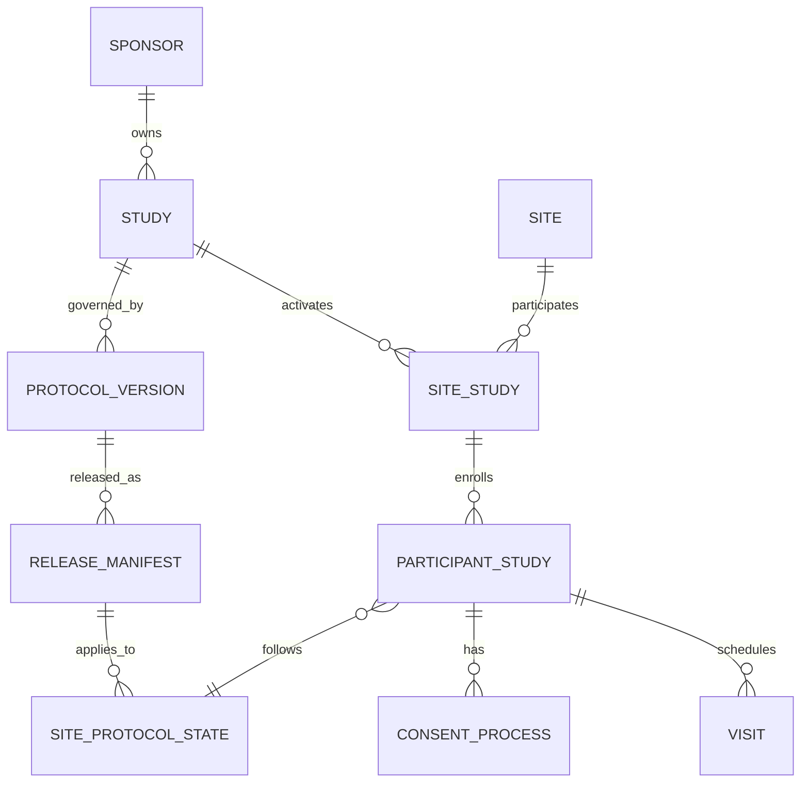
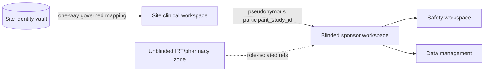
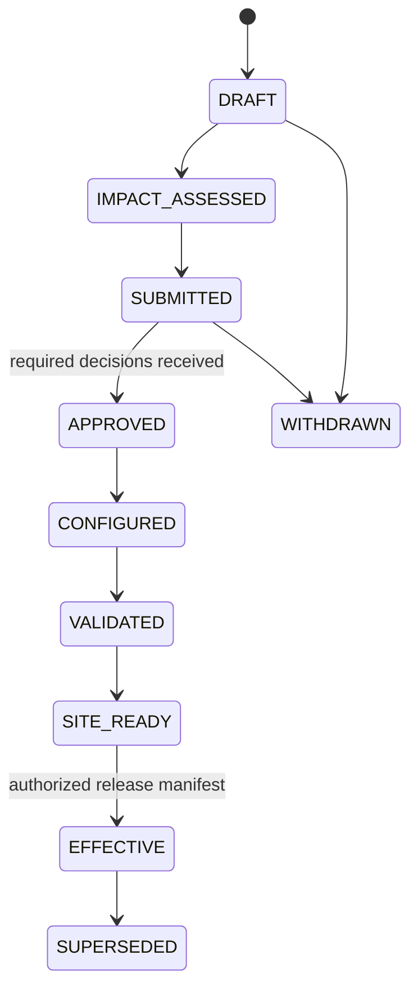

# Study, Protocol, Site, Participant Identity, and Amendments

## Identity is a safety control

A clinical-trial operation is meaningful only when bound to the correct sponsor, study, protocol version, jurisdiction, site, participant alias, visit, record version, and effective time. Natural-language names are display data, not keys.



## Canonical identity model

| Entity | Stable key | Critical distinctions |
|---|---|---|
| Sponsor | `sponsor_id` | Legal sponsor, delegated CRO, and service provider are not interchangeable |
| Study | `study_id` | Internal study, registry identifiers, IND/CTA, and vendor IDs are mapped aliases |
| Protocol | `protocol_id` | Protocol family, not a mutable document title |
| Protocol version | `protocol_version_id` | Version, amendment number, artifact hash, approval status, and date |
| Release manifest | `protocol_release_id` | Where, when, for whom, and under which approvals/configurations a version is usable |
| Site | `site_id` | Sponsor-scoped site plus verified facility/investigator mappings |
| Site-study | `site_study_id` | Activation, approvals, contracts, training, system readiness, and jurisdiction |
| Participant-study | `participant_study_id` | Site-bound pseudonymous identity for this study |
| Person link | `person_link_id` | Stored only in the site identity vault; never exposed to routine sponsor/model context |
| Visit | `visit_id` | Protocol event, occurrence, window version, location, and status |
| Specimen | `specimen_id` plus accession/aliquot/container IDs | Participant alias, collection event/time/zone, lab, transfer batch, correction and disposition |
| Safety case | `safety_case_id` | Safety-system version, source-case mappings, duplicate/merge lineage, terminology release and blinding partition |
| Deviation/issue | `deviation_or_issue_id` | Occurrence/candidate stays separate from qualified classification, reportability, CAPA and effectiveness check |
| EDC query | `query_id` | Exact participant/event/form/item/item version, source-value revision, thread sequence and state |
| Artifact/regulated record | `artifact_id` or source-native record ID plus digest | Record class/location owner, version, approval/signature, retention/hold, correction/supersession lineage |
| External effect/submission | `semantic_effect_id` plus destination-native ID | Payload/request digest, attempt, acknowledgement/postcondition, `UNKNOWN` and reconciliation revision |
| Source record | `source_record_ref` | System, object, version, originator, timestamp, certified-copy state |

Do not merge participants based on name, date of birth, email, phone, address, or model similarity. Cross-system mapping requires an approved deterministic matching process, explicit evidence, and a governed exception queue.

Identity and authority mappings are effective-dated. Sponsor/CRO responsibility, site activation, investigator/delegate qualification, participant status, protocol release, visit applicability, consent/eligibility state, data-access purpose and blinding role can all change while a task waits. Store `valid_from`, `valid_until`, supersession/revocation, source version and the time basis used. Re-resolve them at every consequential commit.

Blinding is part of identity, not a display preference. The same native case, query, specimen or IRT transaction may have different permitted projections for site, blinded sponsor, unblinded pharmacy, safety and independent statistician roles. Never join partitions merely because identifiers match; use an approved minimum projection and separately controlled mapping service.

## Participant identity zones



- Direct identifiers stay in the site-controlled zone unless a defined lawful and protocol-approved transfer requires them.
- Sponsor and agent contexts use pseudonymous study identifiers and minimum necessary fields.
- Safety may require identifiable information under a distinct purpose and access policy; it is not a reason to expose identity to every workflow.
- Unblinded allocation remains in a separately controlled zone and is not copied into shared task state, vector stores, telemetry, or evaluation sets.

## Protocol artifact versus operational release

An approved protocol document is necessary but not sufficient to make a version operational at a site. A release manifest binds document approval to actual readiness.

```yaml
protocol_release:
  protocol_release_id: pr_2026_0042_v3_eu_wave1
  study_id: study_0042
  protocol_version_id: protocol_v3
  artifact_sha256: "..."
  jurisdictions: [EU]
  site_ids: [site_101, site_104]
  effective_at: 2026-10-12T00:00:00Z
  participant_transition_policy: transition_matrix_v3
  required_consent_form_versions: [icf_adult_v4]
  approvals:
    sponsor: approval_ref
    ethics_or_irb: [approval_ref]
    regulator: [approval_ref]
  configurations:
    edc: edc_build_17
    irt: irt_release_9
    ctms: ctms_rules_31
    safety: safety_profile_12
  prerequisites:
    - site_training_complete
    - pharmacy_ready
    - lab_manual_current
    - participant_transition_reviewed
  released_by: qualified_release_owner
  released_at: 2026-10-09T14:30:00Z
```

Structured protocol standards such as ICH M11 and CDISC USDM improve placement and exchange of study-design content. They do not provide ethics/regulatory approval, decide participant transition, validate EDC/IRT configuration, or make an amendment effective.

## Governed amendment lifecycle



The model may draft an impact assessment, but deterministic policy and qualified reviewers decide which approvals are required. `APPROVED`, `SITE_READY`, and `EFFECTIVE` are explicit states backed by evidence; they are not inferred from document text or dates.

### Amendment impact matrix

| Area | Questions before release |
|---|---|
| Participant protection | New risks, procedures, contraception, compensation, burden, withdrawal, re-consent? |
| Eligibility | Criteria added/removed/reworded; participants already screened/enrolled; medical review needed? |
| Treatment and IRT | Arms, strata, kit types, dose, emergency unblinding, supply forecast, pharmacy training? |
| Visits and procedures | Windows, sequence, remote/in-person location, DHT, lab kits, local capabilities? |
| EDC and data standards | Forms, edit checks, derivations, migrations, SDTM mapping, data-review impact? |
| Safety | Reference safety information, expectedness, reporting rules, case forms, medical monitoring? |
| Consent and privacy | New approved form, translations, age/capacity transitions, data/sample secondary uses? |
| Sites and vendors | Contracts, training, readiness, version rollout, interface compatibility? |
| Records | TMF/ISF filing, superseded-document withdrawal, version history, audit evidence? |
| Registries/submissions | Substantial modification/protocol amendment, registry update, results impact? |

## Participant transition decision table

| Participant state | Default handling | Human authority |
|---|---|---|
| Not yet approached | Use only the site-effective approved version | Site/investigator procedure |
| Pre-screened, not consented | Re-evaluate outreach materials and current criteria | Investigator/delegate |
| Consented, not enrolled | Determine whether re-consent and re-screening are required | Investigator plus sponsor/ethics policy |
| Enrolled and active | Apply explicit transition matrix; do not overwrite historical version | Investigator and sponsor medical/operational owners |
| In follow-up | Apply only relevant new safety/follow-up requirements | Qualified study team |
| Withdrawn or lost to follow-up | Preserve status and retained-record obligations; do not reactivate | Investigator/sponsor policy |

Each visit, consent, eligibility assessment, procedure, dose, data value, and decision records the protocol release applicable at that time. Historical records are never relabeled merely because a new version became effective.

## Source and provenance contract

```yaml
fact_provenance:
  fact_id: fact_01J...
  subject_ref: participant_study_id
  concept: serum_creatinine
  value: 1.2
  unit: mg/dL
  source:
    system_id: local_lab_7
    record_id: result_88421
    record_version: "3"
    originator_id: device_or_user_ref
    observed_at: 2026-08-31T09:10:00+05:30
    recorded_at: 2026-08-31T09:15:11+05:30
    retrieved_at: 2026-08-31T10:02:01+05:30
  transformation:
    rule_id: unit_mapping_12
    rule_version: "2.1"
    original_value: 106.08
    original_unit: umol/L
  verification:
    certified_copy: false
    review_state: pending
```

Generated summaries are derived artifacts. They cite source references and model/configuration versions and can be regenerated; they do not replace the original record or certified copy.

## Failure modes and controls

| Failure | Control |
|---|---|
| A site receives an amendment before local approval | Release manifest scoped by jurisdiction/site and gated on approvals |
| EDC changes but IRT remains on old strata | Cross-system configuration manifest and readiness reconciliation |
| Re-consent task applied to all participants | Participant transition matrix with reviewed applicability |
| Historical data relabeled under new protocol | Immutable event-time protocol release reference |
| Duplicate subject created across imports | Site-bound identity map, unique constraints, exception queue |
| Participant PII enters sponsor model context | Projection allowlist, tokenization, DLP, access tests |
| Document text says “approved” | Approval evidence resolved from authoritative workflow, not content |
| Amendment effective date interpreted across time zones | Stored instant plus jurisdiction/site calendar and explicit local display |

## Identity and amendment checklist

- [ ] Every external identifier has a verified mapping owner and lifecycle.
- [ ] The site identity vault is separate from sponsor and model storage.
- [ ] Protocol artifacts are immutable and content-addressed.
- [ ] Release manifests name site/jurisdiction/effective time and dependent system builds.
- [ ] Participant transition is explicit and reviewable.
- [ ] Superseded materials are withdrawn from use without deleting history.
- [ ] Cross-system configuration and participant populations reconcile before release.
- [ ] Emergency changes follow a qualified, documented process and later reconciliation.

## Related guides

- [Clinical-Trial Operations Agent](README.md)
- [Consent, eligibility, visits, and role governance](04-consent-eligibility-visits-and-role-governance.md)
- [Records, queries, monitoring, deviations, and CAPA](05-records-queries-monitoring-deviations-and-capa.md)
- [Security, privacy, validation, and inspection readiness](08-security-privacy-validation-and-inspection-readiness.md)
