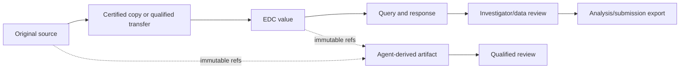
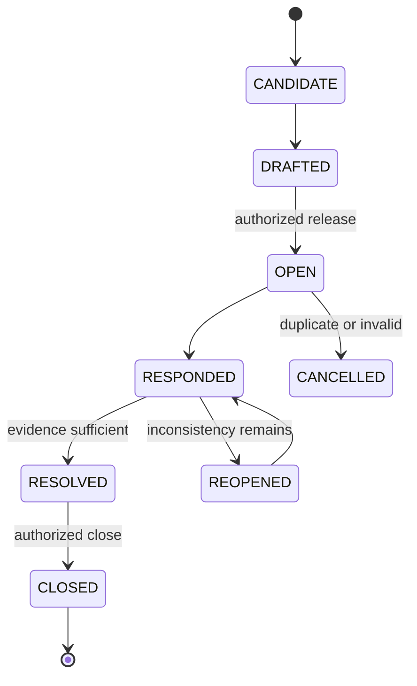
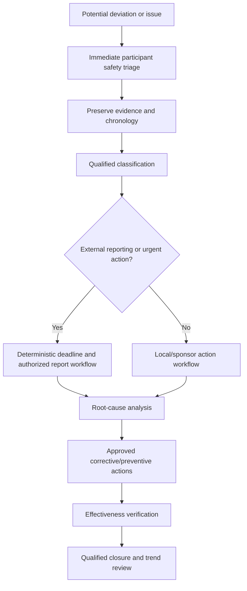

# Records, Queries, Monitoring, Deviations, and CAPA

## Regulated records are reconstructed evidence

A good record lets an independent reviewer reconstruct what happened, why, when, under which protocol and system versions, who performed and reviewed it, which source evidence existed, and how later changes were handled. A polished model narrative without that chain is weaker than a plain, traceable record.

## Record classes

| Class | Examples | Control focus |
|---|---|---|
| Source record | Clinical observation, lab result, eCOA entry, device measurement | Originator, contemporaneity, correction history, certified copies |
| CRF/EDC record | Entered/transcribed study data, edit check, query, signoff | Source mapping, audit trail, investigator review, lock state |
| Essential record | Protocol approvals, training, delegation, monitoring, safety, vendor oversight | Completeness, classification, version, access, retention, reconstruction |
| Operational task | Visit preparation, document chase, follow-up | Durable state, ownership, due time, evidence of completion |
| Derived artifact | Summary, risk indicator, model draft | Complete provenance, reproducibility, non-authoritative label |
| Control record | Approval, authorization result, effect attempt, acknowledgement, reconciliation | Append-only, unsampled, exportable, clock/version exactness |
| Diagnostic telemetry | Span, latency, token count, error detail | Redaction, sampling, retention, not a compliance substitute |

The agent must never silently promote diagnostic telemetry, transient context, or a generated summary into an essential/source record.

## Provenance chain



Every transformation records input references and versions, rule/model version, time, actor, output hash, review state, and destination. Corrections preserve the original value and reason. Audit trails must not be disabled, rewritten, summarized away, or used as a general memory store.

## Query management

Queries should be necessary, specific, non-leading, source-linked, and proportionate. The agent can improve wording and group evidence; it cannot direct a desired clinical answer.



### Query contract

| Field | Requirement |
|---|---|
| Target | Exact study/site/participant/event/form/item/version |
| Trigger | Edit check, monitoring observation, reconciliation mismatch, or qualified review |
| Evidence | Source/EDC references and comparison result |
| Text | Neutral question; no answer suggestion or unnecessary identifiers |
| Ownership | Opener, responder role, reviewer/closer role |
| Clock | Opened, due, response, reopen, close using policy calendar |
| History | Every text/status change with actor and reason |
| Completion | Authorized close plus reconciled EDC state |

Batch generation is gated by sample review and rate limits. A site must not receive a flood of low-value model queries because a threshold changed.

## Risk-based monitoring

Monitoring combines centralized signals, remote review, and on-site activity according to the study monitoring plan. Signals prioritize review; they do not prove misconduct, protocol noncompliance, or data unreliability.

### Example signal families

- consent/version mismatches and consent-to-procedure chronology;
- eligibility evidence gaps or improbable repeated patterns;
- safety event versus EDC/safety database mismatch;
- missing visits, procedures, or source review;
- unusual query aging, closure, correction, or audit-trail patterns;
- IRT/EDC/lab/eCOA reconciliation differences;
- enrollment, dropout, protocol deviation, and missing-data patterns;
- overdue essential records, training, delegation, or vendor evidence; and
- configuration/version drift between sites.

Signals need a documented denominator, expected latency, false-positive analysis, site/context adjustment, and qualified interpretation. Comparing a small specialty site to a high-volume general site without context can create unfair or misleading conclusions.

```yaml
monitoring_signal:
  signal_id: sig_01J...
  definition_version: consent_before_procedure_v4
  study_id: study_0042
  site_id: site_101
  population_window: 2026-07-01/2026-08-31
  source_watermarks:
    edc: "2026-08-31T08:00:00Z"
    consent: "2026-08-31T07:55:00Z"
  numerator: 2
  denominator: 41
  candidate_records: [case_ref_1, case_ref_2]
  reviewer_state: PENDING
```

## Distinguish operational issue, deviation, serious breach, and CAPA

| Object | Question | Authority |
|---|---|---|
| Operational issue | Is a task, system, vendor, or process not working as expected? | Operational owner triages |
| Protocol deviation candidate | Did conduct depart from the approved protocol? | Investigator/sponsor procedure classifies |
| Important deviation | Could it materially affect participant rights/safety/well-being or result reliability? | Qualified sponsor/investigator/quality review |
| Serious breach candidate | Could it significantly affect participant safety/rights or reliability/robustness under applicable rule? | Sponsor legal/quality/regulatory process |
| Corrective action | How is the detected instance corrected or contained? | Process owner/quality approval |
| Preventive/system action | How will root/system causes and recurrence risk be addressed? | Quality governance and accountable owner |

A deviation is not merely an out-of-window flag, and every deviation is not a CAPA. Conversely, repeated “minor” issues can reveal a systemic important problem. The agent prepares chronology and evidence; qualified roles determine classification and reportability.

## Deviation and CAPA handoff



The initial report must not be delayed while waiting for a complete root-cause analysis where applicable rules require prompt notification. A draft narrative should distinguish known facts, hypotheses, missing evidence, immediate containment, planned investigation, and follow-up commitments.

### CAPA quality tests

- Does the root cause explain the observed failure mechanism rather than restate it?
- Is the action owned, due, resourced, and proportionate?
- Does it address system and vendor conditions, not only retrain an individual?
- Is effectiveness measurable with a time-bound population and acceptance criterion?
- Are unintended consequences, protocol/site variation, and recurrence elsewhere considered?
- Are late or ineffective actions escalated independently of the model?

## Inspection-ready evidence package

An evidence package is generated from authoritative systems and includes:

1. scope, study/site/participant aliases, period, protocol releases, and system versions;
2. role/delegation and access evidence for relevant actors;
3. source/record inventory and current storage locations;
4. chronological events and decisions with source references;
5. audit trails, approvals, signatures, effects, acknowledgements, and reconciliation results;
6. deviations, safety cases, monitoring issues, CAPA, and closure evidence;
7. validation/configuration/change-control evidence for relevant computerized systems; and
8. known limitations, missing records, migrations, outages, and open follow-up.

It must be searchable, sortable where needed, human-readable, exportable without the live agent, and reproducible from retained data. Generated explanations can aid navigation but cannot conceal missing evidence.

## Failure modes

| Failure | Consequence | Control |
|---|---|---|
| Agent edits source to resolve a query | Original truth and attribution lost | No source-write tool; authorized correction workflow only |
| Audit trail sampled into telemetry | Incomplete inspection evidence | Separate authoritative unsampled ledger/export |
| Risk score labels a site “noncompliant” | Unsupported conclusion and bias | Signal language, evidence drill-down, qualified classification |
| Vendor export omits metadata | Trial cannot be reconstructed | Qualified export/decommissioning tests and periodic restore |
| Closed query diverges from current EDC | False completeness | Post-close and population reconciliation |
| CAPA closes on task completion | No evidence of effectiveness | Separate effectiveness-check state and reviewer |
| Narrative smooths contradictory timestamps | Critical chronology hidden | Structured chronology plus explicit conflict fields |

## Readiness checklist

- [ ] Source, essential, derived, control, and diagnostic records are classified.
- [ ] Audit history preserves original values, actors, times, and reasons.
- [ ] Query generation is neutral, rate-limited, and sample-reviewed.
- [ ] Monitoring signals retain definitions, populations, watermarks, and false-positive analysis.
- [ ] Deviation, important deviation, serious breach, and CAPA are separate governed objects.
- [ ] Immediate safety/reporting action is not blocked by root-cause completion.
- [ ] Reconciliation covers records, audit metadata, acknowledgements, and closure states.
- [ ] Inspection export works without model availability.

## Related guides

- [Clinical-Trial Operations Agent](README.md)
- [Reference architecture, runtime, tools, and integrations](02-reference-architecture-runtime-tools-and-integrations.md)
- [Safety, IRT, laboratories, blinding, and reconciliation](06-safety-irt-laboratories-blinding-and-reconciliation.md)
- [Security, privacy, validation, and inspection readiness](08-security-privacy-validation-and-inspection-readiness.md)
- [Tool results, artifacts, and provenance](../../tools/tool-results-artifacts-and-provenance.md)

