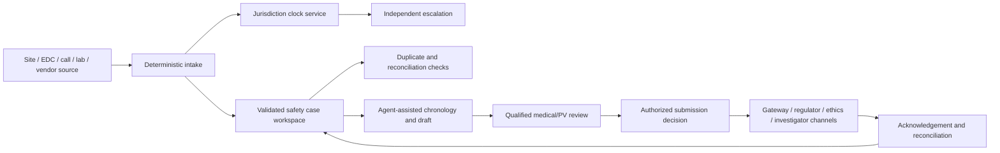
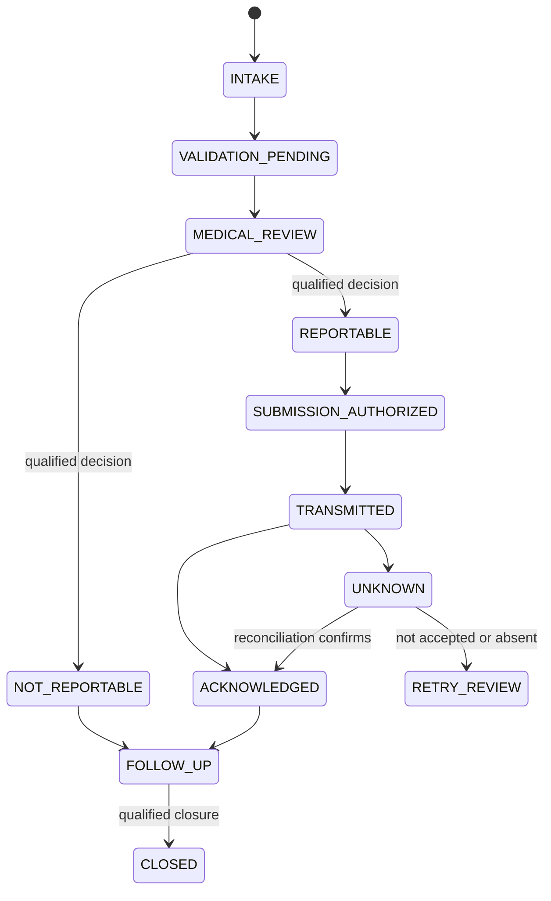
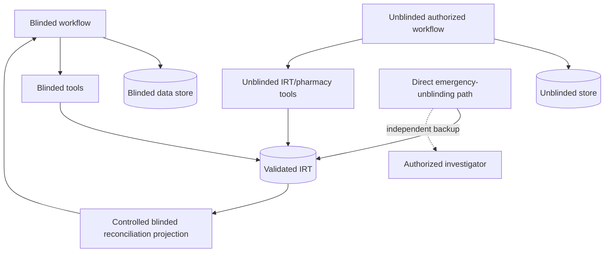

# Safety, IRT, Laboratories, Blinding, and Reconciliation

## Safety is an independent, deadline-driven workflow

The agent may accelerate intake, chronology, source gathering, duplicate search, narrative drafting, and follow-up coordination. It must not be the only route by which a symptom or event reaches an investigator or safety team, and it cannot make final seriousness, expectedness, relatedness/causality, listedness, reportability, or medical-management decisions.

## Safety case architecture



The clock and escalation path must continue when the model, vector store, workflow UI, or a noncritical integration is unavailable.

## Minimum safety event and clock contract

```yaml
safety_case_control:
  safety_case_id: sc_01J...
  study_id: study_0042
  site_id: site_101
  participant_study_id: pt_2041
  initial_receipt_at: 2026-08-31T07:42:11Z
  receipt_channel: site_portal
  minimum_case_criteria_at: 2026-08-31T07:55:09Z
  sponsor_awareness_at: 2026-08-31T07:42:11Z
  qualified_determinations:
    seriousness: PENDING
    expectedness: PENDING
    causality: PENDING
  source_refs: [source_ref_1, source_ref_2]
  clock_instances:
    - clock_id: clk_01J...
      rule_release: us_ind_safety_2026_08
      trigger_type: sponsor_initial_receipt
      triggered_at: 2026-08-31T07:42:11Z
      due_at: 2026-09-07T07:42:11Z
      calendar_basis: calendar_days
      state: RUNNING
  submission_effects: []
```

Store each potentially relevant timestamp rather than one ambiguous “awareness date.” The deployed jurisdiction rules determine which event starts which clock. Changes to a source timestamp require an audit-preserving correction and clock impact review.

### Example clocks are not a universal rule table

US IND rules include 15-calendar-day reporting after the sponsor determines an event is reportable, with a 7-calendar-day path for unexpected fatal or life-threatening suspected adverse reactions. EU/EEA, UK, device, ethics-committee, protocol, sponsor, investigator-notification, pregnancy, urgent-safety-measure, and serious-breach duties have different triggers and channels. Encode exact applicable rules in a reviewed, tested, versioned policy release; do not ask a model to recall them.

## Safety case workflow



At every state, new information can reopen medical review and spawn new clock instances. Closing a workflow task never cancels a statutory clock unless a qualified determination and policy transition say so.

## Model-safe safety tasks

| Allowed | Required safeguards |
|---|---|
| Extract candidate event dates, products, doses, labs, outcomes | Exact source spans, conflict flags, no inferred values |
| Build a chronology | Preserve contradictory times and source versions |
| Draft an ICSR narrative | Structured source citations, terminology release, medical review |
| Propose missing-information questions | Non-leading, prioritized, minimum necessary, human release |
| Suggest potential duplicates | Explain match features; qualified merge decision |
| Reconcile EDC and safety cases | Deterministic population/field comparison and exception queue |

Never let generated prose overwrite structured medical determinations or the source record. Never infer “not serious,” “expected,” or “unrelated” from silence.

## IRT and blinding controls

Blinding is an architectural partition, not a prompt instruction.



Required controls include:

- preidentified blinded and unblinded roles, separate groups and short-lived credentials;
- separate storage, queues, workers, encryption keys, caches, context projections, and traces where warranted;
- response-shape tests preventing allocation, treatment arm, kit meaning, or unblinded aggregates from leaking;
- tested routine and emergency unblinding, including backup and investigator access without agent or sponsor delay;
- explicit logging of unblinding reason, actor, participant, time, information revealed, and downstream notification; and
- no real unblinded production data in general-purpose evaluation, support, or analytics datasets.

The agent cannot decide whether emergency unblinding is clinically necessary and must not sit in the critical path.

## Laboratory, eCOA, and DHT data integrity

### Laboratory transfer keys

At minimum preserve study, site, participant alias, visit/event, specimen/accession, collection time and time zone, test code and terminology version, original value/unit, reference range, result/correction status, lab identity, transfer batch/file/API version, and source audit metadata.

### Reconciliation dimensions

| Comparison | Examples of exceptions |
|---|---|
| Expected versus received specimens | Missing, duplicate, wrong visit, wrong participant alias |
| Lab versus EDC | Value/unit/date mismatch, corrected result not propagated |
| Local versus central lab | Test identity, reference range, clinical-review responsibility |
| eCOA/DHT versus device platform | Missing sample, clock drift, device/user mismatch, algorithm-version change |
| IRT versus EDC | Visit, randomization status, dose/dispense data, participant status |
| Safety versus EDC | AE/SAE dates, outcome, seriousness fields, product exposure |

Unit conversion and code mapping use validated, versioned deterministic rules. The model can identify an unmapped term or draft an explanation, but it does not silently transform clinical data.

## Reconciliation design

Event-by-event processing is not enough. Run bounded population reconciliation at defined watermarks.

```yaml
reconciliation_run:
  reconciliation_id: rec_01J...
  definition_version: safety_edc_v7
  study_id: study_0042
  site_scope: [site_101]
  population_rule: all_participants_with_ae_or_safety_case
  window_end: 2026-08-31T00:00:00Z
  source_snapshots:
    edc: export_778_sha256
    safety: report_221_sha256
  counts:
    left: 73
    right: 74
    matched: 71
    left_only: 2
    right_only: 3
    field_mismatch: 4
  exception_ids: [rex_1, rex_2]
  reviewed_by: null
```

Reconciliation definitions are versioned and validated with positive, negative, duplicate, correction, late-arriving, deleted/tombstoned, and partial-transfer cases. A zero-exception result is evidence only if the population, watermarks, mapping, and completeness checks are valid.

## Partial failure and recovery

| Failure | Immediate response | Recovery proof |
|---|---|---|
| Safety transmission times out | Mark `UNKNOWN`; do not create a new case automatically | Gateway acknowledgement or destination query by case/effect ID |
| Lab file partially loads | Quarantine batch; prevent mixed completion state | Record-count/hash/control-total agreement after bounded redrive |
| IRT webhook is duplicated | Deduplicate event, fetch current authoritative state | Population reconciliation and event-ID record |
| eCOA device clock drifts | Preserve raw timestamps and flag | Qualified correction/mapping plus audit evidence |
| Unblinded value appears in blinded response | Stop affected admission/tools, preserve evidence, rotate as needed | Leak-scope analysis, access review, validated fix, noncompensating tests |
| Terminology version changes mid-case | Pin case/release; assess migration explicitly | Reviewer-approved version transition and regenerated exchange |

## Safety and blinding checklist

- [ ] Safety intake and escalation work without the model.
- [ ] All clock triggers and due times come from versioned deterministic policy.
- [ ] Case preparation, medical determination, submission, acknowledgement, and follow-up are distinct.
- [ ] Unknown transmission outcomes reconcile before retry.
- [ ] Blinded/unblinded separation covers data, compute, tools, logs, and evaluation.
- [ ] Emergency unblinding has a direct human path and tested backup.
- [ ] Lab/eCOA/DHT raw data, corrections, device/algorithm versions, and time zones are retained.
- [ ] Reconciliation proves bounded population completeness, not just event processing.

## Related guides

- [Clinical-Trial Operations Agent](README.md)
- [Consent, eligibility, visits, and role governance](04-consent-eligibility-visits-and-role-governance.md)
- [Records, queries, monitoring, deviations, and CAPA](05-records-queries-monitoring-deviations-and-capa.md)
- [State, events, context, memory, planning, and recovery](07-state-events-context-memory-planning-and-recovery.md)

