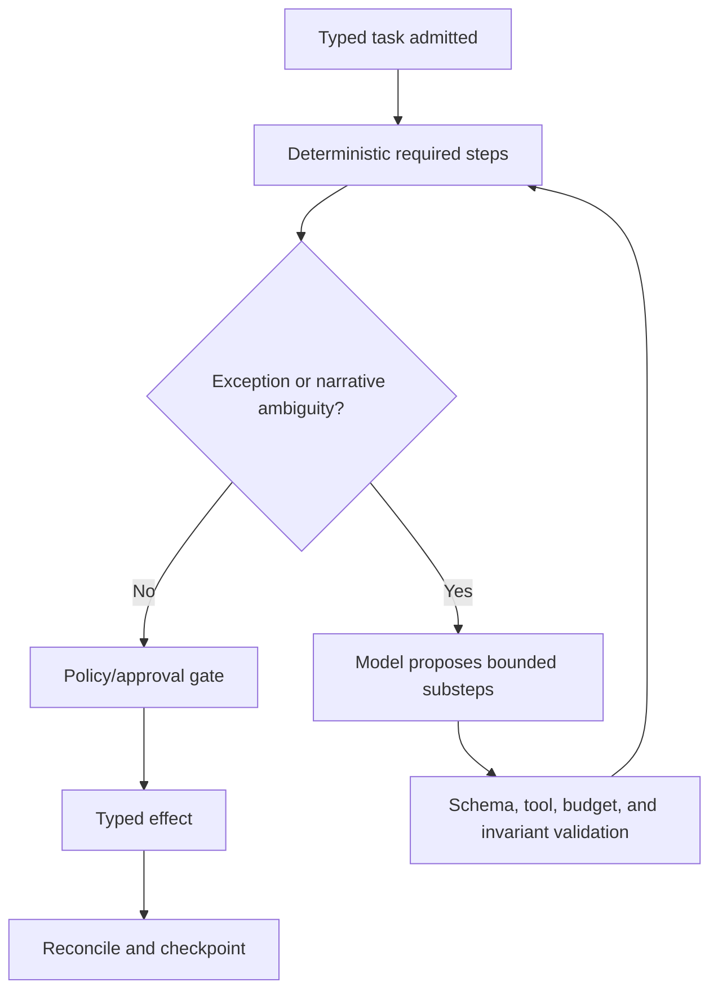

# State, Events, Context, Memory, Planning, and Recovery

## Durable state is outside the conversation

Clinical-trial workflows last days, months, or years; model contexts last one bounded step. The authoritative task state belongs in a transactional durable store with versioned events and effects. A context window is a disposable projection.

## State model

```yaml
task_state:
  task_id: task_01J...
  task_type: safety_case_preparation
  study_id: study_0042
  site_id: site_101
  participant_study_id: pt_2041
  protocol_release_id: pr_2026_0042_v3_eu_wave1
  jurisdiction_policy_release: eu_ct_2026_07
  blinding_partition: BLINDED_SAFETY
  state: WAITING_FOR_MEDICAL_REVIEW
  state_version: 18
  source_watermarks: {}
  pending_effect_ids: []
  clock_ids: [clk_01J...]
  approval_refs: []
  evidence_refs: [source_ref_1]
  next_due_at: 2026-09-02T07:42:11Z
  behavior_release_id: behavior_2026_08_31_3
```

Optimistic concurrency or transactional state transitions prevent two workers from advancing the same task based on stale versions.

## Event envelope

```yaml
event:
  event_id: evt_01J...
  event_type: source.safety_information.received.v2
  occurred_at: 2026-08-31T07:42:11Z
  recorded_at: 2026-08-31T07:42:14Z
  producer: site_portal_adapter
  tenant_id: sponsor_18
  study_id: study_0042
  site_id: site_101
  participant_study_id: pt_2041
  correlation_id: case_01J...
  causation_id: portal_submission_994
  schema_version: 2
  classification: RESTRICTED_CLINICAL
  payload_ref: encrypted_object_ref
  payload_sha256: "..."
```

Consumers are idempotent by event ID, tolerate duplicates and out-of-order delivery, verify schema and scope, fetch authoritative records when a notification is only a hint, and dead-letter/quarantine poison events without losing safety escalation.

## Context projection

Build context per step from authoritative state:

1. identity header: sponsor, study, protocol release, site, participant alias, jurisdiction, role, blinding partition;
2. task objective and permitted output schema;
3. current state, clocks, approvals, pending/unknown effects, and stop conditions;
4. minimum relevant source facts with immutable references and version/watermark;
5. approved protocol/policy excerpts with provenance;
6. tool allowlist and budgets; and
7. known conflicts, missingness, and uncertainty.

Do not dump a whole protocol, participant chart, TMF, mailbox, or prior conversation into the prompt. Retrieve narrowly and treat all retrieved text—including protocol annotations, emails, site notes, and vendor content—as untrusted data, never as instructions.

## Compaction continuity contract

Compaction may shorten narrative history but must not erase:

- study, protocol release, jurisdiction, site, participant alias, and blinding partition;
- current consent/eligibility/visit/safety/deviation state;
- qualified decisions and their approval/source references;
- all active clocks, deadlines, escalations, and owners;
- pending and `UNKNOWN` external effects with semantic effect IDs;
- source watermarks, unresolved conflicts, and missing evidence;
- behavior, tool, schema, policy, terminology, and adapter versions; and
- explicit stop conditions and next action.

```yaml
compaction_receipt:
  receipt_version: 1
  task_id: task_01J...
  task_state_version: 18
  projection_schema_version: 5
  generated_at: 2026-08-31T08:10:00Z
  input_context_sha256: "..."
  output_projection_sha256: "..."
  derived_event_range: {first: evt_01H..., last: evt_01J...}
  source_event_high_watermark:
    edc: {sequence: 991, observed_at: 2026-08-31T08:09:40Z}
    safety: {case_version: 8, observed_at: 2026-08-31T08:09:51Z}
  versions:
    behavior_release: trial-agent-2026-08-31.3
    protocol_release: pr_2026_0042_v3_eu_wave1
    policy_release: eu_ct_2026_07
    model_snapshot: approved-model-2026-08
    tool_contract: clinical-tools/7
    adapter_capabilities: {edc_read: oc-study-read/2026-02-24}
    schemas: {task_state: 5, safety_case: 11}
  approval_refs:
    - {ref: medical_review_811, expires_at: 2026-09-01T12:00:00Z}
  active_clocks:
    - {clock_id: clk_01J..., rule: safety_rule_22, due_at: 2026-09-02T07:42:11Z, owner: pv_queue}
  pending_effect_ids: [effect_72]
  unknown_effect_ids: []
  blinding_invariants:
    partition: BLINDED_SAFETY
    projection_policy: blind-policy/12
    invariant_sha256: "..."
  next_safe_action: reconcile_effect_72
  context_compiler_release: trial-context/4
  compactor_release: trial-compactor/2
  invariants_hash: "..."
  omitted_items:
    - {kind: prior_tool_payload, reason: replaced_by_authoritative_ref, recoverable_ref: encrypted_object_77}
  narrative_summary: encrypted_ref
  authoritative_refs: [state_ref, effect_ledger_ref, clock_ref]
```

The narrative summary is derived and replaceable. Resume logic loads the receipt and authoritative references, verifies
the receipt and projection digests, refreshes every source past its recorded high-watermark, re-resolves expiring
approvals and effective-dated authority, and checks the blinding and state invariants before selecting the recorded
next safe action. If any referenced record is unavailable, a digest differs, an active clock is absent, or an effect is
unaccounted for, the task pauses for reconstruction or reconciliation; it does not ask the model to fill the gap.

Compaction tests must cover repeated compaction, crash between state checkpoint and receipt publication, out-of-order
source events, a corrected source below a sequence watermark, policy/protocol change during suspension, and loss of an
`UNKNOWN` effect or active clock. A receipt is acceptable only if a fresh reconstruction produces the same control
projection and explicitly reports every omitted item with a recoverable authoritative reference.

## Memory classes

The runtime recognizes **exactly these seven memory lifetimes**. Raw records, object stores, queues, caches, indexes,
and telemetry are storage or transport mechanisms, not an eighth lifetime.

| Memory class | Use | Decision and controls |
|---|---|---|
| Turn/scratch memory | Tool results and reasoning for one model step | Ephemeral; no authoritative state |
| Working/run memory | Bounded evidence for a task attempt | Minimal, encrypted, discarded after checkpoint |
| Session memory | User navigation during one work session | Optional UI convenience; no clinical fact authority |
| Durable workflow/task memory | Workflow state, clocks, evidence refs, effects, approvals | Required; transactional, versioned, retained per policy |
| Domain knowledge memory | Approved protocol facts, data models, terminology, site/delegation relationships, SOPs, compiled workflows, jurisdiction rules, and review rubrics | Required where used; resolve from canonical authorized systems or human-published versioned releases with owner, effective dates, source, correction, and withdrawal |
| Long-term/preference memory | Nonclinical UI language, time-zone display, and accessibility preferences only; cross-task profiles about participants or investigators are rejected | Explicit, editable, purpose-limited, expiring and deletable; never changes criteria, authority, or blinding |
| Episodic/outcome memory | Prior cases used to improve behavior | Only governed, minimized/deidentified evaluation cases with approvals; never automatic precedent or behavior change |

Raw interactions/evidence and derived artifacts remain governed record stores, not additional memory lifetimes. Cross-worker continuity uses typed artifacts and events; implicit shared or free-form multi-agent memory is rejected.

Vector retrieval does not make content current, approved, or authoritative. Clinical records should not become an open-ended embedding memory by default; if retrieval is justified, enforce study/site/purpose/blinding filters before search, minimize fields, test deletion/retention, and cite original records.

### Lifetime admission, deletion, and poisoning tests

| Lifetime | Permitted use | Reject as input | Retention/deletion proof | Poisoning or correction test |
|---|---|---|---|---|
| Turn/scratch | One bounded model call and validated tool result | Any authority, deadline, approval, or durable decision | Destroy at call end; prove no prompt/tool payload survives in caches or traces | Inject instructions in a retrieved note; prove they cannot change tool scope or persist |
| Working/run | Candidate mappings and minimum evidence for one attempt | Eligibility, causality, consent, unblinding, or other retained human decisions | Discard after a successful checkpoint or failed attempt; retain only governed references | Correct a source during the run; prove stale candidates are invalidated before commit |
| Session | Navigation, filters, and unsaved UI convenience | Clinical truth, participant status, credentials, or workflow state | Expire on logout/inactivity and support explicit deletion | Cross-user and cross-tenant session-reuse tests show zero leakage |
| Durable workflow/task | Versioned state, clocks, effects, approvals, and evidence references | Hidden reasoning, copied source narratives, or inferred authority | Apply record-class policy, holds, correction, and verified deletion where allowed | Tamper with or replay an event; integrity checks reject it and append correction lineage |
| Domain knowledge | Human-published protocol, policy, SOP, terminology, and qualified mapping releases | Drafts, email assertions, generated summaries, withdrawn or not-yet-effective releases | Preserve effective/superseded lineage; withdraw a release from new use without erasing history | Revoke a protocol/policy release and prove every dependent projection invalidates |
| Long-term/preference | Explicit language, display time zone, and accessibility choices | Participant/investigator profiles, criteria shortcuts, role, treatment, or behavioral scoring | Show, edit, expire, and delete independently of clinical records | Seed a preference that conflicts with criteria or blinding; prove it has no decision effect |
| Episodic/outcome | Approved, minimized evaluation fixtures with a known reviewed outcome | Automatic precedent, raw production cases, or silent online learning | Track purpose, approval, lineage, expiry, hold, and deletion propagation | Introduce a misadjudicated incident case; quarantine it and prove no release learns from it |

Promotion is explicit: ephemeral content does not become durable, domain, preference, or episodic material merely
because it appeared often. A qualified owner, purpose, destination lifetime, provenance, retention class, access scope,
and correction/deletion path are required. Deleting or correcting an authoritative source invalidates derived indexes,
summaries, fixtures, and projections; it does not silently rewrite regulated history.

## Planning pattern

Use a deterministic workflow skeleton with a bounded exception planner.



The planner may reorder only explicitly commutative read/draft tasks. It cannot remove required reviews, invent new tools, broaden participant/site scope, change clocks, alter protocol effectivity, or reinterpret a stop condition.

### Why not default multi-agent orchestration

Specialist agents add handoffs, duplicated context, conflicting outputs, greater privacy surface, cost, and harder reconstruction. Prefer one bounded model worker. Use separately deployed workers only when isolation or materially different qualification justifies it—for example an unblinded reconciliation service—and exchange typed minimal events, not prose delegation.

## Recovery and cancellation

| Condition | Runtime behavior |
|---|---|
| Worker crash before effect | Lease expires; rebuild state and retry bounded step |
| Crash after effect request | Load effect ledger; reconcile `IN_FLIGHT`/`UNKNOWN` before any retry |
| Human cancels task | Stop admission and future effects; preserve completed records and active legal/safety obligations |
| Protocol/policy changes mid-run | Pin analysis; revalidate current release at commit; pause if outcome changes |
| Role revoked mid-run | Commit authorization fails; route to reassignment |
| Safety clock approaches threshold | Preempt lower-priority work and escalate independently |
| Source correction arrives | Append event, invalidate derived artifact, re-run affected rules, require review if decision impact |
| Model/provider unavailable | Use deterministic/manual fallback; preserve queues and deadlines |

Retries have separate budgets for model calls, read calls, and external effects. Never retry a D3 effect merely because the model said “try again.”

## Invariants

```text
I1: no effect without fresh authorization and policy release
I2: no effect against ambiguous study/site/participant identity
I3: no participant action without an effective protocol release
I4: no model-generated eligibility, dosing, safety, or unblinding decision
I5: no retry while prior semantic effect outcome is UNKNOWN
I6: no blinded context may contain unblinded fields or derivable treatment clues
I7: every derived claim has source references and version provenance
I8: every active safety/reporting clock has owner, escalation, and independent persistence
```

## State and recovery checklist

- [ ] Durable state can reconstruct work without chat history.
- [ ] Events have stable identity, causation, classification, and schema version.
- [ ] Context is a least-privilege projection with explicit watermarks.
- [ ] Compaction retains every safety, authority, identity, effect, and provenance invariant.
- [ ] Each memory class has an explicit include/reject and retention decision.
- [ ] Planning cannot modify required workflow structure or authorization.
- [ ] Crash, cancellation, policy change, revocation, and correction paths are tested.
- [ ] Unknown effects reconcile before retry.

## Related guides

- [Clinical-Trial Operations Agent](README.md)
- [Reference architecture, runtime, tools, and integrations](02-reference-architecture-runtime-tools-and-integrations.md)
- [Safety, IRT, laboratories, blinding, and reconciliation](06-safety-irt-laboratories-blinding-and-reconciliation.md)
- [Agent state and event contracts](../../runtime/agent-state-and-event-contracts.md)
- [Compaction and continuity](../../context-memory/compaction-and-continuity.md)
- [Memory architecture](../../context-memory/memory-architecture.md)
