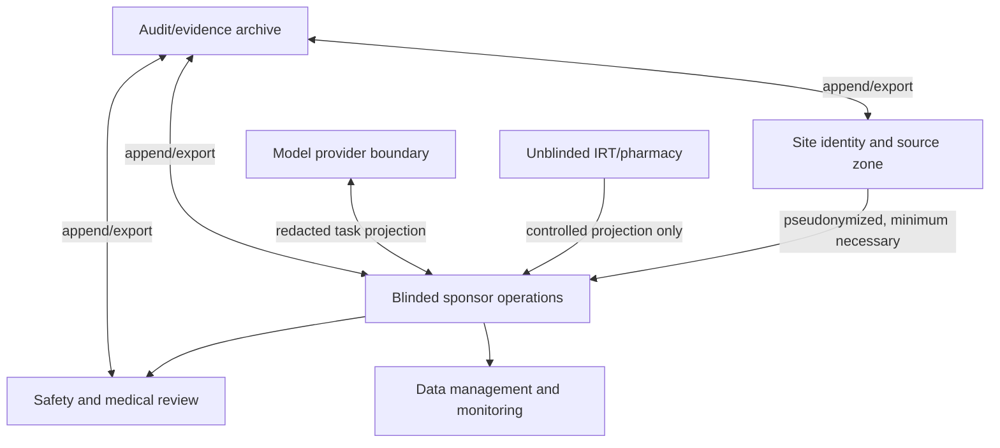

# Security, Privacy, Validation, and Inspection Readiness

## Security model

Clinical-trial operations combine sensitive health information, participant identifiers, investigational-product details, commercially sensitive protocol data, blinded allocation, safety cases, and regulated records. The primary threats are not limited to classic hacking: wrong-scope access, prompt injection, overbroad exports, role drift, vendor failure, unblinding, silent interface loss, record deletion, and unvalidated behavior changes can all harm participants or evidence reliability.

## Data and trust zones



Cross-zone transfers need an explicit purpose, field allowlist, lawful/contractual basis, encryption, recipient, retention, and audit record. Tokenization is not anonymity if the mapping or singling-out risk remains.

## Identity and access

Apply phishing-resistant authentication and an appropriate NIST assurance level for privileged roles, short-lived workload credentials, least privilege, separation of duties, privileged-access review, and rapid revocation. Authorization binds the authenticated principal to current study delegation and effect context.

### Commit-time authorization example

```yaml
authorization_request:
  principal_id: user_882
  workload_id: workflow_service_3
  action: safety.submit_case
  sponsor_id: sponsor_18
  study_id: study_0042
  site_scope: [site_101]
  jurisdiction: US_IND
  blinding_partition: SAFETY_AUTHORIZED
  purpose: expedited_safety_reporting
  delegation_ref: role_assignment_71
  approval_ref: medical_and_submission_approval_99
  protocol_release_id: pr_2026_0042_v3_us
  policy_release_id: us_ind_safety_2026_08
  requested_at: 2026-08-31T09:00:00Z
```

Policy evaluates current revocation, role, training/qualification where required, site/study scope, purpose, blinding, protocol/policy version, approval validity, destination, and effect tier. Cached authorization cannot outlive its bounded freshness window.

## Privacy and consent engineering

- Minimize participant data before storage, retrieval, model calls, traces, and support access.
- Keep direct identity and re-identification mappings at the site unless a defined use requires transfer.
- Separate participation consent, privacy authorization/lawful basis, optional permissions, and withdrawal choices.
- Enforce purpose limitation and prohibit silent reuse of trial data for model training.
- Define retention by record class, jurisdiction, study contract, product, legal hold, and protocol—not one blanket TTL.
- Support access/correction/withdrawal workflows without erasing immutable regulated history improperly.
- Perform transfer, processor/vendor, data-residency, and re-identification assessments with qualified privacy/legal owners.
- Use synthetic or appropriately deidentified data for most development; re-identification risk is evaluated, not asserted.

The agent cannot decide the legal basis for processing or whether erasure must occur. It executes an approved, versioned privacy policy and preserves exception evidence.

## Prompt injection and untrusted content

Protocols, PDFs, emails, monitoring notes, EDC text, site responses, and vendor payloads can contain instructions or malicious content. Treat them as data.

Controls:

1. system/developer policy and tool scopes are outside retrieved content;
2. parsing separates text, metadata, and active content; macros/scripts are never executed;
3. retrieval is filtered before search by tenant/study/site/purpose/blinding access;
4. tools reject URLs, credentials, IDs, scopes, and policy overrides sourced from untrusted text;
5. model output is schema-validated and policy-checked before any effect;
6. high-risk content cannot authorize itself, request a broader export, or suppress audit; and
7. adversarial fixtures cover indirect injection, hidden text, poisoned documents, and exfiltration attempts.

## Computerized-system validation strategy

Validation is risk-based and tied to intended use, participant safety, data reliability, and regulated-record importance. It covers the configured system and interfaces, not merely the vendor's generic model card or certification.

### Validation dossier

| Evidence | Minimum content |
|---|---|
| Intended use and boundaries | Supported workflows, users, studies, jurisdictions, prohibited decisions, fallback |
| Risk assessment | Hazards, failure effects, detectability, controls, residual risk, owners |
| Requirements and traceability | User/system requirements mapped to design, tests, and releases |
| Supplier/service assessment | Hosting/model/tool vendors, quality/security evidence, subcontractors, changes |
| Configuration specification | Prompts, models, schemas, policies, protocol rules, adapters, terminology, access |
| Verification/validation | Unit, contract, integration, scenario, negative, security, recovery, performance, usability |
| Data migration/transfer | Counts, hashes, metadata, audit trails, mappings, exception handling |
| Release evidence | Approved manifest, noncompensating gates, rollback/disable plan, training |
| Operations | Monitoring, periodic review, incident/CAPA, backup/restore, archival, decommissioning |

“The model usually produces good answers” is not validation. Test the whole intended workflow, including model variability, deterministic controls, humans, source systems, degraded modes, and export/reconstruction.

### Supplier and software supply-chain controls

Supplier assessment does not transfer sponsor/investigator responsibility. Inventory the model provider, hosting,
identity service, workflow engine, adapters/SDKs, parsers, document converters, terminology packages, container/base
images, deployment actions, support tools, subcontractors and data flows used by each behavior release. Pin approved
versions or verified digests, preserve build/provenance and dependency evidence, verify signatures where available,
scan for vulnerabilities/malware/secrets, restrict package and artifact registries, and separate build, release and
production credentials.

Contract and monitor provider-managed model/API/configuration changes, deprecation, regional routing, subprocessors,
support access, retention/training behavior and incident notification. A supplier certificate, software bill of
materials, signed artifact or vulnerability scan is useful evidence, but none alone validates the configured intended
use. An unreviewed dependency, parser rule, connector field or model alias change is a behavior change; fail admission
or affected operations outside the signed manifest and use a reviewed rollback/manual path.

## AI-specific assurance

Use a context-of-use risk assessment consistent with lifecycle AI-risk principles:

- define what the output means and who may use it;
- characterize training/benchmark relevance without assuming vendor data represent the study;
- evaluate performance by protocol version, site type, language, data quality, and critical workflow slice;
- measure uncertainty and abstention, but never treat confidence as authority;
- monitor drift from model, prompt, retrieval, terminology, policy, data, and user behavior changes;
- document human factors, automation bias, alert fatigue, and foreseeable misuse;
- keep severe safety/privacy/integrity failures noncompensating; and
- require change control and revalidation proportionate to impact.

## GxP and data-integrity controls

Use ALCOA+ as a design lens: attributable, legible, contemporaneous, original/true copy, accurate, complete, consistent, enduring, and available. A system claiming those words is not automatically compliant.

| Risk | Control evidence |
|---|---|
| Shared accounts or ambiguous model actor | Unique human and workload identities; actor chain in audit record |
| Changed/deleted record | Preserved original, new value, time, actor, reason, review; protected audit trail |
| Stale or incomplete interface | Watermarks, control totals, replay, reconciliation, alerts |
| Generated artifact mistaken for source | Derived label, immutable source links, review status |
| Migration loses metadata | Pre/post inventory, hashes/counts, audit export, exception resolution |
| Vendor decommissioning loses records | Tested complete export, readable archive, restore and retrieval evidence |
| Time inconsistency | UTC event storage, reliable synchronized clocks, original offsets retained |

## Inspection readiness

Inspection readiness is continuous, not a scramble when notice arrives.

- Maintain current record-location maps for sponsor and investigator records.
- Periodically test read-only inspector/auditor access and complete human-readable export.
- Retain system description, validation, configuration, access, change, incident, and supplier evidence.
- Verify search, sort, version history, audit trail, metadata, signature, and source linkage.
- Ensure third-party providers can produce records promptly without deleting or rewriting data.
- Preserve known defects and incident chronology; never generate an after-the-fact explanation to fill missing records.
- Keep the manual/contingency path and staff training current.

## Threat and failure matrix

| Threat/failure | Detection | Containment |
|---|---|---|
| Cross-study or cross-site data leak | Scope canaries, access telemetry, DLP, reconciliation | Disable affected tools, revoke credentials, quarantine exports |
| Unblinding leak | Response-shape tests, honeytokens, audit anomaly | Stop affected partition, preserve evidence, independent impact review |
| Prompt-injected export | Policy deny, unusual-volume alert | Block at gateway; rotate/revoke if credential touched |
| Model provider retains trial content unexpectedly | Contract/config audit, egress test | Stop provider route; fail to approved alternative/manual path |
| Vendor deletes audit/source data | Periodic export/hash/retrieval test | Legal/quality incident, preserve available evidence, alternate source review |
| Silent policy/config drift | Signed release-manifest check | Refuse admission/commit outside approved manifest |
| Backup cannot restore | Scheduled restore exercises | Switch to validated recovery and manual safety controls |
| Compromised adapter/SDK/parser release | Artifact attestation, dependency drift and behavioral canaries | Block release, revoke build/runtime credentials, isolate affected data/effects |

## Security and validation checklist

- [ ] Trust zones and allowed data flows are documented and tested.
- [ ] Human identity, workload identity, delegation, purpose, and effect authorization are separate.
- [ ] Participant data is minimized; model training reuse is prohibited unless separately governed.
- [ ] Blinding is enforced by architecture, not instructions.
- [ ] Prompt injection and exfiltration tests cover every untrusted content path.
- [ ] Validation is tied to intended use and complete configured workflows.
- [ ] Suppliers, subprocessors, dependencies, artifacts and managed changes map to the signed behavior release.
- [ ] Audit trails, migrations, archives, and decommissioning preserve metadata and retrievability.
- [ ] Inspectors can receive complete evidence without depending on model availability.

## Related guides

- [Clinical-Trial Operations Agent](README.md)
- [Study, protocol, site, participant identity, and amendments](03-study-protocol-site-participant-identity-and-amendments.md)
- [Evaluation, observability, deployment, scale, and incidents](09-evaluation-observability-deployment-scale-and-incidents.md)
- [Agent threat model](../../security/agent-threat-model.md)
- [Permissions, sandboxing, and secrets](../../security/permissions-sandboxing-and-secrets.md)
- [Prompt injection and untrusted data](../../security/prompt-injection-and-untrusted-data.md)
