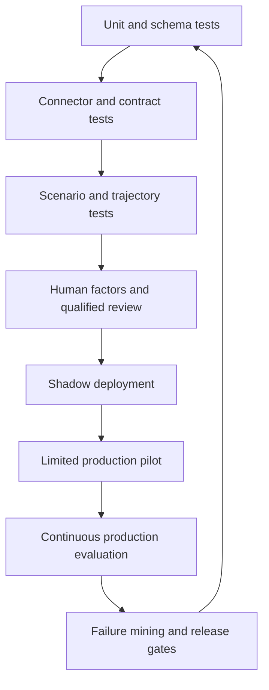

# Evaluation, Observability, Deployment, Scale, and Incidents

## Production assurance is continuous

Clinical-trial operations cannot be released on aggregate answer quality. Evaluation must prove task outcomes, control invariants, human usability, resilience, privacy, traceability, latency, and cost for the intended studies and workflows. Severe participant-safety, unblinding, authorization, identity, integrity, or filing failures are noncompensating: good performance elsewhere cannot average them away.

## Evaluation stack



## Evaluation dimensions

| Dimension | Example measure | Noncompensating failures |
|---|---|---|
| Identity and authority | Correct study/site/participant/version/role binding | Cross-scope action, stale delegation accepted |
| Evidence fidelity | Claim-to-source precision, chronology accuracy, conflict preservation | Fabricated/altered source, missing critical contradiction |
| Consent/eligibility | Current-form detection, criteria evidence completeness, abstention | Agent makes decision or treats missing as satisfied |
| Safety | Intake completeness, clock accuracy, escalation latency, case field accuracy | Missed/late clock, false nonreportable conclusion, urgent event suppressed |
| Blinding/privacy | Exposure rate, minimum-necessary adherence, redaction | Any unblinded or unauthorized participant disclosure |
| Effects | Idempotency, unknown-outcome handling, reconciliation | Duplicate consequential effect, retry during `UNKNOWN` |
| Records | Audit completeness, export reconstruction, provenance | Audit deletion, generated record presented as source |
| Human factors | Review time, acceptance with edits, error detection, alert burden | Automation bias causes retained-authority bypass |
| Resilience | Recovery point/time, degraded-mode success, backlog drain | Safety path depends on failed model component |
| Performance/cost | Deadline latency, queue delay, cost per completed reviewed task | Critical priority starved by bulk work |

## Evaluation corpus

Cover normal and adversarial cases across:

- protocol versions, amendments, site waves, participant transition states, and jurisdictions;
- adult/minor/LAR, language, consent optionality, withdrawal, and re-consent situations;
- simple, ambiguous, missing, conflicting, out-of-window, and corrected eligibility evidence;
- serious/non-serious candidates, late follow-up, duplicate cases, pregnancy/product-exposure variants, and multiple clock triggers;
- blinded/unblinded roles and information that indirectly reveals allocation;
- EDC/IRT/lab/eCOA/safety mismatches, partial files, duplicate/out-of-order events, stale reads, and schema changes;
- small/high-volume sites, time zones, holidays, intermittent networks, and accessibility needs;
- prompt injection, poisoned attachments, unauthorized exports, role revocation, and insider misuse; and
- provider outage, worker crash, destination timeout, restore, failover, and manual fallback.

Use synthetic and approved deidentified cases by default. Any use of real records requires purpose, minimization, access, retention, transfer, and model-provider governance. Hold out incident-derived cases so fixes do not merely memorize the test.

## Outcome, trajectory, and invariant grading

Exact text or tool sequence is often the wrong oracle. Grade:

1. **Outcome:** Was a correct, useful, reviewable artifact or workflow state produced?
2. **Evidence:** Does every important claim link to the right current source and preserve conflicts?
3. **Trajectory:** Were tool calls within scope, budgets, and allowed order?
4. **Invariants:** Did the run preserve identity, authority, blinding, clocks, effects, and audit requirements?
5. **Human use:** Could the qualified reviewer identify uncertainty and make the retained decision efficiently?

Critical items need deterministic assertions; qualified reviewers assess clinical/operational usefulness. Model graders may help triage only after calibration and cannot be the sole judge of severe safety or compliance failures.

### Reviewer calibration and automation-bias controls

Build a role-specific rubric before reviewing model output. Periodically give two or more qualified reviewers the same
blinded sample, measure item-level agreement and severe-error recall, and adjudicate disagreements with a designated
clinical, safety, data-management, or quality owner. Report disagreement by study phase, site, language, workflow,
reviewer role, and behavior release—not only as one average.

Include negative controls, deceptively fluent but wrong drafts, missing-source cases, and agent-free baseline artifacts.
Randomize which candidate is model-assisted when feasible. Track reviewer override, edit distance, time, missed-error
rate, and selective acceptance. Retrain/calibrate reviewers when rubric interpretation drifts. A model grader may rank
low-risk samples, but it cannot adjudicate its own release or be the only reviewer for consent, eligibility, safety,
unblinding, authority, or regulated-record failures.

## Failure injection

| Injection | Expected behavior |
|---|---|
| EDC accepts write but response times out | Effect becomes `UNKNOWN`; reconcile before retry |
| IRT duplicates/reorders events | Deduplicate/fetch current state; no allocation leak |
| Lab batch has incorrect control total | Quarantine batch and escalate; no partial completion |
| Protocol release changes before commit | Revalidate and pause if effectivity/requirements differ |
| User role revoked after approval | Commit denied and task reassigned |
| Safety gateway acknowledgement is delayed | Clock/escalation continues; reconciliation checks destination |
| Model provider unavailable | Deterministic/manual fallback; priority queues preserved |
| Retrieved document contains tool instructions | Treat as data; tool/policy scope unchanged |
| Unblinded field added by connector version | Schema allowlist blocks response and triggers severity-one review |
| Audit archive restore fails | Inspection-readiness incident; no false availability claim |
| Compactor omits an active clock or blinding partition | Receipt/invariant validation fails; rebuild from authoritative state |
| eConsent provider reports completion for a superseded form | Do not mark consent current; resolve form hash, process evidence, and investigator decision |
| EDC wildcard read spans sites outside the admitted scope | Projection and response-scope validator reject the payload and alert |
| Object-lock governance bypass permission is mis-scoped | Least-privilege test and independent archive verification fail the release |
| Registry upload requests automatic release | Adapter policy forces draft-only handoff; responsible party approves and releases |
| Notification is delivered to the wrong alias or purpose | Delivery is not workflow success; contain, assess disclosure, and preserve evidence |
| Restore creates a reconciliation flood | Reserve safety/clock capacity, throttle redrive, and drain by risk tier |
| Reviewer accepts fluent drafts more readily than controls | Blinded calibration detects selective acceptance; pause or tighten review controls |

## Observability and evidence planes

These artifacts serve different purposes and are not substitutes:

| Plane | Purpose | Sampling | Typical contents | Must not be claimed as |
|---|---|---|---|---|
| Source or regulated record | Evidence of the trial activity or required decision | Never sampled; governed by record class | Signed consent evidence, EDC value, qualified decision, approved filing | An operational log merely because an action was logged |
| Control audit | Reconstruct who/what/when/why for runtime and access controls | Never sampled for in-scope actions | Authorization, state transition, effect, approval, configuration and access events | Proof the clinical content was correct |
| Operational log | Diagnose component behavior | Minimized; retention and access bounded | Error code, connector route, redacted object reference | A complete audit trail or retained trial record |
| Metric | Detect rates, saturation and objective breaches | Aggregated; labels privacy-reviewed | Queue age, failure rate, reconciliation age, clock risk | Case-level evidence or a diagnosis |
| Trace | Reconstruct distributed execution and latency | Usually sampled except specifically required control spans | Correlation IDs, redacted spans, dependency timing | The authoritative workflow state or regulated record |

Record the stable correlation references needed to move from a metric or trace to authorized control evidence without
copying participant data into telemetry. If diagnostic data must support a regulated claim, deliberately qualify and
govern that record path; observability tooling does not become a validated record system by assertion.

### Authoritative control records — unsampled

- task admission and identity/authorization result;
- protocol/policy/behavior release resolution;
- state transitions, clocks, approvals, and human decisions;
- tool/effect request, semantic effect ID, result, postcondition, acknowledgement, and reconciliation;
- source/artifact references and hashes;
- access, privilege, blinding, configuration, and incident changes; and
- export/retention/archive evidence.

### Diagnostic telemetry — minimized and sampled

- latency, queue time, token/tool counts, error codes, retries, provider/model route;
- redacted span attributes and content-free classifications;
- resource saturation, cache behavior, connector health, and cost; and
- evaluation outcome IDs and release version.

Never put direct identifiers, free-text clinical narratives, treatment allocation, secrets, or complete documents in ordinary traces. Use secured break-glass content capture only if justified, time-bounded, audited, and approved.

## Suggested SLO framework

Exact values depend on study risk and applicable obligations; define them with clinical, safety, quality, and operations owners.

| SLI | Example objective shape |
|---|---|
| Safety intake durability | 100% accepted events durably recorded or visibly rejected |
| Clock correctness | 100% tested applicable clocks match reviewed policy fixtures |
| Critical escalation | Near-total within configured minutes; independently monitored |
| Protocol release resolution | 100% participant effects use an effective explicit release |
| Effect ambiguity | `UNKNOWN` count/age below strict threshold; no blind retry |
| Reconciliation freshness | Critical systems reconciled inside defined risk window |
| Audit/evidence export | Complete package generated and verified inside defined period |
| Interactive draft latency | Percentile target by workflow, excluding retained human review |
| Recovery | RPO/RTO by service tier; safety tier most stringent |
| Cost | Cost per completed, accepted, human-reviewed task and per study/site |

SLO burn alerts should be participant/study aware and avoid leaking sensitive dimensions into broad paging systems.
An SLO is an engineering objective, not a sponsor obligation, safety-reporting clock, protocol visit window, customer
service promise, or guarantee of clinical correctness. Keep each legal/protocol/policy clock in the durable workflow
service even when a related SLO is healthy, and treat missed required clocks according to the qualified process rather
than merely as an availability breach.

## Deployment topology

Start with one region/cell and a small set of studies. Separate at least:

- task admission/API;
- durable workflow and clock services;
- model workers with no standing destination credentials;
- connector/effect workers with typed scoped credentials;
- reconciliation workers;
- identity/policy/protocol release services;
- blinded and unblinded partitions; and
- authoritative evidence archive from diagnostics.

Use signed immutable behavior manifests, infrastructure/configuration as code, secrets manager, short-lived credentials, encrypted queues/stores, dependency pinning, vulnerability management, backup/restore, and tested disable controls.

For larger portfolios, use tenant/study cells whose storage, queues, credentials, encryption context, rate limits, and
blinding partitions have explicit failure boundaries. A region or cell failover must re-establish effective authority,
protocol/policy releases, local clocks and time-zone rules, adapter capabilities, effect ledgers, and evidence access;
DNS or compute recovery alone is not service recovery. Keep a tested manual path for jurisdictions or providers that
cannot legally or technically fail over.

## Capacity and backpressure

Estimate each queue separately:

```text
offered_concurrency = arrival_rate × mean_service_time
required_workers ≈ offered_concurrency / target_utilization
```

Then load-test tail latency, rate limits, burstiness, human-review capacity, retries, and reconciliation. A model worker estimate alone is misleading when safety reviewers or destination gateways are the bottleneck.

Priority order is typically:

1. urgent participant-safety intake and statutory clock work;
2. identity/consent/eligibility blockers for imminent visits or dosing;
3. time-bound regulatory/monitoring/deviation follow-up;
4. routine data reconciliation and queries; and
5. bulk summaries, archival classification, and analytics.

Admission control reserves capacity for critical tiers. Fairness quotas prevent one sponsor, study, site, or bulk amendment rollout from starving others. Retries have budgets and jitter and do not jump priority merely because they failed.

### Recovery load and disaster recovery

Normal throughput planning is insufficient after an outage. Estimate recovery load separately:

```text
recovery_work = unprocessed_events + pending_callbacks + UNKNOWN_effects
              + source_reconciliation_partitions + expired_approvals
              + due_or_at_risk_clocks + artifacts_to_verify
drain_time ≈ recovery_work / safe_net_capacity_after_reserved_critical_capacity
```

Restore in a risk-reviewed order: safety intake and independent clocks; identity, authority, and blinding services;
effect ledger and reconciliation; authoritative source/artifact access; existing task state; then new lower-priority
admission. Do not replay a D3 effect whose prior outcome is unknown. Throttle redrive so provider recovery, reviewers,
and sites are not flooded. Recovery is complete only when stores and source systems converge, clocks and escalations
are accounted for, unknown effects are resolved or owned, required records are verified, and the backlog can drain
without violating reserved capacity. Exercises must measure RPO/RTO **and** reconciliation completion and recovery-load
drain time.

## Cost controls

- Use rules, SQL/reporting, templates, and small classifiers before a generative model where adequate.
- Project only necessary source excerpts; cache approved immutable protocol/policy artifacts by hash.
- Route by risk and task complexity with a validated behavior manifest.
- Batch read-only low-risk work, never safety effects or participant decisions.
- Measure accepted artifact and reviewer-time savings, not tokens alone.
- Include human review, vendor API, validation, observability, storage, egress, incident, and reconciliation cost.
- Reject features whose marginal convenience creates disproportionate privacy or validation burden.

## Behavior release

```yaml
behavior_release:
  behavior_release_id: behavior_2026_08_31_3
  model_provider: approved_provider
  model_id: pinned_model_snapshot
  inference_settings_sha256: "..."
  system_instruction_sha256: "..."
  role_prompt_bundle_sha256: "..."
  context_projection_version: 5
  compactor_version: trial-compactor/2
  output_schema_versions: {}
  tool_contract_versions: {}
  adapter_capability_manifests: {}
  provider_api_and_configuration_versions: {}
  policy_engine_version: "4.7"
  protocol_compiler_version: "3.2"
  parsers_and_transforms: {}
  terminology_releases:
    meddra: deployment_pinned
    cdisc_ct: deployment_pinned
  eval_suite_id: clinical_ops_eval_12
  risk_assessment_ref: ra_81
  approvals: [quality_ref, clinical_ref, security_ref, product_ref]
  rollback_to: behavior_2026_08_10_2
```

Prompts, models and inference settings, context/compaction, tools and capability manifests, provider configuration,
schemas, parsers/transforms, policy and clock rules, terminology, protocol compilers, fallback routes, and evaluators form
one behavior bundle. Produce a semantic diff that states which task classes, fields, decisions, effects, populations,
and records could change—not only a file hash diff.

Change the whole bundle through risk-based review and offline gates. Shadow runs must have no mutating credentials and
must not duplicate participant communications or regulated submissions. Canaries exclude safety-critical, unblinding,
enrollment/dosing, urgent-clock, and irreversible paths until separately approved evidence permits them. Pin an
in-flight bounded step to one bundle, but recheck current authorization, revocation, amendment, safety, consent, and
effect policy at commit. Rollback selects a previously approved bundle for future execution; it never deletes records,
rewinds human decisions, reverses physical actions, or assumes an external effect was undone. Hold or migrate in-flight
work explicitly when bundle semantics are incompatible.

### Controlled failure mining

Promote a production failure into an evaluation case only through a governed record:

```yaml
failure_candidate:
  candidate_id: fail_01J...
  incident_ref: inc_402
  minimized_fixture_ref: approved_deidentified_fixture
  authoritative_outcome_ref: adjudication_88
  affected_behavior_release: behavior_2026_08_31_3
  affected_protocol_policy_adapter_versions: {}
  privacy_and_blinding_review: approved_ref
  root_cause_class: stale_adapter_scope
  expected_invariant: no_cross_site_read
  reviewer_roles: [data_management, quality]
  fixture_expiry_or_refresh_at: 2027-02-28
```

The incident record is not copied wholesale into a prompt set. Minimize or synthesize it, preserve the authoritative
outcome and lineage, test the root cause plus neighboring cases, and prevent train/test contamination. Revalidate the
fixture when protocol, policy, terminology, provider, or behavior semantics change; remove or quarantine cases whose
adjudication was corrected. Failure mining proposes evidence for a reviewed release—it never performs silent online
learning.

## Incident response

```mermaid
flowchart LR
    DETECT --> CONTAIN[Stop admission / disable effects / revoke credentials]
    CONTAIN --> SAFE[Preserve independent safety and manual workflows]
    SAFE --> EVIDENCE[Preserve control records and affected data]
    EVIDENCE --> RECON[Reconcile effects and scope]
    RECON --> CORRECT[Correct data/process; notify qualified owners]
    CORRECT --> VERIFY[Validate fix and recovery]
    VERIFY --> RESTORE[Bounded restoration and redrive]
    RESTORE --> CAPA[Post-incident review / CAPA / eval cases]
```



Incident controls must not depend on the affected model. Operators need independent kill switches for task admission, model routes, individual tools/connectors, bulk actions, unblinded partitions, and credentials. Do not roll back by deleting regulated evidence or replay blindly across unknown effects.

## Production checklist

- [ ] Severe safety, authorization, identity, privacy, blinding, and integrity tests are noncompensating.
- [ ] Evaluation covers outcome, evidence, trajectory, invariants, and human factors.
- [ ] Qualified reviewers are calibrated on blinded controls; disagreement and automation bias have gates.
- [ ] Failure injection proves unknown-effect, clock, recovery, and degraded-mode behavior.
- [ ] Regulated/source records, control audit, logs, metrics, and traces have distinct owners and retention semantics.
- [ ] SLOs reflect safety/quality risk and human/destination capacity.
- [ ] Critical queues have reserved capacity, fairness, and backpressure.
- [ ] DR proves reconciliation completion and recovery-load drain, not only restored compute.
- [ ] The entire behavior bundle is pinned, semantically diffed, canaried within restrictions, and rollback-tested.
- [ ] Incident cases enter evaluation only through reviewed, minimized, expiring failure fixtures.
- [ ] Independent incident stops, manual paths, reconciliation, and evidence preservation are tested.

## Related guides

- [Clinical-Trial Operations Agent](README.md)
- [Security, privacy, validation, and inspection readiness](08-security-privacy-validation-and-inspection-readiness.md)
- [Zero-to-production stages, schemas, and checklists](10-zero-to-production-stages-schemas-and-checklists.md)
- [Evaluation-driven development](../../evaluation/evaluation-driven-development.md)
- [Observability and tracing](../../evaluation/observability-and-tracing.md)
- [Deployment, release, and incident response](../../operations/deployment-release-and-incident-response.md)
- [Scaling, capacity, and SLOs](../../operations/scaling-capacity-and-slos.md)
