# Qualified Adapters and Worked Clinical-Operations Flows

> **Status:** research-backed Pass 2 guide  
> **Research current through:** 2026-08-31  
> **Scope:** engineering patterns for bounded trial operations; not legal, medical, ethics, regulatory, biostatistical, or validation advice

This guide turns the architecture into an adapter-admission and workflow-evidence program. “EDC connector,” “eConsent integration,” or “regulatory automation” is not a safe capability boundary. Qualification attaches to an exact operation, target study/environment, effective principal, object/field scope, protocol/policy release, blinding partition, provider/version set, effect semantics, validation evidence, and recovery owner.

The safest useful deployment may remain read-only or draft-only permanently. A production label does not justify enrollment, randomization, dosing, unblinding, medical review, electronic signature, data lock, or submission release authority.

## Capability declaration

Every real operation enters the tool gateway through a server-owned, dated declaration:

```yaml
clinical_adapter_capability:
  capability_id: "edc.study-0042.query-draft.create.v1"
  operation: "edc.query_draft.create"
  danger_tier: "D2_STAGED"
  source_or_effect_role: "staged_effect_target"
  provider_product: "qualified-edc-instance"
  provider_environment: "production-eu"
  api_and_schema_profile: "vendor-api/qualified-profile-7"
  adapter_build_digest: "sha256:..."
  intended_use: "draft field-specific data clarification query"
  scope:
    sponsor_id: "sponsor_18"
    study_id: "study_0042"
    site_ids: ["site_101"]
    protocol_release_ids: ["pr_2026_0042_v3_eu_wave1"]
    blinding_partition: "BLINDED_DATA_MANAGEMENT"
  effective_principal: "workload://trial-ops/edc-query-drafter"
  delegated_user_claims_required: ["role:data_manager", "purpose:data_review"]
  allowed_objects_and_fields: ["form_oid", "item_oid", "item_version", "query_text"]
  request_schema_digest: "sha256:..."
  response_schema_digest: "sha256:..."
  effect_identity: "semantic_effect_id persisted in local ledger and provider metadata where supported"
  retry_policy: "reconcile before bounded retry"
  reconciliation_query: "query draft by destination id or exact field plus semantic intent"
  cancellation_semantics: "withdraw local proposal or close provider draft through authorized workflow"
  validation_evidence: "validation://edc/query-draft/profile-7"
  certified_at: "2026-08-31T00:00:00Z"
  expires_at: "2026-11-29T00:00:00Z"
  owner: "clinical-data-platform"
  disable_control: "capability://edc/query-draft/disable"
```

The model cannot choose sponsor, study, site, participant, protocol release, blinding partition, credential, endpoint, API version, signature role, destination status, callback, idempotency key, retry mode, clock rule, or release action.

## Evidence required for every adapter

| Dimension | Required proof |
|---|---|
| Intended use | Exact workflow and decisions that depend on the operation; validated boundaries and prohibited uses |
| Ownership | Sponsor/system/validation/data/privacy/security/medical or safety owners as applicable; incident and re-enable authority |
| Identity and role | Workload and user delegation chain, sponsor/study/site/participant scope, purpose, current role, expiry/revocation and negative access tests |
| Source role | Authoritative record, certified copy, mutable source, operational projection, derived artifact, staged effect or final effect |
| Version surface | Product/release, tenant configuration, API/file/message schema, SDK, adapter, terminology, rules, regional endpoint and sunset monitor |
| Blinding | Declared partition, response allowlist, direct and inferential leakage tests, telemetry/eval segregation, emergency path independence |
| State and clocks | Native IDs, revisions, audit history, event/source/ingest time, time zone, terminal/transient/unknown states and effective-dated policy |
| Effects | Semantic intent, preconditions, exact approval, destination idempotency, partial/asynchronous states, acknowledgement and correction behavior |
| Events and files | Authentication, event/file/batch identity, duplicates, reorder/loss, control totals, watermarks, schema evolution, quarantine and bounded redrive |
| Records | Original value, audit metadata, reason for change, signature meaning, legal hold/retention, complete export, migration and decommissioning |
| Operations | Timeout/rate/size limits, maintenance, backpressure, degraded/manual mode, SLO, dashboard, support, DR and recovery-load evidence |

Authentication or supplier documentation alone does not qualify the configured system. Supplier assessment, sponsor validation, configuration/UAT, interface testing, access review, operating procedure, change control, backup/restore and periodic review remain deployment-specific.

## Exact operational identity snapshot

Every task, effect and regulated artifact binds to exact identities. Display labels and “latest” selectors are forbidden at commit.

| Object | Required identity and version semantics |
|---|---|
| Sponsor and responsibility | Legal sponsor ID, delegated CRO/provider contract or transfer reference, accountable role, performing party and effective interval |
| Study | Sponsor-native study ID plus mapped registry/submission/vendor aliases with mapping owner and lifecycle |
| Protocol release | Protocol family/version, immutable artifact digest, amendment, jurisdiction/site/population effectivity, approval evidence and configured-system builds |
| Site and role | Sponsor-scoped site-study ID, facility/investigator mapping, activation state, delegation/qualification assignment and effective interval |
| Participant alias | Site-bound pseudonymous participant-study ID; direct person link remains in the site identity vault; merge/split/withdrawal/tombstone history preserved |
| Visit | Visit instance ID, protocol event/occurrence, window-rule version, anchor, actual time/time zone, state and protocol release applicable then |
| Specimen | Specimen/accession/aliquot/container IDs, participant alias, collection event/time/time zone, lab/transfer batch and correction chain |
| Safety case | Safety-system case ID plus study/participant/source-case mappings, case version, duplicate/merge lineage, terminology release and blinded/unblinded partition |
| Deviation or issue | Occurrence/candidate ID separate from qualified classification, impacted protocol release/participant/site, chronology version and CAPA linkage |
| EDC query | Query/thread ID bound to exact study/site/participant/event/form/item/item version, status transition and source-value revision |
| Artifact or regulated record | Artifact ID, record class/location owner, content digest, source revision, signature/approval state, retention/hold and supersession/correction lineage |
| Effect or submission | Semantic effect ID plus provider-native request/message/job/deposit/submission ID, payload digest/version, acknowledgement and reconciliation revision |

```yaml
clinical_identity_snapshot:
  snapshot_id: "snapshot_01J..."
  sponsor_responsibility_release: "sponsor-map-12"
  study_id: "study_0042"
  protocol_release_id: "pr_2026_0042_v3_eu_wave1"
  jurisdiction_policy_release: "eu-ctr-policy-2026-08"
  site_study_id: "site-study-101"
  participant_study_id: "pt_2041"
  visit_id: "visit_01J..."
  specimen_ids: ["specimen-77", "aliquot-77a"]
  safety_case_ids: ["sc_01J..."]
  active_query_ids: ["query-901"]
  role_assignment_refs: ["role-71@version-5"]
  blinding_partition: "BLINDED_SITE"
  source_watermarks: {edc: 881, ctms: 604, safety: 219}
  artifact_manifest_digest: "sha256:..."
  snapshot_created_at: "2026-08-31T10:00:00Z"
  expires_at: "2026-08-31T10:15:00Z"
  snapshot_digest: "sha256:..."
```

A source correction, amendment, changed consent/eligibility/safety state, role revocation, new clock, participant transition, unblinding event, vendor configuration change, or expired snapshot invalidates readiness. “Latest timestamp wins” is not a conflict-resolution policy across authorities.

## Provider-class qualification notes

The named products below illustrate concrete semantics; they are not recommendations or compliance claims.

### EDC and clinical-data APIs

EDC reads and writes are field- and workflow-specific. Qualify study/site/participant/event/form/item OIDs, form versions, role/field permissions, archived data defaults, audit and discrepancy-note options, imports, partial failures, extracts, freeze/lock states and correction workflows.

OpenClinica 4 provides a useful current example. Its official 2026 participant API documentation exposes different study- and site-level role permissions. Its clinical-data API supports JSON and a combination of CDISC ODM 1.3.2 plus OpenClinica extensions, even though ODM 2.0 exists as a broader current CDISC standard. Retrieval options can include metadata, audits, discrepancy notes and archived forms, and wildcards can broaden populations. Re-importing the same clinical-data package creates separately logged imports; this is not proof of idempotent business effects. Qualify the installed product, study configuration and exact endpoints—never extrapolate from nominal “ODM support.”

Veeva Vault/CDMS illustrates another version surface: Vault publishes three API versions per year and labels the newest as beta while older versions remain stable; exact functionality depends on the configured Vault/application and selected GA version. Pin vault DNS, application/release, API version, object/document type, lifecycle, field security and job/pagination behavior. A Vault document version or lifecycle transition is not automatically an approved protocol, TMF quality decision or human signature.

### CTMS, eTMF, document, and workflow systems

CTMS owns configured operational tasks/milestones, not proof that consent, source review, monitoring, safety review or filing occurred. eTMF/ISF operations bind artifact class, sponsor/investigator zone, study/site/country, owner, document date, version, quality state, signature state, record-location map and retention.

A workflow engine such as Camunda 8.8 can persist processes and user tasks; its current Orchestration Cluster REST API uses `/v2/` and product-version compatibility rules. Engine completion is not sponsor oversight, a GCP record, medical review or destination acknowledgement. Pin process definition, variables/schema, engine/client version, incident/retry behavior, user-task authorization, history/export and migration semantics.

For object storage, qualify immutable version identity, checksums, finalization, encryption, access, legal hold, retention, restore and deletion markers. Amazon S3 Object Lock is a provider-specific WORM mechanism that requires versioning and applies retention/holds to object versions; governance mode includes a bypass permission. Its existence does not by itself validate record classification, metadata completeness, electronic signature, retention schedule or inspection retrieval.

### eConsent, identity, and electronic signature

Keep consent discussion/process, approved form/version/language, participant/LAR identity and capacity evidence, optional permissions, signature ceremony, authentication evidence, verification, re-consent and withdrawal as separate records. An e-signature provider event can establish what that provider recorded; it cannot prove adequate information exchange, comprehension, voluntariness, correct capacity/LAR authority, investigator responsibility or the legal/regulated meaning of the signature.

Qualify workforce identity separately from study delegation: pin issuer/tenant, immutable subject, authentication and
step-up context, session age, workload identity, group/claim mapping, provisioning/deprovisioning and revocation-event
latency. An identity-provider group is not an investigator delegation, training record, site assignment, blinding role
or signature authority. Participant/LAR verification uses its own approved process and minimum evidence; never promote
government-ID images or site identity-vault data into routine sponsor/model context.

DocuSign's official OpenAPI repository exposes eSignature REST API v2.1 and Connect schemas. If used, qualify account/region, envelope/template/version, recipients, authentication method, tabs/fields, completion/correction/void states, Connect HMAC verification, duplicate/reordered/missed callbacks, certificate/export, retention and exact intended-use validation. Do not expose a generic `send_envelope` tool to the model or treat `completed` as verified informed consent.

### IRT/RTSM, pharmacy, and supply

Separate blinded and unblinded capabilities and principals. Qualify participant and visit mapping, randomization prerequisites, strata, kit/lot/depot/site inventory, assignment/dispense state, replacement/resupply, dose calculation responsibility, emergency unblinding, backup, audit and EDC reconciliation. Public provider documentation rarely captures the configured study semantics; supplier UAT and the validated study build are authoritative.

The agent may prepare a request or compare blinded reconciliation projections. It never chooses treatment, randomizes, dispenses, calculates an unvalidated dose, interprets allocation, or initiates emergency unblinding.

### Safety database and gateway

Treat case intake, minimum criteria, duplicate search, case creation, medical determinations, terminology coding, submission authorization, message generation, transmission, acknowledgement, follow-up and closure as separate operations. ICH E2B(R3) version/profile and regional gateway rules are pinned per route.

Oracle Argus Safety's current accessible E2B(R3) best-practice documentation includes release 8.4.3, illustrating that product release, configured profile and E2B version must be a compatibility set. It does not supply the sponsor's medical judgment, case-processing SOP, local reporting profile or evidence that a specific instance is validated. Never translate an HTTP success into regulator acceptance; reconcile the application case, outbound message, gateway acknowledgement/error and destination status.

### Laboratories, eCOA, and DHT

Lab adapters preserve specimen/accession, visit, collection time/time zone, test code/version, original value/unit, reference interval, flags, correction state, lab identity, transfer batch/schema and control totals. FHIR, CDISC LAB or a vendor format is accepted only through a tested local profile; round-trip and corrections matter more than the standard's name.

eCOA/DHT adapters also preserve device/application/user binding, assessment/instrument version, scheduled/actual time and zone, source timestamp, receipt timestamp, completion/missingness, correction, algorithm/firmware version and offline synchronization. A device upload is not a clinical interpretation, visit completion or proof the intended participant supplied the data. Qualify usability, accessibility, backup, support, cybersecurity and source ownership under the intended use.

### Notifications and participant communications

Separate approved content, recipient/destination binding, permission/channel preference, quiet/accessibility rules, send request, provider message ID, delivery status and participant reply. Twilio's current Message resource illustrates provider-specific states such as queued, sent, delivered, undelivered and failed; callbacks can gain new parameters. Carrier/device delivery does not prove the intended participant read or understood the message.

Urgent symptom/safety replies must have an independently monitored human path. Notification retry never repeats the underlying consent, randomization, safety submission or data effect. Do not send individualized medical advice, treatment guidance, allocation clues or unapproved translations.

### Regulatory and registry submission handoffs

Treat package preparation, validator result, responsible-party review, approval, release, authority receipt, QC/deficiency, correction and public status as separate records. Browser automation is not a generic fallback for CTIS, EudraVigilance, PRS or other filing portals.

ClinicalTrials.gov's PRS user guide, updated 2026-05-01, documents an External Upload API and an `autoRelease` parameter. The same guide distinguishes entry complete, approve and release and assigns completeness/accuracy responsibility to the submitting organization/responsible party. This blueprint therefore defaults `autoRelease` to false and keeps release as a separately authorized human effect. Public ClinicalTrials.gov API v2/FHIR data remain read/reconciliation projections, not filing authority.

## Qualification pipeline

```mermaid
flowchart LR
    I[Inventory operation and retained authority] --> V[Pin system, config, schema, role and partition]
    V --> N[Positive and negative access tests]
    N --> F[Fault, ambiguity, clock, correction and blinding tests]
    F --> R[Read-only replay]
    R --> S[Shadow on current workflow]
    S --> D[Draft-only sandbox or test-environment effect]
    D --> Q[Reconciliation, cancellation and export proof]
    Q --> C[Scoped production canary]
    C --> P[Expiring capability with drift monitor]
```



Noncompensating gates:

1. **Authority:** zero model-held clinical, medical, eligibility, dosing, unblinding, signature, lock or release authority.
2. **Isolation:** zero unauthorized sponsor/study/site/participant/object/field or blinded/unblinded disclosures in negative tests.
3. **Identity:** exact protocol release, role, participant alias, visit, specimen, case, query, artifact and effect joins; no fuzzy repair.
4. **Records:** native value, audit history, versions, corrections, signatures and complete export remain reconstructable.
5. **Effects:** one semantic intent, exact approval, provider receipt, acknowledgement/postcondition and tested `UNKNOWN` reconciliation.
6. **Safety and clocks:** urgent intake, deterministic clocks, escalation and manual paths work with model/workflow/provider failure.
7. **Operations:** limits, backpressure, human-review capacity, outage, recovery load, DR, kill switch and decommissioning are exercised.

## Worked flow one — eConsent and re-consent support

1. Bind sponsor, study, site, participant alias, protocol release, population, language, capacity/LAR state, consent-policy release and blinded partition.
2. Resolve the currently approved form and optional-permission artifacts deterministically. Stop on missing or conflicting approval, translation or applicability.
3. The agent may assemble a checklist and approved materials; a qualified human conducts the discussion and handles questions. Clinical explanation routes to the investigator.
4. The eConsent/e-signature adapter records the exact form, recipients, authentication, presentation/discussion evidence required by procedure, decisions, optional permissions and signatures.
5. Reconcile provider completion with the study consent-process record. `documented` is not automatically `verified`.
6. An amendment or new information creates a qualified re-consent applicability decision and participant-specific task; it never overwrites the prior process.
7. Withdrawal records scope, time and future preferences; retention/deletion actions follow approved policy rather than destroying history automatically.

**Pass gate:** wrong form/language/site, expired role, LAR conflict, duplicate callback, offline completion and amendment race all stop or reconcile without inferring valid consent. The investigator can inspect the complete process evidence.

## Worked flow two — eligibility evidence to enrollment handoff

1. Freeze the applicable protocol release, eligibility ruleset, decision time/window, site/investigator assignment and source population.
2. Deterministic services evaluate exact structured rules and missingness. The model maps narrative source spans only to candidate states: found, missing, conflicting, out-of-window or not machine-interpretable.
3. Preserve every criterion, source version, temporal validity, conflict and required clinical judgment. Do not collapse “not found” into “not present.”
4. A protocol-defined qualified investigator/clinician reviews the complete evidence and records the decision in the validated workflow.
5. Recheck consent, current evidence, role, protocol release and IRT/EDC readiness immediately before any enrollment/randomization request.
6. The agent cannot call a final eligibility or randomization effect. An authorized validated path performs the action and returns a blinded receipt for reconciliation.

**Pass gate:** amendment, corrected lab, stale evidence, “clinically significant” wording, missing criterion and changed delegation cause review/hold. No model confidence or partial checklist becomes eligibility.

## Worked flow three — monitoring, query, and data-integrity follow-up

1. Freeze a bounded population and source watermarks across EDC, CTMS, lab, eCOA and relevant source/audit exports.
2. Run deterministic edit, completeness, timing, correction, audit and reconciliation rules with denominators and versioned mappings.
3. The model may summarize a pattern or draft non-leading field-specific query text with exact source/version references.
4. A data manager or monitor reviews context, site variability, false-positive risk and blinding before releasing the query/task.
5. Reconcile destination query/thread state. Source owners correct data through the validated system; the agent never overwrites source or audit history.
6. Keep operational issue, deviation candidate, qualified important deviation/serious-breach decision, CAPA and effectiveness check as separate records and authorities.

**Pass gate:** duplicated imports, archived-form defaults, delayed corrections, partial lab files, denominator drift and one high-volume site cannot create a false clean population or automatic compliance accusation.

## Worked flow four — safety-report preparation and acknowledgement

1. Intake independently of the model; persist all receipt/awareness/minimum-information timestamps and instantiate reviewed jurisdiction clocks.
2. Bind study, site, participant alias, product exposure, safety case/source cases, terminology and blinding partitions. Preserve contradictory dates and duplicate candidates.
3. The agent assembles chronology, candidate structured fields, source citations and missing-information questions. It makes no seriousness, expectedness, causality, listedness or reportability decision.
4. Qualified investigator/sponsor medical/PV reviewers make required determinations and authorize applicable messages/channels.
5. Persist one semantic transmission intent and exact E2B/message payload digest. A timeout becomes `UNKNOWN`; never create a new case/message blindly.
6. Reconcile gateway acknowledgement/error and destination status, correct through the authorized follow-up process, and keep independent clocks/escalation active.

**Pass gate:** lost acknowledgement, duplicate case, terminology update, source correction, gateway outage, delayed medical review and blinded/unblinded field mismatch remain visible and never suppress the urgent human path.

## Worked flow five — regulatory submission package handoff

1. Bind responsible party, study/protocol release, jurisdiction, submission type/version, approved source artifacts and destination profile.
2. Assemble a private draft package with source-to-field lineage. Deterministic validators check schema, required fields, identifiers, terminology, cross-field consistency, signatures/approvals and current portal rules.
3. The model may draft summaries or deficiency explanations with citations; it does not decide completeness/accuracy, approve, sign or release.
4. Upload into a test or nonreleased workspace using one semantic effect. Reconcile ambiguous upload and compare the destination's rendered/current record to the approved package.
5. Produce a human-readable diff for the responsible party or authorized submitter.
6. Execute release only through the validated human authority path. Capture destination receipt, QC/deficiency state, public/version status, correction path and deadlines.

**Pass gate:** draft credentials cannot release, `autoRelease` is disabled, partial/ambiguous upload blocks another intent, and public read APIs are used only to verify the eventual destination state.

## Cancellation, ambiguity, and recovery runbook

| Effect | Before destination acceptance | After acceptance or ambiguity | Recovery evidence |
|---|---|---|---|
| Query/monitoring draft | Cancel local intent or provider draft if no downstream review | Refetch exact field/thread; preserve comments and audit | Provider record/revision plus semantic intent match |
| eConsent envelope | Void only through approved process before/according to provider state | Do not infer withdrawal or invalid consent; route qualified review | Envelope/status/certificate plus consent-process record |
| IRT request | Withdraw only if validated IRT proves no action | Freeze dependent work; authorized unblinded team reconciles | IRT native transaction and blinded projection |
| Safety transmission | Cancel unsubmitted intent if policy permits | Treat as potentially submitted; query acknowledgement/destination | Exact case/message/payload digest and gateway acknowledgement |
| TMF/document filing | Remove staging item if not filed | Correct/supersede through governed lifecycle; never delete audit | Document version/lifecycle/audit/export evidence |
| Registry/submission upload | Discard known draft if permitted | Hold and compare destination record; public release may require correction/withdrawal process | Destination record/version/receipt and responsible-party decision |
| Participant notification | Cancel queued message if supported | Observe delivery/failure; do not repeat underlying clinical effect | Provider message ID/status plus approved follow-up |

For every `UNKNOWN`: freeze the semantic intent, stop dependent work, preserve clocks and urgent paths, query by provider-native and local IDs, compare receipts/acknowledgements/audit/population snapshots, obtain required qualified disposition, and recalculate authorization/effectivity before resuming.

## Exercises and measurable gates

### Exercise A — certify an EDC read and draft

Test correct and wrong study/site/participant, hidden field, wildcard population, archived form, audit option, duplicate import, role revocation, timeout, schema addition and correction.

**Pass:** allowed reads retain native IDs/versions/watermarks; negative reads disclose nothing; draft write is nonfinal, attributable and reconcilable; no duplicate business effect occurs.

### Exercise B — preserve consent and eligibility authority

Simulate wrong form language, age/capacity transition, changed protocol release, missing criterion, corrected lab and expired investigator delegation.

**Pass:** tasks hold or route to the correct human; no consent verification, eligibility decision, enrollment or randomization is model-authored.

### Exercise C — reconcile safety under outage

Drop the gateway response after acceptance, delay acknowledgement, introduce a duplicate case and change terminology mid-case.

**Pass:** one message intent remains, clocks/escalation continue, no blind retry occurs, versions are pinned and qualified reviewers control correction/resubmission.

### Exercise D — prove blinding and communication isolation

Add an unblinded field to an IRT response, indirect allocation clue to a metric label, cross-study cache item and symptom reply to a delayed notification queue.

**Pass:** schema/partition tests block leaks, admission stops, urgent human escalation bypasses the model, and incident evidence is complete without copying sensitive content broadly.

### Exercise E — survive restore and release drift

Restore workflow/effect/clock/artifact stores while EDC, Vault, workflow, signature, messaging and submission interfaces have backlogs or changed versions.

**Pass:** safety and active clocks restore first; unknown effects reconcile before redrive; blinding/retention/holds survive; capability drift disables only affected operations; new work waits for bounded recovery convergence.

## Final adapter checklist

- [ ] Every operation has an intended-use dossier, target configuration, versioned capability, owner, expiry and disable control.
- [ ] Sponsor/study/protocol/site/participant/visit/specimen/case/deviation/query/artifact/effect identities and effective intervals are exact.
- [ ] Workload plus user delegation, purpose and blinding are rechecked at commit.
- [ ] Positive and negative object/field/action tests establish least privilege and partition isolation.
- [ ] Source/audit/correction/export semantics survive migration, restore, decommissioning and legal/retention policy.
- [ ] Events/files tolerate duplicates, reordering, gaps and partial loads with watermarks and bounded population reconciliation.
- [ ] Effects use one semantic identity, exact approval, typed receipts, acknowledgement/postconditions and tested `UNKNOWN` handling.
- [ ] Clocks, urgent safety, medical review, emergency unblinding and participant-protection paths remain independent.
- [ ] Draft, review, approval, e-signature, lock and external release are distinct capabilities.
- [ ] Backpressure, human-review capacity, outage, recovery load, DR, rollback and provider drift are exercised.

## Primary sources

- [ICH E6(R3) Principles and Annex 1](https://database.ich.org/sites/default/files/ICH_E6%28R3%29_Step4_FinalGuideline_2025_0106_ErrorCorrections_2025_1024.pdf)
- [FDA Electronic Systems, Records, and Signatures Q&A](https://www.fda.gov/media/166215/download)
- [EMA computerized systems and electronic data guideline](https://www.ema.europa.eu/en/documents/regulatory-procedural-guideline/guideline-computerised-systems-and-electronic-data-clinical-trials_en.pdf)
- [OpenClinica 4 participant read API](https://docs.openclinica.com/oc4/how-and-when-to-use-apis/oc4-openclinica-4-technical-documentation-participants-get-participants-study-level-or-site-level/)
- [OpenClinica 4 clinical-data API](https://docs.openclinica.com/oc4/how-and-when-to-use-apis/oc4-clinicaldata-import-crf-data/)
- [Veeva Vault endpoint structure and versioning](https://general.veevavault.dev/qualityone/vault-api/getting-started/endpoint-structure/)
- [Camunda 8.8 Orchestration Cluster REST API](https://docs.camunda.io/docs/8.8/apis-tools/orchestration-cluster-api-rest/orchestration-cluster-api-rest-overview/)
- [Amazon S3 Object Lock](https://docs.aws.amazon.com/AmazonS3/latest/userguide/object-lock.html)
- [DocuSign official OpenAPI specifications](https://github.com/docusign/OpenAPI-Specifications)
- [Oracle Argus Safety E2B(R3) best practices 8.4.3](https://docs.oracle.com/en/industries/life-sciences/argus-safety/8.4.3/oasbp/oracle-argus-safety-e2b-r3-best-practices.pdf)
- [ICH E2B(R3) package](https://admin.ich.org/node/348)
- [FDA Digital Health Technologies guidance](https://www.fda.gov/regulatory-information/search-fda-guidance-documents/digital-health-technologies-remote-data-acquisition-clinical-investigations)
- [Twilio Message resource](https://www.twilio.com/docs/messaging/api/message-resource)
- [ClinicalTrials.gov PRS user guide](https://clinicaltrials.gov/submit-studies/prs-help/user-guide)

Return to the [overview](README.md), the [integration architecture](02-reference-architecture-runtime-tools-and-integrations.md), the [stage roadmap](10-zero-to-production-stages-schemas-and-checklists.md), or the [research packet](../../research/packets/clinical-trial-operations-agent-blueprint.md).
