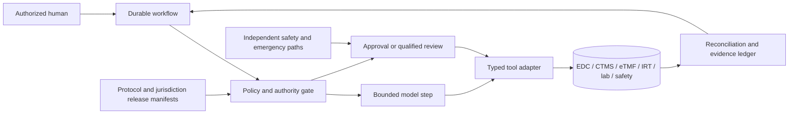

# Clinical-Trial Operations Agent

> A production blueprint for bounded AI assistance in regulated human-study operations. The agent may assemble evidence, detect inconsistencies, draft operational artifacts, and coordinate approved workflows. Qualified humans and validated systems retain every clinical, eligibility, dosing, safety, protocol, filing, and participant-protection decision.

**Status:** Research-backed production blueprint; Pass 2 complete  
**Research current through:** 2026-08-31

> Engineering guidance only—not medical, legal, regulatory, ethics, pharmacovigilance, validation, or compliance
> advice. Qualified local owners must determine applicability and approve every real deployment.

## What this category owns

This category owns the operational control plane of a regulated clinical trial:

- study, protocol, amendment, site, and pseudonymous participant identity;
- consent and eligibility workflow support without making the decision;
- visit windows, study tasks, monitoring, queries, deviations, and CAPA handoff;
- EDC, eTMF, CTMS, IRT, laboratory, eCOA/DHT, safety, and registry coordination;
- source and regulated-record provenance, auditability, reconciliation, and inspection readiness;
- safety-case preparation and deterministic deadline escalation;
- governed protocol-version rollout across sites and participants; and
- multi-site production operation, validation, release, incidents, and evidence preservation.

It does **not** own:

- scientific hypothesis formation or non-human experimental reasoning, which belongs to Scientific Research;
- ordinary healthcare referral, appointment, or care coordination, which belongs to Healthcare Care Coordination;
- generic document extraction, which belongs to Document Intelligence; or
- monitoring changes in laws and guidance, which belongs to Regulatory Intelligence.

The boundary is the regulated operation of a human study. Upstream categories can supply extracted facts or researched rules, but this agent must bind them to an approved study, jurisdiction, protocol version, site, participant alias, role, and effective time before use.

## Recommended system shape

The default is a **durable deterministic workflow with bounded model steps**, not a free-running clinical copilot and not a society of agents.

The application owns identity, authorization, clocks, task state, approvals, effect execution, reconciliation, audit evidence, privacy boundaries, blinding partitions, and incident controls. The model proposes structured content inside those boundaries.

## Authority invariant

An output is never authorized merely because it is plausible, high-confidence, or model-generated. Authority is evaluated at the effect boundary.

| Decision or effect | Agent contribution | Retained authority |
|---|---|---|
| Consent | Assemble current approved form, missing-evidence checklist, and visit task | Investigator/delegate and participant or legally authorized representative |
| Eligibility | Map source evidence to criteria and flag gaps | Investigator or protocol-defined qualified clinician |
| Enrollment/randomization | Prepare request and validate prerequisites | Authorized site role through validated IRT/EDC workflow |
| Dose or treatment | Surface approved protocol instructions and conflicts | Investigator/qualified clinical staff; IRT/pharmacy controls |
| Safety assessment | Prepare chronology, source links, and candidate fields | Investigator/sponsor pharmacovigilance and medical reviewers |
| Protocol amendment | Produce impact analysis and rollout checklist | Sponsor, ethics committee/IRB, regulator, and investigator as applicable |
| Regulatory submission | Validate package and acknowledgement status | Authorized responsible party or qualified submitter |
| Data correction/query close | Draft query and compare evidence | Source owner, investigator, data manager, or monitor according to procedure |
| Unblinding | Never initiate routine or emergency unblinding | Direct authorized human path with validated backup |

## Reading path

1. [Mission, boundaries, authority, and workload fit](01-mission-boundaries-authority-and-workload-fit.md)
2. [Reference architecture, runtime, tools, and integrations](02-reference-architecture-runtime-tools-and-integrations.md)
3. [Study, protocol, site, participant identity, and amendments](03-study-protocol-site-participant-identity-and-amendments.md)
4. [Consent, eligibility, visits, and role governance](04-consent-eligibility-visits-and-role-governance.md)
5. [Records, queries, monitoring, deviations, and CAPA](05-records-queries-monitoring-deviations-and-capa.md)
6. [Safety, IRT, laboratories, blinding, and reconciliation](06-safety-irt-laboratories-blinding-and-reconciliation.md)
7. [State, events, context, memory, planning, and recovery](07-state-events-context-memory-planning-and-recovery.md)
8. [Security, privacy, validation, and inspection readiness](08-security-privacy-validation-and-inspection-readiness.md)
9. [Evaluation, observability, deployment, scale, and incidents](09-evaluation-observability-deployment-scale-and-incidents.md)
10. [Zero-to-production stages, schemas, and checklists](10-zero-to-production-stages-schemas-and-checklists.md)
11. [Qualified adapters and worked clinical-operations flows](11-qualified-adapters-and-worked-clinical-operations-flows.md)

The evidence and source decisions are recorded in the [research packet](../../research/packets/clinical-trial-operations-agent-blueprint.md).

## Non-negotiable invariants

1. No participant is enrolled, randomized, dosed, or unblinded by model judgment.
2. No eligibility or safety conclusion is inferred from missing evidence.
3. Every fact used for a regulated action has source, timestamp, version, and transformation provenance.
4. A protocol version is effective only through an approved release manifest; “latest” is not an acceptable selector.
5. Safety deadlines come from a deterministic, versioned jurisdiction policy service and survive model or agent outages.
6. External writes use semantic effect identifiers, idempotency where supported, postcondition checks, and reconciliation.
7. Blinded and unblinded data are separated in storage, access, context, telemetry, and evaluation.
8. Participant identity is site-bound and pseudonymous outside the site identity vault.
9. Audit and regulated records are authoritative, immutable or append-only as required, exportable, and independent of sampled traces.
10. A human always has an independent stop, escalation, safety-reporting, and emergency-unblinding path.

## Architecture, not advice

This guide is an engineering reference. It is not legal, medical, regulatory, ethics, biostatistical, or validation advice. Applicable obligations vary by product, phase, protocol, jurisdiction, institution, system intended use, and contractual allocation. Sponsors and investigators must have qualified legal, clinical, pharmacovigilance, quality, data-management, privacy, security, and validation owners translate the blueprint into approved procedures and validated configurations.
