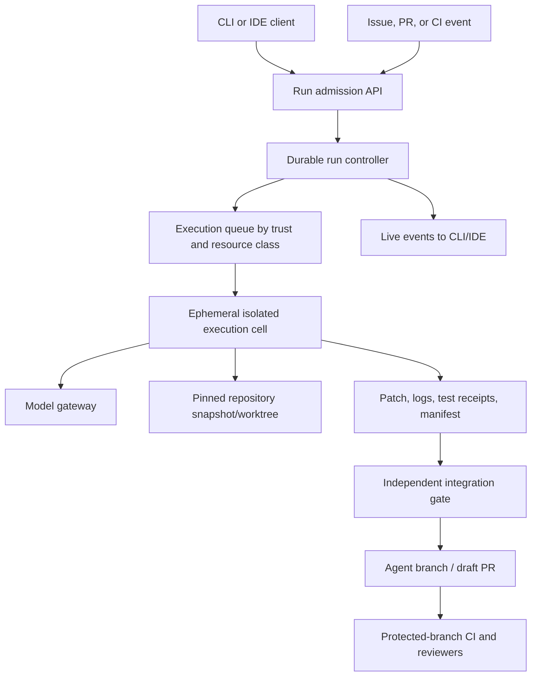
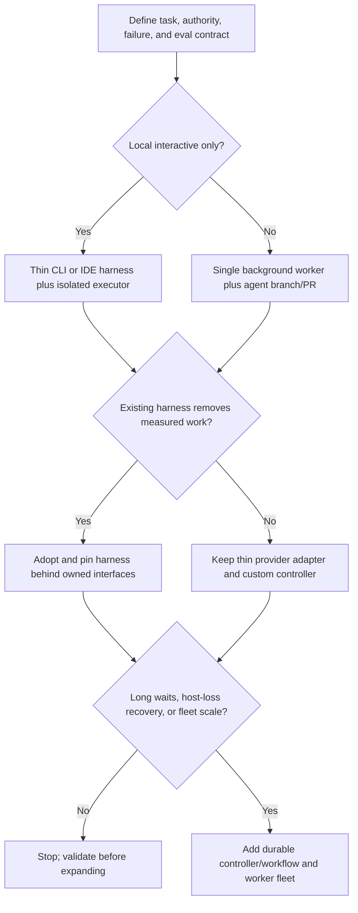

# Architecture and Runtime Selection

> **Status:** Research-backed decision guide  
> **Last researched:** 2026-08-31  
> **Scope:** Product surface, deployment shape, control-plane ownership, model/runtime/language selection, and custom-framework-hybrid choices  
> **Evidence:** [Coding-agent blueprint research packet](../../research/packets/coding-agent-blueprint.md)

Choose the smallest architecture that can enforce the required authority and failure boundaries. For an internal human-guided tool, begin with a thin CLI or IDE harness around an isolated executor. For queued repository tasks, use an ephemeral background worker that can only produce an agent-branch patch. Build a custom multi-tenant service only when scale, compliance, hosting, or integration requirements make its platform responsibilities unavoidable.

## Start from the operating contract

Before selecting a model or framework, write down:

| Requirement | Question that must have a concrete answer |
|---|---|
| User and trigger | Who can start a run: local developer, write-authorized issue author, webhook, schedule, or service? |
| Repository trust | Is the code trusted internal source, a fork/PR, a newly cloned public repository, or attacker-controlled fixture? |
| Change authority | Read only, edit worktree, commit agent branch, open draft PR, or anything beyond? |
| Execution | Which build scripts, tests, package managers, containers, browsers, emulators, or services must run? |
| Data boundary | Which source files may enter model context and where may prompts, traces, and artifacts be stored? |
| Failure survival | Must work resume after client disconnect, process loss, host loss, redeploy, or days-long approval? |
| Latency | Interactive seconds/minutes or queued minutes/hours? |
| Isolation | Same-user process, OS sandbox, container, userspace kernel, or microVM? |
| Integration | Patch only, branch/PR, CI status, code-review comments, issue update, or release handoff? |
| Audit | Which events, commands, diffs, model/tool versions, approvals, and test evidence must be retained? |

If these answers are unknown, architecture selection is premature.

## Product-surface comparison

| Surface | Strengths | Primary risks | Choose when | Avoid when |
|---|---|---|---|---|
| CLI harness | Composable, scriptable, close to Git/build tools, low platform cost | Ambient user credentials/files, terminal ambiguity, host persistence, approval fatigue | Experienced developers want a local pair programmer or review tool | Running untrusted repositories or unattended tasks on developer hosts |
| IDE-integrated | Diff review, diagnostics, workspace context, file selection, interactive steering | Extension and workspace trust, hidden auto-run features, broad editor/session authority | Tight feedback and human review are central | The task must survive editor closure or run at fleet scale |
| CI/background worker | Fresh environment, reproducible setup, strong logs, branch/PR workflow, queueing | Untrusted issue/PR/repository input, secret-bearing CI, cache poisoning, cost and cold start | Scoped asynchronous changes and repository automation | Tasks require constant user interaction or local-only state |
| Managed coding product | Fast adoption, maintained harness and UI, product-specific security controls | Vendor boundary, opaque semantics, feature/version churn, portability and retention limits | Product controls meet the organization's data, security, and workflow needs | Required guarantees cannot be verified or configured |
| Custom service | Exact admission, policy, isolation, tenancy, credential, audit, routing, and integration | Largest engineering and operational surface | Many teams/repositories, custom compliance, nonstandard VCS, bespoke tools, or policy demand it | A CLI, hosted agent, or single worker satisfies the requirement |

GitHub's cloud coding agent illustrates the background shape: an ephemeral Actions-backed environment, one working branch, draft pull request, signed/attributed commits, restricted internet, and human merge review. Google's Jules similarly runs each task in its own VM with separate logs and changes. These are useful architecture examples, not proof that a custom implementation inherits the same controls ([GitHub risks and mitigations](https://docs.github.com/en/copilot/concepts/agents/cloud-agent/risks-and-mitigations), [Jules tasks and repositories](https://jules.google/docs/tasks-repos)).

## Recommended hybrid

The UI stays responsive and review-friendly; the executor owns hostile code and long-running commands; the run controller owns state and cancellation; the integration gate holds minimal repository-write authority. Local mode may embed the controller and executor, but should preserve the same contracts so the system can move to remote execution without rewriting policy.

## Logical components and ownership

| Component | Must own | Must not delegate to the model |
|---|---|---|
| Admission | Identity, repo access, task scope, risk tier, quotas, data policy | Whether the caller is authorized |
| Run controller | State machine, budgets, cancellation, retries, approvals, leases | Whether a run may continue after budget/policy failure |
| Context compiler | Instruction precedence, file/evidence selection, trust labels, redaction | Treating repository prose as higher authority |
| Model adapter | Request/response normalization, model parameters, usage, provider errors | Tool execution or commit authority |
| Policy engine | Tool eligibility, arguments, paths, domains, credential and approval rules | Final interpretation of “safe” from a prompt |
| Executor | Workspace/process/network isolation, resources, cleanup, command receipts | Deciding its own containment level |
| Patch service | Diff extraction, file/mode checks, digest, manifest, immutable artifact | Claiming tests passed without receipts |
| Integration gate | Base freshness, approval binding, idempotent branch/PR effects | Giving the agent a general write token |
| Verifier | Tests, analyzers, policy checks, outcome grading | Using self-review as the only oracle |
| Event store | Causal events, redaction, retention, artifact references | Storing hidden reasoning as a required audit primitive |

## Model selection

Do not select a coding model from a public leaderboard alone. Select the complete **model + instructions + tools + context compiler + budgets + executor** configuration on representative tasks.

### Use at least three workload tiers

| Tier | Work | Model properties to prioritize |
|---|---|---|
| Fast path | Search, classify, summarize diagnostics, suggest small review comments | Low latency/cost, reliable structured output, adequate code understanding |
| Standard coding | Focused bugs, features, tests, refactors | Repository reasoning, tool use, patch quality, instruction following, cost |
| Hard/long-horizon | Cross-module migrations, ambiguous defects, difficult debugging | Sustained planning, recovery, large-context judgment, high-quality tool use |

Routing is an optimization, not a correctness boundary. The same policy, tool, isolation, and provenance controls apply to every model. Avoid automatically escalating a model after a policy denial; escalation may improve reasoning but does not grant authority.

### Model bake-off protocol

1. Pin exact model identifiers, reasoning/effort, sampling, tool schemas, context policy, and price date.
2. Run recent private tasks across languages, repository sizes, build systems, and risk tiers.
3. Repeat stochastic trials; record first-pass and all-attempt reliability.
4. Grade final repository state, regression tests, required trajectory invariants, diff quality, and forbidden effects.
5. Measure input/output/cached tokens, calls, wall time, tool time, retries, and human corrections.
6. Run prompt-injection, malicious-test, cancellation, stale-base, and dependency-failure cases.
7. Compare the cheapest configuration that meets gates; do not average away a severe safety failure.

OpenAI's current model guidance explicitly recommends evaluating lean instructions and relevant tool sets on representative coding-agent evals rather than assuming larger prompts improve results ([model guidance](https://developers.openai.com/api/docs/guides/latest-model)).

## Host-language selection

Default to the language the owning team already deploys and debugs. A coding-agent controller is mostly an I/O, policy, process, and state system; language novelty rarely pays for itself.

| Choice | Strong fit | Watch closely |
|---|---|---|
| Python | Evaluation/data tooling, Python-led agent SDKs, fast harness iteration | Async blocking, subprocess descendants, packaging/native dependencies, runtime-only schemas |
| TypeScript/Node.js | IDE/web products, streaming UI, product APIs, JS ecosystem integration | Event-loop blocking, child-process cleanup, erased types, dependency/script supply chain |
| Go | Control planes, gateways, queues, single-binary workers, resource-efficient services | Smaller agent-framework surface, explicit schemas/adapters, subprocess and platform portability |
| Rust | Hardened local executors, policy/CLI components, tight resource and memory control | Higher development cost, smaller provider/harness ecosystem |
| JVM/.NET | Existing enterprise services, mature operations, language-specific repository tooling | SDK parity/version lag and larger worker startup/footprint in some designs |

Use a polyglot split only at a real service boundary—for example, a Go control plane with a Python evaluation service and Rust sandbox launcher. Do not create separate languages for planner, editor, and verifier inside one small process.

See [Go vs Python vs TypeScript/Node agent runtimes](../../comparisons/go-vs-python-vs-typescript-node-agent-runtimes.md) and the language-specific runtime guides for cancellation, process, schema, packaging, and deployment details.

## Execution-runtime selection

| Runtime boundary | Isolation | Compatibility/startup | Appropriate use |
|---|---|---|---|
| Same-user process | None beyond OS user permissions | Highest/fastest | Trusted read-only work or tightly supervised local use |
| Native OS sandbox | Filesystem/network controls depend on OS and implementation | Fast, host-compatible | Interactive trusted-repository commands with well-tested policies |
| Rootless hardened container | Namespaces/cgroups/seccomp; shares host kernel | Broad compatibility, moderate cold start | Single-tenant or lower-risk background work with no host mounts/secrets |
| gVisor-style userspace kernel | Reduces direct host-kernel system-call surface | Some syscall/performance incompatibility | Multi-tenant hostile code needing stronger isolation than containers |
| MicroVM | Separate guest kernel plus VMM and process jail | Stronger boundary, higher image/startup/ops cost | High-risk or multi-tenant arbitrary code execution |
| Dedicated VM/host | Strong operational separation | Highest cost and slowest provisioning | Regulated, high-value, or unusual nested/runtime workloads |

Docker rootless mode mitigates daemon/runtime privilege but does not add a separate kernel. gVisor inserts a per-sandbox application kernel. Firecracker uses KVM microVMs and recommends its jailer plus seccomp, namespaces, cgroups, and dropped privileges; its operators still own network filtering and host hardening ([Docker rootless](https://docs.docker.com/engine/security/rootless/), [gVisor](https://gvisor.dev/docs/), [Firecracker design](https://github.com/firecracker-microvm/firecracker/blob/main/docs/design.md)).

## Custom loop, coding harness, or framework

| Option | Choose when | Application work that remains |
|---|---|---|
| Provider SDK + thin custom loop | One main agent, small tool surface, exact transition ownership matters | Nearly all controller, policy, state, executor, audit, and integration behavior |
| General agent SDK/framework | Streaming, tool adapters, sessions, tracing, or approvals remove proven work | Coding-specific repository, patch, sandbox, CI, and security semantics |
| Coding-agent harness/SDK | Repository navigation, editing, shell, and sandbox integrations fit the product | Identity, risk policy, credentials, protected integration, evals, data governance |
| Managed coding service | Vendor's environment and workflow satisfy requirements | Organization configuration, access, review, incident, retention, and independent validation |
| Durable workflow engine + one of the above | Runs wait, resume after host loss, span deployments, or coordinate external effects | Agent judgment, tool safety, external idempotency, context, and sandbox semantics |

OpenHands documents a client/server agent runtime and Docker workspace; SWE-agent showed that the agent-computer interface itself materially affects coding performance. Those support evaluating a harness as part of the system, not treating it as neutral plumbing ([OpenHands runtime](https://docs.openhands.dev/openhands/usage/architecture/runtime), [SWE-agent paper](https://papers.neurips.cc/paper_files/paper/2024/file/5a7c947568c1b1328ccc5230172e1e7c-Paper-Conference.pdf)).

### Recommended selection order

## Why one primary agent is the default

A planner/builder/reviewer topology can help when tasks decompose cleanly and the verifier has independent evidence. It also multiplies tokens, latency, conflicting edits, correlated model error, and authorization propagation. Start with one accountable loop and deterministic verification. Add another agent only for a measured failure mode—such as isolated repository research or independent review—and give it a fresh context, read-only tools, and its own budget.

Anthropic's 2026 long-running application experiment reported materially better output from planner/builder/evaluator orchestration, but at more than 20 times the token cost in one comparison. That is evidence that harness design can matter, not a universal recommendation ([harness design](https://www.anthropic.com/engineering/harness-design-long-running-apps)).

## Architecture acceptance checklist

- [ ] The surface matches interaction, survival, and scale requirements.
- [ ] Repository code and build execution have a named containment boundary.
- [ ] Model, executor, integration credentials, and merge authority are separated.
- [ ] A one-run/one-workspace/one-branch ownership rule exists.
- [ ] The controller, not the transcript, owns state, budgets, approvals, and cancellation.
- [ ] Host language follows team operability unless a measured capability overrides it.
- [ ] Model selection uses private repeated evals and severe-failure gates.
- [ ] Framework/harness features are mapped to—but not confused with—application guarantees.
- [ ] Multi-agent and durable-workflow complexity have explicit adoption triggers.
- [ ] A simpler architecture was implemented or rejected with evidence.

## Selected primary sources

- [GitHub: risks and mitigations for Copilot cloud agent](https://docs.github.com/en/copilot/concepts/agents/cloud-agent/risks-and-mitigations)
- [GitHub: about Copilot cloud agent](https://docs.github.com/en/copilot/concepts/agents/cloud-agent/about-cloud-agent)
- [Jules: tasks and repositories](https://jules.google/docs/tasks-repos)
- [VS Code: AI security](https://code.visualstudio.com/docs/agents/run/security)
- [OpenHands runtime architecture](https://docs.openhands.dev/openhands/usage/architecture/runtime)
- [SWE-agent: Agent-Computer Interfaces](https://papers.neurips.cc/paper_files/paper/2024/file/5a7c947568c1b1328ccc5230172e1e7c-Paper-Conference.pdf)
- [Docker rootless mode](https://docs.docker.com/engine/security/rootless/)
- [gVisor architecture](https://gvisor.dev/docs/)
- [Firecracker design](https://github.com/firecracker-microvm/firecracker/blob/main/docs/design.md)

