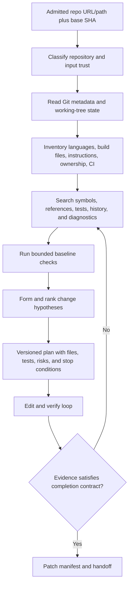
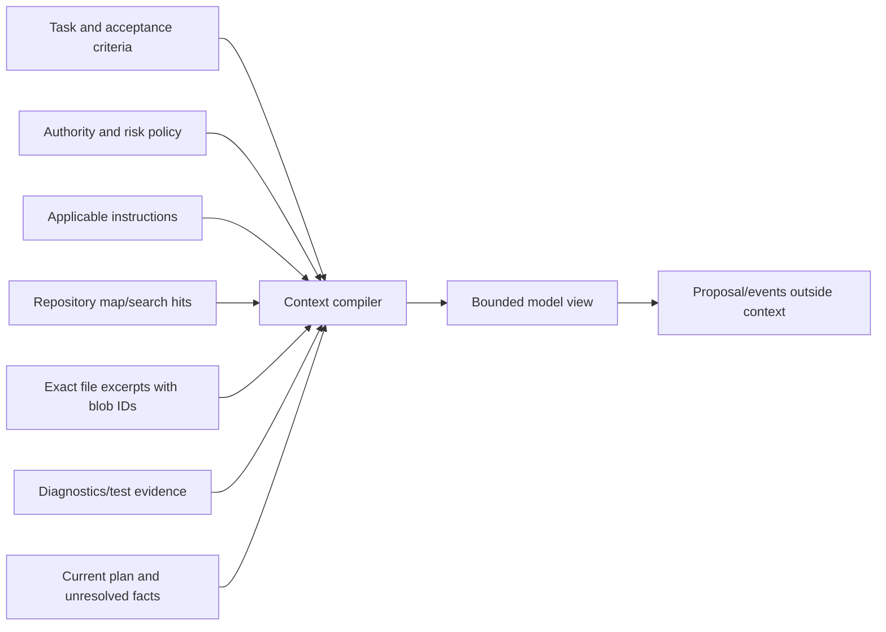
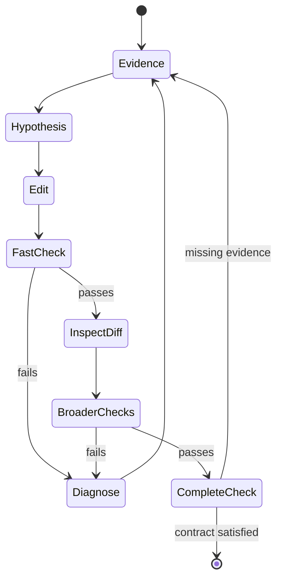

# Repository Discovery, Context, and Planning

> **Status:** Research-backed implementation guide  
> **Last researched:** 2026-08-31  
> **Scope:** Repository onboarding, instruction trust and precedence, search/indexing, context selection, compaction, memory/state choices, plans, continuity, and completion  
> **Evidence:** [Coding-agent blueprint research packet](../../research/packets/coding-agent-blueprint.md)

The agent should build a small, evidence-backed working set instead of loading an entire repository or trusting its first search result. Discovery is a staged process: establish repository identity and trust, inventory structure and instructions, find the relevant execution path, verify the baseline, then write a plan whose steps can be checked against repository state.

## Discovery pipeline



Do not let “planning mode” become a trust bypass. Read-only commands can still expose secrets, invoke pager/filter programs, parse hostile files, or generate excessive output. They require path, process, environment, and output controls even when they cannot modify the repository.

## Phase 1: establish identity and baseline

Record before model work:

```text
repository_id        canonical host/owner/name or local repository UUID
admitted_root        resolved absolute workspace root
base_ref             requested branch/tag/ref
base_commit          full object ID resolved by the controller
worktree_mode        existing checkout | dedicated worktree | ephemeral clone
initial_status_hash  digest of machine-readable Git status
submodules           path + object ID + policy
large_file_system    Git LFS or equivalent state
trust_class          internal-trusted | external-readonly | untrusted-executable
```

Use Git's machine-readable formats (`git status --porcelain=v2 -z`, `git worktree list --porcelain -z`) rather than parsing localized human output. Preserve the initial dirty-tree snapshot when an interactive run deliberately works in an existing checkout. Never silently clean, reset, stash, or overwrite user changes.

For an isolated background run, resolve and fetch the exact base object before provisioning the executor. A branch name is mutable; the full commit ID is the reproducible input.

## Phase 2: inventory cheaply

The controller or a read-only discovery tool should collect a bounded inventory before asking the model to open many files:

| Evidence | Examples | Why it matters |
|---|---|---|
| Repository instructions | `AGENTS.md`, vendor instruction files, contribution docs | Project commands, conventions, and claimed scope |
| Build/package manifests | lockfiles, workspace manifests, toolchain files | Supported languages, dependency graph, reproducible commands |
| Test configuration | test runners, fixtures, coverage, integration services | Expected verification and side effects |
| CI/release | workflow files, pipeline manifests, deployment configs | Required checks and high-risk paths |
| Ownership | `CODEOWNERS`, maintainers, directory docs | Review and escalation requirements |
| Architecture | module/package boundaries, generated-code markers | Search and edit boundaries |
| Repository state | size, file count, submodules, LFS, sparse checkout | Context and executor strategy |
| Recent history | commits touching candidate files, blame only when useful | Intent, regressions, and active migration context |

Avoid recursive reads of vendor, build, cache, generated, binary, coverage, and dependency directories. Start from tracked files (`git ls-files -z`) and explicit allowlists. File extensions are hints, not trust labels.

## Instruction hierarchy and trust

Repository instructions are useful configuration and simultaneously an attack surface. They can guide coding style and commands; they cannot authorize secrets, network destinations, external writes, sandbox escape, or policy changes.

Resolve instructions in two stages; do not flatten security authority and repository applicability into one prompt order.

**Stage A — authority:** platform security and organization policy outrank the authenticated user task and exact approvals. Repository files cannot override either. Ordinary source, documentation, issues, tool output, and retrieved content are evidence, never authority.

**Stage B — repository applicability:** for each candidate path, discover all supported instruction formats from the admitted base, apply their documented path/scope rules, and combine them using an explicit product rule. A sensible default for one instruction family is repository-wide first and nearest path-scoped last, but there is no portable ordering across `AGENTS.md`, vendor instruction files, personal settings, skills, and custom-agent profiles. If two applicable files disagree on a consequential command, generated-file rule, or public API constraint, stop or use a predeclared deterministic tie-breaker—never let prompt position decide.

GitHub documents repository-wide, path-specific, and nearest-`AGENTS.md` behavior for some surfaces, while its CLI documentation says multiple applicable instruction types are combined without a general precedence. Treat such behavior as a versioned adapter rule, not a universal security hierarchy ([repository instructions](https://docs.github.com/en/copilot/how-tos/configure-custom-instructions-in-your-ide/add-repository-instructions-in-your-ide), [CLI custom instructions](https://docs.github.com/en/copilot/how-tos/copilot-cli/customize-copilot/add-custom-instructions)).

### Instruction compiler requirements

- record every instruction file's blob ID, source path, scope, and trust classification;
- include only instructions applicable to candidate files and the task;
- reject instructions that attempt to change platform policy or claim approval;
- cap total instruction bytes and report truncation/conflicts;
- show consequential conflicts to the user or route them to an explicit deterministic rule;
- recompile after the base or instruction file changes;
- never automatically execute a command merely because an instruction file says to;
- treat agent-written modifications to instruction, hook, plugin, MCP, workflow, or IDE configuration as high risk.

Example compiler output for a file—not prose assembled ad hoc:

```yaml
target: packages/payments/src/session.ts
base_commit: <full-object-id>
authority:
  policy_version: org-coding-policy@12
  task_digest: sha256:...
applicable_repository_instructions:
  - {path: AGENTS.md, blob: <id>, scope: "/**", family: agents_md, order: 10}
  - {path: packages/payments/AGENTS.md, blob: <id>, scope: "/packages/payments/**", family: agents_md, order: 20}
conflicts:
  - id: test-command
    values: ["pnpm test", "npm test"]
    resolution: blocked
truncated: false
```

Compile a separate bundle for every changed path. A multi-directory patch may legitimately have different applicable instructions; the final manifest should record the union actually used.

## Search and repository maps

No single retrieval method is sufficient. Use the cheapest reliable technique for each question.

| Question | Preferred evidence |
|---|---|
| Where is a name defined or used? | Text/symbol search with path and language filters |
| What calls this function or implements this interface? | Language server, compiler index, static analysis, then text confirmation |
| Which file owns a route, command, schema, or test? | Build graph, manifest, framework registration, targeted search |
| What changed recently and why? | Git log/diff for the candidate path; linked issue if authorized |
| Which modules are central in a large repo? | Manifest/build dependencies and a bounded symbol graph |
| Which tests cover the behavior? | Test names, imports/references, coverage map if trustworthy and current |
| Which generated files follow a source change? | Generator config and repository instructions; do not hand-edit blindly |

Aider's repository map uses tree-sitter tags where supported, illustrating one compact structural index. Its language coverage depends on available grammars/tags, so keep lexical search and build/test evidence as fallbacks ([aider language support](https://aider.chat/docs/languages.html)).

### Repository map record

```json
{
  "base_commit": "<full-object-id>",
  "generated_at": "2026-08-31T00:00:00Z",
  "files": [
    {
      "path": "src/auth/session.ts",
      "blob": "<git-blob-id>",
      "language": "typescript",
      "symbols": ["createSession", "SessionStore"],
      "imports": ["src/auth/token.ts"],
      "trust": "repository_data"
    }
  ],
  "coverage": {"tracked_files": 1842, "indexed_files": 713},
  "limitations": ["generated/ excluded", "native symbol index unavailable"]
}
```

Invalidate entries by blob ID, not by time alone. An embedding or symbol index is derived evidence; it must retain the source commit/blob and extraction version. Never mix index entries across tenants or repositories.

## Context compiler

The model context is a bounded, task-specific projection, not the authoritative run record.



### Include

- the concrete task, non-goals, acceptance criteria, and risk tier;
- authority summary: writable paths, permitted command/network classes, budgets, approval boundaries;
- applicable instructions with source paths and conflict notes;
- exact excerpts needed for the current decision, with path, line or symbol, and blob version;
- relevant schemas/interfaces/callers/tests rather than entire directories;
- current plan, completed evidence, failed hypotheses, and unresolved questions;
- compact command/test receipts rather than raw megabyte logs.

### Exclude or defer

- unrelated large files and old tool output;
- secrets, credentials, personal files, `.env` values, and hidden service configuration;
- binaries and dependency caches unless a specific inspection tool handles them;
- full repository history or a permanent “memory” dump;
- authoritative policy fields embedded in untrusted result prose;
- hidden model reasoning as a required continuity mechanism.

See [Context engineering](../../context-memory/context-engineering.md) and [Compaction and continuity](../../context-memory/compaction-and-continuity.md) for platform-wide context rules.

### Implementable selection algorithm

Compile context for the **next decision**, not for the whole task:

```text
reserve output + tool-schema + recovery headroom
add authority, accepted task, current base/workspace revision, and cancellation state
add applicable instruction bundles for the candidate paths
derive evidence needs for the next hypothesis or tool call
retrieve only authorized, current, source-versioned candidates
rank by decision value, source authority, freshness, coverage, and token cost
deduplicate; replace raw logs with receipts and artifact ranges
reject the context if any mandatory lane is missing or over budget
emit context_manifest + ordered lanes + truncation/conflict warnings
```

Every compiled context should have a manifest:

```json
{
  "context_id": "ctx_01J...",
  "next_decision": "choose the session revocation edit site",
  "base_commit": "<full-object-id>",
  "workspace_revision": 12,
  "lanes": {
    "authority": {"tokens": 780, "required": true},
    "task": {"tokens": 430, "required": true},
    "verified_state": {"tokens": 620, "required": true},
    "instructions": {"tokens": 510, "required": true},
    "evidence": {"tokens": 6200, "items": 14},
    "recent_results": {"tokens": 1450, "items": 3}
  },
  "reserved_output_tokens": 4000,
  "warnings": ["integration log represented by receipt check_07"]
}
```

Measure required-evidence recall before inference, unused supplied evidence, stale/conflicting item rejection, tokens per lane, tool-selection errors, and outcome/cost under context ablations. Anthropic's context-engineering guidance likewise treats context as a finite set that must be refined each turn; that is supporting practice, not a substitute for the application manifest ([effective context engineering](https://www.anthropic.com/engineering/effective-context-engineering-for-ai-agents)).

## State, memory, and retention decisions

“Memory” is too imprecise for an implementation contract. Use the narrowest mechanism that fits the lifetime and authority needed:

| Need | Coding-agent mechanism | Lifetime | Authority and write rule |
|---|---|---|---|
| Turn context | Compiled lanes for one inference | One model call | Disposable projection; never authoritative |
| Working memory | Hypotheses, candidate paths, TODOs, failed approaches | Current run/phase | Model may propose; controller versions it as unverified working state |
| Session history | User/model/tool interaction record | Interactive session plus retention window | Evidence for debugging and reference resolution; not effect truth |
| Durable execution state | Run state, budgets, workspace revision, effects, checks, approvals | Run plus audit retention | Controller/verifier/integration services only; system of record |
| Domain knowledge | Versioned architecture docs, build graph, ownership, approved playbooks | Repository/org governed | Retrieved from source revisions; update through normal review, not an agent memory write |
| Long-term memory | Cross-session user/repository preferences that do not already belong in versioned repository config | Disabled by default; explicit TTL/deletion | Opt-in, scoped, provenance-preserving write gate; never store secrets, source dumps, permissions, or effect status |
| Episodic memory | Prior run outcome, incident, rejected patch, or successful procedure | Curated regression/learning lifecycle | Admit only after outcome observation and review; prefer an eval fixture or approved playbook over free-form recollection |

For most coding products, the safe default is **no general cross-repository long-term memory**. Put stable project conventions in reviewed repository documentation, current operational facts in authoritative systems, run continuity in durable state, and observed failures in versioned evals. This makes corrections, access control, review, and deletion tractable.

Never let a successful-looking model narrative create a “known good” procedure. An episode is not reusable until the final patch outcome, review disposition, later revert/incident signals, source rights, and privacy classification are known.

### Compaction contract

Compact before the hard context limit while preserving output and recovery headroom. First drop or externalize superseded raw tool results; then build a checkpoint from authoritative state and source references. Do not recursively summarize an old summary when raw events and artifacts remain available.

The compact checkpoint must preserve:

- accepted objective, non-goals, user corrections, authority, risk tier, and cancellation state;
- base commit, workspace/plan revision, changed paths, patch digest, and dirty-tree facts;
- completed/failed checks and their receipts; approvals and expiry; dispatched or unknown effects;
- active hypothesis, rejected approaches and why, unresolved questions, next safe action, and stop conditions;
- instruction/evidence source IDs, trust/sensitivity, conflicts, truncation, and artifact references;
- budgets already consumed and remaining, plus compactor/model/schema versions.

Validate structured fields against the controller and effect ledger before accepting the checkpoint. If the phase changes sharply, summaries have compounded, a model/provider changes, or stale reasoning dominates, start a fresh context from a verified handoff instead of compacting again. Compaction is lossy: Anthropic's long-running harness reports that compaction alone can leave unclear handoffs, and its managed-agent architecture notes that transformed messages are recoverable only if separately stored ([long-running harness](https://www.anthropic.com/engineering/effective-harnesses-for-long-running-agents), [managed-agent context](https://www.anthropic.com/engineering/managed-agents)).

Test uninterrupted, one-compaction, repeated-compaction, clean-handoff, crash-resume, and model-migration variants of the same task. Inject conflicting instructions and a delayed prompt-injection payload before compaction; verify that trust labels, user corrections, unknown effects, approvals, and budget counters survive exactly.

## Planning contract

A plan is useful when it reduces uncertainty and exposes decisions. It is not required for an obvious one-file edit, and it is not a substitute for execution evidence.

Each plan step should contain:

| Field | Meaning |
|---|---|
| `objective` | Observable state the step creates or question it resolves |
| `evidence` | Files, symbols, commands, or test results supporting the step |
| `candidate_paths` | Expected files/directories; changes outside require plan revision |
| `risk` | Security, compatibility, data, migration, or performance concerns |
| `validation` | Exact deterministic checks and qualitative review needed |
| `dependencies` | Prior facts/steps required |
| `status` | Pending, active, verified, rejected, or blocked |
| `revision_reason` | New evidence that changed the plan |

### Planning rules

- form at least one falsifiable hypothesis before broad edits;
- investigate existing utilities and patterns before adding abstractions;
- distinguish required behavior from speculative cleanup;
- name expected test layers and failure cases before editing;
- allow only one active mutating step per workspace;
- revise after contradictory evidence rather than rationalizing the original plan;
- stop when authority, product intent, or acceptance criteria are materially ambiguous;
- never let a generated plan expand the user-authorized scope by itself.

## Edit–verify loop



Prefer small coherent patches. After each edit group:

1. inspect actual Git status and diff;
2. ensure only admitted paths changed and user changes remain intact;
3. run the narrowest relevant formatter/linter/type/test check;
4. capture exit status, duration, output artifact, environment fingerprint, and patch digest;
5. run broader repository-required checks before handoff;
6. update the plan from evidence, not from the model's assertion.

## Continuity across context or process loss

Keep authoritative continuity outside the prompt:

```yaml
run_id: run_01J...
base_commit: <full-object-id>
workspace_revision: 17
plan_revision: 4
current_hypothesis: "refresh token is accepted after session revocation"
changed_paths:
  - src/auth/session.ts
  - tests/auth/session.test.ts
checks:
  - id: check_07
    command_class: test.targeted
    patch_digest: sha256:...
    status: passed
unresolved:
  - "full integration suite requires database service"
forbidden_or_failed_approaches:
  - "do not alter public token format"
```

The controller can render this into a compact handoff for a resumed model. Retain raw events and artifacts separately. Anthropic's long-running coding experiments similarly used explicit task/progress artifacts and clean session handoffs; the transferable lesson is durable structured state, not a particular filename or multi-agent topology ([long-running harness](https://www.anthropic.com/engineering/effective-harnesses-for-long-running-agents), [2026 harness design](https://www.anthropic.com/engineering/harness-design-long-running-apps)).

## Completion contract

“Done” requires all applicable conditions:

- the requested behavior and non-goals are satisfied;
- the final diff is scoped, understandable, and based on the current admitted base or explicitly rebased;
- pre-existing user changes are preserved;
- required generated files, migrations, schemas, documentation, and tests are included;
- targeted and required broader checks ran against the final patch digest;
- failures, skips, flakiness, environment gaps, and unverified assumptions are explicit;
- security-sensitive changes received their required analyzers and reviewers;
- patch manifest, artifacts, and provenance are complete;
- no pending process, credential, approval, or unknown effect remains;
- the handoff describes outcome and evidence without claiming more than was verified.

## Common failure patterns

| Failure | Root cause | Control |
|---|---|---|
| Reads thousands of files | No staged inventory or output budget | Tracked-file inventory, lazy targeted retrieval, byte/token limits |
| Obeys malicious README/comment | Repository prose treated as authority | Trust labels, fixed instruction hierarchy, deterministic policy |
| Edits generated/vendor code | Missing ownership/build metadata | Detect generators/manifests and path policy before edit |
| Reimplements an existing helper | Search stopped at first plausible file | Symbol/reference search and pattern inventory |
| “Fixes” failing baseline tests | Baseline not established | Run or record pre-edit baseline; distinguish inherited failures |
| Loses the task after compaction | Transcript used as state store | Durable plan/progress/evidence record |
| Keeps changing code after success | No completion contract or diff budget | Explicit stop conditions and verification gate |
| Declares success from prose | Model self-report treated as evidence | Query Git state and check receipts independently |
| Leaks secret through context | Broad read/index policy | Sensitive-path deny rules, redaction, sandbox and egress controls |

## Acceptance checklist

- [ ] Base commit and initial worktree state are recorded before model work.
- [ ] Repository trust class determines whether any code may execute.
- [ ] Instructions are scoped, versioned, bounded, and unable to grant authority.
- [ ] Instruction precedence is compiled per target path; cross-format conflicts never depend on prompt order.
- [ ] Discovery begins with tracked metadata and excludes obvious bulk directories.
- [ ] Search uses lexical, structural, build, test, and history evidence appropriately.
- [ ] Every model excerpt retains path and source revision.
- [ ] Context manifests reserve mandatory lanes/output headroom and report truncation, conflicts, and artifact indirection.
- [ ] Turn, working, session, durable, domain, long-term, and episodic state have distinct stores and write rules.
- [ ] Compaction/handoff preserves corrections, authority, effects, receipts, budgets, provenance, and next action; continuity variants are evaluated.
- [ ] Plan steps have evidence, paths, validation, risk, and revision history.
- [ ] Progress and test receipts survive context/process loss outside the transcript.
- [ ] Final completion is derived from repository state and final-patch evidence.

## Selected primary sources

- [Git status porcelain v2](https://git-scm.com/docs/git-status.html)
- [Git worktree](https://git-scm.com/docs/git-worktree.html)
- [GitHub repository custom instructions](https://docs.github.com/en/copilot/how-tos/configure-custom-instructions-in-your-ide/add-repository-instructions-in-your-ide)
- [VS Code Workspace Trust](https://code.visualstudio.com/docs/editing/workspaces/workspace-trust)
- [Aider supported languages and repository-map requirements](https://aider.chat/docs/languages.html)
- [Anthropic: effective harnesses for long-running agents](https://www.anthropic.com/engineering/effective-harnesses-for-long-running-agents)
- [Anthropic: harness design for long-running applications](https://www.anthropic.com/engineering/harness-design-long-running-apps)
- [Anthropic: effective context engineering for AI agents](https://www.anthropic.com/engineering/effective-context-engineering-for-ai-agents)
- [Anthropic: scaling managed agents](https://www.anthropic.com/engineering/managed-agents)
