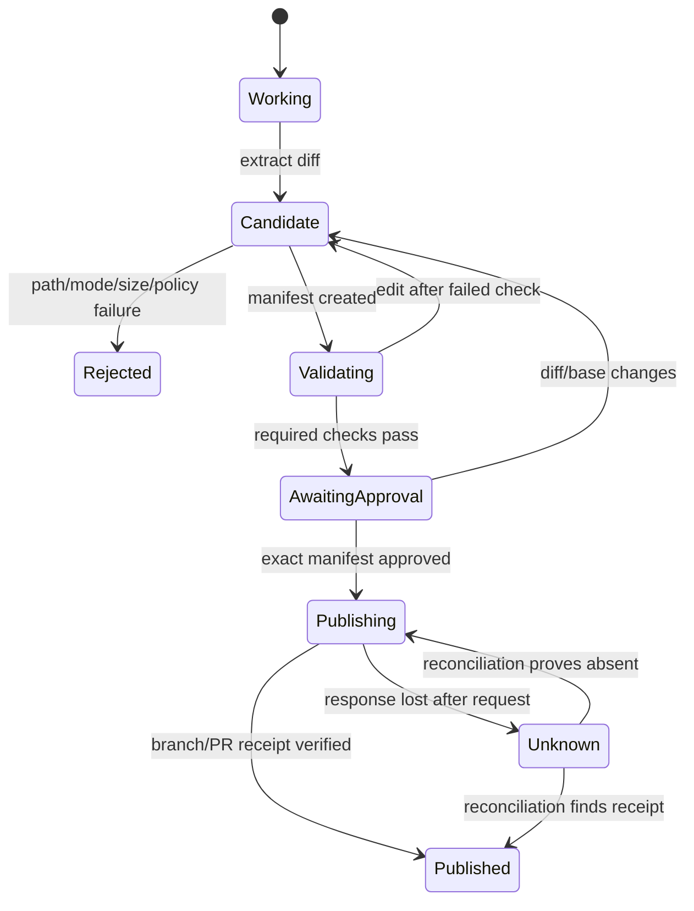

# Tools, Edits, Terminal, and Patch Provenance

> **Status:** Research-backed implementation guide  
> **Last researched:** 2026-08-31  
> **Scope:** Coding-agent tool surface, process execution, file mutation, Git/worktree strategy, tests as effects, and patch provenance  
> **Evidence:** [Coding-agent blueprint research packet](../../research/packets/coding-agent-blueprint.md)

A coding tool is a contract for a nondeterministic caller operating on a versioned workspace. Its result must say what was attempted, what changed, what evidence exists, and whether the outcome is verified, failed, partial, or unknown. A convenient `bash(command)` function is not an adequate production contract by itself.

## Minimal tool surface

Start with a small orthogonal set:

| Tool | Purpose | Default effect class |
|---|---|---|
| `workspace_status` | Base SHA, branch/worktree, changed paths, conflicts, sizes | Read |
| `search_files` | Bounded tracked-file, text, symbol, or structural search | Read |
| `read_file` | Versioned range/symbol retrieval with binary/sensitivity policy | Read |
| `apply_patch` | Atomic, scoped text/binary-policy edit against expected versions | Workspace write |
| `run_command` | Execute a classified command under policy and isolation | Process/effects depend on class |
| `test` | Named repository validation profile with normalized evidence | Executes untrusted code |
| `inspect_diff` | Machine and human projections of current patch | Read |
| `request_approval` | Bind an exact proposed effect and facts to an authorized user | Control |
| `publish_patch` | Submit immutable manifest to a separate integration gate | External effect |

Add language-server, browser, emulator, database, code-hosting, or issue tools only when the workload requires them. Lazy discovery can reduce prompt/tool-schema load, but discovered tools still require an approved registry, version pin, per-tool authorization, and output trust labels.

## Common result envelope

```json
{
  "call_id": "call_01J...",
  "tool": "run_command",
  "contract_version": "1.2.0",
  "workspace_revision_before": 12,
  "workspace_revision_after": 12,
  "status": "succeeded",
  "effect_state": "verified",
  "summary": "targeted test profile passed",
  "data": {
    "exit_code": 0,
    "duration_ms": 4812,
    "stdout_artifact": "artifact://...",
    "stderr_artifact": "artifact://...",
    "output_truncated": false
  },
  "provenance": {
    "run_id": "run_01J...",
    "executor_image": "registry.example/agent@sha256:...",
    "base_commit": "<full-object-id>",
    "patch_digest": "sha256:...",
    "observed_at": "2026-08-31T00:00:00Z"
  },
  "warnings": []
}
```

Use separate `status` and `effect_state`. A command may time out while its child process or network request has already produced an effect; that outcome is not safely represented as a simple failure.

See [Tool contracts](../../tools/tool-contracts.md) and [Tool results, artifacts, and provenance](../../tools/tool-results-artifacts-and-provenance.md) for the general envelope.

## Terminal execution contract

### Prefer structured invocation

Represent the operation as structured fields, even if the executor ultimately launches a shell:

```json
{
  "argv": ["npm", "test", "--", "session.revocation"],
  "cwd": "repo://tests",
  "command_class": "test.targeted",
  "env_profile": "test-secretless",
  "stdin": "closed",
  "tty": false,
  "timeout_ms": 120000,
  "idle_timeout_ms": 30000,
  "output_limit_bytes": 2000000,
  "network_profile": "dependency-cache-only",
  "resource_profile": "small-build"
}
```

Avoid accepting an arbitrary shell string when an argv form is sufficient. Shell composition introduces expansion, quoting, pipelines, redirections, command substitution, aliases/functions, startup files, and compound-command policy ambiguity. Some repository commands genuinely require a shell; classify and inspect those separately and execute with a known shell in a controlled environment.

### Executor requirements

- resolve `cwd` beneath the admitted workspace without following an unsafe path escape;
- use a minimal explicit environment, fixed `PATH`, locale, home/cache policy, and noninteractive flags;
- close or bound stdin unless interaction is deliberately supported;
- default to no PTY; allocate one only for a known interactive tool and record the semantic difference;
- create a process group/job/container boundary so descendants can be terminated;
- apply CPU, memory, process, file-size, disk, wall-time, idle-time, output, and network budgets;
- stream bounded chunks to artifact storage while giving the model a compact normalized projection;
- record executable resolution, argv, cwd, environment profile, start/end, exit/signal, resources, and artifacts;
- on cancellation, stop scheduling, terminate the whole execution boundary, revoke credentials, and verify quiescence;
- classify timeout, cancellation, signal, policy denial, nonzero exit, output overflow, and lost executor distinctly.

The process profile must neutralize ambient developer and repository execution hooks. Use a controlled home/config directory, do not source shell startup files, disable interactive credential/GUI prompts, and make pager/editor behavior noninteractive. For Git reads, prefer `--no-pager`, `--no-ext-diff`, machine formats, and a trusted empty hooks path where the command could trigger hooks; do not inherit `core.hooksPath`, credential helpers, filters, external diff/textconv drivers, or arbitrary global/system configuration without an explicit profile. Git documents that hooks can be redirected with `core.hooksPath`, so a “read Git metadata” class must describe configuration as well as argv ([Git hooks](https://git-scm.com/docs/githooks)).

Record the resolved executable by digest or trusted image path. A benign argv can execute a malicious shadow binary when `PATH`, package-manager shims, aliases, or workspace-local launchers are uncontrolled.

### Command classes

| Class | Examples | Default policy |
|---|---|---|
| Metadata read | Git status/log, compiler version | Auto within workspace, bounded output |
| Source read/search | `rg`, language index, file ranges | Auto except sensitive paths |
| Workspace-local transform | formatter, code generator | Allowed only in writable paths; inspect diff |
| Build/test | compiler, package scripts, test runner | Sandbox, secretless, restricted egress, resources |
| Dependency resolution | install/restore/update | Lockfile-aware, registry allowlist, scripts policy, explicit diff review |
| VCS mutation | add/commit/branch/rebase | Worktree/branch scoped; no force push; policy event |
| Remote repository effect | push, PR/comment/status | Separate integration service and idempotency key |
| Infrastructure/release | deploy, publish, cloud/Kubernetes admin | Outside ordinary agent authority |
| Destructive host/data | broad delete, disk/admin, database mutation | Deny or separate explicitly authorized system |

Do not build the security boundary from a command-name denylist alone. A permitted interpreter, build tool, test runner, package script, Git hook, compiler plugin, or editor task can perform arbitrary behavior. The execution environment and reachable capabilities are the boundary.

## File read and edit contracts

### Read

`read_file` should require a repository-relative path, expected blob/workspace revision, range or symbol, maximum bytes, and text/binary mode. The result identifies encoding, line ending, truncation, hash, source revision, and sensitivity classification. Reading a symlink returns metadata and a resolved-target policy result before content.

### Edit

Prefer an atomic patch with preconditions:

```json
{
  "workspace_revision": 12,
  "files": [
    {
      "path": "src/auth/session.ts",
      "expected_sha256": "...",
      "patch": "@@ ...",
      "mode_before": "100644",
      "mode_after": "100644"
    }
  ],
  "allow_create": false,
  "allow_delete": false,
  "allow_binary": false,
  "allow_symlink": false
}
```

The editor must:

- canonicalize paths and reject absolute, parent traversal, alternate data stream/device, and out-of-root targets;
- reject stale expected content rather than applying to an unintended version;
- apply the entire edit transaction or none of it;
- preserve encoding and line endings unless the change intentionally declares otherwise;
- handle file modes, renames, submodules, symlinks, and binaries through explicit policy paths;
- increment the workspace revision and emit changed-path/hash evidence;
- never overwrite untracked or pre-existing user files without explicit handling;
- run diff path/mode/size policy before reporting success.

Git's `git apply --check` can verify applicability and its default rejects paths outside the working area; `--unsafe-paths` should never be enabled for agent artifacts. It does not replace custom path, file-type, scope, and base checks ([git apply](https://git-scm.com/docs/git-apply)).

An IDE edit is not a weaker version of this contract. The adapter must capture the editor document version, convert the proposed change into a reviewable versioned workspace edit, reject stale/open-buffer conflicts, and observe the post-edit document hashes. VS Code's API applies multi-resource workspace edits and the Language Server Protocol supports versioned document edits; neither supplies coding-agent path authorization or patch provenance by itself ([VS Code `WorkspaceEdit`](https://code.visualstudio.com/api/references/vscode-api), [Language Server Protocol](https://microsoft.github.io/language-server-protocol/specifications/lsp/3.18/specification/)).

## IDE, MCP, and external-tool adapters

Keep one internal effect contract even when the transport is an IDE extension, language server, MCP server, code-host app, CI API, or local binary.

| Adapter | Normalize before use | Verify after use | Never trust implicitly |
|---|---|---|---|
| IDE/editor | Workspace identity, open document version, selected ranges, proposed `WorkspaceEdit`, user-visible preview | Applied document versions/hashes and actual Git diff | Editor trust flag as authorization; unsaved buffers as the admitted base |
| Language/index service | Repository/base, server version, document version, query and result cap | Result paths/ranges still match current blobs | Symbol result freshness or semantic correctness |
| MCP | Server identity/release, protocol version, tool-list digest, input/output schema, effect class, auth scope, time/output limits | Application postcondition and common result envelope | Tool description or `readOnlyHint`/`idempotentHint`/`destructiveHint` annotations |
| SCM/CI/issue API | Canonical tenant/repository, actor, operation, destination, base/head, stable operation ID | Provider object ID, current SHA/state, URL, and policy/branch postconditions | HTTP success alone, mutable names, webhook delivery count, or provider prose |

Example admitted MCP tool record:

```yaml
adapter: mcp
server_id: registry.example/scm-readonly
server_release: sha256:...
protocol: "2026-07-28"
tool: get_merge_request
tool_schema_digest: sha256:...
effect_class: scm.read
allowed_repository: gitlab:group/project
credential_profile: scm-read-one-repo
timeout_ms: 15000
output_bytes: 250000
annotations_observed: {readOnlyHint: true}
authorization_source: organization-tool-policy@9
```

The current MCP specification requires clients to treat tool annotations as untrusted unless the server is trusted. Even for an admitted server, the application—not the annotation—classifies the effect, supplies audience-bound credentials, validates structured results, and reconciles external state ([MCP tools](https://modelcontextprotocol.io/specification/2026-07-28/server/tools), [MCP authorization](https://modelcontextprotocol.io/specification/2026-07-28/basic/authorization)). Protocol task handles or stateless requests do not replace the coding agent's run/effect ledger.

Contract-test every adapter against wrong repository/tenant, stale document/base, pagination and truncation, schema drift, 401/403/404/409/429/5xx, timeout after commit, duplicate webhook/call, forged success payload, changed tool catalog, revoked token, and cancellation. An adapter is production-ready only when each case maps to a stable internal status/effect state and preserves a raw receipt.

## Git workspace and branch strategy

| Scenario | Recommended strategy | Important caveat |
|---|---|---|
| Read-only local review | Existing checkout, no mutation tools | Still protect secrets and command execution |
| Interactive edit on clean repo | Dedicated worktree from current intended base | Initialize dependencies separately; do not copy secrets by default |
| Interactive edit with user changes | Either explicit same-checkout collaboration with initial-state ledger, or user-approved snapshot/worktree plan | A worktree from `HEAD` does not contain uncommitted changes |
| Background/CI task | Fresh ephemeral clone or worktree at pinned base SHA, new agent branch | One run owns it; destroy/revoke after artifact capture |
| Parallel independent tasks | One worktree/branch per run | Shared Git object store is not shared working-tree safety |
| Parallel tasks with dependencies | Serialize or integrate predecessor commit into a new base | Do not let agents edit the same files concurrently |

Git supports multiple working trees sharing repository history, while each checked-out branch is normally associated with one worktree ([git worktree](https://git-scm.com/docs/git-worktree.html)). Products such as Claude Code use worktrees to isolate parallel sessions; their cleanup and copied-file conveniences remain product behavior, not Git guarantees ([Claude Code worktrees](https://code.claude.com/docs/en/worktrees)).

### Branch rules

- derive a unique branch from a pinned base commit, not a mutable ambient checkout;
- allow the integration identity to update only that branch and its one pull request;
- deny force push and default-branch writes;
- never reuse an agent branch for an unrelated run;
- record base and head SHAs on every patch revision;
- after base movement, rebase/merge only in an isolated integration step, then rerun required validation;
- separate agent commit identity from the human requester and preserve both attribution fields;
- treat a valid commit signature as provenance of the signing identity, not proof of patch correctness.

GitHub's cloud agent uses a single `copilot/` branch (or the explicitly addressed PR branch), cannot merge its PR, and links signed commits to session logs. These are strong product-specific examples of branch restriction and auditability ([GitHub risks and mitigations](https://docs.github.com/en/copilot/concepts/agents/cloud-agent/risks-and-mitigations)).

## Patch lifecycle



Every validation receipt binds to `base_commit + patch_digest + environment_profile + command/test definition`. Any material change invalidates the receipt.

## Patch manifest

```yaml
schema: coding-agent.patch-manifest/v1
run_id: run_01J...
requester:
  subject: user:1234
  trigger: issue:567
repository: github:example/payments
base_commit: <full-object-id>
head_tree: <git-tree-id>
patch:
  artifact: artifact://patches/run_01J.../change.diff
  sha256: <digest>
  files:
    - path: src/auth/session.ts
      operation: modify
      before_blob: <git-blob-id>
      after_sha256: <digest>
      mode_before: "100644"
      mode_after: "100644"
producers:
  controller: coding-agent-controller@1.4.2
  harness: coding-harness@0.19.0
  model: provider/model-exact-id
  executor_image: registry.example/agent@sha256:...
instructions:
  - path: AGENTS.md
    blob: <git-blob-id>
checks:
  - check_id: check_07
    profile: test.targeted/session-revocation@3
    patch_sha256: <same-digest>
    status: passed
    receipt: artifact://checks/check_07.json
approvals:
  - approval_id: approval_02
    subject: user:reviewer-9
    patch_sha256: <same-digest>
    base_commit: <same-base>
    expires_at: 2026-08-31T01:00:00Z
limitations:
  - full integration suite not available in local executor
```

Store the manifest and referenced artifacts immutably under repository/tenant access controls. in-toto and SLSA provenance provide established formats for supply-chain attestations; use them for build artifacts when interoperable provenance is required rather than inventing a competing attestation envelope ([in-toto](https://in-toto.io/docs/getting-started/), [SLSA provenance](https://github.com/slsa-framework/slsa/blob/main/spec/build-provenance.md)).

## Tests and analyzers are tool effects

The model should select from versioned test profiles where possible:

```yaml
id: test.targeted/session-revocation@3
argv: ["npm", "test", "--", "session.revocation"]
cwd: "."
timeout_ms: 120000
network: none
secrets: none
resources: small-build
expected_artifacts:
  - junit.xml
pass_rule:
  exit_code: 0
```

Repository tests, linters, compilers, generators, and package scripts execute repository-controlled code. Run them in the same or stronger isolation as ordinary shell commands, without release/production credentials. A passing exit code is evidence only if the intended executable ran, output was not truncated in a way that hides failure, timeout/cancellation did not occur, and the profile was bound to the final patch.

## Code-review contract

Run consequential review from a fresh context that receives the authenticated task, exact base/head or patch digest, applicable repository policy, changed files, and relevant surrounding code. Do not make the author's narrative or hidden reasoning the reviewer's primary evidence.

The review agent should be read-only and may search, inspect history, and run secretless verification. It should examine:

- behavioral correctness and task/non-goal coverage;
- regression and edge-case tests, including whether tests were weakened or merely mirror the implementation;
- authentication, authorization, input/data boundaries, secrets, injection, concurrency, and error handling;
- public API/schema/migration and backward-compatibility changes;
- performance/resource and operational consequences;
- dependency, build, workflow, generator, configuration, and supply-chain changes;
- unrelated churn, copied/duplicated logic, dead code, and repository convention violations.

Use a finding schema that forces actionable evidence:

```json
{
  "finding_id": "review_01J...",
  "patch_digest": "sha256:...",
  "severity": "high",
  "category": "authorization",
  "path": "src/auth/session.ts",
  "line": 148,
  "title": "Revoked session still refreshes token",
  "consequence": "A revoked credential can mint a new access token.",
  "evidence": "The refresh path checks token expiry but not the revoked session state.",
  "reproduction": "artifact://review/repro-07.json",
  "suggested_direction": "Consult SessionStore before signing the refreshed token.",
  "confidence": "high"
}
```

Suppress style preferences already handled by formatters and speculative findings without a plausible consequence. Bind every finding to the reviewed head/patch; mark it stale after a new revision and rerun only the necessary review. A model's self-review or second model is an additional detector, not a substitute for CODEOWNERS, security specialists, required checks, or human merge responsibility. GitHub's managed coding agent uses automated code review and security scanning before handoff while still requiring human review, illustrating the layered rather than substitutive role ([risks and mitigations](https://docs.github.com/en/copilot/concepts/agents/cloud-agent/risks-and-mitigations)).

## Review projections

Produce different views from the same immutable patch:

- machine view: paths, operations, modes, hashes, binary/submodule/symlink flags, line counts;
- human diff: contextual, syntax-aware where possible, with generated/vendor changes separated;
- semantic summary: interfaces, behavior, data/schema, dependencies, security, and tests affected;
- risk view: protected paths, workflow/build changes, permission/auth/crypto, dependency additions, large deletions;
- provenance view: requester, base, run, model/harness, checks, approvals, and limitations.

The semantic summary can be model-generated but must cite file/hunk identifiers. It never replaces the diff.

## Tool failure matrix

| Failure | Safe response |
|---|---|
| Stale file/workspace revision | Re-read and re-plan; never blind-merge the patch |
| Command output limit reached | Stop or continue to artifact under policy; mark result partial |
| Timeout with surviving descendants | Kill execution boundary, revoke authority, mark unknown until quiescence verified |
| Test runner exits zero but report missing | Contract failure, not pass |
| Patch changes protected path | Reject or require a new risk-tier approval and specialist checks |
| Publish request times out | Reconcile by stable operation ID; never create a new PR blindly |
| Base branch advances | Reintegrate in a fresh workspace and rerun checks on new digest |
| Binary/symlink/submodule change | Dedicated explicit review path; do not treat as normal text diff |
| User's dirty file conflicts | Stop and preserve user state; do not reset/stash without authorization |

## Acceptance checklist

- [ ] Tool arguments and results use versioned schemas and explicit effect states.
- [ ] Arbitrary shell strings are exceptional; argv, cwd, env, TTY, resources, and network are explicit.
- [ ] Process descendants and output growth are bounded and observable.
- [ ] Terminal profiles neutralize ambient startup files, hooks, helpers, pagers, executable shadowing, and interactive prompts.
- [ ] File edits are atomic, version-checked, root-scoped, and file-type aware.
- [ ] IDE, language, MCP, SCM, and CI adapters normalize into the same effect/result contract and pass ambiguity/schema/auth tests.
- [ ] One run owns one workspace and one agent branch.
- [ ] Tests execute as untrusted code with no production authority.
- [ ] Review findings bind to an exact patch revision and include consequence and evidence.
- [ ] Every check and approval binds to the exact patch digest and base.
- [ ] Publication uses a separate credentialed gate and stable operation ID.
- [ ] Patch manifest traces request, producer, sources, files, checks, approvals, and limitations.

## Selected primary sources

- [Git worktree](https://git-scm.com/docs/git-worktree.html)
- [Git status porcelain v2](https://git-scm.com/docs/git-status.html)
- [Git apply](https://git-scm.com/docs/git-apply)
- [Git diff](https://git-scm.com/docs/git-diff.html)
- [Git verify-commit](https://git-scm.com/docs/git-verify-commit/2.50.0.html)
- [Git hooks](https://git-scm.com/docs/githooks)
- [GitHub coding-agent risks and mitigations](https://docs.github.com/en/copilot/concepts/agents/cloud-agent/risks-and-mitigations)
- [VS Code extension API](https://code.visualstudio.com/api/references/vscode-api)
- [Language Server Protocol 3.18](https://microsoft.github.io/language-server-protocol/specifications/lsp/3.18/specification/)
- [MCP 2026-07-28 tools](https://modelcontextprotocol.io/specification/2026-07-28/server/tools)
- [in-toto getting started](https://in-toto.io/docs/getting-started/)
- [SLSA build provenance](https://github.com/slsa-framework/slsa/blob/main/spec/build-provenance.md)
