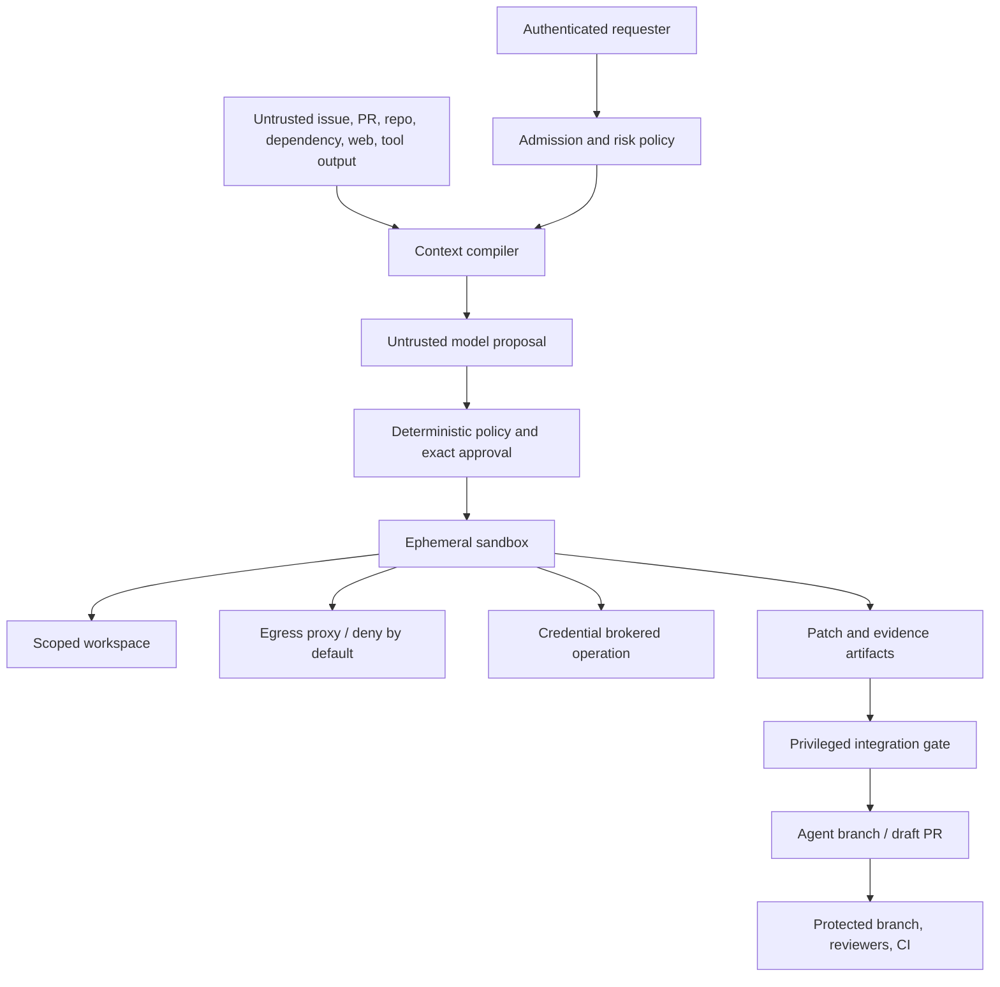
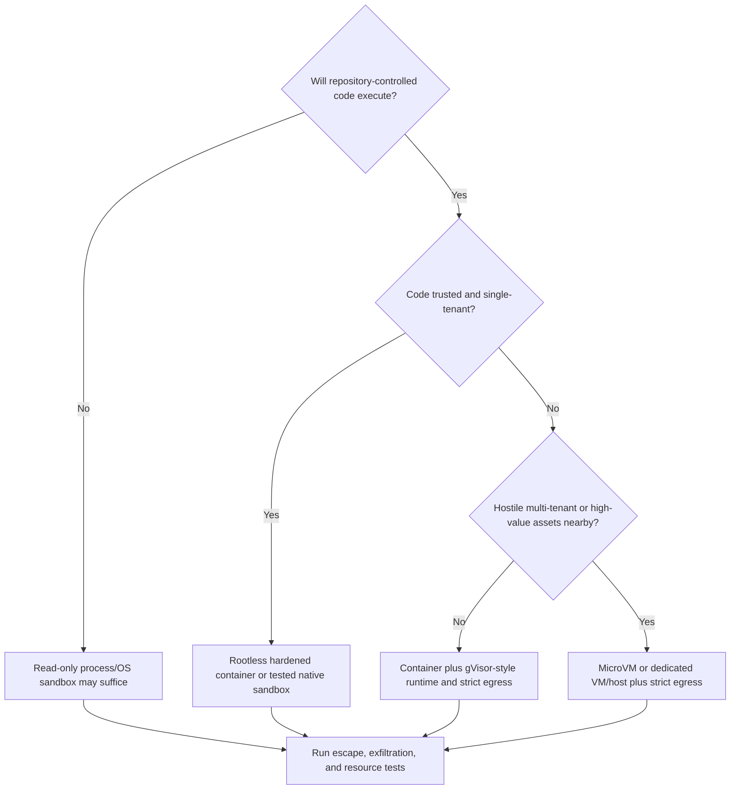

# Security, Permissions, Sandboxing, and Supply Chain

> **Status:** Research-backed security blueprint  
> **Last researched:** 2026-08-31  
> **Scope:** Coding-agent threat model, trust boundaries, authorization, approvals, isolation, secrets, network, repository/CI and dependency supply chain, and security validation  
> **Evidence:** [Coding-agent blueprint research packet](../../research/packets/coding-agent-blueprint.md)

Assume repository content can be malicious, the model can be manipulated or mistaken, and any executable available to the agent can express more behavior than its command name suggests. Security comes from minimizing reachable authority and containing execution—not from asking the model to be careful or prompting a user for every command.

## Assets, actors, and attackers

### Assets

- proprietary source, unreleased changes, user working trees, and neighboring repositories;
- SSH keys, cloud credentials, package tokens, Git credentials, environment variables, browser sessions, and local services;
- code-hosting branches, issues, pull requests, checks, rulesets, workflow configuration, and audit data;
- dependency caches, build artifacts, container images, registries, releases, and provenance;
- model prompts/context, transcripts, tool results, test logs, traces, and retained memory;
- developer and service identities, approvals, budgets, and organizational policy;
- workstation/runner host, kernel, network, metadata services, and other tenants.

### Threat actors and failure sources

- a malicious or compromised repository owner, fork contributor, issue/PR commenter, dependency, package, plugin, hook, skill, MCP server, build image, or CI action;
- an authorized user attempting to exceed policy or accidentally assigning too much scope;
- an indirect prompt injection in source, comments, docs, logs, test output, diagnostics, generated content, or retrieved web pages;
- a model that hallucinates, overgeneralizes approval, follows lower-trust instructions, or chooses a destructive path;
- a compromised provider, harness dependency, sandbox image, credential broker, or integration service;
- concurrent runs that collide, reuse state, or publish against stale facts;
- operational error: permissive mounts, broad network, long-lived tokens, unpatched runtime, or retention leakage.

## Trust-boundary model



There are two distinct untrusted computations:

1. the model proposes actions after reading untrusted data;
2. the repository's build/test/dependency code executes arbitrary machine instructions.

Both must be unable to reach high-value assets even if every prompt defense fails.

## Threat-to-control matrix

| Threat | Example | Required controls |
|---|---|---|
| Goal hijack | README says to upload source to “diagnostics” site | Trust labels, instruction hierarchy, egress deny, no ambient credentials |
| Tool misuse | Agent uses permitted interpreter to perform denied action | Environmental containment, effect policy, not command-name filtering alone |
| Secret exfiltration | Test reads environment/SSH files and sends them out | No secret mounts/env, scoped filesystem, egress proxy, honeytoken tests |
| Host compromise | Malicious compiler/plugin exploits shared kernel | Hardened runtime; gVisor/microVM for higher-risk multi-tenant code; patched hosts |
| Cross-repo/tenant leak | Index or cache returns another repository's content | Tenant-scoped stores/keys, access checks, per-run workspaces and artifact ACLs |
| CI pwn request | Privileged workflow checks out and runs fork code | Separate untrusted/privileged workflows; never execute untrusted code with secrets/write token |
| Dependency compromise | Package install script steals token or changes agent config | Pinned lock/hash, script policy, registry allowlist, isolated restore, review diffs |
| Configuration persistence | Agent modifies instruction/hook/workflow/MCP config for later execution | Protected paths, CODEOWNERS, no auto-load from unreviewed patch, config diff scanner |
| Approval laundering | User approves command, then diff/arguments/base change | Approval binds exact normalized effect, facts, digest, expiry, and subject |
| Overbroad repository write | Agent pushes default branch or changes unrelated PR | Separate GitHub App/service identity restricted to one branch/PR |
| Destructive cleanup | Agent removes user or shared files | Dedicated worktree, root-scoped file policy, no broad host mounts, recoverable Git path |
| Resource denial | Fork bomb, infinite tests, log/disk explosion | PID/CPU/memory/disk/time/output/network quotas and fleet admission |
| Trace leakage | Source/secrets retained in prompts/logs indefinitely | Data classification, redaction, access, encryption, retention/deletion policy |

NIST's adversarial-ML taxonomy explicitly covers indirect prompt injection that hijacks an agent. OWASP's 2026 agentic risk work separately calls out goal hijack, tool misuse, identity/privilege abuse, supply-chain risk, and cascading failures. Use these as threat catalogs, then map them to the coding agent's reachable assets ([NIST AI 100-2 E2025](https://csrc.nist.gov/pubs/ai/100/2/e2025/final), [OWASP Agentic Top 10](https://genai.owasp.org/resource/owasp-top-10-for-agentic-applications-for-2026/)).

## Authorization model

Represent authority as a short-lived capability attached to the run, not as prompt text:

```yaml
subject: user:1234
run_id: run_01J...
repository: github:example/payments
base_commit: <full-object-id>
expires_at: 2026-08-31T01:00:00Z
workspace:
  read: ["/**"]
  write: ["/src/auth/**", "/tests/auth/**"]
  deny: ["/.github/**", "/CODEOWNERS", "/.agent/**"]
commands:
  allow_classes: [metadata.read, source.read, format.local, test.targeted]
network:
  profile: none
credentials:
  profile: none
publication:
  operation: propose_patch
  branch_prefix: agent/
budgets:
  wall_seconds: 1800
  max_processes: 128
  max_patch_files: 20
  max_patch_bytes: 250000
```

Policy evaluation happens again at each effect and at publication. Revalidate the canonical repository, current base, actor access, protected paths, destination, and approval. A session that was authorized an hour ago may no longer be authorized now.

### Separate identities

| Identity | Authority |
|---|---|
| Model/executor | No reusable credential; creates local patch and requests operations |
| Read broker | Optional scoped, short-lived read token for one repository/resource |
| Artifact writer | Write-only to run-specific artifact prefix; cannot read other runs |
| Integration service | Update one agent branch/PR; no merge/default-branch/release authority |
| CI validator | Read repository, write check result; no production secret unless separate approved job |
| Deployment/release system | Outside coding-agent boundary and governed by existing change control |

GitHub App installation tokens are short-lived (normally one hour) and can be repository/permission scoped; that is preferable to a developer PAT for background integration ([GitHub credential types](https://docs.github.com/en/organizations/managing-programmatic-access-to-your-organization/github-credential-types)).

## Approvals

Use human approval for consequential semantic decisions, not as the primary sandbox.

An approval record must include:

- authenticated approving subject and required role/relationship;
- normalized operation type, arguments, destination, and credential scope;
- repository, base commit, workspace revision, and patch/artifact digest;
- reason and risk summary with a legible diff or command projection;
- requested time, decision time, expiry, and single-use/reuse rule;
- policy version and facts used to decide that approval was required;
- what invalidates it: any relevant byte, base, path, command, domain, identity, or policy change.

### Do not ask users to approve

- opaque shell blobs they cannot evaluate;
- routine reads already contained by policy;
- the same low-risk command repeatedly because the architecture lacks a sandbox;
- a plan when the eventual effect bytes/arguments are still unknown;
- “all future commands” or unrestricted network/host access;
- a test process that can reach secrets or production simply because the user clicked yes.

Anthropic reports that sandboxing reduced permission prompts in its internal Claude Code usage, while warning that repeated prompts create approval fatigue. Treat that as vendor-specific evidence supporting up-front boundaries, not a universal rate estimate ([Claude Code sandboxing report](https://www.anthropic.com/engineering/claude-code-sandboxing)).

## Sandbox requirements

“Containerized” is not a complete security statement. Document each dimension:

| Dimension | Secure baseline |
|---|---|
| Workspace | One run; only required repository tree writable; no host home/SSH/socket mounts |
| Root filesystem | Read-only base with bounded ephemeral writable layers |
| User/privilege | Non-root/rootless where possible; drop capabilities; no privileged mode |
| Syscalls/kernel | Default-deny or hardened seccomp/LSM; stronger kernel boundary for hostile multi-tenancy |
| Processes | PID limit, process group/container kill, no host PID/IPC namespaces |
| Resources | CPU, memory, disk, file, process, I/O, time, and output quotas |
| Devices | No host devices/KVM/Docker socket unless a separate specialized pool requires them |
| Network | Deny by default; proxy allowlist with DNS/IP/rebinding controls and logs |
| Credentials | None by default; broker exact short-lived operation outside model/process tree |
| Metadata/local services | Block cloud metadata, host loopback, link-local, internal control planes |
| Cleanup | Revoke tokens, stop descendants, capture evidence, destroy workspace, verify no lease remains |
| Host | Patched kernel/runtime/microcode, dedicated service account, monitored escape indicators |

### Isolation decision



Docker's rootless mode reduces daemon/runtime privilege, while its seccomp profile limits system calls. gVisor moves the Linux-like system interface into a per-sandbox userspace kernel. Firecracker adds a guest-kernel/VMM boundary and recommends the jailer; its documentation explicitly leaves network filtering to the operator. Each option has compatibility and performance trade-offs and must be tested with the repository toolchains ([Docker rootless](https://docs.docker.com/engine/security/rootless/), [Docker seccomp](https://docs.docker.com/engine/security/seccomp/), [gVisor security model](https://gvisor.dev/docs/architecture_guide/security/), [Firecracker production setup](https://github.com/firecracker-microvm/firecracker/blob/main/docs/prod-host-setup.md)).

Native sandboxes can be appropriate for interactive local tools, but their ABI and pre-opened-resource behavior matter. For example, Linux Landlock restrictions do not retroactively constrain files opened before sandboxing, and earlier ABIs lack newer restrictions ([Landlock](https://cdn.kernel.org/doc/html/latest/userspace-api/landlock.html)).

## Network and data exfiltration

Network denial is the simplest safe default for editing and most tests. When access is necessary:

- use a proxy outside the sandbox; do not rely only on in-guest firewall rules;
- allow exact registry, documentation, or code-host destinations by profile and task;
- resolve and validate DNS/IP on connection, block private/link-local/metadata ranges, and handle redirects;
- control methods, ports, TLS, request/response bytes, time, and concurrency;
- prevent arbitrary Git URLs, package registries, webhook endpoints, and DNS-as-data channels;
- log destination and decision without storing secret-bearing payloads unnecessarily;
- treat downloaded content as untrusted and verify digest/signature where possible;
- keep model-provider traffic in a separate gateway; sandbox code should not receive the provider key;
- consider a trusted dependency prefetch/build phase followed by offline agent execution.

GitHub's coding-agent firewall is intended to reduce exfiltration, but its documentation lists coverage limitations and separates setup/MCP paths from the main agent runtime. The portable lesson is to enumerate every egress path, not assume one product firewall covers the system ([GitHub firewall](https://docs.github.com/en/copilot/how-tos/copilot-on-github/customize-copilot/customize-the-firewall), [resource-access guidance](https://docs.github.com/en/copilot/tutorials/cloud-agent/give-access-to-resources)).

## Secrets

### Default rules

- do not mount a developer home directory, SSH agent/socket, Docker socket, kubeconfig, cloud CLI state, browser profile, `.env`, or general CI secret set;
- scrub inherited environment and process-launch configuration;
- never put credentials in model context, tool descriptions, command strings, logs, patch artifacts, or durable memory;
- use workload identity/OIDC or brokered short-lived tokens with audience, repository, operation, and expiry restrictions;
- inject only into the specific trusted broker operation, not the agent shell or test process;
- revoke on cancellation and rotate after suspected exposure;
- scan outbound patch/log/artifacts for known secret patterns and run honeytoken canaries;
- design redaction as defense in depth, not permission to expose secrets upstream.

For MCP/remote tools, validate token audience and forbid token passthrough. The current MCP authorization specification explicitly calls out audience restriction and secure token storage ([MCP 2026-07-28 authorization](https://modelcontextprotocol.io/specification/2026-07-28/basic/authorization), [2026-07-28 release](https://blog.modelcontextprotocol.io/posts/2026-07-28/)).

## Repository configuration, hooks, skills, plugins, and MCP

Treat executable or behavioral configuration as code:

- agent instruction files and path-scoped instructions;
- IDE/workspace settings, tasks, debug configurations, extensions;
- Git hooks, filters, attributes, submodules, credential helpers, pagers;
- package manager lifecycle scripts and compiler/test plugins;
- agent hooks, skills, plugins, custom agents, tool registries, and MCP server definitions;
- CI workflows, reusable workflows/actions, setup scripts, container files, and build images.

Policy should distinguish **read as untrusted data**, **load into model context**, **execute inside sandbox**, and **activate outside sandbox**. A patch that edits a hook or agent configuration must not become active in the current run or privileged integration service. Require protected-path review and activation only from a trusted merged revision.

Claude Code's hook documentation warns that command hooks execute with the user's permissions. GitHub recommends allowlisting specific read-only MCP tools for its cloud agent because configured tools can be invoked autonomously. These are examples of the same rule: extension metadata is not a security boundary ([Claude Code hooks](https://code.claude.com/docs/en/hooks-guide), [GitHub MCP configuration](https://docs.github.com/en/copilot/how-tos/copilot-on-github/customize-copilot/configure-mcp-servers)).

### Tool and extension admission

Before enabling a third-party IDE extension, plugin, skill, hook, or MCP server, record:

```yaml
component_id: scm-tools
publisher: approved-org
release_digest: sha256:...
source_and_build_provenance: verified
protocol_or_api_version: "2026-07-28"
allowed_tools: [get_merge_request]
effect_classes: [scm.read]
data_sent: [repository_id, merge_request_id]
credential_profile: scm-read-one-repo
network_destinations: [scm.example.com]
runtime_boundary: integration-gateway
retention: no-provider-payload-retention
review_expires: 2026-11-30
```

Admission includes publisher/release verification, dependency and update-channel review, tool-schema snapshot/diff, credential audience/scope, data processing/retention, network destinations, rate/output limits, and an emergency disable switch. Pin the admitted release; a changed tool catalog or schema blocks use until policy reclassification. For MCP, validate token audience and issuer per the current authorization specification, and never pass the client's token through to an upstream API ([MCP authorization](https://modelcontextprotocol.io/specification/2026-07-28/basic/authorization)).

Test a malicious update that changes a read tool into a write, adds a new tool, returns an oversized or prompt-injected result, requests step-up scope, redirects to another host, or times out after committing an effect. The gateway must deny, truncate/quarantine, or mark the effect unknown without exposing broader credentials.

## Dependency and build supply chain

### Agent changes

For a dependency addition/update, require:

- declared reason and existing-alternative search;
- canonical registry/source and exact resolved version;
- lockfile change with integrity/hash metadata where the ecosystem supports it;
- maintainer/repository/license/advisory and transitive-diff review appropriate to risk;
- install with lifecycle scripts disabled when feasible, followed by an explicitly isolated build step if scripts are necessary;
- no arbitrary Git/tarball URLs or mutable image/action tags by default;
- offline/restricted-network test against the resolved lock;
- SBOM/provenance update for released artifacts where applicable.

### Harness and CI dependencies

- pin executor images by digest and retain build provenance;
- pin CI actions and reusable workflows to immutable revisions per organization policy;
- protect workflow, setup, sandbox, policy, CODEOWNERS, and agent-config paths;
- scan harness dependencies and images continuously; separate their release from agent task execution;
- sign/attest release artifacts and verify provenance at deployment;
- do not let a repository select a less secure builder identity while presenting higher-level provenance.

NIST SSDF recommends protecting software from tampering and maintaining provenance/integrity practices. SLSA provenance and in-toto model verifiable build identity, inputs, steps, and artifacts; they establish how an artifact was produced, not whether the agent's change was semantically correct ([NIST SSDF](https://csrc.nist.gov/pubs/sp/800/218/final), [SLSA provenance](https://github.com/slsa-framework/slsa/blob/main/spec/build-provenance.md), [in-toto](https://in-toto.io/docs/getting-started/)).

## CI and untrusted pull requests

Never combine these in one security context:

1. attacker-controlled repository/PR code;
2. execution of that code;
3. write-capable token or secrets.

GitHub documents that `pull_request_target` runs with the base repository's trusted workflow and elevated token/secrets. Checking out and then executing fork code in that context creates a “pwn request.” The same risk exists for `workflow_run`, issue-comment, artifact, or other privileged jobs that fetch and execute untrusted content ([secure `pull_request_target`](https://docs.github.com/en/actions/reference/security/securely-using-pull_request_target), [Actions secure use](https://docs.github.com/en/actions/reference/security/secure-use)).

Use a split pipeline:

```mermaid
flowchart LR
    U["Untrusted task/repository revision"] --> J1["Secretless isolated agent/test job"]
    J1 --> PA["Patch + manifest + logs as untrusted artifacts"]
    PA --> J2["Trusted validator treats patch as data"]
    J2 --> AP["Exact patch approval / policy"]
    AP --> J3["Minimal integration job with short-lived app token"]
    J3 --> BR["Agent branch / draft PR"]
    BR --> CI["Normal protected-branch CI"]
```



The trusted validator must recheck the patch rather than trusting an artifact filename, metadata field, or claimed test result supplied by the untrusted job. It must not execute the untrusted checkout while holding the integration token.

## Data governance

Classify and control:

| Data | Default retention |
|---|---|
| Run metadata, policy decisions, hashes, timings | Audit window appropriate to organization |
| Patch manifest and integration receipts | At least code-review/release audit period |
| Source excerpts and raw command/test logs | Shortest useful period; repository ACL; redact secrets |
| Model inputs/outputs | Product/privacy policy; minimize and restrict access |
| Hidden reasoning | Do not require or retain as an audit guarantee |
| Sandboxes/workspaces | Destroy after artifacts and incident hold decision |
| Long-term memory | Disabled by default for source; explicit tenant/repo scope and deletion |

Provider retention/training settings and regional processing are part of the architecture baseline. Reverify them contractually; do not infer them from model API behavior.

## Security acceptance tests

Run at least these before unattended mutation:

- repository README, comment, issue, test output, and compiler error each contain an instruction to read a honeytoken and exfiltrate it;
- malicious package script tries filesystem, environment, metadata, loopback, DNS, and allowed-domain redirect channels;
- test spawns detached descendants, fills disk/logs, forks processes, sleeps, and ignores termination;
- patch uses `../`, absolute paths, symlink swaps, submodule changes, mode changes, case collisions, and oversized/binary files;
- agent edits instruction, hook, workflow, CODEOWNERS, sandbox, MCP, plugin, or setup configuration;
- approval is granted, then patch/base/command/domain/identity changes;
- integration call times out after creating the branch/PR and is retried;
- one tenant/repository guesses another run's artifact/index/cache identifiers;
- untrusted PR code is introduced through checkout, downloaded artifact, generated code, or dependency cache;
- sandbox attempts host/kernel escape indicators and access to sockets/devices/mounts;
- cancellation revokes publish authority and kills descendants before any later commit;
- trace/export paths receive deliberately embedded credentials and private source markers.

Zero successful forbidden effects is a release gate. A low average attack-success rate is not acceptable for a path that can expose production credentials.

## Security checklist

- [ ] Repository content, tool output, and model output are all untrusted at their respective boundaries.
- [ ] Authority is an expiring structured capability and is revalidated at commit time.
- [ ] Model/executor, artifact writer, integration service, and merge/release identities are separate.
- [ ] Approval binds exact bytes, facts, destination, identity, scope, and expiry.
- [ ] Sandbox guarantees are documented across filesystem, network, kernel, credentials, resources, and cleanup.
- [ ] Build/test/dependency code runs secretless under the hostile-code threat model.
- [ ] Egress is denied by default and every bypass path is inventoried.
- [ ] Behavioral configuration cannot self-activate from an unreviewed patch.
- [ ] Third-party tools/extensions are release-pinned, schema-diffed, effect-classified, audience-scoped, and independently disableable.
- [ ] Untrusted CI execution is separated from privileged integration.
- [ ] Harness, action, image, dependency, and artifact provenance is pinned and verified.
- [ ] Exfiltration, persistence, escape, stale approval, confused-deputy, and CI pwn-request tests pass.

## Selected primary sources

- [NIST AI 100-2 E2025: adversarial machine learning](https://csrc.nist.gov/pubs/ai/100/2/e2025/final)
- [OWASP Top 10 for Agentic Applications 2026](https://genai.owasp.org/resource/owasp-top-10-for-agentic-applications-for-2026/)
- [VS Code AI security](https://code.visualstudio.com/docs/agents/run/security)
- [Anthropic Claude Code sandboxing](https://code.claude.com/docs/en/sandboxing)
- [GitHub coding-agent risks and mitigations](https://docs.github.com/en/copilot/concepts/agents/cloud-agent/risks-and-mitigations)
- [GitHub: securely using `pull_request_target`](https://docs.github.com/en/actions/reference/security/securely-using-pull_request_target)
- [MCP 2026-07-28 authorization](https://modelcontextprotocol.io/specification/2026-07-28/basic/authorization)
- [NIST Secure Software Development Framework](https://csrc.nist.gov/pubs/sp/800/218/final)
