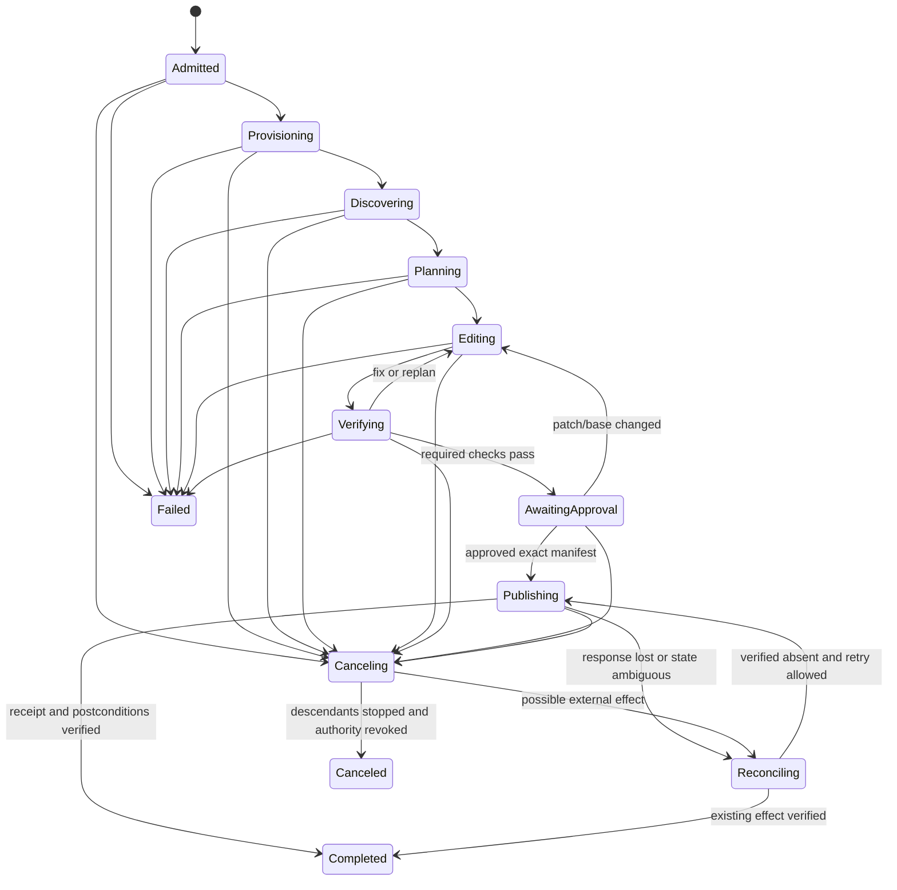
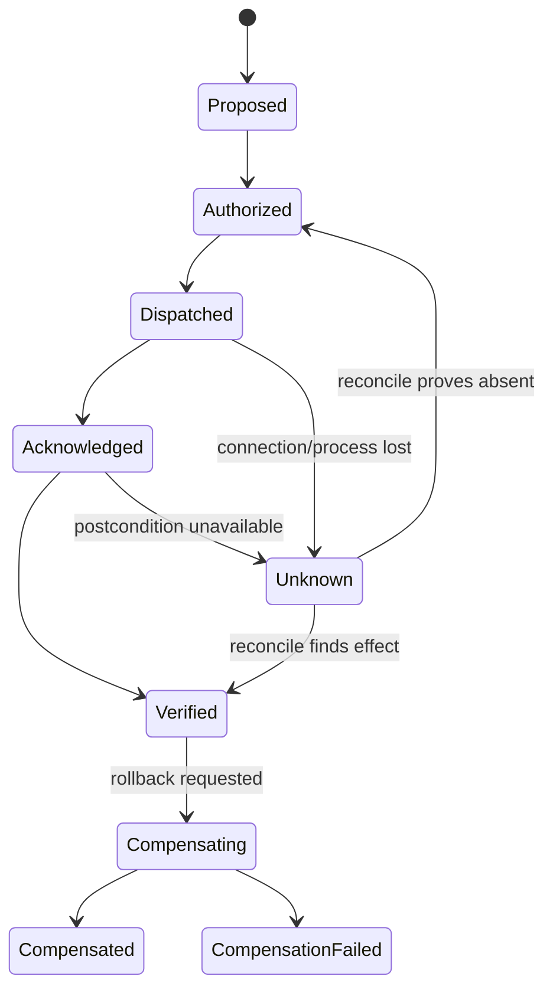

# Reliability, Recovery, and Concurrency

> **Status:** Research-backed production guide  
> **Last researched:** 2026-08-31  
> **Scope:** Run state, leases, retries, idempotency, effect uncertainty, cancellation, crash recovery, Git concurrency, flaky validation, rollback, and operator repair  
> **Evidence:** [Coding-agent blueprint research packet](../../research/packets/coding-agent-blueprint.md)

Reliable coding agents do not rely on a continuous model conversation or process. They preserve authoritative run, workspace, patch, check, approval, and publication state outside the transcript; assume every boundary can fail; and make unfinished or unknown effects visible to reconciliation and operators.

## Run state machine



Persist a state transition with its triggering event, expected prior revision, policy version, actor, timestamps, and referenced artifacts. Use optimistic concurrency or a single-writer controller so two workers cannot advance the same run.

## State ownership

| State | Authority | Recovery use |
|---|---|---|
| Run record | Controller database/event log | Current state, owner/lease, budgets, cancellation, terminal reason |
| Workspace record | Executor/workspace service | Base, revision, location, health, changed paths, cleanup |
| Plan | Versioned application state | Resume work without reconstructing intent from transcript |
| Model context | Context compiler | Disposable projection for next inference |
| Tool/effect ledger | Controller | Attempts, idempotency keys, receipts, unknown outcomes |
| Patch manifest | Patch service/artifact store | Immutable candidate, checks, approvals, publication |
| Check receipts | Verifier | Which patch/environment/test was evaluated |
| Integration receipts | Integration service | Branch/PR/comment/check IDs and postconditions |
| Transcript/events | Observability store | Debug and evaluation, subject to privacy/retention |

Do not call a saved transcript “durable execution.” It may reproduce conversation text while losing a workspace, child process, lease, pending approval, external effect, or the exact bytes that were tested.

## State, event, attempt, and effect contracts

Keep four concepts separate:

| Contract | Meaning | Mutability |
|---|---|---|
| State projection | Current controller view used to admit the next transition | Revisioned compare-and-swap update |
| Event | Immutable fact that a transition, proposal, decision, observation, or receipt occurred | Append only; corrections append superseding events |
| Effect intent | One semantic desired change, such as “publish this patch to this agent branch” | Immutable identity and normalized arguments |
| Effect attempt | One technical dispatch/reconcile/compensate try for that intent | Many attempts may belong to one effect; every attempt retained |

Minimum event shape:

```json
{
  "event_id": "evt_01J...",
  "schema": "coding-agent.event/v1",
  "run_id": "run_01J...",
  "sequence": 87,
  "event_type": "effect.dispatched",
  "occurred_at": "2026-08-31T00:00:00Z",
  "recorded_at": "2026-08-31T00:00:00.041Z",
  "expected_run_revision": 31,
  "actor": "integration-worker:7",
  "causation_id": "evt_policy_allow_12",
  "correlation_id": "effect_publish_9",
  "policy_version": "integration-policy@9",
  "fencing_token": 44,
  "payload": {"attempt_id": "att_2", "operation_id": "op_..."},
  "artifacts": ["artifact://requests/att_2.json"]
}
```

Use database constraints or a transactional outbox so reserving an attempt and recording the dispatch intent cannot diverge silently. State transitions validate the expected run revision and legal prior state. Events are not mutable queue messages; queue delivery IDs are recorded separately and may repeat.

Effect results need both transport/execution and observed-world state:

```yaml
effect_id: effect_publish_9
operation_id: op_...
attempt_id: att_2
attempt_status: timed_out       # request/worker outcome
effect_state: unknown           # proposed|authorized|dispatched|acknowledged|verified|not_committed|unknown|compensating|compensated|compensation_failed
request_digest: sha256:...
dispatched_at: 2026-08-31T00:00:00Z
response_artifact: null
last_observation:
  kind: branch_lookup
  observed_at: 2026-08-31T00:00:15Z
  outcome: unavailable
next_action: reconcile
```

`failed` is not an effect state. A timeout, connection reset, worker loss, or malformed response after dispatch is `unknown` until a trusted read proves the postcondition present or absent.

## Leases and fencing

Every active executor and publisher uses a renewable lease:

```text
lease_id, run_id, owner_worker, workspace_revision,
fencing_token, acquired_at, expires_at, heartbeat_at
```

The monotonically increasing fencing token is checked on all workspace writes and publication requests. After failover, an old worker may still be alive; expiry alone does not stop it from committing a late effect unless the destination rejects stale tokens or its credential has been revoked.

For local embedded mode, the same concept can be a lockfile plus controller process identity and workspace revision, but do not assume a filesystem lock coordinates remote workers.

## Retry taxonomy

| Failure | Retry policy |
|---|---|
| Model transport timeout before response | Retry within request/run budget; record new attempt |
| Provider rate limit | Respect retry hints, jitter/backoff, admission pressure; no model/provider fan-out storm |
| Invalid tool arguments | Return structured correction to model; counts against tool/turn budget |
| Read-only tool transient failure | Retry if operation is truly read-only and bounded |
| Deterministic build/test failure | Do not infrastructure-retry blindly; return evidence for diagnosis |
| Flaky/infrastructure test suspicion | Rerun under a predeclared flake policy; retain every attempt |
| Workspace write with stale revision | Never auto-retry on new content; re-read and replan |
| External publish timeout | Reconcile by stable operation ID before retry |
| Policy denial | Do not retry or escalate model to bypass; require changed facts/authority |
| Sandbox/host lost | Reprovision from checkpoint/base/patch artifact; reconcile unfinished effects first |

Keep independent budgets for model calls, turns, tool calls, correction attempts, command attempts, test reruns, wall time, cost, tokens, patch churn, and publication attempts. Exhausting a limit produces a bounded failure or escalation, never implicit success.

## Effect state and idempotency

Use a semantic operation ID stable across technical retries:

```text
operation_id = hash(
  repository_id,
  run_id,
  operation_kind,
  normalized_destination,
  base_commit,
  patch_digest
)
```



Examples:

- branch creation: `operation_id` maps to a unique branch name; verify ref SHA;
- PR creation: store the code-host idempotency mapping and search by immutable run marker before retry;
- comment/status: include an updateable marker rather than appending duplicates;
- artifact upload: content-address by digest and atomically finalize metadata;
- local patch apply: expected workspace revision makes the write compare-and-swap-like.

Exactly-once is not provided merely by a workflow engine, checkpoint, or retry wrapper. The destination must participate through uniqueness, idempotency keys, conditional writes, transactions, or reconciliation. See [Idempotency and side effects](../../reliability/idempotency-and-side-effects.md).

### Ambiguous-effect reconciliation

Reconciliation is deterministic application work, not another model turn:

```text
fence new dispatches for operation_id
load immutable normalized request and destination identity
query the authoritative destination using provider object ID or unique run marker
if exactly one object satisfies the full postcondition:
    record receipt; mark verified
else if the destination proves absence and retry is still authorized:
    allocate a new attempt_id for the same operation_id; dispatch once
else if multiple or conflicting objects exist:
    block; preserve all object IDs; require operator repair
else:
    remain unknown; back off within reconciliation deadline; alert on breach
```

For a pull request, matching only title or branch name is insufficient. Verify canonical repository, source branch, source SHA/tree, target branch, immutable run marker, actor/integration identity, and expected open/closed state. For a branch update, read the ref and compare its SHA; for a comment or check, use an updateable run marker; for an artifact, verify digest and finalized metadata.

Test these timelines explicitly:

1. request commits and the response is lost;
2. request never reaches the provider;
3. provider accepts asynchronously and the first lookup is empty;
4. duplicate delivery races two attempts;
5. a human creates a look-alike branch/PR;
6. reconcile loses authorization or the base/policy changes;
7. provider returns multiple candidates or stale replicas.

The only safe retry is after **verified absence** under current authorization. If the provider cannot supply a strong absence/read-after-write guarantee, keep the effect unknown or route to operator repair rather than guessing.

## Crash recovery

### Recovery order

1. fence or revoke the old worker and publication authority;
2. inspect the run/event/effect ledger for dispatched or unknown effects;
3. reconcile code-hosting/artifact destinations by operation ID;
4. verify or discard the old workspace; never trust a half-written filesystem blindly;
5. provision a clean workspace at the recorded base;
6. reapply the immutable patch/checkpoint artifact with path and digest validation;
7. restore plan and unresolved facts, not stale hidden process state;
8. rerun checks invalidated by environment or patch changes;
9. continue from the next safe transition under a new fencing token.

### Checkpoint boundaries

| Boundary | Safe persisted material | Resume rule |
|---|---|---|
| After discovery | Inventory/map with base/blob versions | Reuse only if base and tool versions match |
| After edit group | Patch artifact plus workspace revision | Reapply to clean matching base; verify digest |
| After test | Receipt bound to patch/environment/profile | Reuse only if all bindings remain valid |
| Awaiting approval | Exact manifest and facts | Revalidate authorizer access, base, expiry, and digest |
| After publication request | Operation ID and request/response evidence | Reconcile before any retry |

Do not snapshot a live process or container as the sole recovery mechanism. It can preserve expired credentials, sockets, vulnerable state, and nonportable filesystem assumptions.

## Cancellation semantics

Cancellation must define observable guarantees:

1. controller records cancellation intent and stops new model/tool scheduling;
2. publication lease is fenced and all brokered credentials are revoked;
3. executor receives cooperative cancellation, then terminates the process group/container/VM after grace;
4. queue and child-work records are canceled; no detached subtask may publish independently;
5. system verifies executor quiescence or marks it lost/quarantined;
6. pending external operations are reconciled;
7. current patch/logs/receipts are captured if safe and within retention policy;
8. workspace is preserved for incident review or destroyed according to policy;
9. final state reports canceled, partially completed, or unknown effects explicitly.

A language timeout or abort signal is cooperative and does not undo prior file/network effects. Synchronous/native child work can outlive a canceled async task. The execution boundary and commit fence are the reliable controls.

## Workspace concurrency

### Hard rule

One run has one writer to one worktree at a time. Reads can be parallelized from an immutable base; edits are integrated through commits/patches, not concurrent writes to a shared directory.

| Pattern | Safe use | Failure mode to prevent |
|---|---|---|
| Parallel read-only explorers | Separate context; immutable snapshot | Duplicated cost, inconsistent base/version |
| One builder plus read-only reviewer | Reviewer sees immutable patch revision | Reviewer commenting on obsolete diff |
| Parallel builders on disjoint worktrees | Truly independent modules and explicit integration order | Semantic/build conflicts despite file separation |
| Multiple agents in same worktree | Do not use | Races, overwritten edits, untraceable provenance |
| Batch refactor per package | Worktree/branch per shard, deterministic integration queue | Shared generated files, global formatting, conflict explosion |

Git worktrees isolate working directories, not semantic dependencies or repository-wide generated artifacts. Before parallelization, identify shared manifests, lockfiles, schemas, snapshots, migrations, and generators. Serialize those or give one integration owner.

### Base-branch movement

Admission records both the immutable `base_commit` used to produce the patch and the intended mutable `target_ref`. Publication resolves `target_ref` again and uses a conditional ref update or equivalent compare-and-set where the provider supports it. The integration adapter must never convert a stale-base rejection into a force push.

On publication, compare the recorded base with the target branch:

- if unchanged, publish exact patch/tree;
- if changed but merge/rebase is clean, create a new patch revision on the new base, invalidate old approvals/checks as policy requires, and rerun validation;
- if conflicted or behaviorally risky, stop for replan/human resolution;
- never report old check receipts as validation of a rebased tree.

After reintegration, create a new patch revision with explicit lineage (`supersedes_patch_digest`, new base, new head tree). Re-run instruction compilation because path-scoped instructions, ownership, workflows, dependencies, or policy-relevant files may have changed even when Git reports a clean textual rebase. Approval reuse must be a written risk policy; security/protected-path changes should require a new exact approval.

Two runs targeting the same agent branch are a coordination bug. Namespace branches by run, and enforce uniqueness in the integration ledger as well as the code host. Multiple patches for one task become ordered revisions of one run or separate linked runs; they do not race to rewrite one branch.

Protected branches, required checks, reviews, and merge queues remain the final concurrency gate. GitHub's merge queue retests changes against the latest target and queued predecessors, reducing the race between “green PR” and merge ([protected branches](https://docs.github.com/en/repositories/configuring-branches-and-merges-in-your-repository/managing-protected-branches/about-protected-branches)).

## Validation reliability and flaky tests

Classify every check attempt:

```text
PASS | PRODUCT_FAILURE | TEST_FAILURE | INFRA_FAILURE |
TIMEOUT | CANCELED | POLICY_DENIED | INCONCLUSIVE
```

Do not let the model decide alone that a failing test is flaky. Use a predeclared policy:

- compare with pre-edit baseline where available;
- rerun only named failures a bounded number of times in clean processes/environments;
- retain the sequence and timing, not just the last pass;
- quarantine status comes from repository policy, not the agent;
- require deterministic checks to pass on the final patch;
- report inherited and newly introduced failures separately;
- never delete/skip/weaken a test merely to make the suite green without explicit task justification and review;
- verify that tests actually exercised the changed behavior through coverage, mutation, targeted assertion, or a deliberate negative control where appropriate.

## Rollback

### Before publication

Destroy the isolated workspace or discard the agent branch after preserving required evidence. Never “rollback” by resetting a user's shared checkout.

### After branch/PR publication

Update or close the agent PR; retain immutable manifest and receipts. If another run supersedes the patch, link lineage rather than rewriting audit history.

### After merge

Use normal repository recovery: revert the exact merge/commit, create a reviewed fix, disable the feature, or roll back a migration according to application runbooks. Commit signing or agent attribution helps find the change; it does not make automated reversion safe.

### After deployment/effect

Deployment, schema, data, package, and infrastructure rollback belongs to the deployment/change system. The coding agent may prepare a revert patch but should not autonomously operate production unless separately designed and authorized as an infrastructure agent.

## Operator repair

Operators need views/actions for:

- current state, owner lease, base, patch revision, budgets, and last progress;
- running process tree/executor health without attaching credentials;
- pending approvals and why they were invalidated;
- tool/check attempts and raw artifacts with redaction/access controls;
- unknown effects with direct reconciliation links and receipts;
- fence/cancel/quarantine/retry-from-safe-checkpoint;
- publish existing exact manifest, create superseding run, or mark terminal with reason;
- cleanup of orphaned workspaces, branches, tokens, artifacts, and queue leases;
- export an incident bundle without hidden secrets or cross-tenant data.

Every manual repair is an authenticated event. Operators should not mutate database state to “unstick” a run without an application command that preserves invariants.

## Failure-injection matrix

| Injection point | Expected invariant |
|---|---|
| Kill controller after scheduling command | One active executor lease; recovered controller discovers state |
| Kill executor during file write | Clean reapply from last patch artifact; no accepted half-patch |
| Lose network after branch/PR create | Reconciliation finds existing effect; no duplicate |
| Cancel while child test forks descendants | Publication fenced; all descendants stop or executor quarantined |
| Expire approval while queued | Publish denied; approval renewed against current facts |
| Advance base after tests pass | Old receipts rejected for new tree |
| Duplicate webhook/queue delivery | Same run/effect identity; no duplicate work or PR |
| Corrupt patch/check artifact | Digest verification fails closed |
| Worker resumes with stale fencing token | Workspace/integration write rejected |
| Test passes only on rerun | Flake recorded; release gate follows declared policy |
| Artifact store unavailable | Run preserves state and retries within budget; no false completion |

## Reliability checklist

- [ ] Run, workspace, plan, effect, patch, check, approval, and publication state are distinct.
- [ ] State transitions are revision-checked and event-backed.
- [ ] State projections, immutable events, semantic effect intents, and technical attempts have separate versioned contracts.
- [ ] Worker leases use fencing, not heartbeat expiry alone.
- [ ] Retry policy distinguishes correction, transient read, deterministic failure, and unknown effect.
- [ ] External publication uses stable operation IDs and reconciliation.
- [ ] Unknown effects remain fenced until full postconditions prove presence or absence; ambiguous duplicates route to repair.
- [ ] Crash recovery starts by fencing and reconciling, then uses a clean workspace.
- [ ] Cancellation revokes authority and kills the execution boundary, including descendants.
- [ ] One writer owns a worktree; parallel patches integrate through version control.
- [ ] Checks are bound to final patch/environment and flake policy is explicit.
- [ ] Rollback follows Git and deployment change control rather than destructive workspace reset.
- [ ] Operators can repair through audited invariant-preserving actions.

## Selected primary sources

- [Git worktree](https://git-scm.com/docs/git-worktree.html)
- [GitHub protected branches](https://docs.github.com/en/repositories/configuring-branches-and-merges-in-your-repository/managing-protected-branches/about-protected-branches)
- [GitHub coding-agent risks and mitigations](https://docs.github.com/en/copilot/concepts/agents/cloud-agent/risks-and-mitigations)
- [Anthropic: effective harnesses for long-running agents](https://www.anthropic.com/engineering/effective-harnesses-for-long-running-agents)
- [OpenHands Docker runtime architecture](https://docs.openhands.dev/openhands/usage/architecture/runtime)
- [DBOS architecture](https://docs.dbos.dev/architecture)
- [Temporal AI reference architecture](https://go.temporal.io/platform-hub/ai-engineering/ai-reference-architecture)
