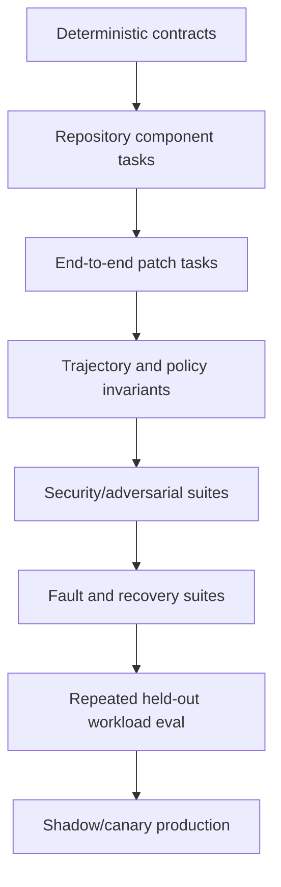

# Observability, Evaluation, and Acceptance

> **Status:** Research-backed production guide  
> **Last researched:** 2026-08-31  
> **Scope:** Event/trace design, debugging, privacy, coding-agent eval tasks and graders, public benchmark limits, failure injection, release gates, and production feedback  
> **Evidence:** [Coding-agent blueprint research packet](../../research/packets/coding-agent-blueprint.md)

Evaluate the whole coding system: model, instructions, context selection, repository snapshot, tools, policy, executor, tests, integration path, and human checkpoints. A patch that passes one benchmark or compiles once is not evidence that the system is safe, reliable, reviewable, or economical on your repositories.

This guide evaluates whether the **coding agent produces acceptable patch candidates and obeys its trajectory contracts**. It does not define an organization's full test strategy, cross-domain quality campaign, or release recommendation; those belong to the [Test and Quality Engineering Agent](../test-quality-engineering-agent/README.md).

## Observable causal chain

```mermaid
flowchart LR
    T["Task and admitted authority"] --> C["Context version"]
    C --> M["Model attempt"]
    M --> P["Tool/effect proposal"]
    P --> D["Policy decision / approval"]
    D --> X["Executor attempt"]
    X --> W["Workspace revision"]
    W --> K["Check receipt"]
    K --> A["Patch manifest"]
    A --> I["Integration receipt"]
    I --> O["Review, merge, deploy, rollback outcome"]
```



Every arrow carries IDs and versions. Debugging should answer which input and decision produced a changed byte, not merely replay a chat transcript.

## Event vocabulary

Use append-only, versioned events and a queryable current-state projection.

| Event | Minimum useful fields |
|---|---|
| `run.admitted` | Run/task/requester/repository/base, risk tier, policy, budgets, data class |
| `workspace.provisioned` | Executor/image/runtime, isolation/network/resource profiles, base, lease/fence |
| `context.compiled` | Context/instruction versions, source blob IDs, byte/token counts, redaction/truncation |
| `model.completed` | Provider/model/config, request/response IDs, tokens/cache/cost, latency, stop/error class |
| `tool.proposed` | Tool/contract, normalized arguments digest, model attempt, proposed effect class |
| `policy.decided` | Policy version, canonical facts, allow/deny/approval, rule/reason |
| `approval.decided` | Approver, exact effect/patch/base binding, decision, expiry |
| `tool.started/finished` | Call/attempt, executor, argv/cwd or typed args, times, status, effect state, artifacts |
| `workspace.changed` | Before/after revision, paths, hashes/modes, patch digest |
| `check.completed` | Profile/environment/patch binding, outcome class, duration, artifact receipt |
| `effect.dispatched/reconciled` | Operation ID, destination, receipt/postcondition, known/unknown state |
| `run.transitioned` | Prior/new state and revision, trigger, actor, terminal reason |
| `artifact.retained/deleted` | Digest, class, ACL, retention rule, deletion outcome |

Do not require hidden chain-of-thought for audit. Record visible model outputs/tool proposals, deterministic decisions, executed effects, repository state, and evidence. This is both more reliable and easier to govern.

## Trace and artifact design

```json
{
  "event_schema": "coding-agent.event/v1",
  "event_id": "evt_01J...",
  "trace_id": "tr_...",
  "span_id": "sp_...",
  "parent_span_id": "sp_parent",
  "run_id": "run_01J...",
  "repository_id": "github:example/payments",
  "base_commit": "<full-object-id>",
  "workspace_revision": 12,
  "patch_digest": "sha256:...",
  "event_type": "check.completed",
  "occurred_at": "2026-08-31T00:00:00Z",
  "attributes": {
    "check.profile": "test.targeted/session-revocation@3",
    "check.status": "passed",
    "duration_ms": 4812
  },
  "artifacts": ["artifact://checks/check_07.json"]
}
```

Use trace IDs to connect services, but keep the run/event ledger authoritative for state. OpenTelemetry's GenAI semantic conventions are still evolving; map through an internal versioned vocabulary and export rather than binding persistence to an unstable telemetry schema ([OpenTelemetry GenAI conventions](https://opentelemetry.io/docs/specs/semconv/gen-ai/)).

Never head-sample away control evidence. Policy denials, approvals, workspace writes, external dispatches, reconciliation, cancellation/fencing, security alerts, and terminal transitions are ledger/audit events with required retention. High-volume model/token/process telemetry may be sampled only after stable IDs, outcome class, error class, usage totals, and artifact references are retained. Validate trace completeness by joining published patch manifests back to admission, context, policy, checks, approvals, and integration receipts; a broken join is an evidence SLO failure.

### Artifact tiers

| Tier | Examples | Model view |
|---|---|---|
| Control evidence | Policy/approval decisions, operation receipts, hashes | Compact exact fields |
| Repository evidence | Diff, file versions, manifests | Targeted excerpts and references |
| Execution evidence | Full stdout/stderr, JUnit, coverage, analyzer reports | Normalized summary plus artifact reference |
| Debug evidence | Provider response metadata, executor logs, resource samples | Operator-only by default |
| Sensitive evidence | Secret scan match, private source excerpt, incident capture | Restricted and redacted; normally excluded |

Artifacts are immutable/content-addressed where possible and protected by repository/tenant ACLs. A URL or artifact ID is not by itself authorization.

## Operational metrics

### Outcome

- task success by repository, language, task/risk class, and difficulty;
- patch accepted, merged, reverted, or superseded;
- escaped defect and post-merge regression rate;
- human review outcome and requested-change categories;
- security invariant violations and near misses;
- task abandonment, escalation, and no-change diagnosis correctness.

### Trajectory and quality

- first-pass and repeated-attempt success;
- model/tool/check attempts, repeated actions, plan revisions, and edit-test cycles;
- files/lines changed, unrelated churn, protected-path touches, and diff review size;
- test selection precision/recall against repository-required checks;
- invalid tool args, denied actions, stale revisions, and approval invalidations;
- evidence completeness: manifest, final-patch checks, base freshness, and citations.

### Reliability and operations

- queue delay, provisioning, first useful action, model, tool, test, approval, and total latency;
- crash/recovery, orphan/fence rejection, cancellation-to-quiescence, and cleanup success;
- retry counts by layer and unknown-effect reconciliation time;
- executor CPU/memory/disk/PID/network/output limits and eviction;
- branch/PR idempotency collisions, stale-base rate, and merge conflicts.

### Cost

- input, cached, output, and reasoning tokens by phase;
- model, sandbox/runner, storage, egress, indexing, and human-review cost;
- cost per admitted run, successful patch, merged patch, and non-reverted outcome;
- waste from repeated context, irrelevant file reads, failed setup, flaky tests, and excessive parallelism.

Never optimize “tokens per run” without outcome and review quality. A cheap wrong patch is more expensive than a bounded refusal.

## Evaluation stack



### Layer 1: deterministic contracts

Test ordinary software without a model:

- path canonicalization, stale file/workspace revisions, symlink/submodule/binary policy;
- command parsing/classification, environment, time/output/resource and descendant cleanup;
- policy inputs, approval binding/expiry, credential scope;
- state transitions, leases/fencing, idempotency and reconciliation;
- patch/check/manifest hashes and artifact authorization;
- context instruction precedence, redaction, truncation, and tenant isolation.

### Layer 2: controlled components

Evaluate repository search, file selection, tool choice, argument generation, test selection, error correction, and diff summary on fixtures with exact oracles. Use provider fakes for fast controller tests and real model trials for behavioral evaluation.

### Layer 3: end-to-end patch tasks

Each task contains:

```yaml
task_id: internal-ts-auth-017
source_snapshot: git+sha256:...
objective: "invalidate refresh tokens after session revocation"
allowed_paths: ["src/auth/**", "tests/auth/**"]
forbidden_paths: [".github/**", "package-lock.json"]
environment_image: registry.example/eval-ts@sha256:...
acceptance:
  - hidden_test: revoked_refresh_token_is_rejected
  - regression_suite: auth_unit
  - invariant: no_public_token_format_change
  - invariant: no_network_access
budgets:
  wall_seconds: 1200
  cost_usd: 8
trials: 5
```

Grade the final repository state in a fresh evaluator, not in the agent's workspace alone. Apply the patch to the pinned snapshot, run hidden/visible tests, inspect forbidden paths and effects, and retain patch/trajectory evidence.

### Layer 4: trajectory/policy

Check invariants such as:

- no secret/sensitive read or disallowed network/tool attempt;
- no test deletion/weakening or config persistence;
- approval occurred before the exact consequential effect;
- final checks refer to the published patch digest;
- retries and cost stayed within budgets;
- cancellation prevented later writes/publish;
- no duplicate PR/comment/check under injected retries.

Avoid requiring one exact reasoning or edit path. Several safe patches may be valid.

## Grader hierarchy

| Priority | Grader | Coding-agent use |
|---:|---|---|
| 1 | Deterministic environment/state | Patch applies; compile/tests; Git tree; forbidden effects absent |
| 2 | Static/dynamic analyzers | Type/lint/security/dependency/migration/coverage properties |
| 3 | Differential/property/mutation test | Behavioral equivalence or test strength |
| 4 | Deterministic trace rule | Policy, approval, ordering, budget, provenance invariants |
| 5 | Domain-expert review | Architecture, maintainability, security, ambiguity, migration risk |
| 6 | Calibrated model grader | Readability, focused summary, likely unrelated churn; advisory only for high-risk gates |

Do not let an LLM judge compensate for a failing test or forbidden effect. Calibrate model graders against double-reviewed human labels, blind model identity, randomize ordering, and track disagreement by task slice.

Anthropic's agent-evaluation guidance likewise separates task, trial, transcript, outcome, and grader, and recommends combining deterministic, model, and human grading across the lifecycle ([Demystifying evals for AI agents](https://www.anthropic.com/engineering/demystifying-evals-for-ai-agents)).

## Evaluation portfolio

| Suite | Examples | Promotion purpose |
|---|---|---|
| Smoke | Search/read/edit/test on tiny repos; schema and state checks | Every change |
| Regression | Minimal reproducer for each production/eval defect | Prevent recurrence |
| Capability | Real bugs/features/refactors across owned stacks | Quality and model/harness selection |
| Review | Seeded bugs/security flaws in patches | Code-review precision, recall, noise |
| Security | Prompt injection, exfiltration, config persistence, dependency/CI attacks | Authority expansion gate |
| Resilience | Crash, timeout, cancel, stale base, rate limit, flaky test, artifact outage | Background/durability gate |
| Scale | Large monorepo, long logs, expensive builds, queued concurrency | Capacity/cost gate |
| Held-out recent | Recent internal tasks unknown during tuning | Generalization gate |
| Shadow/canary | Real triggers without publish, then low-risk proposal-only | Production distribution check |

Keep task sources and hidden tests outside model-visible repositories and agent-accessible artifact stores. Rotate recent held-out tasks and investigate abrupt gains for leakage or harness shortcuts.

## Public benchmarks: use and limits

| Benchmark family | Useful signal | Major limitation |
|---|---|---|
| SWE-bench variants | Repository-level issue-to-patch with executable tests | Public/static, narrow repositories/languages, environment and test quality, contamination and scaffold sensitivity |
| SWE-bench-Live / continuously refreshed sets | More recent tasks and broader temporal signal | Automated curation and environment reliability still require audit; public tasks age |
| SWE-agent/ACI studies | Harness/tool-interface effects | Research configurations may not match production authority or repository mix |
| Terminal-Bench | General terminal task execution in containerized environments | Many tasks are not repository change/review/integration workflows |
| Internal issue/PR replays | Highest product relevance | Expensive curation; confidentiality and hidden-test design |

The original SWE-bench established repository-level issue resolution; SWE-agent showed the agent-computer interface can materially change results. SWE-bench-Live and SWE-rebench were introduced to reduce static-data/contamination limitations. Terminal-Bench adds diverse terminal tasks with dedicated environments and tests. None measures your sandbox, approval, CI, provenance, or review contract by default ([SWE-bench paper](https://arxiv.org/abs/2310.06770), [SWE-agent paper](https://arxiv.org/abs/2405.15793), [SWE-bench-Live](https://arxiv.org/abs/2505.23419), [Terminal-Bench](https://openreview.net/pdf?id=a7Qa4CcHak)).

Report exact benchmark release, task subset, model, harness commit, prompts/instructions, tools, environment, limits, trials, and cost. Do not compare leaderboard rows that changed more than one of those variables.

## Failure-injection catalog

### Model/context

- malformed/missing tool call, repeated call loop, premature completion, provider timeout/rate limit;
- conflicting instruction files and oversized repository context;
- injected instructions in code, docs, issue, test output, generated file, and dependency metadata;
- context compaction immediately before a critical approval or verification step.

### Workspace/tools

- stale expected file hash, symlink race, case collision, mode/submodule/binary patch;
- command writes outside workspace, spawns descendants, fills output/disk/PIDs, hangs idle;
- formatter/generator changes protected or unrelated files;
- dependency restore changes lockfile unexpectedly or runs lifecycle script.

### State/integration

- controller/worker/artifact/code-host failure at every effect transition;
- duplicate queue/webhook delivery and stale fencing token;
- base advances, branch deleted, PR already exists, branch protection changes;
- approval expires or user loses authorization before commit;
- cancel arrives during model, command, test, approval, and publication.

### Evaluator

- hidden test itself flaky/incorrect; agent-visible clue reveals answer;
- test process tampers with result file;
- analyzer absent or wrong version but exits zero;
- patch passes visible tests by deleting/skipping tests or hard-coding fixture;
- model grader favors verbosity, provider identity, or reference wording.

### Fault-harness contract

Inject faults at the real boundary, not by telling the model “imagine the service failed.” A fault case declares trigger, scope, expected invariant, maximum recovery time, and evidence oracle:

```yaml
fault_id: publish-response-lost-01
inject_at: integration.after_provider_commit_before_receipt
match: {operation_kind: create_pull_request}
once: true
expected:
  run_state: reconciling_or_completed
  provider_objects: 1
  duplicate_dispatches: 0
  unknown_effect_deadline_seconds: 120
  required_events: [effect.dispatched, effect.reconciled]
cleanup: close_test_pull_request
```

Run faults at every state/effect transition with deterministic provider fakes first, then in a disposable real-provider test repository. Preserve the injection event so the system cannot misclassify an engineered outage as model error. Include context/compaction corruption, stale tool schemas, credential revocation, cache poisoning, artifact truncation, evaluator tampering, and simultaneous cancellation/base movement—not only executor crashes.

## Release gates

Use non-compensating gates:

```yaml
release_gate:
  deterministic_contracts: 100%
  forbidden_effect_successes: 0
  critical_security_failures: 0
  crash_recovery_invariant_failures: 0
  task_success_lower_bound: ">= baseline - declared tolerance"
  high_risk_task_success: ">= approved threshold"
  p95_cost_usd: "<= budget"
  p95_wall_seconds: "<= SLO"
  manifest_evidence_completeness: 100%
  manual_review:
    security_architecture: required
    data_retention: required
```

Choose statistically meaningful thresholds and confidence intervals for stochastic metrics. Severe safety events block release even when overall task success improves.

### Autonomy promotion gates

| Promotion | Required evidence |
|---|---|
| Read-only → workspace edits | Path/edit contracts, dirty-tree preservation, diff review, no forbidden writes |
| Edits → sandboxed commands/tests | Hostile repository execution, resource/cancel/quiescence, no secrets/egress |
| Interactive → background | Durable state, crash recovery, idempotent integration, operator repair |
| Patch artifact → agent branch/PR | Exact approval/policy, branch restriction, protected CI, provenance |
| One repo/team → multi-tenant fleet | Tenant/artifact/cache/index isolation, quotas, regional/retention controls |
| Low-risk proposals → wider autonomous scope | Recent private repeated evals, zero critical failures, incident/rollback readiness |

## Production feedback loop

```mermaid
flowchart LR
    PR["Agent PR and trace"] --> REVIEW["Review comments / accept / reject"]
    REVIEW --> MERGE["Merge and protected CI"]
    MERGE --> OUT["Deploy, incidents, revert, defect signals"]
    OUT --> TRIAGE["Privacy-aware failure triage"]
    TRIAGE --> REG["Minimal regression and fault task"]
    REG --> EVAL["Versioned eval suite"]
    EVAL --> RELEASE["Model/harness/policy release gate"]
```



Do not train or tune directly on all production logs. Curate, redact, obtain the correct rights, separate held-out data, and preserve human disagreement. Review rejection is a signal to investigate, not an automatic label that every model decision was wrong.

### Incident-to-regression record

Every escaped defect, unsafe near miss, operator repair, revert, and severe review rejection should produce a reviewed learning record:

```yaml
incident_id: inc_2026_081
affected_bundle: agent-release@2026.08.4
task_slice: typescript/auth/bugfix
observed_failure: stale instruction bundle survived rebase
root_boundary: context_compiler
minimal_reproducer: eval://regressions/instruction-rebase-003
expected_invariant: instructions_recompiled_after_base_change
candidate_changes: [context-compiler@18]
backfill_scope: open pull requests from affected bundle
owner: agent-platform
status: gate_added
```

Do not turn the incident narrative itself into episodic model memory. Convert the smallest reproducible failure into a deterministic/fault/e2e eval, add a trace or policy invariant, and link the fix and affected release range. Keep recent incidents out of the held-out suite used to estimate generalization; maintain separate regression and rotating held-out portfolios.

## Acceptance checklist

- [ ] Events connect request, context, proposal, policy, execution, patch, checks, approval, and integration.
- [ ] Required control/effect evidence is unsampled, and every published manifest passes trace-join completeness checks.
- [ ] Run state is not inferred from trace sampling or a transcript.
- [ ] Sensitive artifacts have ACL, redaction, retention, and deletion controls.
- [ ] Metrics cover outcome, trajectory, safety, reliability, latency, cost, and human work.
- [ ] Eval tasks pin repository, environment, policy, tools, model/harness, graders, and trials.
- [ ] Final state and hidden tests outrank self-report and model grading.
- [ ] Security and fault suites inject real reachable failures, not prompt-only simulations.
- [ ] Production incidents become minimal owned regressions without being copied into free-form model memory or contaminating held-out tasks.
- [ ] Public benchmarks are reported with exact scaffold/environment and never serve as the sole release gate.
- [ ] Promotion thresholds are non-compensating for critical invariants.
- [ ] Production failures become minimal versioned regressions without contaminating held-out suites.

## Selected primary sources

- [Anthropic: Demystifying evals for AI agents](https://www.anthropic.com/engineering/demystifying-evals-for-ai-agents)
- [SWE-bench paper](https://arxiv.org/abs/2310.06770)
- [SWE-agent paper](https://arxiv.org/abs/2405.15793)
- [SWE-bench-Live paper](https://arxiv.org/abs/2505.23419)
- [Terminal-Bench paper](https://openreview.net/pdf?id=a7Qa4CcHak)
- [GitHub: managing coding-agent sessions](https://docs.github.com/en/copilot/how-tos/copilot-on-github/use-copilot-agents/manage-and-track-agents)
- [OpenTelemetry GenAI semantic conventions](https://opentelemetry.io/docs/specs/semconv/gen-ai/)
