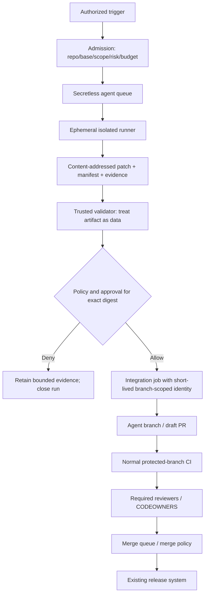
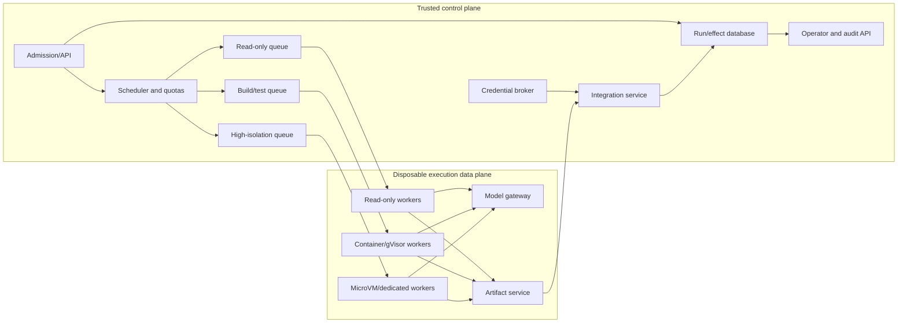

# CI, Deployment, Operations, and Economics

> **Status:** Research-backed operations guide  
> **Last researched:** 2026-08-31  
> **Scope:** CI/background integration, service deployment, queues, workers, caches, SLOs, capacity, cost, rollout, and incident response  
> **Evidence:** [Coding-agent blueprint research packet](../../research/packets/coding-agent-blueprint.md)

Background coding agents should enter the delivery system as untrusted patch producers, not privileged CI jobs. Keep agent execution secretless and isolated; publish only through a narrow integration service; then rely on normal branch protection, required checks, code ownership, merge queues, release systems, and incident processes.

“Deployment” in this guide means deploying and operating the **coding-agent service** and connecting it to CI. Application release promotion, rollout observation, environment mutation, and production rollback remain with the delivery platform or the [DevOps and Deployment Agent](../devops-deployment-agent/README.md). Independent cross-domain test campaigns and release-quality recommendations remain with the [Test and Quality Engineering Agent](../test-quality-engineering-agent/README.md); this guide only covers patch-local checks and protected-branch CI handoff.

## CI integration patterns

| Pattern | Use | Security position |
|---|---|---|
| Read-only review/check | Comment or status on an existing diff | Read token only; no checkout execution with secrets; findings are advisory or a required check |
| Manual background task | Authorized user asks for a patch | Ephemeral workspace; one agent branch/draft PR; human merge |
| Issue-driven patch | Trusted/write-authorized issue assignment | Treat issue text and repo as untrusted; restrict trigger identity and branch |
| Scheduled maintenance | Dependency/docs/test updates | Predeclared repositories/tools/paths; deterministic safe output; quota and review |
| Event-driven agentic workflow | Triage, label, comment, or bounded PR proposal | Read-only by default; allowlisted output types; no arbitrary token in model runtime |
| Privileged deploy/release | Not an ordinary coding-agent pattern | Hand off reviewed merge artifact to existing deployment/change control |

GitHub's current agentic-workflow design uses read-only defaults, declared safe outputs, and keeps secrets outside the agent runtime. Its cloud coding agent similarly restricts work to one branch/PR and human review. These are strong design examples even when the implementation uses another code host or orchestrator ([GitHub Agentic Workflows](https://docs.github.com/en/copilot/concepts/agents/about-github-agentic-workflows), [coding-agent risks and mitigations](https://docs.github.com/en/copilot/concepts/agents/cloud-agent/risks-and-mitigations)).

## SCM and CI adapter contract

Do not encode GitHub nouns in the controller. Normalize provider concepts, then keep provider-specific policy and receipts in the adapter.

| Internal capability | GitHub example | GitLab example | Bitbucket example | Required postcondition |
|---|---|---|---|---|
| Resolve repository/ref | Repository + ref API | Project + repository branches API | Repository + refs API | Canonical repo ID and full SHA |
| Publish candidate | Agent branch + draft pull request | Agent branch + draft merge request | Agent branch + draft pull request | Source SHA/tree and target ref match manifest |
| Attach/update evidence | Check run/status/comment | Pipeline/status check/note | Commit status/comment | Provider object ID plus patch/head binding |
| Read merge policy | Ruleset/protected branch/CODEOWNERS | Protected-branch/approval rules | Branch restrictions/merge checks | Effective current policy captured, not inferred from name |
| Observe CI | Workflow/check suite | Pipeline/jobs | Pipeline/commit statuses | Terminal normalized outcome tied to head SHA |

Provider differences are security-relevant. GitLab documents that multiple matching branch-protection rules can be combined permissively for most settings, while Bitbucket exposes branch restrictions and merge checks with its own precedence and plan constraints. Query effective policy and test the actual installation; do not map a generic boolean `protected=true` to a portable guarantee ([GitLab protected branches](https://docs.gitlab.com/user/project/repository/branches/protected/), [Bitbucket branch permissions](https://support.atlassian.com/bitbucket-cloud/docs/use-branch-permissions/)).

Version the adapter capability declaration:

```yaml
provider: gitlab
adapter_version: 3.4.1
instance: gitlab.example.com
capabilities:
  draft_change_request: true
  conditional_ref_update: tested
  native_idempotency_key: unsupported_or_unverified
  lookup_by_source_branch: true
  head_sha_in_change_request: true
  effective_branch_policy_query: partial
  ci_status_bound_to_sha: true
limits_observed_at: 2026-08-31T00:00:00Z
limitations:
  - group/project protection rules require independent effective-policy check
```

At admission, fail closed when a required capability is absent or unknown. At dispatch, store raw request/response artifacts and provider request IDs. After dispatch, independently read the branch/change request/status and verify canonical repository, actor, source/target, head SHA, run marker, and state. GitLab notes that some merge-request diff fields populate asynchronously; adapters must tolerate documented eventual consistency without treating an initially incomplete response as failure ([GitLab merge-request API](https://docs.gitlab.com/api/merge_requests/)). Bitbucket's API likewise separates pull-request creation, retrieval, conflicts, statuses, and asynchronous merge-task status, illustrating why create responses and final postconditions are distinct ([Bitbucket pull-request API](https://developer.atlassian.com/cloud/bitbucket/rest/api-group-pullrequests/)).

Run provider conformance tests in disposable organizations/projects for wrong repo, protected target, stale SHA, duplicate create, lost response, async visibility, changed policy, revoked token, pagination, rate limit, webhook replay, branch deletion, and manual look-alike objects. The controller consumes only the normalized result plus immutable provider receipt.

## Split untrusted production from privileged integration



The validator must re-resolve base/repository, verify the manifest and patch digest, reject unsafe paths/types/modes, and verify approval before the integration job receives a token. It must not execute the agent checkout while privileged.

## Illustrative GitHub Actions shape

This is an architecture skeleton, not a copy-paste integration; replace the trusted runner commands with the project's pinned implementation. The important property is that the first job cannot push or access secrets, while the second receives only the exact validated artifact through an approved environment.

```yaml
name: coding-agent-proposal

on:
  workflow_dispatch:
    inputs:
      task:
        required: true
        type: string

permissions:
  contents: read

jobs:
  propose:
    runs-on: ubuntu-latest
    permissions:
      contents: read
    timeout-minutes: 30
    steps:
      - uses: actions/checkout@<pinned-commit-sha>
        with:
          persist-credentials: false
      - name: Produce secretless patch artifact
        run: >-
          ./trusted/agent-runner propose
          --task-file "$RUNNER_TEMP/task.txt"
          --network-profile none
          --output "$RUNNER_TEMP/proposal"
      - name: Upload proposal
        uses: actions/upload-artifact@<pinned-commit-sha>
        with:
          name: agent-proposal-${{ github.run_id }}
          path: ${{ runner.temp }}/proposal

  integrate:
    needs: propose
    runs-on: ubuntu-latest
    environment: coding-agent-integration
    permissions:
      contents: write
      pull-requests: write
    steps:
      - name: Download untrusted proposal as data
        uses: actions/download-artifact@<pinned-commit-sha>
        with:
          name: agent-proposal-${{ github.run_id }}
          path: ${{ runner.temp }}/proposal
      - name: Validate manifest, base, policy, and approval
        run: >-
          ./trusted/integration-gate verify-and-publish
          --proposal "$RUNNER_TEMP/proposal"
          --operation-id "${{ github.repository }}:${{ github.run_id }}"
```

Important hardening beyond this skeleton:

- write task input to a file without interpolating it into shell code;
- pin all actions and images to immutable revisions/digests and review transitive behavior;
- protect `trusted/`, workflow, CODEOWNERS/ruleset, and environment configuration;
- use an ephemeral isolated runner for repository-controlled execution;
- ensure the integration environment's reviewers cannot be bypassed by the requester when separation is required;
- issue a GitHub App installation token scoped to one repository/branch operation inside the trusted gate rather than exposing a general token to the job;
- validate downloaded artifacts by content and schema; a prior job controls their bytes;
- rerun normal CI on the published tree; do not promote the proposal job's receipts as trusted branch checks automatically.

Avoid privileged `pull_request_target`, `workflow_run`, issue-comment, or similar jobs that fetch and execute attacker-controlled code. GitHub's security guidance documents how this creates pwn-request and artifact trust failures ([secure `pull_request_target`](https://docs.github.com/en/actions/reference/security/securely-using-pull_request_target), [Actions secure use](https://docs.github.com/en/actions/reference/security/secure-use)).

## Background service deployment



### Control-plane responsibilities

- authenticated admission, repository access check, risk classification, quotas, and policy version;
- durable run/effect/approval state, leases/fencing, cancellation, and recovery;
- queue routing by trust, language/toolchain, resource, region, and isolation;
- provider/model gateway, budget enforcement, rate-limit shaping, and usage accounting;
- artifact metadata/ACL/retention and immutable patch manifests;
- separate integration and credential-broker services;
- operator repair, audit export, release config, and incident controls.

### Worker responsibilities

- provision a pinned clean executor image and repository snapshot;
- apply filesystem/network/resource/credential profiles before any repository code executes;
- run the versioned harness/tool contracts and emit causal events;
- upload artifacts through run-scoped write-only authority;
- respond to fencing/cancellation and verify descendant cleanup;
- destroy workspace and credentials after capture or quarantine.

Workers should not hold database administration, cross-repository artifact read, code-host organization administration, or reusable provider secrets. The model gateway can accept run-scoped authenticated requests and keep provider keys out of sandboxes.

## Queueing and admission

Use separate queues/pools for:

- read-only discovery/review;
- ordinary builds/tests by language/toolchain;
- browser/emulator/GPU or high-memory work;
- untrusted/high-isolation repositories;
- long-running or approval-waiting workflows;
- privileged integration effects.

Admission considers:

```text
organization/repository concurrency
requester and automation quotas
estimated model token/cost budget
executor CPU/memory/disk/PID/time class
toolchain/image availability
repository size and clone/cache estimate
provider and code-host rate limits
risk/isolation and region/data residency
```

Do not let one monorepo or automated trigger consume all model and executor capacity. Use weighted fair sharing, per-tenant concurrency, queue deadlines, maximum parallel attempts, and cancellation of superseded runs. Backpressure should reject or defer new work before runners or provider APIs collapse.

## Caches and warm pools

Caches improve latency and cost but cross run/trust boundaries.

| Cache | Safe design |
|---|---|
| Git objects | Read-only or content-addressed mirror; verify requested object; no working-tree reuse |
| Dependency artifacts | Registry-scoped content-addressed cache; integrity verification; separate trust domains |
| Build cache | Namespace by repository/base/toolchain and trust; untrusted writes never feed privileged builds without verification |
| Container/microVM image | Pinned digest, vulnerability/patch policy, provenance, controlled warm pool |
| Repository index | Tenant/repo/base/blob scoped; ACL on every query; invalidate by content/version |
| Model prompt cache | Provider-specific privacy and keying; never assume tenant isolation without contract |

Warm sandboxes must be reinitialized to a known snapshot, with no prior filesystem, process, environment, credentials, network connections, or tenant data. If complete reset cannot be verified, destroy rather than recycle.

## SLO model

Define separate SLOs for interactive and queued paths.

| SLI | Example objective | Notes |
|---|---|---|
| Admission availability | 99.9% monthly | Does not imply model/provider availability |
| Queue delay | p95 < 2 min ordinary tasks | Slice by isolation/resource class |
| Time to first useful evidence | p95 < 90 s background | Prefer discovery/status over cosmetic commentary |
| Run terminal-state durability | 99.99% no lost acknowledged transition | Database/event and recovery invariant |
| Cancellation to publication fence | p99 < 2 s | Safety SLI separate from process quiescence |
| Cancellation to executor quiescence | p99 < 30 s | Quarantine on failure |
| Integration duplication | 0 duplicate branches/PRs per operation ID | Hard invariant |
| Evidence completeness | 100% published patches have valid manifests | Hard gate |
| Workspace cleanup | > 99.99%, all failures alerted/quarantined | Include tokens/leases/artifacts |
| Task success/merge | Product baseline by slice | Not an infrastructure SLO alone |

Track provider, code-host, registry, artifact, queue, executor, and integration dependencies separately. A run can be product-failed while the platform is healthy, or infrastructure-failed while the model did nothing wrong.

## Capacity model

For executor class `c`:

```text
required_concurrency_c ≈ arrival_rate_c × mean_service_time_c × headroom_c
```

Then constrain by CPU, memory, disk I/O, network/registry, model request concurrency, and code-host rate limits. Mean alone is misleading for test/build tails; size pools from percentiles and simulate bursts, retries, and cancellations.

Important workload multipliers:

- repository clone and dependency-restore size;
- test/build duration and flake reruns;
- context/tool-result volume;
- model reasoning level and sequential tool round trips;
- number of parallel agents/worktrees;
- high-isolation cold start and image size;
- approval waits if workers are held instead of checkpointed/released.

Release executor resources while awaiting human approval. Persist patch/manifest state and reprovision only if a new patch revision is needed.

## Cost model and controls

```text
cost_per_accepted_patch =
  (model_input + model_cache + model_output + model_tool fees)
  + executor_compute + storage + egress + indexing
  + CI/review/retry/incident labor
  divided by accepted non-reverted patches
```

### Controls that usually preserve quality

- staged repository discovery and targeted context rather than full-tree loading;
- compact command/test projections with raw artifacts outside context;
- reuse of pinned repository maps by blob/base version;
- fast targeted checks during iteration, full required checks once on final patch;
- trusted prebuilt toolchain images and content-addressed dependency caches;
- model tier/routing based on validated task class and escalation rule;
- stop on repeated identical actions, no-progress edits, or exhausted hypothesis budget;
- deduplicate identical triggers and cancel superseded runs;
- checkpoint/release resources during approval waits;
- one primary agent; parallelize only independent measured bottlenecks.

### Controls that often damage quality or safety

- truncating context/logs silently;
- choosing the cheapest model without slice/reliability gates;
- skipping final-patch tests because an earlier revision passed;
- sharing mutable caches/workspaces across untrusted runs;
- reducing approvals by giving broader credentials instead of better containment;
- running many agents to reduce wall time while multiplying conflicts and tokens;
- hiding infrastructure/test failures as model task failures.

## Release and upgrade process

Version as one release unit:

- controller, policy bundle, tool contracts, context compiler, harness instructions;
- provider adapter and exact default models/settings;
- executor images, sandbox/network/resource profiles;
- repository/integration adapters and patch manifest schema;
- eval suites/graders and observability schema.

Promotion path:

1. contract and sandbox tests;
2. offline repeated evaluation against current production baseline;
3. shadow runs with no workspace or publication effects;
4. canary organizations/repositories and low-risk patch proposals;
5. gradual traffic/risk-tier expansion with automatic rollback triggers;
6. full rollout while retaining previous compatible controller/executor versions for active runs.

Pin dependencies/models where supported. If a provider alias moves, record the actual resolved model/version in every run and treat the change as a release signal.

### Upgrade contract

Treat every behavior-bearing change as an agent release even when no application code changed:

| Change | Minimum targeted gates | Rollback concern |
|---|---|---|
| Model or reasoning setting | Repeated capability, refusal, tool-choice, injection, cost/latency, and long-context slices | Provider may retire old model; keep a tested alternate route |
| System prompt/instructions | Instruction-conflict, scope, completion, regression, and token-budget ablations | Active runs must retain original prompt digest |
| Context/compaction/retrieval | Required-evidence recall, stale/poisoned rejection, repeated compaction, resume/model migration | Checkpoint schema and raw lineage compatibility |
| Tool schema/description | Contract tests plus real model tool-selection/argument evals; security effect reclassification | Old model outputs may not validate against new schema |
| MCP/plugin/IDE/SCM/CI adapter | Server/release provenance, schema diff, auth, ambiguity, rate/pagination and conformance suite | Disable component independently; preserve provider receipts |
| Sandbox/image/dependency | Escape/exfiltration/resource/toolchain compatibility and supply-chain verification | Image rollback must not reintroduce a known vulnerability |
| Policy/approval/effect schema | Deterministic migration, old/new decision diff, stale approval and reconciliation tests | Never reinterpret an old approval under a new policy silently |

An active run is pinned to a compatible release bundle. Resume it on that bundle, or perform an explicit migration that reads old state, fences effects, reconciles unknowns, revalidates authority/approval, creates a new context checkpoint, and emits `run.migrated`. Never replay historical tool calls to reconstruct state.

Canaries need automatic stop/rollback conditions by slice: any forbidden effect, manifest/trace incompleteness, reconciliation duplication, sandbox invariant failure, statistically significant accepted-outcome regression, review-noise spike, or cost/latency error-budget breach. Roll back new admissions first; do not kill safe active runs merely to make dashboards converge. Review open patches produced by a bad bundle and backfill incident scope.

Anthropic's managed-agent architecture explicitly notes that harness assumptions can become stale as models improve. The operational conclusion is to keep tool/state interfaces stable, but continuously re-evaluate and simplify prompt/harness behavior rather than accumulating permanent compensating instructions ([managed-agent architecture](https://www.anthropic.com/engineering/managed-agents)).

## Incident response

Prepare runbooks for:

| Incident | Immediate actions |
|---|---|
| Suspected secret/source exfiltration | Disable egress/integration, revoke tokens, quarantine runs/workers, preserve scoped evidence, rotate affected credentials |
| Sandbox escape/host compromise | Drain host/pool, revoke all resident authority, isolate network, snapshot per forensics policy, patch/rebuild from trusted image |
| Malicious harness/config/dependency | Disable version, block digest/package, find affected runs/artifacts/patches, revoke/rollback, attest replacement |
| Duplicate/wrong-branch publication | Fence integration, reconcile operations, close/revert exact effects, fix idempotency/policy regression |
| Cross-tenant data leak | Stop affected service, revoke artifact/index access, preserve audit, identify scope, follow privacy/legal notification process |
| Model/harness quality regression | Route back/disable release, cancel unsafe queued work, re-evaluate published open PRs, add regressions |
| CI privileged execution exposure | Disable workflow/event, revoke Actions/app secrets, inspect runner/cache/artifacts, rebuild trusted state |

Incident bundles should contain versioned configuration, causal events, manifest/hashes, policy/approval, executor/host identity, network decisions, credential issuance/revocation, artifacts, and integration receipts. Avoid broad exports that create a second data leak.

## Operations checklist

- [ ] Agent execution and privileged integration are separate jobs/services and identities.
- [ ] CI triggers are authenticated/risk-classified; untrusted text never becomes shell syntax.
- [ ] Queues isolate trust/resource classes and enforce tenant fairness/backpressure.
- [ ] Workers are disposable, least-privileged, and unable to read other runs or reusable credentials.
- [ ] Caches and warm pools are content-addressed, scoped, verified, and reset between tenants.
- [ ] SLOs cover durable state, fencing, quiescence, idempotency, evidence, and cleanup—not only uptime.
- [ ] Capacity includes build/test tails, retries, provider/code-host limits, and isolation cold starts.
- [ ] Cost is measured per accepted non-reverted outcome with human/incident cost.
- [ ] Release units pin model/harness/policy/executor/eval versions and can roll back.
- [ ] Model, prompt, context, compaction, tool, adapter, image, and policy changes have targeted gates, active-run compatibility, canary stops, and incident backfill.
- [ ] Exfiltration, escape, integration, quality, tenancy, and CI incident runbooks are tested.

## Selected primary sources

- [GitHub Agentic Workflows](https://docs.github.com/en/copilot/concepts/agents/about-github-agentic-workflows)
- [GitHub cloud coding-agent risks and mitigations](https://docs.github.com/en/copilot/concepts/agents/cloud-agent/risks-and-mitigations)
- [GitHub: secure use of Actions](https://docs.github.com/en/actions/reference/security/secure-use)
- [GitHub: protected branches and merge queues](https://docs.github.com/en/repositories/configuring-branches-and-merges-in-your-repository/managing-protected-branches/about-protected-branches)
- [GitLab protected branches](https://docs.gitlab.com/user/project/repository/branches/protected/)
- [GitLab merge-request API](https://docs.gitlab.com/api/merge_requests/)
- [Bitbucket pull-request API](https://developer.atlassian.com/cloud/bitbucket/rest/api-group-pullrequests/)
- [Bitbucket branch permissions](https://support.atlassian.com/bitbucket-cloud/docs/use-branch-permissions/)
- [GitHub artifact attestations](https://docs.github.com/en/actions/how-tos/secure-your-work/use-artifact-attestations/use-artifact-attestations)
- [SLSA build provenance](https://github.com/slsa-framework/slsa/blob/main/spec/build-provenance.md)
- [Firecracker production host setup](https://github.com/firecracker-microvm/firecracker/blob/main/docs/prod-host-setup.md)
- [Anthropic: scaling managed agents](https://www.anthropic.com/engineering/managed-agents)
