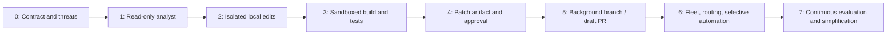

# Build Roadmap and Reference Contracts

> **Status:** Research-backed implementation blueprint  
> **Last researched:** 2026-08-31  
> **Scope:** Minimum production path, promotion gates, component ownership, portable schemas/pseudocode, and custom-framework-hybrid alternatives  
> **Evidence:** [Coding-agent blueprint research packet](../../research/packets/coding-agent-blueprint.md)

Build capability in risk order. A read-only repository analyst with strong evaluation is a useful first product and creates the discovery, context, policy, and trace foundations for later mutation. Do not begin with autonomous PR creation, multi-agent coordination, or a sandbox fleet before the single-run contracts work.

## Product maturity ladder

The phases below are engineering increments. Use this ladder to decide what users receive and when to stop:

| Product stage | Minimum useful capability | Proof before advancing | Stop here when |
|---|---|---|---|
| Deterministic alternative | Search/index, compiler diagnostics, codemods, formatters, dependency bots, fixed CI/test selection | Known inputs and rules complete the task without a model | Interpretation or open-ended repository reasoning is not required |
| Read-only adoption | Explain code, locate owners/tests, review diffs, diagnose failures with cited blob evidence | No out-of-scope/sensitive reads; private diagnosis/review eval beats the existing workflow | Users need insight, not changes |
| Useful MVP | One interactive user, one trusted repository/worktree, atomic bounded edits, diff preview, targeted sandboxed checks, no remote publication | Dirty-tree preservation, path/edit/process/security gates, acceptable patch quality and correction UX | Human-driven local patching solves the actual need |
| Reliable v1 | Durable one-run state, immutable patch/check manifest, exact approval, one adapter, draft branch/PR, crash/cancel/reconcile and operator repair | Failure injection at every effect boundary; stale-base and duplicate-publication tests; canary SLO/cost gates | One team/provider/repository class is sufficient |
| Production service | Authenticated admission, risk tiers, protected CI/review, on-call, retention, dashboards/SLOs, upgrade/rollback and incident runbooks | Repeated workload/security/resilience evals and tested incident response | The supported organization/region scale is met |
| Fleet scale | Tenant-isolated queues/workers/indexes/caches, resource routing, regional policy, provider/tool adapters, capacity/backpressure | Load/chaos/tenant isolation; fairness; provider outage; cost per accepted non-reverted patch | More orchestration does not improve accepted outcomes |
| Continuous evolution | Incident-to-regression loop, rotating held-out tasks, model/prompt/tool/context/schema release bundles, controlled simplification | Every behavioral change passes targeted replay/shadow/canary/rollback gates | Never “finished”; preserve a safe disable/read-only fallback |

The useful MVP is intentionally local and human-steered. A reliable v1 is not defined by more autonomous reasoning; it is defined by surviving process loss and external ambiguity without corrupting state or duplicating effects.

## Delivery sequence



Each phase is independently valuable and has an explicit gate. Stop when the product requirement is met.

## Phase 0: contract, threat model, and eval fixtures

### Phase 0 build

- task/risk taxonomy, authority capability, trust hierarchy, and non-goals;
- versioned run/tool/effect/patch/check/approval event schemas;
- small multi-language repository fixtures with hidden tests and malicious variants;
- data classification, provider/model baseline, retention, and source-access policy;
- deterministic policy and path canonicalization library;
- initial cost/SLO/error taxonomy.

### Phase 0 gate

- threat review maps reachable assets and all credential/network/host paths;
- deterministic contracts pass path, schema, state, approval, idempotency, and tenant tests;
- representative tasks and graders are reviewable by repository owners;
- team can identify exactly what a successful and failed run means.

## Phase 1: read-only repository analyst

### Phase 1 build

- repository/base admission and machine-readable status;
- tracked-file inventory, bounded search/read, instruction compiler, and context compiler;
- model adapter with exact model/config/usage records;
- plans, code explanations, diagnosis, and diff review without mutation tools;
- trace/artifact pipeline and privacy controls.

### Phase 1 gate

- no sensitive/out-of-scope file reads across adversarial fixtures;
- source claims cite correct path/blob/line or symbol evidence;
- repository discovery and review tasks meet private quality/cost gates;
- prompt injections cannot change tool/policy eligibility or cause effects.

## Phase 2: isolated local edits

### Phase 2 build

- one-run/one-worktree ownership;
- atomic expected-version `apply_patch`, diff/status, scope/mode/size checks;
- preservation of pre-existing user changes and safe cleanup;
- interactive review and undo/discard of the dedicated workspace;
- final patch manifest without remote publication.

### Phase 2 gate

- stale file/workspace revisions fail closed;
- path traversal, symlink, submodule, binary, case, mode, untracked-file, and dirty-tree tests pass;
- patches are focused and improve capability suite results;
- no agent action resets, stashes, deletes, or overwrites user work implicitly.

## Phase 3: sandboxed commands, builds, and tests

### Phase 3 build

- structured command contract, command classes, minimal environment, process-group lifecycle;
- pinned executor image and filesystem/network/resource/secret profiles;
- test profiles, check receipts, raw artifact capture, and output normalization;
- cancellation, timeout, descendant cleanup, and executor quarantine;
- dependency restore policy and trusted caches.

### Phase 3 gate

- malicious build/test/package fixtures cannot access honeytokens, host, metadata, unauthorized network, or other tenants;
- CPU/memory/disk/PID/time/output attacks terminate within declared bounds;
- cancellation fences writes/publication and achieves or explicitly fails quiescence;
- final checks bind to final patch digest/environment/profile;
- inherited, product, test, infrastructure, timeout, and inconclusive outcomes remain distinct.

## Phase 4: immutable patch, exact approval, and integration API

### Phase 4 build

- content-addressed patch/evidence artifacts and manifest;
- deterministic trusted validator that treats proposal artifacts as untrusted data;
- approval API bound to repository/base/patch/effect/identity/expiry;
- integration service with stable operation IDs, reconciliation, and branch-only identity;
- signed/attributed commits according to organization policy.

### Phase 4 gate

- any patch/base/command/destination/policy change invalidates approval;
- timeouts and duplicate deliveries never create duplicate branches/PRs/comments;
- integration cannot write default branch, merge, release, or use other repositories;
- manifest/check/approval/integration receipts form a complete causal chain.

## Phase 5: background worker and draft-PR workflow

### Phase 5 build

- authenticated triggers, queue/admission, durable state, leases/fencing, crash recovery;
- ephemeral clone/workspace provisioning and cleanup;
- progress/steering/cancel/operator UI or API;
- one task/one branch/one draft PR, protected-branch CI, required review;
- SLOs, alerts, runbooks, model/harness release and rollback.

### Phase 5 gate

- kill/retry/failover injection at every transition preserves invariants;
- stale base causes reintegration and revalidation, not stale-check reuse;
- untrusted issue/PR/repository content cannot access privileged CI/integration context;
- shadow and low-risk canary results meet repeated success, safety, latency, and cost thresholds;
- on-call can reconcile unknown effects and clean orphan resources without database surgery.

## Phase 6: fleet and selective automation

Add only demonstrated requirements:

- language/resource/isolation worker pools and tenant-fair queues;
- model/task routing and validated cost optimization;
- regional/data-boundary placement and organizational policy bundles;
- recent held-out eval pipeline and automated regression harvesting;
- tightly scoped scheduled/event automation with declared safe outputs;
- optional durable workflow engine for long waits/cross-service recovery;
- optional read-only subagents or independent reviewer when ablations show benefit.

### Phase 6 gate

- tenant/index/cache/artifact/network/credential isolation passes adversarial testing;
- capacity, backpressure, provider/code-host outages, and budget enforcement pass load/chaos tests;
- every autonomy increase is limited to a risk/task slice with zero critical safety failures;
- multi-agent or routing changes beat the single-agent baseline after cost and tail failures.

## Phase 7: continuous evaluation and simplification

This phase is an operating loop, not an autonomy tier:

- convert escaped defects, reversions, unsafe near misses, operator repairs, and provider incidents into minimal reviewed regression/fault cases;
- rotate recent held-out repository tasks without exposing them to production agents or tuning data;
- release model, prompt, context/compaction, tools, policy, adapters, sandbox images, and graders as versioned compatible bundles;
- replay, shadow, canary, and gradually promote every behavior-bearing change with automatic severe-failure stops;
- re-evaluate old harness instructions and workarounds when model/tool behavior changes; remove complexity that no longer improves accepted outcomes;
- audit long-term/episodic memory writes, retention, deletion, poisoning, and cross-tenant scope; prefer reviewed playbooks and evals;
- preserve an immediate disable/read-only mode and previous safe bundle for new admissions.

### Phase 7 gate

- every production learning item has evidence, owner, affected release range, reproducer or explicit non-reproducible status, and remediation state;
- regression and rotating held-out datasets remain separated;
- active runs remain pinned or migrate through fenced, reconciled, approval-revalidated state transitions;
- quarterly or release-based simplification reviews remove prompts, tools, routes, or memory that fail ablation value tests;
- rollback drills prove new admissions can return to the last safe bundle without duplicating or replaying effects.

## Reference domain model

```typescript
type RunId = string;
type Sha256 = `sha256:${string}`;

interface RunRequest {
  runId: RunId;
  requester: { subject: string; trigger: string };
  repository: { id: string; baseRef: string; baseCommit: string };
  task: { objective: string; nonGoals: string[]; acceptance: string[] };
  authority: AuthorityCapability;
  versions: {
    policy: string;
    controller: string;
    harness: string;
    model: string;
    executorImage: string;
  };
}

interface AuthorityCapability {
  expiresAt: string;
  readablePaths: string[];
  writablePaths: string[];
  deniedPaths: string[];
  commandClasses: string[];
  networkProfile: string;
  credentialProfile: string;
  publication: "none" | "propose_patch" | "agent_branch";
  budgets: Record<string, number>;
}

interface ProposedEffect {
  effectId: string;
  operationId: string; // stable across technical retries
  runId: RunId;
  kind: "workspace_write" | "command" | "network" | "publish_patch";
  normalizedArguments: unknown;
  argumentsDigest: Sha256;
  repositoryId: string;
  baseCommit: string;
  workspaceRevision: number;
  patchDigest?: Sha256;
}

type PolicyDecision =
  | { outcome: "allow"; policyVersion: string; factsDigest: Sha256 }
  | { outcome: "deny"; policyVersion: string; rule: string; reason: string }
  | { outcome: "require_approval"; approvalRequestId: string; expiresAt: string };

type EffectState =
  | "proposed"
  | "authorized"
  | "dispatched"
  | "acknowledged"
  | "verified"
  | "not_committed"
  | "unknown"
  | "compensating"
  | "compensated"
  | "compensation_failed";

interface EffectAttempt {
  attemptId: string;       // new for each dispatch/reconcile try
  effectId: string;        // one semantic intent
  operationId: string;     // unchanged across retries
  attemptNumber: number;
  requestDigest: Sha256;
  attemptStatus:
    | "reserved" | "dispatched" | "responded" | "timed_out"
    | "canceled" | "transport_failed";
  effectState: EffectState;
  providerRequestId?: string;
  receiptArtifact?: string;
  fencingToken: number;
}

interface RunEvent<T> {
  eventId: string;
  schema: "coding-agent.event/v1";
  runId: RunId;
  sequence: number;
  eventType: string;
  occurredAt: string;
  recordedAt: string;
  expectedRunRevision: number;
  actor: string;
  causationId?: string;
  correlationId?: string;
  payload: T;
}
```

Static types improve implementation clarity; validate every persisted and wire value at runtime, canonicalize before hashing/policy, and authorize against server-side facts. Enforce unique `(runId, sequence)`, unique semantic `operationId`, monotonic attempt numbers, legal state transitions, and current fencing token in storage—not only in TypeScript.

## Reference controller loop

```text
while run is non-terminal:
    assert current_worker_has_fresh_fencing_token(run)
    observe cancellation, budgets, deadlines, and pending unknown effects

    if unknown effect exists:
        reconcile it; do not ask the model or retry blindly
        continue

    context = compile_bounded_context(
        task, authority summary, applicable instructions,
        plan, workspace evidence, prior receipts
    )

    proposal = call_model(context, eligible_tools_for_current_state)
    validate proposal schema and run-level budgets

    if proposal is final:
        verify completion from workspace/check/effect state
        either create exact patch manifest or return bounded incomplete result
        continue

    effect = canonicalize proposal into ProposedEffect
    decision = policy.evaluate(effect, current canonical facts)

    if denied:
        record denial; return a safe structured error to the model or terminate
        continue

    if approval required:
        checkpoint and release executor resources where possible
        wait for an authenticated approval bound to exact effect and facts
        revalidate expiry, actor authority, base, policy, and digest

    reserve effect attempt and idempotency key atomically
    execute inside the declared boundary
    persist result, receipts, artifacts, and new workspace/effect revision
```

The controller never infers authorization from model confidence, a tool's natural-language result, an instruction file, or a prior approval for different bytes.

## Reference command policy

```yaml
schema: coding-agent.command-policy/v1
profiles:
  metadata.read:
    argv0: [git, rg]
    network: none
    secrets: none
    timeout_ms: 30000
    output_bytes: 1000000
  test.targeted:
    argv0: [npm, pnpm, pytest, go, cargo, dotnet, mvn, gradle]
    network: none
    secrets: none
    timeout_ms: 180000
    resources:
      cpu: "2"
      memory_mb: 4096
      pids: 256
      disk_mb: 8192
rules:
  - deny_if_cwd_outside_workspace
  - deny_shell_init_files
  - deny_host_socket_or_device_mounts
  - deny_if_policy_cannot_classify_compound_command
  - require_approval_for_dependency_or_protected_path_change
```

An executable allowlist is a routing hint, not containment. A permitted test runner may execute arbitrary repository code; the sandbox and reachable authority remain decisive.

## Reference completion decision

```text
complete only if:
  requested behavior is evidenced
  AND non-goals/forbidden paths/effects remain satisfied
  AND final patch is based on the current admitted base
  AND every required check receipt matches final patch digest
  AND no check is failed, canceled, timed out, or inconclusive
      unless the product contract explicitly permits a disclosed partial result
  AND no approval is stale and no effect is unknown
  AND patch manifest validates and artifact hashes resolve
  AND executor descendants and temporary authority are quiescent/revoked
```

## Ownership map

| Area | Primary owner | Required collaborators |
|---|---|---|
| Product/task contract | Developer-product team | Repository owners, security, developer experience |
| Controller/state/effects | Agent platform team | Reliability/SRE, database owners |
| Sandbox/executor/images | Runtime/platform security | SRE, language/toolchain owners |
| Repository/Git/integration | Developer platform | Code-host admins, release engineering |
| Identity/policy/credentials | Security/platform IAM | Compliance, repository admins |
| Context/model/harness | Applied AI team | Developer product, evaluation |
| Evals/graders | Evaluation plus repository experts | Security, QA, applied AI |
| Observability/retention | Platform/SRE | Privacy, security, legal/compliance |

One small team may own several rows initially, but interfaces and on-call responsibility should still be explicit.

## Build versus buy alternatives

| Option | Minimum adoption | Exit trigger |
|---|---|---|
| Existing CLI/IDE coding agent | Configure repository instructions, sandbox/permissions, data policy, review and eval process | Required authority/isolation/audit cannot be verified or controlled |
| Managed background coding agent | Enable selected repositories, firewall, setup, branch rules, reviewers, logs | Non-supported host/VCS, compliance boundary, custom tools/policies, or poor task fit |
| Open-source coding harness/SDK | Pin version/image, wrap its runtime behind owned tool/policy/events, validate security | Upgrades/defaults obscure critical semantics or ops burden exceeds value |
| General agent framework | Use only the runner/tool/state features that remove measured work | Coding-specific executor/Git semantics dominate or framework fights invariants |
| Thin custom loop | Provider SDK plus owned controller/tools/executor/integration | Custom code accumulates checkpoints, approvals, replay, leases, and operator platform |
| Hybrid + durable workflow | Put model/tools in explicit activities/steps; retain effect IDs and sandbox | Short runs do not justify replay/version/worker infrastructure |

### Practical default

For one organization:

1. use a thin provider adapter or mature coding harness;
2. own the authority, repository, tool, sandbox, patch, check, approval, event, and integration contracts;
3. deploy one background worker pool and one integration service;
4. add a durable workflow engine only for long waits/host-loss requirements;
5. add multi-agent only after a controlled ablation identifies a task slice where it improves accepted outcomes.

This is a hybrid architecture: reuse model/harness convenience while retaining application-owned safety and delivery guarantees.

## Pre-production acceptance matrix

| Area | Must pass before background mutation |
|---|---|
| Repository | Clean/dirty, monorepo, submodule, LFS, case/line-ending, generated code, large repo |
| Languages | At least all supported production stacks/build systems and exact toolchain images |
| Context | Nested/conflicting instructions, sensitive paths, huge outputs, compaction/resume |
| Memory | Turn/working/session/durable separation; long-term write denial/default; episodic review, poisoning, expiry/deletion |
| Edits | Stale versions, traversal, symlink, binary, mode, deletion, user changes, protected paths |
| Execution | Malicious test/install, fork bomb, disk/log fill, hang, descendant, signal, TTY |
| Network/secrets | Honeytoken, metadata/loopback/DNS/redirect, package/Git egress, provider key isolation |
| State | Crash at every transition, duplicate delivery, stale fence, artifact corruption, cleanup |
| Integration | Stale base, conflict, duplicate PR, wrong repo/branch, changed approval, branch protection |
| Adapters | IDE unsaved/stale document, MCP schema/tool-list change, SCM/CI pagination/rate/auth/eventual consistency, lost response |
| Quality | Recent private bugs/features/refactors, negative tests, security/performance/migration tasks |
| Human | Approval legibility, review time/noise, correction/steering, incident/operator repair |
| Economics | Token/compute/storage/review cost per accepted non-reverted patch, tail latency and quotas |
| Upgrade | Model/prompt/tool/context/policy/image migrations, active-run compatibility, shadow/canary stop, rollback/backfill |

## Final launch checklist

- [ ] Purpose, non-goals, supported repositories/task/risk tiers, and escalation paths are published.
- [ ] The simplest selected architecture passes its private eval and threat gates.
- [ ] Model/harness/framework conveniences are explicitly separated from owned guarantees.
- [ ] Repository, tool, edit, process, patch, approval, and effect contracts are versioned.
- [ ] Context/compaction manifests and memory-store decisions preserve authority, provenance, effects, budgets, and deletion boundaries.
- [ ] Sandbox and egress profiles pass real hostile-code tests on supported toolchains.
- [ ] Credentials never enter model context or repository-controlled process trees.
- [ ] Runs recover through clean workspaces, fencing, idempotency, and reconciliation.
- [ ] Published patches have exact base/digest/check/approval/provenance evidence.
- [ ] Protected branches, required checks/review, and release controls remain in force.
- [ ] Observability, retention/deletion, quotas, SLOs, cost, rollback, and incident runbooks are ready.
- [ ] IDE, MCP, SCM, and CI adapters pass provider conformance and ambiguous-effect reconciliation tests.
- [ ] Autonomy increases are gated by recent repeated evals and zero critical forbidden effects.

## Related guides

- [Architecture and runtime selection](01-architecture-and-runtime-selection.md)
- [Tools, edits, terminal, and patch provenance](03-tools-edits-terminal-and-patch-provenance.md)
- [Security, permissions, sandboxing, and supply chain](04-security-permissions-sandboxing-and-supply-chain.md)
- [Reliability, recovery, and concurrency](05-reliability-recovery-and-concurrency.md)
- [Observability, evaluation, and acceptance](06-observability-evaluation-and-acceptance.md)
- [CI, deployment, operations, and economics](07-ci-deployment-operations-and-economics.md)
- [Custom loop vs framework vs workflow engine](../../comparisons/custom-loop-vs-framework-vs-workflow-engine.md)
