# Production Coding-Agent Blueprint

> **Status:** Research-backed blueprint  
> **Research baseline:** 2026-08-31  
> **Evidence:** [Coding-agent blueprint research packet](../../research/packets/coding-agent-blueprint.md)  
> **Scope:** Repository-level software-engineering agents that discover code, plan, edit, execute tools and tests, produce reviewable patches, and integrate with developer or CI workflows

A production coding agent is not a model with a shell. It is a constrained change-production system in which an untrusted model proposes actions, a policy layer decides what is allowed, an isolated executor performs bounded work, and an independent integration path decides whether a patch may reach a protected branch or deployment.

The safest useful default is one agent run per isolated workspace and branch, no production credentials, restricted network access, human review before merge, deterministic validation, and complete patch provenance. Add background autonomy only after the same controls pass adversarial and recovery evaluation.

## Use this blueprint to decide

- whether the product should be a CLI harness, IDE integration, background/CI worker, managed coding service, or hybrid;
- which responsibilities belong to the application rather than the model or framework;
- how repository discovery, instructions, context, planning, edits, commands, and tests should work;
- where worktrees, ephemeral clones, containers, stronger sandboxes, credentials, approvals, and branch rules fit;
- how to recover from crashes, retries, stale bases, cancellation, flaky tests, and unknown effects;
- how to prove which run produced a patch and what was actually validated;
- which evaluations and release gates are required before increasing autonomous scope.

## Read by decision

| Decision | Guide |
|---|---|
| Product surface, deployment shape, model/language/runtime, framework or custom loop | [Architecture and runtime selection](01-architecture-and-runtime-selection.md) |
| Repository onboarding, instruction precedence, context, memory, plans, and completion | [Repository discovery, context, and planning](02-repository-discovery-context-and-planning.md) |
| Tool contracts, terminal execution, file edits, Git strategies, patch manifest | [Tools, edits, terminal, and patch provenance](03-tools-edits-terminal-and-patch-provenance.md) |
| Threat model, approvals, isolation, egress, secrets, dependencies, and CI trust | [Security, permissions, sandboxing, and supply chain](04-security-permissions-sandboxing-and-supply-chain.md) |
| State machine, retries, idempotency, cancellation, concurrency, recovery, and rollback | [Reliability, recovery, and concurrency](05-reliability-recovery-and-concurrency.md) |
| Trace design, debugging, graders, benchmark limits, fault injection, and acceptance gates | [Observability, evaluation, and acceptance](06-observability-evaluation-and-acceptance.md) |
| CI/background integration, deployment, queues, SLOs, capacity, cost, and incident response | [CI, deployment, operations, and economics](07-ci-deployment-operations-and-economics.md) |
| Incremental delivery plan and portable reference contracts | [Build roadmap and reference contracts](08-build-roadmap-and-reference-contracts.md) |

## Reference architecture

```mermaid
flowchart LR
    A["User, issue, PR, or CI event"] --> AD["Identity, scope, and admission"]
    AD --> CP["Versioned run controller"]
    CP --> CC["Context compiler"]
    CC --> M["Coding model"]
    M --> PX["Proposed tool or patch action"]
    PX --> PE["Deterministic policy and approval"]
    PE --> EX["Isolated workspace executor"]
    EX --> R["Repository, build, tests, and analyzers"]
    EX --> EL["Event and effect ledger"]
    R --> CC
    EL --> V["Independent verifier"]
    V --> PM["Patch manifest and immutable artifacts"]
    PM --> IG["Privileged integration gate"]
    IG --> B["Agent branch and draft PR"]
    B --> HR["Human review plus protected-branch CI"]
```

The privileged integration gate receives a validated patch artifact, not a live shell controlled by the agent. It rechecks the base revision, path and file-type policy, patch digest, approval binding, and required checks before it creates or updates an agent-owned branch. The model never receives merge, release, cloud-administration, or production authority by default.

## Invariants

These are application-owned guarantees. A prompt can describe them, but cannot enforce them.

1. **Every write has a declared scope.** Repository, base commit, writable paths, branch, command class, network destinations, budgets, and expiry are fixed at admission.
2. **Repository content is untrusted data.** Source, comments, issues, instructions, tests, build files, dependencies, tool output, and generated files cannot grant authority.
3. **One writer owns one workspace.** Parallel runs use distinct worktrees, clones, or virtual machines; a coordination protocol, not shared-file optimism, combines work.
4. **The model proposes; deterministic code commits effects.** Schema validity is not authorization, safety, freshness, or correctness.
5. **Secrets stay outside the model and untrusted process tree.** Short-lived credentials are brokered only to a narrow, policy-approved operation when unavoidable.
6. **Tests run with no production authority.** Build and test scripts are executable repository content and are treated as hostile for isolation purposes.
7. **Approval binds to exact bytes and facts.** A changed diff, base SHA, command, destination, credential scope, or dependency plan invalidates approval.
8. **Publication is idempotent and fenced.** Stable operation IDs prevent duplicate branches, pull requests, comments, or artifact uploads after retry.
9. **Completion requires external evidence.** A clean diff, required checks, test receipts, policy results, and a patch manifest—not the agent's narrative—define success.
10. **Cancellation stops future authority.** The controller revokes credentials and publication leases, kills the execution boundary, records uncertain effects, and preserves evidence.

## Purpose and non-goals

### Purpose

- make focused, reviewable repository changes from explicit engineering tasks;
- shorten discovery, implementation, testing, migration, maintenance, and review loops;
- operate safely on trusted internal code and cautiously on untrusted or externally contributed code;
- leave an auditable chain from request and base revision to diff, validation, review, and integration.

### Non-goals

- unrestricted access to a developer workstation or home directory;
- direct writes to default branches, releases, infrastructure, production data, or package registries;
- replacing code owners, security review, change management, or protected-branch policy;
- proving correctness from unit-test success or model self-review alone;
- promising exactly-once external effects without downstream deduplication or a transaction boundary;
- using multi-agent orchestration as a default substitute for clear tasks, good tools, or tests;
- keeping arbitrary repository content or transcripts as permanent cross-project memory.

## Boundaries with quality and deployment agents

A coding agent may run fast tests and analyzers to develop and validate its own candidate. That is **author feedback**, not an independent release-quality decision. Likewise, opening an agent branch or draft pull request is **change handoff**, not deployment authority.

| Concern | Coding agent owns | Hand off to |
|---|---|---|
| Candidate implementation | Discover, edit, run bounded developer checks, produce patch and evidence | Human/code-review path |
| Independent acceptance | Provide immutable base/head, test receipts, and known gaps; do not mutate the candidate while judging it | [Test and Quality Engineering Agent](../test-quality-engineering-agent/README.md) for campaign design, cross-domain validation, flake analysis, and release-quality recommendation |
| Promotion and production | Provide a reviewed merge candidate and provenance; do not deploy, change rollout policy, or operate production | [DevOps and Deployment Agent](../devops-deployment-agent/README.md) or the existing delivery system for promotion, rollout, verification, and rollback |

This blueprint specifies only the coding-loop checks needed to make a patch reviewable. It deliberately does not duplicate device/browser farms, independent quality campaigns, release decisions, environment promotion, or production recovery.

## Architecture profiles

| Profile | Default authority | Workspace | Human checkpoint | Best fit |
|---|---|---|---|---|
| Read-only reviewer | Search, read, analyze | Existing checkout or snapshot | Before any edit/effect | Adoption, code review, diagnosis, security triage |
| Interactive pair programmer | Scoped edits and sandboxed commands | Dedicated worktree when practical | Before sensitive command and integration | Local development with rapid steering |
| Background patch worker | Patch production, tests, artifact upload | Ephemeral clone/container/VM | Before workflows with secrets and before merge | Issues, maintenance, migrations, queued work |
| CI agentic workflow | Narrow event-driven analysis or patch proposal | Fresh CI runner | Declared safe output or protected environment | Triage, review, repetitive repository automation |
| Custom coding-agent service | Policy-mediated fleet of the above | Tenant-isolated execution cell | Risk-tiered, bytes-bound approvals | Multi-team scale, custom compliance, non-GitHub estates |

Do not start with the custom service unless product requirements justify its control plane, sandbox fleet, credential broker, event store, schedulers, artifact service, and on-call burden. A thin CLI or background worker is normally the quickest path to validated requirements.

## Risk tiers and safe autonomous scope

| Tier | Representative work | Default handling |
|---:|---|---|
| 0 | Explain code, locate ownership, propose plan, review diff | Read-only; no approval inside admitted repository |
| 1 | Documentation, generated snapshots, narrow tests, mechanical formatting | Isolated writes; automatic local validation; human review before merge |
| 2 | Bug fixes, features, dependency updates, migrations | Isolated execution, restricted egress, full CI, human approval and code-owner rules |
| 3 | Auth, cryptography, billing, permissions, build/release workflows, infrastructure code | Mandatory specialist review, stronger sandbox, explicit path/effect approval, additional security tests |
| 4 | Production mutation, releases, secrets, identity policy, destructive data work | Outside normal coding-agent authority; use a separate change/deployment system with human authorization |

Risk is determined by reachable effects and blast radius, not by diff size. A one-line workflow or dependency change can be riskier than a thousand-line generated fixture.

## Framework convenience versus owned guarantees

| Capability advertised by a harness | What it may provide | What the application still owns |
|---|---|---|
| Shell or computer tool | Invocation and result transport | Command parsing, policy, isolation, resources, descendants, cancellation, output limits |
| File-edit tool | Patch application or editor integration | Writable-path policy, symlink/submodule handling, conflict safety, rollback, provenance |
| Permission prompt | User interaction | Approval freshness, exact effect binding, identity, authorization, fatigue resistance |
| Sandbox | A particular containment mechanism | Threat model, mounts, network, credentials, kernel boundary, patching, escape response |
| Session/resume | Transcript or event persistence | Authoritative run state, unfinished effects, version migration, retention, privacy |
| Git integration | Commits, branches, or PR creation | Base freshness, branch protection, attribution, signing policy, merge authority |
| Tests or self-review | Commands and model critique | Correct oracle, trusted environment, security scans, required checks, release gate |
| Agent teams | Delegation and message routing | Partitioning, conflicts, shared budgets, authorization propagation, synthesis correctness |

## Definition of done

A production-ready implementation can answer, with machine-verifiable evidence:

- who requested the run and which identity/policy admitted it;
- which repository, base commit, instructions, model, harness, tool contracts, environment image, and dependency state were used;
- which files, commands, network destinations, credentials, and external effects were allowed and attempted;
- which exact patch digest and branch/PR were produced;
- which tests, analyzers, policy checks, and reviewers evaluated that same patch;
- how cancellation, retries, crashes, base changes, and partial effects were handled;
- which data entered model context and which logs/artifacts were retained or redacted;
- whether repeated evals meet quality, safety, reliability, latency, and cost gates for the intended risk tier.

## Related canonical guides

This blueprint specializes rather than duplicates the repository's platform guidance:

- [Production agent control plane](../../architectures/production-agent-control-plane.md)
- [Execution boundaries](../../runtime/execution-boundaries.md)
- [Permissions, sandboxing, and secrets](../../security/permissions-sandboxing-and-secrets.md)
- [Prompt injection and untrusted data](../../security/prompt-injection-and-untrusted-data.md)
- [Tool contracts](../../tools/tool-contracts.md)
- [Tool results, artifacts, and provenance](../../tools/tool-results-artifacts-and-provenance.md)
- [Idempotency and side effects](../../reliability/idempotency-and-side-effects.md)
- [Evaluation-driven development](../../evaluation/evaluation-driven-development.md)
- [Custom loop vs framework vs workflow engine](../../comparisons/custom-loop-vs-framework-vs-workflow-engine.md)

## Baseline limitations

- Coding-agent products, models, sandbox implementations, and CI integrations change rapidly; product-specific examples are evidence, not portable guarantees.
- Public coding benchmarks are narrow and can be contaminated or overfit. Private, recent, workload-shaped evals remain necessary.
- Container, gVisor, and microVM isolation each have different compatibility, startup, performance, and kernel exposure; no label replaces a deployment threat model.
- Passing tests proves only what those tests observe. It does not prove specification completeness, security, performance, migration safety, or absence of hidden behavior.
- Human review can fail under fatigue or oversized diffs. The architecture reduces reviewer load but cannot transfer accountability to a model.
